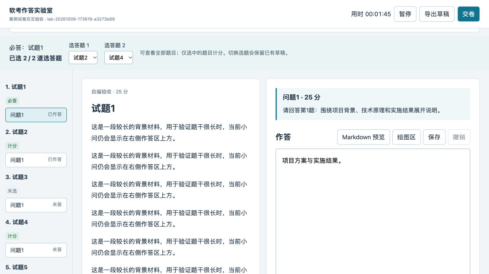
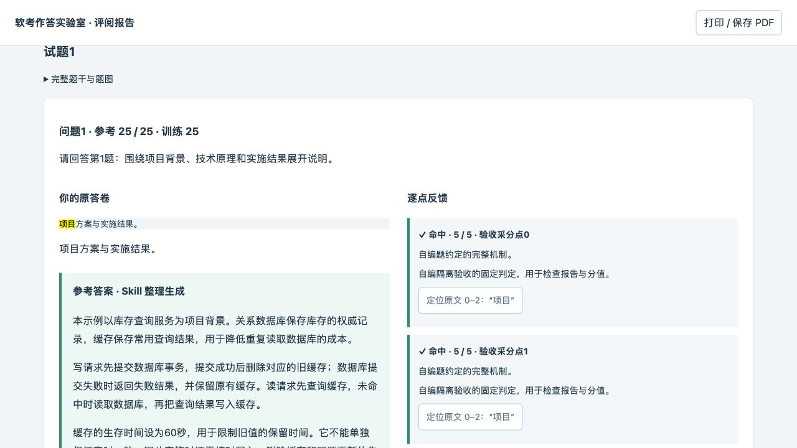

# v0.7.0 — 按原卷作答、论文评阅与完整参考答案

发布日期：2026-10-09。

## 作答界面

当前小问的完整描述同时显示在右侧作答区上方，长题干中的提问无需来回翻找。年度试卷顶部显示原卷要求、必答与选答规则、满分和单科合格线。

案例卷按原卷选择计分题。2018年试卷一必答、二至五任选两题，共75分；未选题可预览，已写草稿会保留。选齐后开始，交卷时冻结选题。明确请求全题训练时仍使用练习模式，不套用正式试卷合格结论。

论文按原卷选一篇，2018年为四选一；提供独立摘要与正文、字数信息和本题论述要求。每个论题按75分准备，报告只计所选一篇。不同年份的候选题数量及字数要求以实际原卷为准。

## 回看与评分

每个计分小问的原作答下方显示完整参考答案及出处。已有来源只有概括建议时，当前 Agent 根据题干、可靠解析和冻结采分点补成完整应试答案，并标明 Skill 整理生成。论文须提供完整摘要和正文参考范文；模拟项目与假设明确标注，不能代替用户真实项目经历。

报告以参考估分对照当期单科合格线，显示及格、不及格或待核验；按实际失分排列小问与考点，并区分错误和遗漏。未选题不算遗漏，待核验权重不当成已知失分。论文另展示原卷论述要求的覆盖情况和摘要、正文的字数核对。

[人社部2018年下半年通知](https://rst.fujian.gov.cn/zw/zxwj/rsbwj/201902/t20190219_4762650.htm)规定各科满分75分、45分合格；[2026年官方报考问答](https://rsj.gz.gov.cn/ywzt/rcgz/rsks/bmtz/content/post_10736860.html)继续说明满分60%的合格标准。论文按原卷要求及实际取得的官方写作要点评阅；未公开的逐点权重明确标为推定训练评分，不冒充官方细则。

## 保存与续接

保留常驻20步正文撤销，论文摘要与正文共同参与当前论题的撤销记录。论文刷新直接恢复所选论题；切换论题保留各自草稿。恢复浏览器图稿备份时重新生成对应PNG，避免有可编辑图稿却无法保存。

正式卷使用新增 `exam` 规则、`selected_case_ids` 和 `--paper-kind`。旧的全题练习仍保留原有身份与分数，不能把125分直接按比例换算为75分。旧版评阅缺少完整参考答案时，需依据实际题目补齐后再生成新报告，历史版本保留。

## 安装与更新

下载 Release 中的 `ruankao-toolkit-v0.7.0.zip`，按 README 完整升级 Skill。已有作答服务应在保存草稿后重新启动，并将新版 `assets/frontend/dist/` 同步到本场 `public/static/` 后刷新。WORKLOG 等已有权威源与发现桥接的工作区沿用原组织方式。

安装包包含八个 Skill、运行器、预构建前端、初始资料与 SMTP／POP3 样章，排除在线复习册 `artifacts/`。安装者无需 npm 或额外模型API。

## 验证范围

- 19项新增规则测试与35项既有实验室测试通过：75分分母、45分边界、必答选答、冻结与续接、未选题过滤、待核验、论文结构、审题映射及完整参考答案。
- 内建浏览器在隔离自编场次实际完成案例选题、编辑、切题、刷新、交卷和报告；确认45/75及格、主要失分及原答卷下的完整参考答案。
- 论文实测四选一、摘要正文编辑与撤销、切题保留、刷新回到已选论题、交卷，以及30/75不及格和审题字数核对。参考范文包含232字摘要和2470字模拟项目正文。
- 停止隔离服务后实际绘制未落盘图稿，重新打开并恢复，确认图稿及新PNG成功保存。临时服务在验收后关闭。
- 桌面与820像素宽度检查通过。评分分支使用自编题和固定评分决定，验证软件规则与呈现；不宣称完成真实论文的官方语义阅卷。Antigravity等其它客户端与物理触控未单独实测。

安装与升级测试6项、跨平台路由测试22项、包结构验证测试9项通过，连同实验室规则测试共91项。工具包校验确认8个Skill、127篇初始资料和21本空白错题本完整，Markdown链接、离线资源及个人资料隔离检查通过；Skill元数据校验通过。
