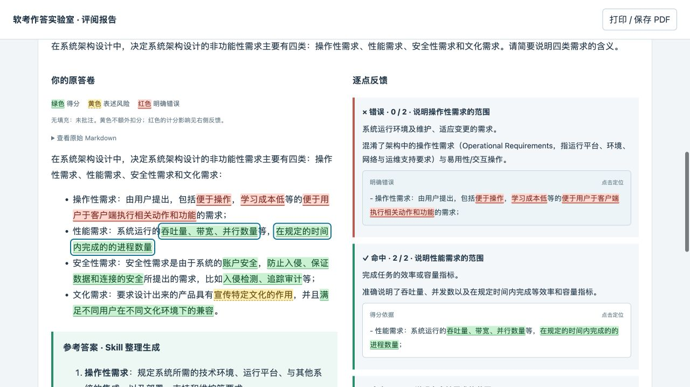
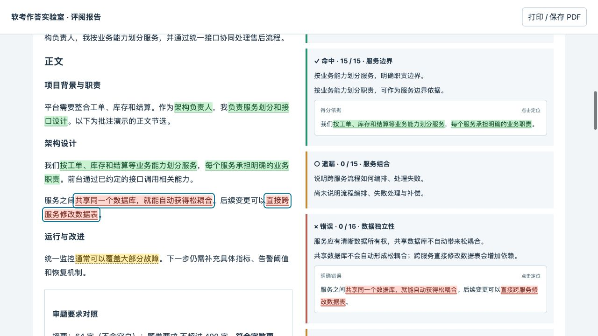
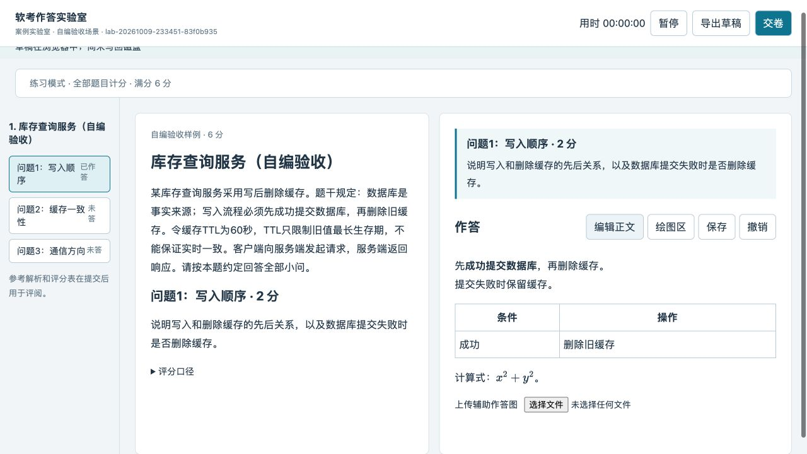

# v0.8.0 — 案例与论文原文三色批注

发布日期：2026-10-09。

## 在原答卷上看见具体得失

评阅页在“你的原答卷”下展示带批注的 Markdown，完整参考答案仍位于其下方。绿色标出真正满足采分条件的词句，黄色提示有依据的表述风险，红色标出明确错误；中性内容保持原样。原始 Markdown 收入可展开区域，方便核对。



上图采用答卷作者明确授权的 2018 年下半年试题一、问题 1 作答节选。原判定和 6/8 分保持不变，新增精确词句标记及不扣分的文化需求表述提示。发布的是界面截图，未包含原场次档案、个人题库和本机路径。

## 引文与批注使用同一组证据

右侧反馈去掉数字偏移，以高亮引文直接说明在哪里得分或出错。点击引文后，页面定位并框出左侧对应词句；悬停可查看关联评语。重复出现的词句按原文位置区分，不能把后文的证据染到前文。

黄色提示不额外扣分。红色仍根据冻结评分标准体现未得分、来源细则扣分或严格训练扣分，同一原因保持去重。遗漏没有原文可涂，待核验尚未定论，两者不自动生成错误颜色。重叠批注优先展示红、黄、绿，保留各条反馈的解释。

## 论文与 Markdown 呈现

论文摘要、正文使用同样的精确批注方式，并保留论述要求对照和完整参考范文。列表、加粗、表格、代码及公式继续正常显示；公式作为完整记号单元高亮。打印样式保留批注色和右侧引文。



此图为自编 SOA 论文片段，固定分值用于验证交互，不代表真实论文的官方语义阅卷。



## Skill 与更新方式

- 阅卷时为文本证据添加 `focus`，以绝对 Python Unicode 字符偏移选择最小完整词组或短句，保留必要条件和否定词。
- `warnings` 保存有依据的表述风险，必须注明具体片段、评语与来源；它不参与分数和错题统计。
- 案例、论文沿用同一套阅卷 SOP，不能根据关键词直接自动给分，也不能为了凑颜色制造风险。
- README 将 Lab 作答、批注复盘和真实截图放在首屏，题库整理等能力随后介绍。

从 Release 下载 `ruankao-toolkit-v0.8.0.zip`，按 README 完整升级 Skill。使用者无需 npm 或额外模型 API。保存草稿后再重启已有服务，将新版前端资源同步到该场 `public/static/`。

历史报告可以按原证据范围着色；精确词句和新的黄色提示需要 Agent 补充 `focus`、`warnings` 后生成新评阅版本。原答卷、评分规则和旧报告保留。

## 验证

- 新增 13 项前端行为测试：三色与中性文本、重复词句、Unicode 偏移、加粗/列表/表格、实体/转义、引用续行、代码空白、公式、重叠批注、长论文和原有 HTML 边界。
- 新增 6 项证据与计分测试：精确片段保存、错误范围拒绝、黄色提示不扣分、跨题关联及扣分字段拒绝、训练扣分证据、论文合成原文偏移。
- 35 项既有实验室测试、19 项试卷规则测试、6 项安装测试、22 项路由测试、9 项包结构测试通过，共 110 项。
- 内建浏览器实测真实案例节选和自编论文的三色、引文点击定位、原始文本展开、无数字偏移；桌面及 820 像素窄屏无横向溢出。作答预览的表格、加粗和本地 KaTeX 公式正常。
- 测试页面、临时服务在验收后关闭。其它 Agent 客户端、物理触控与实际打印机未单独实测。

开发验证命令（前端依赖先在其目录执行 `npm ci`）：

```sh
node --test --test-concurrency=1 tests/test_lab_annotations.mjs
python3 -m unittest discover -s tests -p test_soft_exam_annotations.py -v
```

临时构建目录通过环境变量 `SOFT_EXAM_FRONTEND_ROOT` 指定，不需要把依赖安装到资料库。
