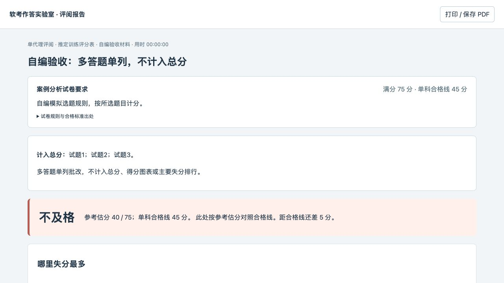
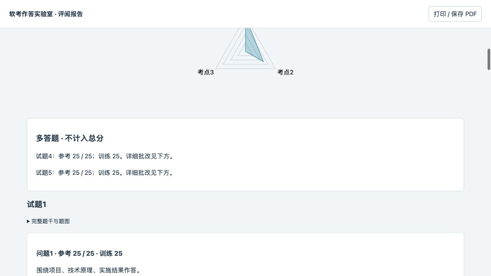

# v0.8.3 — 真题自动选答计分与多答题单列批改

发布日期：2026-10-10。

## 按原卷确定计分范围

在已调用 Lab 或已有场次中说明“按照真题评分标准”，Agent 会核实原卷必答、选答、超选规则及合格线。对2018案例卷，试题一始终计入，试题二至五按题号从小到大取前两道已答题。系统依据提交的非空文字、附件和用户图稿识别作答；纯题图底图与删除的图形不算。选取按核实题号进行，不按页面数组顺序，也不按得分择优。

该模式无需手动勾选，页面允许直接作答全部候选题。交卷、到时提交和离线导入使用相同规则。少答时总分仍为原卷75分，并显示空缺分值；未答的非计分候选题不记为遗漏。其它年份须核实原卷处理超选的具体方式，不能一律套用2018规则。

## 多答题仍可复盘

额外已答题提供完整参考答案、逐点批改与单独得分，明确标注“不计入总分”。网页开头的参考分、训练分、合格判定、得分图表、考点覆盖和主要失分排行均只统计有效计分题。补充题的待核验状态不改变已核实计分题的合格结论；补充评阅仍须完成核验才结束归档。

下列为独立自编验收：计分题得40/75，即使另两题各得25分，总分仍为40/75。

## 旧场次与升级

旧案例题包缺少正式卷规则时，可通过 evaluation 中的 `exam_reassessment` 记录用户请求、规则和更正原因，在原场次重新求和。原题包、原始提交、评分表及历史报告保留，后续重评沿用更正后的口径。report/index/offline 入口使用一致的规则；旧练习中误记为遗漏的非计分题保留备份后移出当前错题记录。此流程不进行125分到75分的比例换算。

下载 `ruankao-toolkit-v0.8.3.zip`，按 README 更新完整 Skill。包内包含重建后的页面，使用者不需要 npm。生成新报告时更新场次的运行资源，并保留历史评阅数据。

## 验证

- 75项 Python 定向测试通过：自动选答8项、运行器35项、年度试卷与论文20项、参考答案一致性6项、三色证据6项。
- 13项前端批注测试通过；使用锁定依赖完成生产构建。
- 独立 HTTP 自编场景实测无需勾选即可开始、第四题可直接作答、多答题各25分单列且不改变40/75主分数，计分图表和失分排行只含前三题。
- 既有案例文件重评为39/75、不及格，差6分；仅计入试题一、二、四的9问59个采分点，原始作答与对应得分保留。个人档案不进入公开安装包。

浏览器验证使用独立 HTTP 自编场景；本地 file:// 页面的自动刷新受 URL 策略限制，需手动刷新。实际报告已核对磁盘内容及三个入口的一致性。Windows、其它 Agent 的完整对话和物理触控未重新测试。
