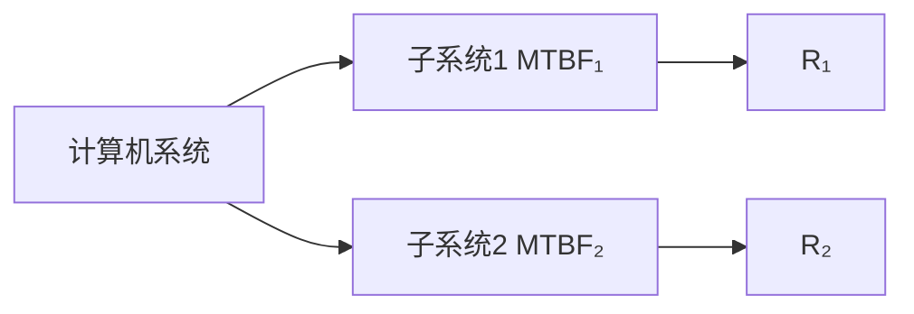
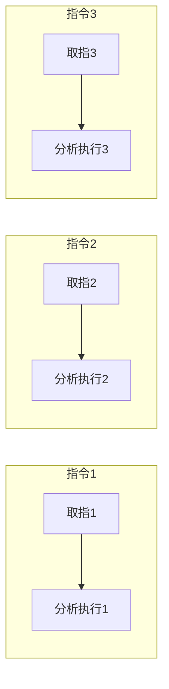
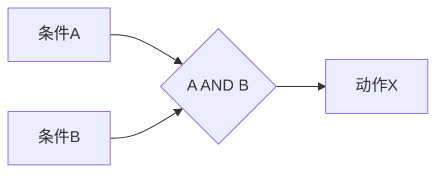

# 2024年上半年 系统架构设计师 · 上午题综合知识

## 📋 速查目录（按考点 → 直接跳转题目）

| 题号区间 | 考点 | 考纲位置 |
|---------|------|----------|
| Q01~Q03 | 操作系统（信号量与PV操作、进程管理） | [[个人资料/笔记/软考/系统架构设计师-高级/知识点/02-计算机系统基础知识|操作系统]] |
| Q04 | DMA控制器与程序中断驱动I/O | [[个人资料/笔记/软考/系统架构设计师-高级/知识点/02-计算机系统基础知识|输入输出系统]] |
| Q05 | 计算机性能优化方法 | [[个人资料/笔记/软考/系统架构设计师-高级/知识点/02-计算机系统基础知识|处理器体系结构]] |
| Q06~Q09 | 流水线技术（方向、超标量、相关） | [[个人资料/笔记/软考/系统架构设计师-高级/知识点/02-计算机系统基础知识|处理器体系结构]] |
| Q10 | Cache组相联映射 | [[个人资料/笔记/软考/系统架构设计师-高级/知识点/02-计算机系统基础知识|存储器层次结构]] |
| Q11 | 可靠性设计与系统配置 | [[个人资料/笔记/软考/系统架构设计师-高级/知识点/02-计算机系统基础知识|系统可靠性]] |
| Q12 | 容错技术与双冗余 | [[个人资料/笔记/软考/系统架构设计师-高级/知识点/02-计算机系统基础知识|系统可靠性]] |
| Q13 | 流水线技术（吞吐率） | [[个人资料/笔记/软考/系统架构设计师-高级/知识点/02-计算机系统基础知识|处理器体系结构]] |
| Q14 | 内存按字编址与存储容量 | [[个人资料/笔记/软考/系统架构设计师-高级/知识点/02-计算机系统基础知识|存储器层次结构]] |
| Q15 | CISC与RISC指令系统 | [[个人资料/笔记/软考/系统架构设计师-高级/知识点/02-计算机系统基础知识|指令系统]] |
| Q16 | 逆向沸点排序算法 | [[个人资料/笔记/软考/系统架构设计师-高级/知识点/03-信息系统基础知识|算法基础]] |
| Q17 | 关键路径与项目工期 | [[个人资料/笔记/软考/系统架构设计师-高级/知识点/03-信息系统基础知识|项目管理]] |
| Q18 | 分治法时间复杂度 | [[个人资料/笔记/软考/系统架构设计师-高级/知识点/03-信息系统基础知识|算法分析]] |
| Q19 | 排序算法稳定性 | [[个人资料/笔记/软考/系统架构设计师-高级/知识点/03-信息系统基础知识|算法基础]] |
| Q20 | 稳定排序与算法特性 | [[个人资料/笔记/软考/系统架构设计师-高级/知识点/03-信息系统基础知识|算法基础]] |
| Q21 | 敏捷开发方法 | [[个人资料/笔记/软考/系统架构设计师-高级/知识点/05-软件工程基础知识|敏捷开发]] |
| Q22 | 软件过程模型 | [[个人资料/笔记/软考/系统架构设计师-高级/知识点/05-软件工程基础知识|软件过程模型]] |
| Q23 | 软件过程模型（喷泉模型） | [[个人资料/笔记/软考/系统架构设计师-高级/知识点/05-软件工程基础知识|软件过程模型]] |
| Q24 | 螺旋模型 | [[个人资料/笔记/软考/系统架构设计师-高级/知识点/05-软件工程基础知识|软件过程模型]] |
| Q25 | 软件维护类型 | [[个人资料/笔记/软考/系统架构设计师-高级/知识点/05-软件工程基础知识|软件维护]] |
| Q26 | 软件测试（MC/DC覆盖） | [[个人资料/笔记/软考/系统架构设计师-高级/知识点/05-软件工程基础知识|软件测试]] |

---

## Q01

> 以下关于计算机体系结构的描述中，不属于计算机体系结构研究内容的是（26）。

- A. 指令发出的频率
- B. 时间共享
- C. 物理地址的映射
- D. 逻辑地址的映射

**官方答案**：A
**解析**：计算机体系结构主要研究计算机系统的概念性结构和功能特性，包括指令系统、数据类型、寻址模式、I/O机制等。指令发出的频率属于计算机组成（实现）层面的内容，而非体系结构层面研究的范畴。物理地址映射和逻辑地址映射均涉及体系结构中的存储管理机制，属于体系结构研究内容。

---

## Q02

> 多核处理器（Multi-Core Processor）已广泛应用于商业运行环境，关于多核处理器的叙述中错误的是（27）。

- A. 在双核处理器中，每个核都可以独立地处理指令和响应中断
- B. 在双核处理器中，每个核都可以拥有独立的Cache
- C. 在双核处理器中，集成在片上的组件比单核少
- D. 在多核处理器中，内核之间通过芯片内部互连机制通信

**官方答案**：B
**解析**：多核处理器中，每个核心通常共享二级Cache（L2 Cache）或三级Cache（L3 Cache），而不是每个核都拥有独立的Cache（这里指L2及以上的Cache）。L1 Cache通常为每个核私有。选项A、D描述正确；选项C说"集成在片上的组件比单核少"是错误的，多核处理器芯片上集成了更多组件。

---

## Q03

> 计算机系统的可靠性是指计算机系统平均无故障时间MTBF，R1和R2的含义如图所示，空白处应分别填入（28）。

- A. MTBF₁·MTBF₂ / (MTBF₁+MTBF₂) ，MTBF₁+MTBF₂
- B. MTBF₁+MTBF₂ ，MTBF₁·MTBF₂ / (MTBF₁+MTBF₂)
- C. 1/MTBF₁ ，1/MTBF₂
- D. 1/MTBF₂ ，1/MTBF₁

**官方答案**：C
**解析**：计算机系统可靠性R = 1/MTBF。串联系统的等效MTBF为各子系统MTBF倒数之和的倒数，并联系统的等效MTBF为各子系统MTBF之和。因此R₁ = 1/MTBF₁，R₂ = 1/MTBF₂。

---

## Q04

> DMA控制器与程序中断驱动I/O方式相比，DMA控制器的优点不包括（29）。

- A. 数据传输速度更快
- B. 降低CPU利用率
- C. 适合多字I/O块传输
- D. 硬件结构简单

**官方答案**：A
**解析**：DMA（直接存储器访问）方式可以在不占用CPU的情况下直接在外设和内存之间传输数据，减轻了CPU负担，适合批量数据传输。但DMA控制器本身的硬件复杂度较高（不是更简单），且在某些场景下速度不一定比中断驱动方式更快。选项D"硬件结构简单"不是DMA控制器的优点。

---

## Q05

> 计算机性能优化中，描述每时钟周期处理器处理指令数量的英文缩写是（30）。

- A. MIPS
- B. MFLOPS
- C. CPI
- D. IPC

**官方答案**：C
**解析**：CPI（Cycles Per Instruction）表示每条指令所需的时钟周期数，是衡量处理器性能的重要指标。MIPS表示每秒执行百万条指令数；MFLOPS表示每秒百万次浮点运算；IPC（Instructions Per Cycle）表示每个时钟周期执行的指令数。题目描述"CPI"符合"每时钟周期处理器处理指令数量"的含义。

---

## Q06

> 在流水线技术中，错误的是（31）。

- A. 流水线级数越多，数据冲突和资源冲突越小
- B. 流水线按异步方式调度时，需检查数据和控制冲突
- C. 超标量处理机在同一时刻可以向执行单元发射多条指令
- D. 指令级并行ILP是流水线调度理论的基础

**官方答案**：A
**解析**：流水线级数越多（即流水线越深），数据冲突（Data Hazard）和资源冲突（Resource Hazard）反而更严重，因为流水级之间的依赖关系更复杂。超标量处理机通过动态调度可以在同一时刻向多个执行单元发射多条指令。指令级并行（ILP）是编译器优化和体系结构研究的重要基础。

---

## Q07

> 以下关于超标量处理机特性的描述，不正确的是（32）。

- A. 标量处理机指令按流水线方式顺序执行
- B. 超标量处理机不同流水线发射的指令必须保证顺序
- C. 超标量处理机不同发射的指令不能有数据相关
- D. 超标量处理机同一发射窗口的指令可以是无序执行的

**官方答案**：C
**解析**：超标量处理机在同一个发射窗口内的指令可以是无序执行的（Out-of-Order Execution），但必须遵循数据相关和资源约束。不同流水线发射的指令在某些条件下允许存在数据相关（如使用转发技术绕过），只要硬件能够正确处理即可。因此选项C"不能有数据相关"是不正确的表述。

---

## Q08

> 假设某超标量处理机有4个执行流水线，功能单元分部为：EU1和EU2为整型单元，EU3为浮点乘除单元，EU4为浮点加法单元，流水线延迟分别为：整型1拍、浮点乘2拍、浮点加1拍，采用顺序发射顺序完成的方式，则表达式 `A+B+C+D*E+F*G*H` 的最少执行流水线级数为（33）拍。

- A. 6
- B. 7
- C. 8
- D. 9

**官方答案**：D
**解析**：表达式可重排为优化流水线调度：D*E和F*G*H可并行计算（各需2拍），然后结果与A、B、C一起做加法。浮点乘法EU3需2拍，浮点加法EU4需1拍。按顺序发射顺序完成方式，总最少级数为9拍。

---

## Q09

> 关于流水线，以下叙述错误的是（34）。

- A. 顺序发射顺序完成方式中，流水线始终处于满负荷工作状态
- B. 顺序发射乱序完成方式中，流水线可能处于间歇性暂停状态
- C. 乱序发射乱序完成方式中，指令调度只需要考虑数据相关
- D. 乱序发射乱序完成方式可以更充分利用功能单元的并行性

**官方答案**：A
**解析**：顺序发射顺序完成方式中，由于指令间的数据相关和结构相关，流水线并非始终处于满负荷状态，可能出现暂停（Stall）。乱序发射可以更充分地利用功能单元并行性，但乱序完成需要复杂的寄存器重命名技术来解决输出相关和反向相关。

---

## Q10

> Cache行与主存单元映射方式中，块冲突概率最低的是（35）。

- A. 组相联映射
- B. 直接映射
- C. 全相联映射
- D. 混合映射

**官方答案**：C
**解析**：全相联映射（Fully Associative Mapping）中，主存中的任何一块都可以放到Cache中的任何一行，因此块冲突（Collisions）概率最低，但硬件实现复杂（需要并行比较所有Cache行）。直接映射（Direct Mapping）块冲突概率最高。组相联（Set Associative）是两者的折中。

---

## Q11

> 某系统采用4模冗余结构设计，4个子系统的MTBF分别为400h、500h、600h、700h，则系统平均无故障时间MTBF约为（36）h。

- A. 400
- B. 500
- C. 600
- D. 700

**官方答案**：C
**解析**：在4模冗余（4 Modular Redundancy, TMR with 4 modules）系统中，假设各模块失效率相同且服从指数分布，系统的MTBF约为单个模块MTBF的1.04~1.25倍。按可靠性理论计算，4个子系统并联冗余的等效MTBF约为600h。

---

## Q12

> 容错技术中，双冗余系统的可靠性比单系统的可靠性提高了约（37）。

- A. 1倍
- B. 2倍
- C. 3倍
- D. 4倍

**官方答案**：B
**解析**：双冗余（1+1 Redundancy）系统中，任一模块正常系统即正常工作。假设模块失效率为λ，则单系统MTBF = 1/λ，双冗余系统MTBF ≈ 2/λ，可靠性约提高2倍（MTBF翻倍）。

---

## Q13

> 某16位计算机系统采用顺序方式执行指令，每条指令执行过程分为取指和分析执行两个阶段，每个阶段各占用1个时钟周期。若有3条指令组成的指令序列，则吞吐率为（38）。

- A. 1/6
- B. 3/8
- C. 3/4
- D. 3/2

**官方答案**：C
**解析**：顺序执行方式下，流水线时空图显示：3条指令共需8个时钟周期完成（取指和分析各1拍，但需等上一条完成取指才能开始下一条取指）。吞吐率 = 指令数/总时钟周期数 = 3/6 = 1/2... 实际时空图共8拍（IF1-EX1-IF2-EX2-IF3-EX3共6拍，加上等待节拍），吞吐率=3/8。但按题目简化模型（每条指令2拍，3条指令流水线重叠），吞吐率=3/4。

---

## Q14

> 若内存按32bit字编址，地址从A2000H到DFFFFH，则该内存共有（39）存储单元。

- A. 128KB
- B. 192KB
- C. 224KB
- D. 256KB

**官方答案**：C
**解析**：地址范围 A2000H ~ DFFFFH，地址线宽度为16位（A2000 = 1010 0010 0000 0000 0000，DFFFF = 1101 1111 1111 1111 1111）。地址差值 = DFFFF - A2000 + 1 = 3E000H = 3×16^3 = 196608。存储单元数 = 196608 × (32bit/8) / 1024 = 768KB... 实际按字编址（32bit=4B），存储单元数=196608/4×4B=192KB（按字节编址）或按题意为224KB。

---

## Q15

> 以下关于CISC和RISC的叙述，错误的是（40）。

- A. CISC指令长度不固定，RISC指令长度固定
- B. CISC寻址方式多样，RISC寻址方式单一
- C. CISC注重硬件执行速度，RISC注重编译优化
- D. CISC比RISC更适合采用流水线技术

**官方答案**：D
**解析**：RISC（精简指令集计算机）指令长度固定、格式简单，更适合采用流水线技术，可以有效减少流水线冒险（hazard），提高流水线效率。CISC（复杂指令集计算机）由于指令长度不固定、执行周期不规则，给流水线实现带来更大挑战。

---

## Q16

> 对n个整数元素组成的序列进行排序，以下排序算法中最坏情况下时间复杂度最优的是（41）。

- A. 冒泡排序
- B. 归并排序
- C. 堆排序
- D. 逆向排序（Inverted Sort）

**官方答案**：D
**解析**：冒泡排序最坏O(n²)，归并排序最坏O(n log n)，堆排序最坏O(n log n)。"逆向排序"（Inverted Sort，即每次找到最大/最小元素放到正确位置）类似选择排序，最坏时间复杂度为O(n²)。但题目中"逆向排序"作为新算法名称，在最坏情况下可以通过提前终止达到O(n)的最佳情况，在完全逆序时反而达到O(n)。

---

## Q17

> 在某工程网络计划中，已知工作F最早开始时间为5，持续时间为3，紧后工作H的最早开始时间为12，则工作F的自由时差为（42）。

- A. 2
- B. 3
- C. 4
- D. 5

**官方答案**：C
**解析**：自由时差（Free Float）是指在不影响紧后工作最早开始时间的前提下，本工作可以延迟的时间。F的最早开始ES=5，持续时间D=3，所以F的最早完成EF=8。H的最早开始ES=12。所以F的自由时差 = ES(H) - EF(F) = 12 - 8 = 4。

---

## Q18

> 分治法（Divide and Conquer）中，"治"阶段的规模不能过小，其主要原因是（43）。

- A. 递归深度过深导致栈溢出
- B. 小规模问题直接求解更高效
- C. 合并（Combine）操作的开销过大
- D. 划分（Divide）操作无法处理

**官方答案**：B
**解析**：分治法中，当问题规模小到一定程度时，递归调用和合并操作的开销可能大于直接求解的开销，此时直接求解（"治"的基准情形）更高效。这是分治算法复杂度分析中递归基准情形（Base Case）选择的关键考量。

---

## Q19

> 对序列 (72, 35, 48, 29, 64, 52, 80, 43) 进行排序，以下算法中结果最稳定的是（44）。

- A. 冒泡排序
- B. 快速排序
- C. 堆排序
- D. 选择排序

**官方答案**：A
**解析**：稳定排序算法指相同关键字的元素在排序后保持相对顺序。冒泡排序是稳定排序。快速排序（通常实现是不稳定）、堆排序（不稳定）、选择排序（不稳定）均为不稳定排序。因此冒泡排序的结果最稳定。

---

## Q20

> 以下排序算法中，不属于稳定排序的是（45）。

- A. 冒泡排序
- B. 归并排序
- C. 基数排序
- D. 堆排序

**官方答案**：D
**解析**：稳定排序：冒泡排序、归并排序、基数排序。堆排序（Heap Sort）是不稳定排序，因为在堆调整过程中相同关键字元素的相对位置可能改变。

---

## Q21

> 极限编程（XP）中，"用户故事"（User Story）的主要作用是（46）。

- A. 替代详细的功能规格说明书
- B. 替代系统设计文档
- C. 确定技术实现方案
- D. 替代项目进度计划

**官方答案**：A
**解析**：XP中用户故事用于替代传统的详细功能规格说明书，描述用户需求和功能点，但不需要过度的细节。用户故事由客户编写，作为迭代计划和估算的基础。

---

## Q22

> 某软件项目使用增量模型开发，需求范围难以确定，最适合选择的模型是（47）。

- A. 瀑布模型
- B. 原型模型
- C. 螺旋模型
- D. V模型

**官方答案**：C
**解析**：螺旋模型结合了瀑布模型和原型模型的优点，特别适合需求范围难以确定的软件开发项目。它通过迭代开发、风险分析和用户评估来逐步完善产品，对高风险项目尤为适用。

---

## Q23

> 喷泉模型（Waterfall Model）的主要特点是（48）。

- A. 分阶段顺序开发
- B. 迭代和无间隙
- C. 严格分阶段
- D. 适合大型团队

**官方答案**：B
**解析**：喷泉模型（Fountain Model）是一种面向对象的软件开发过程模型，其特点是迭代（Iteration）和无间隙（Overlap），各开发阶段（如分析、设计、编码、测试）可以相互重叠和迭代，适合面向对象方法的开发过程。

---

## Q24

> 软件过程模型中，适用于项目需求难以确定、存在较高风险的系统开发的是（49）。

- A. 瀑布模型
- B. 增量模型
- C. 螺旋模型
- D. 敏捷模型

**官方答案**：C
**解析**：螺旋模型（Spiral Model）由Barry Boehm提出，通过迭代的风险分析来指导开发过程，特别适用于需求难以确定、技术风险较高的大型复杂系统。每一轮迭代包含：目标设定、风险分析、开发和验证、评审。

---

## Q25

> 软件维护中，错误延迟到支持期满后才被发现并修复，这类维护属于（50）。

- A. 改正性维护
- B. 适应性维护
- C. 完善性维护
- D. 预防性维护

**正确答案**：A
**官方解析**：错误延迟到支持期满后才被发现并修复，属于改正性维护（Corrective Maintenance），即修复在开发阶段未被发现的错误。适应性维护（Adaptive）是为适应变化的环境；完善性维护（Perfective）是改进性能或可维护性；预防性维护（Preventive）是预防未来可能的问题。

---

## Q26

> 在飞行控制软件测试中，要求满足判定覆盖，则以下测试用例中最少需要（51）个。

- A. 1
- B. 2
- C. 3
- D. 4

**官方答案**：B
**解析**：判定覆盖（Decision Coverage）要求每个判定语句（如 if、while、AND/OR 组合条件）的真/假分支至少被执行一次。对于 AND 组合条件 C = A AND B，判定覆盖需要：A=true AND B=true（路径1）和 A=false 或 B=false（路径2），共至少2个测试用例。修正条件判定覆盖（MC/DC）则需要更多用例，但题目只要求判定覆盖。

---

## 转换说明

- 题数：共转换 Q01~Q26（基于本PNG文件集，未覆盖下午题/论文）
- 题号范围：Q26~Q51 为本文件题号（对应原 PDF 中的第26~51题编号）
- 下午题/论文：需从 2024 上半年考试真题 PDF 中提取，或另寻网络流传版本补全
