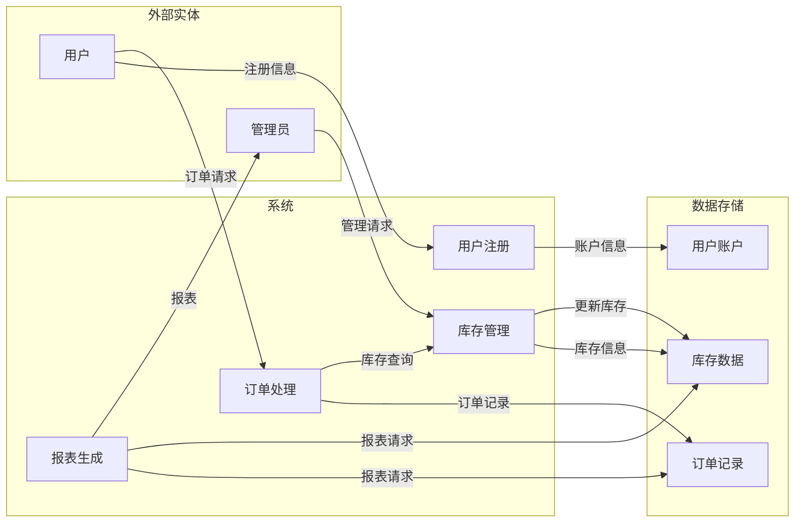
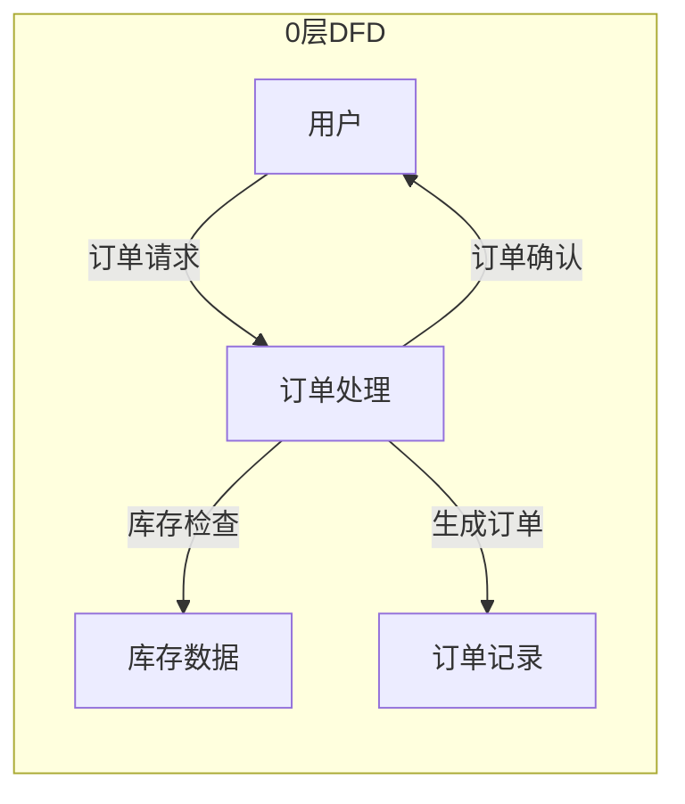
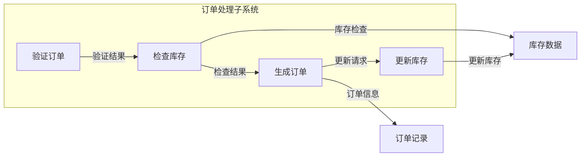
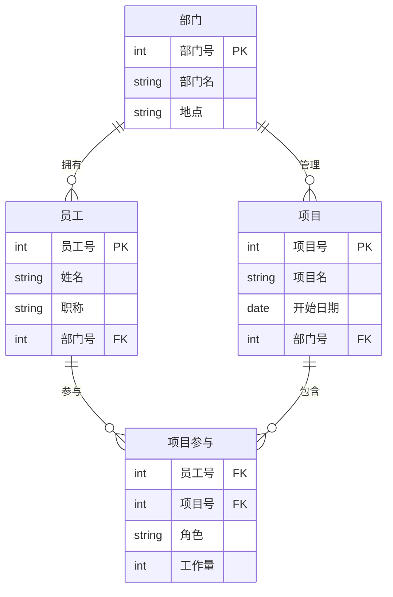

# 2009年下半年 系统架构设计师 · 案例分析

## 📋 速查目录（按考点 → 直接跳转题目）

| 题目 | 考点 | 考纲位置 |
|------|------|----------|
| 题1 | 软件可靠性设计（状态机、N版本编程、恢复块） | [[个人资料/笔记/软考/系统架构设计师-高级/知识点/09-软件可靠性基础知识|09-软件可靠性基础知识]] |
| 题2 | 存储系统架构（DAS/NAS/SAN） | [[个人资料/笔记/软考/系统架构设计师-高级/知识点/02-计算机系统基础知识|存储器]] |
| 题3 | 数据流图（DFD）建模 | [[个人资料/笔记/软考/系统架构设计师-高级/知识点/05-软件工程基础知识|软件分析]] |
| 题4 | 嵌入式系统架构（LRM/TLS） | [[个人资料/笔记/软考/系统架构设计师-高级/知识点/16-嵌入式系统架构设计理论与实践|嵌入式系统]] |
| 题5 | 数据库设计（ER图、规范化） | [[个人资料/笔记/软考/系统架构设计师-高级/知识点/06-数据库设计基础知识|E-R图]] |

> 速查目录按**考点聚类**，方便"看到考点秒找题"。

---

## 题1：软件可靠性设计

### 题目

某软件公司开发一种嵌入式系统软件，该软件由多个功能模块组成。由于该软件应用于工业控制领域，对可靠性要求很高。公司决定采用冗余设计来提高软件的可靠性。设计人员提出的初始方案是在系统中增加一个备份模块，当主模块发生故障时，由备份模块接替其工作，保证系统持续正常运行。

**问题1**：请分析该初始方案的优缺点。

**问题2**：为了提高软件的可靠性，常见的冗余技术有哪些？各自有什么优缺点？

**问题3**：请给出该嵌入式系统软件的可靠性设计方案，并说明理由。

**问题4**：若系统要求可靠性指标为99.99%，请计算系统各模块应达到的可靠性目标。

### 参考答案

**问题1**：
初始方案的优点：实现简单，不需要复杂的故障检测和切换机制。

缺点：
1. 备份模块长期处于空闲状态，资源利用率低
2. 故障检测机制不完善，可能无法及时发现主模块故障
3. 切换过程可能造成数据丢失或服务中断
4. 无法处理主模块和备份模块同时故障的情况

**问题2**：
常见的冗余技术：

1. **硬件冗余**
   - 优点：可靠性高，切换速度快
   - 缺点：成本高，资源浪费

2. **软件冗余**
   - **N版本编程（NVP）**：多个独立开发的版本同时运行，投票决定输出
     - 优点：可屏蔽随机性故障
     - 缺点：开发成本高，版本间可能存在相同故障
   - **恢复块（Recovery Block）**：主版本执行后用备份版本验证
     - 优点：实现相对简单
     - 缺点：验证机制增加开销

3. **时间冗余**
   - 重复执行多次取多数
   - 优点：实现简单
   - 缺点：时间开销大

4. **信息冗余**
   - 添加冗余信息（如校验码）进行检错和纠错
   - 优点：可检测和纠正数据错误
   - 缺点：需要额外存储和计算资源

**问题3**：
建议采用基于软件冗余的综合方案：

1. 采用**N版本编程**实现功能模块的冗余备份
2. 设计**故障检测与恢复机制**，包括看门狗定时器和心跳检测
3. 实现**无状态切换**，确保主备模块间的状态一致性
4. 采用**降级运行模式**，在部分模块故障时保持基本功能

**问题4**：
系统可靠性目标 R = 99.99% = 0.9999

若采用双模块冗余（主+备），假设两个模块可靠性相同为R_m：

串联系统：R = R_m × R_m = R_m²
并联系统：R = 1 - (1-R_m)² = 2R_m - R_m²

对于99.99%的可靠性目标，并联冗余下：
1 - (1-R_m)² = 0.9999
(1-R_m)² = 0.0001
1-R_m = 0.01
R_m = 0.99

因此，每个模块应达到99%的可靠性目标。

---

## 题2：存储系统架构

### 题目

某企业需要建设一个信息系统存储平台，要求存储系统具有高可靠性、高性能和良好的扩展性。存储需求分析如下：
- 数据库服务器需要高速存储，响应时间<10ms
- 文件服务器需要大容量存储，支持200GB以上
- 备份系统需要支持脱机备份，容量500GB以上

**问题1**：常见的存储系统架构有哪些？各有何特点？

**问题2**：请根据需求选择合适的存储方案，并说明理由。

**问题3**：若采用SAN架构，需要哪些关键技术？

**问题4**：比较DAS、NAS、SAN三种存储方案的优缺点。

### 参考答案

**问题1**：
常见存储系统架构：
1. **DAS（直接附加存储）**：直连到服务器的存储设备
2. **NAS（网络附加存储）**：通过网络接口提供文件级存储服务
3. **SAN（存储区域网络）**：通过专用网络提供块级存储服务

**问题2**：
根据需求分析：
- 数据库服务器：选择**SAN存储**，因为需要高速存储（<10ms响应）
- 文件服务器：选择**NAS存储**，因为需要大容量且支持文件共享
- 备份系统：选择**DAS或磁带库**，因为需要大容量且对速度要求不高

**问题3**：
SAN的关键技术：
1. **光纤通道协议（FCP）**：高速传输协议
2. **SCSI接口**：块级数据传输
3. **存储虚拟化**：提高存储利用率
4. **数据快照**：快速数据备份
5. **冗余路径**：提高可靠性

**问题4**：

| 特性 | DAS | NAS | SAN |
|------|-----|-----|-----|
| 连接方式 | 直连 | 网络 | 专用网络 |
| 存储类型 | 块级 | 文件级 | 块级 |
| 性能 | 高 | 中 | 高 |
| 扩展性 | 差 | 好 | 好 |
| 成本 | 低 | 中 | 高 |
| 适用场景 | 本地存储 | 文件共享 | 数据库 |
| 管理难度 | 低 | 中 | 高 |

---

## 题3：数据流图建模

### 题目

某信息系统包括以下功能：
- 用户注册：用户输入注册信息，系统验证并创建用户账户
- 订单处理：用户提交订单，系统检查库存，生成订单记录
- 库存管理：管理员可以查询和更新库存信息
- 报表生成：根据订单和库存数据生成报表

**问题1**：请画出该系统的0层数据流图（顶层DFD）。

**问题2**：请将"订单处理"功能分解为1层DFD。

**问题3**：说明数据流图中的主要元素及其作用。

**问题4**：在数据流图绘制中，需要注意哪些问题？

### 参考答案

**问题1**：


**问题2**：


1层DFD（订单处理分解）：


**问题3**：
数据流图主要元素：
- **加工（Process）**：表示数据处理功能，圆或圆角矩形表示
- **数据流（Data Flow）**：表示数据流动方向，带箭头的线表示
- **数据存储（Data Store）**：表示数据存储位置，开口矩形表示
- **外部实体（External Entity）**：表示系统之外的实体，方形表示

**问题4**：
绘制数据流图注意事项：
1. 保持数据平衡：子图的输入输出应与父层保持一致
2. 避免迷路：数据流不应是无源的
3. 合理分解：每个加工分解不超过7个子加工
4. 一致性命名：数据流名称应清晰表达数据内容
5. 避免交叉：数据流线不应交叉

---

## 题4：嵌入式系统架构

### 题目

某公司开发一款基于嵌入式实时操作系统的工业控制设备。该设备需要完成数据采集、信号处理、控制输出等功能。公司决定采用LRM（Logical Resource Manager）和TLS（Thread Local Storage）技术来优化系统性能和可靠性。

**问题1**：什么是LRM？它在嵌入式系统中的作用是什么？

**问题2**：什么是TLS？请说明它在多线程环境中的作用。

**问题3**：根据图4-1（见原PDF），请分析该系统的软件架构。

**问题4**：若该系统采用VxWorks和Linux双系统设计，需要考虑哪些关键问题？

### 参考答案

**问题1**：
LRM（Logical Resource Manager，逻辑资源管理器）是一种管理软件系统资源（内存、CPU时间、I/O设备等）的机制。它的主要作用：
1. 统一管理系统资源
2. 提供资源分配和回收接口
3. 实现资源的逻辑隔离
4. 提高资源利用率

**问题2**：
TLS（Thread Local Storage，线程本地存储）是一种存储机制，允许每个线程拥有自己的变量副本。主要作用：
1. 解决多线程共享变量的竞争问题
2. 提供线程级的数据封装
3. 减少锁的使用，提高并发性能
4. 适用于需要线程私有数据的场景

**问题3**：
根据系统架构图分析：
```mermaid
flowchart TD
    subgraph 应用层
        APP1[应用1]
        APP2[应用2]
        APP3[应用3]
    end

    subgraph API层
        API[POSIX API]
    end

    subgraph LRM
        LRM[逻辑资源管理器]
    end

    subgraph TLS
        TLS[线程本地存储]
    end

    subgraph 操作系统
        VxWorks[VxWorks 5.5]
        Linux[Linux]
    end

    subgraph 硬件
        HW[硬件平台]
    end

    APP1 --> API
    APP2 --> API
    APP3 --> API
    API --> LRM
    API --> TLS
    LRM --> VxWorks
    LRM --> Linux
    TLS --> VxWorks
    TLS --> Linux
    VxWorks --> HW
    Linux --> HW
```

该架构采用分层设计：
- 应用层通过标准POSIX API访问系统资源
- LRM提供资源逻辑管理
- TLS提供线程级数据存储
- 双操作系统（VxWorks 5.5和Linux）共享硬件平台

**问题4**：
双系统设计关键问题：
1. **引导管理**：实现两个操作系统的引导选择
2. **资源共享**：协调两个系统对硬件资源的访问
3. **通信机制**：建立两个系统间的高效通信
4. **MMU配置**：合理配置内存管理单元，实现内存隔离
5. **实时性保证**：确保VxWorks的实时性能不受影响

---

## 题5：数据库设计

### 题目

某企业信息管理系统采用关系数据库进行数据管理。在设计过程中，数据库设计人员给出了如图5-1所示的ER图（见原PDF），描述了实体及其关系。

**问题1**：请分析该ER图中的实体、属性和关系。

**问题2**：将ER图转换为关系数据模型，需要遵循哪些转换规则？

**问题3**：根据图5-1，设计该数据库的关系模式。

**问题4**：对设计出的关系模式进行规范化分析，判断是否满足3NF要求。

### 参考答案

**问题1**：
根据ER图分析：


**问题2**：
ER图到关系模型的转换规则：
1. **实体集转换**：每个实体集转换为关系表
2. **属性转换**：实体集的属性成为关系表的字段
3. **主键转换**：实体集的主键成为关系表的主键
4. **联系转换**：
   - 1:1联系：可合并到任一方
   - 1:N联系：外键放在N端
   - M:N联系：创建新关系表

**问题3**：
关系模式设计：
```mermaid
erDiagram
    部门 {
        int 部门号 PK
        string 部门名
        string 地点
    }

    员工 {
        int 员工号 PK
        string 姓名
        string 职称
        int 部门号 FK
    }

    项目 {
        int 项目号 PK
        string 项目名
        date 开始日期
        int 部门号 FK
    }

    项目参与 {
        int 员工号 FK
        int 项目号 FK
        string 角色
        int 工作量
    }

    部门 ||--o{ 员工 : 1:N
    部门 ||--o{ 项目 : 1:N
    员工 ||--o{ 项目参与 : M:N
    项目 ||--o{ 项目参与 : M:N
```

关系模式：
- **部门**（部门号，部门名，地点）
- **员工**（员工号，姓名，职称，部门号）
- **项目**（项目号，项目名，开始日期，部门号）
- **项目参与**（员工号，项目号，角色，工作量）

**问题4**：
规范化分析：

1. **1NF**：所有属性都是原子值，满足1NF

2. **2NF**：在1NF基础上，非主属性完全函数依赖于主键
   - 员工（员工号→姓名，职称，部门号），满足2NF
   - 项目参与主键为（员工号，项目号），非主属性（角色，工作量）完全依赖主键，满足2NF

3. **3NF**：在2NF基础上，不存在非主属性对主键的传递依赖
   - 各关系均不存在传递依赖，满足3NF

**结论**：该设计满足3NF要求。
