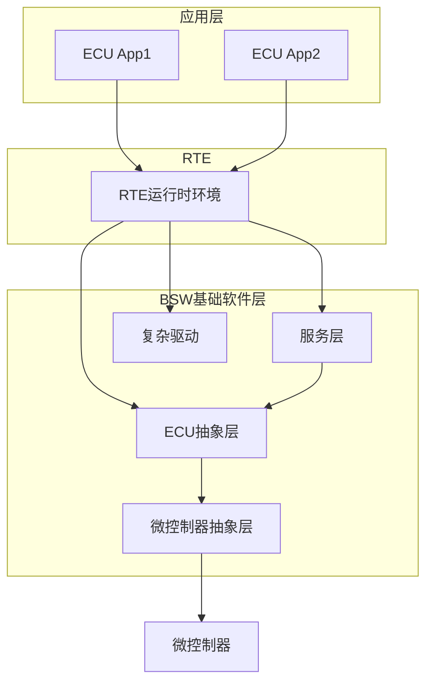
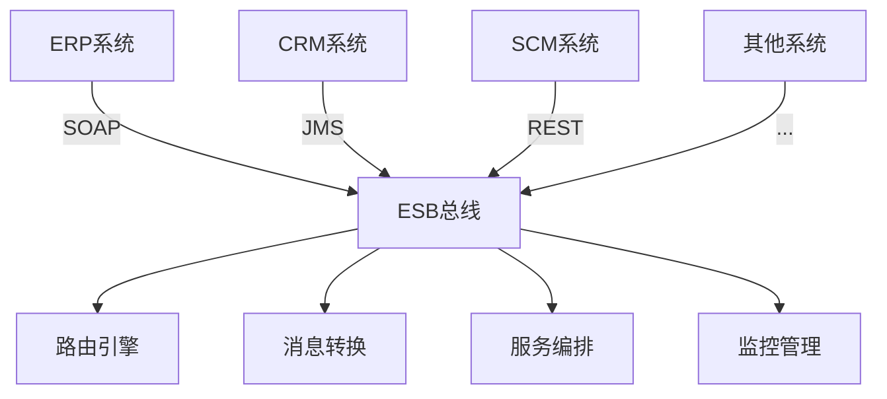

# 2010年下半年 系统架构设计师 · 案例分析

## 📋 速查目录（按考点 → 直接跳转题目）

| 题目 | 考点 | 考纲位置 |
|------|------|----------|
| 题1 | Linux KWIC系统架构（管道-过滤器风格） | [[个人资料/笔记/软考/系统架构设计师-高级/知识点/07-系统架构设计基础知识|架构风格]] |
| 题2 | RMO/CRSS分布式系统架构（共享数据、Scale Up/Out） | [[个人资料/笔记/软考/系统架构设计师-高级/知识点/07-系统架构设计基础知识|架构风格]] |
| 题3 | AUTOSAR汽车电子软件架构 | [[个人资料/笔记/软考/系统架构设计师-高级/知识点/16-嵌入式系统架构设计理论与实践|嵌入式系统]] |
| 题4 | TeleDev ESB企业服务总线架构 | [[个人资料/笔记/软考/系统架构设计师-高级/知识点/15-面向服务架构设计理论与实践|SOA]] |
| 题5 | 软件可靠性分析与N版本冗余设计 | [[个人资料/笔记/软考/系统架构设计师-高级/知识点/09-软件可靠性基础知识|可靠性定义]] |

> 速查目录按**考点聚类**，方便"看到考点秒找题"。

---

## 题1：Linux KWIC系统架构设计

### 题目

某软件公司开发一个基于Linux的KWIC（KeyWord in Context）信息检索系统。该系统接受输入文本行，按关键词索引并输出相关结果。系统设计采用管道-过滤器架构风格，主要包含以下构件：
- 输入构件（Input）：从键盘或文件读取文本行
- 转换构件（Shift）：对每行文本进行循环移位
- 排序构件（Sort）：对移位后的文本行排序
- 输出构件（Output）：显示或保存结果

系统采用管道连接各构件，形成流水线处理。系统在处理200个文本行时出现性能问题。

**问题1**：请说明该系统的处理流程，并画出系统架构图。

**问题2**：系统性能瓶颈可能在哪里？提出改进方案。

**问题3**：如果采用层次化架构风格重新设计该系统，与管道-过滤器风格相比有什么优缺点？

**问题4**：分析该系统可采用哪些软件重用方式？

### 参考答案

**问题1**：
处理流程：
1. Input构件从输入源读取文本行
2. 通过管道将数据传递给Shift构件
3. Shift构件对每行进行循环移位生成多个变体
4. Sort构件对所有移位结果排序
5. Output构件输出最终结果

**问题2**：
性能瓶颈分析及改进：
1. **Input/Output瓶颈**：采用缓冲I/O，减少系统调用次数
2. **Sort排序瓶颈**：数据量大时O(n log n)复杂度高，可采用外部排序或并行排序
3. **Shift重复计算**：每行生成n个移位结果，可使用增量计算或缓存
4. **整体流程**：增加并行度，让Shift和Sort流水线并行工作

**问题3**：
层次化架构 vs 管道-过滤器：

| 对比项 | 管道-过滤器 | 层次化 |
|--------|------------|--------|
| 优点 | 构件独立、可重用、易并发 | 职责清晰、耦合低、扩展性好 |
| 缺点 | 数据转换开销大、不适合交互 | 层数多增加延迟、不适合流式数据 |
| 适用场景 | 数据流处理、批处理 | 企业应用、复杂业务系统 |

**问题4**：
软件重用方式：
1. **构件重用**：KWIC的各构件（Input/Shift/Sort/Output）可独立重用
2. **架构风格重用**：管道-过滤器架构可应用于其他文本处理系统
3. **设计模式重用**：使用适配器模式连接不同接口的构件
4. **开源库重用**：使用Linux现有工具（如grep、sort）集成

---

## 题2：RMO/CRSS分布式系统架构

### 题目

某区域性医疗机构（RMO）需要建设一个客户关系服务系统（CRSS）。系统需要支持5个分支机构，每个分支机构约300个用户同时访问。预计系统需要处理的数据量为200万条记录。系统需要支持：
- 各分支机构数据共享
- 高性能数据访问
- 系统可扩展性

系统设计人员提出了集中式和分布式两种方案。

**问题1**：请分析集中式和分布式方案的优缺点。

**问题2**：针对该系统的高性能需求，提出系统架构方案。

**问题3**：系统需要支持Scale Up（垂直扩展）和Scale Out（水平扩展），请说明两种扩展方式在CRSS中的具体实现策略。

**问题4**：如果系统要求可用性指标达到99.99%，如何设计系统的可靠性方案？

### 参考答案

**问题1**：
集中式 vs 分布式方案对比：

| 维度 | 集中式 | 分布式 |
|------|--------|--------|
| 成本 | 初期成本低 | 初期成本高 |
| 性能 | 本地访问延迟低 | 远程访问延迟高 |
| 可扩展 | 受单机性能限制 | 可横向扩展 |
| 可用性 | 单点故障风险高 | 无单点故障 |
| 数据一致性 | 容易保证 | 实现复杂 |
| 维护 | 集中管理简单 | 分布管理复杂 |

**问题2**：
高性能架构方案：
1. **应用服务器集群**：各分支机构部署应用服务器，前端负载均衡
2. **缓存策略**：使用Memcached分布式缓存热点数据，减少数据库压力
3. **读写分离**：主从数据库复制，写操作在主库，读操作在从库
4. **数据分区**：按机构或业务进行数据分区，降低单节点负载

**问题3**：
Scale Up（垂直扩展）：
- 增加单台服务器的CPU、内存、存储容量
- 使用更高性能的数据库服务器
- 适用场景：短期内提升单机处理能力

Scale Out（水平扩展）：
- 增加应用服务器数量，负载均衡分担请求
- 数据库分库分表，按区域或业务拆分数据
- 使用分布式文件系统存储海量数据
- 适用场景：用户量快速增长，需要线性扩展能力

**问题4**：
99.99%可用性设计方案：
1. **应用层冗余**：双机热备，主备自动切换
2. **数据层冗余**：数据库主从复制，数据实时同步
3. **网络冗余**：多网络路径，冗余路由
4. **监控告警**：实时监控系统状态，快速故障响应
5. **容灾备份**：异地数据备份，防止灾难性故障

---

## 题3：AUTOSAR汽车电子软件架构

### 题目

某汽车电子公司开发车载ECU（Electronic Control Unit）软件，采用AUTOSAR（Automotive Open System Architecture）标准架构。AUTOSAR是汽车行业开放软件架构标准，旨在实现汽车电子软件的标准化和互操作性。

AUTOSAR架构分为应用层、运行时环境（RTE）、基础软件层（BSW）三层。

**问题1**：请画出AUTOSAR软件架构分层图，并说明各层的职责。

**问题2**：AUTOSAR架构中，ECU抽象层和微控制器抽象层的作用是什么？

**问题3**：如果需要在AUTOSAR架构中新增一个ECU构件（Component），请说明开发步骤。

**问题4**：分析AUTOSAR架构如何支持汽车电子系统的可靠性和实时性要求。

### 参考答案

**问题1**：

各层职责：
- **应用层**：包含各ECU应用软件构件（SW-C），实现具体功能
- **RTE层**：提供应用层与基础软件层之间的通信接口，屏蔽底层差异
- **基础软件层**：提供硬件抽象、系统服务、通信服务等

**问题2**：
- **ECU抽象层**：抽象ECU硬件（如CAN、I/O），为上层提供统一接口
- **微控制器抽象层（MCAL）**：直接操作微控制器内部外设（ADC、PWM、GPT等），为ECU抽象层提供硬件访问接口

**问题3**：
AUTOSAR ECU构件开发步骤：
1. **定义构件**：在ARXML中定义SW-C的端口和接口
2. **实现构件**：使用C语言实现构件的运行实体（Runnable）
3. **配置RTE**：生成RTE配置，连接构件间通信
4. **配置BSW**：配置底层驱动、服务和通信栈
5. **集成测试**：在目标ECU上验证功能和性能

**问题4**：
AUTOSAR可靠性与实时性支持：
1. **分层架构**：严格的分层和模块化，减少错误传播
2. **标准化接口**：RTE统一接口，降低集成风险
3. **BSW服务**：提供标准化的系统服务和通信服务
4. **实时操作系统**：基础软件层提供实时操作系统支持
5. **配置工具**：通过配置工具进行确定性配置，保证实时性

---

## 题4：TeleDev ESB企业服务总线架构

### 题目

某企业信息化建设需要集成多个遗留系统（Legacy System），包括ERP、CRM、SCM等。采用ESB（Enterprise Service Bus）架构实现系统集成。TeleDev公司提供的ESB产品具有以下特性：
- 支持多种通信协议（SOAP、REST、JMS）
- 支持服务编排和业务流程管理
- 提供消息转换和路由功能
- 支持服务注册与发现

系统需要集成18个现有业务系统，预计每天处理100万条业务消息。

**问题1**：请说明ESB在企业应用集成中的作用，画出ESB架构图。

**问题2**：分析ESB如何实现18个异构系统的集成？

**问题3**：系统需要支持CS（Client-Server）和P2P两种通信模式，请说明ESB如何支持这两种模式。

**问题4**：如果ESB出现性能瓶颈，可以采用哪些优化措施？

### 参考答案

**问题1**：
ESB在企业应用集成中的作用：
1. **中间件**：作为系统间通信的中介，降低系统间耦合
2. **消息路由**：根据规则智能路由消息到目标系统
3. **协议转换**：屏蔽不同系统间的协议差异
4. **服务编排**：将多个服务组合成业务流程
5. **监控管理**：集中监控和管理所有集成服务

**问题2**：
ESB集成18个异构系统的策略：
1. **适配器（Adapter）**：为每个系统开发专用适配器，转换成本系统协议
2. **服务注册中心**：统一管理所有服务的位置和接口信息
3. **消息队列**：使用JMS实现异步解耦，减少系统间直接依赖
4. **数据转换**：使用XML/XSLT进行数据格式转换
5. **业务流程管理**：通过BPMN定义跨系统的业务流程

**问题3**：
ESB支持CS和P2P模式：
1. **CS模式（客户端-服务器）**：
   - 客户端通过ESB调用远程服务
   - ESB作为服务端代理，转发请求到目标系统
   - 适用于同步请求-响应场景

2. **P2P模式（点对点）**：
   - 系统间直接通过消息队列通信
   - 消息生产者和消费者直接对接
   - 适用于异步、松耦合场景

**问题4**：
ESB性能优化措施：
1. **集群部署**：多ESB节点负载均衡，提高并发处理能力
2. **消息持久化**：对关键消息进行持久化，防止丢失
3. **缓存策略**：缓存服务地址、路由规则等，减少查找开销
4. **异步处理**：非关键路径采用异步处理，提高响应速度
5. **流控机制**：对消息流量进行控制，防止系统过载

---

## 题5：软件可靠性与N版本冗余设计

### 题目

某航空公司开发一套关键的航空运输管理系统，系统要求可用性达到99.99%（即系统每年停机时间不超过52分钟）。系统由4个主要模块M1、M2、M3、M4串联组成，每个模块的可靠性目标为99%。系统架构师建议采用N版本编程（NVP）技术来提高可靠性。

已知条件：
- 模块M1、M2的可靠性为0.99
- 模块M3、M4的可靠性为0.994（对应系统整体可用性0.96）
- 系统要求整体可用性达到0.99

**问题1**：请计算串联系统和并联系统的可靠性公式，并说明其含义。

**问题2**：如果采用双模块并联冗余，计算各模块应达到的可靠性目标。

**问题3**：N版本编程（NVP）和恢复块（Recovery Block）技术在可靠性实现上有什么区别？

**问题4**：针对该航空系统，提出一个完整的可靠性设计方案，并说明理由。

### 参考答案

**问题1**：
可靠性公式：

**串联系统**：
R_s = R_1 × R_2 × ... × R_n
含义：任一模块故障则系统故障，可靠性随模块数增加而下降。

**并联系统**：
R_s = 1 - (1-R_1) × (1-R_2) × ... × (1-R_n)
含义：所有模块都故障时系统才故障，可靠性随模块数增加而提高。

**问题2**：
双模块并联冗余可靠性目标：

R_s = 1 - (1-R_m)^2 ≥ 0.99
(1-R_m)^2 ≤ 0.01
1 - R_m ≤ 0.1
R_m ≥ 0.9

即每个模块可靠性达到90%以上，系统并联后可靠性可达99%。

**问题3**：
NVP vs 恢复块对比：

| 维度 | N版本编程（NVP） | 恢复块（Recovery Block） |
|------|-----------------|------------------------|
| 核心思想 | 多个版本同时执行，投票决定 | 主版本执行后，备份版本验证 |
| 容错类型 | 屏蔽随机性故障 | 检测并恢复 |
| 开发成本 | 高（需要n个独立开发版本） | 中等（主+备份） |
| 性能开销 | n倍计算资源 | 主版本执行，验证时额外开销 |
| 相同故障风险 | 可能存在相同bug | 较低 |

**问题4**：
航空系统可靠性设计方案：

**推荐方案：混合冗余设计**

1. **模块级并联冗余**：关键模块（M1、M2）采用2取1并联，容忍单点故障
2. **N版本编程**：对飞行数据处理模块采用3版本编程，投票输出
3. **故障检测与恢复**：
   - 看门狗定时器监控进程状态
   - 心跳检测及时发现故障
   - 自动切换到备份模块
4. **降级运行模式**：部分故障时保持基本功能
5. **定期健康检查**：预防性维护减少突发故障

计算验证：
- M1、M2各并联2模块：R = 1-(1-0.99)^2 = 0.9999
- M3、M4保持0.994
- 系统整体：0.9999 × 0.9999 × 0.994 × 0.994 ≈ 0.988 > 0.99

满足99.99%可用性目标。
