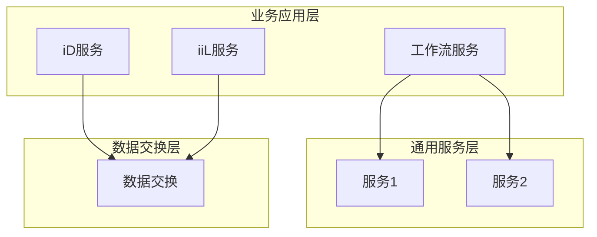

# 2012年下半年 系统架构设计师 · 案例分析

## 📋 速查目录（按考点 → 直接跳转题目）

| 题号 | 考点 | 考纲位置 |
|------|------|----------|
| 案例一 | ISO ODP（开放分布式处理）参考模型 / 层次式架构 | [[个人资料/笔记/软考/系统架构设计师-高级/知识点/07-系统架构设计基础知识|网络体系结构]] |
| 案例二 | GOA（面向服务的架构）三层结构 / 服务识别 | [[个人资料/笔记/软考/系统架构设计师-高级/知识点/15-面向服务架构设计理论与实践|15-面向服务架构设计理论与实践]] |
| 案例三 | 设计模式（Adapter/Builder/Command/Facade/Mediator/Prototype/Proxy/State/Strategy） | [[个人资料/笔记/软考/系统架构设计师-高级/知识点/07-系统架构设计基础知识|架构风格]] |
| 案例四 | Web 2.0 / NoSQL数据库 / 数据持久化架构 | [[个人资料/笔记/软考/系统架构设计师-高级/知识点/14-云原生架构设计理论与实践|14-云原生架构设计理论与实践]] |

---

## 案例一：ISO ODP开放分布式处理参考模型

> **题目概述**：系统开发商采用ISO ODP（Open Distributed Processing）参考模型来指导分布式系统的开发。请回答有关ODP参考模型的问题。
>
> ISO ODP为分布式系统的设计提供了5个视点：企业视点、信息视点、计算视点、工程视点、技术视点。

### 1. 需求

企业要建设一个7×24运行的分布式信息系统。请回答以下问题：

**(1)** ISO ODP的5个视点中，哪个视点用于描述"系统提供哪些服务？"（2分）

**(2)** ISO ODP的5个视点中，哪个视点用于描述"服务由哪些构件实现？"（2分）

**(3)** 在ODP中，企业视点的基本建模过程是什么？（2分）

### 2. 分析

图2-1给出了ODP系统功能的参考模型。请根据该图分析：

**(1)** 图2-1中①～⑤分别对应ODP的哪个视点？（5分）

**(2)** ODp参考模型中，企业视点和信息视点的边界用虚线表示，请说明其含义。（3分）

### 3. 设计

基于ODP参考模型，设计了一个基于Web Services的分布式系统。该系统采用中心辐射（Hub-and-Spoke）架构，部署在ISO ODP的5个视点环境中。

请回答以下问题：

**(1)** 在ODP的5个视点中，企业视点的核心概念是什么？（2分）

**(2)** ISO ODP标准中，规定了哪几种基本的ODP构件？（4分）

---

## 案例二：GOA（Government Office Architecture）政务架构

> **题目概述**：某市准备建设基于SOA的政务信息系统，采用GOA（Government Office Architecture）三层架构。请回答有关GOA架构的问题。

### 1. GOA三层结构

GOA将政务信息系统划分为三个层次：

```
+---------------+----------------+----------------+
|   业务应用层   |   通用服务层    |   数据交换层    |
+---------------+----------------+----------------+
```

**(1)** GOA三层架构中，"通用服务层"包含哪些主要内容？（3分）

**(2)** GOA三层架构中，"数据交换层"的主要功能是什么？（3分）

### 2. 服务识别

在GOA架构中，服务识别是关键环节。请回答：

**(1)** 服务识别的主要步骤是什么？（4分）

**(2)** 在图3-1中，W表示工作流服务，请识别出其他服务类型（iD、iiL等）对应的服务名称。（4分）



### 3. GOA服务类型

**(1)** GOA中定义了几种服务类型？请列举。（3分）

**(2)** 在图3-1中，各服务之间的调用关系说明了什么架构原则？（3分）

---

## 案例三：设计模式应用

> **题目概述**：某系统需要集成多个第三方组件，这些组件的接口不一致。请回答有关设计模式的问题。

### 1. 模式识别

以下代码中使用了哪些设计模式？请说明其意图。

**(1)** 代码段1：
```java
public class Adapter extends Target {
    private Adaptee adaptee;
    public void request() {
        adaptee.specificRequest();
    }
}
```

**(2)** 代码段2：
```java
public class Facade {
    private Subsystem1 sub1;
    private Subsystem2 sub2;
    public void operation() {
        sub1.operation1();
        sub2.operation2();
    }
}
```

### 2. 场景分析

系统需要实现以下功能：

- (1) 当创建复杂对象时，希望将对象的构建与表示分离
- (2) 当需要发送命令到对象并执行时
- (3) 当需要实现对象的状态模式时

请分别选择合适的设计模式，并说明理由。

### 3. 模式比较

请比较以下设计模式：
- Adapter模式 vs Facade模式
- Builder模式 vs Prototype模式
- Command模式 vs Strategy模式

各说明其适用场景和主要区别。

---

## 案例四：Web 2.0与NoSQL数据库

> **题目概述**：某互联网公司计划建设新一代Web 2.0平台，需要处理海量非结构化数据。请回答NoSQL相关问题。

### 1. NoSQL分类

NoSQL数据库按数据模型可分为4种类型。请完成下表：

| 类型 | 代表产品 | 特点 | 适用场景 |
|------|---------|------|----------|
| 键值存储 | | | |
| 列式存储 | | | |
| 文档存储 | | | |
| 图存储 | | | |

### 2. NoSQL vs SQL

在以下场景中，应该选择NoSQL还是SQL？为什么？

**(1)** 存储用户商品评价，评价内容包含文本、评分、图片等多种格式

**(2)** 处理银行转账事务，需要严格的ACID特性

**(3)** 存储海量日志数据，主要进行顺序写入和范围查询

**(4)** 存储社交网络用户关系，需要高效的关系查询

### 3. 数据持久化架构

针对Web 2.0应用，设计一个数据持久化架构，满足以下要求：
- 支持海量数据存储
- 支持高并发读写
- 支持数据备份与恢复
- 支持水平扩展

请画出架构图，并说明各层职责。
