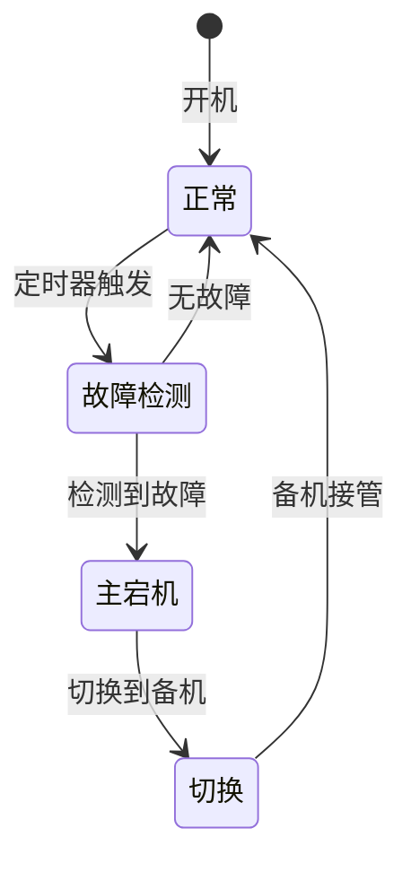
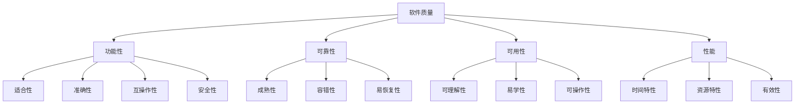
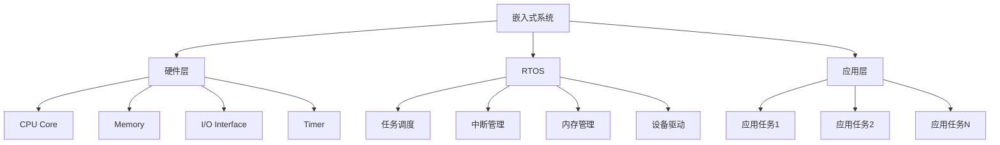

# 2015年下半年 系统架构设计师 · 案例分析

## 📋 速查目录

| 题号 | 考点 | 考纲位置 |
|------|------|----------|
| 试题一 | 软件架构风格（Pipe-Filter + OO 混合架构） | [[个人资料/笔记/软考/系统架构设计师-高级/知识点/07-系统架构设计基础知识|软件架构概念]] |
| 试题二 | 系统可靠性设计（冗余备份、马尔夫模型） | [[个人资料/笔记/软考/系统架构设计师-高级/知识点/09-软件可靠性基础知识|可靠性模型]] |
| 试题三 | 数据库设计与 ORM（Hibernate/iBatis/MySQL） | [[个人资料/笔记/软考/系统架构设计师-高级/知识点/06-数据库设计基础知识|关系数据库]] |
| 试题四 | 软件质量保障（GB/T16260.1 四个质量特性） | [[个人资料/笔记/软考/系统架构设计师-高级/知识点/05-软件工程基础知识|软件测试]] |
| 试题五 | 嵌入式系统架构（SoC、RTOS、任务调度） | [[个人资料/笔记/软考/系统架构设计师-高级/知识点/16-嵌入式系统架构设计理论与实践|16-嵌入式系统架构设计理论与实践]] |

---

## 试题一

某软件系统采用 Pipe-Filter 架构风格处理数据流，过滤器之间通过管道连接。每个过滤器完成特定的数据转换功能。

```
┌───────┐    ┌───────┐    ┌───────┐    ┌───────┐
│ Filter│───▶│ Filter│───▶│ Filter│───▶│ Filter│
│   A   │    │   B   │    │   C   │    │   D   │
└───────┘    └───────┘    └───────┘    └───────┘
```

### 需求描述

某信息系统需要处理来自 Web 的多源数据，数据处理流程包括以下阶段：

- **阶段一**：数据采集（从 Web 采集原始数据，200 条/小时）
- **阶段二**：数据清洗（去除重复和无效数据）
- **阶段三**：数据转换（格式标准化）
- **阶段四**：数据入库（写入数据库）

### 分析问题

1. 说明 Pipe-Filter 架构风格的主要特点和适用场景。
2. 画出该系统采用 Pipe-Filter 架构的数据流图。
3. 说明该架构风格的优缺点。
4. 若需要在数据处理过程中增加实时监控功能，如何修改架构？
5. 比较 Pipe-Filter 与 Event-Driven 架构风格的异同。

**参考解答**

1. **Pipe-Filter 架构特点**：
   - 每个过滤器完成单一功能
   - 过滤器之间通过管道连接
   - 数据流单向流动
   - 过滤器相互独立，可并行执行

2. **数据流图**：
   ```mermaid
   flowchart TD
       A[Web数据源] --> B[数据采集 Filter A]
       B --> C[数据清洗 Filter B]
       C --> D[数据转换 Filter C]
       D --> E[数据入库 Filter D]
       D --> F[实时监控]
       F --> G[告警系统]
   ```

3. **优缺点**：
   - 优点：模块化、可复用、可并行、容易维护
   - 缺点：不适合交互式系统、过滤器的启动和关闭开销大

4. **增加监控**：在管道中增加监控过滤器，或在主管道旁路添加事件监听器。

5. **Pipe-Filter vs Event-Driven**：
   - Pipe-Filter：适合批处理、数据流系统
   - Event-Driven：适合交互式、响应式系统

---

## 试题二

某系统采用双机热备冗余设计提高可靠性，主备机之间心跳检测间隔为 0.5s，系统要求可用性达到 99.999%。

### 可靠性参数



已知：
- 单机 MTBF = 200 小时
- 故障检测时间 = 0.5s（Ping/Echo 超时）
- 切换时间 = 2s
- 备机预热时间 = 1s

### 分析问题

1. 计算系统的可用性。
2. 若要求可用性达到 99.999%，系统需要满足什么条件？
3. 说明提高系统可靠性的常用措施。
4. 画出主备切换的状态机图。
5. 分析 2 取 1 投票机制在可靠性中的作用。

**参考解答**

1. **可用性计算**：
   - 单机可用性 A = MTBF / (MTBF + MTTR)
   - MTTR = 故障检测时间 + 切换时间 + 备机预热时间 = 0.5s + 2s + 1s = 3.5s
   - 转换为小时：MTTR = 3.5 / 3600 小时
   - A = 200 / (200 + 3.5/3600) ≈ 0.9999951

2. **99.999% 可用性要求**：
   - 年停机时间 ≤ 5.26 分钟
   - 需要 MTBF 足够大或 MTTR 足够小

3. **提高可靠性措施**：
   - 双机热备冗余
   - 定期健康检查
   - 快速故障检测
   - 自动切换机制

4. **状态机图**：（见上图）

5. **2 取 1 投票机制**：三个模块同时工作，输出结果通过投票产生，可容忍一个模块故障。

---

## 试题三

某 Java EE 系统采用 MVC 架构，使用 MySQL 数据库。系统需要支持高并发访问，设计了数据持久层框架选择方案。

### 框架对比

| 框架 | 类型 | SQL 管理 | 学习曲线 |
|------|------|----------|----------|
| BMP/CMP | 实体 Bean | 容器管理 | 高 |
| iBatis/MyBatis | SQL Mapping | 手动编写 | 中 |
| SpringJdbcTemplate | JDBC 封装 | 半自动 | 低 |
| TopLink/JDO/Hibernate | O/R Mapping | 全自动 | 高 |

### 需求分析

系统处理 300 用户并发操作，需要选择合适的持久层方案。

### 分析问题

1. 比较四种持久层框架的优缺点。
2. 针对 300 用户并发场景，推荐哪种框架？说明理由。
3. 说明 Hibernate 和 iBatis 的主要区别。
4. 设计数据库连接池的配置文件。
5. 说明事务隔离级别对并发性能的影响。

**参考解答**

1. **框架比较**：
   - **BMP/CMP**：EJB 容器管理，笨重但规范
   - **iBatis/MyBatis**：SQL 控制灵活，适合复杂查询
   - **SpringJdbcTemplate**：轻量，SQL 内嵌代码
   - **Hibernate/JDO**：全自动 O/R 映射，开发效率高

2. **推荐方案**：针对 300 并发，推荐 **iBatis/MyBatis**：
   - SQL 可控，便于性能优化
   - 学习曲线适中
   - 适合复杂业务逻辑

3. **Hibernate vs iBatis**：
   - Hibernate：全自动映射，SQL 不可见，适合简单 CRUD
   - iBatis：半自动，SQL 可见，适合复杂查询和性能调优

4. **连接池配置**：
   ```properties
   # 连接池大小
   pool.minSize=5
   pool.maxSize=20
   pool.initialSize=10
   ```

5. **事务隔离级别**：
   - READ_UNCOMMITTED：最高并发，最低隔离
   - SERIALIZABLE：最高隔离，最低并发
   - 推荐使用 READ_COMMITTED 级别

---

## 试题四

某软件项目依据 GB/T16260.1-2006 标准进行质量控制，需要从四个质量维度进行度量和改进。

### 质量特性层次



### 度量数据

| 质量特性 | 度量项 | 当前值 | 目标值 |
|----------|--------|--------|--------|
| 功能性 | 测试覆盖率 | 85% | 95% |
| 可靠性 | 缺陷密度 | 0.5/KLOC | 0.2/KLOC |
| 可用性 | MTTF | 200h | 500h |
| 性能 | 响应时间 | 3s | 1s |

### 分析问题

1. 说明 GB/T16260.1 标准的四个质量特性。
2. 针对上表分析各质量特性的达标情况。
3. 提出提高可靠性的具体措施。
4. 设计软件质量度量的流程。
5. 说明软件测试与质量保障的关系。

**参考解答**

1. **四个质量特性**（GB/T16260.1）：
   - **功能性**：软件满足规定需求的能力
   - **可靠性**：在规定条件下维持性能的能力
   - **可用性**：易于使用的程度
   - **性能**：响应时间和资源消耗

2. **达标分析**：
   - 功能性：85% < 95%，未达标
   - 可靠性：0.5 > 0.2，未达标
   - 可用性：200h < 500h，未达标
   - 性能：3s > 1s，未达标

3. **提高可靠性措施**：
   - 代码评审
   - 单元测试
   - 集成测试
   - 缺陷预防

4. **质量度量流程**：
   - 确定度量目标
   - 选取度量项
   - 收集数据
   - 分析结果
   - 改进措施

5. **测试与质量保障**：测试是质量保障的手段之一，质量保障还包括过程控制、配置管理等。

---

## 试题五

某嵌入式系统采用 SoC（System on Chip）架构，集成 CPU、存储器、外设接口。系统运行 RTOS（实时操作系统），支持多任务调度。

### 嵌入式系统架构



### 任务特性

| 任务 | 周期 | 执行时间 | 优先级 | 截止时间 |
|------|------|----------|--------|----------|
| 任务1 | 100ms | 20ms | 高 | 100ms |
| 任务2 | 200ms | 30ms | 中 | 200ms |
| 任务3 | 400ms | 40ms | 低 | 400ms |

### 分析问题

1. 说明 SoC 架构的主要特点。
2. 分析任务的实时性是否可调度（使用 Rate Monotonic 分析）。
3. 说明 RTOS 中断处理机制。
4. 设计嵌入式软件的启动流程。
5. 比较硬实时与软实时系统的区别。

**参考解答**

1. **SoC 架构特点**：
   - 高度集成（CPU + 存储器 + 外设）
   - 低功耗
   - 小体积
   - 高可靠性

2. **可调度性分析**（Rate Monotonic）：
   - 任务1：U1 = 20/100 = 0.2
   - 任务2：U2 = 30/200 = 0.15
   - 任务3：U3 = 40/400 = 0.1
   - 总利用率 U = 0.45 < 0.78（RM 极限）
   - **可调度**

3. **RTOS 中断处理**：
   - 硬件中断 → 中断向量 → 中断服务程序（ISR）
   - ISR 执行时间尽量短
   - 中断上半部/下半部机制

4. **启动流程**：
   - 上电复位
   - 初始化向量表
   - 系统初始化（时钟、内存等）
   - RTOS 内核启动
   - 创建任务
   - 启动调度器

5. **硬实时 vs 软实时**：
   - 硬实时：错过截止时间 = 系统失败（如飞行控制系统）
   - 软实时：错过截止时间 = 性能下降（如视频播放）

---

## 试题一~五 答案要点汇总

| 试题 | 主要考点 | 关键答案要点 |
|------|----------|--------------|
| 试题一 | Pipe-Filter 架构 | 数据流单向、过滤器独立、管道连接、可并行执行 |
| 试题二 | 可靠性与冗余 | 可用性 A=MTBF/(MTBF+MTTR)、99.999% 年停机≤5.26min |
| 试题三 | ORM 框架对比 | iBatis 适合复杂查询和性能调优、Hibernate 适合快速开发 |
| 试题四 | 质量度量 | GB/T16260.1 四个特性：功能性/可靠性/可用性/性能 |
| 试题五 | 嵌入式架构 | SoC 高度集成、RM 可调度性分析、硬实时 vs 软实时 |
