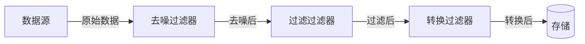

# 2023年下半年 系统架构设计师 · 下午题案例分析（回忆版）

## 📋 速查目录（按案例 → 直接跳转）

| 案例序号 | 主题 | 考纲位置 |
|---------|------|----------|
| 案例一 | 云计算体系结构设计（弹性伸缩与可靠性） | [[个人资料/笔记/软考/系统架构设计师-高级/知识点/14-云原生架构设计理论与实践|14-云原生架构设计理论与实践]] |
| 案例二 | 数据库设计与实现（分布式/读写分离） | [[个人资料/笔记/软考/系统架构设计师-高级/知识点/06-数据库设计基础知识|06-数据库设计基础知识]] |
| 案例三 | 嵌入式系统架构设计（RTOS/SoC） | [[个人资料/笔记/软考/系统架构设计师-高级/知识点/16-嵌入式系统架构设计理论与实践|16-嵌入式系统架构设计理论与实践]] |
| 案例四 | 软件架构风格（管道-过滤器） | [[个人资料/笔记/软考/系统架构设计师-高级/知识点/07-系统架构设计基础知识|架构风格]] |
| 案例五 | 微服务架构设计与部署（Docker/K8s） | [[个人资料/笔记/软考/系统架构设计师-高级/知识点/14-云原生架构设计理论与实践|微服务]] |
| 案例六 | 新一代计算架构（大数据/AI 芯片） | [[个人资料/笔记/软考/系统架构设计师-高级/知识点/19-大数据架构设计理论与实践|19-大数据架构设计理论与实践]] |

---

## 案例一：云计算体系结构设计（弹性伸缩与可靠性）

### [背景描述]

某互联网公司计划构建一套私有云平台，用于承载其核心业务系统。平台需满足以下要求：
- 支持业务系统弹性伸缩，根据负载自动增减计算资源
- 单个物理节点故障不影响业务连续性
- 整体可用性达到 99.9% 以上
- 支持虚拟化资源统一管理

### [问题 1]

> 请从可用性、伸缩性角度分析该云平台应采用哪种体系结构模式？并说明原因。

**答案要点**：
- 采用**层次式架构**（基础设施层 / 虚拟化层 / 平台服务层 / 应用层）实现解耦和管理简化
- 采用**面向服务的架构（SOA）**或**微服务架构**使各层可独立伸缩
- 可靠性方面：各层均采用冗余部署（主备 / 多活），配合健康检查和自动故障转移

**解析**：弹性伸缩需将系统拆分为无状态服务层（如应用层）配合负载均衡；可靠性通过多副本冗余和自动恢复机制实现。

---

### [问题 2]

> 假设该平台包含 3 个可用区（AZ），每个 AZ 的可用性为 99.5%，请计算平台整体可用性（假设 AZ 之间相互独立）。若要达到 99.9%，至少需要几个 AZ？

**答案**：
- 3 AZ 并联：整体可用性 = 1-(1-0.995)^3 = 1-0.000125 = **99.9875%**，已超过 99.9%
- 或串联模型（如各层串联）：需按实际架构逐层计算

**解析**：多可用区并联可大幅提升整体可用性，N 个独立 AZ 并联可用性 = 1-(1-R)^N。

---

### [问题 3]

> 该云平台计划使用 Docker 容器化部署业务系统。请说明 Docker 容器的核心优势，以及相比传统虚拟机的不足之处。

**答案要点**：
- **优势**：启动速度快（秒级）、资源利用率高（共享内核）、易移植、适合微服务、CI/CD 友好
- **不足**：隔离性弱于虚拟机（共享宿主机内核）、不适合强安全隔离场景、容器逃逸风险

**解析**：Docker 通过 OS 级虚拟化实现轻量隔离，适合无状态微服务部署；但对强隔离需求（如多租户金融系统）仍需 VM。

---

## 案例二：数据库设计与实现（分布式/读写分离）

### [背景描述]

某电商平台业务量增长迅速，单机数据库已出现性能瓶颈，计划进行数据库架构改造。
- 当前问题：读操作占 80%，写操作占 20%，主库压力过大
- 改造目标：提升查询性能，支持水平扩展

### [问题 1]

> 请设计该电商平台的数据库架构改造方案，并说明各组件的作用。

**答案要点**：
- **读写分离**：主库（Write）→ 从库集群（Read），通过中间件（如 MySQL Proxy / Atlas）实现读/写路由分离
- **分库分表**：按用户 ID 或订单 ID 做水平拆分，解决单库数据量瓶颈
- **缓存层**：引入 Redis/Memcached 缓存热点数据，减少数据库压力
- **消息队列**：写请求通过 Kafka 异步写入，保护主库

**解析**：根据 8:2 读写比例，读写分离是性价比最高的改造方案；分库分表解决数据量问题；缓存层进一步吸收读流量。

---

### [问题 2]

> 引入读写分离后，如何保证主从数据一致性？若出现主从延迟，可能造成什么问题？

**答案要点**：
- **半同步复制**（Semi-sync Replication）：主库确认至少一个从库写成功后返回客户端
- **延迟监控**：部署延迟监控工具（如 MySQL MT）报警，超过阈值自动屏蔽从库读
- **问题**：主从延迟导致读到的数据非最新（如下单后立即查询订单状态看不到）
- **解决方案**：强制读主库（强一致性场景）或对延迟不敏感业务读从库

**解析**：主从延迟是异步复制的固有缺陷，业务上需评估对数据一致性的容忍度，选择合适策略。

---

### [问题 3]

> 该系统后续需要支持跨地域部署，请分析分布式数据库应考虑的关键技术问题。

**答案要点**：
- **数据分区策略**：范围分区 / 哈希分区 / 列表分区
- **全局一致性**：分布式事务（两阶段提交 / TCC），或接受最终一致性
- **分布式查询优化**：跨节点 JOIN 性能代价高，需在应用层或中间件优化
- **CAP 权衡**：跨地域场景下优先保证可用性，接受最终一致性（CAP 中的 AP）
- **容灾与恢复**：多副本跨地域部署，RPO/RTO 设计

**解析**：跨地域分布式数据库的核心挑战是一致性、延迟、容灾的三重权衡，NoSQL（ Cassandra / HBase ）和 NewSQL（ TiDB / CockroachDB ）各有取舍。

---

## 案例三：嵌入式系统架构设计（RTOS/SoC）

### [背景描述]

某智能穿戴设备采用嵌入式实时操作系统（RTOS），需满足以下要求：
- 硬实时响应（响应时间 < 1ms）
- 低功耗（电池供电）
- 支持多种传感器数据采集和蓝牙通信

### [问题 1]

> 请说明 RTOS 与通用操作系统的主要区别，并分析该设备为何适合采用 RTOS。

**答案要点**：
- **RTOS 特性**：优先级抢占调度（硬实时）、中断延迟低、无虚拟内存（确定性）、内核小巧
- **通用 OS 特性**：时间片轮转、非抢占式、虚拟内存、侧重吞吐率
- **适用原因**：穿戴设备有硬实时需求（传感器采样、BLE 通信时序）、资源受限（MCU ROM/RAM 有限）、低功耗（RTOS 可精确控制休眠唤醒）

**解析**：硬实时需求决定必须用 RTOS 而非 Linux；低功耗嵌入式场景 RTOS 优势明显。

---

### [问题 2]

> 该设备采用 SoC（System on Chip）方案，请说明 SoC 设计相比传统 MCU+外设方案的优势。

**答案要点**：
- **集成度高**：CPU、内存控制器、外设控制器、无线模块（BLE）等集成于单一芯片，PCB 面积减少 60%+
- **成本降低**：减少 PCB 层数和器件数量
- **功耗优化**：片内互联功耗远低于板级互连，支持 DVFS（动态电压频率调整）
- **设计周期缩短**：减少硬件调试工作量

**解析**：SoC 在便携式设备中优势显著，是物联网和穿戴设备的主流方案。

---

### [问题 3]

> 该设备需要实现 OTA（Over-The-Air）固件升级，请设计 OTA 升级的架构方案，说明关键设计要点。

**答案要点**：
- **双镜像分区**：A/B 双分区（ Active + Backup），新固件下载到 Backup 分区，验证通过后切换启动分区，实现无缝回滚
- **增量升级**：只传输差异包（bsdiff），减少流量和升级时间
- **安全校验**：固件签名（RSA/ECDSA）验证完整性，防篡改
- **断点续传**：支持分片下载，失败后从中断处恢复
- **升级回滚机制**：启动时健康检查失败自动回退到上一版本

**解析**：OTA 是嵌入式设备标配能力，双镜像 + 签名验证是最关键的架构设计点。

---

## 案例四：软件架构风格（管道-过滤器）

### [背景描述]

某数据处理系统需要对采集的原始数据进行多级处理：去噪 → 过滤 → 转换 → 存储。
系统需要支持不同数据处理算法的灵活替换和组合。

### [问题 1]

> 请说明适合该系统的架构风格，并绘制其架构示意图。

**答案要点**：
- **管道-过滤器风格（Pipe-Filter）**：数据流经一系列过滤器（Filter），过滤器间通过管道（Pipe）传输
- **各过滤器功能**：去噪（Filter1）→ 过滤（Filter2）→ 转换（Filter3）→ 存储（Filter4）
- **优点**：各过滤器独立（可替换、可复用）、数据流清晰、易并行扩展（各管道并行处理不同数据批次）

**解析**：管道-过滤器是数据流处理的首选架构，符合开放-封闭原则，算法可插拔。

---

### [问题 2]

> 若系统需要支持实时流处理（而非批量处理），架构应如何调整？

**答案要点**：
- **消息队列（Kafka/RabbitMQ）** 替代同步管道，过滤器异步消费消息
- **流处理引擎（Flink/Spark Streaming）**：将过滤器逻辑表达为流算子（map/filter/transform），天然支持管道风格
- **背压机制**：当下游处理能力不足时，消息队列缓存并告知上游减慢发送速率
- **状态管理**：流处理中过滤器可能需维护状态（如聚合算子），引入有状态算子

**解析**：从批处理到流处理，核心变化是同步管道 → 异步消息队列，同步阻塞 → 事件驱动。

---

### [问题 3]

> 该架构的"过滤器"如果需要维护状态（如统计计数），会带来什么问题？如何解决？

**答案要点**：
- **问题**：过滤器有状态后难以水平扩展（有状态副本一致性问题）；流处理中断时状态丢失
- **解决方案**：
  - 将有状态过滤器拆分为无状态处理 + 有状态外部存储（如 Redis 计数）
  - 流处理引擎引入 **Checkpoint（检查点）** 机制，定期保存状态到持久存储，故障后从检查点恢复
  - 使用有状态流处理框架（Flink）内置的 exactly-once 语义

**解析**：有状态是分布式流处理的核心难题，Checkpoint + 状态后端是标准解法。

---

## 案例五：微服务架构设计与部署（Docker/K8s）

### [背景描述]

某互联网公司计划将传统单体应用改造为微服务架构。
- 现状：JAVA 单体应用，代码量 50 万行，部署周期长（2 周）
- 目标：服务独立部署、独立扩展，部署周期缩短到小时级

### [问题 1]

> 请说明微服务拆分的一般原则，并列出微服务划分的方法。

**答案要点**：
- **拆分原则**：单一职责（每个服务粒度适中）、高内聚低耦合、边界清晰、业务独立、无循环依赖
- **拆分方法**：
  - 按业务能力（营销/订单/用户/支付等）
  - 按领域驱动设计（DDD）的子域/限界上下文
  - 按读写分离（查询侧/命令侧 CQRS）
  - 按非功能需求（安全隔离、性能隔离）

**解析**：微服务拆分没有绝对标准，DDD 是最推荐的方法论，从业务边界出发而非技术切分。

---

### [问题 2]

> 该公司采用 Kubernetes（K8s）管理微服务，请说明 K8s 的核心概念及如何实现微服务的弹性伸缩。

**答案要点**：
- **核心概念**：Pod（最小调度单元）、Service（服务发现/负载均衡）、Deployment（声明式更新）、Namespace（隔离）
- **弹性伸缩**：
  - **HPA（Horizontal Pod Autoscaler）**：根据 CPU/内存使用率自动增减 Pod 副本数
  - **VPA（Vertical Pod Autoscaler）**：调整 Pod 资源配额
  - **Cluster Autoscaler**：节点级别伸缩（云环境）
  - 结合 KEDA（基于事件驱动的自动伸缩）可实现更丰富的伸缩触发条件

**解析**：K8s 是微服务容器编排的事实标准，HPA+VPA+Cluster Autoscaler 三层伸缩覆盖了 Pod/资源/节点级别。

---

### [问题 3]

> 微服务架构中，分布式事务是一个难题。请比较两阶段提交（2PC）和 Saga 模式的适用场景。

**答案要点**：
- **2PC**：强一致性，适合对数据一致性要求极高的场景（如银行转账）；缺点是锁定资源时间过长， coordinator 故障可能导致数据不一致
- **Saga**：最终一致性，通过补偿事务（反向操作）实现；适合长时间运行、跨服务边界、可用性优先的场景（如电商下单）
- **选择建议**：强一致性需求用 2PC/TCC；业务上可接受最终一致性的用 Saga；避免在微服务间使用分布式事务，尽量通过消息队列和幂等设计实现最终一致性

**解析**：微服务架构倡导"尽可能避免分布式事务"，通过业务流程异步化+幂等补偿实现最终一致性。

---

## 案例六：新一代计算架构（大数据/AI 芯片）

### [背景描述]

某人工智能公司需要构建大规模模型训练平台，支撑 GPT 类大模型的分布式训练。
- 硬件资源：1000 张 GPU 卡（NVIDIA A100）
- 挑战：GPU 间通信带宽成为瓶颈、显存不足、训练周期长

### [问题 1]

> 请分析该训练平台应采用哪种计算架构，并说明数据并行与模型并行的区别。

**答案要点**：
- **计算架构**：采用异构计算架构（CPU+GPU/NPU），通过高速互联网络（NVLink/InfiniBand）连接多 GPU
- **数据并行（Data Parallelism）**：将 batch 数据切分到各 GPU，各 GPU 持有完整模型副本，独立计算梯度后同步（AllReduce）；通信量小，适合模型可以放入单卡显存场景
- **模型并行（Model Parallelism）**：将模型切分到各 GPU（层间流水并行或张量并行），需大量跨 GPU 通信；解决单卡显存不足问题，但通信开销大
- **3D 并行**：数据并行 + 流水线并行 + 张量并行组合，适合千卡级别训练

**解析**：千卡训练必须综合使用多种并行策略，通信效率和显存管理是核心瓶颈。

---

### [问题 2]

> 该平台采用 GPU 服务器集群，请说明在架构设计中如何提升 GPU 利用率。

**答案要点**：
- **算子融合（Operator Fusion）**：减少核间内存访问（如将多个小算子合并为一个 CUDA kernel）
- **混合精度训练（FP16/BF16）**：减少显存占用和加速计算，利用 Tensor Core
- **梯度累积（Gradient Accumulation）**：用更小显存模拟大 batch size
- **数据加载优化**：使用多进程 DataLoader + 预取（Prefetch），减少 GPU 等待 I/O 的时间
- **资源调度**：Kubernetes + GPU Fractional Sharing（时间片共享）提高集群整体利用率
- **通信优化**：梯度压缩（Gradient Compression）、异步更新（Stale Synchronous Parallel）减少通信等待

**解析**：GPU 利用率优化是系统性工程，从计算、显存、I/O、通信四个维度综合调优。

---

### [问题 3]

> 该平台需要支持多种 AI 训练框架（PyTorch、TensorFlow、JAX），请设计一个支持异构框架的统一训练调度架构。

**答案要点**：
- **容器化训练任务**：各框架封装为 Docker 镜像，通过 K8s Job/PyTorchJob（Operator）统一调度
- **统一资源抽象层**：定义标准训练任务描述（CRD），屏蔽框架差异
- **分布式训练框架**：引入 Horovod（统一通信层）/ PyTorch DDP / TensorFlow PS-Worker，统一梯度同步
- **实验管理**：MLflow 或 Kubeflow Pipelines 管理训练生命周期（超参搜索/模型版本/指标追踪）
- **异构支持**：通过插件式框架适配器接入新框架，调度器无需修改

**解析**：统一调度层的核心是标准化任务描述和资源抽象，容器化 + Operator 模式是实现路径。
