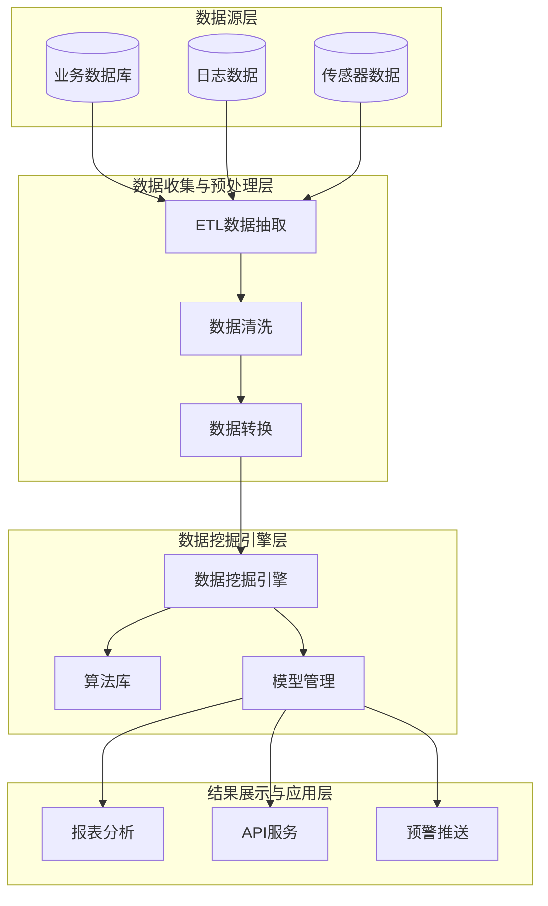

# 2010年下半年 系统架构设计师 · 论文写作

## 📋 速查目录（按考点 → 直接跳转题目）

| 题号 | 题目主题 | 考纲位置 |
|------|----------|----------|
| 论题1 | 软件架构演化与动态演化 | [[个人资料/笔记/软考/系统架构设计师-高级/知识点/10-软件架构的演化和维护|对象演化]] |
| 论题2 | 数据挖掘技术及其应用 | [[个人资料/笔记/软考/系统架构设计师-高级/知识点/11-未来信息综合技术|人工智能]] |
| 论题3 | 企业应用集成（EAI） | [[个人资料/笔记/软考/系统架构设计师-高级/知识点/15-面向服务架构设计理论与实践|SOA]] |
| 论题4 | 嵌入式系统设计 | [[个人资料/笔记/软考/系统架构设计师-高级/知识点/16-嵌入式系统架构设计理论与实践|嵌入式系统]] |

> 论文题目从以下四个论题中任选其一，写作时间120分钟，字数2000-3000字。

---

## 论题一：软件架构的演化与维护

### 题目

软件架构是软件系统构建的核心，架构一旦确定，在较长一段时间内保持稳定。但在软件生命周期中，由于业务需求变化、技术环境更新、团队组织调整等因素，架构不可避免地需要演化。

请围绕"软件架构的演化与维护"这一主题，论述以下内容：

1. **静态演化**：描述软件架构静态演化的主要场景和实现方式，包括：
   - 功能增强时的架构扩展
   - 功能裁剪时的架构简化
   - 架构重构（Refactoring）的时机和方法

2. **动态演化**：描述软件架构动态演化的主要技术和实现机制，包括：
   - 热部署（Hot Deployment）
   - 组件动态加载
   - 运行时代码替换

3. **案例实践**：结合你参与的某个软件项目，说明在项目开发过程中遇到了哪些架构演化问题？采取了什么演化策略？取得了什么效果？

### 写作要点框架

**摘要**（200-300字）：
- 项目背景
- 面临的架构挑战
- 采取的演化策略
- 取得的效果

**正文**（1500-2000字）：

**一、静态演化**（500-600字）

1. **功能增强时的架构扩展**
   - 典型场景：新业务功能需要添加，但现有架构不支持
   - 实现方式：开放-封闭原则（Open-Closed Principle），对扩展开放，对修改封闭
   - 案例：电商系统新增促销模块，采用观察者模式解耦

2. **功能裁剪时的架构简化**
   - 典型场景：业务调整，部分功能不再需要
   - 实现方式：模块化设计，移除相关模块不影响其他模块
   - 案例：去除早期限时功能模块

3. **架构重构的时机和方法**
   - 重构时机：代码异味（Bad Smell）、重复代码、过时技术债务
   - 重构方法：小步前进、持续集成、测试驱动
   - 注意事项：保持外部行为不变，确保重构安全性

**二、动态演化**（500-600字）

1. **热部署技术**
   - OSGi框架：模块化热部署，支持Bundle动态安装/卸载/更新
   - Java EE热部署：类加载器机制
   - Docker容器：应用镜像快速部署

2. **组件动态加载**
   - 反射机制：运行时加载类
   - 动态类加载器：自定义ClassLoader实现插件机制
   - 服务提供者接口（SPI）：运行时发现和加载服务实现

3. **运行时代码替换**
   - AOP动态代理：运行时改变方法行为
   - Instrument机制：Java Agent修改字节码
   - Erlang/Elixir进程热更新：虚拟机级别支持

**三、案例实践**（500-700字）

1. **项目背景**：简述项目概况和技术架构
2. **演化挑战**：遇到了哪些架构问题（如性能瓶颈、技术债务、需求变更）
3. **应对策略**：如何进行静态/动态演化
4. **实施效果**：演化后的效果和经验总结

**结论**（100-200字）：
- 架构演化是持续过程，需要建立长效机制
- 静态与动态演化结合，提高系统适应性
- 架构治理和技术债管理是预防性演化的关键

---

## 论题二：论数据挖掘技术在xxx系统中的应用

### 题目

数据挖掘是从大量的、有噪声的、模糊的、随机的数据中，提取隐含在其中的、事先不知道的、但又是有效的、可利用的信息和知识的过程。随着企业信息化的深入，越来越多的企业开始利用数据挖掘技术来提升决策质量和运营效率。

请围绕"数据挖掘技术在xxx系统中的应用"这一主题，论述以下内容：

1. **数据挖掘的主要技术**：介绍数据挖掘的主要方法和技术，包括：
   - 分类（Classification）
   - 聚类（Clustering）
   - 关联规则（Association Rules）
   - 序列模式（Sequential Patterns）

2. **数据挖掘应用架构**：设计一个典型的数据挖掘应用系统架构，说明：
   - 数据收集与预处理层
   - 数据挖掘引擎层
   - 结果展示与应用层

3. **案例实践**：结合你参与的某个信息系统项目，说明如何应用数据挖掘技术解决实际问题？采用了什么算法？取得了什么效果？

### 写作要点框架

**摘要**（200-300字）：
- 项目背景和数据挖掘需求
- 采用的数据挖掘技术
- 解决的实际问题和效果

**正文**（1500-2000字）：

**一、数据挖掘主要技术**（500-600字）

1. **分类**
   - 决策树（ID3、C4.5）
   - 朴素贝叶斯
   - 支持向量机（SVM）
   - 应用场景：客户分类、风险评估

2. **聚类**
   - K-Means
   - 层次聚类
   - DBSCAN
   - 应用场景：用户细分、市场细分

3. **关联规则**
   - Apriori算法
   - FP-Growth算法
   - 支持度、置信度、提升度
   - 应用场景：商品推荐、交叉销售

4. **序列模式**
   - GSP算法
   - PrefixSpan算法
   - 应用场景：用户行为预测、趋势分析

**二、数据挖掘应用架构**（500-600字）

各层职责：
- **数据收集与预处理层**：从多数据源抽取数据，进行清洗、转换、集成
- **数据挖掘引擎层**：调用各种数据挖掘算法，生成模型
- **结果展示与应用层**：将挖掘结果以报表、API、预警等形式输出

**三、案例实践**（500-700字）

1. **项目背景**：某电商平台用户行为分析系统
2. **业务需求**：提升商品推荐准确率，提高用户转化率
3. **技术方案**：采用协同过滤+关联规则混合推荐算法
4. **实施过程**：数据准备、特征工程、模型训练、效果评估
5. **应用效果**：推荐点击率提升30%，GMV增长15%

**结论**（100-200字）：
- 数据挖掘需要与业务深度结合
- 数据质量决定了挖掘效果的上限
- 持续优化和A/B测试是提升效果的关键

---

## 论题三：论企业应用集成技术

### 题目

企业应用集成（EAI，Enterprise Application Integration）是将业务流程、应用软件、硬件和各种标准联合起来，实现企业内多个应用系统之间以及企业与企业之间的无缝集成。随着企业信息化建设的深入，许多企业都存在多个异构的应用系统，如何实现这些系统之间的集成是企业面临的重要挑战。

请围绕"企业应用集成技术"这一主题，论述以下内容：

1. **企业应用集成的层次**：说明企业应用集成的主要层次，包括：
   - 数据集成（Data Integration）
   - 应用集成（Application Integration）
   - 业务流程集成（Process Integration）
   - 表示集成（Presentation Integration）

2. **企业应用集成的关键技术**：介绍企业应用集成的关键技术，包括：
   - 消息中间件
   - 企业服务总线（ESB）
   - Web服务（SOAP、REST）
   - BPM与工作流引擎

3. **案例实践**：结合你参与的某个企业应用集成项目，说明：
   - 项目背景和集成需求
   - 采用的集成技术和架构方案
   - 实施过程中遇到的主要困难及解决方案

### 写作要点框架

**摘要**（200-300字）：
- 企业背景和信息化现状
- 集成需求和挑战
- 集成方案和实施效果

**正文**（1500-2000字）：

**一、企业应用集成的层次**（500-600字）

1. **数据集成**
   - 批数据交换（ETL）
   - 实时数据同步（CDC）
   - 共享数据库
   - 适用场景：数据仓库、历史数据整合

2. **应用集成**
   - API集成
   - 远程过程调用（RPC）
   - 消息队列
   - 适用场景：系统间功能调用

3. **业务流程集成**
   - BPMN业务流程建模
   - 工作流引擎
   - 服务编排
   - 适用场景：跨系统业务流程自动化

4. **表示集成**
   - 界面集成（Portlet）
   - 单点登录（SSO）
   - 适用场景：统一工作门户

**二、企业应用集成关键技术**（500-600字）

1. **消息中间件**
   - JMS规范
   - ActiveMQ、RabbitMQ、Kafka
   - 异步通信、松耦合

2. **企业服务总线（ESB）**
   - 协议转换
   - 消息路由
   - 服务编排
   - 适用场景：异构系统集成

3. **Web服务技术**
   - SOAP：成熟、WS-*标准
   - REST：轻量、HTTP风格
   - 适用场景：跨平台服务发布与调用

4. **BPM与工作流引擎**
   - 业务流程建模（BPMN）
   - 工作流执行
   - 监控与优化
   - 适用场景：业务流程自动化

**三、案例实践**（500-700字）

1. **项目背景**：某制造企业ERP、CRM、SCM系统集成
2. **集成需求**：订单信息实时同步、库存统一管理、生产计划协同
3. **技术方案**：基于ESB的集成架构，采用消息队列实现异步通信
4. **实施过程**：接口标准化、消息格式定义、异常处理机制
5. **主要困难**：数据一致性保证、性能优化
6. **解决方案**：最终一致性、异步补偿、缓存策略
7. **实施效果**：订单处理时间缩短60%，库存周转率提升25%

**结论**（100-200字）：
- EAI是渐进式过程，需要分步实施
- ESB是异构系统集成的有效手段
- 数据质量和一致性是集成成功的关键

---

## 论题四：论嵌入式系统架构设计

### 题目

嵌入式系统是"用于控制、监视或者辅助操作机器和设备的装置"。嵌入式系统通常具有实时性、可靠性、资源受限等特点。嵌入式系统架构设计需要综合考虑硬件约束、实时性要求、功耗限制、可靠性保障等多方面因素。

请围绕"嵌入式系统架构设计"这一主题，论述以下内容：

1. **嵌入式系统架构的特点**：说明嵌入式系统架构设计的主要特点，包括：
   - 硬件约束与软件协同设计
   - 实时性要求与调度策略
   - 可靠性与容错设计
   - 功耗管理策略

2. **嵌入式系统软件架构模式**：介绍嵌入式系统中常用的软件架构模式，包括：
   - 层次化架构
   - MVC架构
   - 事件驱动架构
   - 状态机架构

3. **案例实践**：结合你参与的某个嵌入式系统项目，说明：
   - 项目背景和系统需求
   - 采用的架构方案及其选择理由
   - 实施过程中的主要技术挑战及解决方案

### 写作要点框架

**摘要**（200-300字）：
- 嵌入式系统应用领域
- 系统核心需求和约束
- 架构方案和实现效果

**正文**（1500-2000字）：

**一、嵌入式系统架构特点**（500-600字）

1. **硬件约束与软硬件协同设计**
   - 处理器选型（MCU、DSP、SoC）
   - 存储容量限制（ROM/RAM）
   - 外设接口配置
   - 软硬件划分与协同优化

2. **实时性要求与调度策略**
   - 硬实时 vs 软实时
   - 优先级抢占调度
   - 时间片轮询调度
   - Rate Monotonic（RMA）调度分析

3. **可靠性与容错设计**
   - 看门狗（Watchdog）定时器
   - 双机热备冗余
   - 错误检测与恢复
   - ECC内存保护

4. **功耗管理策略**
   -动态电压频率调节（DVFS）
   - 低功耗模式（睡眠/深度睡眠）
   - 外设按需使能
   - 功耗分析与优化

**二、嵌入式软件架构模式**（500-600字）

1. **层次化架构**
   - 驱动层、操作系统层、中间件层、应用层
   - 优点：职责清晰、易于维护
   - 适用：功能复杂的嵌入式应用

2. **MVC架构**
   - Model：数据模型和业务逻辑
   - View：用户界面展示
   - Controller：用户输入处理
   - 适用：GUI嵌入式应用

3. **事件驱动架构**
   - 事件源、事件调度器、事件处理器
   - 优点：响应及时、资源占用低
   - 适用：实时响应系统

4. **状态机架构**
   - 状态转移图建模
   - switch-case或表驱动实现
   - 适用：协议栈、控制系统

**三、案例实践**（500-700字）

1. **项目背景**：车载CAN总线网关系统
2. **系统需求**：多路CAN总线数据转发、实时性要求<10ms、可靠性99.99%
3. **架构方案**：采用层次化+事件驱动混合架构
   - 底层：CAN驱动中断处理
   - 中间层：消息队列缓冲
   - 应用层：状态机路由逻辑
4. **技术挑战**：高实时性要求与多任务调度的平衡
5. **解决方案**：采用优先级抢占+时间片轮询混合调度
6. **实施效果**：系统响应时间<5ms，连续运行无故障

**结论**（100-200字）：
- 嵌入式架构设计需要软硬件协同考虑
- 实时性和可靠性是核心设计目标
- 状态机是嵌入式控制逻辑的常用建模方法

---

## 论文写作注意事项

1. **字数要求**：2000-3000字，不要少于2000字，不要超过3000字
2. **格式规范**：
   - 摘要单独一页，200-300字
   - 正文章节层次清晰
   - 结论100-200字
3. **内容要求**：
   - 必须有实际项目经验支撑
   - 技术描述要与项目实践相结合
   - 避免空洞的通用性描述
4. **常见失分点**：
   - 项目描述过于笼统
   - 技术方案与项目脱节
   - 文章结构混乱
   - 字数不足或超量
