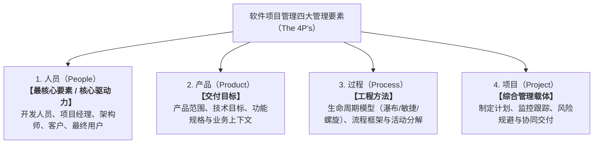
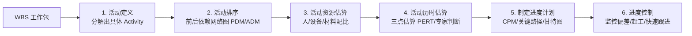
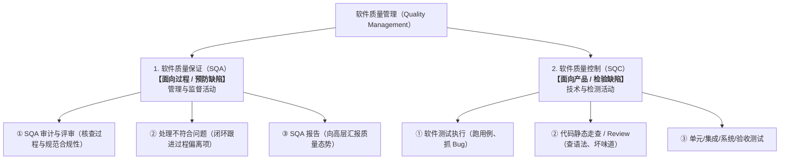
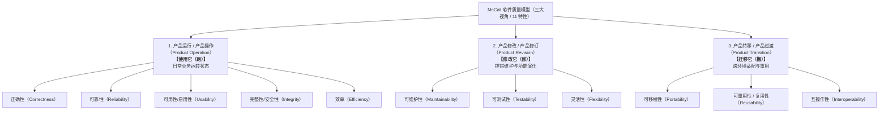

---
tags:
  - 软考
  - 系统架构设计师-高级
  - 第 5 章
---

# 第 5 章 软件工程基础知识

> 目录骨架依据《系统架构设计师教程（第 2 版）》；具体知识内容在题目归档时补充。

## 5.1 软件工程

### 5.1.1 软件工程定义

[考查：综合知识]

#### 软件开发环境（SDE）的三大集成机制

- SDE = **软件工具集** + **环境集成机制**；集成机制负责把零散工具粘合成一个"环境"。
- 三大集成机制（按功能划分）：
  1. **环境信息库**：存"内容"——存储与系统开发有关的信息，并支持信息的交流与共享；开发中产生的信息（文档、模型、代码、配置等）皆入此库。关键词：**存储 / 共享**。
  2. **过程控制与消息服务器**：管"过程"——是实现**过程集成**和**控制集成**的基础，作为工具间的消息/事件中枢。关键词：**过程集成基础**。
  3. **环境用户界面**：管"外观"——它的**统一性和一致性**是软件开发环境的重要特征，使用户面对的是"一个环境"而非零散工具。关键词：**统一、一致**。
- 口诀：**信息库存内容，消息器管过程，界面统一保一致**。
- 易错点：干扰项常给"底层数据结构 / 数据处理方法 / 业务过程模型"这类**实现细节或外延概念**，它们不与三大机制平级——层次错位，看到就排除。

#### 软件开发工具分类（按辅助的活动阶段）

- **建模工具**：辅助建立软件系统的抽象模型（类图、序列图、活动图等）——**Rose、Together、WinA&D、QuickUML**。
- **编程工具**：编码 / 集成开发环境——Delphi、Visual 系列 IDE。
- **测试工具**：**LoadRunner**（性能 / 负载测试）、**WinRunner**（功能 / 回归测试，录制回放）——"Runner"家族都是测试工具。
- **识别法**：抓"名字基因"——Runner = 测试；UML / Rose / Together = 建模；Delphi / Visual = 编程 IDE。按"辅助哪个阶段的活动"归类，不按"听没听说过"归类。

#### 项目管理工具（管理活动白名单判别） ⭐⭐

- **项目管理活动白名单（教程口径六件套）**：**计划、调度、通信、成本估算、资源分配、质量控制**。口诀：**计划调度通信，成本资源质量**。
- **典型代表**：**成本估算工具**（教科书级答案）；甘特图等进度计划工具（服务调度，真题考法）。
- **判别法**：工具归类看**服务对象**——服务对象在白名单内 → 项目管理工具；**"项目中发生的活动" ≠ "项目管理活动"**。常见排除项：需求分析工具（服务需求开发，开发家族）、DFD 等建模工具（服务分析设计）、版本控制工具（服务配置管理，支持类）、软件评价工具（评价/度量支持类）、文档分析工具（文档处理支持类）。
- **特征补充**：一个项目管理工具通常只把重点放在某一个或某几个特定管理环节上，不提供对管理活动包罗万象的支持；覆盖整个软件生存周期。

#### 软件著作权产生时间（知识产权考点；教程第 2 版无专章，按题库章节标记暂归本节）

- **自动产生原则**：软件著作权**自软件开发完成之日起产生**——不需要申请、登记、发表（对比：专利权须申请审批才产生）。
- **三件事分开**：权利**产生**（完成之日）≠ 权利**证明**（登记证书 = 归属的**初步证据**，自愿手续）≠ **保护期起算**（单位作品自首次发表起 50 年）。
- **表达 / 思想二分**：著作权保护表达不保护思想——只有开发意图、创意、计划而没有完成的代码，不享有著作权。
- 真题锚点：[[个人资料/笔记/软考/软件设计师-中级/真题库/上午题/2018-下半年-上午#Q66|2018 下半年软设上午 Q66]]（登记证书＝初步证据，非必要条件）；[[个人资料/笔记/软考/软件设计师-中级/真题库/上午题/2020-下半年-上午#Q67|2020 下半年软设上午 Q67]]（著作权自动产生 vs 专利须审批）。
- **保护期限（数字题送分点）**：软件著作权 **50 年**——自然人：终生 + 死后 50 年（截止第 50 年 12 月 31 日）；单位：首次发表后 50 年（完成 50 年内未发表不再保护）。**署名权、修改权（人身权）永久保护**，不受期限限制。
- **知识产权期限全表**：著作权 50 年；发明专利 20 年；实用新型 / 外观设计专利 10 年；商标权 10 年（期满**可续展**）；商业秘密**无时间限制**（以保密措施有效为条件）。口诀：**著作 50，发明 20，新型外观和商标都是 10；商业秘密不设限，署名修改保永久**。
- 真题锚点（期限考法）：[[个人资料/笔记/软考/软件设计师-中级/真题库/上午题/2020-下半年-上午#Q69|2020 下半年软设上午 Q69]]（四权利期限混合辨析，发明 20 年为正确项）。

### 5.1.2 Kruchten 4+1 视图模型

[考查：综合知识 / 论文素材（O1 提纲）]

> 严格出处：教程 1.1.2 软件架构的常用分类及建模方法（p9）；此处归到 5.1 作为多视图建模的延伸。

- **提出**：Philippe Kruchten，1995 年。用 **4 个独立视角 + 1 个场景** 共同刻画系统，每个视图对应一类利益相关人。
- **五个视图**（固定组合，换字即错）：
  1. **逻辑视图（Logical View）**：系统的**功能与对象结构**，最终用户 / 业务分析师视角。
  2. **开发视图（Development View）**：**程序员视角**——模块、库、子系统的组织、编译/打包。
  3. **物理视图（Physical View）**：**部署视角**——硬件拓扑、节点、网络、构件到节点的映射。
  4. **进程视图（Process View）**：**运行视角**——并发进程、线程、运行时通信与同步。
  5. **场景视图（Scenarios / Use-case View）**：用用例**串起前 4 个视图**——即 "+1"。
- **口诀**（四字成语链）：
  > **逻开物进，场归一统**（罗开悟见 → 归一统）
- **关键词反查**：

| 关心什么 | 对应视图 |
|---|---|
| 用户能看到什么功能/对象 | 逻辑视图 |
| 程序员如何组织代码/模块 | 开发视图 |
| 硬件/节点如何部署 | 物理视图 |
| 运行时并发/通信/同步 | 进程视图 |
| 用例如何贯穿其他视图 | 场景视图（+1） |

- **常见偷换**（必排除）："领域视图 / 构件视图 / 模块视图 / 子系统视图"——领域视图属 DDD 业务建模概念，构件/模块视图实质是开发视图的别名，都会破坏 4+1 的固定成员。
- 论文素材：可作为 [[个人资料/笔记/软考/系统架构设计师-高级/02_论文项目底稿#O1：4+1 视图与服务化架构设计|O1 提纲]] 的骨架，五视图逐段铺陈。
- **易错点（用例视图定位）**：用例视图是"+1"的**串联者**——用用例串起逻辑/开发/物理/过程四视图做架构验证，**自身不承载对象结构**；题干出现"对象模型 / 对象之间的关系"归**逻辑视图**，被"对象之间"联想到"用户交互/用例"是典型误引。
- **题组考法**：4 选项 = 4 视图、3 空各占 1 个，**每个视图只用一次**——确定一空即可压缩剩余空的范围（空 46 逻辑 / 空 47 开发 / 空 48 过程）。

### 5.1.3 软件过程模型

[考查：综合知识]

#### 软件过程的四大基本活动（教材固定口径）

- 软件过程 = 制作软件产品的一组活动以及结果，主要由软件人员完成；四大活动固定成员：
  1. **软件描述**：定义软件功能以及使用的限制；
  2. **软件开发**：软件的设计和实现，制作出满足描述的软件（**设计、实现是其内部子活动**，不与大活动平级）；
  3. **软件有效性验证**：软件必须经过严格验证，保证满足客户需求（**测试只是验证的手段之一**，"测试"不能顶替"验证"成项）；
  4. **软件进化**：软件随客户需求的变化不断地改进（交付后仍是过程活动）。
- 口诀：**「描开验化」**。
- **粒度陷阱**：选项把"软件设计 / 实现 / 测试"单独成项 → 排除（子活动提升为大活动，且常伴随漏掉"进化"）。
- **瀑布模型识别线**：题干"活动之间存在**因果关系**，前一阶段工作的结果是后一阶段工作的输入" → 锁**瀑布模型**。

#### 螺旋模型（Spiral Model，Boehm 1988）

- 在**快速原型**基础上扩展而成的生存周期模型，核心思想是**风险驱动**。
- 软件开发过程分为多个阶段（螺旋周期），每圈固定由 4 个部分组成（四象限）：
  1. **目标设定**：确定本阶段目标、可选方案与约束，制定管理计划（需求分析只是本环节内部的一项活动）。
  2. **风险分析**：识别并分析可选方案的风险，制定解决办法并采取措施规避风险——螺旋模型区别于其他模型的**标志性环节**。
  3. **开发和有效性验证**：实施开发并验证产品（设计、编码、测试等）。
  4. **评审**：评价本阶段成果，决定是否进入下一圈并制定下阶段计划。
- 口诀：**定目标 → 析风险 → 做开发 → 搞评审**。
- 适用：**大型、高风险**项目；风险分析依赖专业人员、成本高，不适合小型低风险项目。
- 识别线索：题干出现"目标设定／开发和有效性验证／评审／4 个部分"→ 填**风险分析**；出现"风险驱动、大型高风险项目"→ 选**螺旋模型**。
- 易错点：干扰项常从"环节内部活动"中出（需求分析、系统设计、架构设计、编码），它们不是象限名。
- **组成来源考点（"结合"类双向填空）**：
  $$\text{螺旋模型} = \text{瀑布模型（即生命周期模型 / 经典生命周期模型）} + \text{快速原型模型} + \text{风险分析}$$
  - **考法 ①（考原型）**：题干问“将瀑布模型和（ ）结合起来，强调项目的风险分析” $\implies$ 填**快速原型模型**。
  - **考法 ②（考瀑布/生命周期）**：题干问“螺旋模型是原型模型与（ ）的结合” $\implies$ 选项若未给出“瀑布模型”，必选**“生命周期模型”**（Classic Life Cycle Model，提供阶段管控与里程碑受控基因）！
  - ❌ **排雷避坑**：切勿错选“迭代模型”——“迭代演化”是螺旋模型的运行机制与动作特征，不是与之并列结合的独立模型实体。
- **易错辨析（迭代来源）**：螺旋"沿螺线多次迭代"的迭代演化基因来自**快速原型**（反复构建、修改同一个原型），**不是增量模型**——增量模型的核心是"需求可分割、**分批交付**可运行的部分产品"，本身不含风险分析。判别词："风险分析 / 大型复杂"→ 螺旋；"分批交付 / 可独立交付的部分"→ 增量。
- **真题锚点**：
  - [[个人资料/笔记/软考/软件设计师-中级/真题库/上午题/2020-下半年-上午#Q25|2020 下半年软设上午 Q25]]（螺旋＝瀑布＋**风险分析**）。

#### 主要特点反向辨析（"不包括"题） ⭐

- 螺旋模型三铁标签：**风险驱动（强调风险分析）、迭代演化、适合大型高风险项目**——反向选择题中命中标签的选项直接排除。
- **瀑布模型身份证**："各阶段严格顺序、**不能并行**、需求明确一次性开发"——在"螺旋模型特点不包括"题中就是要选的异类。
- **规格说明边界**："面向规格说明"不是瀑布与螺旋的区分词——瀑布是**前期一次性**定死规格，螺旋是**每圈迭代**产出并修订规格；别把"规格说明"整体划给瀑布。
- 真题锚点：[[个人资料/笔记/软考/系统架构设计师-高级/真题库/上午题/2009-下半年-上午|2009 下半年上午]]（瀑布＝按顺序完成各阶段、需求明确稳定）；[[个人资料/笔记/软考/系统架构设计师-高级/真题库/上午题/2024-上半年-上午#Q24|2024 上半年上午 Q24]]（螺旋＝结合瀑布与原型、迭代＋风险分析、适用高风险项目）。

### 5.1.4 敏捷模型 ⭐⭐

[考查：综合知识（敏捷价值观、采用敏捷的原因辨析、敏捷方法家族识别；与瀑布立场对比）]

#### 一、敏捷与瀑布的根本立场差异

敏捷产生的根本原因就是**否定瀑布的若干核心假设**。判断"是不是采用敏捷的原因"题时，先按立场归类即可秒判：

| 维度 | 瀑布（传统） | 敏捷 |
|---|---|---|
| 需求 | 期望前期稳定 | 接受需求变化，拥抱变化 |
| 设计与实现 | 可以**分离**，设计先行 | **交错**，并行演进 |
| 计划 | 长周期、详细文档驱动 | 短迭代、滚动调整 |
| 工作产品 | 大量文档、基线 | 最小化工作产品 |
| 反馈媒介 | 文档、原型评审 | **可运行系统**、持续交付 |
| 团队 | 大型、层级化 | **小而高度自主** |
| 方法 | 形式化、正式 | **非正式** |

- **口诀**：**瀑布讲分离，敏捷讲交错**；瀑布讲文档，敏捷讲可运行。

#### 二、采用敏捷的三大原因（反例识别核心）⭐⭐⭐

软考反例题（"**不是**采用敏捷的原因"）的标准答案线索：

1. **需求难以稳定预测**——哪些需求稳定、哪些会变化难提前判断 → 需迭代增量交付。
2. **分析/设计/实现/测试难以精确预测**——计划驱动失效 → 敏捷以短迭代滚动调整。
3. **可执行原型 + 部分实现的可运行系统是用户需求反馈的有效媒介**——靠文档评审不靠谱，靠"跑起来"反馈。

> 凡是选项说"设计与实现可以分离""瀑布式分阶段"等**瀑布立场**，必为"不是采用敏捷的原因"。

#### 三、敏捷价值观与原则（4 价值观 + 12 原则摘要）

- **4 大价值观**（《敏捷宣言》）：

| 价值观 | 立场（左边胜于右边） |
|---|---|
| 1 | **个体和交互**胜于流程和工具 |
| 2 | **可工作的软件**胜于详尽的文档 |
| 3 | **客户合作**胜于合同谈判 |
| 4 | **响应变化**胜于遵循计划 |

> **记忆口诀**：**人活客变**（个体/可工作/客户合作/响应变化 全部胜出）。

**12 条原则摘要**：客户满意 → 欢迎变化 → 短迭代交付 → 业务与开发每日协作 → 以人为本 → 面对面沟通 → 可工作软件是进度度量 → 敏捷节奏可持续 → 持续关注技术与设计 → 简洁为本 → 自组织团队 → 定期反思调整。

#### 四、敏捷型方法的两个主要特点（本质属性 vs 过程做法）

[考查：综合知识（"两个主要特点"定义辨析）]

- **教材口径**：敏捷型方法的两个主要特点 = **适应性** + **面向人**。
- **对立轴**（成对记忆，敏捷 ↔ 传统计划驱动/重型方法）：

| 轴 | 敏捷型（轻型） | 传统（计划驱动/重型） |
|---|---|---|
| 计划观 | **适应性**（拥抱变化、滚动调整） | **预设性 / 可预测性**（前期定计划） |
| 驱动力 | **面向人**（个体和交互高于流程和工具） | **面向过程 / 面向技术** |

- **判别词**：题干问"**主要特点 / 主要特征 / 区别于其他方法**"→ 选本质属性（适应性、面向人）；问"**开发方式 / 过程特征**"才落到迭代、增量。
- **易错点**：**迭代性、增量式是敏捷的过程做法，不是本质特点**，且非敏捷独有（螺旋模型、RUP、演化式原型同样迭代增量）→ 在"主要特点"题中作干扰项排除。
- **反向变式**：传统计划驱动方法的两个主要特点 = **预设性 + 面向过程**。

#### 五、敏捷方法家族速查 ⭐⭐

| 方法 | 核心特征 | 关键词 |
|---|---|---|
| **XP**（极限编程） | 12 项技术实践 | **结对编程、TDD、重构、持续集成、简单设计** |
| **Scrum** | Sprint 迭代 + 三角色五事件 | **Product Owner / Scrum Master / Dev Team；Sprint 计划/站会/评审/回顾** |
| **Crystal** | 以人为本、按团队规模选择 | **色系（透明/黄/橙/红…）、灵活** |
| **FDD**（特征驱动开发） | 特征列表驱动 | **特征驱动、面向客户** |
| **DSDM** | 业务为先 + 时间盒 | **MoSCoW 优先级、时间盒** |
| **ASD**（自适应） | 推测-协作-学习循环 | **推测、混沌、适应** |
| **Lean**（精益） | 消除浪费、价值流 | **消除浪费、价值流分析** |

- **口诀**：**XP 技术 Scrum 流，Crystal 因人异，FDD 特征 DSDM 业务，ASD 适应 Lean 精益**。
- **最常错点**：把 XP 的"结对/TDD"算到 Scrum 或 Crystal，把 DSDM 的"时间盒/MoSCoW"算到 Crystal。
- **XP 反向辨析（"错误的是"题）**：XP 四立场为真——测试先行（TDD）、**轻文档**（初期无需很多文档 ≠ 完全不要文档）、结对编程（两人一台机）、重构；**重构涵盖代码和设计两个层面**，选项说"**只包含**设计技术的重构"→ 错误项。反向题中绝对化限定词"只 / 仅 / 所有 / 完全"是经典错误项信号。

#### 六、易错辨析速查（反例题直接套）

| 选项立场 | 是否"采用敏捷的原因" | 判别口诀 |
|---|---|---|
| 需求难预测（A 类） | ✓ 是 | "难以预测 / 容易变化" → 敏捷 |
| 分析/设计/测试难精确预测（C 类） | ✓ 是 | "不容易预测" → 敏捷 |
| 可执行原型/可运行系统是反馈媒介（D 类） | ✓ 是 | "可执行 / 部分实现 / 可运行" → 敏捷 |
| 设计与实现可基本**分离**（B 类） | ✗ 不是 | "分离 / 设计先行" → **瀑布立场**，**反例** |

#### 七、XP 案例题答题框架（下午题）⭐⭐

[考查：案例分析（简答）]

- **通用解法**：案例答案全部从题干线索长出来——先圈线索（规模、工期、需求明确度、技术风险、外包/团队结构），每个答案要点必须能指回某条线索。
- **四大固定考向**（以题库题目 171 为母版）：
  1. **原型 vs XP 小规模发布的差别（= 功能真实性）**：原型是**一次性验证工具**（确认需求 / 测试关键技术），功能非真实、不能评价实际系统；小规模发布是**真实产品子集**——开始时功能不全，但每个已含功能与可发布产品定义一致，功能集实用、质量可健壮运行。
  2. **何时不用原型**：无技术风险（不需验证）＋ 工期短（原型与真开发工作量相当，浪费时间）＋ 需求多变（XP 重构 / 持续集成 / 小规模发布可应对）。
  3. **XP 的六类问题**：①团队/管理层/客户**不理解** → 实施受阻；②**轻文档**被当借口拒写必要文档；③为**单一团队**设计，外包/多团队难组织；④依赖**客户现场参与**（用户故事、优先级确认）；⑤**规模**扩大不适用；⑥对客户/开发/管理者**素质**要求高。记忆锚点：**人、文、团队、客户、规模**。
  4. **XP 与传统结合（大拆小）**：与**增量式开发**结合——大项目划分为若干有共同目标的小项目，XP 管小项目内部、传统过程监控全局，建立面向目标的项目管理。
- **题库答案勘误**：题目 171 官方答案"XP 小型发布的系统**考试时**不包括足够的功能"应为"**开始时**"（OCR 错字）。

#### 八、关联知识点串联

- **与 5.1.3 螺旋模型**：螺旋模型用"风险驱动"周期迭代，与敏捷"短迭代"思路相通；但螺旋仍属于重型过程，敏捷更轻、更拥抱变化。
- **与 5.1.5 RUP**：RUP 的"用例驱动 + 架构中心 + 迭代增量"三大特征借鉴了敏捷思想，但 RUP 是**有纪律的过程框架**，比敏捷更重型、更文档化；二者都迭代，但敏捷更轻。
- **与 5.1.6 CMMI**：CMMI 5 级"持续过程改进"与敏捷"定期反思调整"理念相通；CMMI 4 级以下偏计划驱动，与敏捷对立。

#### 九、Scrum 流程与工件（状态图 + 元素归类考法）⭐⭐

[考查：案例分析（状态图填空、元素归类）/ 综合知识]

- **三种角色**：Scrum 主管、产品负责人、开发团队。
- **两类 Backlog + 两类燃尽图**：**Product Backlog** = 按商业价值排序的需求列表（条目形式 = **用户故事**）；**Sprint Backlog** = 本 Sprint 任务清单（计划会议产出）。燃尽图分 **Sprint 燃尽图**与 **Release 燃尽图**，每日站立会议时更新。
- **三种会议流水线**（状态图高频空）：
  1. **Sprint 计划会议**：从 Product Backlog 挑选最高优先级用户故事，细化分解为 Task，初步估算每个任务预计完成时间，编写 Sprint Backlog；
  2. **每日站立会议**：Sprint 期间每天早晨举行，重新估算剩余任务预计完成时间，更新 Sprint Backlog 与燃尽图（Sprint 未结束 → 自循环）；
  3. **评审会议 + 回顾会议**：Sprint 结束时召开，交付产品增量、总结工作情况与问题。
- **迭代分流条件**：Sprint 结束后，Product Backlog **还有未完成用户故事** → 筹备下一个 Sprint（回到计划会议）；无剩余 → 交付产品增量、项目交付。
- **状态图口诀**：**Product Backlog 排队 → 计划会选人 → 站会追进度 → 评审收尾 → 有剩再来一轮，没剩交付**；方框填状态/产物、箭头填事件/条件。

### 5.1.5 统一过程模型（RUP）

[考查：综合知识]

- **RUP 三大特征**：用例驱动、以架构为中心、迭代增量式开发。

- **特征辨析（干扰项配方）**：RUP 的方式固定是"**迭代和增量**"；选项混入其他模型名字（原型、螺旋）或别的模型招牌词（"**快速**"→ 原型/RAD；"重构 / 持续集成"→ XP）→ 直接排除。
- **迭代和增量的好处**（教材四点）：① 单个迭代出错损失仅限该迭代 → 降**开支风险**；② 风险在早期迭代暴露 → 降**进度风险**；③ 团队焦点清晰 → 效率更高；④ 需求在后续迭代逐步细化 → 更易**适应需求变化**。

#### 四阶段 ↔ 任务映射（一个开发周期 = 初始→细化→构建→移交；每完整经过一次产生一代软件）

| 阶段 | 核心任务 | 锚点词 | 里程碑 |
|---|---|---|---|
| 初始 Inception | 建立**业务模型**，确定项目边界与范围 | 业务模型 / 项目边界 | 生命周期目标 |
| 细化 Elaboration | 分析问题领域，建立**架构基线**，**淘汰最高风险**元素 | 架构基线 / 最高风险 | 生命周期体系结构 |
| 构建 Construction | 开发所有剩余构件与功能，**集成为产品** | 开发集成 / 出产品 | 初始运行能力 |
| 移交 Transition | 交付部署，确保软件对**最终用户可用** | 最终用户可用 | 产品发布 |

- **口诀**：**初始建业务，细化定架构降风险，构建出产品，移交保可用**。
- 每个阶段由一个或多个连续迭代组成；迭代式开发即多次经过四阶段，每次产生一代软件。
- **易错点**：题干强调"每次通过 4 阶段就会产生一代软件"时，易被"产出感"带向构建阶段——判别词是任务内容（**业务**模型），不是"是否产生软件"；构建产出的是**软件产品**，业务建模只发生在初始阶段。
- **判别词扩充（题库另一表述）**："设计及确定系统的**体系结构**，制订**工作计划及资源要求**"是**细化阶段**的教材原话——看到"体系结构 / 架构"选**细化**，看到"业务模型 / 系统范围"选**初始**（业务层面 vs 架构层面）。注意："**计划 / 资源**"不是初始的信号——初始只定业务蓝图（要不要做），详细工作计划与资源估算须等架构基线确立后（细化）才做得出（同日变体题二次答错验证）。

**真题锚点**：

- [[个人资料/笔记/软考/系统架构设计师-高级/真题库/上午题/2023-下半年-上午#Q20|2023 下半年上午 Q20]]：RUP 细化阶段＝处理风险和验证架构。

#### 9 核心工作流（6 核心过程 + 3 核心支持） ⭐⭐

[考查：综合知识 / 案例分析（简答，300 字内说明作用）]

- **6 个核心过程工作流**（"造软件的顺序"）：
  1. **业务建模 / 商业建模（Business Modeling）**：为目标组织开发构想，在商业用例/对象模型中定义组织的过程、角色与责任；
  2. **需求**：描述系统该做什么，提取、组织、文档化功能与约束，使开发人员与用户达成共识；
  3. **分析和设计**：将需求转化为设计，以**体系结构设计为中心**（若干结构视图表达），优化性能；产出设计模型（+可选分析模型）；
  4. **实现**：层次化子系统组织代码，以组件形式实现类和对象，单元测试并集成为可执行系统；
  5. **测试**：验证对象交互与组件正确集成、检验需求已正确实现；**全程迭代测试**尽早发现缺陷、降低修改成本；从可靠性、功能性、系统性能三维进行；
  6. **部署**：成功生成版本并分发给最终用户——打包、安装、用户帮助，可含 beta 测试、移植与正式验收。
- **3 个核心支持工作流**（"管开发的底座"）：⑦ **配置和变更管理**（控制大量产物、管理版本与变体、支持并行/分布式开发、保留修改审计记录）；⑧ **项目管理**（平衡冲突目标、管理风险，为计划/人员配备/执行监控提供框架）；⑨ **环境**（提供开发环境——过程和工具，配置项目过程所需活动）。
- **记忆法**：前 6 个 = 建模→需求→设计→实现→测试→部署（造软件顺序）；后 3 个 = 配置、管理、环境（支撑底座）。
- **高频设陷点与伪工作流排查**：
  - 🚫 **“风险（Risk）”不是独立工作流**：虽然 RUP 是“风险驱动”的过程，但“风险管理”始终作为“项目管理”支持工作流内部的一项日常活动；细化阶段也以消除高风险为核心目标，但绝不存在名为“风险”的独立平行工作流。
  - 🚫 **“商业建模（业务建模）”是正规工作流**：英文原词为 Business Modeling，软考题库中“业务建模”与“商业建模”为同义互换译法，切勿将其误当作企业外部经营活动排除。
- **案例答法**：每个工作流写"目标一句 + 结合案例一句"（如汽车租赁系统：业务建模＝理解租赁业务流程；需求＝明确预约/提还车等操作）。
- **真题与题源锚点**：
  1. 高级下午案例分析 汽车租赁系统题（软考达人题目 172，本地真题库未收录）；
  2. 【题库章节练习/真题回忆版】（第五章 软件工程基础知识（新第2版）/ 第七节 软件项目管理，题目 55 双空题）：题干“统一过程开发方法分初始、细化、构建和移交四个阶段……其中完成系统架构为细化阶段；9 个核心工作流中不包括（ ）” $\to$ 选“风险”（干扰项为商业建模、实现、环境）。

### 5.1.6 软件能力成熟度模型 ⭐⭐⭐

[考查：综合知识（5 级辨析、阶段式 vs 连续式、4 级 vs 5 级边界，必拿分）]

#### 一、CMMI 阶段式表示法——五个成熟度级别 ⭐⭐⭐

| 级别 | 英文 | 一句话职责 | 关键特征短语 |
|---:|------|-----------|------------|
| 1 | 初始级（Initial） | 过程是临时的、无序的，依赖个人英雄 | 临时的 / 无序的 / 依赖个人 |
| 2 | 已管理（Managed） | **项目级**管控：过程被计划、执行、跟踪、控制 | 项目计划 / 跟踪 / 配置管理 |
| 3 | 已定义（Defined） | **组织级**标准化：过程被文档化、纳入组织过程资产 | 组织过程资产 / 文档化 / 培训 |
| 4 | 量化管理（Quantitatively Managed） | 用统计技术**控制单项目子过程**性能，建立量化目标 | 子过程性能 / 统计过程控制 / 量化目标（**单项目内**） |
| 5 | 优化（Optimizing） | **跨多个项目**采集数据，关注**整体组织级绩效**，持续过程改进 | **多个项目数据** / **整体组织级绩效** / 持续过程改进 / 缺陷预防 |

- **口诀**（五字速记）：
  > **「初管定量优」**（初始 → 管理 → 定义 → 量化 → 优化）
- **口诀**（四级→五级辨析）：
  > 「单子量，整组优」——量化管的是**单个子过程**，优化管的是**整个组织**

#### 二、4 级 vs 5 级边界（最高频错点）⭐⭐⭐

| 维度 | 4 级 量化管理 | 5 级 优化 |
|------|-------------|----------|
| 关注对象 | **单个项目**的子过程性能 | **多个项目 / 整个组织**的绩效 |
| 数据来源 | 单项目内的度量数据 | **跨多个项目**采集的数据 |
| 核心目标 | 用统计技术**控制**过程，使过程稳定、可预测 | 用跨项目数据**反馈改进**，持续优化组织级过程 |
| 类比 | 单台机器的温控仪表 | 整个工厂的多车间数据中台 + 工艺改进闭环 |
| 典型技术 | 统计过程控制（SPC）、量化目标管理 | 缺陷因果分析、过程变更管理、技术创新管理 |

- **判定口诀**：题干出现「**多个项目**」+「**整体组织级绩效**」→ 直接锁 5 级优化；题干只谈「**单项目**」「**子过程性能**」「**量化目标**」→ 4 级量化管理。

#### 三、关键词反查表（出题点）⭐⭐⭐

| 题干关键词 | 锁定级别 |
|-----------|---------|
| 临时的、无序的、依赖个人英雄 | 1 初始 |
| 项目计划、跟踪、控制、配置管理 | 2 已管理 |
| 组织过程资产、文档化、标准化、培训 | 3 已定义 |
| 子过程性能、统计过程控制、量化目标（**单项目内**） | 4 量化管理 |
| **多个项目数据**、**整体组织级绩效**、持续过程改进、缺陷预防 | **5 优化** |

#### 四、CMMI 两种表示法辨析（易混名）

| 表示法 | 等级数 | 名称（软考默认阶段式） |
|--------|------:|----------------------|
| **阶段式**（Staged） | **5 级** | 初始 / 已管理 / 已定义 / **量化管理** / **优化** ← 软考默认 |
| **连续式**（Continuous） | **6 级** | CL0 未完成 / CL1 已执行 / CL2 已管理 / CL3 已定义 / CL4 **定量管理** / CL5 **优化** |

- 同一道题两种表示法都能答，**但名称不完全一样**：「量化管理」（阶段式）vs「定量管理」（连续式 CL4）。
- 软考默认**阶段式**；看到 CL× 默认走连续式。
- 关键差异：连续式多一个 CL0「未完成」（过程不存在或未识别）和 CL1「已执行」（过程被执行但未受控）；阶段式 1 级「初始」在连续式中无严格对应——连续式从 CL1 开始记录可执行过程。

#### 五、易错辨析速查

| 常见错答 | 错因 | 修复路径 |
|---------|------|---------|
| 看到「量化/数据/绩效」就选 4 级 | 忽略「多个项目」「整体组织级」两个 5 级专属信号 | 凡是题干强调跨项目 + 组织级 → 必选 5 优化 |
| 看到「标准化/文档化」就选 5 级 | 把 3 级「已定义」混入 5 级特征 | 5 级必含「跨项目数据反馈」机制，3 级只是过程标准化 |
| 混淆「量化管理」与「定量管理」 | 名称相似 | 默认阶段式 = 「量化」；连续式 CL4 = 「定量」 |
| 把 1 级「初始」对应到连续式 CL1 | 表示法错位 | 初始级在连续式中无严格对应；连续式 CL1 是「已执行」（过程被执行但未受控） |

#### 六、CMMI 体系文件四层塔型结构 ⭐

[考查：综合知识（自顶向下排序题）]

软件企业实施 CMMI 本地化时建立的软件质量管理体系文件，按**自顶向下（抽象 → 具体）**塔型排列为四层：

| 层 | 文件 | 一句话职责 | 锚点词 |
|---:|---|---|---|
| 1 | **顶层方针** | 组织标准软件过程的高层抽象描述，反映公司过程改进总体方针，主管副总裁批准 | 方向 / 政策 / 批准 |
| 2 | **过程文件** | 规定项目开发中执行该过程应执行的各项活动及适用标准，须符合方针 | 活动 / 适用标准 |
| 3 | **规程文件** | 对过程中**某些复杂活动的具体描述** | 复杂活动 / 具体描述 |
| 4 | **模板类文件** | 标准、规范、指南、模板、Checklist、范例库等**支持性文档**，为上级过程/规程提供细致步骤，**从属于上级** | 模板 / Checklist / 支持性 |

- **口诀**：**方针定方向，过程定活动，规程写细节，模板是工具**（工具永远在最底层）。
- **排序依据是"对操作的指导颗粒度"，不是"通用性"**——模板/Checklist 虽通用可复用，但颗粒度最细、最具体，只能在塔基；把模板类放高层是本考点第一陷阱。
- 解题套路：先锁无争议首位（方针），再两两比较"谁是谁的具体化"：规程是过程的具体化（③在④上），模板是过程/规程的支持工具（②垫底）。

#### 七、关联知识点串联

- 与 5.1.3 螺旋模型：CMMI 5 级「优化」与螺旋模型「风险驱动」理念相通——都以反馈改进为核心
- 与 5.6.2 CBSE：CBSD 强调复用与演化，与 CMMI 4 级「已定义」要求的组织过程资产、构件库建设直接相关
- 与第 10 章 10.x 软件架构演化：CMMI 5 级「持续过程改进」是架构演化的组织级方法论支撑

### 5.1.7 原型开发方法（Prototyping）⭐⭐

[考查：综合知识（单空选择，"原型的叙述中正确的是"形式）]

#### 一、原型分类的两个维度 ⭐⭐⭐（核心模型）

| 维度 | 类型 | 一句话职责 | 一句话类比 |
|------|------|-----------|-----------|
| **是否实现功能** | **水平原型**（Horizontal / 行为原型） | 只模拟界面/交互，**不实现功能逻辑** | **橱窗样品**（摆着好看，不能用） |
| **是否实现功能** | **垂直原型**（Vertical / 结构化原型） | 对**关键功能**做完整实现（UI+业务+数据） | **试制样机**（核心功能能用，但只是验证） |
| **最终结果** | **抛弃式原型**（Throwaway / 快速原型） | 目的是**获取需求**，验证后**抛弃不用** | **草稿纸**（写了就扔） |
| **最终结果** | **演化式原型**（Evolutionary） | 原型**迭代演化**为最终系统 | **毛坯房**（一步步装修成精装房） |

> 两个维度**正交**：水平/垂直 = 画皮 vs 验算法；抛弃/演化 = 草稿 vs 毛坯房。

#### 二、关键短语 → 原型映射 ⭐⭐⭐（出题套路）

| 题干关键词 | 锁定原型 |
|-----------|---------|
| 「**需求不确定 / 不完整 / 含糊不清**」 | **抛弃式原型** ✅ |
| 「**界面 / 交互（不实现功能）**」 | **水平原型** |
| 「**关键功能 / 复杂算法**」 | **垂直原型** |
| 「**逐步演化 / 迭代成最终系统**」 | **演化式原型** |

#### 三、易错辨析速查

| 常见错答 | 错因 | 修复路径 |
|---------|------|---------|
| 「水平原型适合算法复杂」 | 张冠李戴 | 水平**不实现**算法，应是垂直原型 |
| 「垂直原型适合 Web 项目」 | 强行对应 | 项目类型不在分类标准里 |
| 「演化式原型主要用于界面设计」 | 双重张冠李戴 | 演化是整个系统演化；界面设计→水平原型 |
| 「抛弃式原型不能复用」 | 误解分类 | 抛弃式**核心是用完就扔**，与"是否复用"无关 |

#### 四、易错与避坑清单

- ❌ **水平 = 算法**：错！水平原型**不实现**算法；垂直原型才验算法
- ❌ **垂直 = Web 项目**：错！项目类型不在分类标准里
- ❌ **演化 = 界面设计**：错！演化是**整个系统**演化；界面用**水平**原型
- ❌ **抛弃式 = 不能复用**：错！抛弃式是**目的为获取需求**，与是否复用无关
- ✅ 「**需求不确定 / 不完整 / 含糊不清**」题眼 → **抛弃式原型** ✅
- ✅ 「**界面 / 交互**」题眼 → **水平原型**
- ✅ 「**关键功能 / 复杂算法**」题眼 → **垂直原型**
- ✅ 「**逐步演化 / 迭代成产品**」题眼 → **演化式原型**

#### 五、答题模板（考场上套）

```
第 1 步：识别题干是不是"原型分类"题 → 看到"水平/垂直/抛弃/演化"任一关键词
第 2 步：判断描述对象
        "需求不确定/不完整/含糊不清" → 抛弃式原型 ✅
        "界面/交互（不实现功能）" → 水平原型
        "关键功能/复杂算法" → 垂直原型
        "逐步演化/迭代成产品" → 演化式原型
第 3 步：排除"项目类型"作为分类标准（错答 B 类型）
第 4 步：兜底
        看到"演化 + 界面" → 双错误组合
        看到"水平 + 算法" → 反向陷阱
```

#### 六、口诀速记

> **「水平画界面，垂直验算法；抛弃为需求，演化做产品」**

#### 七、关联知识点串联

- 与本章 5.1.3 螺旋模型——螺旋模型"在**快速原型**基础上扩展而成"，5.1.7 是其前置概念
- 与本章 5.1.5 RUP——RUP 的迭代开发思想与**演化式原型**同源
- 与第 7 章"系统架构设计基础知识"中"原型法架构设计"是落地形式
- 与第 10 章"软件架构的演化和维护"中"基于原型的演化"是相关思想

#### 八、英语完形锚点：accelerated analysis = prototypes ⭐

- **语义场判别**：英语完形填名词时**先圈限定词定语义场，再让名词对场入座**——`accelerated / more rapidly identify … requirements` → **prototypes**（加速分析方法的标志性手段：快速搭出可演示原型，让用户立刻反馈，加速需求识别）；`object-oriented / objects and classes` → **object models**。
- **陷阱**：`construction of` 这类动词搭配四个名词选项通吃，**没有区分度**，不能拿搭配感当依据（construction of models 的字面顺畅≠正确）。
- **产物 vs 手段**：object models / use cases / components 都是分析或设计的**产物工件**；题干主语是 analysis **approaches**（方法路线）时，要填的是"用什么手段加速"，不是"分析产出什么模型"。

---

## 5.2 需求工程

### 逆向工程四抽象级别（设计的恢复过程） ⭐⭐

[考查：综合知识（级别—产物对号）；题库章节标记"第二节 需求工程"，考点实为逆向工程（软件维护 / 再工程域）]

- **定义**：逆向工程是**设计的恢复过程**——从已有系统/代码反向恢复出各抽象级别的设计信息。
- **四级阶梯**（由低到高）：

| 级别 | 恢复的信息 | 典型产物 |
|---|---|---|
| 实现级（最低） | 程序的**代码细节**：语法结构 | 语法树、符号表 |
| 结构级 | 程序分量**之间**的相互依赖关系 | 调用图、结构图 |
| 功能级 | 程序段的**功能**及段间关系（程序行为） | 数据流 / 控制流模型 |
| 领域级（最高） | 程序实体 ↔ **应用领域概念**的对应关系 | 业务模型、领域术语、ER 模型 |

- **口诀**：**代码看实现，依赖看结构，行为看功能，业务看领域**。
- **判别一刀**：题干出现"对应/依赖关系"先看**关系的另一端**——程序内部实体 → 结构级；**应用领域概念 / 业务对象 → 领域级**。ER 模型、业务模型映射是领域级锚点；数据流/控制流是功能级锚点。
- **易错点**：结构级与领域级都含"对应/依赖关系"，差别只在另一端；"程序分量/诸实体"是共享前缀，不是判别词。

### 软件需求三层次分类（业务 / 用户 / 功能） ⭐⭐⭐

[考查：综合知识（陈述归属判别）]

- **三层次定义与载体**：

| 层次 | 定义 | 主语 / 粒度 | 载体 |
|---|---|---|---|
| **业务需求** | 组织或客户对系统、产品的**高层目标** | 只有效果价值，不说怎么做 | 项目视图与范围文档 |
| **用户需求** | **用户**使用产品必须完成的**任务** | 主语是用户，粒度是"一件事"（用例级），无实现细节 | 用例文档 / 方案脚本 |
| **功能需求** | **开发人员**必须实现的**软件功能**（使用户能完成任务，从而满足业务需求） | 主语是系统，带实现细节（界面元素、作用范围、机制） | 需求规格说明 |

- **判别法（两问）**：拿到陈述先问——①**主语是用户还是系统？** ②**有没有实现细节**（对话框 / 自动 / 实现…范围 / 支持…格式）？用户 + 无细节 = 用户需求；系统 + 有细节 = 功能需求；只有目标没有做法 = 业务需求。
- **口诀**：**业务 = 为什么做（目标）；用户 = 用户做什么（任务）；功能 = 系统做什么（实现）**。
- **错误启发式警示**："有动作动词 ≠ 功能需求"（用户任务同样含动作）；"涉及用户 ≠ 用户需求"（系统行为也常服务于用户操作）。
- **非功能需求**（性能、安全、可靠性等量化指标）与三层次正交——题干出现"2 秒内 / 并发 / 可用性"才往性能需求想。
- **扩展两类（复合题干常一起考全）**：
  - **设计约束**：指定实现技术 / 平台——"要求采用国有自主知识产权的数据库"。判别词：**必须用什么技术**，而非达到什么水平。
  - **非功能需求细分**：性能（3 秒内入库）与安全策略（密码 30 天更换、禁用最近 5 次密码）同属非功能需求——判别词是质量属性的量词与条件（"以提高安全性"）。
- **三大误判警示（同一题二次做错的教训）**：
  - ❌ **业务词 ≠ 业务需求**："凭证 / 往来款项"只是业务场景词；业务需求必须是**组织级目标**（why），不描述具体操作。
  - ❌ **有数字 ≠ 性能需求**：数字量**业务效率**（月末结账 3 天→1 天）→ 业务需求；数字量**系统运行**（保存 3 秒入库）→ 性能需求。
  - ❌ **场景主语 ≠ 需求落点**："用户录入后点击保存，**3 秒内**保存到数据库"——落点是对系统的量化要求 → 性能需求；分类看"这句话**对系统提出了什么要求**"，不看场景里出现了谁。
- **扩展两个集合/程度概念（同章节题库题）**：
  - **特性（Feature）**：**逻辑上相关的功能需求的集合**——把相关功能打包成对用户有价值的功能组（如"便捷入场" = 扫码+刷卡+预约入场）。判别词："**功能需求的集合**"——落点功能层 + 集合/分组概念。
  - **基本需求**：需求**明确规定必须满足**的功能——按必需程度分类（对照 Kano：基本/期望/兴奋）；"基本"说的是必需程度，不是集合。
- **判别口诀扩充**：**"集合"找特性，"目标"找业务，"任务"找用户，"必须满足"找基本**；核心判别法——看描述对象是"功能"还是"目标"（功能打包→特性；目标声明→业务需求）。

### 5.2.0 需求陈述的正确属性

[考查：综合知识]

- **良好需求陈述的 4 个正确属性**（缺一不可）：
  1. **完整性 / 准确性**：每项需求都必须完整、准确地描述即将要开发的功能。
  2. **可行性 / 现实性**：需求必须能够在系统及其运行环境的能力和约束条件内实现。
  3. **必要性 / 价值性**：每项需求记录的功能都必须是用户的真正需要。
  4. **可验证 / 可追溯**：每项需求必须能被验证，可被追溯到源头。
- **口诀**：**完准可必**（完整准确 / 可行可实现 / 必要有价值 / 可验证）。
- **常见错误认知**：**"所有需求都同等重要"**——与良好需求陈述直接冲突。良好的需求陈述**必须区分优先级**。
- **优先级工具**：

| 工具 | 一句话 |
|---|---|
| MoSCoW | Must / Should / Could / Won't |
| Kano 模型 | 基本 / 期望 / 兴奋型需求 |
| 价值-成本矩阵 | 高价值低成本优先 |

- **"选不正确"型题干识别**：题干出现"哪项不正确 / 错误 / 不符合" → 找唯一违反共识的选项；绝对化措辞（"所有""完全""等同""唯一"）= 错误项信号。

#### Kano 需求分类 vs 功能/非功能分类（两套维度） ⭐⭐

[考查：综合知识（归类题）]

- **Kano 三类**（按**客户期望程度**分，对象是**功能特性**）：

| 类型 | 判别词 | 未满足 → 满足 |
|---|---|---|
| **基本需求** | 客户**明确要求**、理所当然必须具备 | 强烈不满 → 不加满意度 |
| **期望需求** | 客户**认为应该有但未明说**，越多越满意 | 不满 → 满意度线性升 |
| **兴奋需求** | 客户**未要求**、超出预期的惊喜 | 不不满 → 满意度骤升 |

- **内容维度**（按需求内容分）：**功能需求**（系统做什么）vs **非功能需求**（做得怎样/受什么约束：性能、安全、可靠、可用、可维护）。
- **维度终审规则**：选项混进两套维度时（如"基本/期望/兴奋 + 功能需求"），终审权在**题干描述对象**——描述"做什么"（控制灯光、查看摄像头）→ Kano 维度；描述质量指标（响应 ≤2 秒、并发 200、**加密存储/传输**、可用性 99.9%）→ 内容维度（非功能需求）。**"明确要求"只对功能特性生效，不能把质量指标洗成基本需求**。
- **异族选项识别**：3 个选项同族 + 1 个异族（如三个 Kano 词 + "功能需求"）→ 答案几乎必在同族内，异族是维度干扰项。

### 5.2.1 需求获取

[考查：综合知识（步骤顺序定位 / 产物归属）]

#### 需求获取六步骤序列 ⭐

- **标准顺序**：① 开发高层的业务模型 → ② 定义项目范围和高层需求 → ③ 识别用户角色和用户代表 → ④ 获取具体的需求 → ⑤ 确定目标系统的业务工作流 → ⑥ 需求整理与确认。
- **口诀**：**模型定范围 → 角色抓需求 → 流程收尾**。
- **关键邻接关系**：①②紧密相连——范围从业务模型长出来，产物为**系统上下文图**（刻画系统边界）与**系统顶层用例图**（刻画高层需求）；③是④的直接前提——先知道"谁用系统"，才能向他们获取具体需求。
- **判别信号（题干词 → 步骤段位）**："高层 / 范围 / 上下文"→ 前段（①②）；"谁用系统 / 用户代表"→ 中段（③）；"具体 / 细节"→ 中段（④）；"工作流"→ 后段（⑤）。
- **易错点**：被"需求获取"题面字面牵引直选"获取具体的需求"——那是第④步，与"定义项目范围和高层需求"（①②段）之间隔着第③步"识别用户角色"；**范围定义与具体需求不是相邻步骤**。

#### 需求抽取与分析的螺旋迭代过程（Sommerville 四活动模型） ⭐⭐

[考查：综合知识（定义 / 组成活动判别）]

- **定义**：**需求抽取（Requirements Elicitation，亦称需求获取）**通常为一个**螺旋迭代过程**，旨在通过与涉众互动，将潜在的、模糊的业务诉求转化为明确的需求陈述。
- **四大核心活动（按迭代推进顺序）**：
  1. **需求发现（Requirements Discovery）**：最前端核心标志。通过访谈、观察、调查问卷、原型交互等手段，搜集利益相关者的原始期望与业务痛点；
  2. **需求分类和组织（Requirements Classification & Organisation）**：将分散杂乱的需求按业务领域、功能子系统或架构模块进行结构化聚类归档；
  3. **需求协商与优先级划分（Requirements Prioritisation & Negotiation）**：当不同涉众之间诉求冲突（如业务部门追求功能丰富 vs 运维部门追求高稳定）时，通过协商权衡妥协，确定需求的实现优先级；
  4. **需求文档化（Requirements Documentation / Specification）**：将当前轮次达成一致的需求梳理成初步的书面草案或需求规格说明，作为下一轮迭代或后续系统分析建模的基准输入。
- **需求抽取 vs 需求确认（Validation）的本质界限（防混淆）**：
  - **需求抽取（获取）**：解决**“从无到有发现诉求”**（探索期，以“需求发现”为起始驱动）；
  - **需求确认（验证）**：解决**“对已成型的需求规格说明书（SRS）挑毛病与签字基线化”**（验收期，以形式化评审、走查、验收测试为手段，确保正确性与一致性）。
- **口诀**：**抽取内部四步环：发现分类兼协商，文档记录促迭代；抽取从无到有探诉求，确认依文审查把好关**。

#### 用例间三种关系：包含 / 扩展 / 泛化 ⭐⭐

[考查：综合知识（关系归类）]

- **三种关系判别表**：

| 关系 | 语义 | 判别词 | 经典例子 |
|---|---|---|---|
| **包含 include** | 基用例**每次必然**执行被包含的**公共行为片段**（从多个用例抽取的共性） | 公共、每次都、必须 | 取款 / 转账 包含"身份验证" |
| **扩展 extend** | 扩展用例在**特定条件下可选**插入；基用例**独立完整** | 可选、仅当……时、在……情况下 | 还书 ← 缴纳罚金（超期才触发） |
| **泛化 generalize** | 父子继承：子用例是父用例的**具体形式**（is-a），父用例常为抽象 | **几种方式**、具体形式、分为 | 会员注册 ← 电话注册 / 邮件注册 |

- **一句话判别法**：每次必做的公共片段 → 包含；特定条件才触发的可选附加 → 扩展；"一种…是…的一种 / 几种方式" → 泛化。
- **易错点**：
  - ❌ "大用例由几个小用例组成" ≠ 包含——被包含者必须**每次执行**且是**片段**；二选一的完整方式是**泛化**不是包含。
  - ❌ 扩展的基用例必须**可独立完整存在**；父用例抽象、子用例完整替代时是泛化，不是扩展。
  - ❌ "依赖（depends on）"不是用例间关系的标准答案项；用例间标准关系只有包含 / 扩展 / 泛化（关联用于 actor 与用例之间）。
  - ❌ **双向混淆警示（两题互镜）**："通用用例 / 公共步骤复用" → **包含**（核查客户账户题），别被"通用"二字带向泛化；"几种方式 / 具体形式" → **泛化**（电话/邮件注册题），别被"两种方式"带向包含。**判别三问**：X 是 Y 的一种吗？→ 泛化；X 是特定条件才插入的附加吗？→ 扩展；X 是每次必做的公共步骤吗？→ 包含。

### 5.2.2 需求变更

[考查：综合知识（流程顺序陷阱 / CCB 职责）]

#### 需求变更流程三步 + CCB 决策权 ⭐

- **变更流程固定三步**：
  1. **问题分析和变更描述**：识别和分析需求问题或变更提议，检查其有效性，产生更明确的需求变更提议；
  2. **变更分析和成本计算**：用可追溯性信息和系统需求的一般知识对变更提议做影响分析与评估，成本含需求文档修改、系统设计修改、实现修改；分析确认后进行**是否执行变更的决策**；
  3. **变更实现**：需求文档、系统设计、实现**同时修改**——先改程序后改文档，几乎必然出现文档与程序不一致。
- **口诀**：**先描述问题 → 再算成本 → 最后实现**。顺序陷阱：把"变更分析和成本计算"放到"问题分析和变更描述"之前 → 直接排除（成本估算以明确的变更提议为前提）。
- **CCB（变更控制委员会）**：对项目中**任何基线工作产品**的变更都可以做出决定——基线一旦建立，变更必须经 CCB 评审决策（配置管理变更控制的定义级表述，"正确说法"题常客）。

#### 变更控制自动工具的能力边界（反向题） ⭐

- **工具三件套**：① **建模**——定义变更请求的数据项与变更请求生存期的状态转换图；② **台账**——记录每一种状态变更的数据、确认做出变更的人员；③ **权限闸**——加强状态转换图，使经授权的用户仅能做出所允许的状态变更。
- **典型应用场景**（官方解析口径）：收集/存储/管理需求变更；生成最近提交的变更建议列表供 CCB 开会作议程；按变更状态分类统计变更请求数目。
- **越界识别（反向题答案特征）**：选项主语是"**定计划 / 做决策 / 批准 / 指导人**"等**人的管理活动** → 不是工具功能。通式：工具只做"定义结构、记录数据、约束权限、生成统计"，不做"决策、计划、指导"。
- **三层定位**：变更流程三步是**过程**、CCB 是**决策人**、工具是**执行支撑**——命题人专在层间越界处出题。

### 5.2.3 需求追踪

#### 需求跟踪的两个方向（正向 vs 逆向） ⭐⭐

[考查：综合知识（方向辨析）]

- **正向跟踪**：**需求 → 后继工作成果**——检查《产品需求规格说明书》中的**每个需求**是否都能在后继工作成果（设计文档、代码、测试用例）中找到对应点。回答"每个需求**有没有被实现**"（防遗漏）。
- **逆向跟踪**：**成果 → 需求文档**——检查设计文档、代码、测试用例等**工作成果**是否都能在《产品需求规格说明书》中找到出处。回答"每个成果**有没有来路**"（防镀金、防做需求外的事）。
- **口诀**：**正追需求有没有实现，逆追成果有没有来路**。
- **判别词**："需求……在后继成果中找到**对应点**"→ 正向；"成果……在需求中找到**出处**"→ 逆向。
- **干扰项配方**："**双向跟踪 / 交叉跟踪**"不是跟踪方式的标准分类名，看到即排。注意区分：需求跟踪作为一种**能力**常被描述为"双向可追溯"（= 正向 + 逆向都做，见 5.2.4），但**方式名**只有正向、逆向两种。

### 5.2.4 需求管理 ⭐⭐

[考查：综合知识（"不属于"反向辨析）]

- **需求工程二分**：**需求开发** = 获取 → 分析 → 定义（SRS）→ 验证；**需求管理** = 对需求变更、了解和控制的过程。考"属于/不属于"先定位在哪一半。
- **需求管理四大活动**：
  1. **变更控制**：变更提出、影响分析、CCB 审批；
  2. **版本控制**：**需求基线与需求项**的版本演进（作用对象是需求本身）；
  3. **需求跟踪**：需求与设计/代码/测试的双向可追溯；
  4. **需求状态跟踪**：每条需求处于已提出/已批准/已实现/已验证等哪个状态。
- **口诀**：**变更版、跟踪态**（变更控制、版本控制、需求跟踪、状态跟踪）。
- **判别锚点（反向题核心）**：看活动的**作用对象**——对象是"需求"→ 属于需求管理；对象是"全部工作产品/通用资产"（文档管理、配置管理、质量管理）→ 不属于。
- **最大陷阱**：**版本控制**不是配置管理独占——配置管理的版本控制管代码、文档、构件等全部工作产品；需求管理内的版本控制管需求基线与需求项，两者粒度不同、并存不冲突。命题人常据此把"版本控制"伪装成"不属于"项。
- **开发 vs 管理分界**：获取、分析、定义、验证属需求**开发**；变更、版本、跟踪、状态属需求**管理**。"需求验证"是典型的"开发冒充管理"干扰项。
- **需求开发的产出边界（转化终点陷阱）** ⭐⭐：需求开发把用户需求转化为**软件需求规格说明（SRS）**，**不是**"应用系统成果"——把需求变成系统是设计/实现/测试的事。判别词：转化的终点是**文档**还是**系统**。
- **双向跟踪的完整表述**：需求管理要求维持对**用户原始需求**与**所有产品构件需求**之间的**双向跟踪**（正向 需求→成果 防遗漏 + 逆向 成果→需求 防镀金；方向辨析见 [[个人资料/笔记/软考/系统架构设计师-高级/知识点/05-软件工程基础知识#5.2.3 需求追踪|5.2.3 需求追踪]]）。
- **典型错误定义两式**：①"需求管理 = 对需求开发的管理"——同义反复式矮化，开发与管理是**并列**家族不是隶属；②"需求管理含获取/分析/定义/验证"——开发四活动张冠李戴到管理名下。

#### 需求属性清单（管理元信息，非需求分类） ⭐

- **定义**：每条功能需求除文本外附带的相关信息，称为**需求属性**；大型复杂项目尤其需要丰富的属性类别。
- **官方清单**：创建需求的时间、需求的版本号、作者、负责认可该需求的人员、**需求状态**、需求的原因和根据、涉及的子系统、涉及的产品版本号、使用的验证方法或接受的测试标准、产品的优先级或重要程度、**需求的稳定性**。
- **三层边界（高频错点）**：

| 层次 | 回答的问题 | 例子 |
|---|---|---|
| 需求内容（功能/非功能） | 系统要**做什么** / 做到什么水平 | "支持 200 用户并发查询" |
| **需求属性（管理元信息）** | 这条需求**本身的档案信息** | 版本号、状态、优先级、**稳定性** |
| 设计/实现产物 | **怎么实现**这条需求 | 索引设计、接口方案、代码行数 |

- **口诀**：**内容是水平，属性是档案，实现是方案**。"稳定性"是档案词（这条需求还会不会变），不是质量指标——"需求的稳定性不属于需求属性"是错误说法。
- **关联数字点**：CMM 第二级（可重复级）= **6 个 KPA**（需求管理、项目计划、项目跟踪与监控、分包管理、质量保证、配置管理），"3 个"是经典数字陷阱；详见 [[个人资料/笔记/软考/系统架构设计师-高级/知识点/05-软件工程基础知识#5.1.6 软件能力成熟度模型 ⭐⭐⭐|5.1.6 CMMI]]。

## 5.3 系统分析与设计

### 5.3.1 结构化方法

[考查：综合知识（含英语题）]

#### 系统分析方法学两大流派核心模型与工具对照（SA vs OOA） ⭐⭐

[考查：综合知识（方法学与建模工具对应、三模型矩阵）]

- **两大流派核心思想**：
  - **结构化分析（SA）**：以**数据流**为中心，遵循“自顶向下、逐步求精、功能分解”原则。
  - **面向对象分析（OOA）**：以**对象**为中心，以**用例驱动**，封装数据与行为。
- **三大模型工具对照矩阵（考法一刀切）**：

| 建模视角 | 描述内容 | 结构化分析（SA）工具 | 面向对象分析（OOA）工具 |
|---|---|---|---|
| **功能模型** | 系统“做什么”、输入输出功能 | **数据流图（DFD）** | **用例图（Use Case Diagram）** |
| **数据 / 静态模型** | 系统的实体、属性及其关系（“有什么”） | **实体-联系图（E-R 图 / ERD）** | **类图 / 对象图（Class Diagram）** |
| **行为 / 动态模型** | 系统的状态转换、事件响应（“怎么变”） | **状态转换图（STD）** | **状态机图 / 顺序图（时序图）** |

- **口诀**：**数据流动结构化，用例驱动面向对象；功能 DFD 对用例，数据 ER 对类图，行为统一状态图**。
- **高频设陷点**：
  - ❌ **方法族串味**：题干问“使用数据流图建立功能模型的方法” $\rightarrow$ 看到“功能模型”误选“面向对象分析”；牢记 **DFD 100% 属于结构化方法族**，OOA 的功能模型是用例图！
  - ❌ **手段冒充方法**：“功能分解”是 SA 的技术手段，不是方法论名称；“原型法”是开发策略，不以 DFD 为核心功能建模工具。

#### DFD 建模步骤与阶段边界（逻辑 DFD vs 物理 DFD） ⭐⭐

[考查：综合知识（建模步骤排除、逻辑 vs 物理阶段归属）]

- **SA 阶段建立 DFD 模型的六步骤（标准口径）**：
  1. **明确目标**：明确系统建设的业务目标与建模任务。
  2. **确定系统范围**：通过构建**顶层 DFD（上下文图 Context Diagram）**，确定**外部实体（数据源/宿）**以及系统与外界的输入输出数据流，从而界定系统边界与范围。
  3. **建立顶层 DFD 图**：确定系统唯一的顶层处理框及全局数据流。
  4. **构建第一层 DFD 分解图**：分解子系统，揭示主要管理/业务功能与数据流。
  5. **开发 DFD 层次结构图**：自顶向下逐层分解底层加工，绘制各层子图。
  6. **检查确认 DFD 图**：依循父子图平衡（输入/输出流守恒）、黑洞/白洞/灰洞校验，并与用户或业务专家审查确认。
- **口诀**：**标范顶，一层次，查确认**（目标、范围、顶层、一层、层次、确认）。
- **逻辑 DFD vs 物理 DFD 阶段分水岭**：
  - **逻辑 DFD（SA 阶段）**：只描述系统“**做什么**”，反映纯业务数据流向与加工逻辑，**独立于具体技术、人员与软硬件实现细节**。
  - **物理 DFD（SD 阶段）**：描述系统“**怎么做**”，将逻辑模型落实到物理运行环境，标明由人工还是计算机处理、具体服务器节点分布、数据库表与物理存储介质（如 2012 下半年 Q71~75 考查的网络架构 DFD）。
- **易错点**：
  - ❌ **"确定系统范围" ≠ 立项专属**：顶层 DFD 的核心本质就是用外部实体把"系统内部"和"外部现实环境"隔开，这个动作正是从数据流层面严格界定**系统范围**，属于不可或缺的分析建模步骤。
  - ❌ **分析阶段混入"物理"**：SA 建模中出现"建立物理 DFD 图"必为跨阶段干扰项——**分析建逻辑，设计做物理**。

#### 结构化分析（SA）全流程步骤与时序链 ⭐⭐

[考查：综合知识（时序倒置排除、产物递进逻辑）]

- **SA 全流程五步推导法（教材标准口径）**：
  1. **分析当前业务情况（制作当前物理模型 DFD）**：通过实地调研与访谈，绘制反映当前实际业务运作的物理 DFD（包含人工处理、现有设备与纸质单据等）。
  2. **推导出等价的逻辑模型 DFD（当前逻辑模型）**：剥离现有业务中的具体人员、介质与物理限制，抽象出纯业务逻辑与数据流向。
  3. **设计新的逻辑系统（目标逻辑模型）**：根据用户提出的新需求与业务目标，在当前逻辑模型基础上进行修改与扩展，形成反映未来系统“做什么”的新逻辑 DFD。
  4. **建立人机接口（划分自动化边界）**：确定系统与用户的交互界面，划分哪些功能由计算机自动化完成、哪些由人工操作。
  5. **选择方案并建立完整的需求规约（SRS 最终封板）**：对多种技术/实施候选方案进行技术、经济可行性权衡评估；选定最佳方案后，将其完整规范化写入**需求规格说明书（SRS / 需求规约）**，作为整个分析阶段的基线验收交付物。
- **推导主链**：
  $$\text{现状物理} \rightarrow \text{现状逻辑} \rightarrow \text{新逻辑} \rightarrow \text{人机接口} \rightarrow \text{比选方案} \rightarrow \text{需求规约}$$
- **口诀**：**先物理后逻辑（摸清现状），先逻辑后人机（划分边界），先选方案后规约（终稿封板）**。
- **高频设陷点排查**：
  - ❌ **"先新系统，再分析业务"**：时序倒置。不摸清现状不可能凭空设计出目标新系统。
  - ❌ **"先建人机接口，再推导逻辑 DFD"**：时序倒置。逻辑功能与数据流未确定前，无从谈起划分人机界面。
  - ❌ **"先建立完整需求规约，再选择方案"**：时序倒置。完整的需求规约是整个分析阶段的**最终产物**，只有多方案权衡并选定最终实施方案后，才能封板定稿输出 SRS。

#### 软件逆向工程：四个抽象级别与完备性反比规律 ⭐⭐⭐

[考查：综合知识（定义辨析、四级抽象排序、完备性反比极值判定）]

- **逆向工程定义**：软件逆向工程是一个**设计恢复**的过程，从现有的程序（源码/目标码）中抽取数据、体系结构和过程的设计信息，以重新获得软件的规格说明和设计文档。
- **两个核心度量维度**：
  1. **抽象层次（Level of Abstraction）**：抽取出来的设计信息的**领域/概念高度**与精密程度。理想情况下，期望抽取工具的抽象层次越高越好。
  2. **完备性（Completeness）**：在某一个特定抽象层次上**提供信息的详细程度与还原度**。
- **核心铁律（负相关反比法则）**：
  > **抽象层次越高，完备性就越低；抽象层次越低，完备性就越高。**
  - **根本原因**：源码只包含了计算机执行的微观代码与指令（底层实现极详尽，完备性高）；越往高层抽象（如架构图、部署图、业务用例），丢掉的宏观业务意图、设计权衡与部署拓扑越多，还原越残缺不全（完备性低）。
- **逆向工程恢复制品的四级抽象谱系（由低到高，完备性由高到低）**：

| 抽象级别 | 代表制品（典型产物） | 抽象高度 | 完备性（详细度） | 包含信息 |
|---|---|---|---|---|
| **实现级（底层抽象）** | **过程的设计模型**（微观控制流图、算法流程、语法树、符号表） | **最低** | **最高**（几乎 100% 还原） | 详细算法步骤、分支/循环逻辑 |
| **结构级（稍高抽象）** | **程序和数据结构**（模块依赖关系图、调用图、内部变量结构） | 较低 | 较高 | 结构级依赖关系（谁调用谁）、模块划分 |
| **功能级（相对高层）** | **对象模型、数据和控制流模型**（类图、数据流图 DFD、功能模块图） | 较高 | 较低 | 程序段功能 + 段间关系（系统行为与数据流转） |
| **领域级（高层/顶层）** | **UML 状态图与部署图**、领域概念模型（ER 图、用例模型） | **最高** | **最低**（语义丢失最严重） | 系统全局状态流转、硬件/网络节点物理部署、业务概念 |

- **口诀**：**实结功领，低到高；抽象越高，完备越低；求完备最低，找抽象最高（架构/部署图）**。
- **高频设陷点**：
  - ❌ **极值反选**：问“完备性最低”，本能选“最底层的过程模型” $\rightarrow$ 大错特错！完备性最低 = 抽象层次最高（如 UML 状态图、部署图、领域模型）。

#### 英语完形高频轴：阶段—产物对应（逻辑 vs 物理） ⭐

- **对应表**（软考英语题反复考）：

| 阶段 | 题干信号词 | 产物 |
|---|---|---|
| 系统分析 systems analysis | `initially created during …analysis` / `without regard to technology` / `business` | **逻辑模型**：data flow diagram（逻辑 DFD）、entity-relationship diagram（ERD） |
| 系统设计 systems design | `physical` / `across a network` / `technology` / `systems design` | **物理模型**：physical data flow diagram、physical database model |

- **判别词**：题干句内部出现 `physical` 或 `across a network` → 选带 physical 前缀的产物；出现 `without regard to technology` → 选裸名（逻辑产物）。**裸 DFD 默认 = 逻辑 DFD**（分析阶段）。
- **职能边界**：ERD 只管数据（实体+关系）不管过程；physical database model 只管数据存储不管过程；physical DFD 兼管过程与数据存储的网络分布——题干 "processes and data stores" 双全时选它。
- **第二条轴：阶段—交接物链（流向判别）**：需求分析 → 产出逻辑模型（DFD / ERD）；决策分析 decision analysis → 产出**经批准的 system proposal**（`approved` 只搭配"建议/提案"类名词）；系统设计 → 产出 **(application) architecture**（"specify … defines the technologies"）。填空先判"该空要的是哪阶段的**输入还是输出**"——阶段错位项（如把 architecture 填进 "from decision analysis phase" 的输入槽）立即排除。
- **同段 5 空速查**（题库官方解析口径）：① application architecture（设计阶段输出）② requirements analysis（数据/过程模型的创建期）③ physical data flow diagram ④ system users ⑤ system proposal（决策分析 → 设计的交接物）。

#### 英语完形高频轴：应用架构段（2012 下半年 Q71~75） ⭐

- **语义场判别**：先看动词定角色——`constrained by` 后只能填**约束条件**（standards / objectives / feasibility），设计内容（UI、process methods、算法与数据布局）一律排除；并列伙伴是最强提示：前两项是约束，第三项绝不可能是设计内容。
- **数据分布粒度判别（Q75 考法）** ⭐：分布方案看**空后行为描述的记录单位**——`record each table as a data store … connect each to the appropriate server` 的记录单位是"每张表"、连接目标是"相应的那台服务器"（单数）→ **整表分布**（storing specific tables on different servers）。三方案对号：整表分布（粒度词 **table**，一表对一台服务器）／子集分区 partitioning（粒度词 **subsets**，一张表拆到多台服务器，物理 DFD 上记录单位应改为**每个分区**、各连存放它的服务器）／复制 replication（粒度词 **duplicating**，同一表在多台有副本，"the appropriate server"单数不成立）；all data on a single server = 无分布，直接排除。口诀：**记录单位随粒度词切换——table 对一机，subset 拆多机，copy 处处有**。
- **同段 5 空速查**（官方答案）：① logical DFDs and ERD（分析阶段逻辑模型）② the feasibility of techniques（约束语义场）③ network architecture DFD（第一个要画的物理 DFD）④ partitioning and replication（RDBMS 普遍支持的两种分布式数据形式）⑤ 在不同服务器上存储特定表（每张表记为 data store 并连到相应服务器）。
- **DFD 图名先定轴再选名**：遇 DFD 题先定"逻辑 vs 物理"轴（分析/与技术无关 ↔ 设计/涉及实现），再选图名——逻辑侧顶层图 = **context DFD**（上下文图：一个"处理"圆 + 若干外部实体，与技术无关）；物理侧第一张 = **network architecture DFD**（确定处理器/设备的分布与连接，后续物理 DFD 在其上展开）。`system DFD` 是干扰词，不属于 DFD 标准术语；不要用"刚讲过的答案词"做表面匹配。
- 真题锚点：[[个人资料/笔记/软考/系统架构设计师-高级/真题库/上午题/2012-下半年-上午#Q71~Q75|2012 下半年高级上午 Q71~75]]。

#### 英语完形高频轴：SA vs OOA 基石段（系统分析段） ⭐

[考查：综合知识（含英语题）]

- **方法论基石对照**：`based on ___` 填本句方法论的根基——structured analysis → **functional decomposition**（功能分解，与 top-down 互为表里：自顶向下逐层拆功能）；object-oriented analysis → **object abstraction / modeling**。看到 traditional / top-down / structured 任两个信号词 → 锁功能分解。
- **句域归属铁律**：完形每个空只对它所在句负责——`based on` 的宾语与**本句主语**同域；段落主题是干扰项取材库（本段干扰项全是 OOA 家族词 abstraction / inheritance / generalization），不是答题依据。
- **概念层级排雷**：abstraction 是 OOA 范式基石（可与 SA 基石对考）；inheritance（继承）、generalization（泛化）是 OO 中**类间关系机制**，层级低一档，不能填"分析的基础"。
- **同段 5 空速查**（题库参考译文口径）：① functional decomposition ② class model, interaction model and state model（OOA 三种分析模型）③ Domain analysis（领域分析：real-world things whose semantics the application captures）④ static structure（需求分析构造的对象展示现实系统的静态结构，organizes into workable pieces）⑤ Application analysis（应用分析：visible to users 的计算机方面，对象随时间快速变化）。

#### 英语完形高频轴：系统分析方法段（accelerated analysis）——fact-finding 集合 vs JRP 成员 ⭐⭐

[考查：综合知识（含英语题）]

- **集合 vs 成员判别（本段第 5 空考法）**：题干说 `a classical **set of techniques** used to collect information`（一套经典的信息收集技术）→ 填**统称 fact-finding**；题干说 `a fact-finding technique … **workshop** / meeting`（其中一种研讨会技术）→ 填**成员 Joint Requirements Planning（JRP）**。判别一刀：**先数题干预留的是"一套"还是"一种"**——`a set of` / `includes techniques such as …` → 统称；`a … technique` + workshop/meeting → 成员。
- **fact-finding 成员名单**：访谈 interviews、问卷 questionnaires、文档审查、观察 observation、**JRP 研讨会**——JRP 是集合中的一员，不是集合本身；**requirements discovery**（需求发现）是该段另一空答案，属"所有系统分析方法都需要"的上位目的层，不与 fact-finding 平级抢槽。
- **同段语义链（Whitten 系统分析与设计方法经典段）**：① accelerated analysis → **prototypes**（限定词判别见 5.1.7"英语完形锚点"块）；"读程序代码自动生成等价系统模型" → **reverse engineering**（逆向工程）；"所有系统分析方法都需要的某种形式" → **requirements discovery**；⑤ "经典的信息收集技术集合" → **fact-finding**。

#### 设计阶段两级划分：概要设计 vs 详细设计 ⭐⭐

[考查：综合知识（阶段任务归属）]

| 阶段 | 任务（判别词） | 产物 | 别名 |
|---|---|---|---|
| **概要设计** | 把**功能需求分配给软件模块**、确定**模块功能和调用关系**（拆结构） | **模块结构图**（系统结构图） | 系统总体结构设计 |
| **详细设计** | 为**每个具体任务**选择适当的**技术手段和处理方法**（填实现） | 各模块的算法、流程、接口与数据设计 | 过程设计 |

- 详细设计按任务可分：网络设计、代码设计、输入/输出设计、处理流程设计、数据存储设计、用户界面设计、安全性和可靠性设计等。
- **判别口诀**：**概要管拆结构，详细管填算法**。
- **易错点**：选项中"架构设计"与"概要设计"同框时，"模块划分 + 调用关系 + 结构图"的标准答案是**概要设计**——它做的就是总体结构（别名即"系统总体结构设计"），"架构设计"不是本教材口径的阶段名；"数据结构设计"只是设计工作的一个方面（总体数据设计归概要、模块内部局部数据归详细），不构成平级阶段。

#### 软件设计四要素：体系结构 / 接口 / 数据 / 过程设计 ⭐⭐

[考查：综合知识（定义句 → 设计活动对号）]

- **教材口径四成员**（固定名单——"性能设计 / 模块化设计 / 数据流设计"均不在列）：

| 设计活动 | 教材定义句（判别词） | 一句话 |
|---|---|---|
| **体系结构（结构）设计** | **定义软件系统各主要部件之间的关系** | 部件 + 关系 = 结构 |
| **接口设计（人机界面设计）** | 软件内部、软件和操作系统之间、以及软件和人之间**如何通信** | 通信找接口 |
| **数据设计** | 将模型**转换成数据结构的定义**；好的数据设计改善程序结构和模块划分、降低过程复杂性 | 模型 → 数据结构 |
| **过程设计** | 系统结构部件**转换成软件的过程描述** | 部件 → 流程 |

- **口诀**：**结构管部件关系，接口管内外通信，数据管模型转结构，过程管部件转流程**。
- **与两阶段划分的维度区分**：四要素是"做什么"的活动维度，概要 / 详细是"何时做"的阶段维度（见上条）；同族内容可横跨两阶段——总体数据设计归概要、模块内部局部数据归详细。

#### 模块耦合七级分类（交换物识别法） ⭐⭐

[考查：综合知识（定义句 → 耦合类型对号）]

- **七级谱（由低到高）**：非直接耦合 < **数据耦合** < **标记耦合** < **控制耦合** < 外部耦合 < 公共耦合 < **内容耦合**。
- **判别法**：不圈"传递信息"（各选项都传递信息），圈两件事——**交换物是什么** + **产生什么效果**：

| 类型 | 交换物（判别词） | 效果 |
|---|---|---|
| 非直接耦合 | 无直接联系，靠上级模块牵线 | 耦合最低 |
| **数据耦合** | 调用参数传**普通数据值** | 返回处理结果 |
| **标记耦合** | 参数传**数据结构**（记录/参数表） | 只用其中**部分字段** |
| **控制耦合** | 参数携带**控制信息**（开关、标志、控制参数） | **决定对方执行哪部分语句/哪段逻辑** |
| 外部耦合 | 共同引用**外部环境**（I/O 格式、通信协议、设备约定） | — |
| 公共耦合 | 共享**全局数据区**（公共数据环境） | — |
| **内容耦合** | **直接访问对方内部数据/代码**，或直接跳入对方内部 | **关联程度最高** |

- **口诀**：**数值是数据，记录是标记，指令是控制，全局是公共，内部是内容，外部环境是外部，没有是非直接**。
- 真题锚点：[[个人资料/笔记/软考/软件设计师-中级/真题库/上午题/2023-上半年-上午#Q31|2023 上半年软设上午 Q31]]（"通过**控制参数**传递信息，从而**确定执行模块 B 中的哪部分语句**"→ 控制耦合）。

#### 模块内聚七级分类（判别词对号法） ⭐⭐

[考查：综合知识（定义句 → 内聚类型对号）]

- **七级谱（由强到弱）**：**功能内聚** > **顺序内聚** > **通信内聚** > **过程内聚** > 时间内聚 > 逻辑内聚 > 偶然内聚。口诀：**功顺通过程时逻偶**；最佳设计目标 = 功能内聚 + 数据耦合。

| 内聚类型 | 判别词（教材口径） | 典型例子 |
|---|---|---|
| **功能内聚** | 各部分协同完成**单一功能**，缺一不可 | 计算平方根模块 |
| **顺序内聚** | **前一元素的输出是后一元素的输入**（数据接力，必须顺序） | 读入 → 校验 → 汇总 |
| **通信内聚** | 处理元素**集中在一个数据结构的区域上**（操作同一数据） | 对同一记录的增删改查 |
| **过程内聚** | 处理元素相关，**必须按特定次序执行**（无数据接力） | 按流程次序执行的一组动作 |
| 时间内聚 | 任务必须在**同一时间间隔内**执行（**同时**） | 初始化模块 |
| 逻辑内聚 | 完成**逻辑上相似**的一组任务，由参数选择执行哪段 | 按标志分派的输出模块 |
| 偶然内聚 | 任务**毫无关系或松散关系**，或仅代码相似 | 拼凑模块（最弱） |

- **"次序两兄弟"边界** ⭐：**顺序内聚 = 次序 + 数据接力**（前一输出 = 后一输入）；**过程内聚 = 只有次序、没有接力**。题干只写"按特定次序执行"→ 过程；写明"前一输出是后一输入"→ 顺序。

#### 阶段—工具对应表（需求分析 / 概要设计 / 详细设计） ⭐⭐

[考查：综合知识（组合辨识、异族排除）]

- **三阶段工具表**：

| 阶段 | 工具 | 描述对象 |
|---|---|---|
| 需求分析 | **DFD 数据流图**（另有 ERD、STD、数据字典） | 数据流、加工、存储 |
| **概要设计** | **模块结构图、层次图（H 图）、HIPO 图** | **模块间**结构与调用关系 |
| 详细设计 | **程序流程图、PAD 图、盒图（N-S 图）、伪代码（PDL）** | **模块内**逻辑与算法步骤 |

- **口诀**：**概要三图：结构、层次、HIPO；详细四件：流程、PAD、盒图、伪码**。
- **一刀切**：看工具描述的对象——模块**间**结构 → 概要设计；模块**内**逻辑 → 详细设计；数据**流/加工/存储** → 需求分析。
- **组合题纪律**：**逐件核验，异族即排**——组内混入一件跨阶段工具（如 DFD 混进概要组、程序流程图混进概要组）整组即错。
- **易错点**：字面牵引——题干"描述程序的结构"≠"程序流程图"；程序流程图描述模块**内部**步骤，与"模块间结构"相反。

### 5.3.2 面向对象方法

#### 软件模式三层金字塔：架构模式 / 设计模式 / 惯用法 ⭐⭐⭐

[考查：综合知识（定义对号、抽象分层、特征判别词、三连空题型）]

- **三层抽象金字塔模型**：

| 层次 | 模式类型 | 抽象度 | 核心作用与关注点 | 编程语言相关性 | 经典代表 / 题干标志词 |
|---|---|---|---|---|---|
| **顶层** | **架构模式**（Architectural Pattern） | **最高** | 表达软件系统的**基本结构组织方案**，提供一组预定义的子系统并指定其职责；是开发软件系统时的**“基本设计决策”** | 语言无关 | 分层架构、微服务、管道-过滤器、黑板、MVC |
| **中层** | **设计模式**（Design Pattern） | 中等 | 在中等规模上解决特定上下文中的通用结构与行为问题；描述类与构件的协作 | **语言无关** | GoF 23 模式（单例、观察者、策略、工厂、桥接、访问者） |
| **底层** | **惯用法**（Idiom） | **最低** | **最低层的模式**，关注软件系统的具体实现，描述如何实现构件及构件之间的关系 | **特定于具体语言** | C++ 引用计数、RAII、智能指针；Java 双重检查锁定 |

- **三空连考题秒杀线**：
  - 空 1：“（**架构模式**）的选择是开发一个软件系统时的基本设计决策；” $\rightarrow$ 顶层决策。
  - 空 2：“（**惯用法**）是最低层的模式，关注软件系统的设计与实现，描述了如何实现构件及构件之间的关系。” $\rightarrow$ 最底层模式。
  - 空 3：“引用-计数是 C++ 管理动态资源时常用的一种（**惯用法**）。” $\rightarrow$ 特定语言实现技巧。
- **口诀**：**顶层架构定决策，中层设计解通用，底层惯用依语言。**
- **高频设陷点**：
  - ❌ **“模式”泛化直选设计模式**：看到“模式”二字本能选“设计模式”，漏看“最低层”与“语言特定”限定词 $\rightarrow$ 最底层、语言相关一律是**惯用法**！
  - ❌ **层级倒挂**：误将“基本设计决策”当成设计模式 $\rightarrow$ 宏观基本设计决策是**架构模式**（微服务、分层等）。

#### 一、Bridge 桥接模式 ⭐⭐

[考查：综合知识（UML 类图识别 Bridge 角色、结构型模式辨析）]

**核心结构**：将抽象部分与实现部分**分离**，使它们可以**独立变化**。Bridge 是对象结构型模式，又称 Handle and Body 模式或 Interface 模式。

| 角色 | 职责 | UML 标识 |
|---|---|---|
| **Abstraction**（抽象类） | 定义高层抽象接口 | **菱形所在端**（持有 Implementor 引用） |
| **RefinedAbstraction** | Abstraction 子类，扩展抽象行为 | 继承箭头指向 Abstraction |
| **Implementor**（实现类接口） | 定义底层实现接口 | **菱形箭头指向端**（被 Abstraction 持有） |
| **ConcreteImplementor** | Implementor 子类，提供具体实现 | 继承箭头指向 Implementor |

**识别三步法**（软考速判）：

1. **找菱形**（空心/实心 + 箭头）→ 没有菱形就不是 Bridge
2. **菱形端 = Abstraction**，**箭头指向端 = Implementor**
3. **两棵独立继承树**：抽象树（高层语义）+ 实现树（底层操作），互不继承

**判别口诀**：**菱头抽象菱尾实现，两棵树独立互不继承**

**与多重继承方案对比**：多重继承方案往往违背**单一职责原则**，复用性差；Bridge 是更好的解决方案。

**与其他结构型模式区分**：

| 模式 | 结构特征 | 区分要点 |
|---|---|---|
| **Bridge** | 两棵独立继承树 + 菱形聚合 | **菱形**是关键；两维度独立扩展 |
| Strategy | 一棵 Strategy 族 + Context 持有 | 只有一棵继承树（算法族） |
| Decorator | 同一继承树 + 递归包装 | 装饰器也是 Component 的子类 |
| Adapter | 单继承 + 组合 | 目的是**兼容接口**，不是分离维度 |

**真题锚点**：

- [[个人资料/笔记/软考/系统架构设计师-高级/真题库/上午题/2015-下半年-上午#Q32|2015 下半年系统架构设计师上午 Q32]]：Shape、Drawing、Rectangle、V2Drawing 的角色映射。
- [[个人资料/笔记/软考/软件设计师-中级/真题库/上午题/2015-下半年-上午#Q45|2015 下半年软件设计师上午 Q45]]：Bridge、Adapter、Composite、Decorator 的定义辨析。
- [[个人资料/笔记/软考/软件设计师-中级/真题库/下午题/2024-下半年-下午#试题三|2024 下半年软件设计师下午试题三]]：Bridge 代码结构和 Implementor 调用方向。
- **典型应用实例（多数据库数据访问解耦）**：`Client`（`CustomerDM`、`AccountDM`）调用 `Abstraction`（`DataAccess`，位于菱形聚合端），`Abstraction` 持有 `Implementor`（`DataAccessImpl`）引用，底层派生出多数据库驱动 `ConcreteImplementor`（`OracleImpl`、`InformixImpl`、`CICSImpl`）。
- **与行为型模式 Command 的边界**：切勿将“间接调用底层驱动”误当做 Command 模式；Command 关注的是**将请求封装为对象以实现排队、历史撤销（Undo/Redo）与调用日志**；Bridge 关注的是**两个独立变化维度的架构解耦**。

#### 二、UML 动态模型：状态机图 vs 活动图 ⭐⭐

[考查：案例分析（概念阐述 + 状态机图填图）/ 综合知识]

- **状态机图（State Machine Diagram）**：描述**一个对象**在其生存周期内的动态行为——对象经历的**状态序列**、引起状态转移的**事件**、转移伴随的**动作**。特点：以**状态**为中心、**事件驱动**，适合对单个对象的生命周期建模，强调状态转换的控制流。
- **活动图（Activity Diagram）**：描述**从活动到活动的控制流**，本质是流程图——展现业务流程/用例实现中的**动作序列**、判断分支与**并发**（分叉/汇合），可用泳道划分多个对象职责。特点：以**活动**为中心、**流程驱动**，强调"做什么、按什么顺序做"。
- **一句话对比**：状态机图答"**对象何时变**"（事件→状态），活动图答"**事情怎么做**"（流程→动作）。
- **状态机填图三步**：①用"起止 + 必经链"锁定主干状态；②用回连/直达箭头校验业务语义；③转移动作 = 事件触发后系统为该分支做的准备动作（界面/数据准备）。

##### UML 图阶段归属：需求三图 vs 实现三图 ⭐⭐

[考查：综合知识（"不属于某阶段的图"否定式归组）]

- **需求分析常用三图**：**用例图**（功能需求 + 外部参与者）、**活动图**（系统行为 / 业务流程，可泳道分工）、**类图**（领域静态结构）。
- **设计 / 实现三图**：**包图**、**构件图（组件图）**（构件 + 接口 + 物理模块关系）、**部署图**（硬件节点 + 软件摆哪儿，实施阶段）。详见 [[个人资料/笔记/软考/系统架构设计师-高级/知识点/01-绪论#1.1.2-quinquies 软件架构的 UML 表示：包图/组件图/部署图 三实现类图辨析|三实现类图辨析]]。
- **口径三分**（同考点不同问法）：问"**最基本**的需求分析模型"→ 只锁**用例图**（类图此时归 OO 设计产物）；问"**常用**"→ 用例 / 活动 / 类三图全算；问"**不属于**"→ 找构件图 / 部署图。
- 真题锚点：中级错题 55（部署图对应实施阶段，口诀"实现是写出来，实施是摆上去"）；中级 2015 上 / 下半年部署图真题；本地未收录"需求分析常用图"原题。

#### 三、GoF 设计模式三分类（创建 / 结构 / 行为）⭐⭐

[考查：综合知识（按目的归类、识别代表模式）]

按**目的**分三类；分类看意图，不看定义句里的字眼：

| 类别 | 解决什么问题 | 题干定义句判别词 | 代表模式 |
|---|---|---|---|
| **创建型** | 对象**怎么创建**（封装 new 的过程） | "对象如何创建、组合" | Singleton、Factory Method、Abstract Factory、Builder、Prototype |
| **结构型** | 类与对象**怎么搭**成更大结构 | "组合已有的类和对象以获得更大的结构" | Adapter、Bridge、Composite、Decorator、Facade、Flyweight、Proxy |
| **行为型** | 对象间**职责怎么分**、服务怎么提供 | "对象之间的职责及其提供服务的分配方式" | Command、Observer、Strategy、State、Chain of Responsibility、Mediator、Iterator、Memento、Visitor、Template Method、Interpreter |

**判别口诀**：**创建看 new，结构看搭，行为看做（职责分配）**

**易错点**：

- **"封装"字眼陷阱**：Command 的经典定义是"把请求**封装**为对象"——但封装的目的是分派职责，属**行为型**；创建型的"封装"指把"对象如何创建"藏起来（Singleton 私有构造、Factory Method 延迟实例化）。同词不同目的，归类看目的。
- **"职责"二字分方向**：看到"职责"先问它是怎么加上去的——"**动态添加职责**" = Decorator（结构型，包装增强"加上去"）；对象间"**职责分配 / 分给谁**" = 行为型（Visitor、Command、Chain of Responsibility）。
- Decorator / Flyweight 都属结构型：一个包装扩职责、一个共享省内存——都在"搭结构"，与创建无关。
- 同一模式在不同空可能换位：Command 是行为型代表，只有题干问"职责分配的代表"时才选它。

**真题锚点**：

- [[个人资料/笔记/软考/软件设计师-中级/真题库/上午题/2018-上半年-上午#Q27|2018 上半年软件设计师上午 Q27]]：Observer 属行为型；Factory Method、Singleton 属创建型；Adapter 属结构型（官方解析口径）。
- [[个人资料/笔记/软考/软件设计师-中级/真题库/上午题/2020-下半年-上午#Q53|2020 下半年软设上午 Q53]] / [[个人资料/笔记/软考/软件设计师-中级/真题库/上午题/2020-下半年-上午#Q54|Q54]]：结构型 = 装饰模式；行为型 = 迭代器模式（归类识别连考）。
- [[个人资料/笔记/软考/系统架构设计师-高级/真题库/上午题/2016-下半年-上午#Q36|2016 下半年高级上午 Q36]]：行为型代表 = 策略、命令、迭代器、观察者等。
- 中级错题本同考点条目：错题 41（GoF 分类与行为型对象模式）。

##### Composite 组合模式：角色识别与 UML 读图两步法 ⭐⭐

[考查：综合知识（UML 类图角色对应填空）]

- **模式定位**：Composite（组合）= 整体-部分（Part-whole）模式，**对象结构型**；把对象组合成**树形结构**表示整体-部分层次，使**单个对象（叶子）与组合对象（容器）的使用具有一致性**。
- **角色三件套**：
  - **Component（节点抽象）**：为叶子和容器**声明公共接口**（如 Add/Delete/Operation）——被 Leaf 和 Composite **共同继承**。
  - **Leaf（叶子）**：**没有子部件**的节点——只继承，不聚合。
  - **Composite（容器）**：**有子部件**的节点——继承 Component 且**聚合 Component 集合**，实现子构件管理操作。
  - （Client：通过 Component 接口一致操作叶子与容器。）
- **UML 读图两步法（判别词）**：①**泛化箭头（空心三角）的汇聚点 = Component**——箭头指向父类，被所有子类共同继承的那个；②**除继承外还带聚合菱形（◇）指向 Component 的子类 = Composite**；只继承不聚合的 = Leaf。
- **口诀**：**Component 是节点抽象，Leaf 没孩子，Composite 有孩子**。
- **易错点**：按**类名语义**猜角色（"部门/菜单项看着像公共抽象"）必错——判据只看 UML 关系：继承汇聚点与聚合菱形，与业务语义无关。

##### Command / State / Strategy：行为型模式场景选型判别词三件套 ⭐⭐⭐

[考查：综合知识（需求场景 → 模式选型填空，常三空连考）]

- **三件套判别词**：

| 模式 | 判别词（需求信号） | 本质 |
|---|---|---|
| **Command（命令）** | "**撤销 / 重做**、请求排队、记录请求日志" | 把请求**封装为对象**，可用不同请求参数化客户，支持可撤销操作 |
| **State（状态）** | "根据…**不同状态 / 特征**…选择**不同行为**，逻辑关系复杂" | **内部状态改变时改变行为**（对象似乎修改了它的类）；状态→行为映射封装进状态对象，消除大 if-else |
| **Strategy（策略）** | "算法**灵活选择 / 替换**、用户**主动挑选**、可新增自定义算法" | 定义算法族、分别封装、可互相替换，算法变化独立于使用它的客户 |

- **口诀**：**撤销重做找命令，状态切换找状态，算法替换找策略**。
- **State vs Strategy 精细分界**：两者都封装可替换行为——**State 由对象内部状态驱动、行为随状态自动切换**；**Strategy 由客户端主动选择算法**。判别词问"**谁来做选择**"：特征变了行为自动跟着变 → State；用户/客户主动挑 → Strategy。
- **易错点**：①"复杂逻辑关系" ≠ 组合模式——Composite 只管整体-部分树形结构，不管状态到行为的映射；②**近因干扰警示**：刚考过/刚学过的模式出现在选项里时，必须按判别词独立判断，与上一题无关；③备忘录（Memento）管状态快照保存/恢复，常与 Command 搭配实现撤销，但题干说"撤销重做"首选 Command。

#### 四、面向对象分析（OOA）模型链：用例 → 领域模型 → 分析模型 ⭐⭐

[考查：综合知识（链条填空、工件阶段归属）]

- **固定链（教材口径）**：在面向对象分析中，利用**用例（模型）**表示需求，并从中提炼出**领域模型**，以上两者形成**分析模型**，之后再进行后续的开发工作。
  > **用例 →（提炼）领域模型 →（两者合成）分析模型 → 后续开发（设计/实现）**
- **三环语义**：
  1. **用例模型**：从用户视角**表示需求**，回答"系统做什么"；
  2. **领域模型**：从用例描述中**提炼**出的问题域工件，描述领域内**业务概念及其关系**；
  3. **分析模型**：用例模型（需求视角）+ 领域模型（问题域结构视角）的合成，是分析阶段的最终产出、后续设计开发的输入。
- **阶段—工件对照表（先圈阶段时状语，再按表对号）**：

| 阶段 | 工件（模型） | 判别词 |
|---|---|---|
| 需求 | 用例模型 | "表示需求"、"系统做什么" |
| 分析 | 领域模型；用例 + 领域 = **分析模型** | "提炼出"、"两者形成"、"之后再进行后续开发" |
| 设计 | 设计模型、架构模型、体系结构 | "结合实现环境/约束精化"、"指导编码" |
| 全程的表达手段 | 类图等 UML **图** | "图"字 = 图形表达手段，不是阶段工件 |

- **两大易错点**：
  - ❌ **模型 ≠ 图**：类图是 UML 的一种静态结构图，是**表达**领域/设计模型的图形手段；题干"提炼出……模型"要的是分析阶段**工件**（领域模型），不是图——看到"图"字选项先警惕层次错位。
  - ❌ **忽视阶段时状语**："在面向对象**分析**中……**之后再进行后续的开发工作**"说明所填内容还在分析阶段内部；架构模型、体系结构图是**设计阶段**产物，时序错位直接排除。
- **关联**：与 [[个人资料/笔记/软考/系统架构设计师-高级/知识点/01-绪论|01 章绪论]] 的 DSSA 三活动同源——领域模型都是"描述问题域概念及关系"的工件，只是 DSSA 语境面向领域族（领域分析产出领域模型）、OOA 语境面向单个系统的分析阶段。

#### 五、面向服务（SO）开发方法的三个抽象级别 ⭐⭐

[考查：综合知识（三层级别填空、SO vs OO 语境词汇辨析）]

- **SO 方法总述**：将**接口**的定义与实现进行解耦，并将**跨构件的功能调用**暴露出来（调用方只依赖接口契约，不关心构件内部实现）。
- **三个抽象级别（由低到高，固定口径）**：

| 级别 | 名称 | 定义判别词 |
|---|---|---|
| 最低层 | **操作（Operation）** | 代表**单个逻辑单元**的事物，包含特定的**结构化接口**，并**返回结构化的响应** |
| 第二层 | **服务（Service）** | 代表**操作的逻辑分组** |
| 最高层 | **业务流程（Business Process）** | 为实现**特定业务目标**而执行的一组**长期运行的动作或活动** |

- **口诀**：**操作成服务，服务串流程**（粒度由小到大）。
- **解题技巧（三连空题型）**：先用题干**已给出的某一层定义反推相邻层**——本题第二层定义"服务代表**操作**的逻辑分组"直接点名最低层（被分组者必在低一层），不需要背完整链。
- **语境词汇表（防串味）**：SO 语境粒度词 = **操作 / 服务 / 业务流程 / 接口**；OO 语境词 = 类 / 对象 / 消息。题干出现"Service-Oriented / 跨构件 / 解耦"→ OO 词汇（类、对象、状态）一律排除。**SO 解耦的固定搭配是"接口"的定义与实现**。

#### 六、Command 命令模式：角色映射与类图识别 ⭐⭐

[考查：综合知识（意图识别、类图角色 → 职责对号）]

- **GoF 意图句（判别词）**：将一个请求**封装为一个对象**，从而可用不同的请求对客户进行**参数化**；支持请求**排队**、**记录日志**、**可撤销**。看到"封装请求 / 参数化 / 排队 / 撤销"→ 命令模式。
- **五角色固定分工（按动作分配，不按题干叙事主角分配）**：

| 角色 | 动作 | 股票交易类图对号 |
|---|---|---|
| **Command（抽象命令）** | **声明**执行操作的接口 execute() | **Operation**（顶层类） |
| **ConcreteCommand（具体命令）** | **实现**接口，持有接收者引用，execute() 中转调接收者 | SellOperation / BuyOperation / ViewOperation（含 stock 字段） |
| **Receiver（接收者）** | 知道如何**执行**请求对应的实际业务操作 | **Stock** |
| **Invoker（调用者）** | **持有**命令对象并**调用**其 execute()，不关心具体实现 | **Broker**（构造注入 Operation，execute() 内 `operator.execute()`） |
| Client | 创建具体命令、设定接收者、交给 Invoker | StockDemo |

- **口诀**：**声明 = 抽象命令，实现 = 具体命令，调用 = 调用者，干活 = 接收者**。
- **归类**：命令模式属**行为型**（对象行为型）——把"请求处理职责"封装成对象在对象间传递。
  - ❌ **叙事主角陷阱**：题干故事主角（"股票代理 Broker 根据指示进行买卖"）在模式里往往只是 **Invoker**——Broker 的 execute() 方法体只有 `operator.execute()`，是**转调**（接口使用方）而非声明方；角色分配看"**声明 / 实现 / 调用 / 执行**"动作，不看谁戏份多。
  - ❌ **"定义命令接口" ≠ Invoker**：声明 execute 接口的是抽象命令；Invoker 的官方口径职责（2009 下 Q30）是"**持有命令对象并调用命令**"。
- **类图速判**：先找顶层声明 execute() 的类（= Command），再找构造注入 / 持有它引用的类（= Invoker），被命令持有、承载实际业务字段与方法的是 Receiver。
- **真题锚点**：[[个人资料/笔记/软考/系统架构设计师-高级/真题库/上午题/2009-下半年-上午#Q26|2009 下半年高级上午 Q26]]（命令模式目的 = 请求封装为对象）、[[个人资料/笔记/软考/系统架构设计师-高级/真题库/上午题/2009-下半年-上午#Q30|Q30]]（Invoker = 持有命令对象并调用命令）、[[个人资料/笔记/软考/系统架构设计师-高级/真题库/上午题/2009-下半年-上午#Q31|Q31]]（ConcreteCommand = 实现接口、调用接收者执行操作）；中级 [[个人资料/笔记/软考/软件设计师-中级/真题库/上午题/2023-上半年-上午#Q47|2023 上半年软设上午 Q47]]（"将请求封装为对象、参数化"作为策略模式题的干扰项）。

#### 七、Builder 生成器模式：角色与适用场景辨析 ⭐⭐

[考查：综合知识（意图识别、Director 角色对号、创建型适用场景辨析）]

- **GoF 意图句（判别词）**：将一个**复杂对象的构建与它的表示分离**，使得**同样的构建过程可以创建不同的表示**。看到"构建与表示分离 / 同样过程 → 不同表示"→ 生成器（Builder）模式。
- **四角色固定分工**（披萨套餐类图对号）：

| 角色 | 动作 | 披萨类图对号 |
|---|---|---|
| **Builder（抽象建造者）** | 声明分步构建接口（createNewPizza / buildParts / getPizza） | **PizzaBuilder** |
| **ConcreteBuilder（具体建造者）** | 实现各构建步骤，决定产品的具体表示 | HawaiianPizzaBuilder / SpicyPizzaBuilder |
| **Director（指挥者）** | **构造一个使用 Builder 接口的对象**，按固定流程调用构建步骤 | **Waiter**（construct / setPizzaBuilder / getPizza，聚合 PizzaBuilder） |
| Product（产品） | 被分步构建出的复杂对象 | Pizza |

- **口诀**：**Director 管流程，Builder 管零件，Product 是成品**（中级错题 44 口径）。
- **归类**：创建型。
- **适用场景（两条标准原文）**：① 创建复杂对象的算法应**独立于该对象的组成部分及装配方式**；② 构造过程必须允许被构造对象有**不同的表示**。

| 适用场景原文判别词 | 归属模式 |
|---|---|
| 由**子类**指定所创建的对象（实例化延迟到子类） | **Factory Method** |
| 系统**独立于**产品创建、构成、表示；**一系列相关产品**联合使用（产品族） | **Abstract Factory** |
| 构建算法独立于组成部分及装配方式；允许**不同的表示** | **Builder** |

  - ❌ **继承树陷阱**：Builder 类图也有 ConcreteBuilder 继承树，但生成器的子类决定"**怎么造**"（分步构建出哪种表示），工厂方法的子类决定"**造什么**"（实例化哪个类）——看到"子类指定创建对象"归 Factory Method，不被图里的继承结构带走。

#### 八、OMT 方法三模型（对象建模技术）⭐

[考查：综合知识（方法指纹 → 模型 → 实现图对号）]

- **方法指纹**：题干出现"**对象模型、动态模型和功能模型**"三件套 → **OMT 方法**（Rumbaugh 对象建模技术）。"使用了建模的思想，讨论如何建立一个实际的应用模型"是配套描述。
- **三模型 → 实现图**：

| 模型 | 描述什么 | 实现图 | 身份证短语 |
|---|---|---|---|
| 对象模型 | 对象的**静态结构**、对象间关系、属性和操作 | **对象图** | "静态结构" |
| 动态模型 | 与**时间和操作顺序**有关的系统特征：激发事件、事件序列、状态先后 | **状态图** | "事件 / 时序" |
| 功能模型 | 计算如何从**输入值得到输出值**，**不考虑计算次序** | **DFD** | "输入→输出，不考虑次序" |

- **反直觉点**：DFD 双重身份——结构化分析中 DFD 表示功能模型（高频真题），OMT 也**借用** DFD 实现自己的功能模型；语境决定归属。
- **题组干扰手法**：多空题组选项互借——第一空答案"结构化方法"（系统功能视作大模块 → 模块分解组合）被搬作第二空干扰项；**按空核对，不跨空搬答案**。Booch / 面向对象方法是同族泛称干扰：题干给精确三模型指纹时选具体方法（OMT），不选大类。
- **易错点**：近因迁移错位——刚记住"功能模型=DFD"容易把 DFD 搬给动态模型；"不考虑次序"（功能）与"时间和操作顺序"（动态）语义互斥，正好互为反向锚。

#### 九、实体类 / 边界类 / 控制类（ECB 三分法）⭐⭐

[考查：综合知识（用例元素归类）]

- **三类定义与判别**：

| 类别 | 职责 | 判别一刀 | 典型例子 |
|---|---|---|---|
| **实体类** Entity | 保存业务信息、承载业务数据 | **名词性业务对象**（被存取的数据载体，常对应数据库表） | 用户、账户、订单 |
| **边界类** Boundary | 系统与外部参与者（人 / 外部系统）的**交互媒介** | "**能看见 / 通过它交互**"的界面、报表、**通信协议**、API、网关 | 登录窗口、通信协议 |
| **控制类** Control | 协调实体类与边界类完成**用例流程** | "**系统做的动作**"（动词性协调逻辑） | 身份验证、查询余额 |

- **口诀**：**实体存数据，边界管接口，控制跑流程**。
- **判别三问**：能看见/通过它交互 → 边界；系统做的动作（验证/查询/处理/计算）→ 控制；被存取的数据对象 → 实体。
- **最高频错点**：**边界类 ≠ 边界处发生的逻辑**——"身份验证"虽发生在系统交界处，但它是协调校验流程的**动作**（取凭据→校验→查账户→返回结果）→ 控制类；边界类只是媒介本身（窗口、协议）。媒介与逻辑整个互换是本考点典型错法。
- **边界类外延**（中级错题本同款坑）：不只 UI——**通信协议、打印机接口、传感器接口、网关**都算边界类；控制类也不等于编码阶段 MVC Controller（分析层用例控制）。
  - OOD 架构职责分类白名单**严格只有三类：实体类、控制类、边界类（ECB）**。
  - **设陷手法**：用面向对象编程（OOP）实现级语法概念（**抽象类 Abstract Class**、具体类、接口）偷换架构职责分类；抽象类是代码层面用于多态与复用的语法机制，任何实体类、控制类或边界类都可以是抽象类，它绝不属于 OOD 中的三大主要类型名单。

#### 十、OO 基本概念分层：组成单元 vs 特性机制 ⭐⭐

[考查：综合知识（概念 → 层次对号）]

- **两层分工**：

| 层次 | 成员 | 回答的问题 |
|---|---|---|
| **组成层**（实体名词） | **对象**、类 | 程序**由什么单元组成**——对象是基本组成单元（数据+操作的统一体，独立执行特定功能，起到子程序作用），程序由对象组合而成、对象间通过**消息**通信 |
| **机制层**（特性/机制） | **封装**（壳：捆绑属性+操作、隐藏内部实现）、**继承**（血统：类间层次复用 is-a）、**多态**（响应：同一消息不同对象不同行为） | 对象**怎么组织、怎么复用、怎么响应** |

- **口诀**：**对象是积木，封装是积木的壳，继承是积木的血统，多态是积木的响应**。
- **判别词**：题干出现"单元 / 组成 / 基本构件 / 组合而成"→ 组成层（对象）；出现"隐藏 / 捆绑 / 包在对象中"→ 封装；"复用 / 派生"→ 继承；"同一消息不同响应"→ 多态。
- 真题锚点：[[个人资料/笔记/软考/软件设计师-中级/真题库/上午题/2023-上半年-上午#Q37|2023 上半年软设上午 Q37]]（属性+操作"均被封装在学生对象中"→ 封装）、[[个人资料/笔记/软考/软件设计师-中级/真题库/上午题/2023-上半年-上午#Q38|Q38]]（对象间通过**消息**通信）。

#### 十一、模式场景归类题眼表（装饰器 / 工厂方法 / 中介者 / 观察者 / 享元）⭐⭐

[考查：综合知识（场景 → 模式归类；题组跨空干扰）]

- **题眼词 → 模式速查**：

| 题眼（题干信号） | 模式 | 一句话本质 |
|---|---|---|
| "动态添加额外职责、**无须修改对象结构**" | **装饰器** Decorator | 包装加码，不改原对象 |
| "定义**创建对象的接口**、**让子类决定**实例化哪个类" | **工厂方法** Factory Method | 造什么由子类定 |
| "多方交互 / 连接、**集中协调**、避免网状互引" | **中介者** Mediator | 交互枢纽（对话框协调组件） |
| "状态变化、**通知**所有订阅方自动更新" | **观察者** Observer | 一对多广播（行情刷新、MVC 模型→视图） |
| "**共享**细粒度对象内部状态、**省内存**" | **享元** Flyweight | 存储复用（字符字体共享） |

- **双向易混一刀**：
  - **中介者 vs 观察者**（都有一对多，方向相反）：观察者 = **一方变、通知多方**（广播）；中介者 = **多方交互、经一方协调**（枢纽）。题眼看动词："通知/刷新"→ 观察者；"连接/协调/互引"→ 中介者。
  - **享元 vs 中介者**：享元管"**数据怎么存**"（共享省内存），中介者管"**交互怎么走**"（多方经枢纽）。"共用一个后端模型"是交互场景，不是存储共享场景——别把"共用"读成享元。
- **题组纪律**：多空题组选项互借——装饰器/工厂方法常是邻空答案被搬作本空干扰；按空核对，不跨空搬答案。

#### 十二、UML 图两大家族：结构图 vs 行为图成员归队 ⭐⭐

[考查：综合知识（图 → 家族归类，多图名单选择题）]

- **两大家族固定成员（教程口径）**：

| 家族 | 描述什么 | 成员名单 | 判别词根 |
|---|---|---|---|
| **结构图** | 事物之间的**静态关系** | 类图、对象图、组件图（构件图）、**部署图**（扩展口径另含包图、组合结构图） | 静：结构 / 快照 / 摆在哪 |
| **行为图** | 参与者与用例的**交互**、系统**如何使用** | 用例图、顺序图、活动图、状态图、**通信图**（扩展口径另含交互概览图、定时图） | 动：消息 / 交互 / 迁移 |

- **口诀**：**静态四件套"类、对象、组件、部署"；行为五成员"用例、顺序、活动、状态、通信"**——"通信"听见消息（编号 1、1.1 表顺序），"部署"看见机架（物理节点 + 构件摆放）。
- **扩展口径注意**：中级 09 章名单更全（结构图另含包图 / 组合结构图，行为图另含交互概览图 / 时序图）——归队结论一致，按题干给的名单选即可。

#### 十三、访问者模式（Visitor）：序列图双分派与适用场景权衡 ⭐⭐

[考查：综合知识（UML 序列图角色识别、设计模式适用场景双空题）]

- **UML 序列图识别特征（双分派 Double Dispatch）**：
  1. **角色标记（秒杀点）**：UML 参与者底部常带括号半开卷标注——`ObjectStructure`（对象结构）、`ConcreteElement`（具体元素）以及 **`(Visitor)`**。
  2. **协作闭环**：
     - `Dispatcher` 触发 `Element.accept(Visitor)`；
     - `Element` 内部反手执行 `Visitor.visit(this)`。
     - 凡是在时序图中出现 **`accept`（接受）和 `visit`（访问）相互传递引用的闭环**，100% 对应访问者模式！
  - **口诀**：**“模式时序看括号，两阶段回调是双派（Visitor）”**。

- **适用场景与架构演进权衡**：
  - **最适用场合**：**对象结构中元素类层次稳定，但经常需要对这批元素追加各种不相关的新操作**（如报表导出、计费、合规审计）。增加新操作只需扩展新的 `ConcreteVisitor`，完美符合开闭原则（OCP）。
  - **致命缺点（反模式）**：难以增加新的元素类（`Element`）。每增加一个新元素类，所有 `Visitor` 接口及其子类都必须同步修改添加 `visitElementX()`，导致雪崩式重构。
  - **破坏封装性**：访问者模式为了让外来访问者能对元素执行操作，往往迫使元素类向外界暴露内部状态与接口，破坏了对象的封装性。

- **易混模式辨析一刀切**：
  - **访问者（Visitor）vs 策略（Strategy）**：
    - **策略模式**：单目标对象的某一算法在运行时动态替换（如支付策略、排序策略），结构简单（Context 聚合 Strategy），**绝无对象结构遍历与两阶段双分派回调**。
    - **避坑警示**：生活化场景（如打车、派车、交通出行）极易凭常识直觉联想为“出行策略”，必须以 UML 图中的结构职责与方法名为准，切莫望文生义。
  - **访问者（Visitor）vs 迭代器（Iterator）**：
    - **迭代器模式**：负责**“统一遍历集合并提取元素（怎么拿出来）”**，屏蔽集合底层存储，**完全不负责在元素上挂载可扩展的业务处理**。
    - **访问者模式**：负责**“对拿到的元素施加可扩展的外部操作（拿出来后怎么处理）”**。
    - **避坑警示**：题干出现“针对每个节点依次处理...”时，千万不可凭编程直觉（`for (Node n : list)`）无脑选迭代器；重点看后半句是否要求**“处理能力具有可扩展性（可横向扩展多种新操作）”**——要求操作可扩展必选访问者！

- **经典应用场景指纹**：**“编译器 / 解释器 / 类 XML 语法树 / 工作流节点” + “施加多样化处理（执行、日志、类型检查、代码生成等）” + “处理过程可扩展”** $\to$ 100% 对应访问者模式（Visitor）。
- **真题锚点 1**：题库设计模式序列图题组（问题 131：时序图场景最适合采用的设计模式 → 访问者 Visitor；问题 2 适用场合 → 稳定的对象结构中定义新操作）。

#### 十四、UML 用例图三大主体关系分类与边界 ⭐⭐

[考查：综合知识（用例图元素关系归类、关系合法性判定）]

- **三大关系主体维度与合法关系矩阵（绝对红线）**：

| 关系两端主体 | 唯一允许的合法关系 | 表达含义与图元标记 | 典型严厉排除项（陷阱） |
|---|---|---|---|
| **参与者与参与者**（人 $\leftrightarrow$ 人） | **泛化 / 继承（Generalization / Inheritance）** | 实线 + 空心大三角箭头（子角色继承父角色全部权限） | ❌ 包含、❌ 扩展、❌ 聚合（人不能包含另一个人） |
| **参与者与用例**（人 $\leftrightarrow$ 功能） | **关联（Association）** | 无箭头的实线（表示参与者与用例有交互/触发） | ❌ 包含、❌ 扩展（人与用例之间绝无包含/扩展） |
| **用例与用例**（功能 $\leftrightarrow$ 功能） | **包含（Include）、扩展（Extend）、泛化（Generalization）** | `<<include>>` / `<<extend>>` 虚线箭头、实线空心三角 | ❌ 聚合、❌ 组合（用例是业务目标，绝无菱形聚合） |

- **用例与用例三关系机制与箭头指向深度精析**：
  1. **包含关系（Include）**：基础用例 $\longrightarrow$ 被包含用例（虚线箭头 + `<<include>>`）。**必选提取共性**，基础用例自身若缺少被包含用例则业务逻辑不完整。
  2. **扩展关系（Extend）**：扩展用例 $\longrightarrow$ 基础用例（虚线箭头 + `<<extend>>`）。**可选条件触发**（扩展点 Extension Point），基础用例自身独立完整，不知道扩展用例的存在。
  3. **泛化/继承关系（Generalization）**：子用例 $\longrightarrow$ 父用例（实线 + 空心三角箭头）。**一般与特殊关系**，子用例继承父用例行为并可特化/替代（如“身份认证”泛化为“指纹认证”与“密码认证”）。

- **口诀**：
  > **“人与用例是关联，人与人唯有继承；用例之间包扩泛，聚合组合在类间”**

- **审题解题一刀切**：
  - 遇到 UML 关系选择题，第一步永远是**划出主语和宾语**：
    - 问“参与者之间” $\to$ 无脑秒杀**泛化 / 继承**；
    - 问“用例之间” $\to$ 从**包含 / 扩展 / 泛化（铁三角）**中挑，出现“聚合/组合”必为错误项；
    - 问“类之间” $\to$ 才是**关联 / 聚合 / 组合 / 泛化 / 依赖**。
    - 错法 1（Q142）：把用例间的“包含”安给参与者（问参与者关系误选包含）；
    - 错法 2（Q187）：**误以为“继承”专属参与者或类图，误判用例间不能继承**而选了继承！牢记：**用例之间不仅能继承，而且泛化/继承是用例间三大法定关系之一！**


#### 十五、集中式 vs 分布式负载均衡架构特性与权衡 ⭐⭐

[考查：综合知识（集群系统性能与可用性设计、否定型设问判别）]

- **两种负载均衡方式对比矩阵**：

| 维度 | 集中式负载均衡（Centralized） | 分布式负载均衡（Distributed） |
|---|---|---|
| **拓扑结构** | 中心硬件/反向代理（如 F5、Nginx、LVS）处于入口中枢 | 客户端路由（如 Ribbon）或网格代理（如 Service Mesh Sidecar）分散在端侧 |
| **实现复杂度** | **实现简单**，统一在中心配置调度规则 | **实现复杂**，需在各服务节点部署探测、路由与注册发现机制 |
| **可用性（容灾）** | **较差**，存在**单点故障（SPOF）**；中心瘫痪则全集群中断 | **极高**，无单点故障；个别节点故障不影响全网调度 |
| **可扩展性** | **不强**；均衡器需实时轮询并记录所有机器状态，机器规模大时中心先被打满成为吞吐瓶颈 | **极强**；算力与连接开销分摊在各个调用端，可随节点规模线性扩展 |
| **灵活性** | **不够灵活**；难以依据各微服务、框架脚手架微观差异配置个性化策略 | **极高**；可针对各业务脚手架、接口契约按需定制细粒度权重与路由算法 |

- **口诀**：
  > **“审题先圈‘不正确’，集中式有‘三宗罪’：实现虽简单，但扩展受限、单点瘫痪、策略刚性不灵活”**

- **审题解题一刀切**：
  - 否定型选择题（“不正确的是”）解题铁律：选项若描述“单点故障”、“记录所有节点负载导致扩展差”、“策略无法灵活顾及不同脚手架”，皆为集中式的**客观既定事实**（即排除项）；若夸赞集中式“灵活自适应各种底层脚手架”，即为**颠倒黑白的错误命题（正确答案）**。


#### 十六、结构化分析加工小说明（Mini-spec）三工具与选型准则 ⭐⭐

[考查：综合知识（数据流图 DFD 底层加工逻辑描述工具、多条件组合决策工具）]

- **三类工具定位与选型矩阵**：

| 描述工具 | 核心表达形式 | 适用场景与优劣势对比 | 典型题眼指纹 |
|---|---|---|---|
| **结构化语言**（伪代码/PDL） | 介于自然语言与编程语言之间（顺序、分支、循环） | 适用于逻辑判断少、计算处理步骤清晰的简单加工；多条件深层嵌套时极难读 | “逻辑判断较少”、“以顺序处理为主” |
| **决策表（判定表）** | 二维表格矩阵（条件桩/项、动作桩/项，$2^n$ 条规则） | **严密性最强**，适合排查条件遗漏与冲突；但不如树形直观，非技术人员阅读门槛高 | **“系统化排查规则遗漏/矛盾”**、“严格逻辑检验” |
| **决策树（判定树）** | 树形分支结构（左为条件起点，中为取值分支，叶为动作） | **直观性最强**，一目了然，极适合与业务用户沟通；但分支过多时树体庞大 | **“清楚地表示复杂的条件组合与对应动作”** |

- **严厉排除项（跨阶段/跨层次陷阱）**：
  - **程序流程图（FC）/ NS 盒图 / PAD 图**：是**详细设计阶段**表达算法微观控制时序与控制流的工具，根本不属于 DFD 加工逻辑说明标准工具。且流程图遇到多条件组合时会产生“分支爆炸”，极易漏画隐式分支，绝不可用于多条件组合映射！

- **口诀**：
  > **“多条件组合生动作，唯有判定表与树；表管严密矩阵查，树管直观给用户；流程盒图在设计，算法流转莫认错”**

- **审题解题一刀切**：
  - 题干只要出现**“多个逻辑条件取值” + “条件组合与应做动作对应”**：
    - 问“直观/清楚地表示” $\to$ 首选**决策树（判定树）**；
    - 问“排查遗漏/逻辑严密/无死角” $\to$ 首选**决策表（判定表）**；
    - 选项只要混入“流程图 / NS盒图” $\to$ 属于过程设计工具，直接排除！


#### 十七、UML 构造块四大基本事物与图元映射 ⭐⭐

[考查：综合知识（UML 核心元模型分类、事物定义与图元对号）]

- **四大基本事物分类与特征对照表**：

| 事物类别 | 核心定位与定义特征 | 语法特征 | 包含的法定图元成员 | 典型易混陷阱 |
|---|---|---|---|---|
| **结构事物**（Structural） | 模型的**静态部分**，描述概念或物理元素 | **名词**（骨架实体） | **类（Class）、接口、协作、用例（Use Case）、主动类、构件（Component）、制品、节点（Node）** | ⚠️ **用例是结构事物**，非行为事物！ |
| **行为事物**（Behavioral） | 模型的**动态部分**，描述跨越时空的行为 | **动词**（动作流转） | **交互（Interaction，消息传递）**、**状态机（State Machine，状态变迁）** | 仅此两位法定成员！ |
| **分组事物**（Grouping） | 模型的**组织部分**，由模型分解成的盒子/容器 | **组织者**（命名空间） | **包（Package）**（唯一标准分组事物） | 勿把“类”归为分组（类是结构实体） |
| **注释事物**（Annotational） | 模型的**解释部分**，用来描述、说明和标注任何元素 | **附注者**（便签说明） | **注解（Note）**（右上角折角的矩形框） | 辅助说明，无业务执行逻辑 |

- **口诀**：
  > **“名词静态是结构，动词动态是行为；组织拆盒是分组（包），附注解释是注释（Note）”**

- **审题解题一刀切**：
  - 抓题干指纹：
    - 看到“静态部分”、“描述概念或物理元素” $\to$ 秒选**结构事物**；
    - 看到“动态部分”、“跨越时间空间的行为” $\to$ 秒选**行为事物**；
    - 看到“组织部分”、“分解成的盒子/包” $\to$ 秒选**分组事物**；
    - 看到“描述、说明和标注任何元素” $\to$ 秒选**注释事物**。


#### 十八、软件工程设计四大核心活动与职责分工 ⭐⭐

[考查：综合知识（软件设计四大活动定义与判别词对号）]

- **法定四大活动白名单与职责映射**：
  软件工程经典设计阶段由 4 个既独立又相互联系的活动组成（无“分布式设计”、“微服务设计”或“数据流设计”）：

| 设计活动 | 核心任务与教材定义句 | 题眼判别词 / 标志短语 | 考查产物与价值 |
|---|---|---|---|
| **数据设计**（数据结构设计） | 将分析模型转换为数据结构的定义与存储规格 | **“改善程序结构和模块划分，降低过程复杂性”**；数据对象 $\to$ 数据结构 | 简化后续算法逻辑，降低复杂度 |
| **软件结构设计**（体系结构设计） | 开发一个模块化的程序结构，并表示出模块间的控制关系 | **“开发模块化的程序结构，表示出模块间的控制关系”**；**“定义主要部件之间的关系”** | 模块调用结构图、控制拓扑 |
| **接口设计**（人机交互与外部接口） | 描述软件与用户之间、系统与外部构件之间的通信与交互边界 | **“描述软件与用户之间的交互关系”**；**“软件内部、操作系统之间、软件和人之间如何通信”** | UI 规范、API 契约、人机界面 |
| **过程设计**（构件级算法设计） | 将体系结构的构件转换为具体的软件过程与算法描述 | **“将系统结构部件转换成软件的过程描述”**；算法逻辑、控制流图 | 详细算法步骤、判定表/树、伪代码 |

- **三大经典设陷与排雷口诀**：
  1. ❌ **“控制关系” $\ne$ “分布式设计”**：看到“表示出模块间的控制关系”，切勿望文生义联想现代微服务或分布式远程调用。“分布式设计”不是经典软设四活动名单成员。
  2. ❌ **“数据设计” $\ne$ 仅限于数据库建表**：数据设计不仅包括数据库实体，更关键是数据模型到程序数据结构的映射。“高质量的数据设计能降低过程复杂性”是原题必杀句式。
  3. ❌ **“数据流设计”是方法而非活动**：面向数据流的设计（变换型/事务型分析）是从 DFD 推导软件结构图的**推导方法**，属于方法论范畴，绝非四活动成员。

- **审题秒杀口诀**：
  > **“数据设计降过程复杂，结构设计定控制关系；接口设计管人机通信，过程设计转具体算法”**

#### 十九、处理流程设计工具族全称、机制与对比辨析 ⭐⭐

[考查：综合知识（详细设计/过程设计工具的缩写全称、图形机制与职责对号）]

- **三大类过程设计工具家族速查表**：

| 工具类别 | 工具名称与英文全称 | 核心语法机制与图示特征 | 专属职责与考查题眼 | 关键局限 / 设陷警示 |
|---|---|---|---|---|
| **图形工具** | **PFD**（Program Flow Diagram / Flowchart，程序流程图） | 几何框（处理、判断、I/O）+ **带箭头的控制流线** | 描述模块内算法的**执行控制流向与分支流向** | ⚠️ **非结构化**：允许控制流任意交叉跳转（goto），易产生面条代码；**不负责描述输入输出与数据加工** |
| **图形工具** | **N-S 图**（Nassi-Shneiderman Diagram，盒图 / 箱图） | **彻底去除所有箭头流线**，将全部逻辑包容在一个大方框内，**多层方框嵌套** | **“容易表示嵌套关系和层次关系，并具有强烈的结构化特征”** | 只能表达顺序、选择、循环三种基本结构，天然禁止 goto 跳转 |
| **图形工具** | **PAD**（Problem Analysis Diagram，问题分析图） | **自顶向下、由左向右展开的二维树形结构** | **“包含 5 种基本控制结构，并允许递归使用”** | 代码主干垂直向下，遇分支向右展开，极易与高级结构化程序代码 1:1 双向转换 |
| **表格工具** | **IPO 图**（Input-Process-Output Chart，输入-处理-输出图） | **三栏式表格**（左栏输入 Input、中栏处理 Process、右栏输出 Output） | **“描述系统中每个模块的输入、输出和数据加工”**；中栏处理说明是主体 | ⚠️ 处理过程说明可用结构化语言、判定树/表或流程图进行详细表达 |
| **表格工具** | **判定表（Decision Table）/ 判定树（Decision Tree）** | 条件桩、动作桩、条件项、动作项矩阵或树形分叉 | **“存在大量组合条件、逻辑动作交错复杂”** 时的首选形式化分析工具 | 只擅长表达复杂的逻辑组合决策，不擅长描述算法循环流程 |
| **语言工具** | **PDL**（Program Design Language，程序设计语言 / 伪代码） | **外层严格语法关键字** + **内层自由自然语言** | 用类似高级编程语言的伪代码清晰表达算法构架 | 兼具高级语言的严密性与自然语言的灵活性 |

- **四大反向设陷指纹**：
  1. ❌ **将 IPO 图职责挂到 PFD**：“PFD 用于描述每个模块的输入、输出和数据加工” $\to$ 错！这是 IPO 图的标准定义，PFD 只管控制流程。
  2. ❌ **给 N-S 图加跳转**：“N-S 图允许自由跨模块跳转” $\to$ 错！N-S 盒图最大优势就是彻底去除流向线，强制单入口单出口。
  3. ❌ **混淆 PAD 图展开维度**：“PAD 采用三栏表格” $\to$ 错！三栏是 IPO，PAD 是自左向右展开的**二维树形**结构。
  4. ❌ **混淆判定表适用场景**：“判定表适合描述循环算法” $\to$ 错！判定表专攻**多条件组合决策**。

- **审题秒杀口诀**：
  > **“输入输出找 IPO（三栏分明），去掉箭头是 N-S（盒图嵌套防乱跳）；”**\
  > **“二维向右是 PAD（五种结构可递归），传统带箭是 PFD（容易滥用 goto 跑）。”**

#### 二十、企业应用集成（EAI）层次模型与职责边界 ⭐⭐⭐

[考查：综合知识 / 案例分析 / 论文素材]

##### 一、EAI 战略意义与核心定义

- **战略定位**：企业应用集成（EAI，Enterprise Application Integration）是一个战略意义上的方法，它从服务和信息角度将多个异构信息系统绑定在一起，提供实时交换信息和影响业务流程的能力。
- **两大核心诉求**：消除信息孤岛、实现业务协同；既要保障底层数据与业务逻辑的打通，又要保障最终用户操作的一致性体验。

##### 二、EAI 四大集成层次与判别矩阵（自底向上）

| 集成层次 | 别名 / 技术手段 | 核心职责与考查口径 | 题干判别词 / 标志性特征 | 典型技术与协议 |
|---|---|---|---|---|
| **界面集成** | 表示集成 / 门户集成 | 把各应用系统的界面集成起来，提供统一入口，在用户使用角度对集成系统产生**一个“整体”的感觉** | “统一入口”、“整体的感觉”、“操作体验一致”、“Portal 门户” | Web Portal、单点登录（SSO）、Portlet、微前端 |
| **数据集成** | 白盒集成 / 底层集成 | 在异构数据库与存储层面打通，提供**企业之间的信息共享能力**；是应用集成和业务流程集成的基石 | “信息共享”、“数据一致性”、“消除数据孤岛”、“格式转换” | ETL、数据仓库、联邦数据库、CDC、共享数据库 |
| **控制集成** | 功能集成 / **API集成** / 应用集成 | 在业务逻辑层通过接口/函数调用实现系统间的**功能互操作**与代码复用 | “接口调用”、“方法触发”、“功能互操作”、“RPC” | Web Service（SOAP/REST）、RPC、API Gateway、消息队列（MQ） |
| **过程集成** | 业务流程集成 / 流程协同 | **超越了数据和系统**，由一系列基于标准的、统一数据格式的工作流组成，管理企业内部及与合作伙伴之间**端到端的业务流程** | “工作流”、“超越数据和系统”、“端到端业务流程”、“B2B集成” | 工作流引擎、BPMN、BPEL、服务编排（Orchestration） |

- **速记口诀**：**“界面看脸统一感，数据看库享信息，API 控制调功能，过程编排端到端”**。

##### 三、真题考法与避坑指南

1. **“信息共享” vs “功能调用”界线**：
   - 题干问“提供企业之间的**信息共享能力**” $\rightarrow$ 标准考查为 **数据集成**（白盒打通、数据共享）。
   - **误选 API集成（控制集成）的致命盲区**：API 集成解决的是“功能互操作（我调你的函数执行一段逻辑）”，其本身不维护全局数据的一致性与信息共享模型。
2. **“过程集成”超越性与 B2B 流程**：
   - 题干出现“超越数据和系统”、“工作流”、“端到端业务流”、“跨企业/合作伙伴业务协同（B2B）” $\rightarrow$ 锁定 **过程集成（业务流程集成）**。
3. **“整体的感觉”唯一锁定词**：
   - 题干只要出现“在用户使用角度产生‘整体’的感觉”或“统一入口” $\rightarrow$ 100% 锁定 **界面集成（表示集成）**。
- **真题锚点**：2008 下半年系统分析师/架构上午 Q21~22（公开包未收录该引用）（EAI 层次双空题，数据集成 + 界面集成）；[[个人资料/笔记/软考/系统架构设计师-高级/真题库/论文题/2010-下半年-论文#论题三：论企业应用集成技术|2010 下半年高级论文 论题三]]（EAI 四大集成层次正文框架）。

#### 二十一、UML 2.0 规范划分与 OMG 四层元建模体系（M0~M3）⭐⭐⭐

[考查：综合知识 / 案例分析]

##### 一、UML 2.0 两大规范独立划分（基础结构 vs 上层结构）

- **划分背景**：与 UML 1.x 相比，为了更清晰表达 UML 自身结构与元建模体系，从 UML 2.0 开始，OMG 将整个 UML 规范解耦为两个相对独立的部分：
  1. **基础结构（Infrastructure）**：是 UML 的**元模型（Metamodel）**核心。定义了用于构造 UML 模型的各种基本元素（元类，如 Class、Property、Operation、Package 等及其语义）。其核心是 **InfrastructureLibrary（基础架构库）**，支持元模型自展定义，并可复用于定义 MOF、CWM 等元模型。
  2. **上层结构（Superstructure）**：基于基础结构库构建，面向建模最终用户（架构师/开发人员），定义了各种具体 UML 模型的**语法、语义和图形表示**（包括类图、顺序图、状态机图、构件图等 14 种 UML 图）。

##### 二、OMG 四层元建模架构（M0 ~ M3 自顶向下映射）

| 层次编号 | 层次名称 | 职责与本质 | 代表实体 / 标准规范 | 举例 |
|---|---|---|---|---|
| **M3** | **元元模型层**（Meta-Metamodel） | 处于最高抽象层，用于**定义元模型语言的语言**；定义建模语言语法规则的元语法 | **MOF**（Meta-Object Facility，元对象设施） | MOF 定义什么是“元类（MetaClass）”、“元属性” |
| **M2** | **元模型层**（Metamodel） | 处于建模语言层，用于**定义构造业务模型的各种基本元素与语义**（由 M3 实例产生） | **UML 规范（基础结构/上层结构）**、CWM（公共仓库模型） | UML 中的 `Class`、`Association`、`State` 等定义 |
| **M1** | **模型层**（Model） | 处于用户设计层，用于**描述具体应用领域业务系统的静态结构与动态行为**（由 M2 元素建模构造） | 开发者绘制的具体图纸 | “电商订单类图”、“银行账户用例图”中的 `Order` 类、`Customer` 类 |
| **M0** | **运行实例层**（Instance / User Data） | 处于现实/运行层，软件运行期的**具体数据与对象实例**（由 M1 模型实例化运行） | 内存中的对象、数据库具体记录 | 内存中的对象 `order_10086`、具体用户 `张三` |

- **速记口诀**：**“MOF 顶层定元模（M3），UML 规范是元模（M2）；业务画图成模型（M1），运行实例落现实（M0）”**。

##### 三、真题考法与避坑要点

1. **“基础结构”是什么？**
   - 题干问“基础结构是 UML 的（ ）” $\rightarrow$ 锁定 **元模型（Metamodel）**。
   - **高频设陷点**：混淆 M1（模型）与 M2（元模型）。平时画的类图叫“模型”；而定义“类是什么、图元怎么画”的基础结构叫“元模型”。
2. **顶层元语言（M3）是哪个？**
   - 题干问“位于最高抽象层、定义元模型的元元模型语言” $\rightarrow$ 锁定 **MOF**。
   - **混淆选项排雷**：
     - **XMI**：XML 元数据交换格式，用于不同建模工具间交换模型数据，不是元模型语言。
     - **OCL**：对象约束语言，用于在 UML 图中形式化编写前后置条件与不变量约束，非 M3 语言。

#### 二十二、Coad/Yourdon OOA 模型五层次与五活动体系 ⭐⭐

[考查：综合知识（面向对象分析经典模型的层次划分、活动映射与内涵）]

- **一、五层次与五活动对称映射表**：
  在经典 Coad/Yourdon 面向对象分析方法学中，OOA 模型结构严格由 **5 个层次（Layers）** 与 **5 个活动（Activities）** 组成，两者呈现完全的一一对应关系（“五层五活一一对”）：

| 序号 | 层次（Layer，模型的静态结构） | 对应分析活动（Activity，分析师动作） | 核心目标与考查内涵 | 对应 UML 机制 |
|:---:|---|---|---|---|
| **1** | **主题层**（Subject Layer） | **定义主题**（Finding Subjects） | **控制大型系统的复杂度**；将大型问题域划分为若干相对独立的子系统/业务主题 | 包（Package）、子系统（Subsystem） |
| **2** | **对象类层**（Class-&-Object Layer） | **标识对象类**（Finding Classes & Objects） | 识别并抽象问题域中的核心实体（名词概念） | 类图中的类（Class）与对象（Object） |
| **3** | **结构层**（Structure Layer） | **标识结构**（Identifying Structures） | 刻画类间的两大基础关系：<br>① **分类结构**（泛化/特化，is-a）<br>② **组装结构**（整体/部分，has-a） | 泛化（Generalization）、聚合（Aggregation）与组合（Composition） |
| **4** | **属性层**（Attribute Layer） | **定义属性**（Defining Attributes） | 定义对象的静态数据特征、状态变量及对象间的**实例连接（Instance Connections）** | 类的属性（Attributes）、关联关系（Associations） |
| **5** | **服务层**（Service Layer） | **定义服务**（Defining Services） | 定义对象的动态行为、状态转换机制及对象间的**消息连接（Message Connections）** | 类的操作/方法（Operations）、状态机图、交互图 |

- **二、高频设陷点与解题口诀**：
  2. ❌ **结构层的两种基本结构**：软考常考“结构层包括哪些结构” $\to$ 只有**分类结构（泛化特化）**和**组装结构（整体部分）**两种，不存在“微服务结构”或“分层结构”。
  3. ❌ **实例连接 vs 消息连接**：实例连接（静态指针/引用）归**属性层**；消息连接（动态调用通信）归**服务层**。

- **三、记忆口诀**：
  > **“OOA 模型对称美，五层五活一一对；”**\
  > **“主题分包大框架，类结属服填精细。”**

#### 二十三、横向业务解剖 vs 纵向语言抽象：Coad/Yourdon OOA 五层 vs OMG 四层元建模（M0~M3）深度辨析 ⭐⭐

[考查：综合知识（架构与建模理论横纵坐标系辨析、易混淆层次概念穿透）]

- **一、核心定性与本质区别**：
  两者常因都带“层（Layer / Level）”字而引发概念混淆，但其**切入点、观察维度与解决问题完全不同**：
  - **OMG 四层元建模架构（M0 ~ M3）**：是**纵向的语言抽象阶梯**（建模语言学标准）。解决“如何制定、定义通用建模语言本身”的元语法体系与工具链交换标准。
  - **Coad/Yourdon OOA 五层模型**：是**横向的业务解剖视角**（软件工程分析方法学）。解决“面对具体业务系统需求时，分析师如何从五个不同侧面建模出完整的业务模型”。

- **二、生动类比：写一本小说《红楼梦》**：

| 维度 | OMG 四层元建模体系（M0~M3） | Coad/Yourdon OOA 五层五活动 |
|---|---|---|
| **本质定位** | **造语言的标准规范（纵向抽象套娃）** | **写小说的构思法（同一作品横向展开）** |
| **小说类比** | **M3（MOF）**：《通用造字造句法》（定义如何创建一门文字规范）<br>↓ 规定语法<br>**M2（元模型，UML）**：《现代汉语词典》（规范了名词、动词、主谓宾等语法实体）<br>↓ 指导创作<br>**M1（模型）**：用汉字写出的一本具体小说《红楼梦》（一个完整的业务模型）<br>↓ 落地现实<br>**M0（运行实例）**：舞台上活生生演戏的演员林黛玉、贾宝玉（内存数据/对象） | 当分析师在 **M1 层创作《红楼梦》**时，Coad/Yourdon 提供了 5 个由粗到细的观察视角：<br>1. **主题层**：划分宁荣二府、大观园（宏观子系统/领域）<br>2. **对象类层**：提炼宝玉、黛玉、宝钗等人物角色实体<br>3. **结构层**：理清家族血缘世系（泛化继承）与院落从属（组装聚合）<br>4. **属性层**：设定宝玉的随身玉石、黛玉的才情等特征（数据属性与引用）<br>5. **服务层**：设计读西厢、葬花等事件与行动交互（动态行为与消息通信） |

- **三、三维坐标系空间映射**：
  - **Z 轴（纵向抽象轴 · OMG 架构）**：
    `M0（运行数据）` $\longrightarrow$ `M1（业务模型）` $\longrightarrow$ `M2（元模型 UML）` $\longrightarrow$ `M3（元元模型 MOF）`
  - **X-Y 平面（横向业务切面 · Coad/Yourdon OOA）**：
    **整个 Coad/Yourdon OOA 模型正好完整地坐落在 Z = M1（模型层）的横截面上！** 五层次是分析师在 M1 这一层平面上，为了控制复杂度而拉开的 5 个业务组织抽屉。

- **四、软考审题秒杀准则**：
  1. 题干见 **“系统分析”、“领域建模”、“复杂度控制”、“分类结构与组装结构”、“活动与层次一一对应”** $\to$ 秒切 **Coad/Yourdon OOA 思维**（五层五活动，主题、类、结构、属性、服务）。
  2. 题干见 **“元模型”、“M0~M3”、“MOF”、“基础结构与上层结构”、“定义建模语言的语言”** $\to$ 秒切 **OMG 元建模架构思维**（MOF 顶层 M3，UML 基础结构是 M2，业务模型在 M1，运行数据在 M0）。

#### 二十四、业务过程建模与工作流（Workflow）描述工具谱系 ⭐⭐

[考查：综合知识（业务流程建模方法对比、工作流图形工具白名单 vs 用例图边界）]

- **一、业务流程与工作流核心定义**：
  - **工作流（Workflow）**：是一类能够完全或部分自动执行的**业务过程（Business Process）**。在计算机支持下，根据预定过程规则，将文档、信息或任务在不同参与者之间进行传递和执行。
  - **核心构成要素**：活动（Activity）、流转时序（Sequence）、分支与汇聚网关（Gateway/Branch）、并发同步（Fork/Join）、角色与组织（泳道 Swimlane）。

- **二、常见业务流程建模工具六大家族全景对比表**：

| 工具名称 | 核心机制与图示语法 | 优势与核心能力 | 局限性 / 适用场景 |
|---|---|---|---|
| **BPMN**<br>（业务流程模型与符号） | 网关（排他/并行/包容）、事件（开始/中间/结束）、活动、流向线与泳道 | **现代企业工作流引擎事实标准**（如 Camunda、Flowable 底层直接执行 BPMN XML）；语法完备，业务与技术无缝对齐 | 规则繁多，规范相对庞大 |
| **UML 活动图**<br>（Activity Diagram） | 动作状态、活动状态、分支判断、并发分岔（Fork）与并发汇聚（Join）、**泳道（Swimlane）** | 易学易用，面向对象标准，**借助泳道清晰界定跨部门/多角色的责任流转边界** | 模型的形式化数学仿真和死锁定量分析能力较弱 |
| **高级 Petri 网**<br>（Petri-Net） | 库所（Place）、变迁（Transition）、有向弧与**令牌（Token）**流动 | **严格的离散并发数学理论基础**，支持对流程的并发瓶颈、死锁（Deadlock）、可达性进行严格计算与性能仿真 | 理论深奥，建模门槛高，普通业务人员学习难度大 |
| **IDEF 家族**<br>（IDEF0 / IDEF3） | 结构化分析设计技术（SADT）演化而来：<br>- **IDEF0**：盒图输入、控制、输出、机制（ICOM）<br>- **IDEF3**：过程流网络与对象状态变迁网 | - **IDEF0 描述业务“做什么”（功能模型）**<br>- **IDEF3 描述业务“怎么做”（过程模型）** | IDEF0 未指明谁来做；IDEF3 描述大规模复杂流程难度较大 |
| **角色活动图（RAD）/ 角色交互图（RID）** | 以角色为主线，把活动挂在不同角色泳道上进行交互建模 | 擅长描述角色与活动、角色与角色之间的交互协作关系 | 不支持复杂业务流程的层次化递归分解 |
| **传统流程图**<br>（Flowchart） | 框线式流向图（处理框、判断框、流向线） | 产生最早，直观易懂，业务人员普及度极高 | 无法清楚界定流程界限，不支持层次化建模，缺乏严格并发机制 |

  - ❌ **绝对不可用来描述工作流的模型：用例图**！
  - **本质原因**：
    1. 用例图是**黑盒的需求功能图（What）**，只展示“外部角色（Actor）能使用系统的哪些功能（Use Case）”；
    2. **用例图中完全没有时间轴，没有前后执行时序，没有分支条件流转，没有任务传递**；
    3. 业务目标（用例）内部的具体流转步骤，必须由**活动图**或**顺序图**来详细刻画。

- **四、审题秒杀口诀**：
  > **“流程流转找活动（泳道分明），工业标准是 BPMN（事件网关）；”**\
  > **“并发理论 Petri 网（令牌流动），IDEF0 答做啥，IDEF3 答咋干；”**\
  > **“用例只管功能单，体内无序莫当工作流！”**

#### 二十五、面向对象交互建模与信息流载体（消息 vs 数据流，顺序图 vs 通信图） ⭐⭐

[考查：综合知识（面向对象信息流形成机制、进出系统交互图选型、交互图同构辨析）]

- **一、信息流在面向对象中的本质：消息传递（Message Passing）**：
  - **核心机制**：在面向对象方法中，系统由协同工作的对象组成。对象间高度封装，外部无法直接访问或修改内部数据，**因此信息流是通过向参与者或内部对象“发送消息”形成的**。
  - **方法学边界（一票否决结构化工具）**：
    - **结构化方法（SA/SD）**：数据与处理分离，数据作为独立流动物体在处理模块间穿梭 $\to$ **数据流图（DFD）**。
    - **面向对象方法（OOA/OOD）**：数据与行为强封装，不存在游离在对象外的数据流，**面向对象体系中绝对没有数据流图（DFD）**！看到“面向对象”限定词，出现 DFD 或传统流程图一律立删！

- **二、描述“进出系统信息流”的专职工具：顺序图（Sequence Diagram）**：
  - **定义与作用**：顺序图（又称序列图、时序图）以**纵向生命线的时间先后顺序**为核心维度，展示参与者（Actor）与对象之间发送/接收消息的动态历程。
  - **系统顺序图（System Sequence Diagram, SSD）**：在面向对象系统分析（OOA）阶段，将待建系统视为单一黑盒，专门用来描述**外部参与者产生的输入事件与系统返回的响应事件**——这正是描述**“进出系统的信息流”**的教科书级标准图示。

- **三、UML 交互图谱系内部横向对比（顺序图 vs 通信图/协作图）**：

| 交互图类型 | 核心组织维度 | 视觉特征与表现方式 | 典型适用场景 / 考查关键词 |
|---|---|---|---|
| **顺序图**<br>（Sequence Diagram） | **时间顺序（Time）** | - 垂直向下的是**生命线（Lifeline）**<br>- 水平带箭头的控制线是**消息（Message）**<br>- 激活期矩形条（Activation） | - **“描述进出系统的信息流”**<br>- “强调按时间先后顺序发送消息”<br>- 需求分析期捕捉系统用例场景（SSD） |
| **通信图 / 协作图**<br>（Communication Diagram） | **空间组织结构与连接拓扑（Structure/Space）** | - 对象之间绘制**连接线（Link）**<br>- 消息沿连接线标注，用**数字序列编号**（如 `1: msg()`, `1.1: subMsg()`）表达先后 | - **“强调收发消息的对象的组织结构/拓扑关系”**<br>- 侧重协作对象之间的静态物理/逻辑连接 |
| **交互概览图**<br>（Interaction Overview） | 流程控制 + 交互片段 | 活动图语法，节点内容为内嵌顺序图片段 | 宏观梳理复杂交互场景控制分支 |
| **定时图**<br>（Timing Diagram） | 绝对时间 / 状态变化 | 示波器波形图风格，关注严格时间约束（毫秒级） | 实时嵌入式系统、高并发超时控制 |

  > [!IMPORTANT]
  > **软考必背等价定理**：
  > **顺序图与通信图在语义上是完全等价的（同构视图）**，两者包含的交互信息完全一致，可以无损相互转换；唯一差异在于**展示交互信息的侧重点不同**（顺序图侧重时间，通信图侧重连接拓扑）。

- **四、易混图示边界排雷（一句话判别）**：
  - **状态机图（State Machine）**：只关注**单一对象**自身的生命周期状态迁移，不用于刻画多对象交互或进出系统信息流。
  - **活动图（Activity Diagram）**：关注**业务活动与控制流**的转移（可带泳道），答“事情怎么做”。
  - **用例图（Use Case Diagram）**：关注**系统提供哪些黑盒功能目标（What）**，内部无时间轴无流转，不可描述工作流。

- **五、审题秒杀口诀**：
  > **“方法看前提，面向对象无 DFD；”**\
  > **“信息全靠消息传，进出时序顺序见；”**\
  > **“拓扑连接通信图，语义等价时间变！”**

#### 二十六、结构化设计模块基本属性与模块独立性准则（功能/逻辑/状态，作用范围包含在控制范围） ⭐⭐

[考查：综合知识（模块内在三属性定义、模块独立性评价标准、模块结构图 SC 规范原则）]

- **一、结构化设计中模块的三大基本属性（内在本体维度）**：
  - **模块（Module）**：是结构化软件系统中执行特定功能的基本构建单位，具有名称、输入、输出、内部处理逻辑与运行环境。
  - **三大基本属性（法定三要素）**：
    1. **功能（Function）**：回答该模块**“做什么”**（What）——即模块对外提供的黑盒处理能力与规格说明。
    2. **逻辑（Logic）**：回答该模块内部**“怎么做”**（How）——即模块内部的具体处理流程、算法控制转移与实现细节。
    3. **状态（State）**：回答该模块在**“何时何地/什么条件下运行”**（When/Where/Context）——即该模块被调用执行时的环境上下文、输入前置条件与运行时状态。

- **二、高频易混“三特性 / 三要素”考点名目大排查（防止跨域混淆）**：

| 概念名目 | 正统法定构成项 | 概念范畴与考查场景 | 命题设陷套路 |
|---|---|---|---|
| **结构化模块三大基本属性** | **功能、逻辑、状态** | 描述底层程序模块的内在构成维度（做什么/怎么做/何时做） | 借面向对象“封装继承多态”或独立性“内聚耦合”偷梁换柱 |
| **面向对象三大支柱特性** | **封装性、继承性、多态性** | 面向对象编程（OOP）与设计（OOD）的底层语言/范式机制 | 在“结构化设计”题干中诱导考生条件反射选面向对象 |
| **模块独立性两大衡量准则** | **内聚性（高）、耦合性（低）** | 评价模块化划分质量优劣的定性度量标准与设计目标 | 将“内聚性、耦合性”伪装成“模块的基本属性” |
| **软件产品外部质量特性** | **功能性、可靠性、易用性、效率、可维护性、可移植性** | ISO/IEC 9126 软件质量模型，评价交付系统整体优劣 | 将宏观软件质量特性当做微观模块属性 |
| **面向对象设计三大类类型** | **实体类、控制类、边界类（ECB）** | OOD 架构职责分类（数据/流程/界面与外部交互） | 混入 OOP 语法机制“抽象类” |

- **三、模块结构图（SC）启发式设计黄金原则（控制范围 vs 作用范围）**：
  - **控制范围（Scope of Control）**：指该模块**本身以及所有从属于它的下级模块**（树形调用子树全部节点）。
  - **作用范围（Scope of Effect）**：指**受该模块内部判定（条件分支）影响的所有模块**。
  - **核心准则（白名单铁律）**：
    > **模块的作用范围必须严格限制在该模块的控制范围之内！**
  - **违反准则的危害与重构手段**：
    - 若作用范围超出了控制范围，说明判定结果必须跨层级跨分支传递，通常会引入**控制耦合**或导致公共数据区滥用。
    - **重构方法**：将做出判定的模块在调用树上**上移**，或将受影响的模块**下移**到判定模块的下属子树中。

- **四、审题秒杀口诀**：
  > **“面向对象三大法：封装继承与多态；”**\
  > **“结构模块三属性：功能逻辑与状态；”**\
  > **“模块独立看内外：高内聚而低耦合；”**\
  > **“结构图中有规范：作用必须入控制！”**

#### 二十七、UML 2.0 模型谱系（14 种图：结构图 vs 行为图）与结构化设计工具（PAD/N-S/DFD）正交隔离 ⭐⭐

[考查：综合知识（UML 2.0 建模图谱分类、结构图 vs 行为图、面向对象与结构化工具范式隔离）]

- **一、UML 核心定位与 14 种图谱分类（OMG 官方标准口径）**：
  - **UML（Unified Modeling Language，统一建模语言）**：面向对象分析与设计的标准建模工具，**独立于任何具体程序设计语言**，提供了一套可视化的面向对象系统蓝图构造规范。
  - **两大分类（14 种图全景对照）**：

| 大类 | 核心性质与视点 | 包含的法定 UML 图（共 14 种） | 典型考查题眼 / 判别词 |
|---|---|---|---|
| **结构图（静态图）**<br>（7 种） | 描述系统的**静态物理与逻辑结构**，不随时间而改变；强调系统的组织构造。 | 1. **类图（Class Diagram）**<br>2. **对象图（Object Diagram）**<br>3. **构件图 / 组件图（Component Diagram）**<br>4. **部署图（Deployment Diagram）**<br>5. **制品图（Artifact Diagram）**<br>6. **包图（Package Diagram）**<br>7. **组合结构图（Composite Structure Diagram）** | - “系统静态结构、模块/物理组成”<br>- “软硬件拓扑与配置”<br>- “不含时间流转与动态响应” |
| **行为图（动态图）**<br>（7 种） | 描述系统的**动态行为与执行流程**，展现系统随时间变化的状态、交互与协作。 | 1. **用例图（Use Case Diagram）**<br>2. **活动图（Activity Diagram）**<br>3. **状态机图（State Machine Diagram）**<br>4. **交互图谱（4 种子图）**：<br>   - **顺序图（时序图）**<br>   - **通信图（UML 1.x 协作图）**<br>   - **定时图（时间图）**<br>   - **交互概览图** | - “活动执行流程、并发与泳道（活动图）”<br>- “对象生命周期状态变迁（状态机图）”<br>- “时间顺序消息交互（顺序图）”<br>- “空间链接与协作拓扑（通信图/协作图）” |

- **二、传统结构化方法工具族（一票否决项，绝非 UML 模型）**：
  - **结构化详细设计过程工具**：
    - **PAD（Problem Analysis Diagram，问题分析图）**：由日本日立公司提出，以二维树形结构表达控制流（包含顺序、选择、循环等 5 种结构并支持递归），自顶向下、由左向右展开，天然避免无序跳转，是**纯正的传统结构化详细设计过程工具**。
    - **N-S 图（盒图 / 箱图）**：彻底剥离跳转箭头的结构化方框嵌套图。
    - **PFD（程序流程图）**：传统带箭头的控制流线流程图。
    - **IPO 图（输入-处理-输出图）**：描述模块 I/O 与加工的三栏表格。
  - **结构化分析与总体设计工具**：
    - **DFD（数据流图）**、**DD（数据字典）**、**SC（模块结构图）**、**HIPO 图**。
  - **范式一刀切准则**：
    > 题干只要出现 **“UML 中的模型 / 面向对象建模工具”**，选项凡含有 **PAD、N-S 盒图、DFD、IPO、SC、HIPO、流程图**，直接认定为传统结构化方法工具，一票否决！

- **三、高频错点精析：为什么“活动图”是正统 UML 模型？**：
  - **外形相似陷阱**：活动图在外形上与传统流程图相似（有动作框、分支判断菱形），极易被误当成非面向对象图。
  - **本质差异**：UML 活动图本质是**高级并发状态机**，不仅支持分支判断，还原生支持**泳道（Swimlane，跨对象/角色责任划分）**、**并发分岔与汇合（Fork / Join）**以及**对象流（Object Flow）**，是 UML 2.0 中业务工作流建模、算法流程建模的核心行为图。

- **四、审题秒杀口诀**：
  > **“结构静态有七样：类象构部包制品，外加组合结构清；”**\
  > **“行为动态亦七样：用例活动状态机，顺序通信定时概；”**\
  > **“PAD 盒图与 DFD：全属结构老工具，绝非面向对象图！”**

#### 二十八、面向对象设计原则（SOLID）与里氏代换原则（LSP）方法契约（前置/后置/异常/正方形反例） ⭐⭐

[考查：综合知识（SOLID 七大原则、里氏代换原则 LSP 定义、方法重写契约规范、行为子类型与反例辨析）]

- **一、面向对象设计核心原则全景矩阵（SOLID + 2）**：

| 原则名称 | 英文简写 | 核心思想与判别词 | 架构设计目的与作用 |
|---|---|---|---|
| **单一职责原则** | SRP | 一个类应该**只有一个引起它变化的原因**（单一功能） | 降低类的复杂度，提高内聚性与可维护性 |
| **开闭原则** | OCP | **对扩展开放，对修改关闭**（抽象是关键） | 软件架构设计的**终极目标与总纲领** |
| **里氏代换原则** | LSP | **所有引用基类的地方必须能透明地使用其子类的对象** | 继承复用的基石，保障多态调用的语义正确性 |
| **接口隔离原则** | ISP | 客户端不应该依赖它不需要的接口；**使用多个专门的微接口，优于单一庞大接口** | 避免接口污染与强耦合 |
| **依赖倒置原则** | DIP | **高层模块不应依赖低层模块，二者都应依赖抽象**；抽象不依赖细节，细节依赖抽象 | 面向接口编程，控制反转（IoC）与依赖注入（DI）的基础 |
| **合成复用原则** | CARP | **优先使用对象组合 / 聚合，谨慎使用类继承** | 避免继承导致的类爆炸与白盒破损 |
| **迪米特法则** | LoD | **最少知识原则**，只与直接的朋友通信 | 降低类间耦合（门面模式 Facade、中介者模式 Mediator 理论根基） |

- **二、里氏代换原则（LSP）的本质：行为子类型（Behavioral Subtyping）**：
  - **核心定义（Barbara Liskov 1987）**：若对每一个类型为 $S$ 的对象 $o_1$，都存在类型为 $T$ 的对象 $o_2$，使得在以 $T$ 定义的所有程序 $P$ 中将所有的 $o_2$ 替换为 $o_1$ 时，程序 $P$ 的行为没有改变，则 $S$ 是 $T$ 的子类型。
  - **白话通俗契约**：**“子类代换父类，客户端不自知且行为不走样”**。

- **三、方法覆盖 / 重写（Override）契约四大军规（Design by Contract）**：

| 维度 | 契约规则（子类 vs 父类） | 技术本质与违背后果 | 设陷与排雷指纹 |
|---|---|---|---|
| **入参类型**（前置条件） | **参数类型必须完全一致**（或逆变放宽） | ❌ **不能收紧**：若改变参数类型在主流语言中退化为**方法重载（Overload）**，父类引用调用时无法多态分发到子类！ | 题干见“重写改变参数类型” $\to$ 违规伪重写 |
| **返回类型**（后置条件） | **返回类型必须完全一致**（或协变收窄为其子类） | ❌ **不能放宽**：子类承诺的输出范围不能超出父类保证的类型，否则调用者接收返回值时发生类型转换崩溃。 | “返回类型与父类完全一致” $\to$ 合法合理正选 |
| **异常范围**（异常契约） | **只能抛出父类异常的子类或其子集，或不抛异常** | ❌ **不可抛出父类未声明的新的检查型异常**：否则客户端针对父类编写的 `try-catch` 无法捕获该新异常导致运行时崩溃。 | 题干见“抛出父类未声明的异常” $\to$ 违规直接排除 |
| **业务不变式**（状态契约） | **子类必须保持父类已确立的状态约束与历史不变式** | ❌ **不能破坏语义**：如长方形拥有“长与宽独立修改”的不变式，正方形强制长宽联动篡改了该不变式，导致数学几何成立但面向对象行为违约。 | “正方形继承长方形” $\to$ 破坏状态不变式经典反例 |

- **四、经典反例精析：为什么“正方形不能继承长方形”？**：
  - **直觉陷阱**：在现实数学几何中，正方形确实是一种特殊的长方形（符合现实语言的 IS-A）。
  - **架构真相**：在面向对象模型中，基类长方形定义了 `setWidth(w)` 和 `setHeight(h)`，其隐式行为契约是“设置宽度时高度保持不变”。如果正方形派生类重写这两个方法时强制使长宽相等（修改宽连带修改高），那么当一个算法传入基类引用（期望仅将宽度拉长）时，正方形会导致面积计算与预期严重不符，彻底破坏父类行为契约。因此**正方形继承长方形违反 LSP**。

- **五、审题秒杀口诀**：
  > **“里氏代换看多态，父类能跑子类待；”**\
  > **“重写签名莫改参，返回一致才合范；”**\
  > **“前置放宽后置紧，异常莫超父类限；”**\
  > **“数学正方长方继承，行为违约必翻车！”**

#### 二十九、迪米特法则（最少知识原则 LoD）四大落地准则与火车代码重构 ⭐⭐

[考查：综合知识（最少知识原则定义、四大工程落地准则、访问控制权限最小化、不变类设计、火车代码重构）]

- **一、迪米特法则（Law of Demeter, LoD / LKP）核心思想**：
  - **通俗定义**：**“只与你的直接朋友交谈，不跟陌生人说话（Don't talk to strangers）”**。
  - **架构目标**：一个软件实体应当尽可能少地与其他实体发生相互作用；通过**信息隐藏（Information Hiding）**使实体之间保持松散耦合，当一个实体修改时，将级联波及效应控制在最小范围。

- **二、迪米特法则四大工程落地准则（教材标准口径）**：

| 维度 | 核心落地准则 | 架构设计机理 | 经典命题设陷（一票否决项） |
|---|---|---|---|
| **类的划分** | **应当尽量创建松耦合 / 弱耦合的类** | 类间耦合越弱，系统模块越独立，复用越容易，修改影响范围越小。 | 建立高度双向依赖、网状耦合的类群 |
| **访问权限** | **每一个类都应当尽量降低成员的访问权限** | 严守“最小权限原则”与“信息隐藏”：属性必须 private，仅暴露最少量的必要方法，防止外部对象探知内部细节。 | ❌ **偷换字眼**：声称“尽可能**提高**对其属性和方法的访问权限” $\to$ 必选反向错误项！ |
| **状态设计** | **只要有可能，一个类型应当设计成不变类（Immutable）** | 不变类（如 Java 的 String）在构造后状态只读恒定，外界共享时绝无状态被意外篡改的副作用，彻底消除跨模块状态协同的隐式知识耦合。 | ❌ **认知陷阱**：误以为不变类“死板不可变”是不良设计 $\to$ 不变类在并发与解耦中极受推崇！ |
| **外部引用** | **一个对象对其他对象的引用应当降到最低** | 限制对象持有的引用数量与依赖树深度，严禁越级穿透调用；若需协作，通过中介者或直接持有者中转。 | 滥用全局依赖、跨对象链式长途调用 |

- **三、迪米特法则的“直接朋友”调用白名单（朋友与陌生人界限）**：
  在对象 $A$ 的方法中，只允许向以下 5 类**“直接朋友”**发送消息：
  1. **当前对象本身（`this`）**；
  2. **以方法参数形式传入的对象**；
  3. **当前方法内部新创建或实例化的对象**；
  4. **当前类作为实例变量直接持有的关联对象（成员变量）**；
  5. **全局静态变量或单例引用的对象**。
  > ⚠️ **陌生人红线**：禁止调用“直接朋友的方法所返回的陌生对象的方法”！

- **四、实战代码异味：火车代码（Train Wreck）与架构重构**：
  - **典型违规代码（火车代码）**：
    `String city = order.getCustomer().getAddress().getCity();`
    - **违规本质**：`order` 是直接朋友，但 `customer` 和 `address` 是陌生人。调用方必须强行感知并依赖客户和地址的内部对象拓扑图，一旦层级结构变化，所有链式调用处全部损毁。
  - **重构方法（Tell, Don't Ask 原则）**：
    - 在 `Order` 中封装委托方法：`String city = order.getDeliveryCity();`
    - 由 `Order` 内部向 `Customer` 索取，再由 `Customer` 向 `Address` 索取，将对象导航路径封死在各自领域模型内部，调用端只知其结果不知其细节。

- **五、审题秒杀口诀**：
  > **“最少知识迪米特，只与朋友把话谈；”**\
  > **“权限尽量往低压，不可变类稳如山；”**\
  > **“火车代码莫穿透，门面委托保平安！”**

#### 三十、概念数据模型与局部 E-R 图合并三大冲突消解（属性/命名/结构冲突） ⭐⭐

[考查：综合知识（概念结构设计、局部 E-R 图合并/视图集成、三大冲突分类与规范消解策略、消除冗余）]

- **一、局部 E-R 图合并（视图集成）的核心目标与任务**：
  - **核心目标**：将为各个局部应用（各业务部门）分别设计的分 E-R 图综合成一个全局概念模型。
  - **核心原则**：**消解冲突**（消除不一致性）与**消除冗余**（消除冗余数据和冗余联系），实现全局数据视图的统一。

- **二、E-R 图合并三大冲突分类与规范消解策略（高频考点对照表）**：

| 冲突类别 | 核心表现形式（命题题眼） | 典型业务场景 | 规范消解策略 | 常见设陷与排雷 |
|---|---|---|---|---|
| **属性冲突** | 1. **属性域冲突**：同一属性的数据类型、长度、取值范围不同<br>2. **取值单位冲突**：度量单位不一致 | - 员工年龄：人事用 `INT`，保险用 `出生日期` 动态计算<br>- 零件重量：国内用 `千克`，国外用 `磅` | 组织相关部门协商，**统一定义数据类型、长度、取值范围与度量衡单位** | ❌ 误将“单位不同”当成命名冲突 $\to$ 单位属于**属性取值冲突**！ |
| **命名冲突** | 1. **同名异义**：不同意义的对象使用相同名称<br>2. **异名同义**：同一概念/对象使用不同名称 | - “项目”：科研部门指研究课题，基建部门指基建工程（同名异义）<br>- “客户”与“用户”；“员工号”与“培训师号”（异名同义） | - **同名异义**：加前缀修饰重命名（如“科研项目” vs “工程项目”）<br>- **异名同义**：统一为全局唯一的**法定标准名称**（如统一为“员工号”） | ❌ 命名冲突只改“名称”，不涉及实体与属性抽象层次的调整 |
| **结构冲突** | 1. **同一对象在不同应用中抽象级别不同**（一处作实体，一处作属性）<br>2. **同一实体在不同局部图中属性组成不一致 / 存在角色特化与子类划分** | - “部门”：人事处是独立实体（有部门经理、电话），生产处只是员工的普通文本属性<br>- “员工”与“培训师”：培训师是员工的子类型，属性范围重叠 | - **抽象级别不同**：**统一提升抽象级别**，将该对象保留为**实体**，并在相关实体间建立联系<br>- **角色子类型合并**：以泛化超类为主体，**仅提取特化增量属性并入，消除同义重复与冗余标识**（绝不可暴力全量并入！） | ❌ **暴力全量并入设陷**：声称“将所有属性并入” $\to$ 制造了“一实双标识”与重复字段，严重违背消除冗余原则！ |

- **三、结构冲突消解深度辨析：为什么“仅加入特化属性”优于“所有属性并入”？**：
  - **业务实质**：培训师本质是企业员工，培训师号与员工号是同一个人在不同部门的标识（异名同义），姓名亦重复。
  - **规范化要求**：
    - 若按“所有属性并入”：员工实体将同时拥有“员工号”和“培训师号”，还会拥有两个“姓名”字段，产生主键歧义与数据冗余；
    - 正确消解：**以员工实体为主体，统一使用“员工号”为主键；仅将培训师独有的特化增量属性（“职称”）并入员工实体**（普通员工职称可为空），随后剔除局部的培训师实体。

- **四、审题秒杀口诀**：
  > **“属性冲突辨域与单位，命名冲突辨同名异义；”**\
  > **“实体属性混同是结构，提升实体建联系；”**\
  > **“子类合并莫全包，去重提取增量抛！”**

#### 三十一、面向对象分析核心构件 ECB（实体/控制/边界类）职责定义与健壮性交互法则 ⭐⭐

[考查：综合知识（ECB 架构职责三分类定义、界面控制与环境隔离、用例业务调度、健壮性分析 Robustness Analysis 交互规则）]

- **一、ECB 架构职责三分类（Ivar Jacobson 提出，RUP 核心分析模型）**：
  - 在面向对象分析（OOA）阶段，将系统用例转化为可执行的分析类模型，主要划分为三大法定类别：**边界类（Boundary）、控制类（Control）和实体类（Entity）**。

- **二、ECB 三大构件职责、特征与生命周期全景对照表**：

| 类类别 | 英文 | 核心架构职责（考查题眼判别词） | 典型实例 | 生命周期与状态 | 健壮性图符 |
|---|---|---|---|---|---|
| **边界类** | Boundary | **实现界面控制、外部接口和环境隔离**。<br>封装系统与外部世界（用户 UI、第三方 API、通信协议、操作系统/传感器驱动）的交互细节，充当系统防腐屏障。 | 登录窗口、报表页面、PaymentAPIClient、串口通信驱动 | 随用户会话（Session）或窗口打开而创建，会话关闭而销毁 | 圆圈左侧带竖线（$\dashv\bigcirc$） |
| **控制类** | Control | **作为完成用例业务的责任承担者，协调、控制其他类共同完成用例规定的功能或行为**。<br>承载核心业务规则与事务流程编排，充当用例执行的总指挥。 | `LoginController`、`OrderProcessHandler`、`BillingManager` | **随用例启动而创建，用例执行完毕即销毁**（生命周期最短，通常无状态） | 圆圈顺时针带箭头（$\circlearrowright$） |
| **实体类** | Entity | **保存需要持久化存储的信息与业务领域核心数据**，封装对这些数据的基本操作（如数据校验、属性计算）。 | `User`、`Order`、`Student`、`Course` | **跨用例长期存在，映射到底层持久化存储介质**（生命周期最长） | 圆圈底部带横线（$\underline{\bigcirc}$） |

- **三、健壮性分析（Robustness Analysis）四大交互通信法则（通信白名单）**：
  健壮性分析连接了“用例需求”与“系统设计”，其连线语法存在严格的架构红线：
  1. **参与者（Actor）只能与边界类通信**：外部用户或外部系统绝不能直接穿透调用内部控制类或实体类。
  2. **边界类不能直接操纵实体类**：边界类接收到输入后，**必须将请求转发给控制类**，由控制类进行业务处理并访问实体类，以保证 UI/接口与核心数据解耦。
  3. **边界类之间、实体类之间通常不能直接调用**：边界类不互相调用（通过控制类调度切换窗口）；实体类之间通过关联关系反映业务结构，不发生直接的控制调用。
  4. **控制类是唯一的通信中枢**：控制类可以调用边界类、控制类和实体类。
  > **标准合法调用链**：$\text{Actor} \longrightarrow \text{Boundary} \longrightarrow \text{Control} \longrightarrow \text{Entity}$

- **四、审题易错陷阱排雷**：
  - ❌ **字面字眼陷阱（“界面控制” $\ne$ 控制类）**：“界面控制”的主语落脚点在**“界面”**，是人机界面的交互展示与事件监听控制，属于**边界类**的本职工作；只有题干指明“**协调控制其他类以完成用例行为**”时，才锁定**控制类**。
  - ❌ **抽象类设陷**：抽象类是编程语言语法特性，实体/控制/边界类均可以是抽象类，不能混入 ECB 职责分类。

- **五、审题秒杀口诀**：
  > **“界面外部环境隔，门户守护选边界；”**\
  > **“用例调度责任人，协同指挥找控制；”**\
  > **“数据持久存实体，健壮图上链条清！”**

#### 三十二、E-R 模型向关系模式转换与优化规则（1:1 与 1:N 联系合并消表、消除 JOIN 开销） ⭐⭐

[考查：综合知识 / 案例分析（概念数据模型向逻辑模型转换、联系基数与主外键映射规则、关系模式合并与规范化优化、消除冗余中间表）]

- **一、E-R 转换的核心冲突：机械转换 vs 优化合并**：
  - **机械转换**：每一个实体转换为一个关系模式；**每一个联系也转换为一个独立关系模式**。
    - 缺陷：导致系统产生大量多余的中间联系表，查询关联数据时必须进行昂贵的多表跨表连接（JOIN），严重拖累数据库 I/O 吞吐与响应延迟。
  - **优化合并（软考与工程实践规范）**：
    - **核心原则**：在保证不产生多值属性、不违反关系范式（满足 3NF/BCNF）的前提下，**尽量减少关系模式数量（消表）**。

- **二、各类型联系转换与合并优化规则全景对照表**：

| 联系类型 | 机械独立建表转换（未优化） | 规范优化合并法则（推荐首选） | 主键（PK）与外键（FK）安放位置 | 设陷点与典型误区 |
|---|---|---|---|---|
| **$1:1$ 联系** | 独立建表：模式包含两端主键及联系自身属性 | **合并到两端任意一个实体对应的模式中**（优先合并至**强制/完全参与端**或**非空概率更高端**） | 将另一端实体的主键作为**外键**引入合并端实体中 | ❌ **盲目并入空值端**：若并入可选参与端，会导致绝大多数记录的外键字段为 NULL，浪费存储且破坏数据紧凑性。 |
| **$1:N$ 联系** | 独立建表：模式包含 $1$ 端主键、$N$ 端主键及联系属性，主键为 $N$ 端主键 | **必须合并到 $N$ 端实体对应的模式中**（完全消除独立的联系表！） | 在 $N$ 端实体模式中增加 $1$ 端实体的主键作为**外键**（满足函数依赖 $N \text{端主键} \to 1 \text{端主键}$） | ❌ **保留独立中间表**：如保留 `工作(职工号, 部门号)`，不仅没有消表，还违背题干“转换并优化”要求。 |
| **$M:N$ 联系** | **必须独立转换为一个关系模式**！ | **绝不可合并到任何实体中**（强行合并必然导致多值字段破坏 1NF，或部分函数依赖破坏 2NF） | 模式主键为**两端实体主键构成的组合键（复合主键）**，联系属性完全函数依赖于该复合键 | ❌ **妄图消表**：企图将 $M:N$ 联系作为属性并入实体，引发数据反复冗余存储与更新异常。 |
| **多元联系**（如 3 元） | 若为多对多（如 $M:N:P$），必须独立转换为模式 | 若两端或某端存在单值函数依赖（如 $1:1:N$），可依规则并入特定实体端 | 独立建表时，主键为各参与多端实体主键构成的复合主键 | 需精确识别各实体参与联系的最小与最大基数。 |

- **三、典型案例工程剖析（职工 - 部门 - 经理模型）**：
  - **场景设定**：
    - 部门(1) 与 职工(N) 为“工作”联系（$1:N$）；
    - 部门(1) 与 部门经理(1) 为“任职”联系（$1:1$，经理为本部门职工）。
  - **优化推导步骤**：
    1. **$1:N$ 工作联系合并**：一名职工只能在一个部门工作，存在 $职工号 \to 部门号$。直接在 `职工` 关系中增加 `所在部门（部门号）` 作为外键，**消灭独立的“工作”表**。
    2. **$1:1$ 任职联系合并**：每个部门必然有一个经理（完全参与），而在普通职工中绝大多数不是经理。因此将经理职工号作为外键 `部门经理` 放入 `部门` 关系中（无 NULL 浪费）。
    3. **最终优化产物（仅 2 个模式）**：
       - `职工（职工号，姓名，性别，出生日期，所在部门）`
       - `部门（部门号，部门名称，办公地点，部门经理）`

- **四、审题易错陷阱排雷**：
  - ❌ **“能表达语义就选”陷阱**：选项 A 保留了独立的 `工作（职工号，部门号）` 表，虽然逻辑上能表达关系，但**未执行消表优化**。只要题干出现“**转换并优化后**”，独立存在的 $1:1$ 或 $1:N$ 中间表一律判定为错误/次优选项！
  - ❌ **外键放反陷阱**：把部门经理放在普通职工表里（如选项 B），导致 99% 的普通职工该字段为 NULL，违反数据库设计紧凑原则。

- **五、审题秒杀口诀**：
  > **“优化转换先消表，多表关联性能耗；”**\
  > **“一比一合非空端，一比多并多端跑；”**\
  > **“多对多必独立建，复合主键不可少！”**

#### 三十三、面向对象分析（OOA）案例实战：用例建模（包含 vs 扩展）与领域类图多重度映射 ⭐⭐⭐

[考查：案例分析 / 综合知识（面向对象系统分析 OOA、UML 用例图建模、包含与扩展关系辨析、领域类图逆向推导、组合与聚合关系、多重度约束秒杀）]

- **一、用例图核心关系与考场判别定则**：
  - **用例关系两大核心构造型（Include vs Extend）**：
    1. **包含关系（`<<include>>`）**：
       - **语义**：基用例在执行过程中**无条件必然调用**被包含用例。用于抽取多个用例的公共业务子逻辑（如“身份认证”、“打印发票”）。
       - **箭头指向**：**基用例 $\stackrel{\text{<<include>>}}{\longrightarrow}$ 被包含用例**（基用例主动指向子用例）。
    2. **扩展关系（`<<extend>>`）**：
       - **语义**：基用例在特定条件/扩展点（Extension Point）满足时，**有条件附加执行**扩展用例。用于建模系统的异常分支、可选功能或特殊处理（如“账户透支记录”、“失败拍照追缴”）。
       - **箭头指向**：**扩展用例 $\stackrel{\text{<<extend>>}}{\longrightarrow}$ 基用例**（扩展用例指回基用例！）。
       - ⚡ **秒杀准则**：在真题中，若有多个用例带 `<<extend>>` 箭头共同指向同一个用例，被指向的用例**必为承载异常分支的核心主干基用例**！

- **二、分析类图逆向提炼三大破题抓手**：
  1. **多重度中的“固定常数”是第一突破口**：
     - 如果类图连线上出现了非 `*` 的具体数字（如 `6`、`4`、`2`），必须立刻在题干说明中检索带该数字的实体名词！
     - 例：看到组合多重度为 `6`，题干对应“龙门架下包括 **6 条车道**” $\implies$ 瞬间锁定父类为 `龙门架`、子类为 `车道`。
  2. **组合关系（Composition，实心菱形）的同生共死语义**：
     - 组合表达强属于关系，部分不能脱离整体独立存在。
     - 找题干中的“包含”、“由...组成”、“安装有...设备”（如车道安装了雷达传感器、无线传输器和数码相机）。
  3. **层级拓扑与系统边界映射**：
     - 顶级中心系统（Central System）管理多个区域系统（Regional Center）；
     - 区域系统管理沿线的多个物理设备与设施。

- **三、典型案例工程剖析（ETC 不停车收费系统）**：
  - **用例图解构**：
    - 基用例：`Create transaction`（记录收费交易）；
    - 扩展用例：`Underpaid transaction`（透支交易）与 `Record illegal use`（非法/失败交易），均以 `<<extend>>` 指向收费交易；
    - 独立辅助用例：`Charge card`（磁卡充值，由驾驶员触发，中心系统处理）与 `Record traffic event`（交通事件记录，由广播电台与区域系统交互）。
  - **类图解构**：
    - `Central system` $\stackrel{*}{\text{——}}$ `Regional Center` $\stackrel{*}{\text{——}}$ `Toll gantry`（龙门架）；
    - `Toll gantry` $\stackrel{6}{\blacklozenge}$ `Traffic lanes`（车道）；
    - `Traffic lanes` $\blacklozenge$ 并联组合 `{Radar sensor, Radio transceiver, Digital Camera}`。

- **四、审题秒杀口诀**：
  > **“包含扩展看箭头，包含基指子，扩展子归基；”**\
  > **“异常可选挂扩展，公共抽取入包含；”**\
  > **“类图先抓固定数，实心菱形找组成；”**\
  > **“层级清晰对应快，案例分析二十分！”**

- **真题锚点**：软考经典案例分析：ETC 不停车收费系统用例图与分析类图建模（公开包未收录该引用）（A1~A4 参与者识别、U1~U5 用例与 extend 关系判定、C1~C6 龙门架/车道/传感器类图组合建模；章节标记“第五章 软件工程基础知识（新第2版）/第三节 系统分析与设计”）。

#### 三十四、UML 用例图三大核心要素（参与者/用例/关系）与案例简答标准采分模板 ⭐⭐

[考查：案例分析（UML 用例图基本构成要素、参与者定义与分类、用例业务价值闭环、通信关联与用例间关系、标准采分点）]

- **一、用例图核心构成要素全景对照表**：

| 构成要素 | 核心定义与内涵 | 图形表示 | 实体形态分类 / 组织规则 | 常见失分点与判卷雷区 |
|---|---|---|---|---|
| **参与者 (Actor)** | 存在于**系统边界之外**，与系统进行直接信息交互的实体 | 小人符号（或注有 `«actor»` 的类框） | ① **人类用户**（如驾驶员、管理员）<br>② **外部硬件设备**（如传感器、数码相机）<br>③ **外部系统**（如银行网关、中心系统）<br>④ **系统时钟/定时器**（定时任务触发源） | ❌ **把系统内部组件当参与者**：系统内部的“数据库”、“后台批处理服务”**绝不是参与者**！参与者必须位于系统边界外部。 |
| **用例 (Use Case)** | 系统为参与者提供的**一项完整服务或功能**，代表参与者与系统间交付独立业务价值的一段完整交互对话 | 椭圆符号（内部为**动宾短语**命名） | ① 具备**业务独立性与完整闭环**（如“磁卡充值”，不能把单纯的输入金额碎片化作顶层用例）<br>② **黑盒性**（只讲“做什么”，不讲“内部怎么实现”） | ❌ **粒度过细或非动宾命名**：写成名词“账户”或把内部步骤“校验密码”当作顶层用例。 |
| **关系 (Relationship)** | 表达参与者与用例、参与者之间、用例之间的交互与组织规则 | 实线、带箭头虚线、空心三角箭头 | ① **通信关联**：参与者与用例间实线连接<br>② **泛化关系**：参与者间（空心箭头特化）或用例间泛化<br>③ **包含与扩展**：用例间公共提取（`<<include>>`）与异常可选附加（`<<extend>>`） | ❌ **只答出连线，漏答用例间包含与扩展**：简答题中关系必须涵盖“通信关联”和“用例间关系（包含/扩展）”。 |
| **系统边界 (Subject / Boundary)** | 框定当前被建模系统的责任范围与物理边界 | 矩形框（系统名称置于左上角） | 用例绘制在矩形框**内部**，参与者绘制在矩形框**外部** | 属于辅助要素，在答题时作为补充说明可获满分上限加分。 |

- **二、案例分析简答题（6分）标准采分模板（280 字通杀模板）**：
  > **【用例图基本要素简答标准答案】**：\
  > 用例图包含三个基本核心要素（及一个辅助边界要素）：\
  > **1. 参与者（Actor）**：指存在于系统边界外部、与系统进行直接交互的任何事物。包括人类用户、外部硬件设备以及其他协同工作的外部软件系统。\
  > **2. 用例（Use Case）**：指系统向参与者提供的一项完整业务功能或服务，描述了参与者为达成特定目标与系统进行的一段完整对话，产生独立可度量的业务结果。\
  > **3. 关系（Relationship）**：指各模型元素间的交互与连接方式。包括参与者与用例之间的**通信关联**（表达对话交互与触发）；参与者之间的**泛化关系**；以及用例之间的**包含（`<<include>>`）**、**扩展（`<<extend>>`）**与**泛化**关系。\
  > （注：矩形框表示**系统边界**，界定系统内外范围。）

- **三、OOA 构建用例模型四大阶段演进、用例规约七要素与三大用例关系**：
  - **四大演进阶段（标准工程生命周期）**：
    1. **识别参与者（Identify Actors）**【★必需】：界定系统外部边界，发现所有与系统直接交互的人员角色、外部硬件设备、外部协同系统以及定时时钟源（三维排查：岗位人、外设系统机、定时时钟源）。
    2. **合并需求获得用例（Identify Use Cases）**【★必需】：从参与者业务目标出发，合并整理散乱需求，提炼出具有独立业务价值的顶层用例（动宾短语命名）。
    3. **细化用例描述（Detail a Use Case）**【★必需】：编写**用例规约（Use Case Specification，七大核心要素）**：
       - ① **用例名称**（动宾短语）；
       - ② **简要说明**（目标与业务价值）；
       - ③ **参与者**（主参与者与次参与者）；
       - ④ **前置条件**（执行前系统必须处于的合规约束状态，如“已成功登录”）；
       - ⑤ **事件流**（**基本事件流**：主成功理想路径；**备选事件流**：分支、可选与异常处理路径）；
       - ⑥ **后置条件**（成功执行后系统达到的稳定状态或产生的持久化结果，如更新库存、生成单据）；
       - ⑦ **特殊需求 / 补充约束**（非功能性需求，如响应时间、安全性）。
    4. **调整用例模型（Structure the Use Case Model）**【☆可选/优化重构】：利用三大关系消除冗余、提炼复用、解耦模型：
       - **包含关系（`<<include>>`）**：基础用例执行时**必须、无条件**调用被包含用例，用于抽取多个用例的公共逻辑（主指向从，如：`货物入库 ──► 登录`）；
       - **扩展关系（`<<extend>>`）**：在特定扩展点满足触发条件时才执行，为基础用例增加可选/异常行为，不满足也能独立完成（从指向主，如：`自动生成报表 ──► 查看报表`，扩展条件：报表未生成）；
       - **泛化关系（`Generalization`）**：一般与特殊的继承关系，特殊用例继承父用例规范并特化（子指向父，如：`邮件注册 / 电话注册 ──► 用户注册`）。
  - **必考红线判卷结论**：构建用例模型共经历 **4 个阶段**，其中**前三个阶段是必需的**，第四阶段为可选的重构优化阶段。

- **四、审题秒杀口诀**：
  > **“用例图上有三宝，人图椭圆加线条；”**\
  > **“人外系统设备聚，用例动宾业务全；”**\
  > **“关联通信表交互，包含扩展别忘填；”**\
  > **“四步建模前三必，找人得用细描述，调整关系结构坚！”**

- **真题锚点**：
  - 软考经典案例分析：ETC 不停车收费系统【问题 2、问题 3】（公开包未收录该引用）（用例图三基本要素及其 300 字说明、OOA 构建用例模型 4 个阶段与必需阶段判定）。
  - [[个人资料/笔记/软考/系统架构设计师-高级/真题库/案例分析/经典案例-物流企业库存管理系统用例建模|软考经典案例分析：物流企业库存管理系统用例建模【问题 1、2、3 全解】]]（三维参与者排查、用例规约七要素、三大用例关系及题目用例组提取）。

#### 三十五、结构化分析（SA）案例实战：数据流图 DFD（上下文图/0层图、四类缺失数据流排查与父子图平衡） ⭐⭐⭐

[考查：案例分析 / 综合知识（结构化系统分析 SA、数据流图 DFD 建模规范、顶层上下文 DFD 与 0 层 DFD 映射、四类缺失数据流排查铁律、父子图平衡守恒定律）]

- **一、数据流图（DFD）四种核心图元法定语义对照表**：

| DFD 图元 | 图形表示（Yourdon / Gane-Sarson） | 概念定义与工程职责 | 语法合法性与连接禁忌 |
|---|---|---|---|
| **外部实体 (External Entity)** | 矩形框 | 系统之外的人员、组织、外设或其他外部系统（数据源或数据潭） | ❌ **实体间绝不能直连**！外部实体不能直接连外部实体，也不能直接读写数据存储。 |
| **加工 / 处理 (Process)** | 圆形或圆角矩形 | 对数据进行变换、计算、验证的逻辑功能单元 | ⭕ 必须有输入和输出！必须经过加工中枢泵转，加工是连接实体与存储的唯一中介。 |
| **数据存储 (Data Store)** | 双平形线或右开口矩形 | 系统中需要持久化保留的数据集合（物理表现为文件、数据库表） | ❌ **存储间绝不能直连**！存储与存储之间不能直接传递数据，必须由加工执行读写搬运。 |
| **数据流 (Data Flow)** | 带有箭头的单向或双向实线 | 处于流动状态的数据或信息集合（必须标注数据项名称） | 必须连接在“加工”与某一要素之间，箭头方向表示数据流向。 |

- **二、DFD 三大致命语法错误与缺失数据流排查四部曲**：
  - **三大致命语法缺陷（考场排查雷达）**：
    1. **黑洞（Black Hole）**：一个加工只有数据流入，没有任何数据流出。
    2. **奇迹（Miracle / 白洞）**：一个加工没有任何数据流入，凭空产生数据流出。
    3. **灰洞（Gray Hole）**：加工的流入数据不足以支撑其输出数据（例如：某加工向外部输出“库存扣减结果”，但其所有输入流中没有任何包含“当前库存”的数据流，产生不可解释的灰洞！）。
  - **四大缺失数据流排查四部曲**：
    - **第 1 步：题干动宾对照法（命中率 90%）**：逐句通读题干功能点，圈出“查询”、“更新”、“删除”、“发送”，核对图中加工到数据存储或实体的箭头，若文字有描述而图中无箭头，立刻定位缺失流！
    - **第 2 步：父子图平衡对照法**：统计顶层图（父图）中进出系统的全部数据流，与 0 层图（子图）边界外部实体的数据流逐一核销抵消。
    - **第 3 步：数据存储闭环检查**：凡是数据存储，正常业务下既应有“写入/更新”流，也应有“读取/查询”流；若某存储只有单向流，重点核查是否漏掉了读取或写入流。
    - **第 4 步：状态变更与异常联动检查**：如医生被解聘，不仅要更新“医生表”，还要联动删除“出诊安排”和取消“预约表”。

- **三、典型案例工程剖析（医疗管理系统 DFD 全解）**：
  - **实体与存储判定**：
    - 外部实体：`E1: 客户`（发起查询与预约）、`E2: 医生`（提交处方与应聘）、`E3: 主管`（审批与查看报表）；
  - **四条缺失数据流精准排雷**：
    1. **解聘联动删除出诊**：题干“删除解聘医生的出诊安排” $\implies$ `P2(医生聘用) -> D4(出诊时间表)`；
    2. **解聘联动清理预约**：解聘后作废已有预约 $\implies$ `P2(医生聘用) -> D2(预约表)`；
    3. **开药前库存灰洞消除**：题干“从药品数据中查询相关药品库存信息，开出药品” $\implies$ `D5(药品库存信息表) -> P4(药品管理)`；
    4. **就诊治疗信息回写**：题干“更新对应药品的库存以及预约表中的治疗信息” $\implies$ `P4(药品管理) -> D2(预约表)`。
  - **加工分解与平衡原则**：
    - P3 预约处理分解为：`安排出诊时间`（医生端维护）与 `预约就诊`（客户挂号创建）；
    - 父子图平衡：**父图与子图在输入流与输出流的数量和流向上必须保持严格一致**。

- **四、DFD 与数据字典（DD）在分析与设计双阶段的核心作用与 SD 映射矩阵**：
  - **双阶段作用四象限矩阵**：

| 工具名称 | 【需求分析阶段 (SA)】核心工程作用 | 【软件设计阶段 (SD)】核心工程作用 |
|---|---|---|
| **数据流图 (DFD)** | ① **界定系统上下文范围**（顶层图确定外部实体与边界）<br>② **自顶向下逐层功能分解**（建立分层加工模型）<br>③ **直观描述数据流动与变换**（展示数据在系统内流转路径） | ① **初始化系统模块结构图 (MSD)**<br>② 区分**变换流与事务流**，通过**变换分析与事务分析**映射为模块调用树 |
| **数据字典 (DD)** | ① **模型核心词条库与单一事实源**（对所有数据流、存储、数据项精确定义）<br>② **消除二义性**（统一涉众理解，消除术语分歧） | ① **直接指导数据库设计**（根据“数据存储”与“数据项”建立表结构、字段类型、长度与约束）<br>② **指导文件与物理缓存格式设计** |

  - **考场 200 字标准应试模板（7分采分点）**：
    > **分析阶段**：DFD 用于界定系统范围，自顶向下功能分解，描述数据在系统内的流动与变换；DD 是模型核心库，对数据元素做严格定义，消除二义性，使涉众达成共识。\
    > **设计阶段**：DFD 通过变换和事务分析映射初始化系统模块结构图（MSD）；DD 根据数据存储与数据项描述直接指导数据库物理存储设计。

- **五、审题秒杀口诀**：
  > **“实体存储莫直连，中间加工把线牵；”**\
  > **“有进无出是黑洞，凭空捏造奇迹现；”**\
  > **“进少出多灰洞病，查缺补漏看字眼；”**\
  > **“分析阶段定范围，设计阶段转结构；”**\
  > **“字典核心统一解，指导数据库与流！”**

- **真题锚点**：软考经典案例分析：医疗管理系统数据流图 DFD 与煤矿安全系统 DFD/DD 双阶段作用（公开包未收录该引用）（E1~E3、D1~D5 填空、4 条缺失流排查与父子图平衡准则、DFD与DD在分析与设计双阶段作用 200 字简答；章节标记“第五章 软件工程基础知识（新第2版）/第三节 系统分析与设计”）。

#### 三十六、结构化方法高级演进：流程图 vs 数据流图（DFD）四大本质区别、语法逻辑排错与高质量设计三原则 ⭐⭐⭐

[考查：案例分析 / 综合知识（结构化系统分析与设计 SA/SD、数据流图 DFD 与流程图 Flowchart 本质区别、DFD 语法与逻辑排错诊断、高质量 DFD 架构设计三原则）]

- **一、流程图 (Flowchart) vs 数据流图 (DFD) 四大核心正交区别全景表**：

| 比较维度 | 数据流图 (Data Flow Diagram, DFD) | 程序/系统流程图 (Flowchart) | 架构选型与判卷标准 |
|---|---|---|---|
| **展现内容** | 展现系统的**数据流**（数据从何处来、经何种转换、向何处去） | 展现系统的**控制流**（逻辑判断分支、循环、跳转、时序控制） | 题干问“反映数据流动与业务边界” $\to$ 必选 DFD！ |
| **执行模式** | **并行并发**（多个加工可在数据到达时同时驱动执行） | **串行顺序**（某一时刻系统只能处于单一的处理步骤） | DFD 支持异步多任务流转，流程图是单线时序追踪。 |
| **计时标准** | 遵循**不同的计时标准**（异步、事件驱动、非统一时钟） | 遵循**全局一致的统一计时标准**（同步、按固定时间序列推进） | DFD 没有时间先后顺序约束，只看数据是否就绪。 |
| **适用生命周期阶段** | 适用于**系统分析阶段的逻辑建模**（回答“做什么 What”） | 适用于**系统设计与实现的物理建模**（回答“怎么做 How”） | 分析阶段过早画流程图会导致陷入具体物理实现的泥潭。 |

- **二、DFD 两大类四种经典错误分类与诊断判据**：
  - **1. 语法错误（连接图元非法）**：
    - ❌ **实体直连存储**：外部实体与数据存储之间存在直接数据流（违规：外部实体不能绕过加工直接读写内部存储！）。
    - ❌ **实体直连实体**：外部实体之间存在直接数据流（违规：系统外部事物之间的通信不属于本系统建模范围！）。
    - ❌ **存储直连存储**：数据存储之间存在直接数据流（违规：数据表之间无法自我传输，必须有加工中介！）。
  - **2. 逻辑错误（加工数据守恒破坏）**：
    - ❌ **数据黑洞 (Black Hole)**：加工**只有输入数据流，没有任何输出数据流**。
    - ❌ **无中生有 / 奇迹 / 白洞 (Miracle)**：加工**只有输出数据流，没有任何输入数据流**。
    - ❌ **灰洞 (Gray Hole)**：加工的输入数据流不足以推导出其输出数据流（缺少推导依据）。

- **三、高质量数据流图设计的三大架构原则**：
  1. **复杂性最小化原则 (Minimizing Complexity)**：
     - 利用分层 DFD 结构（顶层 $\to$ 0层 $\to$ 1层 $\dots$），把复杂系统划分为规模适度、相对独立的功能子集；支持自顶向下逐层下钻，使得每一层图都保持清晰易读。
  2. **接口最小化原则 (Minimizing Interfaces)**：
     - 复杂性最小化的具体落地规则。在划分加工与存储时，尽量减少模块之间的连接数与接口跨层穿透，降低系统耦合度。
  3. **数据流一致性原则 (Data Flow Consistency)**：
     - 父图与子图在输入流和输出流的数量与流向上必须保持**严格守恒平衡**；加工内部坚决杜绝黑洞、白洞和灰洞；数据流命名严格与数据字典定义一致。

- **四、审题秒杀口诀**：
  > **“分析选 DFD 逻辑清，设计选流程控制精；”**\
  > **“DFD 并行异步走，流程串行同时钟；”**\
  > **“实体存储莫相连，黑洞白洞灰洞空；”**\
  > **“复杂接口最小化，一致守恒图才通！”**

- **真题锚点**：软考经典案例分析：商业情报处理系统 DFD 错误诊断与建模原则（公开包未收录该引用）（流程图与 DFD 四大区别、4 处 DFD 语法/逻辑错误定位、高质量 DFD 三大原则；章节标记“第五章 软件工程基础知识（新第2版）/第三节 系统分析与设计”）。

## 5.4 软件测试

> [!TIP] 高级论文素材联动
> 针对软件工程质量保证与测试领域的高频论文题目，参见两篇完整范文与解析存档：
> 1. [[个人资料/笔记/软考/系统架构设计师-高级/论文-论软件测试中缺陷管理及其应用|论文范文：论软件测试中缺陷管理及其应用]]（涵盖缺陷分类级别、生命周期闭环、测试左移、ODC/RCA架构反哺与发布门禁）；
> 2. [[个人资料/笔记/软考/系统架构设计师-高级/论文-论单元测试技术及其应用|论文范文：论单元测试技术及其应用]]（涵盖静态分析四大支柱、逻辑覆盖阶梯、Mock脚手架、白盒覆盖标准分级裁剪与影响域回归闭环）。

### 5.4.1 测试方法

#### 一、黑盒测试用例设计四大经典方法与选型准则 ⭐⭐

[考查：综合知识（黑盒测试用例设计原理、覆盖准则与选型辨析）]

- **一、黑盒测试四大方法全景对比矩阵**：

| 测试方法 | 核心设计原理 | 用例覆盖与生成规则 | 适用工程场景 | 典型设陷点 / 命题雷区 |
|---|---|---|---|---|
| **等价类划分法**（Equivalence Partitioning） | 将输入域划分为**有效等价类**（合理输入）与**无效等价类**（非法/异常输入） | ① 为有效等价类设计用例：**一个用例尽量多地覆盖尚未覆盖的有效类**（提升效率）<br>② 为无效等价类设计用例：**每个用例必须且只能覆盖一个无效类**（防错误掩盖） | 针对各类孤立输入项的格式、类型、范围进行常规检验 | ❌ **绝对化与组合设陷**：声称“只能为有效等价类设计用例”；**等价类完全不考虑多个输入条件之间的逻辑组合与制约**！ |
| **边界值分析法**（Boundary Value Analysis, BVA） | 绝大多数缺陷聚集在输入或输出范围的**边缘及其临近区域**，而非内部 | 取**上点**（边界本身）、**离点**（刚好在范围外一点）、**内点**（范围内部典型点） | 输入或输出具有明确连续范围、顺序集合或个数限制的场景 | ❌ **单侧设陷**：声称“只重视输入边界，无需考虑输出边界”——**输入条件边界与输出域边界必须同等重视**！ |
| **判定表法**（Decision Table Testing） | 建立条件桩、条件项、动作桩与动作项四象限表格，穷举条件组合 | 判定表的每一列规约对应生成一个测试用例，按规则合并等价/无关项 | **在多个逻辑条件的不同组合构成的复杂情况下，分别执行不同动作（操作）** | ⭕ **秒杀题眼**：“多逻辑条件不同组合构成的复杂情况” $\implies$ 必选**判定表**！ |
| **因果图法**（Cause-Effect Graphing） | 将规格说明中的“因（输入条件）”和“果（输出或状态改变）”转换为布尔逻辑网络 | ① 提炼因果并标注约束（E、I、O、R、M）<br>② **因果图机械转换为判定表（Decision Table）**<br>③ 判定表每一列生成一个测试用例 | **输入条件之间存在复杂的组合逻辑、相互制约与因果依赖关系** | 因果图不能直接执行，必须机械转换为判定表后导出用例。 |
| **正交试验设计法**（Orthogonal Testing） | 利用数理统计中构造好的**正交表**，挑选出具有代表性、均匀分散、整齐可比的点安排试验 | 查阅相应规格的正交表 $L_n(m^k)$，直接按表中的行分配测试用例组合 | **输入变量多、取值水平多，全组合测试引发用例数量爆炸**的场景 | **核心优势**：用极少量的测试用例达到最高的覆盖率，兼顾测试成本与质量。 |

- **二、因果图 5 种核心约束符号速查**：
  - **互斥（E, Exclusive）**：多个原因中**最多只有一个**能成立（可以都不成立）。
  - **包含（I, Inclusive）**：多个原因中**至少有一个**必须成立。
  - **唯一（O, One and only one）**：多个原因中**有且仅有一个**必须成立。
  - **要求（R, Requires）**：当原因 A 出现时，原因 B **必须同时出现**。
  - **屏蔽（M, Masks，对结果的约束）**：当结果 A 发生时，强制**结果 B 不能发生**。

- **三、测试用例设计黄金法则与秒杀口诀**：
  > **“等价划分两手抓（有效图覆盖，无效防掩盖）；”**\
  > **“边界内外都要看（输入输出皆有界）；”**\
  > **“多条件组合复杂，判定表格无遗漏；”**\
  > **“因果图画逻辑网，最终还需判定收；”**\
  > **“多维爆炸正交表（少用例高覆盖）。”**

- **真题锚点**：

#### 二、白盒测试与 McCabe 环路复杂度三大计算方法（判定节点法 / 闭合区域法 / 边节点欧拉公式） ⭐⭐

[考查：综合知识 / 案例分析（白盒测试、基本路径测试、控制流图建模、McCabe 环路复杂度度量算法、代码度量门禁）]

- **一、McCabe 环路复杂度（Cyclomatic Complexity, $V(G)$）的工程本质**：
  - **概念定义**：由 Thomas McCabe 于 1976 年提出，基于图论的有向图连通性与线性代数环路空间理论，用于定量度量程序模块控制流结构的复杂程度。
  - **测试工程意义**：$V(G)$ 严格等于程序控制流图中的**线性无关路径（独立路径）的最大数量**。它为白盒测试中的**基本路径测试法（Basis Path Testing）**设定了**最少测试用例数上限**，保证程序中的每条可执行语句和每个条件分支至少经历一次测试。
  - **质量门禁红线**：架构度量准则中，通常认为单个模块/函数的 $V(G) \le 10$ 处于高可维护、低风险区间；当 $V(G) > 10$ 时系统缺陷率呈指数级上升，需强制重构拆分。

- **二、McCabe 环路复杂度三大核心计算方法全景对照表**：

| 计算方法 | 数学公式与模型 | 步骤与执行要点 | 考场评价与适用场景 | 典型设陷点与排雷 |
|---|---|---|---|---|
| **判定节点法**（首选推荐） | $$V(G) = P + 1$$ | 统计控制流图中所有**出度 $\ge 2$ 的判定节点数 $P$**，直接加 1 | ⚡ **速度最快（5秒秒杀），极度推荐考场首选**！适用于各类标准流程图 | ❌ **误把交汇点当判定**：交汇点入度 $\ge 2$ 但出度仅为 1，是路径汇聚而非分支分叉，绝不可算入 $P$！ |
| **闭合区域法**（直观验证） | $$V(G) = R$$ | 统计由控制流线在平面上围成的**内部封闭区域数 $R_{\text{in}}$**，再加上**外部 1 个无界背景区域**：$$V(G) = R_{\text{in}} + 1$$ | 👁️ **视觉直观，适合快速交叉核验**。仅适用于无连线交叉的平面流图 | ❌ **误把出口长线当闭合环**：未形成闭合封闭面的流线不能算作封闭区域。 |
| **边节点欧拉公式法** | $$V(G) = E - N + 2$$<br>（或强连通图 $E - N + 1$） | $E$ 为有向边总数，$N$ 为图论拓扑节点总数（包含入口、出口及折线交汇点） | 📐 **图论严格定义法，但考场极易数漏或多数**，极不推荐作为第一解法！ | ❌ **漏数汇聚交汇点与起止圆圈**：漏数交汇点会导致 $N$ 偏小，计算出的 $V(G)$ 偏大（例如误算为 5 或 6）。 |

- **三、典型案例工程剖析（经典流图精准拆解）**：
  - **流图拓扑要素分解**：
    - **判定节点（$P$）**：节点 1（出度 2，流向 2 和 11）、节点 3（出度 2，流向 6 和 4）、节点 6（出度 2，流向 7 和 8）。因此 $P = 3$。
    - **交汇节点（非判定节点）**：节点 9（7 和 8 汇入，出度 1 流向 10）、节点 10（9 和 5 汇入，出度 1 回环流向 1）。入度 $\ge 2$、出度 $= 1$，不是判定！
    - **内部闭合区域（$R_{\text{in}}$）**：
      1. 区域一：环路 $[6 \to 7 \to 9 \to 8 \to 6]$；
      2. 区域二：环路 $[3 \to 4 \to 5 \to 10 \to 9 \to 6 \to 3]$；
      3. 区域三：外层循环回路 $[1 \to 2 \to 3 \to \dots \to 10 \to 1]$。
      加上外部无界平面 1 个，总区域 $R = 3 + 1 = 4$。
    - **拓扑边与节点**：$E = 14$ 条边，$N = 12$ 个节点（入口、出口11、节点1~8、交汇点9和10）。
  - **三种算法一致性收敛验证**：
    1. 判定节点法：$V(G) = 3 + 1 = 4$；
    2. 区域法：$V(G) = 3 + 1 = 4$；
    3. 边节点法：$V(G) = 14 - 12 + 2 = 4$。

- **四、代码度量与高阶扩展：复合布尔表达式的拆解规则**：
  - **短路运算符（`&&`、`||`）的处理**：在代码静态度量（如 SonarQube）中，每一个逻辑操作符都会产生一条隐式条件跳转分支。
  - **转换法则**：包含 $k$ 个逻辑连接词的复合判断，等价于 $k + 1$ 个简单二叉判定节点！
    - 例：`if (a > 0 && b > 0 || c > 0)` 包含 2 个逻辑运算符（`&&` 和 `||`），在控制流图中折算为 $3$ 个判定节点，复杂度增量贡献为 $+3$。
  - **多分支 `switch-case` 语句**：一个拥有 $m$ 个分支（case）的 `switch` 语句，等价于 $m - 1$ 个二叉判定节点（贡献 $m - 1$ 到 $P$ 中）。

- **五、审题秒杀口诀**：
  > **“McCabe 算圈度，首选判定 P 加一；”**\
  > **“出度分叉才算 P，交汇入度莫混淆；”**\
  > **“区域法看封闭面，加上背景正好齐；”**\
  > **“边减节点加上二，数全交汇防掉坑！”**


#### 三、白盒测试技术全景谱系（控制流/数据流/程序变异测试）与黑盒功能测试根本边界 ⭐⭐

[考查：综合知识（白盒测试方法分类、程序变异测试原理与评价指标、黑盒功能测试本质区别）]

- **一、白盒测试核心技术三大分支全景矩阵**：

| 白盒技术分支 | 核心分析对象与原理 | 具体方法与典型技术指标 | 工程目标与缺陷检测侧重 | 典型设陷点与排雷 |
|---|---|---|---|---|
| **控制流分析 (Control Flow)** | 依据源代码构建**程序控制流图 (CFG)** | • 逻辑覆盖：语句覆盖、判定覆盖、条件覆盖、判定/条件覆盖、条件组合覆盖、路径覆盖<br>• 基本路径测试（McCabe 环形复杂度） | 验证代码所有执行路径、循环与条件跳转是否正确，防逻辑死分支 | ❌ 误将基本路径测试归为系统测试。 |
| **数据流分析 (Data Flow)** | 追踪程序中**变量生命周期及其流动轨迹** | • 变量状态模型：定义 (def)、使用 (use，含谓词使用 p-use 与计算使用 c-use)、清除 (kill)<br>• 关联对覆盖：定义-使用链 (du-path) 覆盖 | 检测变量未初始化即使用、变量赋值后从未被使用（死变量）、重复赋值无引用等缺陷 | ❌ 误以为数据流分析属于黑盒数据测试（数据流分析操作的是代码级变量！）。 |
| **程序变异测试 (Mutation Testing)** | **高阶白盒用例质量度量技术**。在源代码中系统性注入微小语法故障（变异体） | • 变异算子 (Mutation Operator)：替换算术符（`+` 变 `-`）、比较符（`>` 变 `>=`）、逻辑符、常量<br>• 变异评分 (Mutation Score)：$$\text{MS} = \frac{\text{被杀死的变异体数}}{\text{总变异体数} - \text{等价变异体数}} \times 100\%$$ | 评估现有测试用例集的**查错完备度与灵敏度**。若测试用例能使变异程序运行失败，称变异体被“杀死 (Killed)” | ❌ **生词设陷**：考生因术语生僻误将“程序变异测试”排除出白盒测试；它完全作用于源码 AST 级，是血统纯正的白盒测试！ |

- **二、白盒测试 vs 黑盒功能测试（Functional Testing）的根本对立边界**：
  - **白盒测试（结构驱动/逻辑驱动）**：
    - 前提：必须透明可见源代码内部实现；
    - 依据：程序详细设计与代码 AST 抽象语法树；
    - 包含：控制流分析、数据流分析、程序变异测试、符号执行、代码静态审查。
  - **黑盒测试（功能驱动/数据驱动/规格说明测试）**：
    - 前提：把软件当作完全不透明的黑盒；
    - 依据：软件需求规格说明书 (SRS)；
    - **核心代表**：**功能测试（Functional Testing）**、等价类划分、边界值分析、因果图、判定表、正交试验法。
  - **秒杀判据**：题干问“不属于白盒测试的是”，看到“**功能测试**”直接秒杀——**功能测试是黑盒测试的标准法定学名**！

- **三、审题秒杀口诀**：
  > **“控制数据流变异，深入源码白盒计；”**\
  > **“变异算子改代码，用例查漏杀变体；”**\
  > **“功能测试是黑盒，不看代码只看需；”**\
  > **“生疏概念莫慌乱，功能必定黑盒里！”**

#### 四、静态测试与代码静态分析四大支柱及五大处理阶段（控制流/数据使用/接口/信息流/路径分析） ⭐⭐

[考查：综合知识（静态测试原理、代码静态分析四大技术维度、经典五大处理阶段任务划分、典型缺陷对应关系与排雷）]

- **一、静态测试（Static Testing）概念与特点**：
  - **概念定义**：指**被测试程序不在计算机上实际运行**，而是采用**人工检测**（审查、走查、桌前检查）和**计算机辅助静态分析工具**（代码静态扫描、抽象解释、符号执行）对软件需求、架构设计文档及源代码进行检测的过程。
  - **核心价值**：能够在开发周期的极早阶段（编码期）发现高隐蔽性缺陷，定位并消除近 50% 以上的代码潜在风险，大幅削减动态测试与调试成本。

- **二、代码静态分析四大核心维度全景对照矩阵（技术维度口径）**：

| 静态分析维度 | 核心检测对象与基础模型 | 检查的具体内容与典型缺陷（考题题眼） | 工程防范目标 | 典型设陷点 / 命题雷区 |
|---|---|---|---|---|
| **控制流分析 (Control Flow)** | 程序控制流程图 (CFG)、执行跳转路径与语句可达性 | • **不可达代码（Dead Code / 死代码）**<br>• 调用不存在或已废弃的子程序/函数<br>• 无法跳出的死循环、孤立的分支标签 | 确保每条语句均有可达路径，逻辑流完整无回路死锁 | ❌ 误将“变量读写异常”归入控制流（变量属于数据流！）。 |
| **数据流分析 (Data Flow)** | **变量（数据项）**在控制流中的生命周期状态序列 | • **引用未初始化的变量**（Use before Def，$\sim u$ 异常）<br>• **未被使用的变量再次赋值**（Def-Def 覆盖，$d d$ 异常）<br>• 变量定义后从未被引用（死变量，$d k$ 异常） | 杜绝数据使用野指针、脏读与无效资源占用 | ⭕ **秒杀题眼**：凡是题干出现“**变量赋值、变量引用、变量定义**”字眼，100% 选**数据流分析**！ |
| **接口分析 (Interface)** | 模块间、函数间、系统与外部依赖的通信契约一致性 | • **函数实参与形参的数量、类型、顺序不一致**<br>• 返回值类型不匹配<br>• 全局变量/外部共享数据结构的读写权限与类型冲突 | 保证子系统组装与跨模块调用契约严格对称 | ❌ 混淆接口参数与内部变量（形参/实参绑定属于接口分析）。 |
| **表达式分析 (Expression)** | 算术、逻辑与关系计算式本身的语法合法性与计算安全 | • **括号不配对 / 优先级歧义**<br>• **除数为零风险**<br>• **数组下标静态越界**<br>• 浮点数直接判等（`==`）的精度误差 | 消除底层数学计算崩溃、越界溢出与精度截断缺陷 | ❌ 误把数组越界当成接口错误（表达式内部索引属于表达式分析）。 |

- **三、代码静态分析经典五大处理阶段全景对照表（教材标准阶段流水线）**：

| 静态分析阶段 | 教材权威定义与核心工作 | 关注的典型缺陷与特征 | 考题高频题眼判别词 |
|---|---|---|---|
| **1. 控制流分析阶段** | 找出并突出显示那些带有多重出口或入口的循环以及不可达到的代码 | 死循环、非结构化跳转、死代码（Dead Code） | • **“多重出口或入口的循环”**<br>• **“不可达到的代码”** |
| **2. 数据使用分析阶段** | 突出程序中**变量的使用情况**（def-use 链） | 变量未初始化先引用、重复定义覆盖、定义后从未使用 | • **“突出程序中变量的使用情况”**<br>• 关注单个变量微观生命周期异常 |
| **3. 接口分析阶段** | 检查**子程序和过程说明及它们使用的一致性** | 形参与实参个数、类型、顺序不匹配，返回值未接收 | • **“子程序和过程说明及它们使用的一致性”** |
| **4. 信息流分析阶段** | **找出输入变量和输出变量之间的依赖关系** | 数据流动通道泄露、非法信息流、无用输出计算 | • **“找出输入变量和输出变量之间的依赖关系”** ⭐（绝对秒杀题眼！） |
| **5. 路径分析阶段** | 找出程序中**所有可能的路径**并画出在此路径中执行的语句 | 路径穷举完整性、特定敏感路径遍历 | • **“找出程序中所有可能的路径”**<br>• **“画出路径中执行的语句”** |

- **四、审题秒杀口诀**：
  > **“循环死码控制流，变量生灭数据留；”**\
  > **“过程说明看接口，输入输出信息流；”**\
  > **“画出执行所有道，路径分析清清楚！”**

- **真题锚点**：

#### 五、软件测试（Testing） vs 软件调试（Debugging）六大正交维度与排错技术体系 ⭐⭐

[考查：综合知识（测试与调试概念边界、时序先后、目标差异、已知未知属性、三大经典排错技术）]

- **一、软件测试 (Testing) vs 软件调试 (Debugging) 六大核心正交区别矩阵**：

| 比较维度 | 软件测试 (Testing) | 软件调试 / 排错 (Debugging) | 核心命题设陷套路与排雷 |
|---|---|---|---|
| **先后时序** | **先发活动**。在调试之前执行，主动发现缺陷 | **后继活动**。在测试之后执行，由测试发现的异常触发 | ❌ **文字游戏设陷**：声称“测试是调试之后的活动” $\implies$ 颠倒因果时序！**调试才是测试之后的活动**！ |
| **工程目标** | **发现错误（暴露缺陷）**。证实软件有错（证伪思维） | **诊断并修改错误**。定位缺陷根因并修改代码使程序正确（修复思维） | ❌ 混淆目标：声称测试是为了证明程序没有错误（测试是为了找错，不能证明无错）。 |
| **确定性与已知性** | **从已知条件开始**，使用预定义步骤，有**预知结果**（预期输出） | **从未知条件开始**（只知异常表象），结束的过程不可预计 | ❌ 误以为调试也能完全基于已知条件推进。 |
| **过程与进度可控性** | **过程可事先设计，进度可事先确定**（用例数可量化排期） | **不能预定过程或持续时间**（排错具有探索性与偶发性，耗时不可控） | ❌ **绝对化设陷**：考生误怀疑“调试不能描述持续时间太绝对”；实际上调试耗时确实无法预先精确保证。 |
| **执行主体** | 独立的测试工程师、开发人员、最终用户等多种角色 | **编写该程序的开发人员（程序员）**为主 | 调试需要深入源码与上下文堆栈，必须由熟悉代码的程序员执行。 |
| **方法与手段** | 黑盒用例设计法、白盒覆盖法、静态分析法 | **蛮力法**（打印/断点）、**回溯法**、**原因排除法**（归纳法/演绎法） | ❌ 将排错技术（如回溯法）误归为测试用例设计方法。 |

- **二、软件调试（排错）三大经典技术精讲**：
  1. **蛮力法（Brute Force）**：
     - 最常用但最低效的调试手段。通过在代码中大量插入 `print`/日志输出、设置断点单步跟踪、内存转储（Core Dump）来观察运行时状态。
  2. **回溯法（Backtracking）**：
     - 从发现症状的程序出口或错误表现处开始，人工沿着控制流结构**逆向往回追踪**，直到定位到产生错误赋值或逻辑偏差的根本源头。最适合小型程序。
  3. **原因排除法（Cause Elimination）**：
     - 基于系统化假设检验的排错方法：
       - **演绎法（Deduction）**：先罗列所有可能导致该错误的假设原因，然后通过测试或代码分析逐一排除不成立的假设，直至锁定唯一剩下的真因；
       - **归纳法（Induction）**：从收集到的错误线索、数据关系和运行线索出发，组织整理并提炼出导致错误的假设，再行验证。

- **三、审题秒杀口诀**：
  > **“测试在先调在后，因果颠倒选项漏；”**\
  > **“测试已知按部就，调试未知摸黑走；”**\
  > **“测试为了把虫找，调试修虫代码剖；”**\
  > **“测试计划能排期，调试耗时莫强求；”**\
  > **“蛮力打印回溯退，原因排除抓凶手！”**

#### 六、白盒测试六大逻辑覆盖标准全景强度阶梯、包含偏序与经典反例矩阵 ⭐⭐

[考查：综合知识 / 案例分析（白盒测试逻辑覆盖标准定义、强度偏序拓扑、包含与不可替代性定理、反例构造与用例设计）]

- **一、六大逻辑覆盖标准核心定义与测试目标矩阵**：

| 逻辑覆盖标准 | 官方权威定义与核心要求 | 覆盖目标对象 | 缺陷发现能力与局限性 | 包含性偏序与强弱地位 |
|---|---|---|---|---|
| **语句覆盖 (Statement Coverage)** | 使得程序中的**每条可执行语句至少执行一次** | 代码语句行 | **最弱**的逻辑覆盖。无法检测死逻辑、隐式分支（如无 else 的 if）和逻辑判断错误 | 位于拓扑底端，所有覆盖标准的基础 |
| **判定覆盖 (Decision / Branch)** | 使得程序中**每个判定的真 (True) 和假 (False) 分支至少经历一次** | 判定的整体输出分支 | 能检验分支流向，但**无法检验复合判定内部子条件的真假** | $\implies$ 语句覆盖；强于语句覆盖 |
| **条件覆盖 (Condition Coverage)** | 使得每个判定中**每个原子逻辑条件的真值和假值至少各出现一次** | 原子子条件取值 | 关注子条件本身，但因条件间可能互相抵消，**无法保证整个判定分支都被走到** | ⚠️ **与判定覆盖互不包含**（无必然强弱关系！） |
| **判定/条件覆盖 (Decision/Condition)** | 同时满足**判定覆盖**与**条件覆盖**：每个判定真假各一次，且每个条件真假各一次 | 判定分支 + 原子条件 | 兼顾分支与条件，但未能测试**条件之间的交互组合** | $\implies$ 判定覆盖 且 $\implies$ 条件覆盖 |
| **条件组合覆盖 (Multiple Condition)** | 每个判定中**所有条件的各种可能真假取值组合至少出现一次** | 条件取值的全笛卡尔积（$2^n$ 种） | **控制流局部最强覆盖**。能彻底排查判定内部所有逻辑组合故障 | $\implies$ 判定/条件覆盖 $\implies$ 判定、条件、语句覆盖 |
| **路径覆盖 (Path Coverage)** | 覆盖程序控制流图中**所有可能执行的路径** | 程序的整条控制流全路径 | 穷举全部路径，但**无法替代条件覆盖与条件组合覆盖**；循环存在时路径爆炸 | $\implies$ 判定覆盖；与条件组合覆盖**互不包含** |

- **二、核心命题定理与反例构造深度剖析**：
  1. **定理一：条件覆盖绝对不一定包含判定覆盖（软考最高频陷阱！）**：
     - **经典反例构造**：
       设判定为 `if (A > 0 and B > 0)`：
       - 测试用例 1：`A = 1, B = -1` $\implies$ 条件 A 为真，条件 B 为假；判定整体为 **假 (False)**；
       - 测试用例 2：`A = -1, B = 1` $\implies$ 条件 A 为假，条件 B 为真；判定整体为 **假 (False)**。
       - **分析评估**：
         - 条件 A 取过了真和假，条件 B 取过了真和假 $\implies$ **100% 满足条件覆盖**！
         - 但判定结果两次全为假，**从未执行过真分支** $\implies$ **完全不满足判定覆盖**！
     - **结论**：条件覆盖无法推导出判定覆盖，判定覆盖也无法推导出条件覆盖，二者**互不包含**。
  2. **定理二：条件组合覆盖必然包含判定/条件覆盖**：
     - 判定的最终布尔结果由内部原子条件组合决定。既然所有可能取值组合（$2^n$ 种）全都穷举了，由这些组合计算出的判定真假结果必然全被执行。因此条件组合覆盖 $\implies$ 判定/条件覆盖。
  3. **定理三：路径覆盖不能代替条件覆盖与条件组合覆盖**：
     - 路径覆盖只要求每条分支跑通一次。如果一条路径上的判定是 `A and B`，走该路径只要有一组使判定为真的取值即可（如 A=真, B=真），并不要求测试 A=真/B=假的组合，因此路径覆盖不包含条件组合覆盖。

- **三、六大覆盖标准包含关系偏序拓扑有向图 (DAG)**：
  ```
          条件组合覆盖 (Multiple Condition)
                     │
                     ▼
          判定/条件覆盖 (Decision/Condition)
                 ┌───┴───┐
                 ▼       ▼
             判定覆盖   条件覆盖
                 │       │
                 ▼       ▼
             语句覆盖 (Statement)

  [注] 路径覆盖 (Path) ───► 判定覆盖 ───► 语句覆盖；路径覆盖与条件组合覆盖互不包含！
  ```

- **四、审题秒杀口诀**：
  > **“语句最弱垫底走，判定分支真假有；”**\
  > **“条件判定互不保，判定不认条件好；”**\
  > **“条件组合最霸道，判定条件全包抄；”**\
  > **“路径只管分支道，条件组合替不了！”**

### 5.4.2 测试阶段

#### 一、软件测试四大阶段全景矩阵与系统测试八大核心内容（恢复/安全/压力/性能/可靠性/可用性/可维护性/安装） ⭐⭐

[考查：综合知识（软件测试生命周期 V 模型阶段划分、测试依据、主要测试技术、系统测试内容辨析与排雷）]

- **一、软件测试四大阶段全景对比矩阵（基于 V 模型）**：

| 测试阶段 | 测试对象 / 颗粒度 | 核心测试依据 | 主要测试方法 | 典型测试活动与技术手段 | 常见命题陷阱与干扰项 |
|---|---|---|---|---|---|
| **单元测试 (Unit Testing)** | 模块内部、类、函数、子程序 | **详细设计说明书 (LLD)** / 源代码实现 | **白盒测试为主**（辅以黑盒） | 逻辑覆盖、**路径测试**、语句/判定/条件覆盖；构建**驱动模块 (Driver)** 与 **桩模块 (Stub)** | ❌ 误将“路径测试”归为系统测试（路径测试是代码级白盒技术！） |
| **集成测试 (Integration Testing)** | 模块间接口、子系统协作、通信协议 | **概要设计说明书 (HLD)** / 架构设计 | **灰盒测试 / 黑盒测试** | 接口参数匹配性、数据传递一致性；自顶向下、自底向上、三明治增量集成 | ❌ 误以为集成测试测试模块内部逻辑（模块内部是单元测试） |
| **系统测试 (System Testing)** | **完整系统**（软件+硬件+外设+网络环境） | **需求规格说明书 (SRS)** / 系统方案说明书 | **黑盒测试**（站在外部用户/环境视角） | **恢复测试、安全测试、压力测试、性能测试、可靠性测试、可用性测试、可维护性测试、安装测试** | ❌ **命题高频陷阱**：误以为“安装测试”是运维而非系统测试！ |
| **验收测试 (Acceptance Testing)** | 交付给最终用户的可运行商业系统 | **用户需求说明 / 商业合同** | **黑盒测试** | 确认系统是否满足合同契约；**Alpha 测试**（用户在开发环境下）与 **Beta 测试**（用户在实际使用环境下） | ❌ 混淆 Alpha 测试与 Beta 测试的环境（Alpha在开发方，Beta在实际用户端） |

- **二、系统测试（System Testing）的本质与八大核心内容深度剖析**：
  - **核心本质**：系统测试是将**已经确认的软件、计算机硬件、外设和网络等其他因素结合在一起**，作为一个整体进行测试。其目的是通过与系统需求规格说明书（SRS）相比较，发现所开发的系统与用户需求不符或矛盾的地方。
  - **八大核心测试类型清单**：
    1. **恢复测试 (Recovery Testing)**：**监测系统的容错能力**。检测方法是采用各种手段人为让系统出现故障（如断电、网络中断、进程异常崩溃），检验系统是否按照要求能从故障中自动/手动恢复过来，在约定的时间内恢复事务处理且数据不丢失，并对恢复平均时间（MTTR）进行评估。
    2. **安全性测试 (Security Testing)**：验证系统的认证鉴权、访问控制、防 SQL 注入/XSS、防渗透与敏感数据加密机制，防范非法侵入。
    3. **压力测试 (Stress Testing / 强度测试)**：在超负荷、极限并发、资源耗尽（如 CPU 100%、内存不足）的极端条件下，验证系统的抗崩溃能力与优雅降级。
    4. **性能测试 (Performance Testing)**：评估系统在额定工作负载下的响应时间、吞吐量（TPS/QPS）、资源利用率（CPU、内存、I/O 瓶颈）。
    5. **可靠性测试 (Reliability Testing)**：通过长时间（如 7x24 小时）持续稳定运行，度量系统的 MTTF（平均无故障时间）与故障率。
    6. **可用性测试 (Usability Testing)**：评估人机界面的美观性、布局合理性、操作便捷性与用户体验。
    7. **可维护性测试 (Maintainability Testing)**：验证系统在面对变更、打补丁、版本热升级时的难易程度与日志排错支持能力。
    8. **安装测试 (Installation Testing)**：**在不同的操作系统平台、硬件配置、依赖库版本与网络拓扑下，检验软件的安装、自动配置、环境依赖检测、版本升级与卸载是否平滑且无残留。**

- **三、审题秒杀口诀**：
  > **“详细设计配单元，驱动打桩路径白；”**\
  > **“概要设计配集成，接口协同灰黑来；”**\
  > **“需求规格配系统，软硬网络聚成台；”**\
  > **“恢复安全压性靠，可用维护安装在；”**\
  > **“合同验收分甲乙，阿尔内测贝塔外！”**

- **真题锚点**：

#### 二、软件测试各阶段执行主体与职责分工机制（程序员自测/集成协同/系统独立/用户验收） ⭐⭐

[考查：综合知识（各测试阶段执行主体职责映射、心理盲区防范、自编自测机制）]

- **一、测试阶段执行主体全景映射矩阵**：

| 测试阶段 | 官方规范主要执行主体 | 核心执行依据 | 角色分配工程原理与本质原因 | 常见命题陷阱 / 设陷套路 |
|---|---|---|---|---|
| **单元测试 (Unit Testing)** | **程序员（开发人员自己）** | 详细设计 (LLD) / 源码 | **自编自测原则**。针对函数与模块内部逻辑，需要完全透明掌握代码分支与数据结构，程序员自测并调试成本最低。 | ❌ 误选“测试工程师”——将广义测试工作机械归于测试人员。 |
| **集成测试 (Integration Testing)** | **开发团队与测试团队协同** | 概要设计 (HLD) / 接口规约 | 关注模块间接口协议与参数通信，通常由有开发能力的测试人员或开发人员在联调环境中共同完成。 | ❌ 误以为集成测试只能由单方执行。 |
| **系统测试 (System Testing)** | **独立的专职测试团队（测试工程师）** | 需求规格 (SRS) | **防范“心理盲区”**。开发人员对自己的代码有思维定势与心理袒护，必须由独立第三方站在外部客观全环境验证。 | ❌ 误以为系统测试可以由开发人员主导自测。 |
| **验收测试 (Acceptance Testing)** | **最终用户 / 客户（业务代表）** | 用户需求 / 商业合同 | 验证系统是否真正满足实际业务诉求与商业投资回报。开发方仅提供技术支持与环境支撑。 | ❌ 误选“项目经理”或“测试工程师”。 |

- **二、高频命题陷阱深度拆解**：
  1. **“单元测试谁来做”陷阱**：
     - 命题人利用考生“测试工作必由测试员完成”的先入为主认知设陷。
     - **法定标准准则**：在软件工程全生命周期中，**单元测试是唯一明确由程序员自身负责执行的测试阶段**。
  2. **“开发人员为什么不能主导系统测试”**：
     - 软件工程经典定理：**软件测试是为了发现程序中的错误而执行程序的过程**。
     - 开发人员往往倾向于证明“我的程序是正确的（证实思维）”，而测试工程师的目标是“证明程序有缺陷（证伪思维）”。

- **三、审题秒杀口诀**：
  > **“单元自测程序员，代码逻辑最了然；”**\
  > **“集成双方共联调，接口参数不混乱；”**\
  > **“系统独立测试员，客观盲区全看穿；”**\
  > **“验收核心属用户，业务合同拍板完！”**

#### 三、面向对象系统的单元测试三级划分体系（方法层次 / 类层次 / 类树层次）及其核心测试技术 ⭐⭐

[考查：综合知识（面向对象测试阶段与粒度划分、方法级/类级/类树级测试技术归属与细粒度辨析）]

- **一、面向对象系统单元测试三级划分全景对照矩阵**：

| 测试层级 | 核心测试对象与概念粒度 | 对应传统测试的类比 | 教材标准测试技术清单 | 命题设陷点与易混排雷 |
|---|---|---|---|---|
| **方法层次 (Method Level)** | 类内部的单个成员函数 / 操作 | 类似于传统测试对**单个函数**的测试 | • **等价类划分测试**<br>• **组合功能测试**<br>• **递归函数测试**<br>• **多态消息测试** | ⚠️ **多态辨析**：“多态消息测试”在方法级（测试对多态对象的单条消息发送与动态绑定）；不要与类树级的“多态服务”混淆！ |
| **类层次 (Class Level)** | **单个类封装体**（数据属性 + 内部状态机） | 传统过程化测试无直接对应（面向对象类封装特性） | • **不变式边界测试**（Class Invariant）<br>• **模态类测试**（Modal Class，受状态机驱动的类）<br>• **非模态类测试**（Non-modal Class，无明显状态的类） | ⚠️ 带有“模态/非模态/不变式”字眼必定属于类层次；考双空题时常与方法层次技术并列混淆。 |
| **类树层次 (Class Tree Level)** | **类的继承体系树**（父类-子类继承与派生） | 传统测试中无直接对应（继承/多态深层特性） | • **多态服务测试**（Polymorphic Service）<br>• **展平测试 / 扁平化测试**（Flattening Testing，展开继承树） | ⚠️ **生词秒杀**：“展平测试”是类树层次标志性技术；“多态服务”针对继承体系中重写服务的全面覆盖。 |

- **二、高频命题设陷与双空题解法秘笈**：
  1. **“双空选项并列”解题法（破除跨空配对错觉）**：
     - 题干形如“（1）属于方法层次的测试，（2）属于类层次的测试”，选项常为两个技术的组合（如“A 和 B”）。
     - **审题铁律**：问题 1 问的是第 (1) 空，选项内两项技术必须**100% 全部属于方法层次**（如“等价类划分测试和多态消息测试”），千万不可误当成“前半项对空 1、后半项对空 2”的配对选项！
  2. **“多态两兄弟”字眼一刀切**：
     - **多态消息测试** $\implies$ **方法层次**（向单个对象发送一条消息触发多态绑定）；
     - **多态服务测试** $\implies$ **类树层次**（继承层次中子类对父类服务的重写与跨类协作）。
  3. **“展平测试（Flattening Testing）”考查维度**：
     - 展平测试通过将继承树上的所有继承方法展开扁平化，视为当前子类的自身方法统一进行用例设计与覆盖，是**类树层次测试**的绝对标志词。

- **三、审题秒杀口诀**：
  > **“面向对象测单元，方法类树分三级；”**\
  > **“方法等价递归组，单发多态消息及；”**\
  > **“类看状态不变量，模态边界把关急；”**\
  > **“类树继承展平看，多态服务测到底！”**

#### 四、软件性能测试四大核心子类型（强度 / 负载 / 压力 / 容量测试）全景对照矩阵与官方题眼判别 ⭐⭐

[考查：综合知识（性能测试细分子类型定义、施压手段与核心测试目的题眼对号、易混陷阱排雷）]

- **一、系统性能测试四大核心子类型全景对比矩阵**：

| 测试类型 | 官方标准定义与核心手段 | 核心测试目的与关注焦点 | 题眼判别词（考题特征短语） | 典型设陷点与排雷 |
|---|---|---|---|---|
| **强度测试 (Strength Testing)** | **在限定的系统下（系统资源特别低/匮乏）**，考查软件系统的极限运行情况 | 验证系统在**极度恶劣的软硬件资源约束**（如极小内存、磁盘近满、单核低频、弱网）下的容错、抗死锁与生存能力 | • **“在限定的系统下”**<br>• **“系统资源特别低”**<br>• **“考查极限运行情况”** | ❌ **日常经验设陷**：考生日常习惯将一切极限测试口语化称为“压力测试”，忽略了教材中强度测试特指**“自身资源限定/受限”**的环境！ |
| **负载测试 (Load Testing)** | 通过在被测系统上**不断阶梯式增加并发/数据工作负载**，测试各项性能指标的变化 | 评估系统在**各种不同工作负载**下的响应时间、吞吐率变化趋势及性能拐点 | • **“负载逐渐增加”**<br>• **“各种工作负载下”**<br>• **“性能指标的变化情况”** | ❌ 误以为负载测试就是压垮系统；负载测试的核心是**“看指标变化趋势”**，不以压垮崩溃为必要目标。 |
| **压力测试 (Stress Testing)** | 超负荷施压，探测系统的**极限抗压能力与破坏临界点** | **确定系统的瓶颈或不能接收的性能点**，获得系统能够提供的**最大服务级别** | • **“确定系统的瓶颈”**<br>• **“不能接收的性能点”**<br>• **“获得最大服务级别”** | ⭕ **秒杀词**：看到“瓶颈点”、“最大服务级别”必选压力测试！ |
| **容量测试 (Capacity Testing)** | 模拟海量并发连接或超大批量数据持久化处理 | 测定系统在设计架构下所能容纳的**量化上限规模** | • **“同时处理的在线最大用户数量”**<br>• **“并发测试也称为容量测试”**<br>• **“数据库最大记录容量”** | ⚠️ 容量测试关注**“容量上限绝对值”**（最大并发用户数、最大吞吐量），教材口径中并发测试常与容量测试并提。 |

- **二、复合测试与混淆排雷**：
  1. **负载压力测试**：在实际工程中，负载测试与压力测试常结合进行，统称为“负载压力测试”。但选择题严格按单句定语设空，不可模糊混用。
  2. **“强度 vs 压力”根本界线**：
     - **强度测试**：关注的是**“限定的资源底线”**（向内砍资源：砍内存、降频、断外设）；
     - **压力测试**：关注的是**“施加的负荷上限”**（向外加负载：飙并发、堆请求、找死穴）。

- **三、审题秒杀口诀**：
  > **“限定低配考极限，强度测试紧资源；”**\
  > **“逐步加码看趋势，负载测试指标观；”**\
  > **“超载瓶颈找极限，压力测试服务满；”**\
  > **“在线人数最大量，容量测试定上限！”**

#### 五、单元与集成测试脚手架机制（驱动模块 vs 桩模块）及增量集成策略（自顶向下 vs 自底向上） ⭐⭐

[考查：综合知识 / 案例分析（脚手架模块定义、驱动与桩角色拓扑、自顶向下与自底向上增量集成策略优缺点及脚手架需求权衡）]

- **一、测试脚手架两大核心模块角色与拓扑矩阵**：

| 模块类型 | 角色定位与模拟对象 | 拓扑位置与调用关系 | 核心工程职责 | 典型命题设陷与排雷 |
|---|---|---|---|---|
| **驱动模块 (Driver)** | 模拟被测模块的**上一级主程序（父模块）** | 处于**上方**，**主动调用被测模块** | 接收外部测试用例数据，将其传送给被测模块并驱动其运行，打印输出返回值 | ❌ **文字游戏设陷**：声称“桩模块用来调用被测模块” $\implies$ 彻底概念倒置！**驱动模块才是调用者**！ |
| **桩模块 (Stub)** | 模拟被测模块**所调用的下级子模块（替身/Mock）** | 处于**下方**，**被被测模块所调用** | 代替尚未开发完成的子模块接口，接收输入并返回预置假数据（Stubbing） | ❌ 误以为桩模块是软件最终产品的一部分（桩模块仅为测试临时脚手架！）。 |

- **二、自顶向下 vs 自底向上增量集成策略全景对比**：

| 集成测试策略 | 组装顺序与推进方向 | 真实模块就绪状态 | 脚手架模块编写需求 | 核心优缺点与工程权衡 |
|---|---|---|---|---|
| **自顶向下 (Top-Down)** | 从顶层主程序（根节点）开始，沿着控制流向下逐层组装测试 | 顶层根模块真实存在，底层尚未开发完成 | **不需要（或极少需要）驱动模块**，但**必须编写大量桩模块 (Stub)** | 优点：可极早验证全局控制逻辑与主干架构；缺点：编写桩模块工作量大，底层数据处理延迟检验 |
| **自底向上 (Bottom-Up)** | 从最底层叶子模块开始，逐步向顶层父模块回溯组装测试 | 底层原子构件真实存在，上层主控尚未建立 | **不需要编写桩模块 (Stub)**，但**必须编写大量驱动模块 (Driver)** | 优点：容易编写测试用例，底层关键算法与数据处理验证充分；缺点：顶层控制逻辑与全局协调最后才能验证 |

- **三、审题秒杀口诀**：
  > **“驱动在上主动调，桩子在下当替身；”**\
  > **“自顶向下根在先，省去驱动费桩针；”**\
  > **“自底向上叶先跑，省去桩子费驱动；”**\
  > **“复合选项两半看，前半定义莫颠倒！”**

#### 六、Web应用系统测试特性（链接/孤立页面/表单）、回归测试本质与现代部署测试（A/B测试 vs 金丝雀测试 vs 蓝绿部署） ⭐⭐

[考查：综合知识 / 案例分析（Web系统特有测试内容与孤立页面消除、回归测试生命周期与副作用防范、现代高可用部署测试策略辨析）]

- **一、Web 应用系统测试特性与关键环节全景表**：

| Web 测试维度 | 核心测试对象与内容 | 检查重点与关键要求 | 典型设陷点与命题雷区 |
|---|---|---|---|
| **链接测试 (Link Testing)** | 页面内外部超链接拓扑结构 | ① **杜绝死链**：排查 HTTP 404/500 等无效跳转；<br>② **消除孤立页面 (Orphan Pages)**：保证系统中所有页面均存在可达的入链路径，维护站点逻辑完整性与可检索性 | ⭕ **秒杀题眼**：“保证Web应用系统上没有孤立的页面”属于**链接测试**！<br>❌ 误以为链接测试只关注点击跳转是否报错。 |
| **表单测试 (Form Testing)** | 表单提交控件（Input、Select、Radio）、数据完整性与约束校验 | 验证客户端与服务端输入校验、缺省值、必填项、防重复提交与异常字符注入 | ❌ 误以为表单只做前端校验（必须前后端双重校验）。 |
| **图形与界面测试 (GUI)** | 图片加载、排版布局、字体自适应、多分辨率展示 | 图片无缺失破损、图文排版不溢出、响应式布局正常 | 结合可用性（Usability）测试统一评估。 |
| **浏览器与多端兼容性** | 跨浏览器内核（Blink/WebKit/Gecko）、移动端/PC端适配 | HTML/CSS/JS 解析一致性，排查样式错乱与脚本兼容故障 | ❌ 误以为现代标准下无需进行跨浏览器测试。 |
| **Cookie 与会话测试** | 用户会话状态保持、鉴权 Token、有效时限 | Cookie 禁用时的优雅降级、跨域安全属性（SameSite/Secure/HttpOnly） | 涉及 Web 安全测试范畴。 |

- **二、回归测试（Regression Testing）的工程本质与生命周期跨度**：
  - **核心定义**：在**软件发生修改（Bug 修复、功能增强、性能优化或环境变动）之后，重新运行先前的测试用例**，以验证代码变更是否引入了新的缺陷、或者是否破坏了未修改部分的既有功能。
  - **核心目标**：**防范修改带来的连带副作用（Side Effects）**，确保系统质量不出现倒退。
  - **生命周期跨度**：**回归测试绝不局限于某一特定阶段**！它贯穿于**单元测试、集成测试、系统测试、验收测试以及线上运维**的全生命周期。
  - **易错陷阱辨析**：
    - ❌ **混淆集成与回归**：题干若称“回归测试强调组装模块时增量式组装”，直接排除！组装模块是**增量式集成测试**（自顶向下/自底向上）的任务；
    - ⭕ **用例选择策略**：全回归测试（全量重跑，成本高） vs 选择性回归测试（基于变更影响域分析挑选用例）。

- **三、现代软件发布部署测试四大核心策略正交矩阵**：

| 部署测试策略 | 核心驱动目标 | 流量切分与执行机制 | 核心监控指标 | 核心特征与适用场景 |
|---|---|---|---|---|
| **A/B 测试** | **业务决策与用户体验评测** | 线上真实流量按设定比例随机均匀分流给 A 版（对照组）和 B 版（实验组） | **业务指标**：转化率、点击率、页面留存时长、GMV、跳出率 | 针对 UI 改版、交互设计、算法推荐模型，通过数据驱动科学决策哪套方案业务收益更高。 |
| **金丝雀测试 (Canary / 灰度发布)** | **技术稳定性与系统容灾风控** | 极小比例流量（如 1%~5%）先接入新版本，监控无异常后再平滑线性扩量（10% $\to$ 50% $\to$ 100%） | **技术指标**：HTTP 5xx 错误率、进程崩溃、响应延迟 (P99)、CPU/内存负载 | 核心服务升级、底层架构重构；将新版本的故障爆炸半径限制在极小范围内，支持秒级快速回滚。 |
| **蓝绿部署 (Blue-Green)** | **零停机平滑切换与秒级回滚** | 生产环境并存两套完全相同的物理/逻辑集群（蓝组运行当前稳定版，绿组部署新版）；网关一次性全量切流 | 冒烟测试通过率、服务健康存活状态 | 成本高（需双倍机器资源），切换迅速，一旦出现故障切回旧集群即可瞬间恢复。 |
| **影子测试 (Shadow / 流量镜像)** | **真实现网高保真极端压测** | 网关将线上真实流量复制一份旁路发送给新版本，新版本的响应结果被直接丢弃 | 接口返回结果一致性、极限高并发吞吐、稳定性 | 重大架构重构验证，对生产真实用户完全无感知且绝对零风险。 |

- **四、审题秒杀口诀**：
  > **“Web 测试非孤立，共性系统全具备；”**\
  > **“链接测试两手抓，既防死链又防孤；”**\
  > **“回归贯穿全周期，防范改动生副气；”**\
  > **“增量组装在集成，莫与回归混为一；”**\
  > **“AB 测业务指标，金丝雀里探风雷！”**

#### 七、确认测试（有效性测试）本质规约、用户参与四级梯度（内部/Alpha/Beta/验收）与验证（Verification）辨析 ⭐⭐

[考查：综合知识（确认测试/有效性测试概念、验证 vs 确认哲学区别、需求分析阶段制定测试计划、用户参与度四级梯队划分）]

- **一、确认测试（Validation Testing / 有效性测试）法定核心定义**：
  - **核心本质**：又称**有效性测试**。它的任务是**验证软件的功能、性能及其他特性是否与用户的要求（需求规格说明书 SRS）一致**。
  - **测试计划制定时机**：**确认测试计划通常是在需求分析阶段完成的**，依据《需求规格说明书》同步生成测试计划与测试大纲，在软件编码和集成完毕后正式执行。
  - **核心测试方法**：以**黑盒测试**为主，完全从用户需求和外部接口视角进行功能验证与非功能度量。

- **二、软件工程哲学双壁：验证（Verification） vs 确认（Validation）**：

| 比较维度 | 验证测试 (Verification) | 确认测试 / 有效性测试 (Validation) |
|---|---|---|
| **经典哲学之问** | *“Are we building the product right?”*<br>（**我们是否正确地构建了软件？**） | *“Are we building the right product?”*<br>（**我们是否构建了正确的软件？**） |
| **关注焦点** | 关注**软件开发过程是否符合技术规范**；代码实现是否符合详细设计，设计是否符合需求 | 关注**最终交付的软件产品是否满足用户真实的业务需求与预期期望** |
| **核心依据** | 各种中间技术规范、设计文档（LLD/HLD）、编码规范 | 用户真实需求（User Requirements）、需求规格说明书（SRS）、业务合同 |
| **执行阶段** | 贯穿需求评审、架构走查、代码静态分析、单元测试等各中间环节 | 主要在软件集成后、正式交付用户前集中执行确认 |

- **三、根据用户参与程度划分的确认测试四级梯度全景矩阵**：

| 用户参与测试级别 | 执行主体与主导角色 | 测试运行环境与场所 | 核心特征与管理受控程度 | 常见命题陷阱与排雷 |
|---|---|---|---|---|
| **1. 内部测试 (Internal)** | **开发组织内部人员 / 独立 QA** | 开发者内部测试环境 | 用户未直接参与，由内部人员站在最终用户视角进行模拟操作与全方位演练 | ❌ 误以为内部测试是白盒单元测试（内部测试是站在用户视角的黑盒确认测试）。 |
| **2. Alpha 测试 (阿尔法)** | **用户在场，开发人员指导** | **开发方的受控环境（开发商现场）** | 用户进厂受控演练。在开发者控制的环境下进行，开发人员在旁记录用户操作缺陷与主观反馈 | ⭕ **秒杀词**：“用户在开发环境/场所下” $\implies$ 锁定 **Alpha 测试**！ |
| **3. Beta 测试 (贝塔)** | **最终用户群体自主执行** | **实际使用场所（脱离开发方的真实多环境）** | 真实分散实操。脱离开发人员视线，在复杂的软硬件与网络异构真实环境下暴露未知缺陷，由用户主动提单 | ⭕ **秒杀词**：“用户在实际使用场所/脱离开发环境” $\implies$ 锁定 **Beta 测试**！ |
| **4. 验收测试 (Acceptance)** | **最终用户 / 业务代表拍板** | 真实生产或准生产环境 | 具有商业/法律效力的交付确认，根据商业合同条款和业务指标确认是否签署终验协议 | ❌ 误以为验收测试由项目经理或专职测试团队代为拍板。 |

- **四、审题秒杀口诀**：
  > **“有效确认对需求，需求分析把计谋；”**\
  > **“验证过程做得对，确认产品对不对；”**\
  > **“按参与度分四级，内测阿尔贝塔收；”**\
  > **“阿尔开发受控测，贝塔实际任遨游！”**

## 5.5 净室软件工程

### 5.5.1 理论基础

### 5.5.2 技术手段

[考查：综合知识（"核心/角色定位"辨析）]

- **净室软件工程（Cleanroom）**：应用数学与统计学理论、以经济的方式生产高质量软件，力图通过严格的工程化软件过程达到**零缺陷或接近零缺陷**；理念是**预防缺陷而非检测修复缺陷**（"第一次就把事情做对"）。

#### 四大技术手段与角色定位

| 技术手段 | 角色 | 锚点词 |
|---|---|---|
| 统计过程控制下的**增量式开发** | 过程框架 | 受控增量 |
| **基于函数的规范与设计** | 表达基础（前奏） | 数学函数刻画规约、盒结构 |
| **正确性验证** | **核心** ⭐ | 形式化数学证明设计与规约一致、预防缺陷、零缺陷 |
| **统计测试和软件认证** | 后端评估 | 用户使用剖面抽样、可靠性评估、认证 |

- **口诀**：**增量搭框架，函数写规约，验证是核心，统计做认证**。
- **第一陷阱**：题干"数学与统计学理论"易触发"函数"联想——基于函数的规范与设计只是**表达基础**（产出待验证对象），"函数式规范是写卷子，**正确性验证才是对答案**"；问"核心 / 标志性技术"一律选**正确性验证**。
- **判别词反查**："数学证明 / 形式化验证 / 第一次做对 / 零缺陷"→ 正确性验证；"使用剖面 / 抽样测试 / 可靠性 / 认证"→ 统计测试和软件认证；"规范与设计的表达基础"→ 基于函数的方法。
- 真题锚点：[[个人资料/笔记/软考/系统架构设计师-高级/真题库/上午题/2012-下半年-上午#Q31|2012 下半年上午 Q31]]（Cleanroom 最终目的＝零缺陷，形式化方法**预防**错误而非检测纠正）。

### 5.5.3 应用与缺点

## 5.6 基于构件的软件工程

> 📝 **配套官方真题论文范文**：[[个人资料/笔记/软考/系统架构设计师-高级/论文-论基于构件的软件开发方法及其应用|论基于构件的软件开发方法及其应用]]（考查：CBSD 五大过程阶段、构件库建立 4 途径与 3 检索、三大组装技术范式与构件失配/COTS黑盒治理架构实战）

### 5.6.1 构件和构件模型

#### 一、构件核心定义、接口契约（已命名的一组操作集合）与供需接口装配机制 ⭐⭐

[考查：综合知识 / 案例分析（基于构件的软件工程 CBSE、构件核心定义、接口契约机制、UML 2.0 供需接口 Lollipop 与 Socket 图元、黑盒复用与失配治理）]

- **一、构件（Component）与接口（Interface）法定权威定义与三大本质特征**：
  - **构件（Component）**：系统中**模块化、可替换、可独立部署**的物理实现单元，它封装了内部数据结构与算法实现，并对外**暴露一组接口**。构件是纯粹的“黑盒”。
  - **接口（Interface）**：**一个已命名的一组操作的集合（a named set of operations）**。接口指定了构件对外展示的服务契约（Contract），只描述“做什么”（操作名称、入参类型、返回值及异常），绝不包含“怎么做”（没有具体实现代码）。
  - **构件三大本质特征（Clemens Szyperski 经典架构体系）**：
    1. **独立部署单元（Independent Unit of Deployment）**：构件的部署必须能够跟它所在的环境及其他构件完全分离（即物理打包交付与分发解耦）；作为一个部署单元是原子且**不可拆分**的（Indivisible）。
    2. **作为第三方的组装单元（Unit of Third-Party Composition）**：由第三方开发、第三方独立组装，构件绝不“自我部署”，必须自包含并显式声明外部依赖规约。
    3. **没有（外部的）可见状态（No Externally Visible State）**：构件是纯黑盒，对外**绝无可见状态或属性**（即便是不影响功能的属性也严禁直接对外暴露！）；在一个特定进程中允许并发存在该构件的多个拷贝（Copy/Instance），所有交互必须且只能通过已声明的操作契约（接口）进行。

- **二、概念层级与粒度对照矩阵**：

| 抽象概念 | 官方标准定义 | 抽象层级与粒度 | 关键属性与本质区别 | 典型设陷点与排雷 |
|---|---|---|---|---|
| **操作 (Operation)** | 服务规约的最小原子声明，包含方法名、形参列表、返回类型 | 原子规约级 | 抽象签名，无函数体 | ❌ 误以为单个操作就是接口 $\to$ 接口是**一组**操作的集合！ |
| **函数/方法 (Function/Method)** | 编程语言中执行特定算法计算的具体代码块 | 单体实现级 | 具体的物理二进制/源代码语句 | ❌ **单复数混淆**：题干问“一组操作的集合”，考生易因代码习惯误选“函数”。 |
| **接口 (Interface)** | **一个已命名的一组操作的集合** | 契约抽象级 | 构件对外通信的唯一门户，双向解耦 | ⭕ **题眼秒杀词**：“已命名的一组操作的集合” $\implies$ **唯一定义锁定“接口”**！ |
| **对象 (Object)** | 类的实例，封装了状态（属性）和行为（方法） | 实例运行时级 | 拥有生命周期、内部状态与唯一标识 | ❌ 对象包含数据状态，不是纯操作集合。 |
| **构件 (Component)** | 封装实现并暴露接口的可独立部署单元 | 物理复用级 | 黑盒、即插即用、二进制可替换、无外部可见状态 | 构件是接口的实现者与拥有者，部署不可拆分。 |

- **三、UML 2.0 构件接口双向装配机制（供接口 vs 需接口）**：
  - **供接口（Provided Interface）**：构件自身实现并对外承诺提供的服务契约。UML 采用**实心圆（棒棒糖 / Lollipop）**表示。
  - **需接口（Required Interface）**：构件正常运行所依赖外部环境或第三方构件必须提供的服务契约。UML 采用**半圆（插座 / Socket）**表示。
  - **装配契约对接（Ball-and-Socket）**：构件组装本质上是需接口与兼容供接口的对接。若供需接口在参数、操作或时序协议上不一致，会导致**构件失配（Mismatch）**，需引入**适配器（Adapter / Wrapper）**或中间件进行转换消解。

- **四、复用哲学：黑盒复用 vs 白盒复用**：
  - **白盒复用（面向对象类继承）**：子类继承父类，了解并依赖父类的内部实现细节。破坏封装性，导致高耦合和脆弱基类问题。
  - **黑盒复用（构件技术基石）**：只通过暴露的接口进行复用，内部实现完全隐藏。客户端只对接口编程，支持在不重新编译客户端的情况下动态热替换构件。

- **五、审题秒杀口诀**：
  > **“一组操作有名称，标准契约必接口；”**\
  > **“单个代码是函数，状态行为合对象；”**\
  > **“部署独立拆不了，状态外部全藏好；”**\
  > **“实心棒棒对外供，半圆插座向外求；”**\
  > **“黑盒复用看契约，失配适配把漏补！”**

- **真题锚点**：
  - [[个人资料/笔记/软考/系统架构设计师-高级/真题库/上午题/2010-下半年-上午#Q35|2010 下半年上午 Q35]]（考查构件为“可部署的二进制单元，具有明确接口与独立部署替换能力”）。

#### 二、主流分布式构件标准体系（CORBA vs COM/DCOM vs EJB）与 J2EE 经典 MVC 构件角色映射 ⭐⭐

[考查：综合知识（主流企业级构件模型技术流派、跨语言与跨平台归属矩阵、J2EE MVC 架构与 EJB 状态机特性）]

- **一、J2EE 企业级构件在经典 MVC（Model 2）架构中的法定角色映射**：

| MVC 角色分层 | 经典 J2EE 官方实现构件 | 现代主流微服务（Spring）对应实现 | 核心工程职责与设计目标 | 典型设陷点与排雷 |
|---|---|---|---|---|
| **Controller (控制器)** | **Servlet** | Spring MVC `DispatcherServlet` / `@RestController` | **分发客户请求、解析输入参数、调度后端模型构件、控制响应流向** | ⭕ **秒杀词**：“分发客户请求、有效组织其它构件提供服务” $\implies$ **唯一定位 Servlet**！ |
| **View (视图)** | **JSP** (JavaServer Pages) | 前端框架 (Vue/React) / 模板引擎 (Thymeleaf) | 接收模型数据，动态生成人机交互 HTML 页面并呈现 | ❌ 误以为 JSP 负责处理复杂业务计算。 |
| **Model (业务模型)** | **Session Bean** (会话 Bean) | Spring `@Service` 业务组件 | 封装业务逻辑、执行业务规则计算、编排工作流与控制事务 | ❌ 误将控制器或视图归入 Model。 |
| **Model (数据持久)** | **Entity Bean** (实体 Bean) | Spring Data JPA `@Entity` / MyBatis Mapper | 映射数据库表记录，封装数据持久化 CRUD 操作 | ❌ 混淆 Entity Bean（数据持久）与 Session Bean（业务逻辑）。 |

- **二、EJB 核心构件三大细分类别与状态机特性精讲**：
  1. **Session Bean（会话 Bean）**：
     - **Stateless Session Bean（无状态会话 Bean）**：实例内部不保留任何特定客户端的会话状态数据。容器采用**对象池（Instance Pooling）**技术，任意空闲实例均可服务任意请求，高并发扩展性极高；
     - **Stateful Session Bean（有状态会话 Bean）**：实例为单个特定客户端独占，保留跨请求的会话状态（如购物车数据）。系统开销较大，容器在内存紧张时通过**钝化（Passivation）**将其持久化至磁盘，被访问时再执行**活化（Activation）**恢复内存；
  2. **Entity Bean（实体 Bean）**：
     - 代表数据库中的物理数据行，具备唯一主键标识，支持 CMP（容器管理持久化）与 BMP（Bean 管理持久化）；
  3. **Message-Driven Bean（MDB / 消息驱动 Bean）**：
     - 专门用于异步接收和处理 JMS（Java 消息服务）消息，没有暴露给客户端的同步调用接口，充当高性能异步解耦消费者。

- **三、三大经典主流构件标准体系全景对照矩阵（跨语言 / 跨平台归属）**：

| 构件标准体系 | 主导组织 / 厂商 | 跨编程语言能力 | 跨操作系统与硬件平台能力 | 核心技术机制与命题题眼 | 常见命题陷阱与排雷 |
|---|---|---|---|---|---|
| **CORBA** ⭐ | **OMG 组织** | ⭕ **强（跨所有主流语言）** | ⭕ **强（跨所有 OS 与硬件平台）** | • **接口定义语言 (IDL)**：语言中立的契约规约；<br>• **对象请求代理 (ORB)**：分布式构件交互软总线 | ⭕ **题眼秒杀词**：“既跨语言又跨平台/与语言无关与环境无关” $\implies$ **必选 CORBA**！ |
| **COM / DCOM / COM+** ⭐ | **微软 (Microsoft)** | ⭕ **中（Windows 平台内跨语言）** | ❌ **极弱（强绑定 Windows 操作系统）** | • 基于二进制接口规范与虚函数表（vtable）；<br>• 进程内为 DLL，进程外为 EXE，网络分布式为 DCOM | ❌ **高频陷阱**：误以为 COM 是跨操作系统的规范（COM 仅绑定 Windows 体系！）。 |
| **EJB / J2EE** ⭐ | **Sun / Oracle** | ❌ **弱（仅限于 Java 语言绑定）** | ⭕ **强（依靠 JVM 与容器跨操作系统）** | • 依赖 Java 虚拟机（JVM）运行环境；<br>• 运行于标准应用服务器容器（WebLogic/WebSphere/JBoss） | ❌ 误以为 EJB 能够直接支持多语言原生编译编写。 |

- **四、OMG CORBA 接口定义语言（IDL）六大核心元素与多语言映射全景矩阵**：
  - **IDL 核心定位**：一种声明式的、与任何编程语言中立的纯接口定义语言，只规约构件暴露的对外服务契约，不包含具体算法实现。
  - **IDL 六大核心法定元素全景对照**：

| IDL 元素分类 | 语法关键字 | 核心地位与工程职责 | 面向 Java 语言映射 | 面向 C++ 语言映射 | 典型设陷点与排雷 |
|---|---|---|---|---|---|
| **接口描述 (Interface)** ⭐ | `interface` | **最核心内容**：定义构件的操作方法签名、入参出参方向（in/out/inout）及返回值 | 映射为 Java 接口（`interface`）或抽象类 | 映射为纯虚基类（抽象类） | ⭕ **题眼秒杀词**：“IDL 文件**最核心的内容**” $\implies$ **必选“接口描述”**！ |
| **模块定义 (Module)** ⭐ | `module` | 组织代码逻辑结构，划分独立命名空间，避免跨构件符号命名冲突 | 映射为 **包（Package）** | 映射为 **命名空间（Namespace）** | ⭕ **题眼秒杀词**：“映射为 Java 的包（Package）或 C++ 的命名空间（Namespace）” $\implies$ **必选“模块定义”**！ |
| **类型定义 (Type)** | `typedef` / `struct` / `union` / `enum` | 定义基本数据类型别名与复杂数据结构 | 映射为 Java 类或基础数据封装 | 映射为 C++ 结构体/类/枚举 | ❌ 误以为 IDL 无法定义复合数据结构。 |
| **常量定义 (Constant)** | `const` | 声明不可变的常量数值或字符串 | 映射为包含常量字段的类/接口（`public static final`） | 映射为 `const` 常量 | 保持常量跨语言语义一致。 |
| **异常声明 (Exception)** | `exception` | 定义接口操作抛出的标准错误规约 | 映射为 Java 自定义异常类（继承自 `org.omg.CORBA.UserException`） | 映射为 C++ 异常类 | 保证跨网络/跨语言分布式异常捕获。 |
| **值类型 (Value Type)** | `valuetype` | 允许按值传递（Pass-by-value）复杂对象状态（CORBA 2.3+ 引入） | 映射为可序列化 Java 对象 | 映射为具备状态的本地 C++ 类 | ❌ 易遗漏值类型，误以为构件只能按引用传递。 |

  > ⚠️ **排雷避坑**：“消息结构”（Message Structure）与“算法实现”（Implementation）**均非** IDL 的法定元素！六大元素中绝无“消息结构”。

- **五、微软 COM 构件对象重用体系：包含（Containment） vs 聚集（Aggregation）全景对比 ⭐⭐**：
  - **COM 重用第一原则**：**COM 坚决不支持实现继承（Implementation Inheritance）**，以彻底消除二进制环境下的“脆弱基类”问题；COM 的一切对象重用完全建立在**对象组合（Composition）**基础之上。
  - **COM 两大法定对象重用机制全景对照**：

| 重用形式 | 核心运行机制 | 外部客户交互感知 | 性能与转发开销 | 实现复杂度与内部对象约束 | 核心题眼秒杀词 |
|---|---|---|---|---|---|
| **包含 (Containment)** ⭐ | 外部对象创建并持有内部对象的唯一接口引用，作为代理**负责将客户请求转发给内部对象** | 对客户完全透明（客户只与外部对象通信，完全不知道内部对象存在） | 存在中继转发调用开销；若嵌套层次较深或方法极简单，存在性能损耗 | 实现极其简单：内部对象为普通 COM 对象，完全不需要知道自己被包含 | ⭕ **“外部对象只是把请求转发给内部对象”** $\implies$ **必选“包含”**！ |
| **聚集 (Aggregation)** ⭐ | 外部对象**直接把内部对象的接口指针暴露传递给客户**，客户直接调用内部对象，**不再经过外部对象转发** | 对客户同样保持透明（客户感知所有接口均属于外部对象，无法辨别接口来自内部对象） | **零转发调用开销，高性能** | 实现较复杂：内部对象必须支持“控制未知接口（Controlling Unknown）”，将 `IUnknown` 委托给外部对象 | ⭕ **“直接把内部对象的接口引用传给外部客户，而不再转发请求”** $\implies$ **必选“聚集”**！ |

- **六、审题秒杀口诀**：
  > **“JSP 展画卷是为视图，Servlet 握方向掌控制；”**\
  > **“Session Bean 算业务跑逻辑，Entity Bean 沉数据入持久；”**\
  > **“CORBA 跨语跨台两皆宜，IDL 骨架 ORB 提；”**\
  > **“IDL 核心必接口，模块映射包与界（Package/Namespace）；”**\
  > **“COM 重用无继承，包含转发聚集直（直通接口）；”**\
  > **“六大元素记分明，消息结构是冒牌！”**

- **真题锚点**：
  - [[个人资料/笔记/软考/系统架构设计师-高级/真题库/上午题/2017-下半年-上午#Q37|2017 下半年上午 Q37]]（考查 OMG IDL 主要用于描述 CORBA 对象接口契约，与具体实现语言无关）。

#### 三、OMG CORBA 构件模型（CCM）四类标准构件状态机与持久化分类矩阵 ⭐⭐

[考查：综合知识（CCM 构件分类标准、状态管理权属、容器托管持久化 CMP 与客户端主键可见性）]

- **一、CCM 四类标准构件分类全景对照矩阵**：

| 构件类别 | 持久化是否由容器管理 | 状态信息维护主体 | 是否具备客户端可见主键 | 典型应用场景与生命周期特性 | 核心判别词与命题设陷点 |
|---|---|---|---|---|---|
| **实体构件 (Entity Component)** ⭐ | ⭕ **是（容器托管持久化）** | 容器管理（CMP） | ⭕ **有主键**（向客户端暴露唯一标识） | 封装长期持久化数据库业务实体数据（如账户、订单记录），强事务性 | ❌ **高频错因**：误以为实体构件“自身维护状态数据”（**必须由容器管理持久化**）！ |
| **加工构件 (Process Component)** ⭐ | ⭕ **是（容器托管持久化）** | 容器管理（CMP） | ❌ **无主键**（客户端不可直接访问） | 封装多步骤、面向流程的长期业务处理过程（如订单审批流、批量结算） | ⭕ **题眼秒杀词**：“需要容器管理持久化，但**没有客户端可访问的主键**” $\implies$ **唯一定位加工构件**！ |
| **会话构件 (Session Component)** ⭐ | ❌ **否（容器不管持久化）** | **构件自身管理** | ❌ **无主键** | 维护客户端交互的短暂会话上下文状态（如购物车、多步填单），请求结束或会话超时后释放 | ⭕ **题眼秒杀词**：“**状态信息是由构件自身而不是由容器维护**” $\implies$ **唯一定位会话构件**！ |
| **服务构件 (Service Component)** ⭐ | ❌ **否（容器不管持久化）** | **无状态** (Stateless) | ❌ **无主键** | 纯粹提供无状态的功能计算或方法调用服务（如汇率换算、加密计算），高并发易伸缩 | ⭕ **题眼秒杀词**：“完全无状态” $\implies$ **唯一定位服务构件**！ |

- **二、核心四象限判定模型**：
  - **持久化权属判定**：
    - 需要容器管理持久化 $\to$ **实体（有主键）** vs **加工（无主键）**；
    - 不需要容器管理持久化 $\to$ **会话（自身管状态）** vs **服务（完全无状态）**。

- **三、审题秒杀口诀**：
  > **“容器管持久：实体有主键，加工无主键；”**\
  > **“容器不管存：会话自己管，服务无状态！”**

#### 四、软件重用（复用）体系：可复用软件元素（软部件）谱系、抽象层级与横纵复用形态 ⭐⭐

[考查：综合知识（软件重用/复用定义、软部件范畴与法定交付物谱系、4 大抽象复用层级、横向水平复用 vs 纵向垂直复用）]

- **一、软件重用（Software Reuse）法定定义与核心内涵**：
  - **标准定义**：软件重用是指在**两次或多次不同的软件开发过程中重复使用相同或相似软件元素的过程**。
  - **软部件（Reusable Soft Components）**：构成整个目标软件系统的部件，或在软件开发过程中发挥某种作用的软件元素统称为“软部件”。
  - **认知澄清**：软件重用**绝非局限于“程序代码的复制粘贴”**，而是覆盖软件全生命周期的高低抽象层级工程资产。

- **二、全生命周期标准软部件（软件元素）法定对照谱系**：

| 软件开发生命周期阶段 | 官方标准可重用软件元素（软部件） | 核心工程职责与复用价值 | 典型命题干扰项与设陷点 |
|---|---|---|---|
| **1. 需求分析阶段** ⭐ | **需求分析文档** (SRS、用例规约、业务需求模型) | 定义系统“应该做什么”，抽象度高，能从源头规避试错成本 | ❌ **高频设陷**：漏选需求分析文档，或误换为“项目范围定义”（项目管理词汇）。 |
| **2. 系统设计阶段** ⭐ | **设计过程与设计文档** (软件架构、接口规格、设计模式) | 描述系统“如何实现”，提供结构骨架，指导构件组装 | ❌ 误以为设计过程不能复用（设计经验与模式即为过程复用）。 |
| **3. 编码实现阶段** ⭐ | **程序代码** (源代码、二进制目标代码、动态库、构件) | 具体的逻辑与算法物理实现，最基础、最直接的复用形式 | ❌ 误以为软件复用只有代码复用。 |
| **4. 测试验证阶段** ⭐ | **测试用例** (测试套件、测试规程、自动化脚本、测试数据) | 跨项目验证核心逻辑与业务边界，大幅降低回归测试成本 | ❌ 容易忽视测试资产的跨版本、跨项目可复用性。 |
| **5. 行业知识阶段** ⭐ | **领域知识** (行业领域业务模型、专业算法规则、领域字典) | 最高抽象层级的资产，是构建领域特定软件架构（DSSA）的核心基础 | ❌ 误以为领域知识过于抽象不属于“软件元素”。 |

  > ⚠️ **排雷避坑**：“界面原型”（阶段性抛弃型演示工具）与“数据表结构”（微观局部细节）**均非**官方教材法定列举的标准软部件范畴！

- **三、软件复用的 4 大抽象层级梯队（价值与难度递增）**：
  1. **知识级复用（最高级）**：复用特定领域的业务规则、领域模型与业务逻辑（抽象度最高，产生战略级重用价值）；
  2. **分析级复用**：复用需求规格说明、领域用例模型与分析模型（从源头减少需求理解偏差）；
  3. **设计级复用**：复用软件体系结构、设计模式、构件接口规约（跨技术栈指导实现）；
  4. **实现级/代码级复用（最基础）**：复用源代码、预编译库、二进制构件（门槛相对低，但受语言与平台强约束）。
  - **核心规律**：**复用的抽象级别越高，跨项目带来的价值杠杆和降本增效收益通常越大**。

- **四、软件复用的两大形态：横向复用（水平） vs 纵向复用（垂直）**：

| 复用形态 | 业务领域范围 | 典型复用对象与资产 | 核心工程特征与适用场景 |
|---|---|---|---|
| **横向复用 (水平复用)** ⭐ | **跨不同行业与业务领域** | 通用日志框架、加密算法、基础通信总线、通用 UI 控件、ORM 映射工具 | **通用技术基础设施**。通用性极强，与具体行业业务逻辑解耦，适用面极广。 |
| **纵向复用 (垂直复用)** ⭐ | **限定在特定业务领域族** | 水质预测模型、水动力学算法、金融核心记账构件、医疗 HIS 流程引擎 | **领域特定核心资产**。深度绑定业务领域，是构建软件产品线（SPL）与 DSSA 的支柱。 |

- **五、审题秒杀口诀**：
  > **“软件重用非仅码，五大部件链条挂；”**\
  > **“需求分析设设计，实现代码测用例；”**\
  > **“领域知识高屋建，原型局部莫拉扯；”**\
  > **“横向通用跨百业，纵向垂直专一门！”**

#### 五、JavaEE 企业级基础服务谱系与遗产系统集成“三剑客”（JDBC / JCA / Java IDL）⭐⭐

[考查：综合知识（JavaEE 基础功能服务标准体系、遗产系统集成三大法定规范、JCA 连接器架构与 EIS 适配机制、内部消息与通信服务边界排雷）]

- **一、JavaEE 遗产系统（Legacy Systems / EIS）集成核心诉求**：
  - 企业在构建基于 JavaEE 的新系统时，必须复用历史积累的异构资产。JavaEE 平台在规范层为不同类型的遗产系统制定了针对性的集成标准。
  - **法定“集成三剑客”**：**JDBC**（关系数据库）、**JCA**（企业信息系统 EIS）、**Java IDL**（CORBA 分布式对象）。

- **二、JavaEE 遗产系统集成“三剑客”精准对照矩阵**：

| 规范全称 | 核心缩写 | 集成目标遗产对象类型 | 核心技术机制与交互协议 | 容器级系统支撑服务 | 典型设陷点与排雷 |
|---|---|---|---|---|---|
| **Java 数据库连接** ⭐ | **JDBC** | **遗产关系型数据库** (RDBMS，如 Oracle、DB2、Sybase) | 统一 SQL 抽象 API，各类数据库厂商提供专用驱动（Driver） | 连接池管理、标准事务提交/回滚 | ❌ 误以为 JDBC 只能访问本地数据库。 |
| **J2EE 连接器架构** ⭐ | **JCA** (Connector) | **遗产企业信息系统 (EIS)** (ERP、CRM、IBM CICS/IMS 大型机、TP 监控器) | 定义标准**资源适配器（Resource Adapter, 打包为 `.rar`）**，桥接非 Java 遗留系统与应用服务器 | **统一连接管理、XA 分布式事务管理（两阶段提交）、安全上下文传播** | ⭕ **秒杀题眼**：“集成 EIS / ERP / 大型机” $\implies$ **必选 JCA**！<br>❌ 误混淆为加密架构（Java Cryptography API）。 |
| **Java 接口定义语言** ⭐ | **Java IDL** | **遗产 CORBA 异构对象系统** (C/C++ 编写的跨平台分布式对象) | 遵循 OMG CORBA 规范，基于 **IDL 编译器**生成 Stub 和 Skeleton，通过 **ORB（对象请求代理）软总线**实现透明 RPC | 跨语言契约解耦、跨平台对象定位 | ⭕ **秒杀题眼**：“集成基于 CORBA 的遗留系统” $\implies$ **必选 Java IDL**！ |

- **三、JavaEE 核心通信服务与集成规范边界排雷（立删 JMS 干扰项）**：

| 服务规范 | 核心设计定位 | 交互模式 | 为什么不能作为“遗产系统专门集成规范”？ |
|---|---|---|---|
| **JMS (Java 消息服务)** ⭐ | **应用间 / 组件间异步解耦消息中间件** | 异步（点对点 Queue / 发布订阅 Topic） | JMS 属于通用消息通信协议，要求对端具备标准消息客户端，**并非面向非 Java 异构遗留系统进行协议转换、连接适配与分布式事务绑定的专用连接器**。 |
| **JTA (Java 事务 API)** | **跨异构资源的分布式事务协调** | XA 两阶段提交 (2PC) 协议 | 事务协调标准，通常协同 JCA/JDBC 工作，本身不提供系统连接适配能力。 |
| **JNDI (Java 命名与目录接口)** | **企业级命名与资源查找** | 统一树状目录查找 (LDAP / DNS / RMI) | 用于应用查找 DataSource 或 EJB 引用，不负责遗留系统协议对接。 |

- **四、审题秒杀口诀**：
  > **“集成遗产三剑客：JDBC、JCA、Java IDL；”**\
  > **“JDBC 连数据，JCA 接大厂 EIS；”**\
  > **“Java IDL 跨语言调 CORBA；”**\
  > **“JMS 虽好仅发信，异步队列莫充数！”**

### 5.6.2 CBSE 过程

[考查：综合知识]

#### CBSD（基于构件的软件开发）模型

- **核心思想**：**复用已有构件 + 组装**新系统；先识别可用构件，再评估/适配/组装。
- **本质特征**：**融合了螺旋模型的特征，本质上是演化型的**——过程中"识别→评估→适配→组装→测试"经常需要回退到构件库替换构件，形成迭代。
- **口诀**：**CBSD = 螺旋演化 + 构件复用（"构演"）**。
- **四特征对比**：

| 特征 | CBSD 真相 | 常见干扰 |
|---|---|---|
| 过程结构 | 演化型（融合螺旋） | "线性" ❌ |
| 是否迭代 | 是，每轮评估-适配-组装 | "不支持迭代" ❌ |
| 适用规模 | 中大型、复用度高的项目 | "仅小型" ❌ |
| 核心目标 | 复用、降本增效 | "从零写代码" ❌ |

- **家族辨析**：CBSD ≠ 螺旋模型（融合 / 借鉴，非等价）；区别于 RUP（用例驱动、4 阶段）、敏捷（短周期冲刺）。
- **易错套路**：给"线性 / 不迭代 / 仅小型"任一断言 → 直接排除；看到"融合螺旋、本质演化" → 直接选。

#### CBSE 五阶段名单（顺序执行，固定口径） ⭐⭐

[考查：综合知识（阶段名单填空）]

- **五阶段（教程原文）**：需求分析和定义 → **体系结构设计** → **构件库建立** → **应用软件构建** → 测试和发布。
- **口诀**：**「需、架、库、构、测」**——需求先定义，架构后设计，构件库建立，应用再构建，测试后发布。
- **词族归属法（名单题通用排雷）**：答案词必带"**构件 / 构建 / 体系结构**"字样；"**XX 建模**"（数据库建模 / 业务过程建模 / 对象建模）是分析设计方法学的**活动词**、产出模型工件，不是过程阶段——在阶段名单题中一律排除。近似词陷阱："构件**建模**""体系结构**建模**"也不在名单（名单原文是"构件**库建立**""体系结构**设计**"）——**按名单原文用词入座，不靠语义顺畅填空**。
- **语义校验**：CBSE 核心是"复用构件库 + 组装构建"（在构件模型支持下复用构件库中的构件，通过组合手段构造系统）——**构件库建立**是复用基础，必占一席。

### 5.6.3 构件组装

[考查：综合知识（构件组装法定定义、三大技术范式、三大拓扑连接方式、黑盒契约原则及伪概念排雷）]

#### 一、构件组装全景双维度体系：三大技术范式（功能/数据/对象）与三大拓扑方式（顺序/层次/叠加）⭐⭐

- **一、构件组装的法定定义与黑盒面向契约本质**：
  - **法定定义**：构件组装是指**将构件库中的构件经过适当修改后相互连接，或者将它们与当前开发项目中的构件元素相连接，最终构成新的目标软件的过程**。
  - **核心哲学（黑盒铁律）**：构件是“没有外部可见状态的物理实现单元”，组装**绝不依赖其内部源代码或数据结构的实现细节**，构件组装的本质是**供需接口契约的匹配与对接（Contract-based Composition）**！

- **二、维度一：构件组装的三大技术范式（驱动与交互机制）**：

| 组装技术范式 | 核心驱动与交互媒介 | 工程实现机制 | 典型适用架构场景 |
|---|---|---|---|
| **1. 基于功能的构件组装** ⭐ | **功能调用与控制流** | 构件提供明确的过程/方法调用接口，主控模块或高层构件按业务流程同步调用底层构件 | 传统分层系统、RPC 远程过程调用、过程式服务编排 |
| **2. 基于数据的构件组装** ⭐ | **共享数据与数据流动** | 构件之间不直接发生控制流依赖，通过共享数据存储（Blackboard 黑板/数据库）、消息管道（Pipe）或事件总线传递数据 | 数据仓库 ETL 管道、流批一体数据流、事件驱动架构 (EDA) |
| **3. 面向对象的构件组装** ⭐ | **对象契约与消息传递** | 构件以类/对象封装，依靠统一二进制接口（如 COM vtable、CORBA ORB）、接口继承与多态分派连接 | 分布式构件中间件、现代微服务 SDK、桌面插件框架 |

  > 🚫 **高频伪概念设陷**：**“基于实现的构件组装技术” ❌**！任何声称“基于实现”的组装均违背了黑盒封装与接口解耦原则，看到直接秒杀！

- **三、维度二：构件组装的三大标准拓扑方式（Szyperski 体系）**：

| 组装连接方式 | 拓扑连接特征 | 数学与逻辑协作模型 | 核心工程特征与数据流向 |
|---|---|---|---|
| **1. 顺序组装 (Sequential)** ⭐ | **首尾串联、流水线管道** | $C_1 \rightarrow C_2 \rightarrow C_3$ | 前一个构件的输出数据直接作为下一个构件的输入数据，单向顺序流动 |
| **2. 层次组装 (Hierarchical)** ⭐ | **上下分层、服务调用** | $C_{上} \downarrow C_{下}$ | 高层构件作为客户端单向依赖并调用底层构件所暴露的服务接口，底层向高层提供支撑 |
| **3. 叠加组装 (Additive)** ⭐ | **同级并列、接口聚合** | $\{C_1, C_2\} \Rightarrow C_{新}$ | 将多个同级独立构件并置打包，聚合其接口与数据，对外提供功能更丰富的复合新构件 |

  > 🚫 **拓扑高频设陷点（立删伪概念）**：命题人极高频借用网络拓扑编造干扰项（如**“网状组装”**、**“交叉组装”**、**“星型组装”**、**“环型组装”**）。**白名单铁律**：组装方式**只有“顺序、层次、叠加”**，其它一律立删！

- **四、审题秒杀口诀**：
  > **“构件组装三技术：功能、数据与对象；”**\
  > **“黑盒绝不涉实现，面向契约把关防；”**\
  > **“拓扑方式记三样：顺序层次加叠加；”**\
  > **“网状交叉皆伪类，基于实现莫慌张！”**

- **真题锚点**：

### 5.6.4 构件库的分类与组织三大方法（关键字分类法 / 刻面分类法 / 超文本方法）⭐⭐

[考查：综合知识（构件库分类三大方法定义、本质结构与判别词秒杀）]

#### 一、三大构件分类方法法定定义与核心机制

在基于构件的软件工程（CBSE）中，为了便于构件的组织、检索与匹配复用，经典的构件分类与组织方法归纳为三大类：

| 分类方法 | 核心机理与组织结构 | 官方标准定义与本质特征 | 命题题眼与判别词秒杀 |
|---|---|---|---|
| **1. 关键字分类法** ⭐ | **单向树形 / 有向无回路图 (DAG)** | 根据**领域分析**的结果，将应用领域的概念按照**从抽象到具体**的顺序逐次分解为树形或有向无回路图结构。每个概念用一个描述性的关键字表示，不可分解的原子级关键字包含隶属于它的某些构件。 | ⭕ **“从抽象到具体”**<br>⭕ **“树形或有向无回路图结构”**<br>⭕ **“原子级关键字包含构件”** |
| **2. 刻面分类法** ⭐ | **多维正交多切面 (Facets)** | 由 Prieto-Diaz 提出。利用若干用于刻画构件特征的“面”（Facet），每个面包含若干概念，这些概念表述构件在该面上的特征。刻面通常包括：构件执行的**功能**、被操作的**数据**、构件应用的**语境（环境）**或其他特征。支持通过计算刻面距离进行相似度匹配检索。 | ⭕ **“Facet (面)”**<br>⭕ **“功能 / 数据 / 语境”**<br>⭕ **“多维正交特征描述”** |
| **3. 超文本方法** ⭐ | **非线性网状超链接 (Hypertext)** | 将构件与相关需求、设计文档、代码说明等文档通过网状超链接组织在一起，使得检索者在阅读文档过程中可以按照**人类的联想思维方式**任意跳转到包含相关概念或构件的文档。 | ⭕ **“人类的联想思维方式”**<br>⭕ **“任意跳转到包含相关概念或构件的文档”**<br>⭕ **“网状超链接”** |

> 🚫 **高频干扰项排雷**：命题人常借用 AI 或数据库概念编造干扰项（如**“语义匹配法”**、**“本体推理法”**、**“倒排索引法”**）。构件库经典分类方法**唯此三大类**，看到非名单选项直接排除！

#### 二、审题秒杀口诀

> **“抽象到具体树形图，原子包含选关键字；”**\
> **“功能数据语境切，多维正交看 Facet；”**\
> **“人类联想自由跳，网状链接超文本！”**

- **真题锚点**：

## 5.7 软件项目管理

### 5.7.1 项目管理概述与范围管理基石

[考查：综合知识（产品范围 vs 项目范围本质辨析、范围基准的基石地位）]

#### 项目范围管理核心模型：产品范围（Product Scope） vs 项目范围（Project Scope）全景辨析 ⭐⭐

- **一、两大范围概念权威法定定义与度量标尺**：
  1. **产品范围（Product Scope）——“成果物长什么样”**：
     - **定义**：指信息系统某项产品、服务或成果所具有的**特性和功能（Features and Functions）**；
     - **度量标尺**：产品范围的完成情况是根据**产品需求（Product Requirements）**来衡量的；
     - **典型表现**：功能列表、技术指标、用户界面规格、性能参数。
  2. **项目范围（Project Scope）——“团队必须干哪些活”**：
     - **定义**：指为了交付具有规定特性与功能的产品、服务或成果而**必须完成的工作（Work）**；
     - **度量标尺**：项目范围的完成情况是根据**项目管理计划 / 范围基准（Scope Baseline）**来衡量的；
     - **典型表现**：工作分解结构（WBS）、活动清单、工时任务包。

- **二、产品范围 vs 项目范围全景对比矩阵**：

| 比较维度 | 产品范围 (Product Scope) ⭐ | 项目范围 (Project Scope) ⭐ | 典型命题设陷点与排雷 |
|---|---|---|---|
| **关注对象** | **成果物本身（Features & Functions）** | **团队开发活动与任务（Work）** | ❌ **偷换概念**：把“产品功能特性”说成是“项目范围”。 |
| **定义内容** | 产品或服务应具备的功能与服务能力 | 为交付产品而必须完成的各项工作 | ❌ 误以为项目范围就是软件功能模块。 |
| **完成度量** | 依照**产品需求规格**衡量 | 依照**项目管理计划 / 范围基准**衡量 | ❌ 混淆度量标尺（产品看需求，项目看计划）。 |
| **文档载体** | 产品需求规格说明书 (SRS)、产品范围描述 | 项目范围说明书、**工作分解结构 (WBS)** | ❌ **层级倒置**：误以为“产品范围说明书包含项目范围描述”。 |

- **三、范围第一定律：项目范围定义是生产项目计划的基础 ⭐**：
  - **核心逻辑链**：$$\text{明确项目范围} \longrightarrow \text{分解 WBS（范围基准）} \longrightarrow \begin{cases} \text{定义活动与排序} \to \text{制定进度计划（时间）} \\ \text{估算工作量与成本} \to \text{制定预算计划（成本）} \\ \text{明确岗位与技能} \to \text{编制资源计划（人员）} \end{cases}$$
  - 没有清晰的范围定义，任何进度排期、成本预算、风险控制都是无源之水、无本之木。
  - **题眼秒杀词**：“（ ）是生产项目计划的基础” $\implies$ **必选“项目范围定义”或“WBS”**！

- **四、审题秒杀口诀**：
  > **“特性功能归产品，工作劳动算项目；”**\
  > **“产品依照需求度，项目计划做尺读；”**\
  > **“范围未定无计划，WBS 筑根基！”**

- **真题锚点**：
  1. [[个人资料/笔记/软考/系统架构设计师-高级/真题库/上午题/2010-下半年-上午#Q35|2010 下半年高级上午]]（WBS 将项目目标分解为更小更易管理的可交付成果，是范围管理和项目计划的基础）。

#### 5.7.1.2 软件项目管理核心要素：4P 模型（People, Product, Process, Project）⭐⭐⭐

[考查：综合知识（4P要素全景 / 要素与目标边界辨析）]



- **一、4P 管理要素权威定义（Pressman 体系）**：
  1. **人员（People）—— 最核心因素**：
     - 软件项目是高度智力密集型的创造过程。优秀的开发人员与良好的团队组织结构（如民主分散式、控制集中式、控制分散式）是项目成功的最关键前提；
  2. **产品（Product）—— 解决“做什么”**：
     - 在启动技术开发前，必须首先界定产品的业务目标、应用上下文、功能特性与非功能约束条件；
  3. **过程（Process）—— 解决“怎么做”**：
     - 为软件工程活动提供框架，合理裁剪并选定适合该产品特征的过程模型（如瀑布模型、增量模型、敏捷 Scrum 等）；
  4. **项目（Project）—— 计划与控制载体**：
     - 将人员、产品和过程综合组织在一起，通过有效规划、进度监控、质量保证与变更控制，引导团队应对复杂性与不确定性。

- **二、核心考点分水岭：4P 实体要素 vs 项目目标约束（高频设陷点）**：
  - **4P 实体要素（Entities / Objects）**：**人员（People）、产品（Product）、过程（Process）、项目（Project）** —— 全是以字母 P 开头的管理实体！
  - **项目控制目标与约束（Constraints / Targets）**：**进度（Schedule）、成本（Cost）、质量（Quality）、范围（Scope）**！
  - 🚫 **命题人经典套路**：将“进度”偷换为 4P 之一（如选项“人员、产品、过程、进度”），利用“项目管理离不开进度”的直觉误导考生。必须牢记：**进度只是“项目（Project）”框架内的一项控制约束，绝不能替代“项目”本身的实体要素地位**！

- **三、4P 协同联动定律**：
  - 决策先后法则：**“先定义产品（做什么），后选择过程（怎么做），人员在项目中落地执行”**。

- **四、口诀**：
  - **“软件管理四大 P，人（People）、品（Product）、程（Process）、项（Project）牢牢记；进度成本与质量，只是项目小目标；莫把目标当要素，4P 齐聚才成型！”**
- **真题锚点**：
  1. 【题库章节练习/真题回忆版】（第五章 软件工程基础知识（新第2版）/ 第七节 软件项目管理，题目 35）：题干“软件项目管理的主要管理要素包括以下哪些方面（ ）” $\to$ 正确项选“人员、产品、过程、项目”（干扰项故意混入进度、成本、质量）。

#### 5.7.1.3 软件开发过程域与文档分类体系（工程过程域 vs 管理过程域 / 开发文档 vs 用户文档）⭐⭐

[考查：综合知识（过程域划分 / 文档产生阶段与类型归属辨析）]

- **一、软件工程三大过程域分类（CMMI / 软件过程模型标准体系）**：
  1. **工程过程域（Engineering Process Area）—— 直接从事研发构造**：
     - **职责**：直接面向软件产品本身的构想、需求分析、架构设计、代码实现、系统集成与验证测试；
     - **产生的核心文档**：**《需求规格说明书（SRS）》、系统架构设计说明书、详细设计说明书、数据字典、测试计划与用例**（属于正宗的**开发文档**）；
     - 🚫 **高频设陷点**：选项若说“需求文档、设计文档属于项目管理过程域或机构支撑过程域产生” $\to$ **彻底错误**！
  2. **项目管理过程域（Project Management Process Area）—— 负责计划与监控治理**：
     - **职责**：负责项目的立项、计划编制、进度跟踪、度量分析、风险管理及变更监控；
     - **产生的核心文档**：**项目章程、项目范围说明书、WBS、项目进度计划（甘特图）、风险管理计划与风险清单、项目周报与状态报告**（属于**管理文档**）。
  3. **组织支撑 / 机构支撑过程域（Support Process Area）—— 跨项目公共赋能**：
     - **职责**：为组织内各个项目提供通用的技术环境、配置保障与质量审计；
     - **产生的核心文档**：**企业技术规范、配置管理计划、过程与产品质量保证（PPQA）审计报告、因果分析报告**。

- **二、软件文档三大法定类型（GB/T 8567 体系与受众边界）**：

| 文档大类 | 核心定义与服务对象 | 典型代表文档 | 易混考点警示 |
|:---|:---|:---|:---|
| **开发文档** | 面向研发团队内部，记录软件从构思到代码实现的技术全过程 | 可行性研究报告、SRS 需求规格说明、架构设计说明书、代码清单、测试报告 | 属于**工程过程域**的产物，研发人员专用 |
| **产品文档（用户文档）** | 面向最终用户、操作员与运维人员，指导系统的运行、操作与部署 | **用户使用手册、操作员指南、系统安装手册、系统维护指南** | 🚫 **干扰项常把“操作员指南”偷换为“系统文档/开发文档”**；操作员是使用/操作系统的外部人员，该指南属标准**用户文档**！ |
| **管理文档** | 记录项目全周期的管理过程、进度、成本、人员与行政事务 | 项目开发计划、WBS、进度报告、质量保证计划、配置审计记录 | 由**项目管理与支持过程域**产生 |

- **三、口诀**：
  - **“需求设计工程出，计划报告项目管；用户操作归产品（操作员是指南），莫把配置当集合（那是产品配置，管理是活动）！”**

- **真题锚点**：
  1. 【题库章节练习/真题回忆版】（第五章 软件工程基础知识（新第2版）/ 第七节 软件项目管理，题目 56）：题干“（ ）是关于项目开发管理正确的说法” $\to$ 正确项为“项目时间管理中的过程包括活动定义、活动排序、活动的资源估算、活动历时估算、制定进度计划以及进度控制”（干扰项 A 需求/设计文档归属项目管理过程域错；干扰项 B 配置管理偷换产品配置定义错；干扰项 D 操作员指南归属系统文档错）。

### 5.7.2 软件进度管理

[考查：综合知识（时间管理过程 / CPM时差计算 / PERT三点估算 / 进度压缩技术） / 案例分析（进度控制与挣值分析）]

#### 5.7.2.1 项目时间管理六大核心过程与进度控制关键技术 ⭐⭐⭐



- **一、项目时间管理六大核心过程（PMBOK 经典全集）**：
  1. **活动定义（Activity Definition）**：
     - **目标**：识别和定义为产生项目各种可交付成果而必须进行的**具体进度活动**，将 WBS 工作包拆解为《活动清单》；
     - **核心工具与技术**：**工作分解结构（WBS）与分解技术（Decomposition）**。为了得到 WBS 中最底层工作包的可交付成果，必须执行一系列具体的进度活动；对这些活动的识别与归档即活动定义；
     - 🚫 **伪概念与无关工具排查**：选项常生造“层次分解结构”等伪词设陷；**鱼骨图（石川图）** 属于质量管理追溯问题根本原因的因果分析工具，**功能分解图** 属于系统分析设计功能模块图，均不可用于活动定义。
  2. **活动排序（Activity Sequencing）**：
     - **目标**：识别并记录各活动之间的逻辑依赖关系（紧前关系、紧后关系），绘制前导图法（PDM，单代号）或箭线图法（ADM，双代号）；
  3. **活动资源估算（Activity Resource Estimating）**：
     - **目标**：明确完成各项活动所需要的人员技能、材料、设备及相关资源的种类和数量；
  4. **活动历时估算（Activity Duration Estimating）**：
     - **目标**：在资源配置敲定后，科学估算完成每个单项活动所需的工作时间量；
     - **核心技术：三点估算法（PERT 贝塔分布）**：
        $$\text{期望历时 } T_e = \frac{O + 4M + P}{6}, \quad \text{标准差 } \sigma = \frac{P - O}{6}$$
        （$O$ 为乐观历时，$M$ 为最可能历时，$P$ 为悲观历时；$T_e \pm 1\sigma$ 落在区间的概率为 $68.26\%$，$T_e \pm 2\sigma$ 为 $95.46\%$）；
  5. **制定进度计划（Schedule Development）**：
     - **目标**：综合活动顺序、历时与资源需求，运用**关键路径法（CPM）**计算总时差/自由时差，确定关键路径，形成正式的《项目进度基准》（甘特图、里程碑图）；
  6. **进度控制（Schedule Control）**：
     - **目标**：在执行阶段监督项目状态、跟踪实际进展与基准偏差，采取纠偏和变更控制措施。

- **二、进度压缩两大核心技术对比（必考考点）**：

| 压缩技术 | 核心动作与机制 | 成本影响 | 风险与代价 | 适用场景 |
|:---|:---|:---:|:---:|:---|
| **赶工（Crashing）** | **增加额外资源**（如安排人员加班、增加人手、采购更高性能设备） | **直接成本明显上升**（直接费增加） | 风险较小，容易把控 | 进度落后但预算充裕，且作业可以通过加人加速 |
| **快速跟进（Fast Tracking）** | **将原本串行的先后活动改为并行或部分重叠执行** | **不直接追加直接成本** | **风险急剧上升，极易导致质量缺陷与返工** | 预算非常紧张，但项目存在阶段并行可能且团队具备高抗风险能力 |

- **三、口诀**：
  - **“时间管理六步走：定活 $\to$ 排序 $\to$ 估资源，算时 $\to$ 制表 $\to$ 盯进度；赶工加钱买时间（成本升），跟进并行省预算（风险高）！”**
- **真题锚点**：
  1. 【题库章节练习/真题回忆版】（第五章 软件工程基础知识（新第2版）/ 第七节 软件项目管理，题目 40）：题干“项目时间管理中的过程包括（ ）” $\to$ 正确项选“活动定义、活动排序、活动的资源估算、活动历时估算、制定计划和进度控制”（干扰项混入项目章程、工作进度分解等）；
  2. 【题库章节练习/真题回忆版】（第五章 软件工程基础知识（新第2版）/ 第七节 软件项目管理，题目 69）：题干“活动定义是其中的一个重要过程。通常可以使用（ ）来进行活动定义” $\to$ 正确项选“工作分解结构（WBS）”（干扰项为鱼骨图、层次分解结构、功能分解图）。

#### 5.7.2.2 关键路径法（CPM）时差体系：总时差（TF）vs 自由时差（FF）与关键活动判别定理 ⭐⭐⭐

- **一、两类时差的严格定义与计算公式**：
  1. **总时差（Total Float, TF）——“全局缓冲”**：
     - **定义**：在**不影响项目总工期**的前提下，某项工作可以被推迟的最大时间量；
     - **公式**：$$TF = LS - ES = LF - EF$$（最迟开始时间 - 最早开始时间，或最迟完成时间 - 最早完成时间）；
     - **本质**：决定整个项目的完工死线，总时差用尽则项目工期必延误。
  2. **自由时差（Free Float, FF）——“局部缓冲”**：
     - **定义**：在**不影响其紧后工作最早开始时间**的前提下，某项工作可以被推迟的最大时间量；
     - **公式**：$$FF = \min(ES_{紧后}) - EF$$（紧后工作最早开始时间的最小值 - 本工作的最早完成时间）；
     - **本质**：只影响后序任务的开工灵活性，不直接等于影响总工期。
- **二、时差公理约束与单向蕴含关系（高频误区核心）**：
  1. **基本公理**：$$\mathbf{0 \le FF \le TF}$$
     - **自由时差永远不会大于总时差**！因为紧后工作最早开始 $ES_{紧后} \le LS_{紧后} = LF$；
  2. **单向蕴含定理（切勿颠倒！）**：
     - ✅ **$TF = 0 \implies FF = 0$**：若总时差为 0（没有任何全局时间缓冲），则其自由时差必然也为 0；
     - ❌ **$FF = 0 \centernot\implies TF = 0$**：若自由时差为 0（本工作紧贴紧后工作的开工时间），其总时差**不一定为 0**！该分支路径可能依然存在数天甚至数周的总时差，因此该工作**不一定位于关键路径上**。
- **三、关键活动与关键路径的充要判据**：
  - 在计划工期等于计算工期时，**总时差等于 0 的工作称为关键活动**；
  - 关键活动的总时差和自由时差在物理上**必定均为 0**；
  - 关键路径是由关键活动自始至终构成的链条，是网络计划中**持续时间总和最长的路径**。
- **四、争议题/模拟题编题硬伤识别指南**：
  - 题干若给出“总时差为 0，自由时差为 2 天”等矛盾参数（违反 $FF \le TF$ 物理公理）：
    - 出题人考查的是教条式“一票否决”——关键活动必须双 0，既然已知 $FF \neq 0$，出题人强行判定**“该活动一定不是关键活动”**；
    - 真正统考真题数据严密，绝不会违背 $FF \le TF$。
- **口诀**：**“总时差管总工期，自由时差管后裔；自由必在总时内（$FF \le TF$），总零自零必关键；自零莫作总零断，非关亦有紧贴缘。”**
- **真题锚点**：
  1. [[个人资料/笔记/软考/系统架构设计师-高级/真题库/上午题/2024-上半年-上午|2024 上半年上午 Q42]]（网络计划中工作 F 最早开始为 5，持续为 3，紧后 H 最早开始为 12 $\to$ 自由时差 $FF = 12 - (5+3) = 4$）；
  2. 【题库章节练习/模拟争议题】（第五章 软件工程基础知识（新第2版）/ 第七节 软件项目管理）：题干“某活动总时差为0，自由时差为2天，关于这个活动正确的是” $\to$ 选“该活动一定不是关键活动”（出题人死咬关键活动必须 $TF=0$ 且 $FF=0$）。

##### WBS 并行任务网络构建、汇聚取大值法则与非关键活动总时差双向推导模型 ⭐⭐

- **一、WBS 结构到网络拓扑的映射逻辑（工程实践隐式依赖判别）**：
  - WBS（工作分解结构）本身只展示任务的层次隶属与范围包含关系，不直接给出依赖逻辑；
  - 软件工程经典通用工期网络模型中：
    - 顶层独立准备/研发任务（如“硬件采购”、“第三方软件集成准备”、“核心系统业务功能开发”）在项目启动时**默认并行开展**；
    - 系统功能下属的叶子功能模块（如 3.1 设备管理、3.2 工单管理、3.3 采购管理、3.4 库存管理）通常按业务流**串行开发**或工期线性累加，总工期 $T_3 = 1+1+1+1 = 4$ 个月；
    - “系统联调”必须在硬件、第三方软件及自研系统功能全部就绪后方能启动，形成**多路并行汇聚节点**；
    - “现场实施”紧随系统联调之后展开。
  - **网络拓扑图示**：
    ```mermaid
    flowchart LR
        Start((开始)) --> T1["1 硬件采购 (1月)"]
        Start --> T2["2 第三方软件 (2月)"]
        Start --> T3["3 系统功能 (4月)<br>3.1~3.4 串行累计"]

        T1 --> T4["4 系统联调 (1月)"]
        T2 --> T4
        T3 --> T4

        T4 --> T5["5 现场实施 (1月)"] --> End((结束))

        style T3 stroke:#e74c3c,stroke-width:2px
        style T4 stroke:#e74c3c,stroke-width:2px
        style T5 stroke:#e74c3c,stroke-width:2px
    ```

- **二、最短工期汇聚取大值法则与关键路径确定**：
  - **前置并行汇聚法则**：当多个前置活动汇聚于同一紧后活动时，紧后活动的最早开始时间取决于所有前置活动中最晚完成的那一个：
    $$ES_{\text{联调}} = \max(EF_1, EF_2, EF_3) = \max(1, 2, 4) = 4 \text{ 月}$$
  - **关键路径与最短总工期**：
    - 关键路径为：**3 系统功能 (4月) $\to$ 4 系统联调 (1月) $\to$ 5 现场实施 (1月)**；
    - **项目最短工期**：
      $$\text{最短工期} = \max(T_1, T_2, T_3) + T_4 + T_5 = 4 + 1 + 1 = 6 \text{ 月}$$

- **三、非关键活动总时差（TF）双向推导模型**：
  - **总时差（Total Float）核心定义**：在不影响项目总工期的前提下，该活动可以耽误的最大时间量：
    $$TF = LS - ES = LF - EF$$
  - **以非关键活动“2 第三方软件（持续 2 月）”为例**：
    1. **正向参数推导**：
       - 最早开始时间 $ES = 0$；
       - 最早完成时间 $EF = ES + \text{Duration} = 0 + 2 = 2$ 月；
    2. **逆向参数推导**：
       - 紧后活动“4 系统联调”的最迟开始时间 $LS_4 = LF_4 - T_4 = (6 - 1) - 1 = 4$ 月（或由关键路径汇聚点倒推，$LF_2 = ES_4 = 4$ 月）；
       - 本活动最迟完成时间 $LF = 4$ 月；
       - 本活动最迟开始时间 $LS = LF - \text{Duration} = 4 - 2 = 2$ 月；
    3. **总时差与自由时差计算**：
       - **总时差**：$TF = LF - EF = 4 - 2 = 2$ 月（或 $LS - ES = 2 - 0 = 2$ 月）；
       - **自由时差**：$FF = \min(ES_{\text{紧后}}) - EF = 4 - 2 = 2$ 月。
    - （同理，“1 硬件采购”的总时差为 $4 - 1 = 3$ 月）。

- **四、审题避坑指南**：
  - 🚫 **线性直加陷阱**：考场中最常见的低级错误是将 WBS 顶层序号 1 至 5 的持续时间直接累加：$1 + 2 + 4 + 1 + 1 = 9$ 月。WBS 的同级任务若无明确的前后先后约束，默认应视为并行进行！
  - 🚫 **父子任务重复累加陷阱**：父项“3 系统功能”工期已涵盖 3.1 至 3.4，切勿将父项 4 个月与子项 4 个月重复相加。

- **五、口诀**：
  - **“WBS 看工期，同级并行莫串加；多路汇聚取最大，四月卡死联调门；最短工期四加双一（6月），时差倒减余两月（4-2=2）！”**

- **真题锚点**：

### 5.7.3 软件配置管理

[考查：综合知识（定义 / 组成要素 / 库演进）]

#### 软件配置管理（SCM）核心概念：产品配置四要素、配置项（CI）与配置库三库模型 ⭐⭐⭐

- **一、产品配置（Product Configuration）法定权威定义**：
  - **定义**：一个产品在其生命周期各个阶段所产生的各种形式（机器可读或人工可读）和各种版本的**文档、计算机程序、部件及数据**的集合。
  - **四大上位要素（白名单铁律，缺一不可）**：
    1. **文档（Documentation）**：人工可读资料。涵盖《需求规格说明书（SRS）》、《架构设计说明书》、《测试计划与报告》、《用户操作手册》等；
    2. **计算机程序（Programs）**：机器可读代码。涵盖源代码、可执行二进制文件、自动化构建脚本等；
    3. **部件（Components）**：软件构件、可复用模块、动态链接库（DLL）、第三方中间件与固件；
  > 🚫 **高频设陷点一（以偏概全）**：选项若给出“需求规格说明、设计说明、测试报告”，仅为“文档”类目的下位局部枚举，切勿以偏概全。
  > 🚫 **高频设陷点二（致命主谓偷换）**：题干表述“（ ）是指一个产品在其生命周期各个阶段所产生的各种形式和各种版本的文档、计算机程序、部件及数据的集合” $\implies$ **主语必须是【产品配置（Product Configuration）】**，绝不能选【配置管理（Configuration Management）】！配置管理是管理这些配置项的活动与治理体系，产品配置才是那个客观实体集合本身。
- **二、配置项（Configuration Item, CI）的三大基本状态与状态迁移机 ⭐⭐⭐**：
  - **配置项（CI）**：产品配置集合中的每一个独立受控元素称为一个配置项；
  - **基线（Baseline）**：经过正式技术评审并获得批准的配置项版本，作为后续演化开发的基础，**非经变更控制委员会（CCB）正式批准不得随意改动**；
  - **配置项三大法定基准状态（权威考点）**：

    ```mermaid
    stateDiagram-v2
        [*] --> 草稿: 新建配置项 (Draft)
        草稿 --> 草稿: 开发人员自主修改 (无须审批)

        草稿 --> 正式发布: 通过技术评审 / 审批批准 (形成基线)

        正式发布 --> 正在修改: 变更申请 (CR) 经 CCB 批准检出
        正在修改 --> 正在修改: 开发人员按变更单修改
        正在修改 --> 正式发布: 重新通过评审与测试检入 (版本升级)
    ```

    1. **草稿（Draft）**：刚创建、编写和完善阶段，存放于**开发库**，开发人员可自主随意修改，无须审批，不构成基线；
    2. **正式发布（Formal / 正式）**：已通过严格的**技术评审或审批**，存放于**受控库或产品库**，任何人**只读**，严禁私自修改；
    3. **正在修改（Modifying / 变更中）**：基线发现缺陷或需变更时，经 **CCB（变更控制委员会）**审批批准后检出至开发库，修改完成后需再次评审测试方可重新转为正式发布。
  - **避坑分水岭（状态 vs 动作）**：
    - **三大状态（State）**：**草稿**、**正式发布**、**正在修改**；
    - **迁移操作（Action / Event）**：**技术评审 / 审批**、**CCB 批准检出** 是促成状态变迁的**动作事件**，绝不是状态本身！选项若出现“技术评审”或“评审或审批”一律排除！
- **三、配置库的“三库演进模型”**：

| 配置库类型 | 别名 | 存储内容 | 访问权限 | 受控严格度 |
|:---|:---|:---|:---|:---|
| **开发库** | 动态库、工作库 | 存放处于“草稿”状态的配置项，日常编码与修改 | 对应开发人员读写 | 最宽松，开发者自主管理 |
| **受控库** | 受控基线库 | 存放经评审通过成为“基线”的正式配置项 | 开发人员只读，变更需走 CCB 审批检出 | 严格受控，配置管理员专管 |
| **产品库** | 静态库、软件仓库 | 存放最终交付给客户验收或正式上线的发布版本 | 仅供部署发布与运维只读使用 | 最高级别受控，冻结归档 |

- **口诀**：**“配置定义考全集，文、程、部、数四大家；人机两读全包揽，莫把子类当定义；草稿开发基线受，正式发布入产品。”**
- **四、软件配置管理工具（SCM Tools）vs 版本控制工具（VCS）的边界与包含关系（本题考点）**：
  - **核心结论**：**配置管理工具包含了版本控制工具，版本控制工具只是配置管理工具的一个底层子集**。
  - **功能对比矩阵**：

| 维度 | 版本控制工具（VCS） | 配置管理工具（SCM Tools） |
|:---|:---|:---|
| **代表工具** | Git、SVN、CVS、Mercurial | ClearCase、Jira + Bitbucket 组合治理套件、PVCS |
| **核心职责** | 聚焦于**代码与文件版本**的历史追踪、检入检出、分支合并、版本差异对比（Diff）与版本回滚 | 组织级**工程治理全套解决方案**，贯穿软件全生命周期 |
| **功能全集** | 仅负责**版本控制**本身 | 涵盖**版本控制、变更管理（CCB审批流）、配置状态管理、访问控制和安全控制、配置审计**等 |
| **管控对象** | 单纯的文件与目录树 | 需求文档、设计模型、代码资产、可复用构件、运行配置与正式发布基线 |

  - **高频避坑**：
    - 题干表述“（ ）的常见功能包括版本控制、变更管理、配置状态管理、访问控制和安全控制” $\to$ 必须选**配置管理工具**！
    - 错选“版本控制工具”会犯“下位概念偷换上位概念”与“版本控制工具的功能包括版本控制”的自指逻辑错误。
- **五、软件配置管理（SCM）五大法定核心活动（权威考点）**：
  1. **配置标识（Configuration Identification）**：识别所有的配置项（CI），确定配置项命名结构与基线划分；
  2. **版本控制（Version Control）**：建立配置项的版本演进树，跟踪历史演变，支持版本恢复；
  3. **变更控制 / 变更管理（Change Control / Management）**：规范变更流程（变更申请 CR $\to$ 影响评估 $\to$ CCB 评审批准 $\to$ 检出修改 $\to$ 验证检入 $\to$ 基线冻结）；
  4. **配置状态报告 / 统计（Configuration Status Accounting）**：记录并报告配置项状态与变更历史，提供可追溯审计记录；
  5. **配置审计（Configuration Audit）**：包括功能配置审计（FCA，验证是否满足需求）与物理配置审计（PCA，验证构建完整性）。
  > 🚫 **排除陷阱**：单元测试、代码异味扫描、性能优化、持续集成构建均不属于 SCM 核心活动。
- **真题锚点**：
  1. [[个人资料/笔记/软考/软件设计师-中级/真题库/上午题/2018-下半年-上午#Q64|2018 下半年软设上午 Q64]]（基线是经过评审并正式批准的配置项版本，作为后续开发的基础）；
  2. [[个人资料/笔记/软考/系统架构设计师-高级/真题库/上午题/2017-下半年-上午#Q31|2017 下半年高级上午 Q31]]（软件配置管理的主要活动包括配置标识、版本控制、变更管理、配置审计，性能优化不属于 CM 范畴）；
  3. 【题库章节练习/真题回忆版】（第五章 软件工程基础知识（新第2版）/ 第七节 软件项目管理）：题干“产品配置是指一个产品在其生命周期各个阶段所产生的各种形式（机器可读或人工可读）和各种版本的（ ）的集合” $\to$ 正确项选“文档、计算机程序、部件及数据”；
  4. 【题库章节练习/真题回忆版】（第五章 软件工程基础知识（新第2版）/ 第七节 软件项目管理）：题干“（ ）的常见功能包括版本控制、变更管理、配置状态管理、访问控制和安全控制等” $\to$ 正确项选“配置管理工具”（干扰项为版本控制工具、软件测试工具、软件维护工具）；
  5. 【题库章节练习/真题回忆版】（第五章 软件工程基础知识（新第2版）/ 第七节 软件项目管理，题目 26）：题干“项目配置管理中，配置项的状态通常包括（ ）” $\to$ 正确项选“草稿、正式发布和正在修改”（干扰项用“技术评审”、“评审或审批”以动作偷换状态）。

#### 软件配置管理版本控制全生命周期流程（创建 $\to$ 工作修改 $\to$ 评审审批 $\to$ 正式发布 $\to$ 变更改号）⭐⭐⭐

[考查：综合知识（配置项生命周期时序 / 版本演进规则 / 基线前后修改定性辨析）]

- **一、版本控制标准流程五步法（② $\to$ ④ $\to$ ⑤ $\to$ ① $\to$ ③ 铁律）**：
  ```mermaid
  flowchart TD
      Step2["② 创建配置项<br>（进入开发库，处于草稿状态）"] --> Step4["④ 修改处于工作状态的配置项<br>（开发人员自主编码/日常修改，版本号 0.yz）"]
      Step4 --> Step5["⑤ 技术评审或领导审批<br>（质量门禁：验证技术正确性与合规性）"]
      Step5 -->|评审通过，打入基线| Step1["① 正式发布<br>（移入受控库/产品库，版本号升级为 1.0）"]
      Step1 -->|客户/业务提出新需求或修复缺陷| CCB{"CCB 变更审批<br>（提交 CR 单）"}
      CCB -->|批准签出 Check-out| Step3["③ 变更，修改版本号<br>（状态转为‘正在修改’，升级为 1.x 或 2.0）"]
      Step3 --> Step5
  ```

- **二、全流程核心节点深度解析与判别准则**：
  1. **② 创建配置项（Creation）**：
     - 配置项诞生起点。在开发库（动态库）中分配唯一标识，初始状态为**“草稿（Draft）”**。
  2. **④ 修改处于工作状态的配置项（Working Modification）**：
     - 开发人员在工作副本上自由进行编写、调试和日常修改。此阶段属于**开发工作修改**，不构成基线，无须 CCB 审批。
  3. **⑤ 技术评审或领导审批（Review / Approval）**：
     - 从非正式工作草稿跨越到正式基线的**法定质量门禁**。评审合格是配置项转为受控状态的绝对前提。
  4. **① 正式发布（Baseline Release）**：
     - 评审通过后，配置管理员打上基准标签并**正式发布**，配置项由开发库移交存入**受控库**，版本号正式固化为 $1.0$。此时任何人只能只读访问，基线被冻结保护。
  5. **③ 变更，修改版本号（Change Control & Revision）**：
     - **最关键考点**：在配置管理规范中，**“变更（Change）”特指对已发布基线的受控修改**。
     - 必须先由相关人员提交变更申请单（CR），经 CCB 评审批准后，由配置管理员从受控库签出（Check-out）至开发库，状态变为“正在修改”；修改完成后再次送审并更新发布版本号（如 $1.1$ 或 $2.0$）。
     - 🚫 **易错陷阱**：绝对不能把“变更”排在“发布”之前；未发布前只能叫“工作修改（④）”，发布后才存在“变更（③）”。

- **三、审题秒杀口诀**：
  > **“版本控制五步走，时序因果不能乱；”**\
  > **“建项（②）之后忙修改（④），成熟送审（⑤）把关严；”**\
  > **“审批通过成发布（①），冻结基线入受控；”**\
  > **“后续再动叫变更（③），检出改号走闭环！”**

- **真题锚点**：
  1. 【题库章节练习/真题回忆版】（第五章 软件工程基础知识（新第2版）/ 第七节 软件项目管理，题目 58）：题干“下面关于版本控制的流程排序正确的是（ ）：①正式发布 ②创建配置项 ③变更，修改版本号 ④修改处于工作状态的配置项 ⑤技术评审或领导审批” $\to$ 正确项选 B. ②④⑤①③（干扰项为把变更前置的 ②③⑤④① 或 ②③④⑤①）。

#### 版本控制工具（VCS）演进三代谱系与 UNIX 经典开发工具链（SCCS / RCS / SVN / Git 与 lint / make / gdb）⭐⭐⭐

[考查：综合知识（CASE工具分类 / 版本控制工具三代演进 / 锁定模式 vs 合并模式 / UNIX开发工具链职责）]

- **一、版本控制工具（VCS）演进三代技术谱系对比表**：

  | 世代分类 | 代表工具 | 核心架构 | 并发控制模式 | 特点与局限性 |
  |:---|:---|:---|:---|:---|
  | **第 1 代**<br>（单机文件级） | **SCCS**（1972，UNIX鼻祖）<br>**RCS**（1982，Revision Control） | 本地单机，针对单文件管理 | **锁定模式（Lock-Modify-Unlock）**：一人 Check-out 独占加锁，修改提交前他人只读 | 无法多人并行协作，不支持目录树版本管理与原子提交 |
  | **第 2 代**<br>（集中式 C/S） | **CVS**、**SVN（Subversion）**<br>VSS、ClearCase | 集中式中央服务器（Client/Server） | **合并模式（Copy-Modify-Merge）**：允许多人各自签出修改，提交时自动或人工合并冲突 | 强依赖网络连接与中央服务器单点可用性；分支创建与合并开销大 |
  | **第 3 代**<br>（分布式） | **Git**、**Mercurial（Hg）**<br>BitKeeper | 分布式（P2P / DAG 有向无环图） | **高级合并与分支重写（三方合并/变基）**：每个开发者拥有完整本地仓库 | 支持离线提交、毫秒级分支切换与合并，无中心单点故障 |

- **二、UNIX 经典软件工程工具链“四大件”核心职能辨析**：
  软考常考工具归类，切记区分“控制（Control）”、“分析（Analysis）”、“构建（Build）”与“调试（Debug）”：
  1. **版本控制工具**：**SCCS**（Source Code Control System）/ **RCS**
     - **职责**：记录文件历史演变、维护版本差量（Delta）、支持版本回滚与锁定追踪。**绝对不扫描代码质量**。
  2. **源代码静态分析工具**：**`lint`**
     - **职责**：在**不运行程序**的前提下，扫描 C 语言源程序中的潜在逻辑错误、类型不匹配、未引用变量及不可移植特性。
  3. **自动化构建与工程管理工具**：**`make`**
     - **职责**：读取 `Makefile` 中的依赖关系树与时间戳，自动化增量编译、链接与打包。
  4. **动态调试工具**：**`gdb`** / **`dbx`**
     - **职责**：在程序**运行期**设置断点、单步执行、监控内存栈与核心转储（Core Dump）。

- **三、审题秒杀口诀**：
  > **“SCCS 是控制（版本），名字带 Control 莫当分析；”**\
  > **“静态扫描看 lint，自动编译找 make；”**\
  > **“初代锁死一人改（Lock 模式），二代 SVN 齐合并；”**\
  > **“三代 Git 走分布，全仓克隆离线拼！”**

- **真题锚点**：
  1. 【题库章节练习/真题回忆版】（第五章 软件工程基础知识（新第2版）/ 第七节 软件项目管理，题目 67）：题干“UNIX的源代码控制工具（Source Code control System, SCCS）是软件项目开发中常用的（ ）” $\to$ 正确项选 C. 版本控制工具（干扰项为源代码静态分析工具、文档分析工具、再工程工具）。

### 5.7.4 软件质量管理

[考查：综合知识（定义 / SQA三大任务 / QA与QC本质辨析） / 案例分析（质量管理体系）]

#### 软件质量管理（QM）核心模型：软件质量保证（SQA）三大任务与 SQA vs SQC 深度辨析 ⭐⭐⭐



- **一、软件质量保证（SQA）三大法定核心任务（核心必考）**：
  1. **SQA 审计与评审（SQA Audits & Reviews）**：
     - **职责**：独立于项目开发和测试团队，客观评价软件开发过程、项目活动与中间工作产品是否符合组织既定的标准、规范、制度与项目计划；
     - **典型形式**：阶段里程碑过程审计、技术评审规范性审查、配置管理审计。
  2. **处理不符合问题（Handling Non-conformance）**：
     - **“不符合项（Non-conformance）”权威定义**：专指开发活动、工作产品或管理行为**偏离、违背了既定规范、流程或质量标准**（如未经设计评审私自编码、代码跳过静态扫描强合主干、未提交测试报告等）；
     - **处理闭环**：SQA 发现不符合项后，负责记录不符合问题报告、下发整改单、督促责任人纠偏、验证整改效果并确保闭环，必要时向高层管理人员升级。
     - 🚫 **高频误区**：考生常误以为“处理问题”只能是开发修 Bug。“处理不符合项”恰恰是 SQA 挂牌督办的法定看家本领！
  3. **SQA 报告（SQA Reporting）**：
     - **职责**：将审计与评审的结果、发现的不符合问题、纠正措施进展以及质量度量数据，定期形成正式 SQA 报告，向项目经理和高层管理者进行全面汇报。

- **二、质量保证（QA）vs 质量控制（QC）全景对比矩阵**：

| 比较维度 | 软件质量保证（SQA / QA） | 软件质量控制（SQC / QC） |
|:---|:---|:---|
| **关注对象** | **过程（Process）**：关注“干活的过程是否规范、受控” | **产品（Product）**：关注“交付的产品代码是否正确、达标” |
| **工作定位** | **事前预防、过程合规监督**（防患于未然） | **事后检测、缺陷筛查**（挑刺抓 Bug） |
| **核心手段** | 过程审计、体系评审、流程培训、不符合项跟踪督办 | **软件测试执行**、代码走查、性能压测、缺陷排查 |
| **代表角色** | 独立 SQA 工程师（质量审计员） | 软件测试工程师（Tester）、开发自测人员 |
| **与测试关系** | 监督“测试团队是否按照既定测试计划与规范执行测试” | **具体编写并运行测试用例、提交并验证 Bug** |

- **三、口诀**：
  - **“QA 管过程（防患未然），QC 测产品（事后挑刺）；SQA 三大件：审（审计）、纠（处理不符合）、报（报告）；动手跑用例抓 Bug（测试执行），那是 QC 莫安给 QA！”**
- **真题锚点**：
  1. 【题库章节练习/真题回忆版】（第五章 软件工程基础知识（新第2版）/ 第七节 软件项目管理，题目 31）：题干“以下哪项不属于软件质量保证(SQA)的主要任务（ ）” $\to$ 正确项选“软件测试执行”（干扰项为 SQA 审计与评审、SQA 报告、处理不符合问题）。

#### McCall 软件质量模型：三大质量视角（运行 / 修改 / 转移）与 11 大质量特性全景模型 ⭐⭐⭐

[考查：综合知识（定义 / 影响因素分组 / 特性与视角归类映射）]



- **一、三大质量视角的法定核心定义（Pressman / McCall 体系）**：
  1. **产品运行 / 产品操作（Product Operation）——“使用它（跑）”**：
     - 关注软件在**生产环境中日常运行**时的特性与表现；
     - 包含 5 项特性：**正确性（满足功能规约）、可靠性（不出故障/平均无故障时间）、可用性（易学易用）、完整性（防未授权访问与数据安全）、效率（资源占用与响应时间）**。
  2. **产品修改 / 产品修订（Product Revision）——“修改它（修）”**：
     - 关注软件在发生缺陷或需求变更时**被维护、修改与排查**的难易程度；
     - 包含 3 项特性：**可维护性（定位和修复缺陷的难易度）、可测试性（执行测试用例与验证的难易度）、灵活性（扩展新功能与修改的适应度）**。
  3. **产品转移 / 产品过渡（Product Transition）——“迁移它（搬）”**：
     - 关注软件被**搬迁到新运行环境或与其他系统协同**的能力；
     - 包含 3 项特性：**可移植性（跨操作系统/跨硬件平台的迁移能力）、可重用性（构件直接复用于其他系统的能力）、互操作性（与其他软硬件系统协同交互通信的能力）**。

- **二、高频命题陷阱与概念分水岭**：
  - 🚫 **陷阱一：生命周期过程活动伪装为质量因素**：
    - 题干问“影响软件质量的因素/视角”时，选项常故意混入**“产品开发”、“产品设计”、“需求工程”或“软件测试”**；
    - 必须分清：**“开发/设计/测试”是工程过程阶段（Process Phases），而质量因素是对最终交付产品的全生命周期多视角评价标准（运、修、转）**。
  - 🚫 **陷阱二：“产品转移”名词陌生感**：
    - 考生常习惯于“运行”和“修改”，因“转移（Transition）”直译自外文，常误将其当成无关干扰项而错选。必须牢记“跨平台移植、模块重用、系统互通”全归“转移”！

- **三、McCall 11 特性归类速查表**：

| 视角分类 | 核心通俗直觉 | 对应 11 个具体特性 | 常见真题考法与判别词 |
|:---|:---|:---|:---|
| **产品运行**（5项） | 平时跑得怎么样 | 正确性、可靠性、可用性、完整性、效率 | 系统计算结果精准、7×24小时无宕机、抗黑客入侵、吞吐量大 |
| **产品修改**（3项） | 出了 Bug / 需求变动好不好改 | 可维护性、灵活性、可测试性 | 便于定位故障、代码易于打桩测试、配置可轻松适应参数调整 |
| **产品转移**（3项） | 换个环境 / 换个系统好不好搬 | 可移植性、可重用性、互操作性 | 跨平台平滑迁移、构件在系统中易替换与集成、对外标准化通信接口 |

- **四、口诀**：
  - **“McCall 质量三大门，运（行）、修（改）、转（移）记在心；开发测试是过程，休想蒙混进家门；日常运行 5 特性，修改扩展有 3 样；搬迁复用跨平台，全属转移立大功！”**

- **真题锚点**：
  1. [[个人资料/笔记/软考/软件设计师-中级/真题库/上午题/2012-上半年-上午#Q64|2012 上半年软设上午 Q64]]（McCall 质量模型中，构件合乎集成要求且在系统中易替换属于产品转移中的可移植性）；
  2. [[个人资料/笔记/软考/系统架构设计师-高级/系统架构设计师第二版#5.10.15 McCall 11 特性（原书原话）|高级教材 5.10.15 原书原话]]（McCall 11 特性分 3 类：产品操作/产品修订/产品过渡）；
  3. 【题库章节练习/真题回忆版】（第五章 软件工程基础知识（新第2版）/ 第七节 软件项目管理，题目 44）：题干“根据软件质量管理的知识，以下哪项不属于影响软件质量的因素（ ）” $\to$ 正确项选“产品开发”（正确的影响因素为产品运行、产品修改、产品转移）；
  4. 【题库章节练习/真题回忆版】（第五章 软件工程基础知识（新第2版）/ 第七节 软件项目管理，题目 60）：题干“McCall 软件质量模型中，软件的质量特性被分成了三组，即产品转移、产品修改和（ ）” $\to$ 正确项选“产品运行”（干扰项为产品开发、产品销售、产品升级）。

### 5.7.5 软件风险管理

### 5.7.6 软件成本管理与成本性态分类（固定成本 / 变动成本 / 混合成本）⭐⭐

[考查：综合知识（定义 / 实例归类判别）]

- **成本性态（Cost Behavior）定义**：成本总额对业务量（生产量、处理量、工作量）变动之间的依存关系。信息系统生命周期内的总投入按成本性态主要分为三大类：
- **三大成本性态全景剖析**：
  1. **固定成本（Fixed Cost）**：
     - **定义**：总额在一定期间和一定业务量范围内，不受业务量变动的影响而保持固定不变的成本。
     - **两大细分类型（高频考点）**：
       - **① 约束性固定成本（Committed Fixed Cost / 刚性成本）**：企业为维持正常生产经营能力而必须开支的成本，短期内管理层决策无法随意增减。例如：**房屋租金**、办公场地及机器设备的折旧费、管理人员固定工资、设备租赁费；
       - **② 酌量性固定成本（Discretionary Fixed Cost / 决策成本）**：管理层根据经营方针和预算决策可以改变其数额的成本，在预算期内总额相对固定，并不随单笔日常业务量线性浮动。例如：**技术开发经费（研发费）**、**员工培训费**、广告宣传费。
  2. **变动成本（Variable Cost）**：
     - **定义**：总额在一定时期和业务量范围内，随着业务量/交付量的变动而**成正比例变动**的成本。
     - **典型代表**：**外包费用**（按工作量/人月采购）、直接消耗材料费、产品包装费、计件开发奖金。
  3. **混合成本（Mixed Cost）**：
     - **定义**：兼有固定成本和变动成本双重性质的成本。
     - **典型代表**：水电费、通信网络费（固定月租基费 + 超额按量阶梯计费）。
- **高频错因警示：技术开发经费 vs 外包费用（为什么研发费不是变动成本？）**：
  - “变动成本”的唯一参照标尺是**“业务量/交付规模”**；
  - 技术开发经费是期初由管理层审批预算敲定的额度（酌量性固定），不会因为系统每天多处理几笔业务而自动线性增加；
  - 外包费用则是根据实际业务工时或功能点采购的，业务多则外包费多，业务少则不发生，是正宗的变动成本。
- **口诀**：**“租金折旧硬刚性，研发培训按决策（固定二兄弟）；按件按量买外包，业务多少成本跑（正宗变动项）。”**
- 题源锚点：【题库章节练习/软考达人回忆版】（第五章 软件工程基础知识（新第2版）/ 第七节 软件项目管理）：题干“成本是信息系统生命周期内各阶段的所有投入之和，按照成本性态分类，可以分为固定成本、变动成本和混合成本。其中（ ）属于固定成本，（ ）属于变动成本” $\to$ 变动成本选外包费用（干扰项为员工培训费、房屋租金、技术开发经费）。

### 5.7.7 软件维护管理与四大维护类型（改正性 / 适应性 / 完善性 / 预防性）⭐⭐⭐

[考查：综合知识（定义辨析 / 场景归类 / 工作量占比）]

- **一、软件维护的权威定义**：
  - 软件维护是在软件交付使用后，为了改正错误、适应环境变化、满足新需求或改善性能而修改软件的过程。
- **二、四大维护类型全景对比矩阵（核心必考）**：

| 维护类型 | 核心驱动力 | 典型触发场景 | 工作量占比 | 判别关键词 |
|:---|:---|:---|:---:|:---|
| **改正性维护**（纠错性） | **被动救火（修 Bug）** | 运行中暴露出的逻辑错误、计算偏差、死锁崩溃、安全漏洞 | 约 20% ~ 25% | 纠正错误、修复缺陷、排除 Bug |
| **适应性维护** | **外部环境改变** | 操作系统版本升级、数据库迁移、硬件升级、政策法规/税率变动 | 约 20% ~ 25% | 外部环境、平台移植、适配新规 |
| **完善性维护** | **业务新需求（主力）** | 用户要求增加新功能模块、优化查询响应速度、改善界面交互体验 | **约 50% 以上（最大）** | 扩充功能、性能优化、改善易用性 |
| **预防性维护** | **技术架构驱动（防腐化）** | 遗留系统代码重构、降低圈复杂度、架构微服务化、消除技术债 | 约 5% | **今天方法学+昨天系统+明天需要**、重构、再工程、提高可维护性 |

- **三、经典名言与深度辨析（本题考点）**：
  - **经典名言**：**“把今天的方法学用于昨天的系统以满足明天的需要”**（Applying today's methodologies to yesterday's systems to meet tomorrow's needs）。
  - **考点拆解**：
    - “今天的方法学”：现代先进的软件工程技术（设计模式、重构、面向对象抽象、逆向工程/再工程）；
    - “昨天的系统”：历史遗留系统（Legacy Systems）、代码腐化严重的旧系统；
    - “满足明天的需要”：提高软件的可维护性和可靠性，为系统未来的长期扩展演化筑牢底座。
  - **避坑指引（完善性 vs 预防性）**：
    - **完善性维护**：业务人员主导，为新业务功能买单；
    - **预防性维护**：技术/架构师主导，为技术演化与代码质量买单（系统尚无报错，主动预防未来风险）。
- **口诀**：**“纠错只因有 Bug，适应只缘环境改；完善全为加功能（占一半），今天方法治昨天、为了明天叫预防！”**
- **真题锚点**：
  1. [[个人资料/笔记/软考/系统架构设计师-高级/真题库/上午题/2024-上半年-上午|2024 上半年上午 Q38]]（软件交付后延迟发现的隐蔽缺陷修复属于改正性维护）；
  2. 【题库章节练习/真题回忆版】（第五章 软件工程基础知识（新第2版）/ 第七节 软件项目管理）：题干“在软件维护中，‘把今天的方法学用于昨天的系统以满足明天的需要’最准确地描述了哪种维护类型” $\to$ 正确项为预防性维护（干扰项为完善性维护、改正性维护、适应性维护）。

### 5.7.8 软件进度与成本综合优化：关键路径赶工（Crashing）与工期-费用权衡（Time-Cost Trade-Off）⭐⭐⭐

[考查：综合知识（运筹学计算 / 边际收益分析） / 案例分析（网络计划工期压缩）]

- **一、工期-费用权衡（Time-Cost Trade-Off）的核心经济学模型**：
  $$\text{工程总费用} = \sum \text{直接费用} + \text{工程总工期} \times \text{每天间接费用}$$
  - **直接费用（Direct Cost）**：与特定作业直接挂钩的人力成本、设备租赁费、耗材费等。
    - **赶工（Crashing）**：为了抢工期，增加人手、组织三班倒或租用更昂贵的设备，导致作业的直接费用上升；
    - **赶工费率（Cost Slope / 每天需增加直接费）**：每缩短该作业 1 天所必须多付出的直接成本。
  - **间接费用（Indirect Cost）**：项目管理团队开销、办公场地租金、管理软件授权费、资金借贷利息等，**按日历天数线性累积消耗**。
    - **核心杠杆**：**项目总工期每缩短 1 天，间接费用就能实打实节省 1 天的管理费**！
- **二、关键路径赶工四大黄金法则（核心运筹学算法）**：
  1. **法则一（对象精准律）**：**必须且仅压缩“关键路径”上的作业**！
     - 压缩非关键作业对缩短整个项目的总工期毫无贡献，纯属白花钱（直接费上升，工期不减，间接费不降，总费用必增）。
  2. **法则二（边际净收益律）**：
     - 单次压缩作业增加的直接费用（$\Delta C_{\text{direct}}$）必须 **小于** 每日节省的间接费用（$C_{\text{indirect}}$）：
       $$\text{边际净节省} = C_{\text{indirect}} - \Delta C_{\text{direct}} > 0$$
     - 只要净节省 $> 0$，赶工必能使项目总费用下降；若两者相等，费用持平但工期缩短。
  3. **法则三（多关键路径齐头并进律）**：
     - 当赶工使网络图中出现**两条或多条并列的关键路径**时，缩短任何单一路径都无法改变全网工期，**必须使所有关键路径的工期同时缩短 1 天**！
     - **优先策略 A（公共关键作业）**：寻找所有关键路径交汇的公共作业（Intersection Activities），若其日增费率 $< C_{\text{indirect}}$，性价比最高；
     - **组合策略 B（非公共作业组合）**：在每条关键路径上各选取 1 个作业组成压缩集合，要求**各作业日增费率之和 $< C_{\text{indirect}}$**。
  4. **法则四（经济拐点停止准则）**：
     - 当所有关键作业均已达到极限压缩天数，或所有合法的关键路径压缩方案的“日增直接费之和”均 **$\ge C_{\text{indirect}}$** 时，出现边际亏损，总费用将不降反升，**必须立刻停止赶工，此时达到总费用全局最低点**。
- **三、典型四作业（A/B/C/D）全流程递推实战矩阵**：
  ```mermaid
  flowchart LR
      Start((开始)) --> A[作业 A<br>正常3天/最少1天<br>日增4万]
      A --> B[作业 B<br>正常7天/最少3天<br>日增2万]
      A --> C[作业 C<br>正常4天/最少2天<br>日增4万]
      C --> D[作业 D<br>正常5天/最少2天<br>日增2万]
      B --> End((结束))
      D --> End((结束))
  ```
  - **间接费用**：5 万元/天。
  - **全流程收益核算表**：

| 轮次 | 赶工作业及压缩量 | 各作业当前天数 (A, B, C, D) | 关键路径 | 工期/天 | 直接费增量 | 间接费节省 | 净节省 | 当前总费用 | 状态与决策 |
|:---:|:---|:---:|:---|:---:|:---:|:---:|:---:|:---:|:---|
| **基线** | 未赶工（正常进度） | (3, 7, 4, 5) | A-C-D | 12 | 0 | 0 | 0 | **115 万** | 初始未赶工状态 |
| **第1轮** | D 缩短 2 天 | (3, 7, 4, 3) | A-B 与 A-C-D | 10 | +4 万 | -10 万 | **6 万** | **109 万** | 产生双关键路径（均为10天） |
| **第2轮** | B 缩 1 天 + D 缩 1 天 | (3, 6, 4, 2) | A-B 与 A-C-D | 9 | +4 万 | -5 万 | **1 万** | **108 万** | D 达到赶工极限（2天） |
| **第3轮** | 公共作业 A 缩短 2 天 | (1, 6, 4, 2) | A-B 与 A-C-D | **7** | +8 万 | -10 万 | **2 万** | **106 万** | **A 达极限，最低费用点** |
| *试探4* | *组合 B 缩 1 天 + C 缩 1 天* | *(1, 5, 3, 2)* | *A-B 与 A-C-D* | *6* | *+6 万* | *-5 万* | *-1 万* | *107 万* | *边际亏损，果断舍弃* |

- **四、口诀**：
  - **“算费用看两笔账，直接加上间接网；要想工期快一天，非关键压了全白忙；多条关键齐头赶，公共作业最划算；日增直接超间接，拐点一到果断按！”**

- **五、经典案例分析大题全景拆解：某电子商务系统项目开发计划与时间-成本估算（25分案例题）**：
  - **1. 任务进度与费用参数及赶工斜率表**：
    | 任务名称 | 正常工期/费用 | 加班工期/费用 | 可压缩天数 | 赶工增加费用 | **单日赶工费用 (元/天)** | 前置任务 |
    | :--- | :---: | :---: | :---: | :---: | :---: | :---: |
    | **A. 系统调研** | 4天 / 7200元 | 3天 / 8400元 | 1天 | 1200元 | **1200** | 无 |
    | **B. 提交项目计划** | 2天 / 1600元 | 1天 / 1900元 | 1天 | 300元 | **300** | A |
    | **C. 需求分析** | 6天 / 9600元 | 4天 / 14200元 | 2天 | 4600元 | **2300** | B |
    | **D. 系统设计** | 12天 / 22200元 | 8天 / 27600元 | 4天 | 5400元 | **1350** | C |
    | **E. 数据库开发** | 3天 / 5100元 | 2天 / 5700元 | 1天 | 600元 | **600**（非关键） | D |
    | **F. 网页开发** | 6天 / 8700元 | 5天 / 10000元 | 1天 | 1300元 | **1300** | D |
    | **G. 报表开发** | 4天 / 6000元 | 无法赶工 (4天) | 0天 | 0元 | **无法赶工** | D |
    | **H. 测试修改** | 7天 / 9800元 | 4天 / 12800元 | 3天 | 3000元 | **1000** | E, F, G |
    | **I. 安装部署** | 4天 / 4000元 | 2天 / 5000元 | 2天 | 1000元 | **500** | H |

  - **2. 进度单代号网络图与关键路径模型**：
    ```mermaid
    flowchart LR
        A["A: 系统调研<br>(4天 / 7200元)"] --> B["B: 提交项目计划<br>(2天 / 1600元)"]
        B --> C["C: 需求分析<br>(6天 / 9600元)"]
        C --> D["D: 系统设计<br>(12天 / 22200元)"]

        D --> E["E: 数据库开发<br>(3天 / 5100元)"]
        D --> F["F: 网页开发<br>(6天 / 8700元)"]
        D --> G["G: 报表开发<br>(4天 / 6000元)"]

        E --> H["H: 测试修改<br>(7天 / 9800元)"]
        F --> H
        G --> H

        H --> I["I: 安装部署<br>(4天 / 4000元)"]

        classDef critical stroke:#f00,stroke-width:3px,fill:#ffebee;
        class A,B,C,D,F,H,I critical;
    ```
    - **全网路径长度测算**：
      - 主干前段（A-B-C-D）：$4 + 2 + 6 + 12 = 24$ 天；
      - 主干后段（H-I）：$7 + 4 = 11$ 天；
      - 经 E 路径：$24 + 3 + 11 = 38$ 天；
      - 经 F 路径：$24 + 6 + 11 = \mathbf{41}$ 天（**关键路径：A $\to$ B $\to$ C $\to$ D $\to$ F $\to$ H $\to$ I**）；
      - 经 G 路径：$24 + 4 + 11 = 39$ 天。

  - **3. 四大核心问题采分点与推导详解**：
    - **【问题 1：项目计划内容体系（400字）】**：
      - ① **项目总计划（主计划）**：范围计划、工作范围定义、活动定义、活动排序、资源需求与计划、历时估算、进度计划、费用估算及费用预算计划；
      - ② **项目辅助计划（分领域）**：质量计划、沟通计划、人力资源计划、风险计划、采购计划；
      - ③ **核心组成要素**：项目概览、管理与技术过程、WBS 工作任务、里程碑进度与控制基线。
    - **【问题 2：正常工期与最短工期及费用】**：
      - 正常工作：工期为关键路径长度 $\mathbf{41}$ 天；总成本为全部任务正常费用之和 $\mathbf{74,200}$ 元；
      - 最短工期（极限全赶工）：所有可压缩任务全部加班压缩，经 F 关键路径仍为最长 $3+1+4+8+5+4+2 = \mathbf{27}$ 天；极限总成本为全部任务加班费用之和 $\mathbf{91,600}$ 元。
    - **【问题 3：系统调研（A）延误 3 天的最小成本纠偏决策】**：
      - 任务 A 已实际耗费 7 天完成（不可追溯改动），关键路径延误 3 天；
      - 必须且仅能在**后续关键任务**中按日赶工成本（Cost Slope）升序贪心压缩：
        - 优先选 **B** 压缩 1 天（增费 300 元）；
        - 次选 **I** 压缩 2 天（增费 $2 \times 500 = 1000$ 元）；
      - 累计压缩 3 天，项目回归 41 天，净增成本仅 **1300 元**（排雷：任务 E 虽然只需 600 元/天，但其为非关键任务，压 E 无法缩短总工期）。
    - **【问题 4：34 天上线的全局赶工方案与总费用核算】**：
      - 目标压缩量：$41 - 34 = 7$ 天；
      - 全局所有关键任务按单日费用从小到大排序：B(300, 压1天) $\to$ I(500, 压2天) $\to$ H(1000, 压3天) $\to$ A(1200, 压1天)；
      - 四项任务共压缩 $1 + 2 + 3 + 1 = 7$ 天，成功达到 34 天；
      - 支路拓扑校验：压缩后经 G 支路为 32 天，经 E 支路为 31 天，均未超过 34 天，关键路径未偏移；
      - 最终总费用：$74200 + (300 + 1000 + 3000 + 1200) = 74200 + 5500 = \mathbf{79,700}$ 元。

- **六、软考案例分析「进度-成本综合优化大题」通用解法模型（五步 SOP）与避坑指南**：
  1. **第一步（算斜率）**：计算各任务单日赶工费用：$\Delta C = \frac{C_{\text{加班}} - C_{\text{正常}}}{T_{\text{正常}} - T_{\text{加班}}}$ 与最大可压缩量；
  2. **第二步（抓关键）**：画网络图，计算各路径总长，找出最长路径（初始关键路径）；
  3. **第三步（排队列）**：**坚决剔除非关键任务**！只将关键任务按 $\Delta C$ 从小到大排成优先队列；
  4. **第四步（贪心压）**：从最便宜的关键任务开始压，逐步扣减直至达到目标工期；
  5. **第五步（守并行）**：随时监控次长支路，防止非关键路径“反超”形成新的关键路径；
  6. 🚫 **考场四大雷区**：
     - ① 严禁压缩非关键任务（如任务 E）；
     - ② 已执行完毕的历史任务不可逆向赶工（问题 3 严禁改 A）；
     - ③ 总费用切勿漏掉未赶工任务的正常基准费用（用正常总基费 + 赶工增量费最稳妥）；
     - ④ 产生双关键路径时必须同时压缩，或压缩其公共交汇任务。

- **真题锚点**：
  1. 【题库章节练习/真题回忆版】（第五章 软件工程基础知识（新第2版）/ 第七节 软件项目管理）：题干“某工程包括 A、B、C、D 四个作业……该工程的间接费用为每天 5 万元。据此，可以估算出完成该工程最少需要费用（ ）万元，以此最低费用完成该工程需要（ ）天” $\to$ 第一空选 106 万元，第二空选 7 天；
  2. 【历年高级案例分析真题】某软件公司电子商务系统项目计划编制与网络图赶工估算报告（王工编制案例四问：计划内容/正常与最短时间费用/调研延误3天纠偏决策/34天上线79700元方案）。

### 5.7.9 运筹学指派问题（Assignment Problem）与匈牙利算法（Hungarian Method）⭐⭐⭐

[考查：综合知识（应用数学与运筹学 / 资源优化调度 / 匈牙利算法）]

- **一、指派问题（Assignment Problem）核心模型与数学本质**：
  - **物理场景**：有 $n$ 项任务需分配给 $n$ 个人完成，每个人完成不同任务的耗时或成本不同（构成 $n \times n$ 成本矩阵 $C = (c_{ij})$）；
  - **核心约束（一对一排他性）**：**每人只能干一项任务，每项任务只能由一人承担**；
  - **目标函数**：求总工时或总成本最小的完备匹配方案：$$\min Z = \sum_{i=1}^n \sum_{j=1}^n c_{ij} x_{ij}, \quad \text{s.t. } \sum_{i=1}^n x_{ij} = 1, \sum_{j=1}^n x_{ij} = 1, x_{ij} \in \{0, 1\}$$
  - 🚫 **常见致命陷阱**：直接将每行最小值相加（如 $2+3+4+4=13$）。**必须高度警惕“岗位碰撞（多个人争夺同一个最优岗位）”**！碰撞时必有人妥协至次优岗位，从而推高总工时。

- **二、匈牙利算法（Hungarian Method）标准三步秒杀法**：
  - **数学定理**：指派问题成本矩阵中，**任一行（或列）同时加上或减去一个常数，其全局最优解的对应位置保持不变**。
  1. **第 1 步：行归约（Row Reduction）**：
     - 每行元素分别减去该行的最小值，使每行至少出现一个 0；
  2. **第 2 步：列归约（Column Reduction）**：
     - 每列元素分别减去该列的最小值，使每列至少出现一个 0；
  3. **第 3 步：独立 0 元素锁定（寻找最优指派）**：
     - 寻找**不同行、不同列的独立 0 元素**（常用划线法或唯一性锁定）；
     - 优先寻找只含单一 0 元素的行或列进行排他性锁定，被选中的 0 元素所在行列的其他 0 元素划去；
     - 当能选出 $n$ 个互不冲突的独立 0 元素时，这些 0 元素对应的原矩阵元素之和即为**全局最优总成本**。

- **三、经典 $4 \times 4$ 四工人岗位分配全流程实战推导**：
  - **原工时矩阵**：

| 工人 | A | B | C | D |
|:---:|:---:|:---:|:---:|:---:|
| **甲** | 7 | 5 | 2 | 3 |
| **乙** | 9 | 4 | 3 | 7 |
| **丙** | 5 | 4 | 7 | 5 |
| **丁** | 4 | 6 | 5 | 6 |

  - **行归约**（行最小分别为 2, 3, 4, 4，减去之和 13）：
    - 甲 $\to [5, 3, 0, 1]$；乙 $\to [6, 1, 0, 4]$；丙 $\to [1, 0, 3, 1]$；丁 $\to [0, 2, 1, 2]$
  - **列归约**（D 列最小值为 1，减去之和 1）：
    - 机会成本矩阵：

| 工人 | A | B | C | D |
|:---:|:---:|:---:|:---:|:---:|
| **甲** | 5 | 3 | **0** | **0** |
| **乙** | 6 | 1 | **0** | 3 |
| **丙** | 1 | **0** | 3 | **0** |
| **丁** | **0** | 2 | 1 | 1 |

  - **独立零点判定**：
    - 丁行仅 A 列为 0 $\implies$ **丁 $\to$ A（工时 4）**；
    - 乙行仅 C 列为 0 $\implies$ **乙 $\to$ C（工时 3）**；
    - 甲行 C 列被占 $\implies$ **甲 $\to$ D（工时 3）**；
    - 丙行 D 列被占 $\implies$ **丙 $\to$ B（工时 4）**；
    - **最短总工时** $= 4 + 3 + 3 + 4 = \mathbf{14}$！

- **四、口诀**：
  - **“指派问题别偷懒，行最小相加是假象；盯紧冲突看撞车，同争一岗必有伤；行列归约见真章，独立零点配成双；13 撞车加一天，全局最优稳拿 14！”**
- **真题锚点**：
  1. 【题库章节练习/真题回忆版】（第五章 软件工程基础知识（新第2版）/ 第七节 软件项目管理，题目 49）：题干“某企业准备将四个工人甲、乙、丙、丁分配在A、B、C、D四个岗位……可使四个工人以最短的总工时（ ）全部完成每天的任务” $\to$ 正确项选 14（干扰项为直接累加的假象 13）。

### 5.7.10 项目范围管理全生命周期与定义范围 ITTO 体系⭐⭐⭐

[考查：综合知识（生命周期六大过程顺序 / 定义范围 ITTO 标准输入输出 / 变更驱动迭代 / 范围说明书核心要素）]

- **一、项目范围管理六大核心过程全景流转图**：
  ```mermaid
  flowchart TD
      P1[1. 规划范围管理] -->|输出: 范围管理计划、需求管理计划| P2[2. 收集需求]
      P2 -->|输出: 需求文件、需求跟踪矩阵 RTM| P3[3. 定义范围]
      Charter[项目章程] -->|高层级描述/宏观边界| P3
      Changes[批准的变更申请] -->|变更驱动迭代输入| P3
      P3 -->|输出: 详细项目范围说明书| P4[4. 创建 WBS]
      P4 -->|输出: 范围基准<br>范围说明书 + WBS + WBS词典| Base((范围基线))
      Base --> P5[5. 确认范围]
      Base --> P6[6. 控制范围]
      Deliverables[已核实的可交付成果<br>来自质量控制 QC] --> P5
      P5 -->|客户/发起人签字验收| Accepted[验收的可交付成果]
      P6 -->|监控范围偏差，防蔓延| CCR[变更请求]
  ```

- **二、定义范围（Define Scope）标准 ITTO 深度矩阵**：

| 流向 | 组成要素 | 核心考点与辨析细节 |
|:---|:---|:---|
| **输入（Inputs）** | 1. **项目章程**<br>2. **项目范围管理计划**<br>3. **需求文件**<br>4. **批准的变更申请**（⭐高频考点）<br>5. **组织过程资产**（政策、模板、历史项目档案） | - **项目章程**：提供高层级项目描述与宏观产品特征，是制定范围说明书的基础；<br>- **批准的变更申请**：**项目生命周期动态闭环的关键**。项目实施中经 CCB 批准的范围变更必须重新输入定义范围过程，用于修订范围说明书与基线；<br>- 🚫 **典型干扰排雷**：“项目文档管理方法”仅属于通用行政/配置管理规范，绝非法定输入。 |
| **工具与技术（T&T）** | 1. **专家判断**<br>2. **产品分析**（产品分解、系统工程、价值工程 VE / 价值分析 VA）<br>3. **备选方案生成**（头脑风暴、横向思维）<br>4. **引导式研讨会** | - 产品分析常用于将高层级产品描述转化为具体可交付成果规范；<br>- 跨部门利益相关者共识常依赖引导式研讨会。 |
| **输出（Outputs）** | 1. **详细项目范围说明书（Project Scope Statement）**<br>2. **项目文件更新** | - 明确界定项目与产品边界，是创建 WBS 的直接核心输入。 |

- **三、详细项目范围说明书（Project Scope Statement）核心 6 要素**：
  软考常考“下列哪项属于/不属于项目范围说明书的内容”，必须牢记其标准构成：
  1. **产品范围描述**：产品、服务或成果的特征与功能细化说明；
  2. **验收标准（Acceptance Criteria）**：交付成果获得客户正式签收认可所必须满足的指标或条件；
  3. **可交付成果（Deliverables）**：各里程碑节点必须产出的独特且可验证的成果物；
  4. **项目的除外责任 / 项目边界（Project Exclusions）**：**（极关键）明确指出哪些内容不属于本项目范围，是防范范围蔓延（Scope Creep）与镀金的核心武器**；
  5. **项目制约因素（Constraints）**：预设的强约束（如强制完工交付日期、预算硬上限、技术平台限定）；
  6. **项目假设条件（Assumptions）**：在规划时未验证但假定为真实、有效的前提因素。

- **四、高频设陷点与审题口诀**：
  2. ❌ **确认范围 vs 质量控制**：
     - **质量控制（QC）**：内部技术视角，核实可交付成果的技术正确性与缺陷率（出“已核实的可交付成果”）；
     - **确认范围（Validate Scope）**：外部商业视角，客户或发起人依据验收标准进行正式验收签字（出“验收的可交付成果”）。
  3. ❌ **范围基准的三大法定构件**：**范围基准 = 项目范围说明书 + WBS + WBS 词典**（缺一不可，需求文件不是范围基准的组成部分）。

- **五、记忆口诀**：
  > **“范围定义立边界，章程计划需求引；”**\
  > **“中途变更获批准，重新输入改说明；”**\
  > **“六大要素说明书，除外责任防蔓延；”**\
  > **“说明书引出 WBS，基准三件定乾坤！”**

- **真题锚点**：
  1. [[个人资料/笔记/软考/系统架构设计师-高级/真题库/上午题/2010-下半年-上午#Q35|2010 下半年高级上午 Q35]]（WBS 将项目目标分解为更小更易管理的可交付成果，是范围管理和项目计划的基础）；
  2. [[个人资料/笔记/软考/系统架构设计师-高级/真题库/上午题/2015-下半年-上午#Q25|2015 下半年高级上午 Q25]]（项目范围管理基础与定义）；
  3. 【题库章节练习/真题回忆版】（第五章 软件工程基础知识（新第2版）/ 第七节 软件项目管理，题目 53）：题干“详细的项目范围说明书是项目成功的关键，（ ）不属于项目范围定义的输入” $\to$ 正确项选 D. 项目文档管理方法（干扰项为项目章程、项目范围管理计划、批准的变更申请）。
