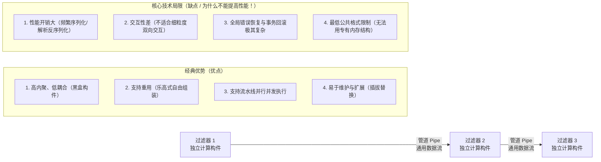

---
tags:
  - 软考
  - 系统架构设计师-高级
  - 第 7 章
---

# 第 7 章 系统架构设计基础知识

> 目录骨架依据《系统架构设计师教程（第 2 版）》；具体知识内容在题目归档时补充。

## 7.1 软件架构概念

### 7.1.1 软件架构的定义

[考查：综合知识（定义内涵、架构三大顶层结构类别体系、专业英语题）]

**一、软件架构的本质内涵（SEI / Bass 经典定义）**

- **系统架构的整体视角**：系统架构是一个系统的表示，包含了功能到软硬件构件的映射、软件架构到硬件架构的映射，以及对这些人机交互组件的关注。系统架构关注于**整个系统，包括硬件、软件和人员（Hardware, Software, and Humans）**。
- **架构结构的多元性**：软件架构并不是单一的静态视图，而是由一组相互关联的“结构（Structures）”或“视图（Views）”组成的。软件架构结构根据其所展示元素的性质，被划分为**三大主要类别（Three Major Categories）**。

**二、SEI 软件架构三大顶层结构类别全景矩阵（Bass / Clements 体系）⭐⭐⭐**

| 顶层结构大类 (Major Categories) | 核心视角与本质定义 | 所展示的元素 (Elements) | 元素间的核心关系 (Relations) | 下辖的典型子结构 (Sub-structures) | 题干判别词与考法特征 |
|---|---|---|---|---|---|
| **1. 模块结构<br>(Module structures)** | **静态代码资产视角**：将决策体现为一组需要被构建或采购的代码或数据单元 | 模块、类、数据包、程序库（编译期的代码或数据单元） | 组成关系（is part of）、调用依赖（uses）、泛化继承（is a） | **分解结构** (Decomposition)<br>**使用结构** (Uses)<br>**分层结构** (Layered)<br>**类结构** (Class / Generalization)<br>**数据模型** (Data model) | `code or data units`<br>`constructed or procured`<br>代码资产、模块分解、类继承 |
| **2. 构件-连接器结构<br>(Component-and-Connector / C&C structures)** | **动态运行时行为视角**：将决策体现为系统如何被结构化为一组具有运行时行为和交互的元素 | 运行时构件（进程、线程、服务、对象、Client/Server）与连接器（管道、RPC、消息总线） | 挂接/通信（attachments）、消息传递、数据流传递 | **进程结构** (Process)<br>**并发结构** (Concurrency)<br>**共享数据结构** (Shared data)<br>**客户端-服务器结构** (Client-server) | `runtime behavior and interactions`<br>进程通信、动态并发、消息流转 |
| **3. 分配结构<br>(Allocation structures)** | **外部环境映射视角**：将决策体现为软件系统如何在其环境中关联到**非软件结构**（如物理硬件、文件系统、网络拓扑、组织团队等） | 软件元素与非软件环境实体（CPU、网络、存储、人员团队） | 分配/映射（allocated to）、部署于（migrates to/hosted on）、负责（assigned to） | **部署结构** (Deployment: 映射到 CPU/网络)<br>**实现结构** (Implementation: 映射到文件目录/配置库)<br>**工作分配结构** (Work assignment: 映射到研发团队) | `relate to non software structures`<br>`CPUs, file systems, networks`<br>`development teams` |

**三、深度设陷排雷点**

1. **宏观顶层大类 vs 细分微观子结构（层级越级陷阱）**：
   - 题干问“软件架构可分为**三大主要类别（three major categories）**”时，选项中只有 **Module structures**、**Component-and-connector structures** 与 **Allocation structures** 属于该层级！
   - **Uses structures（使用结构）**、**Class structures（类结构）** 只是模块结构的下级子结构；**Concurrency structures（并发结构）** 只是 C&C 结构的下级子结构，切勿层级倒错。
2. **“开发团队（development teams）”的架构学归宿**：
   - 架构不仅管技术，还管人与工程落地！**工作分配结构（Work assignment structure）**属于分配结构的重要子结构，负责把软件模块的开发、集成、测试分配给具体的组织团队。
   - 只要题干中出现 `relate to non software structures (CPUs, file systems, networks, development teams, etc.)`，100% 锁定 **Allocation structures（分配结构）**。

**四、审题秒杀口诀**

> **“代码采购看模块，静态资产类与用；”**\
> **“运行交互连构件，进程并发总线通；”**\
> **“映射环境归分配，软硬团队非软件；”**\
> **“宏观大类仅三席，莫把子级充祖宗！”**


### 7.1.2 软件架构设计与生命周期

### 7.1.3 软件架构的重要性

## 7.2 基于架构的软件开发方法

### 7.2.1 体系结构的设计方法概述

### 7.2.2 概念与术语

### 7.2.3 基于体系结构的开发模型

### 7.2.4 体系结构需求

### 7.2.5 体系结构设计

### 7.2.6 体系结构文档化

### 7.2.7 体系结构复审

### 7.2.8 体系结构实现

### 7.2.9 体系结构的演化

## 7.3 软件架构风格

### 7.3.1 软件架构风格概述

### 7.3.2 数据流体系结构风格

[考查：综合知识（架构风格选型辨析）]

数据流风格强调"数据在构件间流动并被逐步变换"，内部再分两种，判别关键是**数据传递粒度**：

| 子风格 | 数据传递方式 | 工作机制 | 典型代表 |
|---|---|---|---|
| **顺序批处理** | **整批交接**：每步把全部输入处理完，产出完整中间结果再交下一步 | 各处理步骤为独立功能模块，顺序执行；前一步完全结束后下一步才开始 | 传统编译器（词法→语法→语义→代码生成，每阶段产出完整中间产物）、薪资批量核算、全量 ETL 批跑 |
| **管道-过滤器** | **流式增量**：数据连续通过管道，过滤器边读边处理；前级未处理完，后级已开始 | 每个过滤器是独立变换构件，管道负责数据传送；支持增量与并发 | Unix 管道、图像处理流水线、增量编译 / 实时数据流 |

**判别词**：

- 题干出现"作为一个整体传递 / 完整中间结果 / 一批数据处理完再交下一步" → **顺序批处理**。
- 题干出现"流水线 / 流式 / 增量 / 边接收边处理 / 数据持续流入" → **管道-过滤器**。

**易错点**：

- 传统编译器"依次经过词法、语法、语义等阶段"的表象很像流水线，但各阶段以**整个源程序**为单位交接，属于顺序批处理而非管道-过滤器。
- 看到"依次经过多个处理阶段"不能直接锁管道-过滤器，先看数据粒度（整批还是流式）。

#### 管道-过滤器体系结构优缺点权衡（Trade-Off）全景剖析 ⭐⭐⭐

[考查：综合知识（优缺点判断 / 适用场景） / 案例分析（架构评估）]



- **一、三大核心优点（为什么选它？）**：
  1. **软件构件具有良好的高内聚、低耦合特点**：每个过滤器是完全自包含的处理黑盒，只关注自身的数据转换算法，不关心上游与下游的具体实现；
  2. **支持重用（可重用性极高）**：只要遵循统一的管道 I/O 协议，任何两个过滤器都可以像积木一样任意重组复用（如 Unix 经典的 `grep | awk | sort | uniq` 命令行流水线）；
  3. **支持并行执行（流水线并发）**：各个过滤器独立运行在不同的进程或线程中，在流式数据驱动下同时处于工作状态（上游处理第 N 批数据，下游同时处理第 N-1 批数据），充分发挥现代多核 CPU 的并发吞吐潜力；
  4. **易于维护和扩展**：可以轻松添加新过滤器或替换旧过滤器，无需改动系统其他部分。

- **二、四大固有缺陷（为什么绝对不能说“提高性能”？）**：
  1. **导致性能下降（性能惩罚 / Overhead）**：
     - **数据解析与重新格式化开销**：数据在各过滤器之间流动时，必须反复在“内存结构化对象”与“通用流格式”之间进行序列化和反序列化（Parsing），造成大量的 CPU 算力浪费；
     - **管道缓冲与 IPC 开销**：多进程/线程管道涉及大量内存数据复制和上下文切换开销；虽然流水线提高了**吞吐量**，但单个数据项的**端到端处理响应时间（Latency）通常变长**，综合性能通常下降而非提高！
  2. **交互性差（不适合交互式系统）**：数据是单向流动且前赴后继的，无法支持用户即时打断、动态交互或细粒度请求/响应；
  3. **错误处理与状态恢复极其困难**：过滤器彼此无状态且独立，下游一旦崩溃，难以实现跨过滤器的全局分布式事务回滚；
  4. **最低公共特性限制（Lowest Common Denominator）**：每个过滤器被迫将数据视为通用字节流/文本流，无法直接利用特定高效的专有硬件或内存数据结构。

- **口诀**：**“管道独立易重用，多核流水能并发（三大优点）；格式反复解析慢，交互排错性能惨（四大硬伤）！”**
- **真题锚点**：
  1. 【题库章节练习/真题回忆版】（第五章 软件工程基础知识（新第2版）/ 第七节 软件项目管理，题目 24）：题干“以下关于管道过滤器体系结构的优点的叙述中，不正确的是（ ）” $\to$ 正确项选“提高性能”（干扰项：软件构件具有良好的高内聚低耦合的特点、支持重用、支持并行执行）。

### 7.3.3 调用/返回体系结构风格

### 7.3.4 以数据为中心的体系结构风格

### 7.3.5 虚拟机体系结构风格

### 7.3.6 独立构件体系结构风格

#### C2 风格（GUI 场景的灵活可扩展风格）

[考查：综合知识 / 案例分析（架构风格选型）]

> C2（Composition-2）由 Richard N. Taylor 等提出，面向 **GUI、交互式应用**与**插件化平台**。

- **核心思想**：系统分**上下两层 + 中间连接器**：
  - 上层：表示 / 业务逻辑组件；
  - 下层：底层服务（存储、外部资源）组件；
  - **连接器（Connector）**：异步消息分发器，负责路由 request / notify。
- **关键约束**：
  - **同层禁止直连**：上层组件之间、下层组件之间**都不能直接调用**；
  - 组件只能与"自己正下方/正上方"的连接器交互，**禁止跨层直连**；
  - 连接器承担**异步消息分发**（request 向下、notify 向上）。
- **结构示意**：

  ```mermaid
  flowchart TB
      subgraph Top["上层（表示/业务逻辑）"]
          A1["组件A"] ~~~ A2["组件B"] ~~~ A3["组件C"]
      end
      subgraph Mid["中间连接器（Connector）"]
          C["消息总线 / 事件总线"]
      end
      subgraph Bot["下层（系统服务）"]
          B1["组件D"] ~~~ B2["组件E"] ~~~ B3["组件F"]
      end
      Top -. request .-> Mid
      Mid -. notify .-> Top
      Bot -. request .-> Mid
      Mid -. notify .-> Bot
      Top ---|"禁止同层直连"| Top
      Bot ---|"禁止同层直连"| Bot
  ```

- **核心优势"灵活可扩展"是怎么来的**：
  1. 所有组件不直接耦合 → 添加新组件 = 在连接器上注册消息处理者，**不改旧组件**；
  2. 同层之间无依赖 → 上下层独立演化；
  3. 异步消息 → 天然支持**并发、动态加载、远程部署**；
  4. 连接器即插即拔 → 换协议/换总线时业务组件完全无感。

#### GUI 场景 4 风格对比（C2 / MVC / SOA / 管道-过滤器）

| 维度 | **C2 风格** | **MVC 风格** | **SOA 风格** | **管道-过滤器** |
|---|---|---|---|---|
| **核心机制** | 分层 + 连接器 | 模型-视图-控制器 | 服务契约 + ESB | 数据流过滤 |
| **通信方式** | 异步消息（request/notify） | 同步事件 + 观察者 | 服务调用（REST/SOAP） | 流式数据传递 |
| **适用场景** | **GUI、交互式应用**、插件平台 | 桌面/Web 应用 UI | **跨系统/企业级**集成 | 数据处理流水线 |
| **典型代表** | IDE、桌面 GUI、插件应用 | Spring MVC、Rails | WebService、微服务 | 编译器、ETL、Unix 管道 |
| **关键优势** | **灵活、可扩展、动态组合** | 关注点分离 | 跨平台/跨语言集成 | 模块独立、可并发 |
| **关键弱点** | 学习成本、消息路由开销 | 控制器易膨胀 | 服务治理复杂、ESB 瓶颈 | 不适于交互系统 |

#### 关键词 → 风格映射

| 题干关键词 | 锁定风格 |
|---|---|
| **GUI + 灵活可扩展 + 插件 + 动态组合** | **C2** |
| 模型 / 视图 / 控制器 / 关注点分离 | **MVC** |
| 数据流 / 流水线 / 批处理 / 过滤器 | **管道-过滤器** |
| 服务 / ESB / 跨企业 / 集成 | **SOA** |

#### "C2 vs MVC" GUI 双胞胎辨析口诀
> **C2 讲"灵活可扩展"**（连接器 + 同层禁直连）；\
> **MVC 讲"关注点分离"**（模型/视图/控制器）；\
> 看到"**灵活可扩展 / 插件化 / 动态组合**" → **C2**；\
> 看到"**模型视图控制器 / 三层分离**" → **MVC**。

### 7.3.5 虚拟机体系结构风格

[考查：综合知识 / 案例分析 / 论文素材]

虚拟机风格（Virtual Machine Style）的核心思想是**通过自定义软件引擎来模拟硬件或运行环境，从而赋予系统极高的灵活性、可扩展性与动态自定义能力**。虚拟机风格主要包含两大子风格：**基于规则的系统（Rule-based System）**与**解释器风格（Interpreter Style）**。

#### 一、基于规则的系统（Rule-based System / 规则引擎架构）

1. **核心三要素**：
   - **规则库（Rule Base / 知识库）**：形式化存储业务判定与计算规则（通常以“IF <条件> THEN <动作>”的产生式规则组织）。
   - **工作内存（Working Memory / 事实库 Fact Base）**：存储当前系统的输入数据、环境上下文与事实状态（如社保核算中的个人收入、健康状况、家庭负担）。
   - **推理引擎（Inference Engine / 执行器）**：由模式匹配器（如 Rete 算法）、冲突解决器与动作执行器构成，负责将事实与规则进行匹配并驱动推导。

2. **核心架构优势与代价值（Trade-off 权衡取舍）**：
   - **优势（加分项）**：**业务逻辑与底层控制逻辑彻底解耦**。业务规则被外部化独立存储，业务人员可热更新规则，无需程序员修改源代码、重新编译和部署系统，具备**极佳的可修改性（Modifiability）与业务敏捷性**。
   - **代价值（扣分项）**：由于采用解释与模式匹配，**执行性能开销较大、运行吞吐率相对较低**；当规则规模庞大时，**规则冲突检测（矛盾规则、冗余规则、环路死锁）极为困难**。

3. **典型适用场景与题干判别词**：
   - “**计算公式/费率可能随着国家政策或宏观经济动态改变**” $\to$ 如个人社保金预估系统、个税核算、公积金贷款计算。
   - “**频繁变动的风控/反欺诈规则**” $\to$ 银行信贷审批、反洗钱风控引擎。
   - “**医疗/设备诊断专家系统、工单自动流转审批引擎**”。

#### 二、解释器风格（Interpreter Style）

1. **核心要素**：
   - 词法分析器、语法分析器、语义分析器、解释执行引擎、符号表与运行时状态机。

2. **核心优势与代价值（Trade-off 权衡取舍）**：
   - **优势**：允许用户自定义领域专用语言（DSL）或脚本，赋予终端用户极高的可编程性与交互灵活性。
   - **代价值**：逐行解释执行效率显著低于编译型原生机器指令；脚本排错与调试复杂。

3. **典型适用场景与题干判别词**：
   - “**定义专用脚本 / 宏指令 / 领域特定语言（DSL）**” $\to$ 如 CAD 自动化绘图宏脚本、数学表达式求值引擎、游戏脚本引擎（Lua/Python 嵌入）、SQL 语法分析与解析器。

#### 三、虚拟机双子风格秒杀对比

| 子风格 | 驱动核心 | 外部化内容 | 核心秒杀判别词 |
|:---|:---|:---|:---|
| **基于规则的系统** | 事实（Fact）+ 推理机 | 条件-动作规则（`IF-THEN`） | “**计算公式动态改变**”、“政策频变”、“专家知识匹配” |
| **解释器风格** | 脚本语句 + 语法分析器 | 领域语法与执行指令（DSL） | “**自定义脚本语言**”、“宏指令”、“语法解释执行” |

## 7.4 软件架构复用

### 7.4.1 软件架构复用的定义及分类

### 7.4.2 软件架构复用的原因

### 7.4.3 软件架构复用的对象及形式

### 7.4.4 软件架构复用的基本过程

## 7.5 特定领域软件体系结构（DSSA） ⭐⭐⭐

[考查：论文写作 / 综合知识 / 案例分析]

### 7.5.1 DSSA 的定义与四大特征

**特定领域软件架构（Domain-Specific Software Architecture，DSSA）**是在一个特定应用领域中，为一组具有相同特征的系统提供可复用的软件架构、领域模型以及相应支撑资产的方法学。根据 Will Tracz 的经典定义，DSSA 包含**一个领域模型、一个参考需求和一个参考架构**，以及支持在该领域中开发应用的设施和工具。

DSSA 必须具备以下 **4 个方面的基本特征**：
1. **一个严格定义的问题域和/或解决域**：具有明确的业务边界，不追求无边界的大一统；
2. **具有普遍性**：使其可以用于领域中某个特定应用的开发；
3. **对整个领域能有合适程度的抽象**：既高于具体系统的实现细节，又具备指导具体系统构建的落地能力；
4. **具备该领域固定的、典型的在开发过程中的可重用元素**：沉淀领域专用的可复用构件、连接子、规则模板与算法库。

### 7.5.2 DSSA 的三大基本活动（领域工程）

DSSA 的建立依赖于**领域工程（Domain Engineering）**，其核心涵盖三大基本活动：

| 领域工程活动 | 主要目标 | 核心产出与工作内容 |
| :--- | :--- | :--- |
| **领域分析**<br>（Domain Analysis） | 获得**领域模型（Domain Model）** | 描述领域中系统之间共同的需求，即**领域需求**。界定领域边界，识别领域共性与可变性，定义统一的领域字典、术语和实体关系模型。 |
| **领域设计**<br>（Domain Design） | 获得 **DSSA（参考架构 Reference Architecture）** | 描述领域模型中表示需求的参考解决方案。定义组件层次拓扑、构件接口语法与语义、连接子（Connector）交互规约与设计约束。 |
| **领域实现**<br>（Domain Implementation） | 依据领域模型和 DSSA **开发和组织可重用信息** | 研发、采集和沉淀可重用产品单元与构件库（代码构件、自动化工具链、配置文件模板、测试用例库），为具体业务系统构建提供资产支撑。 |

### 7.5.3 参与 DSSA 的四类人员角色

DSSA 的建设是一个高度跨学科、跨岗位的系统工程，涉及四类核心角色：

| 角色名称 | 角色定位 | 核心职责与分工 |
| :--- | :--- | :--- |
| **领域专家**<br>（Domain Expert） | 业务知识权威 | 提供领域核心业务规则与机理知识，解答概念疑问，负责评审和验证领域模型与参考架构的业务合规性与正确性（如水环境机理科学家）。 |
| **领域分析师**<br>（Domain Analyst） | 需求抽象专家 | 由资深系统分析师担任。控制领域分析的全过程，负责与领域专家深度沟通，从多个历史系统中抽提领域共性与可变点，产出标准化领域模型与领域字典。 |
| **领域架构师**<br>（Domain Architect） | 架构设计掌舵人 | 由高级系统架构设计师担任。负责对领域模型进行技术抽象与体系结构设计，定义构件契约、交互协议与参考架构（DSSA），把控系统的非功能质量属性。 |
| **领域工程师**<br>（Domain Engineer） | 资产实现专家 | 由高级软件研发工程师担任。依据 DSSA 参考架构，负责具体可复用构件的编码开发、遗留代码重构抽取、商业构件适配、构件测试以及构件库的维护更新。 |

### 7.5.4 DSSA 的建立过程（五阶段与并发递归特性）

建立 DSSA 是一个**并发（Concurrent）、递归（Recursive）和反复进行（Iterative）**的渐进演化过程，标准建立流程划分为五个阶段：

1. **定义领域范围**：界定问题域边界，确定该领域应用需要满足的利益相关者核心诉求；
2. **定义领域特定元素**：梳理领域特定的数据流、控制流、实体对象，构建标准化**领域字典**与专业术语表；
3. **定义领域特定的设计和实现需求约束**：明确该领域通用的非功能性需求（如吞吐量、响应时延、合规安全、算力限制等物理约束）；
4. **定义领域模型和参考架构**：构建 UML 领域概念模型，产生指导全领域系统的分层/管道/事件驱动参考架构，精确说明构件的语法接口与行为语义；
5. **产生、搜集可重用的产品单元**：通过全新研发、现有代码提取、遗留系统逆向剥离以及商业采购等途径，为构件库补充高质量的可重用构件，为业务落地提供直接物料。
