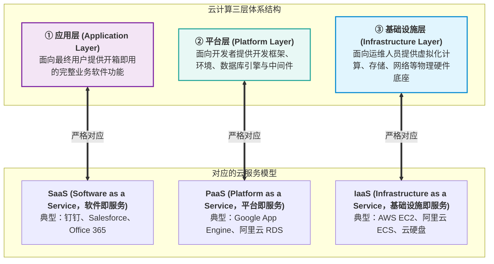

---
tags:
  - 软考
  - 系统架构设计师-高级
  - 第 11 章
---

# 第 11 章 未来信息综合技术

> 目录骨架依据《系统架构设计师教程（第 2 版）》；具体知识内容在题目归档时补充。

## 11.1 信息物理系统技术概述

### 11.1.1 信息物理系统的概念

### 11.1.2 CPS 的实现

### 11.1.3 信息物理系统的建设和应用

## 11.2 人工智能技术概述

### 11.2.1 人工智能的概念

### 11.2.2 人工智能的发展历程

### 11.2.3 人工智能关键技术

## 11.3 机器人技术概述

### 11.3.1 机器人的概念

### 11.3.2 机器人的定义和发展历程

### 11.3.3 机器人 4.0 的核心技术

### 11.3.4 机器人的分类

## 11.4 边缘计算概述 ⭐⭐⭐

[考查：案例分析 / 综合知识]

### 11.4.1 边缘计算的概念与定义
边缘计算（Edge Computing）是指在靠近物或数据源头的网络边缘侧，融合网络、计算、存储、应用核心能力的分布式开放平台，就近提供边缘智能服务，满足行业数字化在敏捷联接、实时业务、数据优化、应用智能、安全与隐私保护等方面的关键需求。

### 11.4.2 边缘计算的核心优势（相比集中式云计算）
1. **速度（极低时延）**：数据在边缘就近处理与推理（如人脸毫秒级比对），无需跨广域网长途传输，响应时延从百毫秒级降至毫秒级。
2. **安全（数据隐私与容灾）**：敏感数据（如生物特征、工业核心控制流）在本地闭环处理，不上公网，极大降低网络监听与数据泄露风险；分布式节点降低了单点被攻破瘫痪全网的风险。
3. **可扩展性（算力弹性解耦）**：通过增购低功耗边缘端设备即可实现算力横向弹性扩展，避免云端集中式数据中心面对海量物联网并发的计算与网络带宽瓶颈。
4. **可靠性（本地离线自治）**：边缘节点具备本地运行能力，当广域网发生抖动或完全中断时，边缘设备依然可基于本地缓存策略正常提供基础核心业务服务（弱网脱机自治）。

### 11.4.3 物联网核心通信协议：MQTT vs HTTP
- **MQTT（Message Queuing Telemetry Transport）**：基于 TCP/IP 的轻量级**发布/订阅（Pub/Sub）模式**传输协议。专为低带宽、高延迟、网络不可靠环境及受限硬件设计。固定报头仅 2 字节，支持三级 QoS 服务质量等级（0 最多一次、1 至少一次、2 只有一次），具备心跳与遗嘱消息（LWT），广泛用于端侧设备与边缘主机间的事件流交互。
- **HTTP/REST**：基于 TCP 的标准客户端/服务端**请求/响应模式**协议。头部开销较大，但生态成熟、跨语言兼容性强，适合用于 Web 管理后台交互、微服务接口调用及大体积文件（如 AI 深度学习模型权重、Docker 镜像）的分发与下载。

### 11.4.4 边云协同（Cloud-Edge Collaboration）
边云协同涵盖六大协同维度：
1. **资源协同**：云端负责大规模资源池化与算力调度，边缘端负责近场轻量计算；
2. **数据协同**：边缘端负责数据就近清洗、特征提取与预处理，云端负责全局聚合分析与长期归档；
3. **算法/模型协同**：云端利用海量样本完成大模型训练、剪枝与量化蒸馏，并向下分发；边缘设备负责模型在线推理与小样本增量微调；
4. **应用协同**：基于 Docker 与轻量容器编排（KubeEdge/K3s），在云端统一下发、部署与升级边缘应用；
5. **安全协同**：云端统一下发安全策略与数字证书，边缘负责现场网络准入与物理入侵检测；
6. **业务协同**：云端负责全局统筹与调度决策，边缘端负责执行闭环与现场即时控制。

- **实战大题案例精析**：[[个人资料/笔记/软考/系统架构设计师-高级/真题库/案例分析/经典案例-基于边缘计算的智能门禁系统架构设计|经典案例分析：基于边缘计算的智能门禁系统架构设计（25分）]]

## 11.5 数字孪生体技术概述

### 11.5.1 数字孪生体发展历程

### 11.5.2 数字孪生体的定义

### 11.5.3 数字孪生体的关键技术

### 11.5.4 数字孪生体的应用

## 11.6 云计算和大数据技术概述

### 11.6.1 云计算技术概述

[考查：综合知识 / 案例分析（云计算三层物理架构与服务模型映射 / IaaS、PaaS、SaaS、FaaS 责任边界与典型产品）]

#### 一、云计算三层体系架构与核心服务模型对应关系 ⭐⭐⭐

依据《系统架构设计师教程（第 2 版）》，云计算的体系架构由下至上划分为三层物理逻辑模型，分别与三类标准云服务模型一一严格对应：

##### 云计算 4 种服务模型责任边界与核心特征对照表

| 云服务模型 | 对应架构层级 | 租户（客户）管什么 | 云厂商管什么 | 典型代表产品 | 软考高频设陷点与防坑辨析 |
|:---|:---|:---|:---|:---|:---|
| **IaaS** *(基础设施即服务)* | **基础设施层**（最底层） | **操作系统（OS）**、中间件、运行时环境、应用程序、业务数据 | **机房硬件、物理服务器、虚拟化层、网络与物理存储** | AWS EC2、阿里云 ECS、OpenStack、云存储卷 | 🚫 **核心陷阱**：断言“IaaS 厂商负责维护操作系统内核”大错特错！租户拥有 OS 完全控制权（Root），厂商只管硬件与虚拟化。 |
| **PaaS** *(平台即服务)* | **平台层**（中间层） | **应用程序代码、业务数据** | **操作系统**、编程语言运行时、中间件、数据库管理系统、底层硬件 | Google App Engine、Heroku、阿里云 RDS、K8s 托管平台 | 🚫 **核心混淆**：极易与 IaaS 颠倒位置。PaaS 面向开发者，厂商锁定并托管 OS，开发者只交付代码。 |
| **SaaS** *(软件即服务)* | **应用层**（最顶层） | **最终用户仅负责使用软件**及配置个人/企业基础账号数据 | **从底层硬件到顶层应用的全栈全托管** | 钉钉、企业微信、Salesforce、Office 365、在线协同文档 | 🚫 客户无需任何编程与底层维护，开箱即用。 |
| **FaaS / Serverless** *(函数即服务)* | 细粒度事件驱动无服务器计算 | **业务逻辑函数代码**（按需调用执行） | **完全隐藏服务器与运行时**，自动触发、极致弹性伸缩、按调用计费 | AWS Lambda、阿里云函数计算 FC、腾讯云 SCF | 🚫 属于事件驱动的更高层无服务器抽象。 |

- **二、审题秒杀口诀**：
  > **“S 是软件对应应用层，P 是平台对应平台层；”**\
  > **“I 是基建在最底，自顶向下莫颠倒！”**\
  > **“IaaS 卖服务器（客户管OS），PaaS 卖平台（厂商管OS）；”**\
  > **“SaaS 卖软件开箱用，FaaS 卖函数按次收！”**

- **真题锚点**：
  1. 【题库章节练习/真题回忆版】（第十一章 未来信息综合技术（新第2版）/ 第六节 云计算和大数据技术概述，题目 11）：题干“云计算服务体系结构如下图所示，图中①、②、③分别与SaaS、PaaS、IaaS相对应，图中①、②、③应为（ ）” $\to$ 正确项选 B. 应用层、平台层、基础设施层（错因多发：混淆 PaaS 与 IaaS 的层级位置，误选“应用层、基础设施层、平台层”）。

### 11.6.2 大数据技术概述
