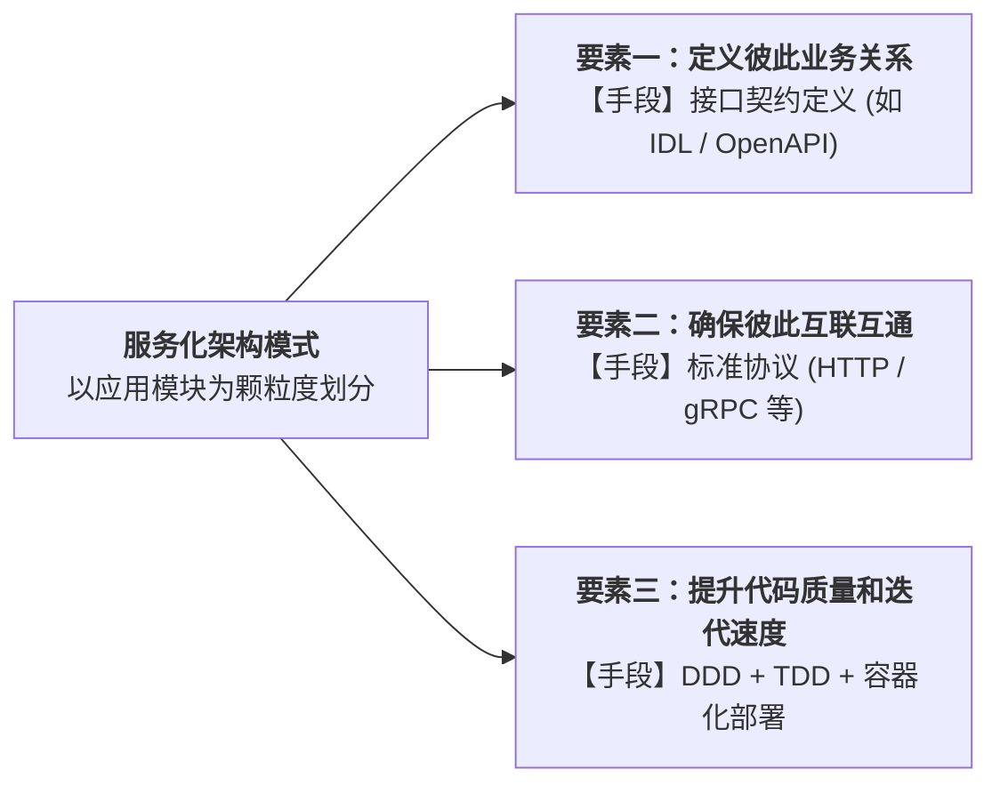
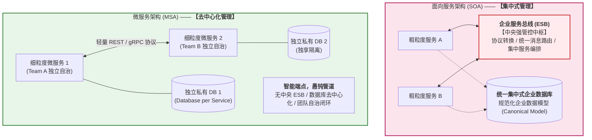
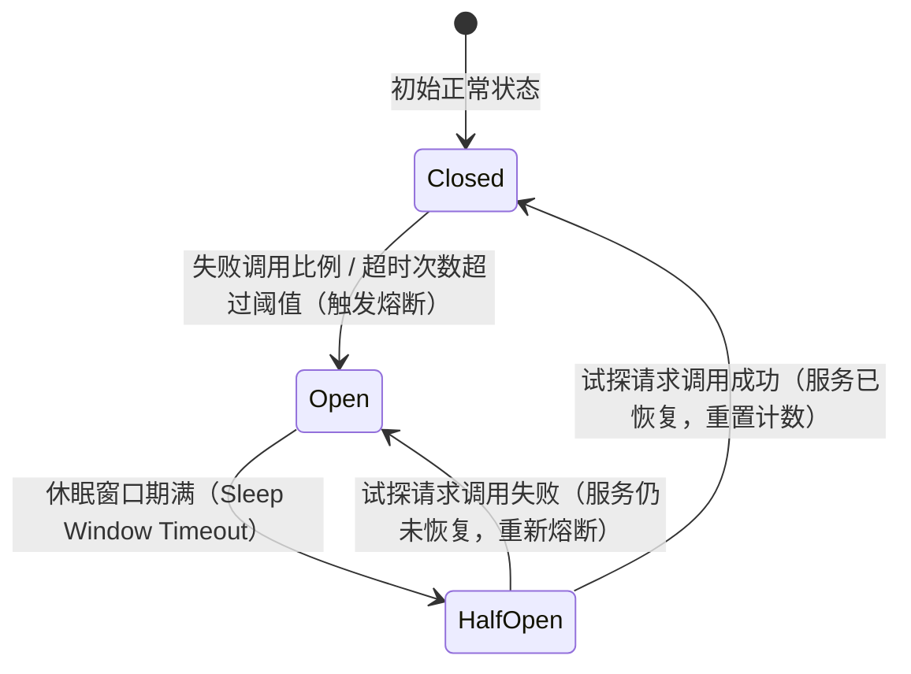
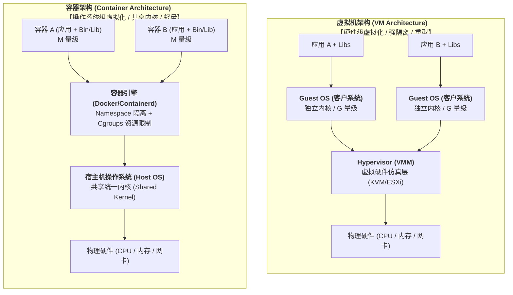
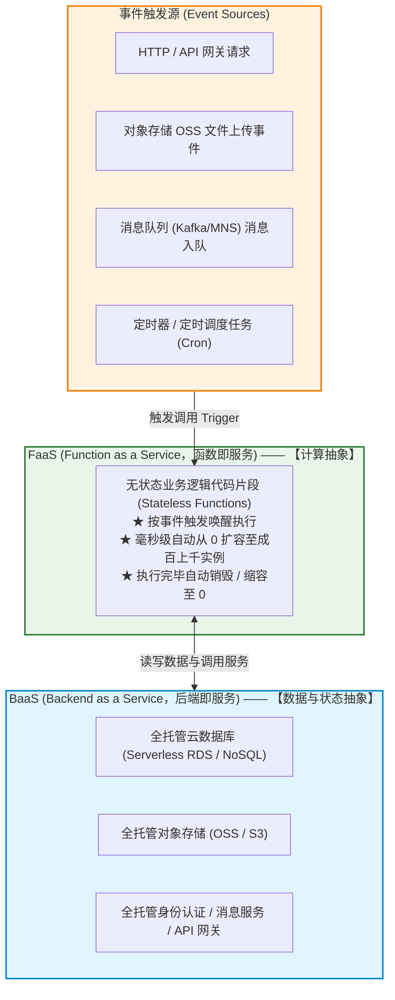
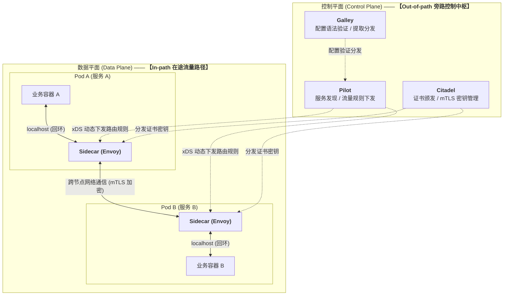
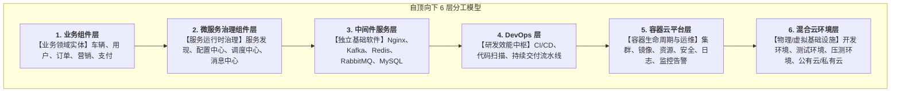
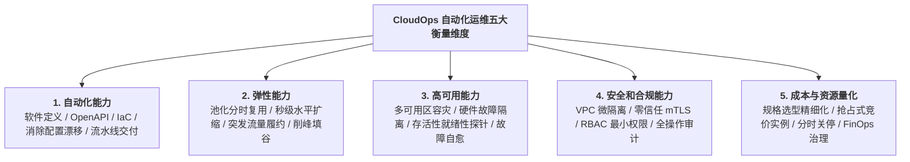

---
tags:
  - 软考
  - 系统架构设计师-高级
  - 第 14 章
chapter: "14-云原生架构设计理论与实践"
---

> 公开版本不含原始图片附件。以下依赖图示的题目需先补图或核对已有文字图，不能从答案反推原图。

# 第 14 章 云原生架构设计理论与实践

> 目录骨架依据《系统架构设计师教程（第 2 版）》；具体知识内容在题目归档时补充。

## 14.1 云原生架构产生背景

### 14.1.x 云架构 4 类中间件的职责分工

[考查：综合知识]

云架构中各组件按"**会话-数据-计算-部署**"四层拆为 4 类中间件，**各管一摊、不重叠**：

| 中间件 | 核心职责 | 关键词 | 典型实现 |
|---|---|---|---|
| **消息中间件** | 用户请求/会话/路由分发 | 请求、会话、路由、分配 | API 网关、负载均衡、消息队列 |
| **数据中间件** | 数据复制 / 数据同步 | 复制、同步、缓存 | 分布式缓存、数据同步服务 |
| **处理中间件** | 协调多种处理单元 | 协调、编排、组合 | 业务流程引擎、调度器 |
| **部署中间件** | 处理单元的启动 / 关闭 / 监控 | 启动、关闭、负载监控 | 容器编排（K8s）、部署平台 |

- **"处理单元 vs 处理中间件"区分口诀**（高频偷换）：
  > **处理单元**是"演员"（上场执行）；> **处理中间件**是"导演"（协调演员）；> 题目问"谁决定派谁上" → 处理中间件负责**协调**；
  > 但题目问"谁把请求**分配**给演员" → **消息中间件**才是那个**分配者**。
- **关键区分**：消息中间件做**请求入口 + 单次路由**；处理中间件做**业务编排**（多次/多步骤）。考题描述的是"请求接入 + 单次路由" → 必是**消息中间件**。
- **关键词 → 中间件映射**：

| 题干关键词 | 锁定 |
|---|---|
| 用户请求、会话控制、请求分配、路由 | **消息中间件** |
| 数据复制、数据同步、缓存同步 | 数据中间件 |
| 协调多种处理单元、业务编排 | 处理中间件 |
| 启动、关闭、负载监控、生命周期 | 部署中间件 |

- **典型陷阱**：
  - "看到处理单元就选处理中间件" ❌
  - "数据中间件管会话" ❌
  - "部署中间件管路由" ❌
  - "处理中间件 = 业务流程编排 = 请求入口"——处理中间件是**协调层**而非**入口层**，本题描述的是入口 + 路由，必须回到消息中间件。

### 14.1.2 服务化架构模式的三大要素与质量提速手段 ⭐⭐⭐

[考查：综合知识 / 案例分析（服务化架构定义 / 接口契约 vs 标准协议 vs 代码质量与迭代速度提升方法）]

在云原生架构产生背景中，《系统架构设计师教程（第 2 版）》明确定义了服务化架构模式的三大核心要素与分工机制：

| 要素维度 | 解决的架构问题 | 采用的核心技术手段 | 命题高频陷阱与辨析 |
|:---|:---|:---|:---|
| **业务关系定义** | 界定模块间的业务调用边界、数据结构与依赖契约。 | **接口契约定义**（如 IDL、Protocol Buffers、OpenAPI） | 🚫 **排雷**：接口契约是定义业务关系的“前置规则”，**不是**用来提升代码质量和迭代速度的敏捷工程方法。 |
| **互通互联保障** | 消除多语言异构服务之间的网络传输与协议屏障。 | **标准通信协议**（如 HTTP/REST、gRPC 等） | 保证跨语言、跨技术栈通信无障碍。 |
| **质量与迭代提速** | 保证每个独立接口内部的业务逻辑正确性，并实现极速安全交付。 | **DDD（领域模型驱动）** + **TDD（测试驱动开发）** + **容器化部署（环境一致性与极速发布）** | 🚫 **排雷**：常有人误以为“容器化部署”只是运维发布手段，与代码质量无关；实际上容器化通过**不可变基础设施（Immutable Infrastructure）彻底消除了环境不一致缺陷**，并极大加速了交付流水线，是质量与速度提升的关键三要素之一！ |

- **速记口诀**：
  > **“契约定关系，协议保互通；”**\
  > **“质量与速度，DDD、TDD、容器三剑客！”**

- **真题锚点**：
  1. 【题库章节练习/真题回忆版】（第十四章 云原生架构设计理论与实践（新第2版）/ 第四节 云原生架构产生背景）：题干“在服务化架构模式中，以下哪项不是用于提升代码质量和迭代速度的方法（ ）” $\to$ 正确项选 D. 接口契约定义（属于“定义彼此业务关系”，非“提升质量与速度的方法”）。

## 14.2 云原生架构内涵

### 14.2.1 云原生架构定义

[考查：综合知识 / 案例分析（云原生架构技术定义 / 剥离非业务代码 / 云原生核心价值 / 传统云计算三层支撑）]

- **1. 云原生架构权威技术定义（必背填空）**：
  > **云原生架构（Cloud Native Architecture）**是基于云原生技术的一组**架构原则和设计模式的集合**，旨在将云应用中的**非业务代码**部分进行最大化的剥离，从而让云设施接管应用中原有的大量非功能特性（如弹性、韧性、安全、可观测性等），使业务不再有非功能性业务中断困扰的同时，具备**轻量、敏捷、高度自动化**的特点。

- **2. 云原生与传统云计算三层概念的依托关系**：
  - 云原生应用是面向“云”而生的应用，底层深度依赖传统云计算的三层服务模型：
    1. **IaaS（基础设施即服务，Infrastructure as a Service）**：提供按需计算、存储、网络等底层硬件资源池（如云主机、VPC、块存储）；
    2. **PaaS（平台即服务，Platform as a Service）**：提供中间件、数据库、容器运行时、微服务框架、DevOps 流水线等平台级支撑能力（云原生主要依托的核心平台面）；
    3. **SaaS（软件即服务，Software as a Service）**：最终面向企业或用户的顶层多租户业务软件与云服务交付形态。

---

### 14.2.2 云原生架构原则

[考查：案例分析 / 综合知识 / 论文素材（应用架构核心架构控制面 / 云原生 7 大原则核心内涵与技术选择依据）]

云原生架构本身作为一种架构，有若干**架构原则作为应用架构的核心架构控制面**。遵从这些原则可使技术主管与架构师在技术选型和系统演化时不偏离轨道：

| 序号 | 核心架构原则 | 英文对照 | 核心内涵与架构控制要求 | 典型技术实现手段 |
|:---:|:---|:---|:---|:---|
| 1 | **服务化原则** | Service-oriented | 当代码规模超出小团队协作边界时，强制拆分为小服务/微服务，通过标准化 API（如 RESTful、gRPC）进行清晰契约约束与解耦。 | 微服务拆分、API 网关、接口契约治理 |
| 2 | **弹性原则** | Elasticity | 系统的部署规模和计算资源能够随业务流量波动实现**分钟级/秒级自动横向扩缩容**，无需人工干预容量。 | Kubernetes HPA、Serverless、动态资源调度 |
| 3 | **可观测原则** | Observability | 复杂的分布式系统必须从“黑盒不可知”变为“白盒可知”，具备对系统健康与运行状态的深层洞察与异常诊断能力。 | 三大支柱：指标（Metrics）、日志（Logs）、链路追踪（Tracing） |
| 4 | **韧性原则** | Resilience | 承认故障是不可避免的常态。系统在面对硬件崩溃、网络抖动、依赖不可用等异常时，仍能维持核心业务可用，防止级联故障引发系统雪崩。 | 服务降级、熔断器（Circuit Breaker）、限流、超时重试、隔舱隔离 |
| 5 | **所有过程自动化原则** | Automation | 将一切软件交付与运维过程代码化、自动化，杜绝手动变更导致的误操作与效率低下。 | CI/CD 流水线、GitOps、基础设施即代码（IaC） |
| 6 | **零信任原则** | Zero Trust | “持续验证，永不信任”。不论请求来自内网还是外网，必须经过严格的身份认证、双向加密与最小权限动态鉴权。 | mTLS 双向认证、RBAC 细粒度授权、Service Mesh 安全策略 |
| 7 | **架构持续演进原则** | Evolutionary Architecture | 云原生架构不是一成不变的终态，而是具备自我迭代和演化能力的“活系统”，支持在业务演进中渐进式重构与平滑升级。 | 绞杀者模式、灰度金丝雀发布、事件驱动解耦 |

- **云原生 7 大原则速记口诀**：
  > **“服弹可韧全自动，零信演进七原则！”**\
  > （**服**：服务化；**弹**：弹性；**可**：可观测；**韧**：韧性；**全自动**：所有过程自动化；**零信**：零信任；**演进**：架构持续演进）
- **真题锚点（综合知识·原则数量与内涵考查）**：
  - 题干考查“云原生架构包含多少个主要原则？” $\to$ 答案为 **7 个**（服务化原则、弹性原则、可观测原则、韧性原则、所有过程自动化原则、零信任原则、架构持续演进原则）。数字纯记忆题极易混淆，牢记 7 字口诀“服弹可韧全自动，零信演进七原则”。

---

### 14.2.3 主要架构模式

[考查：综合知识 / 案例分析（微服务架构 vs SOA 面向服务架构治理模式、通信机制、数据架构与演进目标全景对比）]

#### 微服务架构（MSA） vs 面向服务架构（SOA）核心对比与治理辨析 ⭐⭐⭐

微服务架构（Microservices Architecture）源于 SOA 但在治理理念和技术实现上发生了革命性演进。软考高频考查两者在“管理模式、通信中枢、数据架构、服务粒度”等维度的核心差异：

##### 微服务架构与面向服务架构（SOA）核心对比矩阵

| 对比维度 | 面向服务架构（SOA） | 微服务架构（MSA） | 软考核心设陷点与防坑辨析 |
|:---|:---|:---|:---|
| **核心管理模式** | **集中式管理（Centralized）** 自顶向下的集中式架构委员会与统筹管控 | **去中心化管理（Decentralized）** 扁平化、团队全权自治（You build it, you run it） | 🚫 **高频反向陷阱**：题库极易将两者的“集中式”与“去中心化”对调颠倒！ |
| **通信中枢机制** | 强依赖重型的 **企业服务总线（ESB）**，协议转换、复杂消息路由与编排全由 ESB 包揽 | **智能端点，愚钝管道（Smart Endpoints & Dumb Pipes）**，摒弃中央总线，采用轻量级通信（REST/gRPC/Service Mesh） | 🚫 断言“微服务也必须配备企业服务总线 ESB”大错特错！微服务坚决去中心化，移除单点 ESB。 |
| **数据管理方式** | **集中式共享存储**，倾向统一的企业数据中心与全局规范化数据模型（Canonical Model） | **去中心化数据管理**，严格提倡“每个服务拥有独立私有数据库（Database per Service）” | 🚫 微服务中各服务间禁止直接跨库读写底层表，必须通过 API 契约交互。 |
| **服务拆分粒度** | **较粗粒度**，面向企业级业务功能整合与重用 | **细粒度**，面向单一职责（Single Responsibility），追求单一业务能力的敏捷交付 | 🚫 混淆服务粒度大小。 |
| **组件耦合程度** | 组件间耦合度相对较高（依赖中央总线契约与全局数据结构） | **松耦合度极高**，独立开发、独立部署、独立运维、独立故障隔离与伸缩 | 微服务单服务崩溃不波及整个系统。 |
| **核心解决目标** | 解决大型企业内部**异构系统打通、遗留资产复用与系统集成**问题 | 解决互联网业务**敏捷交付、持续部署（CI/CD）、弹性扩缩容与快速试错**需求 | SOA 偏企业信息化重型集成；微服务偏互联网云原生敏捷演进。 |

- **三、审题秒杀口诀**：
  > **“微服务小而自治‘去中心’，独立数据库独立生；”**\
  > **“SOA 企业大总线（ESB），‘集中’治理管千军！”**\
  > **“管道愚钝端点智，轻量 API 破沉闷；”**\
  > **“若说微服集中管，对调倒置秒判假！”**

- **真题锚点**：
  1. 【题库章节练习/真题回忆版】（第十四章 云原生架构设计理论与实践（新第2版）/ 第一节 云原生架构内涵，题目 6）：题干“以下关于微服务架构与面向服务架构的描述中，正确的是（ ）” $\to$ 正确项选 C. 微服务架构采用去中心化管理，面向服务架构采用集中式管理（干扰项 A 两者均去中心化、B 两者均集中式、D 颠倒两者管理方式）。

### 14.2.4 典型的云原生架构反模式

## 14.3 云原生架构相关技术

### 14.3.1 容器技术

[考查：综合知识 / 案例分析（容器编排 Kubernetes 核心能力矩阵 / 自动修复 vs 弹性伸缩能力边界 / 故障自愈底层控制机制）]

#### Kubernetes 核心能力范畴与能力边界对比 ⭐⭐⭐

Kubernetes（K8s）作为云原生时代容器编排调度的核心底座，其能力矩阵清晰划分为多个职责独立的控制范畴，命题时极易在不同范畴之间设置混淆陷阱：

| 能力分类 | 核心目标与触发条件 | K8s 底层控制组件与机制 | 典型具体功能体现 | 命题高频陷阱与辨析 |
|:---|:---|:---|:---|:---|
| **自动修复 （Self-healing / 故障自愈）** | **前提：发生故障或异常** （节点宕机、进程崩溃、探针失败） | **NodeController** **Kubelet** **Replication/Deployment Controller** | ① **监测宿主机健康状态**（心跳检测）； ② **宿主机故障时自动迁移应用**（Node 驱逐并在可用节点重新调度拉起）； ③ **容器自愈**（进程崩溃自动重启、存活探针 livenessProbe 失败杀掉重建）。 | 🚫 **高频误区**：误以为“宿主机故障应用迁移”是虚拟化层热迁移（vMotion），实际上 K8s 是通过“驱逐+重调度”实现容器级故障自愈。 |
| **弹性伸缩 （Autoscaling）** | **前提：业务负载变化** （CPU/内存利用率、QPS、业务自定义指标激增或跌落） | **HPA** *(Horizontal Pod Autoscaler)* **VPA** *(Vertical Pod Autoscaler)* **Cluster Autoscaler** *(CA)* | ① **根据 CPU/内存利用率自动扩缩 Pod 副本数**； ② 根据指标自动增删集群计算节点 Node； ③ 动态微调容器的 Request / Limit 配额。 | 🚫 **高频陷阱**：**弹性伸缩属于容量与资源优化，不属于自动修复！** 业务正常平稳运行，只是访问量激增，根本没有发生故障，何来“修复”。 |
| **服务发现与负载均衡 （Service Discovery & LB）** | 为微服务间通信提供稳定的网络入口与流量分发 | **Kube-proxy** **CoreDNS** **Ingress Controller** | ① 为一组 Pod 提供统一不变的 ClusterIP 和域名； ② 多副本流量轮询或权重分发； ③ 自动剔除就绪探针（readinessProbe）失败的不可用 Pod。 | 属于网络互联范畴，与故障自愈配合。 |
| **自动部署与回滚 （Automated Rollout & Rollback）** | 声明式管理应用升级过程与故障止损 | **Deployment Controller** **ReplicaSet** | ① 滚动发布（Rolling Update，保证最小不可用副本数）； ② 金丝雀灰度发布； ③ 探测到新版本异常时快速执行一键版本回滚。 | 属于应用生命周期与发布管理。 |
| **存储编排与配置管理 （Storage & Config）** | 外部持久化数据卷挂载与环境解耦 | **CSI 驱动** **ConfigMap / Secret** | ① 自动挂载本地、云存储（NFS、Ceph、云盘）； ② 敏感信息加密与动态环境变量注入。 | 属于存储与环境配置抽象。 |

- **核心审题判别口诀**：
  > **“有病有灾才叫修（故障自愈），人多加座叫弹性（HPA 扩缩）；”**\
  > **“坏了重启叫修复，节点宕机迁新居；”**\
  > **“CPU 飙高副本增，弹性伸缩非修病！”**

- **真题锚点**：
  1. 【题库章节练习/真题回忆版】（第十四章 云原生架构设计理论与实践（新第2版）/ 第一节 云原生架构内涵）：题干“在Kubernetes的核心功能中，以下哪项不属于其自动修复能力的范畴（ ）” $\to$ 正确项选 D. 根据CPU利用率自动进行业务扩容（选项 A 监测宿主机健康状态、B 宿主机故障自动迁移应用、C 应用自愈功能均属于自动修复范畴；D 属于弹性伸缩范畴）。

### 14.3.2 云原生微服务

#### 微服务架构 4 大实现模式

[考查：综合知识 / 案例分析（微服务方案选择）]

- 微服务架构落地有 4 种主流实现模式，按**耦合度从高到低 / 集成方式从重到轻**排列：

| 模式 | 服务拆分粒度 | 通信方式 | 部署形态 | 典型场景 |
|---|---|---|---|---|
| **RESTful 应用模式** | 单体按业务模块化 | RESTful（同步 HTTP） | **一个多功能应用** | **企业内部**集成、改造中的单体 |
| **RESTful API 模式** | **细粒度**独立服务 | RESTful（同步 HTTP） | 多服务独立部署 | **跨系统/跨企业** API 公开 |
| **集中消息模式** | 较粗粒度服务 | **中心化**消息总线（ESB） | 多服务 + 中央中枢 | **SOA 风格**、遗留系统集成 |
| **分布式消息模式** | 细粒度服务 | **分布式**消息中间件（Kafka/RabbitMQ） | 多服务 + 异步消息 | 高并发异步解耦、事件驱动 |

- **口诀**（最易混两兄弟）：
  > **应用装一筐，API 拆一筐**；> 想要"一应用多功能" → 应用；想要"多应用细服务" → API。
- **"应用 vs API" 关键词识别**（高频偷换）：

| 关键词 | 锁定 |
|---|---|
| **一个**多功能应用、单体改造、企业内部 | **RESTful 应用**模式 |
| **细粒度**、独立部署、跨系统/对外公开、API 网关 | **RESTful API** 模式 |
| **ESB / 中央总线 / 所有服务走中枢** | **集中消息**模式 |
| **Kafka / RabbitMQ / 异步 / 解耦 / 事件驱动** | **分布式消息**模式 |

- **家族辨析**：
  - **微服务 ≠ SOA**：SOA 强调**集中式 ESB**（对应"集中消息"）；微服务强调**去中心化**（对应"分布式消息"或"RESTful API"）。
  - **RESTful 应用模式**是**单体向微服务的过渡形态**：拆了模块、还没拆服务——常作为遗留系统现代化的中间状态。
- **典型陷阱**：
  - "看到'消息'就选集中" ❌（题目问的是"应用形态"不是"通信方式"）
  - "RESTful 应用 = RESTful API" ❌（前者一体、后者拆分；RESTful 是通信风格，**应用 vs API 是部署粒度**）
  - "企业内部 = 跨企业公开" ❌（API 模式更倾向跨企业）

#### 微服务弹性容错：断路器模式（Circuit Breaker Pattern）状态机模型 ⭐⭐⭐

[考查：综合知识 / 案例分析（微服务防雪崩与级联故障 / 断路器三大状态机转换 / 快速失败与自愈探测）]

微服务架构中，分布式调用链错综复杂。下游某个基础服务响应迟缓或宕机，会导致上游调用方的线程资源迅速耗尽，进而引发**级联故障（Cascading Failure）导致整个系统雪崩**。Martin Fowler 提出的**断路器模式（Circuit Breaker）**借用了家庭物理电路中“空气开关”的隐喻，是实现微服务弹性容错的核心设计模式：

- **一、断路器三大标准状态全景对比表（核心必考）**：

| 状态名称 | 物理隐喻 | 请求处理行为 | 触发条件与转移机制 | 命题高频陷阱与辨析 |
|:---|:---|:---|:---|:---|
| **关闭状态 （Closed）** | **电路闭合（接通）** | **所有正常业务请求全部放行通过**； 内部维护失败计数器、滑动时间窗口错误率。 | 当请求调用失败率或超时次数**超过设定的阈值**时，断路器“跳闸”，**状态由 Closed 自动转移为 Open**。 | 🚫 **常见直觉陷阱**：日常口语中“关闭”常被误认为“服务停用”，但在电路中**“闭合/关闭”才是正常通电运行**！ |
| **打开状态 （Open）** | **电路断开（跳闸）** | **直接短路拦截所有请求，快速失败（Fast-fail）**； 不向真实下游发起调用，直接执行 Fallback 降级逻辑，保护自身线程池不被耗尽。 | 转移至 Open 时启动一个**休眠倒计时定时器（Sleep Window）**； 当定时器超时后，**状态由 Open 自动转移为 Half-Open**。 | 🚫 **常见直觉陷阱**：日常口语常说“打开服务”，但断路器模式中**“打开”代表开关断开、切断电路、服务被熔断阻断**！ |
| **半开状态 （Half-Open）** | **试探性推上开关** | **仅允许极少量的探测请求（Probe Requests）放行访问下游服务**，其余请求继续降级拦截。 | ① 若探测请求**全部成功**，判定下游服务已自愈复活，**状态由 Half-Open 转移回 Closed**； ② 若探测请求**出现失败**，判定下游服务仍在躺尸，**状态立即转移回 Open**，重新开始休眠倒计时。 | 🚫 **关键特征**：系统实现**全自动自愈与渐进式恢复**的灵魂状态，无需人工介入干预。 |

- **二、高频设陷点与排雷铁律**：
  - 🚫 **排雷伪术语**：软考命题常借用操作系统进程/线程状态编造伪选项（如“激活状态”、“挂起状态”、“休眠状态”、“运行状态”）。断路器经典理论（Martin Fowler / Hystrix / Resilience4j / Sentinel）**仅存在且必须存在【关闭（Closed）、打开（Open）、半开（Half-Open）】三态**！
  - 🚫 **排雷常识反差**：牢记**闭合（Closed）= 通电正常，断开（Open）= 跳闸阻断**。

- **三、审题秒杀口诀**：
  > **“电路闭合才通电（Closed 正常），跳闸断开拒请求（Open 熔断）；”**\
  > **“休眠期满半开放（Half-Open 试探），探测成功转闭合，探测失败再断开！”**

- **真题锚点**：
  1. 【题库章节练习/真题回忆版】（第十四章 云原生架构设计理论与实践（新第2版）/ 第一节 云原生架构内涵）：题干“微服务架构中，断路器模式主要包含以下三种状态（ ）” $\to$ 正确项选 D. 关闭状态、打开状态、半开状态（选项 A 激活/挂起、B 激活/休眠、C 激活/熔断均含伪术语）。

## 14.3 云原生架构相关技术

### 14.3.1 容器技术：Docker 容器 vs 虚拟机（VM）架构对比与选型实战 ⭐⭐⭐

[考查：案例分析 / 综合知识 / 论文素材（容器与 VM 架构差异 / 性能指标全景对比 / 嵌入式平台升级选型 / 核心采分点与答题模板）]

#### 一、核心技术定义与底层架构拓扑对比

1. **核心概念权威技术定义**：
   - **容器技术（Container）**：一种**基于宿主机操作系统内核的轻量级虚拟化技术**。它共享宿主机的操作系统内核，利用 Linux 内核的 **Namespace（命名空间）** 实现文件系统、网络、进程间通信与进程号的运行环境隔离，利用 **Cgroups（控制组）** 实现 CPU、内存、磁盘 I/O 等计算资源的配额限制。容器不包含完整的操作系统内核与虚拟硬件层，因而具备镜像轻量（MB 级）、启动极快（毫秒级）和资源开销极低的特点。
   - **虚拟机技术（VM，Virtual Machine）**：一种**基于 Hypervisor（虚拟机监视器，如 KVM、VMware ESXi）的硬件级虚拟化技术**。Hypervisor 在底层物理硬件与操作系统之间（或宿主 OS 之上）抽象出虚拟的 CPU、内存、存储与外设硬件环境。每个虚拟机都必须安装独立完整的 **Guest OS（客户操作系统）**，各虚拟机之间通过硬件仿真实现绝对的物理隔离与安全边界。

2. **底层架构全景对比图**：

---

#### 二、虚拟机技术 vs 容器技术全景对比表（表 3-1 标准考点）

在嵌入式与云原生系统升级中，两者的性能与运维指标对比如下：

〔原图未随公开包分发；依赖图示的题目须补图后使用。〕

| 对比维度 | 虚拟机技术（VM） | 容器技术（Docker） | 架构权衡与技术考量 |
|:---|:---|:---|:---|
| **镜像大小** | **包含 GuestOS，G 量级以上**（选项 b） | **仅包含运行的 Bin/Lib，M 量级** | 容器剔除了沉重的 GuestOS 与硬件驱动，大幅节省存储开销，极利于分发。 |
| **资源要求** | **CPU 与内存按核、按 G 分配**（选项 d） | **CPU 与内存按单核、低于 G 量级分配** | 虚拟机需预分配大块物理资源且存在 Hypervisor 损耗；容器按需精细化消耗。 |
| **启动时间** | **分钟级**（选项 a） | **毫秒级**（选项 e） | VM 需经历完整的 BIOS 自检、OS 内核引导初始化；容器仅为普通宿主进程启动。 |
| **可持续性 / 迁移性** | **跨物理机迁移** | **跨操作系统平台迁移**（选项 c） | VM 依赖相同的底层虚拟化平台；容器镜像标准化，具备“一次构建，到处运行”。 |
| **弹性伸缩** | **VM 伸缩，CPU/内存手动伸缩**（选项 g） | **实例自动伸缩、CPU/内存自动在线伸缩**（选项 h） | 容器与 K8s HPA/KEDA 结合实现秒级在线自动弹性伸缩；VM 伸缩周期漫长且笨重。 |
| **隔离策略** | **操作系统、系统级别**（强物理隔离） | **Cgroups，进程级别**（选项 f） | VM 安全边界坚固；容器共享内核，存在内核漏洞逃逸风险，需额外安全加固。 |

---

#### 三、典型案例分析真题拆解：嵌入式操作系统平台升级方案选型

##### 【案例背景】
随着嵌入式计算资源快速提升，容器技术（Docker）发挥重要作用。某公司对原有平台升级，将平台升级任务交给了张工。张工经过分析、调研，提出在原有嵌入式操作系统平台上采用容器技术的升级方案，但该方案引发了争议。

##### 【问题 1】（8 分）
> **题目**：争论焦点是采用容器技术还是虚拟机（VM）技术。李工指出由于容器技术共享主机内核不能像虚拟机一样完全隔离，系统存在安全问题；如果采用虚拟机技术除满足需求外，还保证了系统的安全和稳定。会上领导根据系统升级的初衷选择了张工的升级方案。\
> 请用 300 字以内的文字说明容器技术和虚拟机技术的含义，并简要论述公司领导采纳容器技术的原因。

**考场满分作答范式（精准控制在 260 字）**：
> 1. **容器技术**：基于宿主机操作系统内核的轻量级虚拟化技术，利用 Namespace 和 Cgroups 实现进程级运行环境隔离与资源配额限制，共享宿主内核。\
> 2. **虚拟机技术**：基于 Hypervisor 硬件虚拟化技术，在物理硬件上仿真虚拟计算机环境，各虚拟机拥有独立的 GuestOS，实现操作系统级的完全强隔离。\
> 3. **领导采纳容器技术的原因**：系统升级初衷是面向资源受限的嵌入式平台。容器相比 VM 具备显著优势：① **轻量高效**，镜像仅 M 量级，无 Hypervisor 与 GuestOS 冗余开销，极大节省嵌入式硬件资源；② **启动极快**，达毫秒级，满足嵌入式实时响应要求；③ **易于迁移与弹性扩展**，组件标准化，更适合嵌入式微服务化演进与快速 OTA 部署更新。

##### 【问题 2】（12 分）
> **题目**：表 3-1 给出了虚拟技术和容器技术的性能对比表，请根据下面的（a）～（h）的 8 个性能指标，判断这些指标属于哪类对比项，补充完善表 3-1 的（1）～（8）的空白处。\
> **备选项**：\
> （a）分钟级\
> （b）包含 GuestOS，G量级以上\
> （c）跨操作系统平台迁移\
> （d）CPU与内存按核、按G分配\
> （e）毫秒级\
> （f）Cgroups，进程级别\
> （g）VM伸缩，cpu/内存手动伸缩\
> （h）实例自动伸缩、cpu内存自动在线伸缩\

**标准填空映射（每空 1.5 分，共 12 分）**：
- **(1)**：**（b）**（或填写：*包含 GuestOS，G量级以上*）
- **(2)**：**（d）**（或填写：*CPU与内存按核、按G分配*）
- **(3)**：**（a）**（或填写：*分钟级*）
- **(4)**：**（e）**（或填写：*毫秒级*）
- **(5)**：**（c）**（或填写：*跨操作系统平台迁移*）
- **(6)**：**（g）**（或填写：*VM伸缩，cpu/内存手动伸缩*）
- **(7)**：**（h）**（或填写：*实例自动伸缩、cpu内存自动在线伸缩*）
- **(8)**：**（f）**（或填写：*Cgroups，进程级别*）

---

#### 四、做题方法与考场采分策略

### 1. 对比填表题的“成对反义词对称破题法”
此类对比填空题共 8 个选项，通常呈现“维度两两对仗”的特征，只需按行顺藤摸瓜即可瞬间 100% 命中：
- **镜像大小**：右侧是“M 量级”，左侧(1)必是对称的“G 量级以上，含 GuestOS” $\to$ **(b)**；
- **资源要求**：右侧是“单核、低于 G 量级”，左侧(2)必是对称的“按核、按 G 分配” $\to$ **(d)**；
- **启动时间**：VM 启动慢，(3)锁定“分钟级” $\to$ **(a)**；容器启动快，(4)锁定“毫秒级” $\to$ **(e)**；
- **可持续/迁移**：左侧是“跨物理机”，右侧(5)必是更高维度的“跨操作系统平台迁移” $\to$ **(c)**；
- **弹性伸缩**：VM 难以自动伸缩，(6)锁定“手动伸缩” $\to$ **(g)**；容器支持“在线自动伸缩”，(7)锁定 **(h)**；
- **隔离策略**：左侧是“操作系统系统级”，右侧(8)对应容器底层“Cgroups，进程级别” $\to$ **(f)**。

### 2. 简答论述题的“三段论采分公式”
解答“说明 A 与 B 的含义，并说明选择 A 的原因”时，阅卷人评分标准严格按点给分，绝不可长篇大论堆叠口水话，必须分三段列要点：
- **第 1 句（容器定义）**：点出“宿主内核共享”、“Namespace 隔离”、“Cgroups 限额”、“轻量级”；
- **第 2 句（VM 定义）**：点出“Hypervisor 硬件仿真”、“独立 Guest OS”、“强隔离”；
- **第 3 点（采纳原因）**：结合题干场景词（**嵌入式资源有限、启动响应快、OTA 部署**）写出容器的**体积小（M级）、启动快（毫秒级）、开销低、弹性强**四大核心优势。

---

### 14.3.2 云原生微服务

#### 单体应用演进到微服务架构的背景与架构权衡（灵活性 vs 运维复杂度）⭐⭐⭐

[考查：综合知识 / 案例分析 / 论文素材（微服务产生动因 / 微服务的“微”的本质内涵 / 单一职责与业务域划分 / 微服务架构权衡）]

1. **单体应用（Monolithic Application）的演进瓶颈**：
   - 业务初期单体应用结构简单、开发快速、单机部署容易；
   - 随着业务发展与功能叠加，单体代码规模急剧膨胀，演化为难以维护的“大泥球”，牵一发而动全身，暴露出**代码维护难、团队协作冲突剧烈、全量测试周期长、部署上线耗时长、局部故障引发整站雪崩、技术栈全局锁死**等严峻痛点，倒逼架构向分布式自治解耦演进。
2. **微服务的“微（Micro）”的本质内涵（高频误区排雷）**：
   - **核心内涵**：微服务的“微”**绝非单纯指代码行数少或物理体积微小**，而是指**服务关注点微小而聚焦，遵循单一职责原则（SRP，Do one thing and do it well）**；
   - **拆分依据**：微服务的拆分粒度必须紧密围绕**业务领域边界（Business Capabilities / DDD 限界上下文 Bounded Context）**划分，实现高内聚、松耦合与自治独立；脱离业务领域、单纯为了减少代码行数而随意切分，只会退化为灾难性的“分布式单体（Distributed Monolith）”。
3. **架构权衡原则（Trade-off / 灵活性 vs 运维复杂度）**：
   - **架构收益（灵活性显著提升）**：各服务拥有独立的领域边界与代码库，支持多语言技术栈自主选型、小团队敏捷迭代、独立持续交付部署与细粒度弹性伸缩；
   - **架构代价（运维复杂度成倍激增）**：单机进程内内存调用转变为跨网络分布式 RPC 调用，引入了分布式网络时延、分布式事务（最终一致性）、分布式链路追踪（Tracing）、配置漂移治理、服务发现与服务治理（熔断/降级/限流）等复杂的运维挑战，必须由云原生容器编排（K8s）、自动化 CI/CD 流水线与全链路可观测性运维底座提供支撑。

- **速记口诀**：
  > **“单体大泥球难维稳，微服务拆分靠领域；”**\
  > **“莫把微字当行数，灵活换来运维苦！”**

- **真题锚点**：
  1. 【题库章节练习/真题回忆版】（第十四章 云原生架构设计理论与实践（新第2版）/ 第二节 云原生架构相关技术）：题干“在微服务架构的演进背景中，关于单体应用与微服务的说法，正确的是（ ）” $\to$ 正确项选 D. 相较于单体应用，微服务架构在提升开发、部署等环节灵活性的同时，也提升了运维环节的复杂度。

### 14.3.3 无服务器技术（Serverless）核心架构、计费模型与适用边界 ⭐⭐⭐

[考查：综合知识 / 案例分析 / 论文素材（Serverless 核心定义、FaaS + BaaS 架构分工、按量计费与冷启动预留成本现实、最佳场景与反模式局限）]

#### 一、Serverless 核心定义与架构组成（FaaS + BaaS）

依据《系统架构设计师教程（第 2 版）》，**无服务器（Serverless）** 并不意味着真的没有服务器，而是指**开发者在构建和运行应用程序时，无需管理、配置或维护任何底层物理或虚拟服务器**，底层资源的供给、自动弹性伸缩、容错和操作系统补丁完全由云厂商提供**全托管服务（Fully-managed / NoOps）**。

Serverless 体系架构在技术实现上通常由两大核心支柱构成：
$$\text{Serverless} = \text{FaaS (函数即服务)} + \text{BaaS (后端即服务)}$$

#### 二、Serverless 四大核心特征与命题防坑辨析

| 核心特征维度 | 规范理论定论 | 概念工程内涵 | 软考高频设陷点与排雷铁律 |
|:---|:---|:---|:---|
| **全托管与免运维 (Fully-managed)** | **客户只写业务代码，无需管理基础设施** | 云厂商全权负责硬件采购、操作系统安装升级、容器编排、自动弹性扩缩容、高可用故障自愈与安全补丁。 | 🚫 **常见认知偏差**：认为“免底层复杂运维”是夸大宣传；实为官方核心法定特征。 |
| **细粒度按需计费 (Pay-as-you-go)** | **按实际执行资源与调用次数计费** | 计费计量单位细化至**毫秒（ms）与函数执行内存**；无流量时计算实例自动缩容至 0。 | 🚫 **绝对化命题陷阱**：断言“**完全不用为资源闲置付费**”是绝对化错项！为抑制冷启动开启预留并发、依赖的存储/网络基线资产仍需持续付费。 |
| **事件驱动与自动弹性 (Event-driven)** | **由外部事件自动唤醒执行，秒级弹性** | 深度集成对象存储、消息队列、API 网关等事件流，随并发流量瞬间扩容成百上千实例，调用结束自动释放。 | 适合脉冲型、周期性或波峰波谷巨大的突发业务。 |
| **通用性与产品形态 (Generality & Forms)** | **适配多样化工作负载，FaaS 为代表形态** | 通用支持 Web 接口、数据 ETL、AI 轻量推理、物联网流式计算；**函数计算（FaaS）** 是最典型的核心产品形态。 | 题干常考“函数计算是其最具代表性的产品形态”。 |

#### 三、生产级工程现实：冷启动（Cold Start）与预留成本真相

- **1. 什么是冷启动（Cold Start）？**
  当函数长期无请求已**缩容至 0**，或者并发流量瞬间暴涨需要新建实例时，云平台必须经历：`分配计算节点宿主机 → 下载函数镜像/代码包 → 启动微虚拟机/容器环境 → 初始化语言运行时（如 JVM/Python） → 执行全局代码初始化`。这个初始化过程耗时从数百毫秒到数秒不等，导致突发请求遭遇严重的长尾延迟。
- **2. 为什么断言“完全不用为资源闲置付费”违背工程实际？**
  - **预留并发（Provisioned Concurrency / 预留实例）**：企业生产核心业务（如电商结账、金融交易）对 SLA 和延迟极其敏感，**绝不能容忍数秒的冷启动卡顿**。因此，架构师必须配置**预留实例（常驻预热）**随时待命。**预留实例在无外部请求流量的闲置期间，企业依然需要按小时/按规格持续付费**！
  - **配套 BaaS 资源的固定闲置开销**：函数依赖的私有 VPC 专有网络 NAT 网关、固定 EIP 公网 IP、云数据库 Serverless 实例的存储底座、对象存储容量占用等，即便一整天没有调用函数，这些基础设施依然在产生固定的闲置基线账单。

#### 四、Serverless 适用场景 vs 不适用反模式（架构权衡）

| 场景分类 | 业务特征 | 典型工程实例 | 架构师选型理由 |
|:---|:---|:---|:---|
| **最佳适用场景 （极佳契合）** | ① **事件驱动与异步处理** ② **波峰波谷巨大 / 低频突发** ③ **短生命周期计算任务** | - 用户上传头像后自动触发**图片压缩与加水印**； - 日志实时抽取过滤与数据清洗（ETL）； - 每日凌晨固定运行几分钟的**定时对账与备份任务**； - 物联网传感器异常事件告警触发。 | 流量谷底直接缩容到 0 极大节省成本；面对突发峰值秒级弹性并发拉起，无需人工预估容量。 |
| **不适用反模式 （架构反例）** | ① **长时间持续重型高负载** ② **低延迟强交互长连接** ③ **强依赖本地大内存状态** | - **大模型持续预训练与全天 24 小时满载科学计算**； - 极低延迟的 WebSockets 长连接网关、MMO 网游常驻服务器； - 毫秒级高频量化交易系统。 | 长期满载运行按函数计费成本远超包年包月云主机；函数受限于最大运行超时（如 15 分钟）；无状态设计无法持有常驻内存连接。 |

- **五、审题秒杀口诀**：
  > **“无服全托管管到底，代码上传免运维；”**\
  > **“函数 FaaS 算力核，BaaS 后端状态托；”**\
  > **“按量计费弹至零，冷启预留要付费；”**\
  > **“长跑满载成本高，‘完全免闲’绝对错！”**

- **真题锚点**：
  1. 【题库章节练习/真题回忆版】（第十四章 云原生架构设计理论与实践（新第2版）/ 第二节 云原生架构相关技术，题目 5）：题干“关于无服务器技术（Serverless）的特点，下列说法错误的是（ ）” $\to$ 正确项选 C. 按逻辑计费，企业使用无服务器资源时，完全不用为资源闲置付费（错误叙述：为解决冷启动引入预留并发实例仍需支付闲置费，且伴生网络/存储基线费用，“完全不用”过于绝对化；选项 A 全托管客户只管代码无需关注底层运维、B 具备通用性适配多种负载、D 函数计算 FaaS 是具代表性的产品形态，均为标准正确描述）。

### 14.3.4 服务网格（Service Mesh）核心架构与组件职责 ⭐⭐⭐

[考查：综合知识 / 案例分析 / 论文素材（数据平面 vs 控制平面 / In-path vs Out-of-path / Istio 核心组件 / Service Mesh 架构权衡）]

#### 1. 服务网格核心架构定义与两平面分工

服务网格（Service Mesh）是处理服务间通信的基础设施层。它通过在业务应用旁部署独立的轻量级网络代理（Sidecar，边车模式），将服务发现、负载均衡、熔断限流、安全认证（mTLS）和可观测性等微服务治理能力从业务代码中彻底剥离下沉。

| 架构平面 | 通信路径 | 组成与核心实体 | 核心职责与设计特征 | 高频考查与排雷陷阱 |
|:---|:---|:---|:---|:---|
| **数据平面 （Data Plane）** | **在途处理 （In-path）** | 一组高性能 **Sidecar 边车代理**（如 **Envoy**） | **直接拦截并接管服务的所有进出流量**（南北向与东西向）； 执行微路由、负载均衡、超时重试、熔断降级、双向 TLS 加密握手与遥测指标采集。 | 🚫 **排雷**：数据平面**绝不是控制逻辑下发者**，它只是一线执行者；不包含业务代码；每个服务 Pod 独享一个 Sidecar。 |
| **控制平面 （Control Plane）** | **旁路控制 （Out-of-path）** | 集中式控制中枢（以经典 Istio 为代表：**Pilot、Citadel、Galley**） | **统筹管理与下发策略，不直接接触业务数据包**； 将运维意图与路由策略翻译为底层配置（xDS 协议），分发给数据平面的各个 Sidecar。 | 🚫 **排雷**：控制平面**绝不直接处理业务请求或转发数据包**；不存在所谓“应用平面”这一架构分层。 |

#### 2. 经典控制平面组件职责（以 Istio 为例）

| 组件名称 | 平面归属 | 核心职责 | 命题高频混淆点 |
|:---|:---|:---|:---|
| **Pilot** | 控制平面 | **服务发现与流量管理**：收集各微服务拓扑，下发 A/B 测试、金丝雀灰度、超时重试、故障注入规则。 | 错把流量执行安在 Pilot 头上（执行者是 Envoy）。 |
| **Citadel** | 控制平面 | **安全与身份认证**：充当 CA，负责微服务身份签发、证书生命周期管理与 mTLS 密钥分发。 | 错把流量加密握手转发安在 Citadel 头上（实际通信握手由 Envoy 执行）。 |
| **Galley** | 控制平面 | **配置验证与分发**：负责检查用户提交的 YAML 路由策略语法与合法性，提取并分发给 Pilot。 | 题干常将其伪装成“数据平面执行策略”（如本题干扰项 D）。 |
| **Mixer** *(旧版)* | 控制平面 | **策略检查与遥测收集**：早期集中进行 ACL 鉴权和日志/指标收集（因性能瓶颈在新版中已将策略下沉至 Envoy Wasm）。 | 避免与 Galley 职责混淆。 |
| **Envoy** | **数据平面** | **高性能边车代理**：C++ 编写的 L4/L7 代理，直接拦截所有进出网络数据包，执行真正的转发与治理。 | 错将 Envoy 归为控制平面。 |

#### 3. 服务网格架构权衡（Trade-off：SDK 侵入式 vs Sidecar 网格）

- **核心优势（收益）**：
  1. **无侵入与多语言解耦**：业务代码完全无需引入任何治理 SDK（如无需引入 Spring Cloud 依赖），对 Node.js、Go、Python、Java 等异构技术栈完全透明；
  2. **治理与业务独立演进**：治理能力（路由切流、安全加固）升级只需单独升级 Sidecar 镜像，业务无需重新编译打包与上线发布。
- **核心代价（代价与开销）**：
  1. **资源开销增加**：每个微服务 Pod 均需额外常驻一个 Sidecar 容器，占用额外的 CPU 与内存资源；
  2. **网络跳转时延**：进程间通信变为本地回环（localhost）网络拦截，增加了两次网络协议栈跳转时延。

- **速记口诀**：
  > **“数据平面走流量，Sidecar 边车在途忙；”**\
  > **“控制平面管策略，旁路指挥不下场；”**\
  > **“Pilot 路由 Citadel 锁，Galley 验配莫混淆！”**

- **真题锚点**：
  1. 【题库章节练习/真题回忆版】（第十四章 云原生架构设计理论与实践（新第2版）/ 第二节 云原生架构相关技术）：题干“关于服务网格（Service Mesh）的架构，以下描述正确的是（ ）” $\to$ 正确项选 C. 数据平面由一组Sidecar代理构成，负责接管服务的进出流量。

#### 4. 主流开源服务网格实践与生态选型对比（Istio / Envoy / Linkerd / Consul）⭐⭐⭐

[考查：综合知识 / 案例分析 / 论文素材（网格生态地位 / xDS 协议 / 多云与传统架构选型权衡）]

软考中高频考查业界四大主流开源服务网格（Service Mesh）方案的生态地位、架构特征与选型适用场景：

| 方案名称 | 主导厂商/基金会 | 架构定位与核心特征 | 优势与核心价值 | 代价与局限性 | 典型适用架构场景 |
|:---|:---|:---|:---|:---|:---|
| **Istio** | Google / IBM / Lyft (CNCF 毕业) | **功能最完备的网格标杆**； 控制平面（Istiod，早期拆为 Pilot/Citadel/Galley）+ 数据平面（Envoy）。 | 治理能力极其强大，支持深度金丝雀发布、细粒度 L7 流量镜像、强安全 mTLS、故障注入与全链路可观测。 | 架构重量级，资源开销大，CRD 繁多，学习曲线陡峭，对 K8s 强依赖。 | 业务逻辑复杂的大型微服务集群、公有云/自建大型 K8s 容器云平台。 |
| **Envoy** | Lyft 捐赠 (CNCF 毕业) | **数据平面的事实标准**； C++ 编写的高性能 L4/L7 代理，基于事件驱动与异步非阻塞架构。 | 性能极高、内存占用低；**首创标准化的 xDS 动态配置流式 API**，各控制平面均可复用。 | 本身纯粹定位为数据平面 Proxy，不自带集中式控制平面中枢。 | 作为 Istio、Kuma 等网格的默认数据平面底座，或直接用作云原生 API 网关。 |
| **Linkerd** | Buoyant 捐赠 (CNCF 毕业) | **服务网格概念鼻祖**； 2.x 控制面采用 Go，数据面采用自研的 Rust 超轻量代理（`linkerd2-proxy`）。 | **极简架构（Zero-config）**、超低 CPU/内存占用、亚毫秒级低延迟，安全且易于安装运维。 | 生态集成与高阶流量治理策略（如复杂按比例权重拆分）丰富度略逊于 Istio。 | 资源敏感型 K8s 集群、追求低时延与极简运维的轻量级微服务系统。 |
| **Consul (Connect)** | HashiCorp 商业开源 | **轻量级跨数据中心注册与网格**； 单二进制 Go 程序部署，基于 Raft 协议维护一致性。 | **极度轻量简单**；天然支持**非 K8s 传统架构（裸金属/虚机）**，开箱即用支持跨多机房、多数据中心互通。 | 在纯大型 K8s 容器编排场景下的云原生原生集成深度弱于 Istio。 | 传统 VM 与裸机向微服务网格平滑演进、混合云跨多机房多地域容灾互联。 |

- **四大方案选型秒杀口诀**：
  > **“功能最全看 Istio，数据底座选 Envoy；”**\
  > **“极简低延 Linkerd，跨云虚机 Consul 强！”**

- **真题锚点**：
  1. 【题库章节练习/真题回忆版】（第十四章 云原生架构设计理论与实践（新第2版）/ 第二节 云原生架构相关技术）：题干“关于服务网格的主要技术实践，说法正确的是（ ）” $\to$ 正确项选 D. Consul 设计注重轻量级，在服务网格实践中有独特优势。

## 14.4 云原生架构案例分析

### 14.4.1 某旅行公司云原生改造

### 14.4.2 云原生技术助力某汽车公司数字化转型实践

[考查：案例分析 / 论文素材（车企数字化转型 / 容器云平台分层架构与组件归类 / 云原生技术定义与 7 大原则落地 / 业务中台与微服务治理）]

#### 一、案例背景与核心业务驱动

2016 年起，某大型汽车公司全面启动数字化转型战略。公司通过构建统一的容器云平台，承载“某云行 App”、二手车交易、在线支付、线上优惠券等面向车主与消费者的核心互联网业务。系统深度融合微服务治理体系，驱动技术与汽车应用场景深度融合，沉淀数字化业务中台能力，构建起技术与业务互相促进的良性循环体系。

#### 二、车企云平台分层架构全景图示

公司设计的统一云平台架构由网关横向贯穿，垂直划分为业务组件层、微服务治理组件层、中间件服务层、DevOps 流水线、容器云平台层以及底层混合云环境：

- **考题待填架构图**：

〔原图未随公开包分发；依赖图示的题目须补图后使用。〕

- **完整标准参考架构图**：

〔原图未随公开包分发；依赖图示的题目须补图后使用。〕

---

#### 三、案例真题逐问深度剖析与标准答案

##### 【问题 1】（8 分）

**题目**：\
云原生代表应用软件从一开始就是基于云环境、专门为云端特性而设计，可充分利用和发挥云平台的（1）+ 分布式优势，最大化释放云计算生产力。\
关于云原生的定义有众多版本，云原生架构的理解也不尽相同，根据云原生技术、产品和上云实践，从技术的角度云原生架构是基于云原生技术的一组（2）和设计模式的集合，旨在将云应用中的（3）代码部分进行最大化的剥离，从而让云设施接管应用中原有的大量非功能特性，使业务不再有非功能性业务中断困扰的同时，具备轻量、（4）、（5）的特点。由于云原生是面向“云”而设计的应用，因此，技术部分依赖于传统云计算的 3 层概念，即（6）、（7）、（8）。

**标准答案**：
- **(1)** **弹性**（或：*弹性伸缩*）
- **(2)** **架构原则**
- **(3)** **非业务**（或：*非功能*）
- **(4)** **敏捷**
- **(5)** **高度自动化**（注：(4)(5) 顺序可互换）
- **(6)** **基础设施即服务（IaaS）**
- **(7)** **平台即服务（PaaS）**
- **(8)** **软件即服务（SaaS）**（注：(6)(7)(8) 顺序可互换）

**解析**：
- 填空依据源自《系统架构设计师教程（第2版）》14.2.1 节及权威《云原生架构白皮书》。云原生核心红利在于“弹性 + 分布式”；技术本质是“架构原则 + 设计模式”；核心设计目标是将“非业务代码”最大化剥离给云平台；让应用具备“轻量、敏捷、高度自动化”三大特性；技术底座依然依托经典的 IaaS、PaaS、SaaS 三层云服务体系。

---

##### 【问题 2】（12 分）

**题目**：\
为了战略性构建容器云平台。通过平台实现对某云行 App、二手车、在线支付、优惠券等核心互联网应用承载。并深度融合微服务治理体系，实现架构的革新和能力的沉淀，逐步形成支撑数字化应用的业务中台，设计的云平台架构如上图所示。请从下面给出的（a）～（m）备选项中进行选择，补充完善空（1）～（4）处的内容（多选）。

备选项：\
（a）服务发现　（b）RabbitMQ　（c）消息中心　（d）用户　（e）配置中心　（f）订单　（g）监控告警\
（h）车辆　（i）Kafka　（j）Redis　（k）日志　（l）测试环境　（m）安全

**标准答案**：
- **(1) 业务组件层**：选 **d（用户）、f（订单）**
- **(2) 微服务治理组件层**：选 **c（消息中心）、e（配置中心）**
- **(3) 中间件服务层**：选 **b（RabbitMQ）、i（Kafka）、j（Redis）**
- **(4) 容器云平台层**：选 **g（监控告警）、k（日志）、m（安全）**

**分层归纳解析**：
1. **业务组件层 (1)**：围绕汽车公司业务域建模，与图中已有“车辆”并列的，必然是核心业务领域实体。从备选项中快速锁定 **d（用户）** 和 **f（订单）**，共同构成车企“人-车-单”三大业务支柱；
2. **微服务治理组件层 (2)**：围绕微服务集群运行时的治理能力，与图中“服务发现、调度中心”并列的，是典型的治理中枢组件：**e（配置中心）** 和 **c（消息中心）**；
3. **中间件服务层 (3)**：为上层应用提供通用数据存储与消息传输的基础软件，与图中“Nginx”并列的，是从备选项中挑出纯正的中间件工具：**b（RabbitMQ 消息队列）**、**i（Kafka 高吞吐流消息队列）**、**j（Redis 内存缓存）**；
4. **容器云平台层 (4)**：负责容器运行底座的运维保障，与图中“资源、集群、应用、镜像”并列的，是保障容器平台稳定运行的三大基础设施护城河：**g（监控告警）**、**k（日志）**、**m（安全）**。

---

##### 【问题 3】（5 分）

**题目**：\
云原生架构本身作为一种架构，也有若干架构原则作为应用架构的核心架构控制面，通过遵从这些架构原则可以让技术主管和架构师在做技术选择时不会出现大的偏差。一共包括了 7 个原则，请说出其中的任意 5 个原则。

**标准答案**（以下 7 个中任写 5 个即可，每个 1 分，满分 5 分）：
1. **服务化原则**
2. **弹性原则**
3. **可观测原则**（或：*可观测性原则*）
4. **韧性原则**
5. **所有过程自动化原则**（或：*全面自动化原则*）
6. **零信任原则**
7. **架构持续演进原则**

---

#### 四、官方采分标准与评分细则

| 题目 | 采分要点 | 满分分值 | 评分规则与容错说明 |
|:---|:---|:---:|:---|
| **【问题 1】** 概念填空 | (1) 弹性（1分） (2) 架构原则（1分） (3) 非业务（1分） (4) 敏捷（1分） (5) 高度自动化（1分） (6) IaaS / 基础设施即服务（1分） (7) PaaS / 平台即服务（1分） (8) SaaS / 软件即服务（1分） | **8 分** | 每空 1 分。(4)(5) 顺序可互换；(6)(7)(8) 顺序可互换；英文缩写或中文全称均给满分；(3) 答“非功能”可酌情给分。 |
| **【问题 2】** 架构图多选 | **(1)** d、f（3分，各 1.5分） **(2)** c、e（3分，各 1.5分） **(3)** b、i、j（3分，各 1分） **(4)** g、k、m（3分，各 1分） | **12 分** | 每空 3 分。漏选按比例给分；多选、错选该空不得分。 |
| **【问题 3】** 7 大架构原则 | 服务化原则、弹性原则、可观测原则、韧性原则、所有过程自动化原则、零信任原则、架构持续演进原则 | **5 分** | 答对任意 1 个原则给 1 分，答出任意 5 个给满分 5 分；允许略带同义词（如“服务化、弹性伸缩、自动化运维、零信任安全”等关键主词答对即可给分）。 |

---

#### 五、做题方法与云原生案例分析题通关套路

### 1. 架构填图题的“自顶向下属性对号入座法”

解答复杂分层架构图的组件填空题时，切忌盲目乱猜，必须建立**“层次职责与组件属性强对齐”**的思维模型：

- **快速排除法**：
  - 选项中只要带业务含义的实体（如用户、订单、账户），直接归入 **业务组件层**；
  - 选项中带有“中心”或治理能力的组件（配置中心、注册中心、消息中心），直接归入 **微服务治理层**；
  - 选项中属于业界通用开源技术工具的（Redis、Kafka、RabbitMQ），直接归入 **中间件服务层**；
  - 选项中属于平台运维支撑的（日志、监控、告警、安全、镜像），直接归入 **容器云平台层**。

### 2. 云原生 7 大原则极简背诵法
记住 14 字口诀：
> **“服弹可韧全自动，零信演进走云端！”**
- **服**：服务化原则
- **弹**：弹性原则
- **可**：可观测原则
- **韧**：韧性原则
- **全自动**：所有过程自动化原则
- **零信**：零信任原则
- **演进**：架构持续演进原则

---

### 14.4.4 某电商业务云原生改造

### 14.4.5 某体育用品公司基于云原生架构的业务中台构建

### 14.4.6 云上自动化运维（CloudOps）架构理论与实践 ⭐⭐⭐

#### 一、CloudOps 的核心定义与进化关系

1. **权威技术定义**：
   > **云上自动化运维（CloudOps，Cloud Operations）**是传统 IT 运维（Ops）和敏捷开发运维（DevOps）在云计算与云原生时代的延展与再进化。它以云原生架构为底层底座，通过“**软件定义一切（Software-Defined Everything）**”和全栈可编程 OpenAPI，将基础设施与应用生命周期彻底代码化，实现高可用、高弹性、强安全与低成本自治，构建更加安全、可信、开放的现代化业务平台。
2. **Ops $\to$ DevOps $\to$ CloudOps 三代演进辨析**：
   - **传统 IT 运维（Ops）**：以静态物理机/虚拟机为中心，面向硬件与网络，依赖工单流转与人工巡检脚本，故障被动响应；
   - **开发运维一体化（DevOps）**：以应用敏捷交付为中心，打破 Dev 与 Ops 部门墙，建立自动化 CI/CD 流水线，但基础设施依然存在大量手动配置与配置漂移；
   - **云上自动化运维（CloudOps）**：以云原生架构与可编程云资源池为中心，底层全面接管非功能特性（弹性、韧性、自愈、安全隔离），实现“基础设施即代码（IaC）”、“策略即代码（PaC）”与无人值守自治自愈。

---

#### 二、衡量 CloudOps 成熟度的五大核心维度（必背考点）

- **五大维度速记口诀**：
  > **“自动弹性高可用，安规量化省成本！”**\
  > （**自**：自动化；**弹**：弹性；**高**：高可用；**安规**：安全合规；**量化成本**：成本和资源量化管理）

---

#### 三、论文考场 120 分钟实战框架
