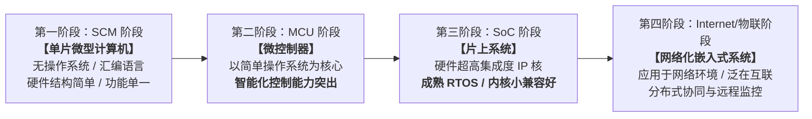
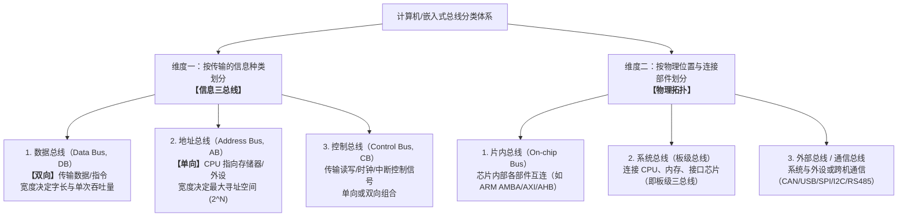
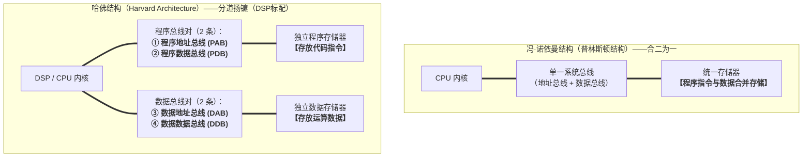
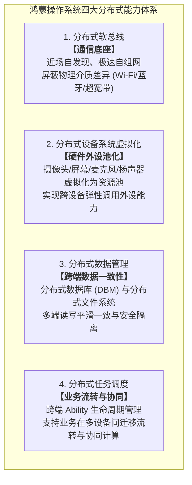
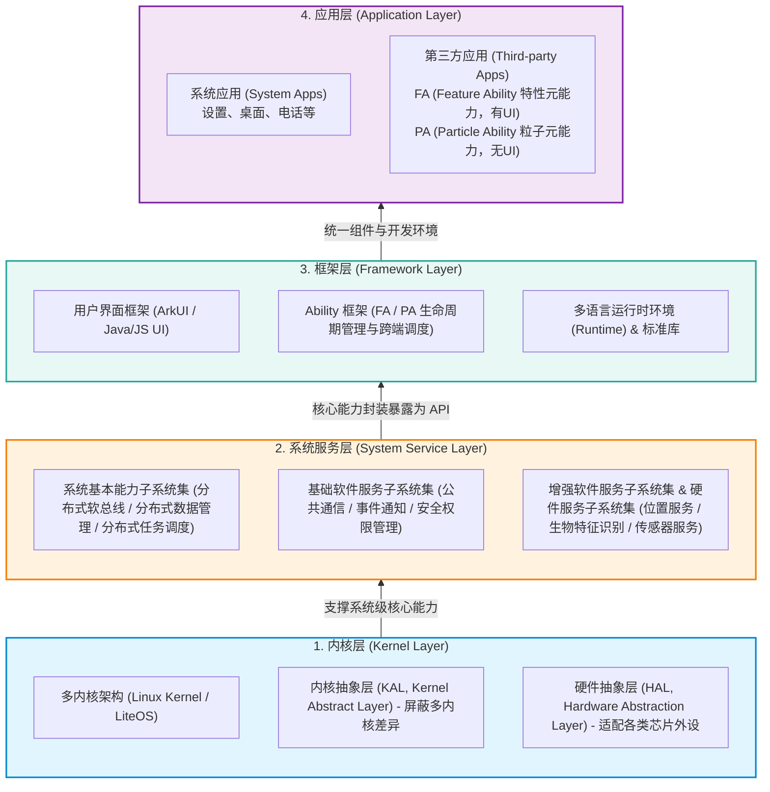
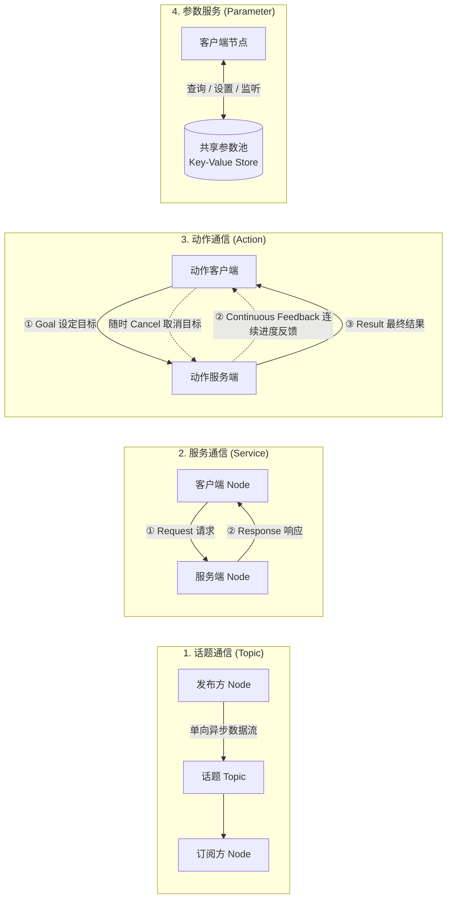
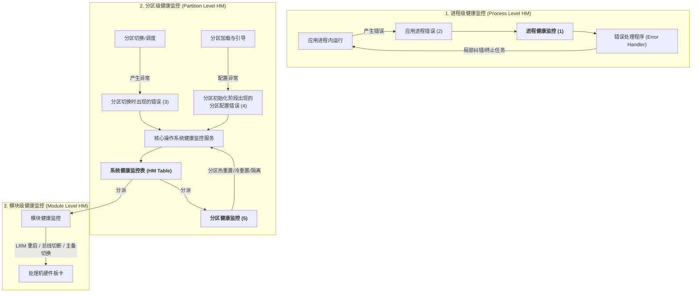

---
tags:
  - 软考
  - 系统架构设计师-高级
  - 第 16 章
---

> 公开版本不含原始图片附件。以下依赖图示的题目需先补图或核对已有文字图，不能从答案反推原图。

# 第 16 章 嵌入式系统架构设计理论与实践

> 目录骨架依据《系统架构设计师教程（第 2 版）》；具体知识内容在题目归档时补充。

## 16.1 嵌入式系统概述

### 16.1.1 嵌入式系统发展历程

[考查：综合知识（嵌入式系统演进四大阶段代号、标志性软硬件特征与题干判别词）]

#### 嵌入式系统发展历程四大演进阶梯全景 ⭐⭐⭐



- **一、嵌入式系统发展四大阶段权威对照表（核心必考）**：

  | 演进阶段 | 阶段全称与代号 | 核心硬件特征 | 软件与操作系统架构 | 典型应用与能力表象 | 命题关键词与判别词 |
  |:---|:---|:---|:---|:---|:---|
  | **第一阶段** | **SCM 阶段**<br>*(Single Chip Microcomputer)* | 单片微型计算机（早期 4 位 / 8 位单片机） | **无操作系统**，纯**汇编语言**编写控制逻辑 | 功能单一，依靠硬件逻辑或专用微代码，处理能力极弱 | **“无操作系统”**、**“使用汇编语言”**、**“功能单一”** |
  | **第二阶段** | **MCU 阶段**<br>*(Microcontroller Unit)* | 微控制器（外围扩展更丰富的单片机体系） | **以简单操作系统为核心**（监控程序/简易微内核），C 语言广泛使用 | **具有智能化控制能力突出**的特点，支持复杂工业时序与仪表控制 | **“以简单操作系统为核心”**、**“智能化控制能力突出”** ⭐ |
  | **第三阶段** | **SoC 阶段**<br>*(System on Chip)* | 片上系统（单硅片集成 CPU、外设 IP、模拟与总线） | 普遍运行**成熟的嵌入式实时操作系统（RTOS）**（如 VxWorks, FreeRTOS） | **系统兼容性好、操作系统内核小**，多媒体与复杂通信处理能力强 | **“片上系统”**、**“成熟 RTOS”**、**“内核小、兼容性好”** |
  | **第四阶段** | **以 Internet 为基础的阶段**<br>*(IoT / Networked)* | 具备网络接口的互联 SoC / 智能网关 / 传感器节点 | 网络化操作系统、物联网分布式协议栈（TCP/IP, MQTT, CoAP） | **应用于网络环境**，支持泛在互联、远程维护、云端协同与大数据交互 | **“应用于网络环境”**、**“以 Internet 为基础”**、**“网络化”** |

- **二、高频设陷点与排雷铁律**：
  - 🚫 **排雷词：“智能化” $\ne$ “Internet / 物联网”**。软考教材中“具有智能化控制能力突出特点”是**第二阶段 MCU 阶段**的专属定义词，标志着设备由传统电气硬逻辑进化为可编程智能控制；第四阶段的核心考查词必须是“应用于网络环境”或“互联”。
  - 🚫 **排雷词：“无操作系统” $\ne$ “内核小”**。第一阶段 SCM 根本没有操作系统；第三阶段 SoC 则是“成熟 RTOS、内核小、兼容性好”，不可混淆。

- **三、审题秒杀口诀**：
  > **“一代 SCM 无系统，汇编裸跑功能单；”**\
  > **“二代 MCU 带简系，智能控制显神威；”**\
  > **“三代 SoC 融芯片，成熟 RTOS 兼容好；”**\
  > **“四代物联通因特，泛在互联走天下！”**

- **真题锚点**：
  1. 【题库章节练习/真题回忆版】（第十六章 嵌入式系统架构设计理论与实践（新第2版）/ 第一节 嵌入式系统概述）：题干“嵌入式系统发展历程中，以简单操作系统为核心、具有智能化控制能力突出特点的阶段是（ ）” $\to$ 正确项选 B. MCU 微控制器（干扰项 A SCM 无操作系统；C SoC 属成熟 RTOS 内核小；D 属于应用于网络环境）。

### 16.1.2 嵌入式系统硬件体系结构

[考查：综合知识（总线两大分类维度、三总线特性与传输方向、寻址计算）]

#### 嵌入式计算机总线体系：两大分类维度、三总线（DB/AB/CB）与传输方向模型 ⭐⭐⭐



- **一、两大正交分类维度权威对照表（核心必考）**：

  | 分类维度 | 分类名称 | 核心定义与传输对象 | 典型代表与特性 | 常见命题陷阱与排雷 |
  |:---|:---|:---|:---|:---|
  | **维度一：按传输信息种类** | **数据总线（DB）** | 传输数据、操作数与代码指令 | **双向传输**，宽度（如 32/64 位）决定单次数据吞吐量 | 错以为只由 CPU 向内存单向写入 |
  | ^ | **地址总线（AB）** | 传输存储单元或 I/O 端口的**物理地址编号** | **单向传输**（CPU 发出，外设/RAM 接收）；宽度 $N$ 决定寻址能力：$2^N$ 字节 | 🚫 **混淆维度**：误将物理位置名词（如“片内总线”）作为信息分类 |
  | ^ | **控制总线（CB）** | 传输各种控制、时序、状态使能信号 | 读/写使能、中断请求、总线应答；含单向与双向信号线组合 | 错以为控制总线全是单向 |
  | **维度二：按物理连接位置** | **片内总线** | 芯片内部，连接 CPU 内部寄存器、ALU、控制单元或 SoC 内部 IP 核 | ARM AMBA（AXI、AHB、APB 等） | 看到“片内”切勿选到“信息种类”题目中 |
  | ^ | **系统总线** | 印刷电路板（PCB）级，连接微处理器、内存条与各类扩展插槽接口芯片 | ISA、PCI、PCIe、板级三总线 | 连接主板各主要元器件 |
  | ^ | **外部总线 / 通信总线** | 设备之间、微机系统与外部智能仪器/传感器之间的物理互连通信线 | RS-232、RS-485、USB、CAN、SPI、I2C | 嵌入式通信主力总线 |

- **二、核心特性与经典计算**：
  1. **地址总线宽度与最大寻址空间计算**：
     - 若 CPU 具有 $N$ 根地址线（地址总线宽度为 $N$ 位），按字节编址，则系统最大可寻址空间为：
       $$\text{寻址空间} = 2^N \text{ 字节 (Bytes)}$$
     - *例*：16 位地址线 $\to 2^{16} = 64\text{ KB}$；32 位地址线 $\to 2^{32} = 4\text{ GB}$；64 位地址线 $\to 2^{64}$。
  2. **传输方向铁律**：
     - **地址总线必定单向**：只能由总线主控方（微处理器 CPU 或 DMA 控制器）单向寻址发往从属方（RAM/ROM/外设接口），存储器绝不会反向向 CPU 寻址；
     - **数据总线必定双向**：CPU 既需要从存储器“读数据”（内存 $\to$ CPU），也需要向存储器“写数据”（CPU $\to$ 内存）。

- **三、审题秒杀口诀**：
  > **“总线分类看前提，信息种类三总线：数（数据）、地（地址）、控（控制）；”**\
  > **“物理位置分内外：片内、系统、外通信；”**\
  > **“地址单向指内存，宽度决定寻址空（$2^N$）；数据双向倒腾忙，宽度决定吞吐量；片内哪怕集成 RAM，也是位置莫张冠！”**

- **真题锚点**：
  1. 【题库章节练习/真题回忆版】（第十六章 嵌入式系统架构设计理论与实践（新第2版）/ 第一节 嵌入式系统概述，题目 4）：题干“在嵌入式系统中，按照计算机所传输的信息种类，以下哪种总线用于传输RAM中存储数据的地址（ ）” $\to$ 正确项选 B. 地址总线（干扰项 A 数据总线传数据；C 控制总线传控制；D 片内总线属物理位置分类，维度错位）。

#### 计算机底层架构对比：冯·诺依曼结构 vs 哈佛结构与总线拓扑 ⭐⭐⭐

[考查：综合知识（冯·诺依曼 vs 哈佛结构本质区别 / 哈佛结构 4 条总线拓扑 / 指令与数据存储空间解耦 / 流水线结构冲突消除）]



- **一、冯·诺依曼结构 vs 哈佛结构权威对比矩阵**：

  | 对比维度 | 冯·诺依曼结构（Von Neumann Architecture） | 哈佛结构（Harvard Architecture） | 命题关键词与排雷要点 |
  |:---|:---|:---|:---|
  | **存储空间组织** | **指令与数据合并在一起**，存放在同一个物理存储器中，共享统一编址空间 | **程序与数据存储在不同的物理存储空间**，物理上彻底解耦 | 🚫 **题眼排雷**：“指令与数据存储器合并在一起”是冯·诺依曼的典型特征！ |
  | **物理总线数量** | **2 条基本总线**（1 根地址总线 + 1 根数据总线），所有访存时分复用 | **4 条独立物理总线**（PAB + PDB + DAB + DDB，即 2 条地址线 + 2 条数据线） | 看到“4 条总线”切勿判定为错误，哈佛结构正是双对总线！ |
  | **访存行为与吞吐** | **串行访存**：同一时钟周期内无法同时取指令和读写数据；存在著名的“冯·诺依曼瓶颈” | **并行读取**：取指令与读写操作数可在同一周期并发执行，**具有极高的吞吐率** | DSP 实现单周期 MAC 乘加的核心硬件支撑 |
  | **流水线冲突影响** | 取指（IF）与访存（MEM）争抢同一物理总线/存储器，极易引发**结构冲突（Structural Hazard）**，导致流水线停顿 | 物理总线通道与存储体完全分离，**彻底消除了取指与访存之间的结构冲突** | 软考流水线冒险经典考查维度 |
  | **硬件复杂度与成本** | 物理引脚少、总线走线简单、成本低 | 内部总线走线复杂、引脚开销大、控制逻辑相对复杂 | 现代通用 CPU 内部采用“改进型哈佛结构”（片内分立 L1 I-Cache 与 D-Cache） |
  | **典型应用场景** | 通用微型计算机、早期的单片机与通用处理器 | **数字信号处理器（DSP）**、高性能专用 DSP 芯片、微控制器内核 | 题干出现 DSP 往往直接关联哈佛结构 |

- **二、现代处理器的折中：改进型哈佛结构（Modified Harvard Architecture）**：
  - **片内哈佛，片外冯·诺依曼**：现代通用处理器（如 ARM Cortex-A、Intel x86）在芯片片内采用哈佛结构（分离的 L1 指令缓存与 L1 数据缓存，消除流水线结构冲突）；而在芯片片外通过总线接口单元（BIU）统一连接到板级 DDR 内存，节省 PCB 引脚与成本。

- **三、审题秒杀口诀**：
  > **“冯诺依曼合二为一，取指读数挤一线（冯瓶颈）；”**\
  > **“哈佛分道并驾齐驱，程序数据各分立；”**\
  > **“两套总线四路通（PAB/PDB/DAB/DDB），并行吞吐速度奇；”**\
  > **“流水避免结构碰，DSP 算力离不开！”**

- **真题锚点**：
  1. 【题库章节练习/真题回忆版】（第十六章 嵌入式系统架构设计理论与实践（新第2版）/ 第一节 嵌入式系统概述）：题干“目前处理器市场中存在CPU和DSP两种类型处理器，分别用于不同场景，这两种处理器具有不同的体系结构，DSP采用哈佛结构，以下关于哈佛结构的描述错误的是（ ）” $\to$ 正确项选 A. 指令与数据存储器合并在一起（错误选项，属于冯·诺依曼结构；干扰项 B 程序和数据存储在不同空间、C 并行读取高吞吐率、D 有4条总线，均为哈佛结构真实特征）。

#### 嵌入式硬件核心组成与片上系统（SoC）技术特征 ⭐⭐⭐

[考查：综合知识（传统硬件构成白名单 / SoC 技术优势与片内再编程 / 专用处理器架构特性）]

- **一、传统嵌入式系统硬件核心组成（白名单）**：
  - **核心部件**：微处理器（MCU/MPU）、存储器（RAM/ROM/Flash）、总线（片内总线/系统总线）、定时器/计数器、看门狗电路（Watchdog）、输入/输出（I/O）接口（UART、SPI、I2C、USB、CAN、网络接口）；
  - 🚫 **高频排雷项**：**显示器（Display / 监视器）**。绝大多数工业控制、汽车 ECU、智能传感器等嵌入式设备属于无头（Headless）运行设备，显示器通常不是传统嵌入式系统的核心硬件组成部分。

- **二、片上系统（SoC, System on Chip）核心技术特征**：
  - **本质定义**：在单一硅芯片上集成微处理器核心、模拟与数字外设 IP 核、存储器及片上总线，构成一个功能完备的微型计算机系统；
  - **标志性技术亮点**：
    1. **片内再编程技术（On-Chip Reprogrammable）**：SoC 内部集成了可重构逻辑（如内嵌 FPGA 结构），使得芯片硬件功能能够像编写软件一样通过软件比特流在线编程配置，支持算法现场迭代升级与软硬件协同设计；
    2. **极高的技术保密性（抗逆向破解）**：传统板级分立系统的外部引脚和 PCB 走线容易被逻辑分析仪或示波器搭接窃听，而 SoC 将高速数据总线与算法代码全部深埋在微米级硅片内部，外部无物理总线引脚外露，**技术保密性极高，逆向工程极难**；
    3. **物理指标优势**：微小型化、极轻重量、超低功耗与批量低生产成本。

- **三、嵌入式专用处理器（MPU / MCU / DSP / GPU / FPGA / SoC）全景对比矩阵**：

  | 处理器类型 | 核心体系架构 | 标志性设计与题干特征词 | 典型应用场景 |
  |:---|:---|:---|:---|
  | **图形处理器（GPU）** | SIMD / 多流处理器并发阵列 | **专注于大规模密集型浮点运算，弥补 CPU 运算速度不足**；海量浮点流核心、极高并行吞吐与内存带宽 | 计算机图形渲染、多维矩阵运算、AI 模型推理与科学计算 |
  | **数字信号处理器（DSP）** | **哈佛结构**（指令与数据总线独立） | **单指令周期乘加运算（MAC）**、硬件循环控制；专用于连续离散信号实时滤波与变换 | 音频编码/降噪、雷达测控、通信基带信号处理 |
  | **微处理器（MPU）** | 通用标量控制处理器（如 Cortex-A/x86） | **片内无主存储器**（须板级外挂）；侧重分支预测与复杂逻辑控制，运行完整多任务 OS，**非浮点加速核心** | 工业主控机、智能网关、车载中控系统 |
  | **微控制器（MCU）** | 单片微型计算机（如 Cortex-M/8051） | **“单片即系统”**；**片内内置 RAM/ROM** 与丰富片上外设，极低功耗与低成本控制 | 智能家电控制、汽车 ECU、传感器节点 |
  | **片上系统（SoC）** | 单硅片高度集成多核与总线 | **片内再编程技术**、极高物理集成度、**极高技术保密性（深埋硅片难破解）** | 智能手机、车载智能座舱、超小型物联网终端 |
  | **现场可编程门阵列（FPGA）** | 查找表（LUT）可编程门阵列 | **纯硬件流水线并行执行**、硬件逻辑电路现场再重构 | 通信协议物理层加速、超低延迟高频量化、ASIC 原型验证 |

- **四、审题秒杀口诀**：
  > **“单片集成是 SoC，片内编程保密高；”**\
  > **“内置存储选 MCU，通用外挂是 MPU；”**\
  > **“总线分离属 DSP，哈佛结构单拍算（MAC）；”**\
  > **“密集浮点找 GPU，弥补 CPU 算力不足效力奇；”**\
  > **“传统硬件无头跑，屏幕绝非必选项！”**

- **真题锚点**：
  1. 【题库章节练习/真题回忆版】（第十六章 嵌入式系统架构设计理论与实践（新第2版）/ 第一节 嵌入式系统概述，题目 8）：题干“在传统嵌入式系统的硬件组成中（1）不是其主要组成部分；片上系统（SoC）的特点是（2）” $\to$ 第（1）空选显示器，第（2）空选 C. 采用了片内再编程技术，可通过编程配置硬件功能（干扰项 A 属 DSP 特征；B 属 GPU 特征；D 错误断言保密性差）。
  2. 【题库章节练习/真题回忆版】（第十六章 嵌入式系统架构设计理论与实践（新第2版）/ 第一节 嵌入式系统概述，题目 12）：题干“以下哪种处理器专注于浮点运算，弥补了CPU运算速度不足（ ）” $\to$ 正确项选 D. 图形处理器（GPU）（干扰项 A. MPU 为通用标量控制处理器，非海量浮点加速器；B. MCU 为单片集成低功耗控制单元；C. DSP 专用于哈佛总线下的单周期乘累加离散信号滤波）。

#### 微控制器（MCU）与微处理器（MPU）本质区别及低功耗设计技术 ⭐⭐⭐

[考查：综合知识（MCU vs MPU 体系架构本质边界 / 指令集误区排雷 / 嵌入式低功耗设计技术白名单）]

- **一、微控制器（MCU）与微处理器（MPU）体系架构核心对比**：

  ```mermaid
  graph LR
      subgraph MCU["微控制器（MCU / 单片机）——单片即系统"]
          MCU_Core["CPU 运算内核"] --- MCU_Mem["片内内置存储器<br><b>【RAM + ROM/Flash】</b>"]
          MCU_Core --- MCU_IO["片内集成外设<br>（Timer / ADC / UART 等）"]
      end

      subgraph MPU["微处理器（MPU）——必须板级外挂"]
          MPU_Core["CPU 内核 + Cache<br><b>【片内无主存储器】</b>"] ===|PCB 系统总线| MPU_ExtMem["板级外挂芯片<br><b>【外部 DDR / Flash】</b>"]
          MPU_Core ===|PCB 系统总线| MPU_ExtIO["外部接口芯片"]
      end
  ```

  | 对比维度 | 微控制器（MCU，Microcontroller Unit） | 微处理器（MPU，Microprocessor Unit） | 命题设陷点与解析 |
  |:---|:---|:---|:---|
  | **物理本质区别** | **片内内置存储器**（RAM、ROM/Flash 与 CPU 封装在单颗芯片内） | **片内无主存储器**，仅集成 CPU 与 Cache，主存必须在 PCB 板级外挂 | **⭐ 核心考点**：两者最本质的区别在于**是否内置存储器** |
  | **系统独立性** | **“单片即系统”**，单芯片加上电源与晶振即可独立运行 | 无法单芯片运行，必须外挂内存颗粒（如 DDR）与启动介质 | MCU 外围电路极简，MPU 外围电路与 PCB 走线复杂 |
  | **指令集架构（ISA）** | 可基于 ARM（Cortex-M）、RISC-V、8051、AVR、PIC 等 | 可基于 ARM（Cortex-A）、x86、MIPS、RISC-V 等 | 🚫 **高频排雷**：两者均可使用相同指令集（如 ARM），**指令集架构不是区分依据** |
  | **典型主频与算力** | 几十 MHz ~ 数百 MHz（算力中轻度） | 数百 MHz ~ 数 GHz（算力极高，支持多级流水线与 MMU） | 主频高低属于工艺表象，不可作为物理分类本质 |
  | **软件与操作系统** | 裸机轮询、前后台系统，或轻量级 RTOS（FreeRTOS, RT-Thread） | 完整通用多任务操作系统（Linux, Android, Windows IoT） | MPU 具备硬件 MMU（内存管理单元），支持虚拟内存与多进程 |
  | **成本与功耗** | 极低功耗（毫瓦级/微安级），硬件成本极低 | 功耗较高（瓦级以上），芯片与外设物料总成本较高 | 电池供电长续航野外节点优先选 MCU |

- **二、嵌入式系统低功耗设计主要技术全景与反向排雷**：
  1. **低功耗核心技术（正向白名单）**：
     - **动态电压与频率调节（DVFS, Dynamic Voltage and Frequency Scaling）**：根据当前处理负荷动态调整 CPU 供电电压和主频。根据 CMOS 动态功耗公式 $P_{\text{dynamic}} \propto C \cdot V^2 \cdot f$，电压 $V$ 对功耗呈二次方衰减效应，节能效果显著；
     - **时钟门控（Clock Gating）与电源门控（Power Gating）**：在硬件电路层面对当前未启用的外设 IP 核或片上总线关闭时钟供给或切断供电回路，根除动态开关损耗与静态漏电；
     - **多级低功耗休眠唤醒机制**：支持 Run、Sleep、Stop、Standby 等多级休眠模式；采用低频 RTC 配合定时唤醒，在无事件触发时让内核深度休眠（如 Tickless 节能调度）；
     - **软件编译优化与算法轻量化**：通过寄存器分配优化、循环展开权衡、消除冗余访存、整型代替浮点以降低 CPU 运行周期与总线翻转率，软硬件协同节能。
  2. 🚫 **高频反向排雷项**：
     - **多核设计（Multi-core Design）**：多核设计通过增加处理器核数来提升芯片并行吞吐量和峰值算力，但会成倍增加芯片硅片晶体管规模、静态漏电流和动态翻转功耗，**绝对不属于低功耗设计技术**！

- **三、审题秒杀口诀**：
  > **“单片集成是 MCU，片内自带 RAM 与 ROM；”**\
  > **“MPU 专干大计算，片内无存必外挂；”**\
  > **“指令架构莫混淆，大家都能用 ARM/V；”**\
  > **“低功降频关时钟，多核堆叠耗电凶！”**

- **真题锚点**：
  1. 【题库章节练习/真题回忆版】（第十六章 嵌入式系统架构设计理论与实践（新第2版）/ 第一节 嵌入式系统概述）：题干“微控制器（MCU）与微处理器（MPU）的本质区别是（1）；嵌入式系统低功耗设计主要技术不包括（2）” $\to$ 第（1）空选 C. 是否内置存储器（干扰项 D 指令集架构、A 集成外设数量、B 主频高低）；第（2）空选多核设计（低功耗技术包括 DVFS、时钟门控、休眠唤醒模式、编译与算法优化）。

#### 嵌入式元器件环境适应性：芯片工作温度等级分类标准 ⭐⭐⭐

[考查：综合知识（芯片四级工作温度范围数值 / 工业级核心指标 / 汽车级与军用级环境适应性标准）]

- **一、芯片工作环境温度等级权威标准对照表（核心必考）**：

  根据电子元器件与固态技术协会（JEDEC）及国际主流芯片厂商（TI、NXP、ST、Intel 等）的工业标准规范，芯片可适应的工作温度划分为四大经典梯队：

  | 温度级别 | 英文名称 | 标准工作温度范围 | 典型应用领域与环境工况 | 软考设陷点与排雷 |
  |:---|:---|:---|:---|:---|
  | **民用级 / 商业级** | Commercial | **$0^\circ\text{C} \sim +70^\circ\text{C}$** | 智能家电、个人 PC、办公外设、消费类数码电子（智能手环、电子玩具等） | 适用温和室内；**零度以下可能失灵**，不耐受户外严寒 |
  | **工业级** | Industrial | **$-40^\circ\text{C} \sim +85^\circ\text{C}$**<br>*(部分扩展达 $+105^\circ\text{C}$)* | 工业自动化 PLC、工控机、户外智能电表、野外水文监测站、工业通信网关 | **⭐⭐⭐ 软考高频必背秒杀区间**：适应冬季户外与工控机柜发热 |
  | **汽车级** | Automotive | **$-40^\circ\text{C} \sim +125^\circ\text{C}$**<br>*(发动机舱极限达 $+150^\circ\text{C}$)* | 车载 ECU、动力底盘控制、车载中控导航、自动驾驶域控制器（遵循 **AEC-Q100** 标准） | 介于工业级与军工级之间，抗振动与热应力疲劳要求极高 |
  | **军工级 / 宇航级** | Military / Space | **$-55^\circ\text{C} \sim +125^\circ\text{C}$**<br>*(航天级更高且需抗辐射)* | 导弹制导、战术雷达、战斗机航电、航天卫星深空载荷 | 极限严寒（$-55^\circ\text{C}$）与极限高温，兼具抗冲击/抗辐射加固 |

- **二、高频设陷点与反向排雷**：
  - 🚫 **排雷词：“通用级”**：电子元器件行业标准中**不存在“通用级”**这一分类术语，凡在选项中出现“通用级”一律判定为伪概念直接排除；
  - 🚫 **数值边界排雷**：
    - 民用级下限是 $0^\circ\text{C}$，绝不能有零下负数区间；
    - 工业级下限是 $-40^\circ\text{C}$，上限是 $+85^\circ\text{C}$；
    - 军工级下限是更严苛的 $-55^\circ\text{C}$。

- **三、审题秒杀口诀**：
  > **“芯片温标四重界，零到七十民用买；”**\
  > **“负四十到八十五，工业现场显身手；”**\
  > **“负五五到一二五，军工航天最威武；”**\
  > **“汽车介于工与军（$-40^\circ\text{C} \sim +125^\circ\text{C}$），通用纯属伪命题！”**

- **真题锚点**：
  1. 【题库章节练习/真题回忆版】（第十六章 嵌入式系统架构设计理论与实践（新第2版）/ 第一节 嵌入式系统概述，题目 23）：题干“根据芯片可适应的工作环境温度，-40℃~+85℃属于（ ）” $\to$ 正确项选 C. 工业级（干扰项 A 军用级为 -55℃~+125℃；B 民用级为 0℃~+70℃；D 通用级非标准术语）。

#### 嵌入式存储体系结构（存储金字塔）：存取速度梯队、介质与物理层次对比 ⭐⭐⭐

[考查：综合知识（存储部件速度降序排列 / 寄存器组物理特权 / Cache 与主存介质对比 / 速度-容量-成本权衡）]

- **一、嵌入式系统分级存储金字塔（Memory Hierarchy）模型**：

  ```mermaid
  graph TD
      subgraph Pyramid["计算机与嵌入式存储体系金字塔"]
          L1["【第 1 层·塔尖】寄存器组（Registers）<br><b>存取速度最快（< 1 ns / 单周期）</b><br>位于 CPU 执行流水线内部，容量几百字节，成本最高"]
          L2["【第 2 层·次高速】高速缓冲存储器 Cache（L1/L2/L3）<br><b>速度次之（1 ~ 10 ns）</b><br>SRAM 介质，利用局部性原理缓解存储墙"]
          L3["【第 3 层·主存】内存 / 主存储器（RAM）<br><b>速度居中（50 ~ 100 ns）</b><br>DRAM / SRAM 介质，存放运行代码与动态变量"]
          L4["【第 4 层·塔底】Flash / 辅助存储器（外存）<br><b>速度最慢（微秒 ~ 毫秒级）</b><br>NOR/NAND Flash 介质，非易失性，断电不丢数据"]
      end

      L1 --> L2
      L2 --> L3
      L3 --> L4
  ```

- **二、各层存储部件全维度对照表（核心必考）**：

  | 存储部件 | 物理安装位置 | 制造介质 | 访问时间数量级 | 易失性 | 核心职能与应用场景 | 软考设陷点与排雷 |
  |:---|:---|:---|:---|:---|:---|:---|
  | **寄存器组**<br>*(Registers)* | **CPU 内核流水线内部** | 触发器集成电路（Flip-Flop） | **$< 1\text{ ns}$**<br>*(单时钟周期)* | 易失 | 存放当前正被执行指令的操作数、中间结果及状态标志（如 PC, SP, 通用寄存器） | **⭐⭐⭐ 速度绝对第一**：切勿将寄存器仅视作运算部件而忽略其存储属性 |
  | **高速缓存**<br>*(Cache)* | CPU 芯片内部 / 紧贴内核 | **SRAM**<br>*(静态 RAM，6 晶体管/位)* | **$1 \sim 10\text{ ns}$**<br>*(数个到十几个时钟周期)* | 易失 | 自动镜像主存活跃块，利用时间/空间局部性消除 CPU-主存速度鸿沟 | 🚫 **高频误选**：Cache 虽快，但需经 Cache 控制器 Tag 比对，**慢于寄存器** |
  | **主存储器**<br>*(内存 / RAM)* | 片内总线（MCU）或 PCB 系统总线（MPU） | **DRAM**（动态，需定期刷新）或 **SRAM** | **$50 \sim 100\text{ ns}$** | 易失 | 存放当前正在运行的操作系统的内核、应用程序及动态堆栈数据 | 速度居中，断电后数据全部丢失 |
  | **闪存 / 外存**<br>*(Flash / ROM)* | 片内非易失存储区或板级 SPI/QSPI 芯片 | **NOR Flash**（支持片内执行 XIP）/ **NAND Flash** | **$\mu\text{s} \sim \text{ms}$**<br>*(微秒至毫秒级)* | **非易失**<br>*(断电不丢)* | 存储固件程序（BootLoader, RTOS 镜像）与业务持久化数据 | 速度在四者中**垫底**，但拥有大容量与持久保存优势 |

- **三、高频设陷点与三维权衡关系**：
  1. **存取速度严格降序**：
     $$\text{寄存器组} > \text{Cache（高速缓存）} > \text{内存（主存）} > \text{Flash（闪存/外存）}$$
  2. **三维物理反向权衡定律**：
     - 从金字塔顶（寄存器）到金字塔底（Flash）：**存取速度逐渐变慢、访问延迟逐渐变大**；
     - 相应地，**存储容量呈数量级放大、单位比特存储成本（Cost per bit）呈数量级下降**。
  3. 🚫 **审题排雷铁律**：凡是题目问“存取速度最快”，只要选项中有**寄存器（组）**，必定首选寄存器；只有当题目将范围限制在“主存与 CPU 之间的缓冲”或选项中没有寄存器时，才选 Cache。

- **四、审题秒杀口诀**：
  > **“存取速度比高低，寄存器组坐第一；”**\
  > **“Cache 紧随排老二，主存内存排老三；”**\
  > **“Flash 慢在毫微秒，断电不丢保平安；”**\
  > **“越往上跑速度快，容量越小成本翻！”**

- **真题锚点**：
  1. 【题库章节练习/真题回忆版】（第十六章 嵌入式系统架构设计理论与实践（新第2版）/ 第一节 嵌入式系统概述，题目 20）：题干“在嵌入式系统的存储部件中，存取速度最快的是（ ）” $\to$ 正确项选 B. 寄存器组（干扰项 D Cache 为第二快；A 内存为第三快；C Flash 最慢但非易失）。

#### AI 芯片三大核心技术架构（GPU / FPGA / ASIC）全景对比与选型决策 ⭐⭐⭐

[考查：综合知识（AI 芯片三大经典技术架构 / 定制化-灵活性-能效权衡 / 架构选型与排雷）]

- **一、AI 芯片技术架构三大主力全景模型**：

  ```mermaid
  graph LR
      subgraph AI_Arch["AI 加速芯片三大核心技术架构"]
          GPU["1. GPU（图形处理器）<br><b>【通用并行架构】</b><br>海量 SIMD 流核心 / CUDA 生态成熟<br>算力高 / 功耗大 / 算法灵活性极佳"]
          FPGA["2. FPGA（现场可编程门阵列）<br><b>【半定制硬件架构】</b><br>查找表（LUT）硬件级现场可重编程<br>超低确定性时延 / 适合算法迭代期"]
          ASIC["3. ASIC（专用集成电路）<br><b>【全定制专用架构】</b><br>针对张量/神经网络硬连线直接流片<br>能效比最高 / 批量成本低 / 无法改算法"]
      end

      GPU -->|定制化程度提高 / 灵活性降低| FPGA
      FPGA -->|能效比提高 / 批量单片成本降低| ASIC
  ```

- **二、AI 芯片三大技术架构全维度权威对比表（核心必考）**：

  | 对比维度 | GPU（图形处理器） | FPGA（现场可编程门阵列） | ASIC（专用集成电路） | 命题陷阱与选型导向 |
  |:---|:---|:---|:---|:---|
  | **架构定制化程度** | **通用并行**（软硬件接口解耦） | **半定制化**（门阵列逻辑可编程） | **全定制化**（电路硬连线直接固化） | 按照定制化程度从低到高排列 |
  | **核心硬件单元** | 海量 SIMD/SIMT 流处理器、Tensor Core | 可编程逻辑块（CLB）、查找表（LUT）、DSP 切片 | 针对矩阵乘累加直接硬连线的专用脉动阵列/张量计算单元 | 不同的计算硬件承载实体 |
  | **开发与算法灵活性** | **极高**（软件编程，模型更新即插即用） | **较高**（支持重新烧录比特流重构硬件电路） | **无**（芯片流片出厂后硬件电路不可更改） | 算法频繁迭代期切忌过早盲目上 ASIC |
  | **能效比（TOPS/W）** | 较低（通用控制逻辑与高速缓存消耗大量动态功耗） | 中等（明显优于 GPU，功耗适中） | **极高**（剔除全部冗余逻辑，能效比冠绝全场） | **⭐⭐ 能效比之王必选 ASIC** |
  | **研发周期与前期成本** | 研发周期短，采购即用，无芯片流片风险 | 硬件描述语言开发周期中等，无流片开模费 | **流片研发周期极长（1~2年），NRE 掩膜开模成本巨大** | 只有数百万套大规模量产才能摊薄 ASIC 研发开模成本 |
  | **批量单片硬件成本** | 单片采购价格昂贵（数万到数十万元） | 单片成本中等偏高 | **大规模量产时单片成本极低**（低至数美元） | 边缘端大规模量产首选 ASIC |
  | **典型工业代表** | NVIDIA H100 / A100 / RTX 系列 | Xilinx (AMD) Versal / Alveo, Intel Agilex | Google TPU, 寒武纪 NPU, 特斯拉 FSD / HW4, 华为昇腾 | 软考常考代表芯片 |

- **三、高频设陷点与反向排雷铁律**：
  - 🚫 **排雷一：SoC（片上系统）不是 AI 算力技术架构！**\
    SoC 属于**系统级物理芯片集成形式（Packaging / Integration Form）**，是指在单颗硅片上把 CPU、GPU、NPU（通常为 ASIC 架构）、ISP 等模块集成封装；题目问“AI 芯片三大技术架构”，选项中出现 SoC 直接秒杀排除。
  - 🚫 **排雷二：CPU 与 DSP 不是主流 AI 加速芯片技术架构！**\
    CPU 核心数量少，专攻串行通用控制；DSP 专用于一维离散信号的滤波与傅里叶变换（音频/雷达），无法支撑高维张量矩阵的大规模并行计算。

- **四、审题秒杀口诀**：
  > **“AI 芯片三架构，通用半定全定制；”**\
  > **“GPU 通用生态好，FPGA 半定重构妙；”**\
  > **“ASIC 专用能效高，SoC 物理集成非架构！”**

- **真题锚点**：
  1. 【2022 年下半年综合知识第 25 题】题干“AI芯片是当前人工智能技术发展的核心技术，其能力要支持训练和推理，通常，AI芯片的技术架构包括（ ）等三种” $\to$ 正确项选 A. GPU、FPGA、ASIC（干扰项 D 混淆了物理集成形态 SoC；B、C 混淆了通用主控 CPU 与离散滤波 DSP）。

### 16.1.3 嵌入式软件架构概述

## 16.2 嵌入式系统软件架构原理与特征

### 16.2.1 两种典型的嵌入式系统架构模式

[考查：综合知识（嵌入式系统两大典型架构模式 / 混成系统 Hybrid System 核心定义、构件拓扑与计算模型控制 / 物理连续与数字离散交织）]

#### 嵌入式混成系统（Hybrid System）架构模型与协同控制机制 ⭐⭐⭐

- **一、混成系统（Hybrid System）核心定义与物理信息系统（CPS）拓扑**：

  ```mermaid
  graph TD
      subgraph Hybrid["嵌入式混成系统架构（Hybrid System）"]
          MoC["<b>【计算模型（Model of Computation, MoC）】</b><br>统一跨域因果时序 / 定义并发与交互形式化语义"]

          subgraph Comp["混合构件拓扑（并行或串行组合）"]
              Discrete["1. 离散分离组件（Discrete Components）<br>★ 驱动方式：<b>离散事件 / 时钟节拍 / 状态跃迁</b><br>★ 承载实体：数字微处理器（MCU）、控制算法、有限状态机（FSM）"]
              Continuous["2. 连续组件（Continuous Components）<br>★ 驱动方式：<b>时间连续演进 / 微分方程 / 动力学</b><br>★ 承载实体：物理环境对象、液压流体、电机转速、温度阻抗"]
          end

          MoC <==>|形式化行为调度与语义控制| Comp
      end
  ```

- **二、混成系统两大核心法定特征权威对照表（核心必考）**：

  | 核心维度 | 权威规范定论 | 概念内涵与工程本质 | 软考设陷点与排雷铁律 |
  |:---|:---|:---|:---|
  | **系统构件组成** | **离散分离组件 + 连续组件** | 必须兼具**数字逻辑（离散跳变）**与**物理动力学（时间连续演化）**两大构件集合 | 🚫 **排雷**：只提“离散”或只提“连续”均属片面错误，必须二者兼备 |
  | **构件拓扑关系** | **并行或串行组成** | 物理环境与数字控制器既可通过闭环反馈**并行**协同，也可通过流水处理前后**串行**级联 | 🚫 **排雷**：断言“只能并行”或“只能串行”均错 |
  | **行为交互控制** | **由计算模型（Model of Computation）进行控制** | 跨越连续时间与离散事件的不同时钟域与因果律，必须依赖严密的形式化**计算模型（MoC）**统一调度控制 | 🚫 **核心排雷**：将控制机制偷换为“同步/异步事件”或“中断信号”（概念降级错误） |
  | **典型工业代表** | 汽车防抱死系统（ABS）、车身稳定（ESP）、现代电传飞控、机器人控制 | 机械运动动力学（连续）与单片机电控单元 ECU 状态机（离散）的交织耦合 | 混成系统是物理信息系统（CPS）的底层系统学模型 |

- **三、高频设陷点与反向排雷铁律**：
  - 🚫 **排雷一：“同步/异步事件” $\ne$ “计算模型”！**\
    同步/异步事件只是操作系统层面任务并发与 IPC 通信的底层实现原语，根本无法表达连续物理系统（如流体力学、牛顿运动学微分方程）在时间维度的连续演进规律。混成系统组件间的交互行为必须由更高抽象层级的**形式化计算模型（Model of Computation）**进行统辖控制。
  - 🚫 **排雷二：构件“离散”与“连续”缺一不可！**\
    没有连续组件，系统退化为普通纯数字离散软件；没有离散组件，系统退化为纯模拟硬件电路。唯有二者深度耦合，方称“混成”。

- **四、审题秒杀口诀**：
  > **“混成系统不单调，连续离散并或串；”**\
  > **“行为协同靠什么？形式计算模型管；”**\
  > **“若换同步异步事，概念降级莫上当！”**

- **真题锚点**：
  1. 【题库章节练习/真题回忆版】（第十六章 嵌入式系统架构设计理论与实践（新第2版）/ 第二节 嵌入式系统软件架构原理与特征，题目 34）：题干“混成系统是嵌入式实时系统的一种重要的子类。以下关于混成系统的说法中，正确的是（ ）” $\to$ 正确项选 B. 混成系统一般由离散分离组件和连续组件并行或串行组成，组件之间的行为由计算模型进行控制（干扰项 A 遗漏连续组件；C 遗漏离散组件；D 将控制机制降级为同步/异步事件）。

### 16.2.2 嵌入式操作系统

[考查：综合知识（概念、特征与应用领域辨析）]

#### 嵌入式操作系统核心概念与应用边界

- **定义**：以应用为中心，以计算机技术为基础，软硬件可裁剪，适应应用系统对功能、可靠性、成本、体积、功耗严格要求的专用计算机系统中的操作系统。
- **典型特征**：微型化、软硬件可裁剪、专用性强、高可靠性、通常具备较强实时性（硬实时/软实时）。
- **典型应用领域**：
  - **移动智能终端**：智能手机、平板电脑（运行 Android、iOS、HarmonyOS 等移动嵌入式操作系统）。
  - **汽车电子与车载系统**：车载信息娱乐（IVI）、中控屏、车身动力控制与自动驾驶（如基于 QNX、Linux、AUTOSAR 等）。
  - **军工与航天航空**：雷达航电、飞控与武器制导（运行 VxWorks、RTEMS 等高可靠硬实时操作系统）。
  - **工业控制与物联网**：智能电网、PLC 工业控制器、机器人、穿戴式智能设备（如运行轻量级 RTOS 的智能手表）。
- **混淆辨析（易错点）**：
  - **办公系统（OA、ERP、协同文档等）**：属于面向企事业单位日常业务管理流程的**通用业务软件系统**，运行于通用 PC 桌面或云端服务器环境中，**不属于**嵌入式操作系统的应用领域。
  - **智能手机是典型的嵌入式系统**：切勿因手机交互界面丰富、可下载安装第三方应用而误将其划为通用计算机；其 SoC 移动芯片架构、电源功耗控制、体积限制决定了其底层 OS 属于移动嵌入式操作系统范畴。

#### 实时操作系统（RTOS）核心特征、首要目标与软硬件可裁剪性 ⭐⭐⭐

[考查：综合知识（RTOS 首要任务与死线约束 / 软硬件可裁剪性本质 / 通用 OS vs RTOS 设计权衡 / 硬实时 vs 软实时）]

- **一、RTOS 核心定义与两大正确性判定维度**：
  - 实时系统的正确性不仅严格依赖于**运行结果的逻辑正确性**，而且严格依赖于**产生结果的时间正确性（时间确定性）**！
  - 即实时系统必须在规定的时间范围（Deadline）内正确响应外部物理过程的变化；若超出死线，即便计算结果逻辑无误，系统整体也判定为失效（在安全关键场景可造成灾难性后果）。

- **二、通用操作系统（General OS） vs 实时操作系统（RTOS）设计目标全方位对比**：

  | 对比维度 | 通用操作系统（General-Purpose OS） | 实时操作系统（RTOS） | 软考命题设陷与辨析核心 |
  |:---|:---|:---|:---|
  | **首要任务（第一要务）** | **提高系统资源利用率**、最大化吞吐量、分时公平 | **调度一切可利用的资源来完成实时控制任务** | ⭐⭐⭐ **核心考点**：RTOS 宁可闲置/浪费算力，也必须优先保证控制死线；利用率永远退居其次！ |
  | **时间约束与评价** | 追求平均响应时间，兼顾用户交互体验，不保证绝对死线 | **严格满足对时间的限制和确定性要求（Determinism）** | 任务执行时间可依据软硬件信息进行确定性预测 |
  | **软硬件可裁剪性** | 庞大复杂、组件紧耦合，通常不支持深度内核剥离裁剪 | **高度模块化、高内聚低耦合，必须支持针对硬件与应用变化进行配置、内核裁剪与重配** | 🚫 **秒杀陷阱**：断言“RTOS 不能针对硬件变化进行配置及裁剪”违背嵌入式基本定义！ |
  | **中断响应机制** | 中断处理时间不固定，关中断时间可能较长 | **中断延迟（Latency）极短且严格确定可预测** | 中断响应与实时事件处理是 RTOS 核心生命线 |
  | **典型代表系统** | Windows, macOS, Linux (桌面/通用服务器) | VxWorks, RT-Thread, FreeRTOS, QNX, μC/OS | 广泛用于工业控制、航空航天、汽车底盘电子 |

- **三、硬实时（Hard Real-Time） vs 软实时（Soft Real-Time）本质边界**：
  1. **硬实时系统（Hard RTOS）**：截止时间是绝对不可逾越的硬性约束；一旦发生超时（Deadline Miss），将直接导致系统崩溃、财产损毁乃至人员伤亡等致命灾难（如汽车安全气囊弹出、火箭飞控姿态调整、核电站急停控制）；
  2. **软实时系统（Soft RTOS）**：截止时间是期望目标；偶尔发生超时不会引发灾难性系统失效，仅表现为服务质量（QoS）的降级（如在线音视频播放丢帧、网页交互卡顿、工业监控非关键数据日志上传）。

- **四、嵌入式操作系统法定产品分类白名单与双重否定审题铁律 ⭐⭐⭐**：
  1. **实时嵌入式操作系统（RTOS 白名单）**：
     - **VxWorks**（风河 Wind River，航空航天/国防航电/工业控制硬实时事实标准）；
     - **μC/OS-II / μC/OS-III**（开源微内核抢占式实时系统）；
     - **QNX**（黑莓，车控 ASIL-D 级高安全微内核 RTOS）；
     - **RT-Linux / Xenomai**（硬实时双内核补丁改造）；
     - **FreeRTOS / RT-Thread**（轻量级物联网/单片机实时操作系统）。
  2. **非实时嵌入式操作系统（Non-RTOS 白名单）**：
     - **Android**（谷歌，移动终端/车载娱乐，基于分时多任务公平调度）；
     - **iOS**（苹果，移动终端，侧重用户交互体验，非实时设计）；
     - **WinCE (Windows Embedded Compact)**（微软消费电子/车机导航，归属非实时通用嵌入式）；
     - **原生嵌入式 Linux**（未打硬实时补丁的通用 Linux）。
  3. **双重否定破题铁律**：
     - 题干问：“**不属于非实时**嵌入式操作系统” $\equiv$ **选实时操作系统（RTOS）** $\to$ 秒选 **VxWorks**；
     - 题干问：“**不属于实时**嵌入式操作系统” $\equiv$ **选非实时操作系统（Non-RTOS）** $\to$ 排除 VxWorks/μC/OS，选 Android/iOS/WinCE。

- **五、审题秒杀口诀**：
  > **“嵌入系统必裁剪，软硬量身定做衣；”**\
  > **“RTOS 目标很明确，死线控制排第一；”**\
  > **“资源利用靠边站，实时响应不迟疑；”**\
  > **“见‘不属于非实时’，立刻换脑找 RTOS！”**\
  > **“VxWorks 与 μC/OS，并驾齐驱保实时；”**\
  > **“安卓、苹果加 WinCE，人机交互非实时！”**

- **真题锚点**：
  1. 【题库章节练习/真题回忆版】（第十六章 嵌入式系统架构设计理论与实践（新第2版）/ 第二节 嵌入式系统软件架构原理与特征，题目 35）：题干“以下关于RTOS（实时操作系统）的叙述中，不正确的是（ ）” $\to$ 正确项选 A. RTOS不能针对硬件变化进行结构与功能上的配置及裁剪（错误叙述，RTOS 必须支持裁剪与配置；干扰项 B 可根据应用重配裁剪、C 首要任务调度一切资源完成实时控制任务、D 实质为资源管理程序需及时响应中断，均为官方教材原话）。
  2. 【2025年上半年综合知识回忆版 / 题库补充题】（第十六章 嵌入式系统架构设计理论与实践（新第2版）/ 第五节 嵌入式系统架构设计理论与实践（补充），题目 5）：题干“嵌入式操作系统通常分为实时和非实时两类，（ ）不属于非实时嵌入式操作系统” $\to$ 正确项选 B. VxWorks（双重否定转化：“不属于非实时”即要求选出实时操作系统 RTOS；干扰项 A. WinCE、C. Android、D. iOS 均为非实时嵌入式操作系统）。

#### 嵌入式操作系统任务管理：三态生命周期模型（执行/就绪/阻塞）与“阻塞 vs 挂起”机理辨析 ⭐⭐⭐

[考查：综合知识（RTOS 三大基本工作状态定义 / 状态转换触发事件闭环 / 阻塞态与挂起态本质边界）]

- **一、嵌入式操作系统任务三态生命周期状态机模型**：

  ```mermaid
  stateDiagram-v2
      [*] --> 就绪状态: 任务创建并初始化完成
      就绪状态 --> 执行状态: 调度器分派 CPU 运行
      执行状态 --> 就绪状态: 时间片用完 / 被更高优先级就绪任务抢占
      执行状态 --> 阻塞状态: 因等待某一事件/资源（I/O、信号量、延时）而无法继续
      阻塞状态 --> 就绪状态: 等待的事件已发生 / I/O 完成 / 延时到期
      执行状态 --> [*]: 任务执行完毕终止销毁
  ```

- **二、任务三种基本工作状态权威定义（核心必考）**：

  | 任务状态 | 核心定义与运行条件 | CPU 占用情况 | 资源齐备情况 | 触发转换事件 |
  |:---|:---|:---|:---|:---|
  | **执行状态**<br>*(Running)* | 任务已获得 CPU 控制权，指令正在被处理器执行 | **正在占用 CPU**（单核单芯片时刻仅 1 个） | 一切资源完全齐备 | 调度器选中分派 CPU |
  | **就绪状态**<br>*(Ready)* | 任务已具备运行的一切前置条件，仅等待分配 CPU | **未占用 CPU**（在就绪队列中排队） | **除 CPU 外所有资源已齐备** | 阻塞事件发生唤醒，或运行任务时间片耗尽/被抢占 |
  | **阻塞状态**<br>*(Blocked / Waiting)* | 任务因等待某一特定外部事件发生而无法继续执行，**主动放弃 CPU** | **未占用 CPU**（脱离就绪队列，进入等待队列） | **缺少特定事件或硬件资源** | 执行中主动等待 I/O、申请锁未果、调用延时 sleep |

- **三、高频设陷点：“阻塞状态（Blocked）” vs “挂起状态（Suspended）”对比矩阵**：

  | 对比维度 | 阻塞状态（Blocked / Waiting） | 挂起状态（Suspended） | 软考核心排雷 |
  |:---|:---|:---|:---|
  | **触发驱动源** | **任务内部业务逻辑主动发起**（如串口数据未到、主动调用延时、等待信号量） | **外部实体显式强制干预**（由系统内核、其他任务调用 `vTaskSuspend()` 或调试器强行挂起） | 题干出现“因等待某个事件发生”必属**阻塞态** |
  | **唤醒与解冻机制** | **事件驱动自动唤醒**：所等待的外部事件/资源一旦就绪，内核自动将其推入**就绪队列** | **必须依赖外部显式恢复**：即便内部事件满足也不会运行，必须显式调用 `vTaskResume()` 解冻 | 挂起任务对外界事件不感知 |
  | **理论范畴归属** | 属于操作系统任务管理的**三大基本工作状态之一** | 属于操作系统扩展的辅助控制状态，**非基本三态** | 问“三大基本状态”直接排除挂起态 |

- **四、状态跃迁三大核心铁律**：
  1. **不可跨级直接执行**：阻塞任务在等待事件发生后，**绝不能直接跃迁到“执行状态”**，必须先排入“就绪状态”，由调度器重新裁决分派 CPU；
  2. **就绪不可直接阻塞**：就绪态任务没有占用 CPU，不可能发出“等待 I/O”的操作，因此**就绪态不能直接转为阻塞态**（必须先获取 CPU 变成执行态，才能转为阻塞态）；
  3. **丢失 CPU 必定重回就绪**：执行态任务/进程无论因时间片用完还是被更高优先级任务抢占，由于自身无任何外部资源缺失，**必定退回“就绪状态”**，重新排队等待调度。

- **五、审题秒杀口诀**：
  > **“任务三态记心间：执行、就绪、阻塞连；”**\
  > **“万事俱备欠 CPU，随时待命叫就绪；”**\
  > **“等待事件无法走，主动让位叫阻塞；”**\
  > **“挂起全靠外部抓，事件来了先就绪，莫跨门槛直接跑！”**

- **真题锚点**：
  1. 【题库章节练习/真题回忆版】（第十六章 嵌入式系统架构设计理论与实践（新第2版）/ 第二节 嵌入式系统软件架构原理与特征，题目 7）：题干“在嵌入式操作系统的任务管理中，当一个正在执行的任务因等待某个事件发生而无法继续执行时，该任务的状态将转换为（ ）” $\to$ 正确项选 C. 阻塞状态（干扰项 D 挂起状态为外部显式冻结；B 就绪状态未等待事件；A 执行状态已无法继续）。
  2. 【题库章节练习/真题回忆版】（第十六章 嵌入式系统架构设计理论与实践（新第2版）/ 第二节 嵌入式系统软件架构原理与特征，题目 26）：题干“当一个进程被一个更高优先级的进程抢占或其时间片用完时，其状态会从执行态转变为（ ）” $\to$ 正确项选 B. 就绪态（干扰项 A 阻塞态为缺少外部事件/I/O 资源主动暂停；C 睡眠态为显式延时；D 挂起态为内存与外存间的置换状态）。

#### 嵌入式实时任务调度算法：静态最优 RMS 与动态调度（EDF / LLF）对比 ⭐⭐⭐

[考查：综合知识（实时调度算法分类 / 单调速率 RMS 法定最优依据 / 动态调度 EDF 与 LLF / 排除非实时 RR）]

- **一、嵌入式任务调度算法全景分类模型**：

  ```mermaid
  graph TD
      Sched["嵌入式操作系统任务调度算法体系"]

      Sched --> RT["实时调度算法（Real-Time Scheduling）<br><b>以满足任务截止时间（Deadline）为绝对核心</b>"]
      RT --> Static["1. 静态优先级调度<br><b>【单调速率调度 RMS】</b><br>依据：任务周期长短（发生速率）<br><b>周期越短 $\to$ 优先级越高</b><br>★ 教程法定：被认为是最优的实时调度算法"]
      RT --> Dynamic["2. 动态优先级调度"]
      Dynamic --> EDF["最早截止时间优先（EDF）<br>依据：绝对截止时间早晚<br><b>截止期越早 $\to$ 优先级越高</b>"]
      Dynamic --> LLF["最低松弛度优先（LLF）<br>依据：紧急度（松弛度）<br><b>松弛度越小 $\to$ 优先级越高</b>"]

      Sched --> NonRT["非实时调度算法（排雷项）<br><b>【时间片轮转 RR / 先来先服务 FCFS】</b><br>追求公平分时，无死线确定性保证，<b>不属于实时调度</b>"]
  ```

- **二、三大核心实时调度算法全维度权威对照表（核心必考）**：

  | 调度算法名称 | 算法类型 | 优先级分配依据与规则 | 算法核心特征与优缺点 | 软考设陷点与教材定论 |
  |:---|:---|:---|:---|:---|
  | **单调速率调度**<br>*(RMS, Rate Monotonic)* | **静态优先级**<br>*(创建时确定，固定不变)* | **任务周期越短（发生频率越高），优先级越高**；周期越长，优先级越低 | 结构极简、调度开销极小、系统确定性与稳定性极佳 | **⭐⭐⭐ 教材原文法定定论**：“被认为是最优的实时调度算法” |
  | **最早截止时间优先**<br>*(EDF, Earliest Deadline First)* | **动态优先级**<br>*(随时间推移实时动态计算)* | **任务绝对截止时间越早，优先级越高**；动态重排队头任务 | 理论上处理器利用率可达 100%，但在瞬态过载时可能发生连锁雪崩超时 | 动态调度之王，但非教材中“最优实时调度”专指称号 |
  | **最低松弛度优先**<br>*(LLF, Least Laxity First)* | **动态优先级** | **松弛度越小（紧急程度越高），优先级越高**<br>*(松弛度 = 截止时刻 - 当前时刻 - 剩余运行时间)* | 实时响应极其敏感，但由于各任务松弛度动态变动，**上下文切换过于频繁、系统开销过大** | 切换频繁损耗 CPU，较少在轻量 RTOS 中实用 |
  | **时间片轮转调度**<br>*(RR, Round-Robin)* | **非实时调度**<br>*(分时通用策略)* | 按就绪队列顺序平均轮流分配时间片 | 追求进程间 CPU 分配的**公平性**，完全不保证任务在截止期前完成 | 🚫 **高频排雷**：属于通用分时系统，**根本不属于实时调度算法** |

- **三、高频设陷点与反向排雷铁律**：
  - 🚫 **排雷一：“时间片轮转（RR）”绝非实时调度！**\
    时间片轮转追求“人人有份、公平分摊”，是桌面通用分时操作系统的标志性算法；而 RTOS 追求的是“任务硬死线绝对不超时”，两者目标完全南辕北辙，只要问“实时调度”，时间片轮转首先排除。
  - 🚫 **排雷二：“最优实时调度”官方话术归属**：\
    在《系统架构设计师教程（第 2 版）》中，**“被认为是最优的实时调度算法”** 这一专有评价原话专属于**单调速率（RMS）调度算法**。
  - 🚫 **排雷三：“以泛代专”陷阱（优先级调度 vs 最早截止期调度）**：\
    当题干描述“当任务接近自己的截止期（deadline）时，将其优先级调整到最高以获取 CPU 运行”，考查的是具体由“截止期（deadline）”驱动的专有动态算法 **最早截止期调度算法（EDF）**；切勿选宽泛的上位大类“优先级调度算法”或“抢占式优先级调度算法”（特异性优先原则）。

- **四、审题秒杀口诀**：
  > **“最优实时数 RMS，短命高频先执行；周期越短级越高，静态固定最省心；”**\
  > **“截止时间找 EDF，临近死线升最高；”**\
  > **“紧急程度算松弛，余量最小选 LLF；”**\
  > **“时间片转图公平，通用分时莫当真！”**

- **真题锚点**：
  1. 【题库章节练习/真题回忆版】（第十六章 嵌入式系统架构设计理论与实践（新第2版）/ 第二节 嵌入式系统软件架构原理与特征，题目 10）：题干“在嵌入式操作系统的任务管理中，以下哪种调度算法被认为是最优的实时调度算法（ ）” $\to$ 正确项选 C. 单调速率（RMS）调度算法（干扰项 A EDF 为动态调度；B LLF 为松弛度调度；D 时间片轮转为非实时分时算法）。
  2. 【题库章节练习/真题回忆版】（第十六章 嵌入式系统架构设计理论与实践（新第2版）/ 第二节 嵌入式系统软件架构原理与特征，题目 14）：题干“某嵌入式实时操作系统采用了某种调度算法，当某任务执行接近自己的截止期（deadline）时，调度算法将把该任务的优先级调整到系统最高优先级，让该任务获取CPU资源运行。请问此类调度算法是（ ）” $\to$ 正确项选 D. 最早截止期调度算法（干扰项 A 优先级调度为宽泛上位概念，遗漏截止期核心条件；B 抢占式优先级为执行机制；C 最晚截止期为概念颠倒）。
  3. 【2025 年上半年系统架构设计师综合知识试题 3 / 补充真题】：题干“在典型强实时调度算法中，（ ）算法是根据任务的紧急程度确定任务的优先级” $\to$ 正确项选 C. Least Laxity First（最低松弛度优先 LLF）（干扰项 A EDF 依据是截止时间早晚；D RMS 依据是任务周期长短；B FIFO 为非实时分时算法）。

#### 嵌入式操作系统内核架构：微内核（Microkernel）与宏内核（Monolithic Kernel）全维度对比 ⭐⭐⭐

[考查：综合知识（微内核设计哲学 / 内核态与用户态组件边界 / IPC 消息传递与上下文切换开销 / 宏内核直接调用高效率 / 故障隔离权衡）]

- **一、微内核与宏内核物理拓扑与特权级架构模型**：

  ```mermaid
  graph TD
      subgraph Mono["宏内核 / 单内核架构（Monolithic Kernel，如 Linux / VxWorks）"]
          MK["【内核空间 Ring 0·统一大内核】<br>进程管理 + 虚拟内存 + <b>文件系统 + 网络协议栈 + 所有设备驱动</b><br>★ 交互方式：<b>共享同一地址空间，直接函数指针调用（零 IPC 开销）</b><br>★ 特征：<b>运行效率与性能极高</b>；缺点：代码庞大，单点驱动崩溃导致整机死机"]
      end

      subgraph Micro["微内核架构（Microkernel，如 QNX / 鸿蒙微内核 / seL4）"]
          US["【用户空间 Ring 3·服务器进程集群】<br>文件服务进程（FS） + 网络协议栈进程 + 各类外设驱动进程<br>★ 彼此处于独立地址空间，<b>严禁直接调用函数</b>"]
          K0["【微内核空间 Ring 0·最小特权核心】<br><b>低级进程调度 + 基础虚拟内存映射 + 中断/异常处理 + IPC 消息传递机制</b>"]
          US <==>|频繁 IPC 消息传递<br>多次用户态/内核态上下文切换（开销大）| K0
      end
  ```

- **二、微内核与宏内核全维度权威对比表（核心必考）**：

  | 对比维度 | 微内核（Microkernel） | 宏内核 / 单内核（Monolithic Kernel） | 命题陷阱与排雷指引 |
  |:---|:---|:---|:---|
  | **设计哲学** | **机制与策略分离**，内核只保留最小机制，策略上移用户态 | **功能一体化**，所有系统服务全塞入内核，追求极致性能 | 问“遵循机制与策略分离”，选微内核 |
  | **内核态（Ring 0）包含内容** | **极简白名单**：进程调度、基础内存管理、中断处理、**IPC 消息传递** | **全量系统服务**：调度、内存、**文件系统、网络栈、设备驱动** | 🚫 **排雷**：驱动与文件系统在微内核中**运行于用户态，不属于内核** |
  | **组件间通信机制** | **进程间通信（IPC / 消息传递机制）** | **直接函数调用**（共享单一内核地址空间） | 🚫 **排雷**：微内核服务间**绝不能直接跨进程调用代码** |
  | **执行效率与运行性能** | **较低**（一次请求需经“客户端 $\to$ 内核 $\to$ 服务端 $\to$ 内核 $\to$ 客户端”多次上下文切换） | **极高**（无 IPC 封包与上下文切换损耗，直接跳转执行） | 🚫 **核心排雷**：宣称微内核“性能很高、速度极快”必定是错误选项 |
  | **可靠性与故障隔离** | **极高**（驱动或文件服务崩溃仅服务进程退出重启，**微内核不死**） | **较低**（任何驱动缺陷、空指针越界直接触发 Kernel Panic 整机死机） | 问“哪个系统具备极强故障隔离与自愈能力”，选微内核 |
  | **可扩展性与灵活性** | **极佳**（增删改服务只需启停用户态进程，**无需重编译内核**） | **较差**（增删功能通常需修改内核代码或加载内核模块，强耦合） | 问“利于按需裁剪与扩展”，选微内核 |
  | **系统可移植性** | **极高**（内核代码极精简，硬件强相关代码少，易向新架构移植） | **较低**（内核代码量以千万行计，跨架构移植工作量庞大） | 问“内核代码少、可移植性好”，选微内核 |
  | **团队开发协作** | **良好**（各服务接口标准化定义，服务自治，利于多团队并行开发） | **一般**（内核全局数据结构交织，容易产生隐式依赖与冲突） | 结构清晰利于团队协作 |

- **三、高频设陷点与反向排雷铁律**：
  - 🚫 **排雷一：“性能很高”与“代码互相调用”是微内核的双重死穴！**\
    微内核为了换取高可靠与高扩展，**最大妥协就是牺牲了运行性能**。各服务运行在互相隔离的独立用户地址空间，通信必须经由微内核中转 IPC 消息，每次交互伴随 CPU 特权态切换（Ring 3 $\to$ Ring 0 $\to$ Ring 3）与上下文切换，开销远大于宏内核的内存函数直接跳转。
  - 🚫 **排雷二：设备驱动和文件系统不属于微内核！**\
    软考高频出题问“以下属于/不属于微内核功能的有哪些”，切记：**文件系统、虚拟文件交换（VFS）、设备驱动、网络协议栈（TCP/IP）在微内核体系中全都是用户态服务器进程**，绝不是微内核内部功能。

- **四、审题秒杀口诀**：
  > **“微核精简居用户，消息传递保隔离；”**\
  > **“驱动文件皆非核，崩溃重启内不死；”**\
  > **“宏核全塞特权态，函数直调性能优；”**\
  > **“若夸微核效率高、代码直调，定是设陷圈套题！”**

- **真题锚点**：
  1. 【题库章节练习/真题回忆版】（第十六章 嵌入式系统架构设计理论与实践（新第2版）/ 第二节 嵌入式系统软件架构原理与特征）：题干“以下关于操作系统微内核架构特征的说法，不正确的是（ ）” $\to$ 正确项选 D. 微内核的功能代码可以互相调用，性能很高（干扰项 A 结构清晰利于协作；B 代码量少可移植性好；C 有良好伸缩性与扩展性均为微内核真实优势）。
  2. 【软件设计师 2017 年下半年综合知识第 70 题】：题干“以下关于微内核架构的叙述中，不正确的是（ ）” $\to$ 正确项选 B. 微内核架构适合高性能需求的系统。
  3. 【软件设计师 2018 年上半年综合知识第 15 题】：题干“在微内核操作系统中，（ ）不属于微内核的功能” $\to$ 正确项选 D. 文件系统。

### 16.2.3 嵌入式数据库

### 16.2.4 嵌入式中间件

[考查：综合知识（定义、分层拓扑与屏蔽对象、三大特征、典型中间件家族）]

#### 一、嵌入式中间件核心定位与分层屏蔽职责 ⭐⭐⭐

- **标准定义**：嵌入式中间件（Embedded Middleware）是在嵌入式系统中处于**嵌入式应用和操作系统之间**层次的独立系统软件，其核心作用是**对嵌入式应用屏蔽底层操作系统的异构性**，并提供通用的系统级服务（如网络通信、内存管理、数据分发和实时调度等）。
- **嵌入式分层架构与分层屏蔽对照表**：

| 分层位置 | 软件层次名称 | 核心职责与服务内容 | 向上屏蔽的异构性对象 | 常见实现 / 技术标准 |
|:---|:---|:---|:---|:---|
| **顶层** | **嵌入式应用层**<br>*(Embedded Applications)* | 实现具体业务逻辑（如飞控算法、车身动力控制、人机交互） | 无（业务消费方） | 业务代码、控制循环 |
| **中间层** | **嵌入式中间件层**<br>*(Embedded Middleware)* | 提供通用基础服务组件，解耦应用与底层系统 | **屏蔽底层操作系统的异构性**<br>（消除不同 RTOS 的 API/IPC 差异） | **DDS**（实时数据分发）、**CORBA**（轻量跨语言 RPC）、**MQTT/AMQP**（消息总线）、**OpenGL ES**（图形） |
| **系统层** | **嵌入式操作系统层**<br>*(Embedded OS / RTOS)* | 提供任务多线程调度、内存管理、文件系统、中断管理等基础内核能力 | 统一抽象硬件资源模型 | VxWorks、FreeRTOS、RT-Thread、嵌入式 Linux、QNX、Zephyr |
| **抽象层** | **板级支持包 / 硬件抽象层**<br>*(BSP / HAL)* | 包含硬件初始化代码、时钟配置、板级外设驱动，提供虚拟硬件接口 | **屏蔽底层硬件的物理异构性**<br>（消除不同 CPU 架构、板级引脚差异） | BSP、HAL 库、AUTOSAR MCAL |
| **底层** | **嵌入式物理硬件层**<br>*(Hardware)* | 提供物理计算、存储、通信与传感执行能力 | 物理实体 | MCU/SoC（ARM、RISC-V、DSP）、传感器、执行器 |

- **高频设陷点与排雷铁律**：
  - ❌ **排雷词：屏蔽底层硬件**。屏蔽底层硬件是 **BSP（板级支持包）/ HAL（硬件抽象层）** 的职责！嵌入式中间件位于操作系统之上，不越级触碰硬件。
  - ❌ **语病排雷：抽象底层操作系统的异构性**。技术术语中“异构性”只能被“屏蔽”，“资源/接口”才被“抽象”，看到“抽象异构性”直接秒杀排除。
- **解题口诀**：
  > **“中间件在应用与系统间，屏蔽操作系统异构性；”**\
  > **“硬件上面是 HAL 与 BSP，屏蔽硬件差异助系统；”**\
- **真题锚点**：
  1. 【题库章节练习/真题回忆版】（第十六章 嵌入式系统架构设计理论与实践（新第2版）/ 第二节 嵌入式系统软件架构原理与特征，题目 37）：题干“嵌入式中间件（Embedded Middleware）是在嵌入式系统中处于嵌入式应用和操作系统之间层次的中间软件，其主要作用是对嵌入式应用（ ）的异构性” $\to$ 正确项选 D. 屏蔽底层操作系统（干扰项 A 抽象底层操作系统为动宾搭配错误，异构性必须用“屏蔽”；B、C 屏蔽/抽象底层硬件为 BSP/HAL 的职责，中间件不直接接触硬件）。

#### 二、嵌入式中间件核心特征与典型分类 ⭐⭐⭐

- **三大核心特征（对比通用企业级中间件）**：
  1. **轻量化与高可裁剪性**：代码尺寸（Footprint）极小，内存占用少，可在受限微控制器（MCU/SoC）上运行；
  2. **高实时性与确定性（Determinism）**：响应延迟具有可预测性，满足硬实时（Hard Real-Time）系统的时限要求；
  3. **高可靠性与健壮性**：支持故障隔离与断电保护，满足安全攸关（Safety-Critical）领域严苛标准。

- **两大核心流派深入辨析：消息中间件（MOM） vs 分布式对象中间件（DOM）**：

| 维度 | 消息中间件（MOM，如 DDS / MQTT / AMQP） | 分布式对象中间件（DOM，如 CORBA / RT-CORBA） |
|:---|:---|:---|
| **核心定义** | 在消息传输过程中**保存消息的容器**与中继路由中介。 | **主要由一组对象来提供系统服务**，对象间能够跨平台、跨语言透明通信。 |
| **基本特征** | ① **采用异步处理模式**（发送后无须阻塞等待响应）；<br>② 应用程序间为**松耦合关系**（时空与状态解耦）。 | ① **面向接口与对象调用**（IDL 强契约）；<br>② 通常为**同步请求/响应（RPC）**，紧耦合度相对较高。 |
| **服务传递模型** | ① **点对点模型（Point-to-Point / Queue）**：一条消息仅由一个消费者独占消费；<br>② **发布-订阅模型（Publish-Subscribe / Topic）**：一对多广播/组播，一条消息可被多端订阅接收。 | 基于 **对象请求代理（ORB）** 机制，客户端通过持有的远程对象引用（IOR/Stub）透明发起方法调用。 |
| **软考高频设陷** | 🚫 题目常将分布式对象中间件的定义“**由一组对象提供系统服务**”张冠李戴给消息中间件！ | 🚫 题目常误将 ORB / 伺服对象机制当作消息队列。 |

- **三、高频设陷点与架构权衡辨析**：
  1. ❌ **性能陷阱：提高实时性能**。中间件的核心价值是**屏蔽底层操作系统的异构性、提高代码可移植性与构件重用率**。软件分层工程中，增加任何抽象间接层都会带来微小的调度时延与内存占用，其主要作用**绝对不是提高系统的实时性能**（实时性由底层 RTOS 优先级调度与硬件中断保障）。
  2. ❌ **范畴陷阱：消息中间件不属于嵌入式中间件**。在车载总线、航天遥测、多机协同等现代分布式嵌入式系统中，消息中间件（DDS、MQTT）与分布式对象中间件（CORBA）不仅属于嵌入式中间件，而且是支撑高可靠分布式通信的核心底座。
  3. ❌ **层级陷阱：位于应用与硬件之间**。直接控制硬件的是 **BSP（板级支持包）/ HAL（硬件抽象层）**；操作系统位于 BSP 之上；**中间件位于操作系统与应用软件之间**。

- **四、审题秒杀口诀**：
  > **“消息中间件看三宝：异步、解耦、存消息（容器）；”**\
  > **“模型分两类：点对点独占，发布订阅广播传；”**\
  > **“见‘一组对象提服务’，定是分布式对象（CORBA）来串场！”**\
  > **“中间件屏蔽操作系统异构，切忌盲信提高实时性！”**

- **真题锚点**：
  2. 【题库章节练习/真题回忆版】（第十六章 嵌入式系统架构设计理论与实践（新第2版）/ 第一节 嵌入式系统概述）：题干“关于嵌入式中间件的描述，以下哪项是正确的（ ）” $\to$ 正确项选 C. 嵌入式中间件对嵌入式应用屏蔽底层操作系统的异构性（干扰项包括：A. 位于应用和硬件之间；B. 主要作用是提高系统实时性能；D. 消息和分布式对象中间件不属于嵌入式中间件）；
  3. 【题库章节练习/真题回忆版】（第十六章 嵌入式系统架构设计理论与实践（新第2版）/ 第五节 嵌入式系统架构设计理论与实践（补充））：题干“通常，嵌入式中间件没有统一的架构风格，根据应用对象的不同可存在多种类型，比较常见的是消息中间件和分布式对象中间件，以下有关消息中间件的描述中，不正确的是（ ）” $\to$ 正确项选 C. 消息中间件主要由一组对象来提供系统服务，对象间能够跨平台通信（解析：该项为分布式对象中间件定义；消息中间件是消息暂存容器，具有异步、松耦合特征，包含点对点与发布-订阅模型）。

#### 三、CORBA 分布式对象中间件架构与服务端构件模型（Servant / OA / ORB）⭐⭐⭐

[考查：综合知识（CORBA 构件角色分工、Servant 物理实现本质、POA 分派与生命周期管理、ORB 通信总线）]

- **一、CORBA 服务端构件模型全景分工协作**：

  ```mermaid
  graph LR
      Client["客户端 Client<br>（持有 IOR 对象引用）"] -->|1. 透明方法调用| ORB["对象请求代理 ORB<br><b>【通信中枢 / 路由总线】</b><br>拦截调用 / 序列化参数 / 网络寻址"]
      ORB -->|2. 分派请求 Dispatch| OA["对象适配器 OA / POA<br><b>【调度中介 / 生命周期管家】</b><br>屏蔽 ORB 细节 / 管理对象激活"]
      OA -->|3. 执行具体方法| Servant["伺服对象 Servant<br><b>【真正代码实现实体】</b><br>具体编程语言类 / 完成业务处理"]
  ```

- **二、CORBA 核心四大构件职责与题干判别词对照表（核心必考）**：

  | 核心构件名称 | 构件英文与全称 | 核心架构定位 | 核心职责与分工 | 软考设陷点与判别词 |
  |:---|:---|:---|:---|:---|
  | **伺服对象** | **Servant** | **真实业务代码实现实体** | 编写具体业务逻辑的程序语言实例（C++/Java/Ada 等）；**真正实现 IDL 接口声明的方法，负责完成客户端请求** | **⭐⭐⭐ 核心判别词**：“CORBA 对象的真正实现”、“负责完成客户端请求”、“具体代码实现” |
  | **对象适配器** | **Object Adapter**<br>*(POA, Portable OA)* | **调度中介与生命周期管家** | 充当 ORB 与 Servant 之间的桥梁；屏蔽 ORB 底层实现细节；负责对象注册、激活/去激活；**将 ORB 接收到的请求分派（Dispatch）给具体的 Servant** | **⭐⭐ 核心判别词**：“连接 ORB 与 Servant 的桥梁”、“将请求分派给具体实现”、“屏蔽 ORB 细节” |
  | **对象请求代理** | **ORB**<br>*(Object Request Broker)* | **通信中枢与透明传输总线** | 负责跨网络、跨平台的透明消息寻址与路由；完成参数序列化/反序列化（Marshaling/Unmarshaling）；客户方无需关心对象物理位置 | **核心判别词**：“查找与定位对象”、“透明传输参数与结果”、“通信总线” |
  | **适配器激活器** | **Adapter Activator** | **动态按需创建辅助构件** | 属于 POA 的扩展机制；当 ORB 接收到对某个不存在或未激活的子 POA 的请求时，**负责动态创建并激活该子 POA** | **核心判别词**：“动态创建/激活子对象适配器” |

- **三、高频设陷点与排雷铁律**：
  - 🚫 **排雷一：CORBA 对象（Object）$\ne$ 伺服对象（Servant）**：\
    CORBA 对象是**逻辑抽象概念与接口契约**（面向客户端，由 IDL 声明），而 Servant 是**物理底层真正的代码实现类**（面向服务端运行环境）。题干问“真正实现、负责完成客户端请求”，必须选 **Servant（伺服对象）**。
  - 🚫 **排雷二：对象适配器（POA）不执行业务代码！**\
    POA 是“调度派发员（Dispatcher）”和“管家”，它只负责把请求转交给 Servant，绝不包含具体业务实现代码。
  - 🚫 **排雷三：ORB 不包含对象逻辑！**\
    ORB 只负责搬运网络报文和寻址定位，不参与具体对象生命周期调度或方法执行。

- **四、审题秒杀口诀**：
  > **“干活实现找 Servant，分派管家找 POA；”**\
  > **“寻址路由靠 ORB，动态激活靠 Activator！”**

- **真题锚点**：
  1. 【题库章节练习/真题回忆版】（第十六章 嵌入式系统架构设计理论与实践（新第2版）/ 第二节 嵌入式系统软件架构原理与特征，题目 23）：题干“CORBA服务端构件模型中，（ ）是CORBA对象的真正实现，负责完成客户端请求” $\to$ 正确项选 A. 伺服对象（Servant）（干扰项 B 对象适配器负责请求分派与接口抽象；C ORB 负责通信寻址；D 适配器激活器负责动态激活子 POA）。
  2. 【2010 年下半年综合知识第 61 题】：题干“在CORBA体系结构中，对象适配器（OA）的主要作用是（ ）” $\to$ 正确项选 B. 将请求分派给具体的对象实现（Servant）。
  3. 【2016 年下半年综合知识第 36-37 题】：题干考查 POA 与 Servant 的协作桥梁关系。

#### 四、系统集成与通信中间件四大模式（消息传递 / 共享数据库 / RPC / 文件传输）全景选型对比 ⭐⭐⭐

[考查：综合知识（EAI 四大集成模式 / 消息传递 Messaging 核心特征 / 事件驱动自动通知 / 异步可靠重传保障 / 共享数据库轮询缺陷与 RPC 适用场景）]

- **一、系统集成与通信中间件四大典型集成模式全景拓扑**：

  ```mermaid
  graph TD
      subgraph Modes["企业应用与嵌入式系统四大集成模式"]
          M1["1. 消息传递（Messaging / 消息中间件）<br>★ 机制：<b>异步消息队列 / 消息 Broker 解耦</b><br>★ 特征：<b>可定制数据包、事件驱动自动通知、原生支持数据可靠重传</b>"]
          M2["2. 共享数据库（Shared Database）<br>★ 机制：<b>各系统直接读写统一物理数据库</b><br>★ 特征：数据结构强耦合；<b>被动拉取需轮询（无自动通知），无内置网络重传</b>"]
          M3["3. 远程过程调用（RPC / 远程方法调用）<br>★ 机制：<b>点对点同步网络调用</b><br>★ 特征：<b>强同步、低延迟即时双向交互</b>；网络中断直接失败，无异步重传缓冲"]
          M4["4. 文件传输（File Transfer）<br>★ 机制：<b>共享磁盘文件读写</b><br>★ 特征：离散批处理、大批量历史数据同步；时效性差，数据流转控制弱"]
      end
  ```

- **二、四大系统集成模式全维度权威对比表（核心必考）**：

  | 集成方式 | 交互模式 | 自动通知机制 | 可靠数据重传保障 | 系统耦合度 | 典型应用与架构选型 | 软考核心排雷与判别词 |
  |:---|:---|:---|:---|:---|:---|:---|
  | **消息传递**<br>*(Messaging)* | **异步解耦**（发布/订阅、点对点队列） | **极强**（新消息到达自动触发回调事件通知消费者） | **极强**（Broker 持久化、消费 ACK 确认、超时自动重发与重试队列） | **极低**（仅依赖报文契约，收发双方无需同时在线） | 异构系统异步协同、跨网络可靠数据包流转、削峰填谷 | **⭐⭐⭐ 核心判别词**：“可定制数据包”、“到达自动通知”、“支持数据重传确保成功” |
  | **共享数据库**<br>*(Shared DB)* | **被动存储**（各系统自行 SQL 读写） | **无**（接收方对写入无感知，必须定时高频 Polling 轮询） | **无**（无内置网络重试机制，需业务层自行标记状态） | **极高**（统一底层数据模型 Schema 强耦合，并发易锁死） | 遗留系统数据整合、单一权威数据源只读共享 | 🚫 **排雷**：看到“自动通知”和“数据重传”，直接秒杀排除共享数据库 |
  | **远程过程调用**<br>*(RPC)* | **强同步阻塞**（Request-Response） | **即时**（通过显式远程方法调用立即触发目标方执行） | **较弱**（网络抖动或对端宕机直接抛出异常，无异步自动重传） | **较高**（依赖接口签名、网络即时连通与服务地址） | 微服务内部即时鉴权、低延迟双向查询、事务性紧凑协作 | 问“低延迟、强同步等待返回结果”，首选 RPC |
  | **文件传输**<br>*(File Transfer)* | **离线批处理**（定时读写本地/FTP文件） | **无**（依赖定时扫盘或操作系统文件监控，时效差） | **最弱**（传输中断通常需人工或脚本整体重跑） | **最低**（系统间无运行时直接网络依赖） | 银行日终离线对账、海量历史日志归档与离线 ETL | 问“大批量非实时离线数据传输”，选文件传输 |

- **三、高频设陷点与反向排雷铁律**：
  - 🚫 **排雷一：跨系统共享数据 $\ne$ 共享数据库！**\
    考生容易凭生活经验“共享数据选数据库”。共享数据库是**被动拉取（Pull）模型**，数据写入后无法向外部主动发通知，外部系统只能通过不断轮询表状态来“傻等”；且数据库没有网络协议级的重传机制。
  - 🚫 **排雷二：消息传递是事件驱动与可靠交付的双料王者！**\
    消息中间件（如 MQTT、AMQP、Kafka、RabbitMQ 等）的核心设计目标就是：① 格式自由封包；② **基于事件的实时推送通知（Push）**；③ **保证交付（Guaranteed Delivery / At-least-once）**，通过 ACK 机制在网络异常时自动重传，直至确认送达。

- **四、审题秒杀口诀**：
  > **“自动通知加重传，消息传递是答案；”**\
  > **“共享数据靠轮询，无重传且耦合缠；”**\
  > **“同步直调找 RPC，离线大批传文件！”**

- **真题锚点**：
  1. 【题库章节练习/真题回忆版】（第十六章 嵌入式系统架构设计理论与实践（新第2版）/ 第二节 嵌入式系统软件架构原理与特征，题目 36）：题干“某公司欲对其内部的信息系统进行集成，需要实现在系统之间快速传递可定制格式的数据包，并且当新的数据包到达时，接收系统会自动得到通知。另外还要求支持数据重传，以确保传输的成功。针对这些集成需求，应该采用（ ）的集成方式” $\to$ 正确项选 D. 消息传递（干扰项 B 共享数据库缺乏自动通知与重传机制；A RPC 为同步阻塞且无异步可靠重传；C 文件传输时效与重传最弱）。
  2. 【系统架构设计师 2010 年下半年综合知识第 58 题】：题干“企业应用集成（EAI）的主要技术中，基于消息中间件的集成方式称为（ ）” $\to$ 正确项选 D. 事件驱动集成。

#### 五、机器人操作系统（ROS）分布式软件架构与三大通信机制（Topic / Service / Action）⭐⭐⭐

[考查：案例分析（2017年案例三） / 综合知识（ROS本质定位、ROS 与 RTOS 异同对比、Topic/Service/Action 三大通信机制选型、Master注册发现机制）]

- **一、ROS（Robot Operating System）本质定位与架构模型**：
  - **本质定位**：ROS 并非传统意义上的操作系统内核，而是一个面向机器人的**开源分布式次级操作系统（Meta-Operating System / 机器人软件中间件）**。它构建于主机操作系统（通常是 Linux/Ubuntu）之上，提供硬件抽象、底层设备控制、常用功能实现、进程间消息传递以及软件包管理。
  - **架构特点**：
    - **分布式进程框架**：各个功能模块被封装为互相独立的**节点（Node）**；
    - **点对点拓扑**：节点之间通过网络建立 P2P 直连通信，避免中心节点转发瓶颈；
    - **Master 名字注册与发现**：通过 ROS Master（节点管理器）维护节点与话题的名称映射与网络地址协商；
    - **多语言混合编程**：支持 C++、Python、Lisp 等语言跨进程无缝通信。

  ```mermaid
  graph TD
      subgraph ROS_Master["ROS Master（节点管理器 / 协调中心）"]
          M["注册中心：维护 Node、Topic、Service 名称与 IP/Port 映射"]
      end

      subgraph Nodes["分布式计算节点网络（P2P 直连通信）"]
          Camera["节点 1：Camera Node<br>（发布者 Publisher）"]
          Proc["节点 2：Image Processing Node<br>（订阅者 Subscriber / 服务端）"]
          Display["节点 3：Image Display Node<br>（订阅者 Subscriber / 客户端）"]
      end

      Camera -->|1. 注册发布 Registration| M
      Proc -->|2. 注册订阅 Registration| M
      Display -->|3. 注册订阅 Registration| M
      M -.->|4. 告知对端 IP/Port| Camera
      M -.->|4. 告知对端 IP/Port| Proc
      M -.->|4. 告知对端 IP/Port| Display
      Camera ==>|5. P2P 高速直连数据流 /image_data| Proc
      Camera ==>|5. P2P 高速直连数据流 /image_data| Display
  ```

- **二、ROS 与嵌入式实时操作系统（RTOS）深度对比（案例考点）**：

| 对比维度 | 机器人操作系统（ROS / ROS 1） | 嵌入式实时操作系统（RTOS，如 VxWorks、RTEMS） | 案例题踩分关键词 |
|:---|:---|:---|:---|
| **共同点** | ① **系统专用性强**：均面向特定工业/装备定制；<br>② **系统资源受限**：受物理体积与计算资源约束；<br>③ **均采用嵌入式微处理器**：运行于 ARM/DSP/SoC；<br>④ **软硬件依赖性强**：与底层传感器、电机紧密交互。 | ① **系统专用性强**：面向特定航天/工控装备；<br>② **系统资源受限**：受物理体积与计算资源约束；<br>③ **均采用嵌入式微处理器**：运行于 ARM/DSP/SoC；<br>④ **软硬件依赖性强**：与底层传感器、执行机构紧密交互。 | **共同特征（任答 3 点即满分）**：<br>专用性强、资源有限、嵌入式微处理器、强软硬件依赖 |
| **差异：实时性** | **较弱（软实时 / 弱实时）**：ROS 1 运行在通用 Linux 分时内核上，无法保证微秒级确定性响应与硬死线。 | **极强（硬实时）**：具备严格确定性的中断延迟与纳秒/微秒级抢占调度，确保死线绝对不超时。 | **ROS 实时性弱于 RTOS** ⭐ |
| **差异：通信机制** | **丰富多样、跨网络分布式**：原生提供 Topic（发布/订阅）、Service（请求/响应）、Action（长任务反馈）等高级分布式机制。 | **相对单一、底层偏单机**：通常仅提供单机进程/线程间的信号量、消息队列、共享内存、管道等底层原语。 | **ROS 通信丰富，RTOS 相对单一** ⭐ |

- **三、ROS 三大核心通信机制全维度特征对比（案例表 3-1 核心）**：

  | 通信机制 | 交互模型 | 同步性与阻塞 | 适用业务场景 | 软考核心特征判别词 |
  |:---|:---|:---|:---|:---|
  | **主题（Topic）** | **发布/订阅模型**（一对多 / 多对多） | **异步非阻塞**（单向连续数据流） | 激光雷达、相机图像、IMU 等高频传感器数据流连续发布 | **“适合传输传感器信息/数据流”**、**“一对多模式”**、**“可能丢失数据”**、**“可能让系统过载”** |
  | **服务（Service）** | **客户端/服务端模型**（一对一请求-响应） | **同步双向阻塞**（客户端发出请求后等待结果） | 机器人传感器单次开关、参数配置、触发单次计算并返回状态 | **“能够知道是否调用成功”**、**“服务执行完前程序会等待”**、**“执行完会有反馈”** |
  | **动作（Action）** | **客户端/服务端长任务模型**（带反馈与取消） | **异步双向非阻塞**（发送 Goal，周期接收 Feedback，最终得 Result） | 机器人复杂长耗时导航、机械臂连续轨迹规划、视觉伺服抓取 | **“可以监控长时间执行的进程”**、**“有握手信号”**、**“较复杂”**、**“建立通信较慢”** |

- **四、案例三考法与做题通关公式**：
  > **“长任务反馈选 Action，单次请求响应选 Service，连续传感数据流选 Topic；”**\
  > **“图 3-1 填图题看题干：注册找 Master，相机发数据，节点发布 (Publish)，下级订阅 (Subscribe)！”**

- **真题锚点**：
  1. 【系统架构设计师 2017 年下半年案例分析试题三】：ROS 机器人操作系统架构论述题（25 分），涵盖与 RTOS 共同点/差异、Topic/Service/Action 特征填表、节点通信结构图填空。详见：`[[个人资料/笔记/软考/系统架构设计师-高级/真题库/下午题/2017-下半年-下午#案例三：ROS机器人操作系统架构|2017 年下半年案例三]]`。

### 16.2.5 嵌入式系统软件开发环境

## 16.3 嵌入式系统软件架构设计方法

### 16.3.1 基于架构的软件设计开发方法的应用

### 16.3.2 属性驱动的软件设计方法

### 16.3.3 实时系统设计方法

[考查：综合知识 / 案例分析（实时系统设计方法学演进 / DARTS 方法核心思想、优势与局限 / CODARTS 与 ADARTS 演进）]

#### 实时系统设计方法学：DARTS 方法核心思想、任务划分准则与优缺点辨析 ⭐⭐⭐

- **一、DARTS 方法核心定位与基本思想**：
  - **全称与提出者**：**DARTS（Design Approach for Real-Time Systems，实时系统设计方法）**，由著名软件工程学者 Hassan Gomaa 提出；
  - **核心定位**：基于传统结构化分析与设计（SASD）方法的扩展，**专门针对实时多任务嵌入式软件系统架构设计**；
  - **核心设计动作与最大优势**：
    传统的结构化分析方法（如 Ward-Mellor RTSA）产出数据流图（DFD）、控制流图（CFD）和状态迁移图（STD），但缺乏如何将功能流映射为操作系统并发线程的规则。**DARTS 的核心优势在于：强调将系统分解为并发任务（Concurrent Tasks），并提供了一套系统化确认/划分并发任务的标准（Task Structuring Criteria）**，同时规范了并发任务间的通信接口（消息队列、事件标志）和共享数据访问机制。

- **二、DARTS 并发任务划分的五大启发式准则（Task Structuring Criteria）**：
  1. **I/O 特征准则（I/O Dependency）**：由于外设 I/O 速度远慢于 CPU 处理速度，通常将对不同物理设备的硬件访问独立划分成独立的 I/O 驱动任务；
  2. **周期执行准则（Periodic Execution）**：需要以固定采样周期（如 10ms、50ms）定时执行的功能划分为周期任务；
  3. **非周期性事件准则（Aperiodic Event Driven）**：由外部突发异步事件（如报警触发、操作员按键输入）驱动的功能划分为偶发非周期任务；
  4. **优先级考量准则（Control / Priority Consideration）**：具有极高时效要求的高优先级应急控制算法从普通背景计算任务中剥离；
  5. **顺序与计算密集准则**：相互依赖且同频执行的一连串顺序处理逻辑归并至同一任务，避免过多任务切换开销。

- **三、DARTS 方法全维度优缺点对照表（核心必考）**：

  | 对比维度 | 权威规范定论 | 概念剖析与命题落脚点 | 软考高频设陷点与排雷 |
  |:---|:---|:---|:---|
  | **主要优势** | **强调将系统分解为并发任务，并提供确认任务的标准** | 填补了传统结构化分析（DFD/STD）到操作系统多任务调度实现之间的鸿沟 | **⭐⭐⭐ 必选正解项**：看到“强调分解为并发任务并提供确认标准”秒选！ |
  | **核心局限 ①** | **高度依赖于实时结构化分析阶段的完成质量** | DARTS 的输入直接依赖于前期 RTSA 阶段产出的 DFD/CFD。若上游需求分析不清、数据流混乱，后续任务分解设计将极度困难甚至失真 | 🚫 **排雷**：断言“不依赖于结构化分析完成质量”属于严重违背软件工程因果律 |
  | **核心局限 ②** | **对数据存储的封装性较差（Encapsulation is weak）** | 属于结构化设计血统，任务间往往通过信息隐藏模块（IHM）共享全局数据区，缺乏面向对象细粒度的私有化封装，易发生竞态与隐式耦合 | 🚫 **排雷**：声称“在数据存储封装方面表现优异、具有良好的封装性”完全错误 |
  | **适用领域** | **专门适用于实时多任务系统的架构设计** | 名称带有 Real-Time，通过优先级与并发模型满足硬/软实时死线 | 🚫 **排雷**：断言“适用于非实时系统”为事实性硬伤 |

- **四、DARTS 的后继演进：CODARTS 与 ADARTS**：
  - **CODARTS（Concurrent Design Approach for Real-Time Systems）**：为了克服 DARTS“数据存储封装性差”的缺陷，Gomaa 进一步将**面向对象（Object-Oriented）设计思想与并发任务划分相结合**，发展出 CODARTS 方法，实现了兼顾并发任务控制与强对象封装的双重优势；
  - **ADARTS**：针对 Ada 语言强类型与任务特性（Rendezvous 会合机制）专门定制的实时设计方法。

- **五、审题秒杀口诀**：
  > **“DARTS 专为实时生，并发任务划得清（核心优势选B）；”**\
  > **“分析不准设计难（强依赖），数据封装差强意；”**\
  > **“若想封装做得好，后继演进找 CODARTS！”**

- **真题锚点**：
  1. 【题库章节练习/真题回忆版】（第十六章 嵌入式系统架构设计理论与实践（新第2版）/ 第三节 嵌入式系统软件架构设计方法，题目 1）：题干“关于DARTS实时系统设计方法的特点，以下描述正确的是（ ）” $\to$ 正确项选 B. DARTS方法强调将系统分解为并发任务，并提供确认任务的标准（干扰项 A 封装性差；C 强依赖结构化分析质量；D 专门适用于实时系统）。

## 16.4 嵌入式系统软件架构案例分析

### 16.4.1 鸿蒙操作系统架构案例分析

[考查：综合知识（叙述正误辨析 / 鸿蒙四大分布式能力白名单 / 微内核与安全架构）]

#### 一、HarmonyOS 四大分布式核心能力体系 ⭐⭐⭐

鸿蒙操作系统（HarmonyOS）面向全场景“1+8+N”万物互联生态，采用分布式架构设计，其官方权威定义的**四大核心分布式能力**如下：



| 分布式能力名称 | 核心定位与技术职责 | 关键机制与底层抽象 | 典型工程业务场景 | 软考高频设陷与排雷 |
|:---|:---|:---|:---|:---|
| **分布式软总线** | **多设备互联的统一通信底座**，为设备间通信提供近场无感自发现、极速自组网与高吞吐低时延传输通道。 | 统一抽象物理通信介质，屏蔽 Wi-Fi、蓝牙、NFC、ZigBee 等不同传输协议的物理差异。 | 手机靠近平板时自动发现并瞬间配对互联，建立点对点高速直连链路。 | 🚫 **高频排雷**：属于四大能力之首！出题常杜撰“分布式网络协议栈”冒充能力，协议栈已被软总线完全屏蔽。 |
| **分布式设备系统虚拟化** | **跨终端硬件外设的能力池化**，将各个终端的独立硬件能力虚拟化为共享外设资源池，支持跨端透明调用。 | 采用设备虚拟化平台（DV），跨端建立外设抽象服务层，实现外设即插即用。 | 手机视频通话一键切换调用智慧屏的 4K 摄像头与电视音响；手机导航借用车机大屏显示。 | 🚫 **高频设陷**：借用摄像头、麦克风等物理硬件能力属于**设备虚拟化**，而非任务调度。 |
| **分布式数据管理** | **跨设备的用户数据统一管理**，使开发者如同在单机上操作一样读写跨端数据，确保多设备间数据同步一致与权限安全。 | 分布式数据库（KV-DB / Relational-DB）、分布式虚拟文件系统（Distributed File System）。 | 在手机上编辑备忘录，平板实时同步显示并可无缝接续编辑；相册照片跨端毫秒级呈现。 | 关注数据在存储与访问时的跨端透明性与安全性。 |
| **分布式任务调度** | **跨设备的业务与进程协同流转**，负责应用组件（Ability）在多设备间的分布式生命周期管理、状态协同与任务流转。 | 基于分布式软总线与调度框架，支持跨设备的 Ability 启动、连接、迁移和销毁。 | 手机上正在玩的跨端游戏一键流转到大屏继续运行；手机正在导航步行动作流转至智能手表接力引导。 | 🚫 **高频排雷**：官方第四项是“**分布式任务调度**”，题库高频将此处替换为“网络协议栈”。 |

---

#### 二、HarmonyOS 四层层次式软件架构与职责划分 ⭐⭐⭐

鸿蒙操作系统整体架构采用分层的层次化设计，**从下向上依次为：内核层 → 系统服务层 → 框架层 → 应用层**。



##### 鸿蒙四层架构职责与软考高频设陷对比表

| 层级名称（自底向上） | 英文全称 | 核心组件与关键职责 | 向下依赖与向上服务 | 软考高频设陷与排错辨析 |
|:---|:---|:---|:---|:---|
| **1. 内核层** | Kernel Layer | 包含**微内核/多内核**（Linux、LiteOS）、内核抽象层（KAL）和硬件抽象层（HAL）。提供最底层的进程/线程调度、内存管理、IPC 机制与硬件适配。 | 直接运行于裸机硬件之上，向上为系统服务层提供底层执行支撑。 | 🚫 **高频陷阱**：题库常故意说成“采用宏内核设计”；实为**微内核设计**（高安全、低时延）。KAL 负责抹平不同内核差异。 |
| **2. 系统服务层** | System Service Layer | 鸿蒙的**核心能力实体**。包含系统基本能力子系统集（**分布式软总线、分布式数据管理、分布式任务调度**）、基础软件服务、增强软件服务及硬件服务。 | 向下依赖内核层，向上向框架层提供核心分布式业务能力与系统级安全服务。 | 🚫 **核心混淆**：极易与框架层颠倒！系统服务层是**能力的提供者**（如软总线通信），必须位于底层；框架层是**能力的封装接口**。 |
| **3. 框架层** | Framework Layer | 直接面向应用程序开发者的编程基座。包含 **Ability 框架**（管理 FA/PA 生命周期与跨设备协同）、**UI 框架（ArkUI）**、多语言运行时环境及对外开放 API。 | 向下封装系统服务层的各种能力，向上为应用层提供标准化的组件模型与开发工具包。 | 🚫 **核心混淆**：应用是基于框架写的，因此**框架层必在系统服务层之上、应用层之下**（承上启下）。 |
| **4. 应用层** | Application Layer | 整个系统的最顶层。包含系统应用和第三方非系统应用。形态基于 Ability 构建，划分为 **FA（Feature Ability，有界面的特性元能力）** 和 **PA（Particle Ability，无界面的粒子元能力）**。 | 基于框架层提供的开发接口与组件规范开发运行，直接面向终端用户交互。 | 包含 FA 与 PA 两种元能力形态，支持跨端流转。 |

- **内核设计哲学与安全架构**：
  - **微内核设计**：内核仅保留特权级微小核心（进程调度、IPC、基础内存），文件系统、驱动程序与网络协议栈移至用户态空间，单模块崩溃不波及内核，天然具备 ASIL-D 级高安全与低时延特性。
  - **安全理念原话**：保证“**正确的人，通过正确的设备，正确地使用数据**”。
- **性能优化底座**：
  - **方舟编译器（Ark Compiler）**：统一多语言预先编译（AOT），直接将多语言代码编译为机器码，消除 Java 虚拟机解释执行与 JIT 动态编译的卡顿与内存开销。
  - **确定性时延引擎**：在任务调度时按 QoS 优先级进行动态确定性调度，保障高优先级交互任务毫秒级可预测响应。

---

#### 三、审题秒杀口诀

> **“内（内核）服（服务）框（框架）应（应用），底层步步高；”**\
> **“微核掌底座，总线出服务；框架承上启，应用展元能！”**\
> **“总线通（软总线）、设备聚（设备虚拟化）；”**\
> **“数据同（数据管理）、任务转（任务调度）；”**\
> **“宏核伪词不可信，微核安全低时延；”**\
> **“借硬件选虚拟化，流转接力找任务！”**

---

#### 四、真题锚点

1. 【题库章节练习/真题回忆版】（第十六章 嵌入式系统架构设计理论与实践（新第2版）/ 第四节 嵌入式系统软件架构案例分析）：题干“鸿蒙操作系统采用分布式设计理念，实现了四种分布式能力。（ ）不属于鸿蒙操作系统的分布式能力？” $\to$ 正确项选 D. 分布式网络协议栈（干扰项 A 分布式软总线；B 分布式设备系统虚拟化；C 分布式数据管理；第四项法定能力为分布式任务调度）。
2. 【题库章节练习/真题回忆版】（第十六章 嵌入式系统架构设计理论与实践（新第2版）/ 综合题）：题干“以下关于鸿蒙操作系统的叙述中，不正确的是（ ）” $\to$ 错项通常为“鸿蒙内核采用宏内核设计”（正确应为微内核设计）。
3. 【题库章节练习/真题回忆版】（第十六章 嵌入式系统架构设计理论与实践（新第2版）/ 第四节 嵌入式系统软件架构案例分析，题目 5）：题干“鸿蒙操作系统的架构是一种层次式架构，从底层到顶层依次包括哪些层（ ）” $\to$ 正确项选 B. 内核层、系统服务层、框架层、应用层（错因多发：颠倒系统服务层与框架层的先后关系，误选“内核、框架、服务、应用”）。

### 16.4.2 面向安全攸关系统的跨领域 GENESYS 系统架构案例分析

### 16.4.3 物联网操作系统软件架构案例分析

[考查：综合知识（物联网操作系统核心特征白名单 / 硬件物理约束 / 端侧与云端特征对比）]

#### 物联网操作系统（IoT OS）核心特征白名单与物理边界 ⭐⭐⭐

- **一、物联网操作系统权威法定核心特征（五大白名单）**：
  1. **内核实时性（Real-Time）**：外部物理传感事件或工业故障报警触发时，内核能够实现微秒级可预测的确定性响应与中断抢占；
  2. **低功耗运行（Low Power）**：针对电池供电及能量采集终端，支持深度休眠（Sleep）、待机唤醒（Tickless 节能技术），延长野外免维护续航周期；
  3. **架构可扩展性（Extensibility）**：针对极度碎片化的物联网硬件生态（ARM Cortex-M、RISC-V、ESP32 等芯片）与无线网络协议（BLE、ZigBee、LoRa、NB-IoT、Wi-Fi），采用高度模块化的组件插拔设计，方便灵活适配；
  4. **内核尺寸伸缩性（Scalability）**：根据不同硬件资源规格（几十 KB 到数 MB RAM/Flash），支持微内核按需裁剪与伸缩配置；
  5. **高可靠性与健壮性（Reliability）**：无人值守环境下的看门狗机制、死机自愈、故障隔离与安全加固。

- **二、高频排除特征：为什么“高吞吐量处理”不属于物联网操作系统特征？**：
  - **高吞吐量处理（High Throughput）的归属**：强调在单位时间内并行处理搬运海量数据的吞吐能力，是**企业级服务器、大数据分布式计算集群（Hadoop/Spark）、消息队列（Kafka）和流计算系统的专职指标**；
  - **物联网终端的物理现实**：通信信道为窄带（如 NB-IoT 仅数十 kbps），硬件算力微弱，传输以“轻量小报文（几十字节）”和“偶发事件驱动”为主，完全不追求也不具备高吞吐量处理条件。

- **三、审题秒杀口诀**：
  > **“物联终端资源紧，实时扩展加低功；”**\
  > **“内核伸缩保可靠，高吞吐量属云端！”**

- **真题锚点**：
  1. 【题库章节练习/真题回忆版】（第十六章 嵌入式系统架构设计理论与实践（新第2版）/ 第一节 嵌入式系统概述，题目 3）：题干“物联网操作系统的主要特征不包括（ ）” $\to$ 正确项选 C. 高吞吐量处理（主要特征包括：内核实时性、架构可扩展性、低功耗、内核尺寸伸缩性、高可靠性）。

### 16.4.4 机器人操作系统（ROS / ROS2）软件架构案例分析

[考查：案例分析 / 论文素材 / 综合知识（ROS 定义与“元操作系统”内涵 / ROS2 相比 ROS1 六大核心技术重构 / ROS2 四大通信模型架构及选型）]

#### 一、ROS 定义与“元操作系统”核心定位 ⭐⭐⭐

- **1. 官方标准定义**：
  **ROS（Robot Operating System）** 是一个专为机器人软件开发设计的**开源元操作系统（Meta-Operating System）**。
  - **为什么称为“元操作系统”？**\
    ROS 自身并不是传统意义上直接管理物理硬件的裸机操作系统（它通常宿主运行在 Linux、Windows 或 RTOS 等底层宿主操作系统之上）；但它在用户空间向上**提供了类似于传统操作系统的核心能力**：包括**硬件抽象（HAL）、底层驱动设备控制、跨进程/跨网络消息传递（IPC/RPC）、程序包依赖管理**，并集成了一整套编译构建系统、算法库（如 Navigation 导航、MoveIt 机械臂运动规划）和调试可视化工具链（rviz、gazebo、rqt）。
- **2. ROS 的核心特征与设计目标**：
  - **模块化与松耦合（节点化设计）**：机器人功能被切分为微服务式的独立节点（Node），各节点独立编译、运行，彼此仅通过标准化通信协议交互；
  - **多语言混合编程支持**：原生支持 C++、Python 等多语言，不同语言编写的节点可无缝通信；
  - **跨主机分布式协同**：天然支持多台计算机、嵌入式工控机与边缘节点之间通过网络协同计算；
  - **繁荣的代码复用与开源生态**：统一的消息接口与包管理机制，极大避免了机器人开发者“重复造轮子”。

---

#### 二、ROS2 相比 ROS1 的六大核心架构演进（案例分析大题必背考点）⭐⭐⭐

针对 ROS1 在商用落地、多机协同、实时控制和工业级安全上的先天不足，ROS2 对底层体系架构进行了彻底重构：

```mermaid
graph TD
    subgraph ROS1_Arch["ROS1 传统中心化架构（痛点明显）"]
        Master["ROS Master 主节点 (roscore)<br><b>【单点故障源 / 集中注册】</b>"]
        N1["Node 1"] -->|XML-RPC 注册| Master
        N2["Node 2"] -->|XML-RPC 注册| Master
        N1 ===|自定义 TCPROS / UDPROS| N2
        ROS1_OS["强绑定 Linux / 无实时 / 无加密"]
    end

    subgraph ROS2_Arch["ROS2 现代工业级去中心化架构"]
        DDS["工业级通信中间件 DDS (OMG 标准)<br><b>【完全去中心化 / P2P 动态自发现】</b><br>DDS-Security (TLS/DTLS 加密与鉴权)"]
        RN1["Node A"] <===>|DDS 软总线 (QoS 策略保障)| RN2["Node B"]
        ROS2_Env["跨平台支持：Linux / Windows / macOS / RTOS (micro-ROS)"]
    end
```

| 架构对比维度 | ROS 1（学术原型阶段） | ROS 2（工业量产商用阶段） | 案例题答题踩分关键词 |
|:---|:---|:---|:---|
| **1. 通信机制与中间件** | **中心化架构**：强制依赖中央主节点（`roscore / ROS Master`）协调发现，存在严重**单点故障（SPOF）**；采用自定义的点对点 TCPROS/UDPROS 协议。 | **去中心化分布式架构**：引入工业级标准 **DDS（Data Distribution Service，数据分发服务）** 作为通信中间件；节点间通过 P2P 动态自发现，彻底消除 Master 单点故障，原生提供高可用容灾。 | **“引入 DDS 中间件”**、**“去中心化”**、**“消除 Master 单点故障”** |
| **2. 实时性支持（Real-Time）** | **无实时保障**：基于标准 Linux 内核，属于尽力而为（Best-Effort）机制，进程调度和网络延时不可预测，无法用于硬实时运动控制。 | **支持硬/软实时控制**：通信层支持细粒度 **QoS（服务质量策略）**，减少系统调用开销与内存动态分配，适配 PREEMPT_RT 实时补丁及 RTOS，满足确定性（Determinism）死线要求。 | **“实时性优化”**、**“支持 RTOS 与实时 QoS”**、**“满足时间确定性”** |
| **3. 安全性机制（Security）** | **完全无安全防护**：明文传输、无节点身份认证、无端口访问权限控制，黑客可在局域网内随意伪造节点监听或注入恶意指令。 | **工业级端到端安全（SROS2）**：依托 DDS-Security 规范，原生集成**身份认证（Authentication）、访问控制（Access Control）与数据加密（Encryption）**。 | **“引入 SROS2 / DDS-Security”**、**“身份认证、访问控制与传输加密”** |
| **4. 跨操作系统平台支持** | **严重依赖 Linux（Ubuntu）**，在 Windows / macOS 上仅有非官方受限移植，不支持裸机或轻量 MCU。 | **原生跨多平台与微控制器**：官方原生支持 **Linux、Windows、macOS**；并通过 **micro-ROS** 扩展到受限嵌入式芯片（ARM Cortex-M、ESP32），可宿主于 FreeRTOS、Zephyr、NuttX。 | **“扩展支持 Windows、macOS 及 RTOS”**、**“支持微控制器”** |
| **5. 数据类型与序列化** | 采用专有的 `.msg` / `.srv` 描述文件与自定义的二进制序列化格式。 | 基于国际标准 **OMG IDL（接口定义语言）**，支持嵌套、枚举、位字段及联合体，使用通用标准的 **CDR（Common Data Representation）** 高效序列化。 | **“采用标准 IDL”**、**“支持更丰富复杂数据结构与高效序列化”** |
| **6. 节点组织与内存模型** | **单进程单节点为主**：各节点多为独立 OS 进程，节点间即使在同一台机器上也须走网络 Socket 或本地 IPC，跨进程开销与拷贝损耗大。 | **组件化多节点合并（Composition）**：支持将多个 Node 作为**动态库构件（Components）**加载到同一进程地址空间中，节点间通信支持**进程内指针零拷贝（Zero-Copy IPC）**，极大节省 CPU 与内存带宽。 | **“节点构件化（Composition）”**、**“单进程多节点共享内存零拷贝”** |

---

#### 三、ROS2 四大通信模型全景对比与选型指南 ⭐⭐⭐



| 通信模型 | 英文名称 | 交互通信拓扑 | 同步/异步性 | 反馈机制 | 核心应用场景与例证 | 软考设陷与判别特征词 |
|:---|:---|:---|:---|:---|:---|:---|
| **话题通信** | **Topic** | **单向数据流**（多对多发布/订阅） | **异步非阻塞** | 无反馈（发布方发完即忘） | **高频、连续的传感器数据流推送**：激光雷达点云（LiDAR）、深度相机图像、IMU 姿态、轮速计里程数据 | **“单向传输”**、**“发布-订阅模式”**、**“连续数据流”** |
| **服务通信** | **Service** | **双向交互**（一对一请求/响应） | **同步阻塞**（客户端需等待应答） | 无中间过程，仅有最终响应 | **低频、短平快的原子操作与状态查询**：查询机器人当前电量、打开/关闭激光雷达雷达电机、设置系统时间、查询静态坐标系变换 | **“基于请求-响应”**、**“客户端与服务端”**、**“短时间即时返回”** |
| **动作通信** | **Action** | **双向交互**（带连续状态反馈与可取消机制） | **异步双向**（客户端发送目标后不阻塞主线程） | **具有连续的中间进度反馈（Feedback）**，支持客户端中途取消（Cancel） | **耗时较长、包含复杂运动轨迹与状态监控的长任务**：自主导航行进到目标坐标点、机械臂逆向运动学轨迹插补抓取、自动充电对桩 | **“带有连续反馈”**、**“目标-反馈-结果（Goal/Feedback/Result）”**、**“执行长任务且可中断取消”** |
| **参数服务** | **Parameter** | **共享键值对模型**（节点独占或全局共享数据池） | 同步查询 / 异步事件通知 | 支持参数动态修改的回调广播 | **全局或节点运行期配置参数动态重调**：机器人最大安全限速设置、PID 控制器增益参数微调、雷达扫描频率配置 | **“基于共享数据池”**、**“键值对配置”**、**“运行期参数读写修改”** |

---

#### 四、案例分析与论述题采分点与答题套路指南 ⭐⭐⭐

在软考架构师下午案例分析（如 2017 下半年案例三及后续衍生大题）中，考查 ROS / ROS2 通常按以下三个逻辑层次提问，考生必须牢记**“踩点得分”**原则：

##### 1. 第一层次：概念与定位题（得分点拆解）
- **设问典型**：“简述 ROS 的定义、设计目标与主要特点。”
- **标准踩分要点**：
  1. **定性关键词（必写）**：**开源元操作系统（Meta-Operating System）**；
  2. **提供的能力（任答 3 点即满分）**：硬件抽象、底层设备控制、进程间通信、程序包管理工具链；
  3. **生态价值**：提高机器人代码复用率，支持跨语言（C++/Python）与分布式协同开发。

##### 2. 第二层次：技术演进与架构重构题（高分对比套路）
- **设问典型**：“说明 ROS2 相比 ROS1 进行了哪些关键改进？解决了什么工程问题？”
- **应试答题框架（四维闭环法则）**：
  - **通信中间件**：从“中心化 Master 架构”升级为“基于 OMG 标准的 **DDS 去中心化**架构”，消除了单点故障，提高了系统鲁棒性；
  - **跨平台与物联网**：从“依赖 Ubuntu Linux”扩展为“原生支持 Windows、macOS 与 **RTOS（micro-ROS）**”，适配微控制器；
  - **实时与确定性**：引入 QoS 服务质量策略和低延迟内存管理，提供硬/软实时保障；
  - **工业级安全**：引入 **SROS2 / DDS-Security**，实现了节点身份认证、访问控制权限与数据传输加密。

##### 3. 第三层次：通信选型与场景填空题（特异性秒杀）
- **判别口诀**：
  - 遇到“传感器持续上报”、“多方只管收不管回” $\to$ 秒选 **话题通信（Topic）**；
  - 遇到“开关指令”、“状态即时查询”、“等待结果返回” $\to$ 秒选 **服务通信（Service）**；
  - 遇到“长时耗时任务”、“导航巡检”、“机械臂抓取”、“需要实时知道完成百分比”、“中途可刹车取消” $\to$ 必选 **动作通信（Action）**；
  - 遇到“修改配置”、“参数调优”、“全局阈值共享” $\to$ 秒选 **参数服务（Parameter）**。

---

#### 五、真题锚点

1. 【2017 年下半年系统架构设计师下午案例题三】：题干考查 ROS 定义、核心通信机制辨析（Topic / Service / Action）以及节点注册、发布与订阅的通信流程（Master 协调、话题建立、P2P 传输数据）。
2. 【题库进阶模拟题】（第十六章 嵌入式系统架构设计理论与实践 / 机器人操作系统专题）：
   - 问题 1 考查 ROS 元操作系统定义与特性；
   - 问题 2 考查 ROS2 相比 ROS1 的六大改进（DDS通信、多平台支持、实时性、安全性、数据类型IDL、节点组件化）；
   - 问题 3 考查 ROS2 四大通信机制选词填空（话题/单向数据流、服务/请求响应、动作/连续反馈、参数/共享模型）。

---

### 16.4.5 宇航嵌入式 TLS 三层栈软件架构与操作系统选型案例分析

[考查：案例分析 / 综合知识（宇航 TLS 三层栈架构体系 / LRM 外场可更换模块 / VxWorks 5.5 vs Linux 体系差异与空间隔离 / 宇航嵌入式系统故障分类、滤波算法与容错策略）]

〔原图未随公开包分发；依赖图示的题目须补图后使用。〕

#### 一、宇航嵌入式 TLS（Three-Level Stack）三层栈软件架构体系 ⭐⭐⭐

- **1. TLS 架构的提出背景与破解的工程痛点**：
  - 传统嵌入式系统软件往往与特定硬件深度绑定（如裸机或直接读写寄存器的单体 RTOS）。在宇航和国防高端装备中，面临**处理器硬件异构迭代频繁、外场维护要求苛刻（LRM 即插即用）、多业务任务数据安全隔离、超高可靠容错**四大严苛挑战。
  - **TLS（Three-Level Stack，三层栈）总体架构**通过**垂直分层解耦**，自顶向下划分为三层，上层依赖下层提供的标准抽象，下层向上提供标准化服务，实现应用软件与硬件平台的彻底解耦。

- **2. TLS 三层栈各层职责与内涵权威定义**：

  ```mermaid
  graph TD
      subgraph AL["1. 应用层（AL, Application Layer）"]
          Task1["姿控任务"]
          Task2["轨控任务"]
          Task3["遥测遥控任务"]
          Task4["载荷数据处理"]
      end

      subgraph OSL["2. 操作系统层（OSL, Operating System Layer）"]
          POSIX["标准化系统调用接口（如 POSIX API）"]
          CoreOS["多任务抢占调度 + MMU 虚拟内存管理<br><b>【进程间数据强隔离 + 内核态/用户态隔离】</b><br>跨任务 IPC 通信 + 故障捕获自愈"]
      end

      subgraph MSL["3. 模块支持层（MSL, Module Support Layer）"]
          HAL["统一硬件抽象接口（HAL / BSP 进阶版）"]
          Drivers["硬件初始化 + 板载设备驱动 + 总线控制器 + 中断分发<br><b>【支持 LRM 外场快速更换模块】</b>"]
      end

      subgraph HW["硬件平台（Hardware Platform）"]
          CPU["多种类处理机模块 (PowerPC / ARM / 龙芯)"]
          BUS["1553B / SpaceWire / CAN 航天总线"]
      end

      AL ===|标准 API 调用 (只碰系统不碰硬件)| OSL
      OSL ===|硬件抽象服务接口| MSL
      MSL ===|物理读写与寄存器控制| HW
  ```

| 架构层次 | 英文缩写 | 核心定位与技术职责 | 向上服务与向下隔离对象 | 对应题干需求满足 |
|:---|:---|:---|:---|:---|
| **应用层** | **AL** *(Application Layer)* | 完成具体的航天宇航业务功能，由多个独立的并发任务/进程组成（如姿轨控制、星上遥控解码、能源管理、科学载荷采集等）。 | 业务主体，仅调用 OSL 提供的标准 API，**完全不接触底层物理硬件**。 | 需求（2）应用软件与硬件无关 |
| **操作系统层** | **OSL** *(Operating System Layer)* | 介于应用层与模块支持层之间，向上提供标准的 API（如 POSIX 接口），向下统一调度计算资源；负责多任务调度、进程间通信、内存管理与**任务间数据强隔离**。 | 向应用层屏蔽底层硬件异构性；**利用 MMU 提供进程级空间隔离保护**，防止故障蔓延。 | 需求（3）任务间数据隔离；需求（4）高可靠与故障防护 |
| **模块支持层** | **MSL** *(Module Support Layer)* | 直接面向底层物理硬件设备（相当于高级硬件抽象层 HAL 与板级支持包 BSP 的集合），负责硬件初始化、板级驱动、总线通信与中断分发。 | 将底层纷繁复杂的物理处理机模块抽象为**统一的标准硬件服务接口**，向上为 OSL 提供服务。 | 需求（1）支持处理机外场快速更换（LRM 结构） |

- **3. TLS 架构的三大核心优势与特点**：
  1. **分层清晰，职责单一**：层间单向依赖，系统结构化程度极高，便于多团队协同研发与模块化单元测试；
  2. **软硬件彻底解耦，可移植可升级**：应用软件只依赖 OSL 标准 API，硬件升级或更换处理机架构时，应用软件无需重写重编译；
  3. **支撑外场快速更换（LRM, Line Replaceable Module）**：当某块处理机硬件板卡损坏或升级时，只需在 MSL 层适配驱动或插拔更换对应 LRM 模块，无需伤及整个操作系统与上层应用体系。

---

#### 二、嵌入式操作系统选型对比：VxWorks 5.5 vs 嵌入式 Linux ⭐⭐⭐

在宇航或高端嵌入式系统架构设计中，操作系统的内存模型与隔离能力直接决定系统的安全性与容错上限：

- **1. VxWorks 5.5 与 Linux 全维度权威对比表（案例题填表必背）**：

| 比较类型 | VxWorks 5.5（传统平坦内存 RTOS） | 嵌入式 Linux（现代虚存隔离系统） | 命题关键词与对仗判别 |
|:---|:---|:---|:---|
| **工作方式** | **操作系统与应用程序处于同一存储空间**<br>（Flat Memory 单一平坦地址空间，无特权级划分） | **① 操作系统与应用程序处于不同存储空间**<br>（内核空间与用户空间隔离，内核态与用户态分离） | **“同一存储空间” vs “不同存储空间”** ⭐ |
| **多任务支持** | **多支持任务 (线程) 操作**<br>（各任务等同于线程，共享所有全局数据） | **② 支持多进程、多线程操作**<br>（以进程为资源独立分配实体，支持轻量级线程并发） | **“仅任务/线程” vs “多进程、多线程”** ⭐ |
| **实时性** | **③ 硬实时系统（Hard Real-Time）**<br>（微秒级中断响应，纳秒级抢占，绝对确定性） | **实时系统（软实时/弱实时）**<br>（通用分时调度，普通内核无法保证确定性硬死线） | **“硬实时系统” vs “实时/软实时”** ⭐ |
| **安全性** | **④ 任务间无隔离保护**<br>（单任务空指针/写越界将踩踏其他任务甚至破坏内核） | **⑤ 支持进程间隔离保护**<br>（依托硬件 MMU 实现进程虚拟地址空间隔离，崩溃互不干扰） | **“无隔离保护” vs “支持进程间隔离保护”** ⭐ |
| **标准 API** | **支持**（支持 POSIX 扩展子集） | **支持**（原生全面遵循 POSIX 标准规范） | 均支持标准化接口 |

- **2. 架构选型深度决策链（为什么本题必须选 Linux 体系？）**：
  - **题干核心约束**：需求（3）明确要求“系统应支持完成**不同功能任务间的数据隔离**”，需求（4）要求“高可靠性与故障处理能力”。
  - **VxWorks 5.5 致命软肋**：属于早期单地址空间内核，没有引入 MMU 内存保护机制。任何一个任务的指针错误都会写坏其他任务的数据，完全无法满足需求（3）的“数据隔离”，且单任务故障会导致整机死机，违背需求（4）的高可靠性。
  - **Linux 选型理由**：
    1. **MMU 强空间隔离**：Linux 强制划分内核态（Ring 0）与用户态（Ring 3），每个进程拥有独立的 4GB 虚拟内存页表，不同任务间物理内存完全物理隔离，从底层硬件机制上保证了**不同功能任务间的数据强隔离**；
    2. **故障防扩散与进程级自愈**：用户态应用任务若发生段错误崩溃，操作系统可以捕获 SIGSEGV 信号并安全终止或重启该进程，**故障不会扩散蔓延到操作系统内核及其它关键进程**，大幅提升系统可靠性；
    3. **标准 POSIX 与模块化驱动**：原生支持丰富设备驱动模型，完美适配 MSL 层的 LRM 快速插拔需求。

---

#### 三、宇航嵌入式高可靠故障处理体系（分类、滤波与容错）⭐⭐⭐

宇航设备处于恶劣的空间辐照与微重力环境中，宇宙射线（如质子、重离子）极易引起半导体器件的**单粒子翻转（SEU, Single Event Upset）**，导致瞬态逻辑脉冲扰动。

- **1. 嵌入式系统故障的三大分类（分层视角与时态视角）**：
  - **按系统层次划分（官方标准答案）**：
    - **硬件故障**：CPU 处理机异常、RAM 内存位翻转、ROM 固件校验失败、通信总线（1553B/SpaceWire）断线、传感器断电或电气异常；
    - **应用软件故障**：算术计算溢出、除以零、死循环、未捕获异常、任务逻辑缺陷、超时饥饿；
    - **操作系统/系统软件故障**：内核死锁、堆栈溢出、动态内存耗尽泄漏、驱动崩溃、资源争用死锁、非法越权调度。
  - **按时态演化划分（工程经典分类）**：
    - **瞬态故障（Transient Fault）**：由环境脉冲干扰（如单粒子翻转）引起，持续极短时间后自行恢复正常；
    - **间歇性故障（Intermittent Fault）**：周期性或不规则复现，通常由元器件热老化、虚焊或接触不良引起；
    - **永久性故障（Permanent Fault）**：元器件物理损毁、芯片击穿断路，无法自行恢复。

- **2. 故障滤波算法（为什么必须滤波？如何防止假报警？）**：
  - **工程痛点**：空间单粒子翻转常引发短暂的偶发毛刺。如果系统“一见异常就立即报警或触发主从切换”，会导致系统频繁误切换、服务颠簸中断，称为**假报警（False Alarm）**。
  - **四大常见故障滤波算法**：
    1. **门限算法（阈值滤波法）**：设定异常容忍幅值门限，只有异常信号幅值超标且持续超出阈值范围时才确认为真实故障；
    2. **递增/递减算法（计数器滤波算法）**：设立故障状态计数器 $C$。每检测到一次采样异常，计数器加 $M$（如 $+1$）；每检测到一次采样正常，计数器减 $N$（如 $-1$，下限归零）。当计数器累计突破设定的上限报警门限 $C_{\max}$ 时，才判定为有效故障；
    3. **周期滤波算法（滑动时间窗口滤波）**：在一段滑动的监测时间窗口 $T$ 内，统计异常事件发生的频率或持续时长比例，只有异常占比超过判定阈值（如 $>80\%$）时方上报故障；
    4. **均值滤波算法 / 加权移动平均法**：对传感器连续采样点进行滑动平均或低通滤波平滑处理，滤除高频脉冲干扰。

- **3. 宇航嵌入式高可用容错算法与策略体系**：
  - **空间冗余技术**：
    - **三模冗余（TMR, Triple Modular Redundancy）**：三个相同模块同步并行运行，输出通过多数表决器（Voter）裁决（$2/3$ 表决），可容忍任意单模块故障；
    - **双机热备（Hot Standby）**：主备机同时带电同步运行，主机关机或故障时备份机可在毫秒级无缝接管业务；
    - **双机冷备 / 温备（Cold/Warm Standby）**：备份机常态断电或处于待机低功耗状态，故障判定后通电加载启动；
    - **N+1 备份冗余（N+1 Redundancy）**：$N$ 个工作模块共享 1 个冗余备用模块，兼顾成本与可靠性。
  - **时间与信息容错技术**：
    - **检查点恢复与回滚容错（Checkpointing & Rollback Recovery）**：周期性保存系统关键状态快照，故障后回滚至最近检查点重新计算；
    - **故障检测、隔离与重组（FDIR, Fault Detection, Isolation and Recovery）**：宇航级自主健康管理流程；
    - **降级运行（Graceful Degradation / 故障降额保护）**：主任务受损时主动切断非核心载荷供电，退守安全模式（Safe Mode）保障飞行器存活。

---

#### 四、真题锚点

1. 【2014 年下半年系统架构设计师下午案例分析试题三】：宇航嵌入式设备 TLS（三层栈）总体架构、VxWorks 5.5 vs Linux 选型与空间隔离对比、嵌入式故障分类、滤波算法与容错策略（25分）。详见：`[[个人资料/笔记/软考/系统架构设计师-高级/真题库/下午题/2014-下半年-下午#案例三：宇航嵌入式设备 TLS 架构、操作系统选型与故障处理（25分）|2014 年下半年案例三]]`。
2. 【2013 年下半年系统架构设计师下午案例分析试题三】：机载嵌入式系统架构、FC vs VME 总线选型对比、ARINC 653 健康监控机制（HM）与 PowerPC MMU 硬件时空分区隔离（25分）。详见：`[[个人资料/笔记/软考/系统架构设计师-高级/真题库/下午题/2013-下半年-下午#案例三：机载嵌入式系统架构、FC vs VME 总线、ARINC 653 健康监控与 PowerPC 隔离（25分）|2013 年下半年案例三]]`。
3. 【2017 年下半年系统架构设计师下午案例分析试题三】：ROS 机器人操作系统架构与通信机制对比（25分）。详见：`[[个人资料/笔记/软考/系统架构设计师-高级/真题库/下午题/2017-下半年-下午#案例三：ROS机器人操作系统架构|2017 年下半年案例三]]`。

---

### 16.4.6 机载嵌入式系统架构：FC vs VME 总线、ARINC 653 时空分区与 PowerPC 硬件隔离保护案例分析

[考查：案例分析 / 综合知识（机载综合化航电 IMA 架构体系 / FC 光纤通道 vs VME 铜线背板总线全维对比 / ARINC 653 分区操作系统与三级健康监控 HM / PowerPC 硬件特权模式、MMU 虚存与时钟中断时空强隔离）]

〔原图未随公开包分发；依赖图示的题目须补图后使用。〕

#### 一、机载嵌入式互连总线选型：FC（光纤通道）vs VME 铜线总线全维对比 ⭐⭐⭐

随着机载综合化航空电子（IMA, Integrated Modular Avionics）架构的演进，系统由传统的“独立分立式黑盒”转变为“通用处理机模块共享与高速背板/网络互连”。雷达、红外传感器的高速采样和预处理数据带宽呈现爆炸式增长，总线互连架构的选型成为决定系统成败的关键：

- **1. FC（光纤通道）与 VME 总线全维度权威对比表（案例题对仗必背）**：

| 比较维度 | 基于 VME 总线架构（传统并行背板总线） | 基于 FC（光纤通道）架构（现代串行高速交换网络） | 命题关键词与对仗判别 |
|:---|:---|:---|:---|
| **物理介质与拓扑** | 铜质多层印制背板走线，**共享物理并行总线拓扑** | 单模/多模光纤线缆，**点对点光纤交换网络拓扑（Switched Fabric）** | **“铜线共享总线” vs “光纤交换网络”** ⭐ |
| **传输带宽与速率** | 理论带宽数十 Mbps（传统 VME 通常 $<100\text{ Mbps}$），实际有效吞吐受限 | 超高速串行传输，带宽高达 **$1\sim 10\text{ Gbps}$** 以上，线速无阻塞转发 | **“低带宽瓶颈” vs “数 Gbps 超高吞吐”** ⭐ |
| **总线仲裁与延迟** | **主从仲裁机制（菊花链 Daisy Chain）**；随着模块数增加，仲裁竞争开销与延迟急剧恶化，延迟具有不确定性 | **交换矩阵并发路由**；无集中仲裁瓶颈，各端口并发线速通信，延迟极低且具有高确定性 | **“菊花链竞争仲裁” vs “交换矩阵并发无阻塞”** ⭐ |
| **通信机制与并发性** | 单一时间仅允许一对主从设备通信，任务并发性差 | 支持多对节点同时并发双向通信，硬件原生支持**广播与组播机制** | **“单对独占” vs “多路并发与广播组播”** ⭐ |
| **抗电磁干扰 (EMI)** | 铜线长距离传输易受机载强电磁脉冲、雷击和雷达射频干扰，易产生线间串扰 | **光纤完全光电隔离**，天然免疫电磁干扰与射频脉冲，误码率极低（$\text{BER} < 10^{-12}$） | **“易受电磁干扰” vs “光电隔离/超低误码率”** ⭐ |
| **传输距离与损耗** | 严格局限于机箱底板内（通常 $<1\text{ m}$），距离延伸导致信号衰减与时序偏移 | 传输距离远（可达数百米至 $10\text{ km}$），损耗极低，支持跨机舱机箱远距离互联 | **“底板短距” vs “远距离低损耗”** |
| **协议复用与承载** | 专一的内存地址映射协议，上层协议适配困难 | **多协议承载引擎**，同一光纤接口可透明承载 FC-AE-ASM 航电消息、SCSI 存储、IP 网络数据 | **“单一总线协议” vs “支持多协议统一承载”** |
| **SWaP 特性（机载工程）**| 背板连接器引脚极其密集，**铜缆笨重、功耗高、抗振动疲劳性能差** | **光纤极细极轻、插拔损耗低、总线驱动功耗显著降低**，极大减轻战机机体载荷 | **“笨重/功耗高/抗振差” vs “轻量/低功耗/紧凑”** ⭐ |

- **2. 架构选型深度决策链（为什么机载系统必须弃用 VME 选择 FC？）**：
  - **题干核心约束**：
    1. “信号处理模块接收红外、雷达等前端传感器数据……处理后的有效数据**数据带宽较大**”；
    2. “数据处理模块分别完成**数据融合和导航通讯**任务”；
    3. “系统要求采用**紧凑型机箱、具有高可靠性、高安全性和高实时性，能够在外场快速更换**”。
  - **决策逻辑链条**：
    - **大带宽驱动**：前端雷达/红外传感器处理后的有效数据吞吐极大，VME 并行总线带宽存在天然物理天花板，产生严重“数据淤积”；FC 的 Gbps 级带宽轻松承载；
    - **多流融合与任务同步**：数据融合模块需要同时低延迟采集雷达、红外与导航信息，FC 交换矩阵支持广播与硬件组播，多节点并发通信延迟极小且确定，完美支撑多模块严格时间同步；
    - **机载严酷环境的高抗扰**：战斗机雷达强辐射与高空电磁扰动下，铜线 VME 误码率急剧上升；光纤通道实现完全光电隔离，保证数据绝对保真；
    - **外场快速更换（LRM）与轻量化**：FC 的点对点光纤布线比 VME 密密麻麻的铜线背板更利于模块化插拔封装，机箱体积大幅紧凑，重量功耗显著压降。

---

#### 二、ARINC 653 机载分区操作系统与三级健康监控（HM）体系 ⭐⭐⭐

〔原图未随公开包分发；依赖图示的题目须补图后使用。〕

- **1. ARINC 653 与时空分区核心理念**：
  - ARINC 653（Avionics Application Standard Software Interface）是现代机载综合化航电的核心标准，提出**时空分区（Spatial & Temporal Partitioning）**：
    - **空间隔离（Spatial Isolation）**：确保一个分区中的应用程序不能破坏、修改或读取另一个分区的内存空间及私有外设；
    - **时间隔离（Temporal Isolation）**：确保一个分区中的任务运行（无论正常还是死循环）不会占用或剥夺分配给其他分区的 CPU 执行时间配额。
  - 在高度综合化的航电系统中，不同安全关键等级（DO-178C DAL A 至 DAL E）的应用（如飞行关键控制 vs 座舱娱乐）混部在同一物理处理机上，**必须依赖健康监控机制实现故障阻断与阶梯抑制**。

- **2. ARINC 653 三级健康监控（Health Monitoring, HM）体系架构解析**：



- **3. 三级健康监控层次职责对照表**：

| 监控级别 | 触发源与对应填空 | 错误检测内容与典型故障 | 响应机制与处置动作 |
|:---|:---|:---|:---|
| **进程级 HM** | **应用进程错误 (2)** | 应用程序执行时触发的除零、算术溢出、局部内存越界、非法操作码、线程死锁 | 由 **进程健康监控 (1)** 捕获，调用分区自定义的 **错误处理程序（Error Handler）** 进行局部恢复、跳过、重启该进程或通知核心 OS |
| **分区级 HM** | **分区切换时出现的错误 (3)**、**分区初始化阶段出现的分区配置错误 (4)** | 分区上下文切换异常、时间片超限（Deadline 超期）、静态配置表语法错误、分区栈溢出 | 由 **分区健康监控 (5)** 执行处置：分区热重置（Warm Reset）、分区冷重置（Cold Reset）、切换至备用分区或彻底安全挂起 |
| **模块/系统级 HM** | 模块支持层 / 硬件总线上报 | 处理器看门狗超时、板载电源跌落、总线物理断线、双机心跳中断、内存多位 ECC 校验失败 | 由 **模块健康监控** 执行板级冷重启、LRM 故障板卡下线隔离、主备模块切换并上报系统总线 |

---

#### 三、PowerPC 处理器硬件安全隔离机制落地 ⭐⭐⭐

ARINC 653 的高可靠时空分区必须由底层的物理处理器硬件机制强力保障。PowerPC 架构在航空航天领域的广泛应用，正是得益于其严密的分级运行特权模式与硬件 MMU 设计：

- **1. 应用与内核之间的隔离与保护机制（垂直维度）**：
  1. **双重运行模式（特权模式分级）**：
     - PowerPC 处理器通过机器状态寄存器（MSR）的 PR 位（Privilege Level）严格划分两种运行状态：
       - **特权管理态（Supervisor Mode, $\text{PR}=0$）**：操作系统核心内核运行于该模式，享有完全的硬件控制权，可直接执行所有特权指令（如读写 MSR、配置段/页寄存器、操控时钟中断与硬件外设）；
       - **用户态（User Mode, $\text{PR}=1$）**：各分区应用进程严格限制在用户态运行，硬件流水线强制拦截特权指令。应用若擅自执行特权指令，硬件直接触发**非法指令异常**，绝不允许应用越权篡改操作系统核心。
  2. **受控的系统调用陷阱（Trap / `sc` 指令）**：
     - 用户态应用程序访问系统硬件、请求文件或跨分区通信时，必须通过执行 `sc`（System Call）专用汇编指令触发软件中断；
     - 处理器硬件自动保存现场，切换进入特权态，严格跳转到固定基地址的**异常向量表**由内核接管，对入参进行合法性校验后代为执行，执行完成后降权返回用户态。

- **2. 诸应用（各分区应用之间）的隔离与保护机制（水平维度）**：
  1. **基于硬件 MMU（内存管理单元）的空间强隔离**：
     - **虚拟地址映射隔离**：PowerPC 内部集成了硬件 MMU（支持段寄存器 SR 与 TLB 块表）。操作系统为每个分区维护独立的页表结构，各应用看到的是相互独立的虚拟内存空间（0x00000000 起始），经过 MMU 硬件映射后指向完全隔离的物理内存块；
     - **硬件级访问违规拦截**：MMU 在地址转换时硬件校验访问属性（只读、可读写、执行禁止）。若分区 A 试图通过野指针访问或修改分区 B 的物理内存，MMU 硬件当即拒绝并触发**存储访问保护异常（Data Storage Interrupt, DSI / ISI 异常）**，指令被硬件强行截断，防止任何跨分区的“内存踩踏”与数据泄漏。
  2. **基于硬件高精度减计数器（Decrementer）的时间强隔离**：
     - PowerPC 内部集成了 32 位专用的**硬件减计数器（Decrementer, DEC）**。ARINC 653 调度器在每个主调度时间框架（Major Frame）开始时，将当前分区的时隙时长写入 DEC 寄存器；
     - DEC 随 CPU 核心时钟以固定频率递减。当减至零时，硬件产生不可屏蔽的时钟中断（Decrementer Interrupt）。无论当前分区的应用程序是否陷入死循环或死锁，CPU 硬件立即强制剥夺其执行权，强行切回核心 OS 调度器转入下一分区，实现严格的时间确定性隔离。

---

#### 四、真题锚点

1. 【2013 年下半年系统架构设计师下午案例分析试题三】：机载嵌入式系统架构、FC vs VME 总线选型对比、ARINC 653 健康监控机制（HM）与 PowerPC MMU 硬件时空分区隔离（25分）。详见：`[[个人资料/笔记/软考/系统架构设计师-高级/真题库/下午题/2013-下半年-下午#案例三：机载嵌入式系统架构、FC vs VME 总线、ARINC 653 健康监控与 PowerPC 隔离（25分）|2013 年下半年案例三]]`。
2. 【2014 年下半年系统架构设计师下午案例分析试题三】：宇航嵌入式设备 TLS（三层栈）总体架构、VxWorks 5.5 vs Linux 选型与空间隔离对比、嵌入式故障分类、滤波算法与容错策略（25分）。详见：`[[个人资料/笔记/软考/系统架构设计师-高级/真题库/下午题/2014-下半年-下午#案例三：宇航嵌入式设备 TLS 架构、操作系统选型与故障处理（25分）|2014 年下半年案例三]]`。
3. 【2017 年下半年系统架构设计师下午案例分析试题三】：ROS 机器人操作系统架构与通信机制对比（25分）。详见：`[[个人资料/笔记/软考/系统架构设计师-高级/真题库/下午题/2017-下半年-下午#案例三：ROS机器人操作系统架构|2017 年下半年案例三]]`。
