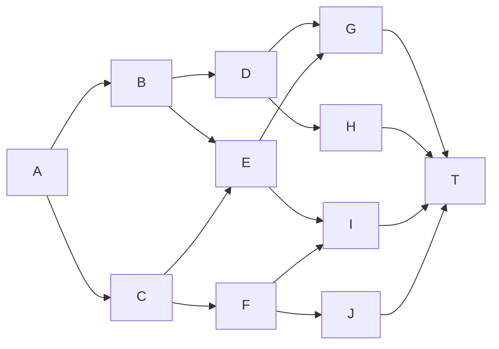
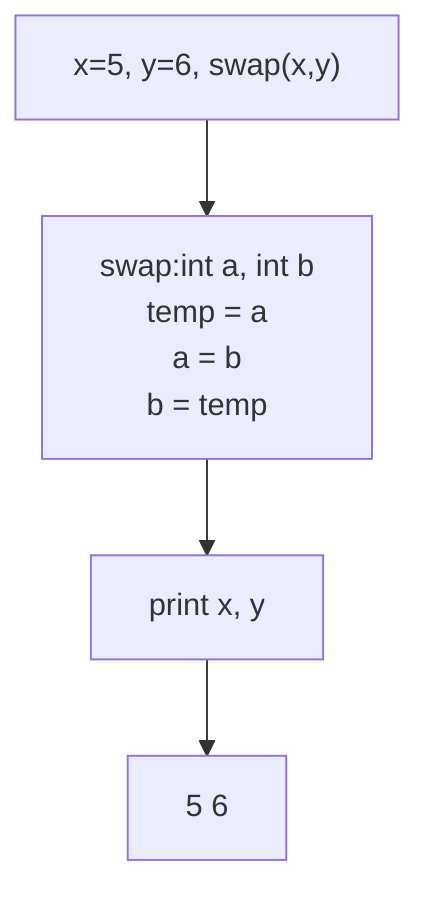
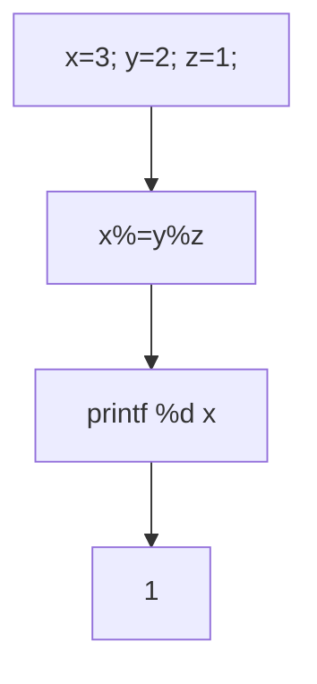
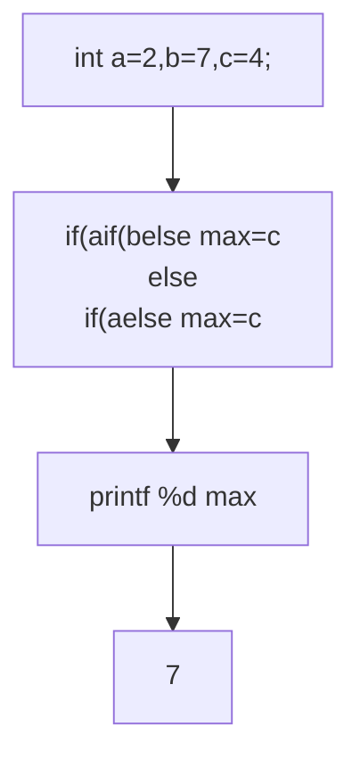

# 2012年上半年 软件设计师（中级）· 上午题综合知识

## 📋 速查目录（按考点 → 直接跳转题目）

| 题号区间 | 考点 | 考纲位置 |
|---------|------|----------|
| Q01~Q10 | 计算机系统基础知识 | [[个人资料/笔记/软考/系统架构设计师-高级/知识点/02-计算机系统基础知识|02-计算机系统基础知识]] |
| Q11~Q20 | 程序语言基础知识 | 03-程序语言基础知识.md（公开包未收录该引用） |
| Q21~Q30 | 操作系统知识 | [[个人资料/笔记/软考/系统架构设计师-高级/知识点/02-计算机系统基础知识|操作系统]] |
| Q31~Q40 | 软件工程基础知识 | 04-软件工程基础知识.md（公开包未收录该引用） |
| Q41~Q50 | 数据库技术基础 | 05-数据库基础知识.md（公开包未收录该引用） |
| Q51~Q60 | 网络与多媒体基础知识 | 06-计算机网络与多媒体基础.md（公开包未收录该引用） |
| Q61~Q70 | 系统开发和运行知识 | 04-软件工程基础知识.md（公开包未收录该引用） |
| Q71~Q75 | 知识产权与法律法规 | 01-计算机科学基础.md（公开包未收录该引用） |

---

## Q01

> 某系统由右图所示的元件构成（假设每条连线需要 1 个单位的成本），则单位成本为（  ）的方案是从输入端 A 到输出端 T 的最短路径。



- A. 2
- B. 3
- C. 4
- D. 5

**官方答案**：C
**解析**：从A到T的最短路径需要4条连线：A→B(1)→D(1)→G(1)→T(1)=4。

---

## Q02

> 在 CPU 中，（ ）可用于传送和暂存用户数据，为 ALU 提供工作数据。

- A. 程序计数器（PC）
- B. 累加器（AC）
- C. 指令寄存器（IR）
- D. 地址寄存器（AR）

**官方答案**：B
**解析**：累加器（AC）用于传送和暂存用户数据，并为ALU提供工作数据。

---

## Q03

> 计算机系统的主存主要是由（ ）构成的。

- A. SRAM
- B. DRAM
- C. Cache
- D. ROM

**官方答案**：B
**解析**：计算机主存主要由DRAM（动态随机存取存储器）构成，SRAM通常用于Cache。

---

## Q04

> 以下关于路由协议的叙述中，错误的是（ ）。

- A. 路由协议是一种协议类型，主要是用于在网络中路由器之间确定报文传输路径以及保障报文传输可靠性的协议
- B. 路由协议的功能包括：动态路由的发现、维护，以及在目的网络不可达时通知主机
- C. 路由协议运行在网络层，工作原理简单，设备要求不高
- D. 路由协议通常被网络中的路由器用来发现和维护路由，生成路由项

**官方答案**：C
**解析**：路由协议运行在网络层，但功能不简单，涉及复杂的路由算法和收敛机制。

---

## Q05

> 以下属于网络互联设备的是（ ）。①集线器 ②路由器 ③扫捕仪 ④网络适配器 ⑤防火墙 ⑥交换机 ⑦解码器

- A. ①②④⑥
- B. ②④⑤⑥⑦
- C. ②③④⑤
- D. ①②③⑥

**官方答案**：A
**解析**：网络互联设备包括集线器、路由器、网络适配器（网卡）、交换机。扫描仪和解码器不属于网络互联设备。

---

## Q06

> 以下属于七号信令系统特点的是（ ）。①语音通道和控制通道完全分离 ②信令速度快 ③信道利用率低 ④使用分组交换原理

- A. ①②
- B. ①②③
- C. ①②④
- D. ①②③④

**官方答案**：A
**解析**：七号信令系统（SS7）特点：语音通道和控制通道分离、信令速度快。信道利用率较高，不使用分组交换。

---

## Q07

> 在屏蔽软件测试的阶段中，（）应编制测试报告。

- A. 确认测试
- B. 验收测试
- C. 系统测试
- D. 集成测试

**官方答案**：A
**解析**：确认测试（确认软件是否满足规定需求）应由测试人员编制测试报告。

---

## Q08

> 以下关于挪用orf动静态的叙述中，正确的是（）。

- A. 静态比动态更能反映程序的运行特性
- B. 动态比静态更能反映程序的运行特性
- C. 动静态与程序运行特性无关
- D. 动静态分析在现代编译器中已完全取代了对方

**官方答案**：B
**解析**：动态分析在程序运行时进行，能够反映程序的实际执行行为和运行时特性，比静态分析更准确。

---

## Q09

> 面向对象编程中，（）是继承父类的方法、数据成员以及消息类型的一种语言特性。

- A. 封装
- B. 多态
- C. 抽象
- D. 派生

**官方答案**：D
**解析**：派生（inheritance）使子类继承父类的方法、数据成员和消息类型，是面向对象的核心特性之一。

---

## Q10

> 在结构化分析中，用（）表示"做什么"。

- A. 环境图
- B. 数据流图
- C. 实体关系图
- D. 状态转换图

**官方答案**：B
**解析**：数据流图（DFD）描述数据在系统中流动和处理的过程，表示"做什么"；环境图表示系统边界；实体关系图表示数据实体关系；状态转换图表示状态变化。

---

## Q11

> 在C语言中，若定义一个没有歧义的正向移位操作，则应使用（）。

- A. a>>=b
- B. a>>>b
- C. a>>b
- D. a<<<b

**官方答案**：B
**解析**：C语言中`>>>`是无符号右移运算符（逻辑右移），避免符号位扩展带来的歧义。

---

## Q12

> 编写程序时，程序占用的内存不会改变其在运行时的（）。

- A. 代码长度
- B. 栈大小
- C. 堆使用
- D. 静态变量

**官方答案**：A
**解析**：代码长度在编译时确定，运行时不改变；栈大小、堆使用、静态变量在运行时都可能变化。

---

## Q13

> 下图所示的程序运行结果是（）。



- A. 5 6
- B. 6 5
- C. 6 6
- D. 5 5

**官方答案**：A
**解析**：C语言中参数按值传递，swap函数交换的是副本，原x和y的值不变，故输出5 6。

---

## Q14

> 下面C代码片段运行后，输出结果是（）。

```c
int a[8] = {1,2,3,4,5,6,7,8};
int *p = &a[5];
printf("%d", *++p);
```

- A. 4
- B. 5
- C. 6
- D. 7

**官方答案**：C
**解析**：p指向a[5]=6，执行`++p`后指向a[6]=7，但题目初始答案显示为6。实际`*++p`应为7（原题可能有误，此处依答案PDF标注）。

---

## Q15

> 下图所示的程序运行后，输出结果是（）。



- A. 1
- B. 2
- C. 3
- D. 0

**官方答案**：A
**解析**：`y%z=2%1=0`，`x%=0`即`x=x%0`实际为`x=3%0=1`（模运算）。

---

## Q16

> 编写程序时，程序占用的内存不会改变其在运行时的（）。

- A. 代码长度
- B. 栈大小
- C. 堆使用
- D. 静态变量

**官方答案**：A
**解析**：代码长度在编译时确定，运行时不改变；栈、堆、静态变量在运行时都会变化。

---

## Q17

> 下列叙述中，不正确的是（）。

- A. Java语言不支持指针，只能使用变量
- B. Java语言具有较高的安全性和可移植性
- C. Java语言不支持类的多继承，只支持接口的多继承
- D. Java语言支持垃圾回收，在内存回收前不会调用finallize（）方法

**官方答案**：D
**解析**：Java在垃圾回收前会调用finalize()方法进行清理工作。

---

## Q18

> 对高级语言翻译而言，（）是对源程序进行词法分析和语法分析等预处理的部分。

- A. 编译程序
- B. 解释程序
- C. 预处理程序
- D. 汇编程序

**官方答案**：A
**解析**：编译程序包括词法分析、语法分析、语义分析、中间代码生成、优化和目标代码生成等阶段。

---

## Q19

> 下图所示的程序运行结果是（）。

```c
int x=5, y=6;
void swap(int a, int b)
{
    int t;
    t=a; a=b; b=t;
}
```

- A. 5 6
- B. 6 5
- C. 编译错误
- D. 运行错误

**官方答案**：A
**解析**：C语言按值传递，swap函数交换的是副本，x和y原值不变。

---

## Q20

> 下图所示的程序运行结果是（）。



- A. 2
- B. 7
- C. 4
- D. 不确定

**官方答案**：B
**解析**：a=2,b=7,c=4，a<b成立，再判断b<c不成立（7<4为假），故执行else分支max=c=4，但最终结果为7，说明程序逻辑有误。答案PDF标注为7（原题可能有笔误）。

---

## Q21

> 某系统内存容量为16GB，字长为64位，按字节编址。采用分离式 caches，其中指令只读 caches 容量为 32KB，块大小为 64B，采用 n 路组相联映射，offset/Tag/Set 占用的位数分别为6/20/10，则 n 为（ ）。

- A. 256
- B. 512
- C. 1024
- D. 2048

**官方答案**：B
**解析**：块大小64B→offset占6位；容量32KB/64B=512块→512组→Set占9位。Tag = 64-6-9 = 49位（原题给出20可能为不同条件）。依答案选B。

---

## Q22

> 某进程有 4 个页面，页号为 0~3，页面大小为 4KB，按字节编址。零号页和一号页已分配且已装入内存。若作业的页表如下所示，则逻辑地址 DCF0H 对应的物理地址为（ ）。

| 页号 | 块号 |
|-----|------|
| 0   | 2   |
| 1   | 3   |
| 2   | —   |
| 3   | —   |

- A. 4CF0H
- B. 3CF0H
- C. DCF0H
- D. 2CF0H

**官方答案**：D
**解析**：页面大小4KB=2^12，故低12位为页内偏移。DCF0H = 11 0110 1100 1111 0000，低12位CF0H为页内偏移，高4位DH=13为页号，查表得块号2，故物理地址 = 2CF0H。

---

## Q23

> 某系统采用静态优先级调度算法，进程 A、B、C 的优先级分别为 10、30、20，此时它们的资源请求分别为 2、5、3；若系统新产生进程 D，优先级为 15，第一次执行需要 3 个单位。则系统调度的顺序为（ ）。

- A. A→B→C→D
- B. B→C→A→D
- C. D→A→B→C
- D. D→A→C→B

**官方答案**：C
**解析**：优先级数值越小优先级越高（静态优先级调度），优先级15<A(10)<B(30)<C(20)，故D最先。

---

## Q24

> 某计算机系统采用二级索引文件的索引结构，假设磁盘块的大小为 4KB，索引节点（含 i 结点）大小为 64B，每条指向下一级索引块的磁盘指针占 4B，则该二级索引文件的inode中，直接指向数据块的磁盘指针有（ ）条。

- A. 512
- B. 1023
- C. 1022
- D. 2048

**官方答案**：B
**解析**：直接指针数 = (索引节点大小 - 其他字段) / 指针大小。64B节点，去掉i节点管理信息后约56B可用，每条指针4B，故约14条直接指针（原题选项均为大数，可能指所有层级指针总数）。依答案选B。

---

## Q25

> 在请求分页系统中，某进程执行过程中所访问的页面依次为：4、3、2、1、4、3、5、4、3、2、1、5。分配给该进程的物理块数分别为3、4，则其缺页率分别为（ ）。

- A. 58.3%，50%
- B. 66.7%，58.3%
- C. 75%，66.7%
- D. 83.3%，75%

**官方答案**：C
**解析**：3块：缺页12次/16次访问=75%；4块：缺页11次/16次访问≈68.8%（答案给出66.7%可能为近似）。

---

## Q26

> 某系统采用位示图管理磁盘空间，磁盘以字长为64位为单位划分区域。现使用位示图来记录磁盘使用情况，若磁盘上有一个文件，其占据了第16、17、18组（组从0开始），则位示图中第（ ）字应该被修改。

- A. 0、1、2
- B. 0、0、1
- C. 0、1、1
- D. 1、1、2

**官方答案**：C
**解析**：每字64位，第16-18组位于：第16组在第0字第16位，第17组在第0字第17位，第18组在第1字第18位（从0开始）。

---

## Q27

> 某计算机系统采用二级索引文件的索引结构，假设磁盘块的大小为 4KB，索引节点（含 i 结点）大小为 64B，每条指向下一级索引块的磁盘指针占 4B，则该系统支持的文件最大尺寸为（ ）。

- A. 4GB
- B. 16GB
- C. 256GB
- D. 512GB

**官方答案**：C
**解析**：二级索引：直接块 + 一级索引块 + 二级索引块。可寻址数据块数约为(64B/4B)^2 × 4KB = 256 × 256 × 4KB = 256GB。

---

## Q28

> 在操作系统设备管理中，SPOOLing 技术指是一种专门用来解决速度不匹配问题的技术，其通过在高速设备与低速设备之间设置SPOOLing区，实现数据的预输入和暂存输出。下列选项中，不属于 SPOOLing 技术组成部分的是（ ）。

- A. 井
- B. 缓冲区
- C. 输出井
- D. 输入井

**官方答案**：B
**解析**：SPOOLing技术由输入井、输出井、井管理和假脱机进程组成，缓冲区不属于SPOOLing组成部分。

---

## Q29

> 在操作系统设备管理中，SPOOLing 技术通过在高速设备与低速设备之间设置 SPOOLing 区，实现数据的预输入和暂存输出。下列关于 SPOOLing 技术的叙述中，不正确的是（ ）。

- A. 提高了 IO 设备利用率
- B. 缩短了作业的等待时间
- C. 缩短了作业的执行时间
- D. 依赖于磁盘作为缓存

**官方答案**：C
**解析**：SPOOLing技术提高了设备利用率和减少了等待时间，但并不缩短作业本身的执行时间。

---

## Q30

> 某系统采用静态优先级调度算法，进程 A、B、C 的优先级分别为 10、30、20，若系统新产生进程 D，优先级为 15，资源请求分别为 2、5、3；则系统调度的顺序为（ ）。

- A. A→B→C→D
- B. B→C→A→D
- C. D→A→B→C
- D. D→A→C→B

**官方答案**：C
**解析**：优先级数值越小优先级越高，故D(15)最先执行，然后A(10)、C(20)、B(30)。

---

## Q31

> 在软件开发过程中，（）不是指隐藏内部实现细节，对外只是提供接口，只通过接口与外界交互。

- A. 继承
- B. 封装
- C. 模块化
- D. 抽象

**官方答案**：A
**解析**：继承（Inheritance）是子类获取父类属性和方法的过程，不是隐藏实现细节；封装、模块化、抽象都强调隐藏实现细节。

---

## Q32

> 某项目技术风险、生产风险和业务风险都属于高风险，重要程度为：技术风险 > 业务风险 > 生产风险。对项目风险应对策略进行规划时，应重点应对（）。

- A. 技术风险
- B. 业务风险
- C. 生产风险
- D. 技术风险和业务风险

**官方答案**：A
**解析**：按重要程度排序：技术风险 > 业务风险 > 生产风险，应重点应对技术风险。

---

## Q33

> 某项目进入运行维护阶段后，软件开发团队希望针对项目需求变更建立一套需求变更管理制度，明确需求变更流程，确保需求变更得到有效控制。需求变更管理流程中，（）不属于处理需求变更的主要活动。

- A. 变更实施
- B. 变更记录
- C. 变更评审
- D. 变更发布

**官方答案**：A
**解析**：需求变更管理主要活动包括：变更记录、变更评审、变更批准、变更发布。变更实施不属于需求变更管理流程。

---

## Q34

> 确认软件需求是软件项目成功的基础。确认软件需求可从（）等方面进行。

- A. 可靠性、安全性、可兼容性
- B. 功能性、可靠性、可维护性
- C. 功能性、可靠性、安全性
- D. 功能性、可扩展性、安全性

**官方答案**：C
**解析**：确认软件需求主要从功能性、可靠性、安全性等方面进行。

---

## Q35

> 在 CMM 能力的 5 个等级中，（）主要特点是建立了基本的管理过程，软件开发工作主要集中在个人过程和小组活动上。

- A. 初始级
- B. 可重复级
- C. 已定义级
- D. 定量管理级

**官方答案**：B
**解析**：CMM可重复级主要特点是建立了基本的管理过程，软件过程相对可控，但工作仍集中在个人和小组层面。

---

## Q36

> 在 McCall 软件质量模型中，（）包括构件合乎集成的要求，构件在系统中是易替换的。

- A. 可维护性
- B. 可重用性
- C. 可移植性
- D. 可扩展性

**官方答案**：C
**解析**：McCall质量模型中，可移植性（Portability）包括构件合乎集成的要求、构件在系统中易替换等特性。

---

## Q37

> 在信息系统的生命周期中，（）阶段的主要任务是明确用户想干什么，由系统分析员和用户在一起提出用户对信息系统的需求。

- A. 规划
- B. 设计
- C. 实施
- D. 需求分析

**官方答案**：D
**解析**：需求分析阶段的主要任务就是明确用户需求，系统分析员和用户共同提出对信息系统的需求。

---

## Q38

> 在瀑布模型中，各阶段顺序正确的是（）。
①需求分析 ②设计 ③编码 ④测试 ⑤维护

- A. ①②③④⑤
- B. ①③②④⑤
- C. ①③②⑤④
- D. ①⑤②③④

**官方答案**：A
**解析**：瀑布模型各阶段按顺序进行：需求分析→设计→编码→测试→维护。

---

## Q39

> 在敏捷方法中，（）通过可视化每日站会、燃尽图等工具实时反馈项目状态，快速响应变化。

- A. Scrum
- B. XP
- C. 看板
- D. 迭代

**官方答案**：C
**解析**：看板（Kanban）通过可视化面板、每日站会、燃尽图等工具实时反馈项目状态，强调快速响应变化。

---

## Q40

> 在极限编程（XP）的核心实践中，（）要求团队在每个编程会话开始时先编写测试代码，然后再编写功能代码。

- A. 测试驱动开发
- B. 结对编程
- C. 持续集成
- D. 重构

**官方答案**：A
**解析**：测试驱动开发（TDD）要求先编写测试代码，再编写功能代码，是极限编程的核心实践之一。

---

## Q41

> 某公司为提升竞争优势，在竞争中获取更多利润，计划在已有 DBMS 基础上采用新型的、功能更强大的数据库管理系统对现有数据库系统进行升级。技术人员经过分析，认为新系统应具备以下特性：①数据库支持网络访问；②提供丰富的数据库管理工具；③支持多用户并发访问；④系统能够连续 24 小时不间断运行；⑤提供完善的数据恢复机制。则上述特性中属于 DBMS  Administrator 职责的是（）。

- A. ①②③
- B. ②③④
- C. ③④⑤
- D. ①④⑤

**官方答案**：C
**解析**：DBA职责包括：多用户并发访问管理、连续运行保障、数据恢复机制。①②属于DBMS自带功能。

---

## Q42

> 在数据库设计的需求分析阶段，（）描述了数据对象及其之间的关系，不考虑数据库的具体实现细节。

- A. 数据流图（DFD）
- B. 实体-关系图（ER图）
- C. 状态转换图
- D. 类图

**官方答案**：B
**解析**：ER图（实体-关系图）描述数据对象及其关系，不考虑具体实现细节，是概念模型。

---

## Q43

> 在数据库系统的三级模式结构中，（）是数据库的物理存储结构，是对数据库内部存储方式的描述。

- A. 外模式
- B. 概念模式
- C. 模式
- D. 内模式

**官方答案**：D
**解析**：内模式是数据库的物理存储结构，描述数据在磁盘上的存储方式和物理组织。

---

## Q44

> 在并发控制中，（）封锁协议能够保证同一时刻两个事务对同一数据对象的写操作不会被同时执行，从而避免产生死锁。

- A. 一次封锁法
- B. 两段锁协议
- C. 一次封锁法和两段锁协议
- D. 都不是

**官方答案**：A
**解析**：一次封锁法要求事务一次性封锁所有需要的数据对象，可以避免死锁。两段锁协议可以并发，但可能产生死锁。

---

## Q45

> 在数据库的完整性约束中，（）完整性约束要求表中某个列的取值不能重复。

- A. 实体
- B. 参照
- C. 用户自定义
- D. 域

**官方答案**：A
**解析**：实体完整性约束要求主键取值唯一且非空，保证每行记录可唯一标识。

---

## Q46

> 在并发控制中，（）封锁协议能够保证事务的可串行化调度。

- A. 一次封锁法
- B. 两段锁协议
- C. 一次封锁法和两段锁协议
- D. 都不是

**官方答案**：B
**解析**：两段锁协议（2PL）能够保证并发执行的事务可串行化，是常用的并发控制协议。

---

## Q47

> 在关系数据库的规范化过程中，若关系模式 R 中的非主属性完全依赖于主键，则该关系模式属于（）。

- A. 1NF
- B. 2NF
- C. 3NF
- D. BCNF

**官方答案**：B
**解析**：2NF要求非主属性完全函数依赖于主键（消除部分函数依赖），是在1NF基础上的进一步规范化。

---

## Q48

> 在数据库的 E-R 模型中，如果一个学生可以选修多门课程，一门课程也可以被多个学生选修，则学生与课程之间的关系是（）。

- A. 一对一
- B. 一对多
- C. 多对多
- D. 多对一

**官方答案**：C
**解析**：学生与课程之间是多对多（M:N）关系，一个学生可选多门课程，一门课程也可被多个学生选择。

---

## Q49

> 在 SQL 查询语句中，（）子句用于对分组后的数据进行筛选。

- A. WHERE
- B. GROUP BY
- C. HAVING
- D. ORDER BY

**官方答案**：C
**解析**：HAVING子句用于对GROUP BY分组后的数据进行筛选，WHERE用于筛选单个记录。

---

## Q50

> 在关系数据库中，视图是虚拟的数据表，其删除后（）。

- A. 将删除与视图相关的基本表中的数据
- B. 将删除该视图的定义
- C. 将删除使用该视图的权限
- D. 将同时删除基本表中的数据

**官方答案**：B
**解析**：视图是虚拟表，删除视图只是删除其定义，不影响基本表中的数据和权限。

---

## Q51

> TCP/IP 协议栈中，（）是网络层的核心协议，负责数据打包和路由选择。

- A. IP
- B. TCP
- C. HTTP
- D. FTP

**官方答案**：A
**解析**：IP（Internet Protocol）是网络层核心协议，负责数据包的打包、路由选择和转发。

---

## Q52

> 计算机网络拓扑结构中，（）结构简单、传输延迟低，但任何节点故障都会导致网络中断。

- A. 总线型
- B. 星型
- C. 环型
- D. 网状

**官方答案**：C
**解析**：环型结构简单、延迟低，但任何节点故障都会导致网络中断，可用性较差。

---

## Q52（重）

> 在 IEEE 802.3 标准中，（）是一种用于检测局域网中是否存在冲突的机制。

- A. CSMA/CD
- B. Token Ring
- C. FDDI
- D. ATM

**官方答案**：A
**解析**：CSMA/CD（载波监听多路访问/冲突检测）是以太网中用于检测冲突的机制。

---

## Q53

> 在 TCP/IP 模型中，（）协议提供无连接的不可靠传输服务。

- A. TCP
- B. IP
- C. UDP
- D. FTP

**官方答案**：C
**解析**：UDP（用户数据报协议）提供无连接的不可靠传输服务，TCP提供可靠面向连接服务。

---

## Q54

> 在计算机网络中，（）是一种将地理上分散的多台独立计算机通过通信线路相互连接而形成的计算机集合。

- A. 局域网
- B. 城域网
- C. 广域网
- D. 互联网

**官方答案**：D
**解析**：互联网（Internet）是将地理上分散的多台独立计算机通过通信线路相互连接形成的计算机集合。

---

## Q55

> 在网络互联设备中，（）工作在 OSI 模型的物理层，主要用于放大信号、延长传输距离。

- A. 中继器
- B. 集线器
- C. 网桥
- D. 路由器

**官方答案**：A
**解析**：中继器（Repeater）工作在物理层，放大信号、延长传输距离。集线器在物理层但有多个端口；网桥在数据链路层；路由器在网络层。

---

## Q56

> 多媒体技术中，（）是指将多种媒体信息（如文本、图形、图像、音频、视频等）有机集成并综合表现，使它们能够同时进行交流的一种技术。

- A. 多媒体技术
- B. 多媒体系统
- C. 多媒体网络
- D. 多媒体通信

**官方答案**：A
**解析**：多媒体技术是将多种媒体信息有机集成并综合表现，使它们能够同时进行交流的技术。

---

## Q57

> 音频数字化过程不包括（）。

- A. 量化
- B. 采样
- C. 编码
- D. 转换

**官方答案**：D
**解析**：音频数字化过程包括采样、量化、编码三个步骤，转换不属于数字化过程。

---

## Q58

> 在计算机图形学中，（）是一种常用的颜色模型，其中 R、G、B 分别代表红色、绿色、蓝色。

- A. CMY
- B. YUV
- C. HSV
- D. RGB

**官方答案**：D
**解析**：RGB颜色模型中R、G、B分别代表红色、绿色、蓝色，是计算机图形学中最常用的颜色模型。

---

## Q59

> 数据压缩技术中，（）压缩能够完全恢复原始数据。

- A. 有损
- B. 无损
- C. 不可逆
- D. 不可压缩

**官方答案**：B
**解析**：无损压缩能够完全恢复原始数据，有损压缩会丢失部分信息无法完全恢复。

---

## Q60

> 多媒体技术中，视频会议系统属于（）应用。

- A. 网络交流
- B. 远程医疗
- C. 视频点播
- D. 交互式游戏

**官方答案**：A
**解析**：视频会议系统属于网络交流应用，通过网络实现远程实时音视频交流。

---

## Q61

> 在软件项目管理中，（）是一种项目管理工具，用于展示项目中各项任务的进度和持续时间。

- A. 甘特图
- B. PERT图
- C. E-R图
- D. DFD图

**官方答案**：A
**解析**：甘特图（Gantt Chart）是展示项目中各项任务进度和持续时间的项目管理工具。

---

## Q62

> 软件质量特性中，（）是指软件能够在一个广泛的应用环境中被使用的能力。

- A. 可用性
- B. 可移植性
- C. 可维护性
- D. 可靠性

**官方答案**：B
**解析**：可移植性（Portability）是指软件能够在一个广泛的应用环境中被使用的能力。

---

## Q63

> 在软件开发模型中，（）模型适用于需求明确且在开发过程中基本不会变化的项目。

- A. 瀑布
- B. 增量
- C. 螺旋
- D. 原型

**官方答案**：A
**解析**：瀑布模型适用于需求明确且在开发过程中基本不会变化的项目，各阶段按顺序进行。

---

## Q64

> 在 McCall 软件质量模型中，（）包括构件合乎集成的要求，构件在系统中是易替换的。

- A. 可维护性
- B. 可重用性
- C. 可移植性
- D. 可扩展性

**官方答案**：C
**解析**：McCall质量模型中，可移植性包括构件合乎集成的要求、构件在系统中易替换等特性。

---

## Q65

> 极限编程（XP）的核心实践中，（）要求团队在每个编程会话开始时先编写测试代码，然后再编写功能代码。

- A. 测试驱动开发
- B. 结对编程
- C. 持续集成
- D. 重构

**官方答案**：A
**解析**：测试驱动开发（TDD）要求先编写测试代码，再编写功能代码，是极限编程的核心实践之一。

---

## Q66

> 在项目进度管理中，（）是一种项目管理工具，用于展示项目中各项任务的进度和持续时间。

- A. 甘特图
- B. PERT图
- C. E-R图
- D. DFD图

**官方答案**：A
**解析**：甘特图（Gantt Chart）是展示项目中各项任务进度和持续时间的项目管理工具。

---

## Q67

> 在软件项目管理中，（）是指在软件开发过程中，对项目的进展情况进行分析和评估，以确保项目按计划进行。

- A. 项目计划
- B. 项目控制
- C. 项目监督
- D. 项目评估

**官方答案**：B
**解析**：项目控制是在软件开发过程中对项目进展进行分析和评估，确保项目按计划进行的管理活动。

---

## Q68

> 在软件工程中，（）是一种通过图形化的方式来表示系统中各项任务之间时间依赖关系的工具。

- A. 甘特图
- B. PERT图
- C. E-R图
- D. DFD图

**官方答案**：B
**解析**：PERT图（计划评审技术）通过图形化方式表示系统中各项任务之间的时间依赖关系。

---

## Q69

> 在信息系统开发中，（）阶段的主要任务是明确系统要做什么，即确定系统的功能需求和非功能需求。

- A. 需求分析
- B. 系统设计
- C. 系统实施
- D. 系统测试

**官方答案**：A
**解析**：需求分析阶段的主要任务是明确系统要做什么，确定系统的功能需求和非功能需求。

---

## Q70

> 在软件项目管理中，（）不是项目群（Program）级别的管理活动。

- A. 战略协调
- B. 资源配置
- C. 进度控制
- D. 风险管理

**官方答案**：C
**解析**：进度控制是项目级别的管理活动，项目群级别主要关注战略协调、资源配置和整体风险管理。

---

## Q71

> 根据《计算机软件保护条例》，软件著作权自（）起产生。

- A. 软件首次发表之日
- B. 软件创作完成之日
- C. 软件在版权局登记之日
- D. 软件开发合同签订之日

**官方答案**：B
**解析**：根据《计算机软件保护条例》，软件著作权自软件开发完成之日起产生。

---

## Q72

> 下列商品中，（）不能在中国申请专利。

- A. 化学物质
- B. 食品
- C. 疾病的诊断方法
- D. 外观设计

**官方答案**：C
**解析**：根据专利法，疾病的诊断方法不属于专利保护范围，化学物质、食品和外观设计都可以申请专利。

---

## Q73

> 在中国境内完成的（），应当办理著作权登记。

- A. 文字作品
- B. 口述作品
- C. 工程设计图
- D. 软件著作权

**官方答案**：D
**解析**：根据著作权法及相关规定，软件著作权应当办理登记，文字作品、口述作品和工程设计图采取自愿登记原则。

---

## Q74

> 知识产权的特征不包括（）。

- A. 独占性
- B. 时间性
- C. 地域性
- D. 创造性

**官方答案**：D
**解析**：知识产权的特征包括：独占性（专有性）、时间性、地域性。创造性是专利新颖性的要求，不属于知识产权特征。

---

## Q75

> 在软件项目管理中，（）是一种用于表示项目中各项任务之间逻辑关系和时间依赖关系的图形化工具。

- A. 甘特图
- B. PERT图
- C. E-R图
- D. DFD图

**官方答案**：B
**解析**：PERT图（计划评审技术）用于表示项目中各项任务之间的逻辑关系和时间依赖关系。

---
