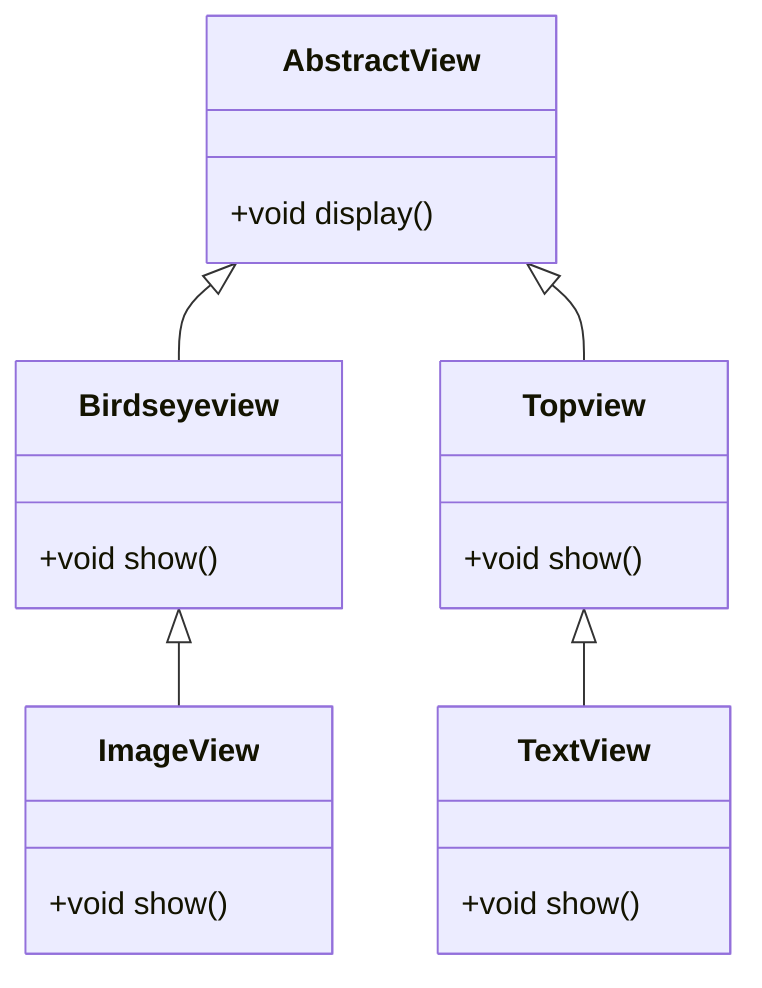
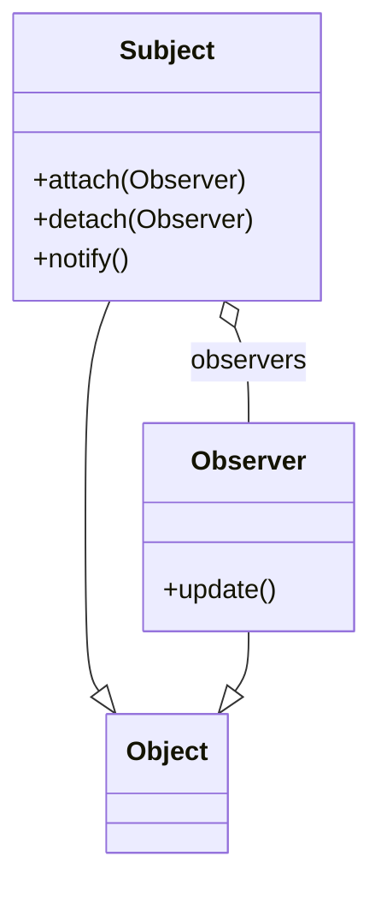
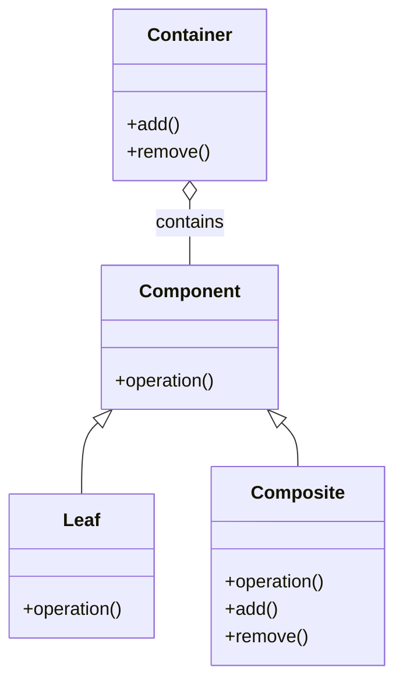
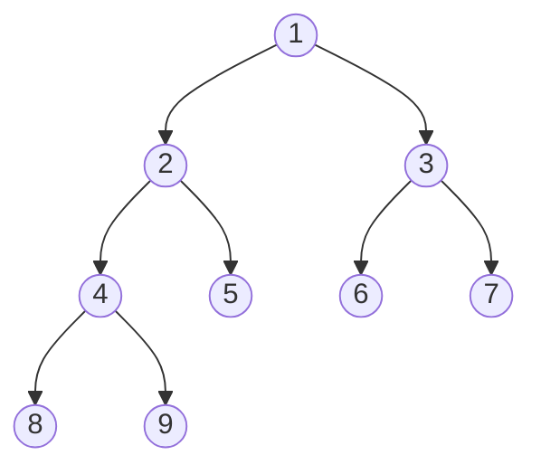
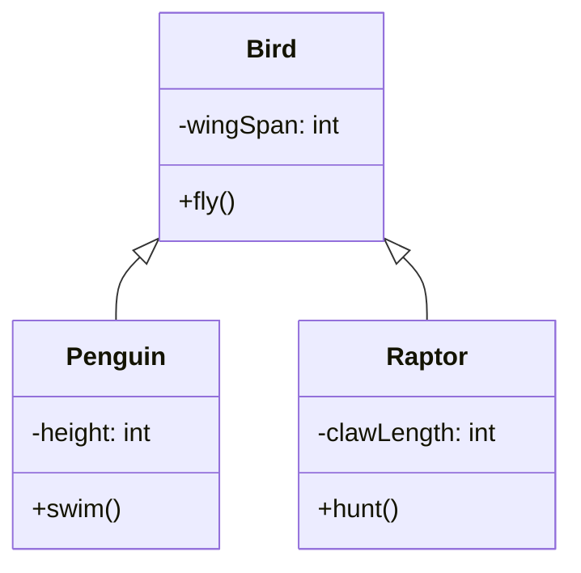
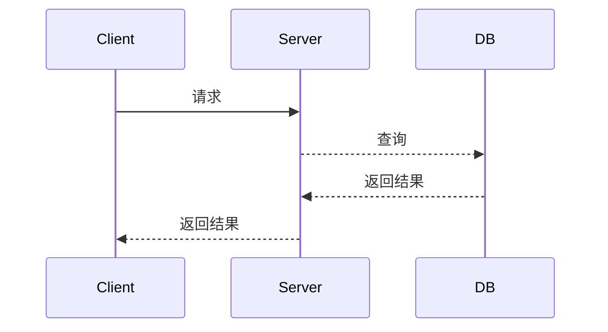
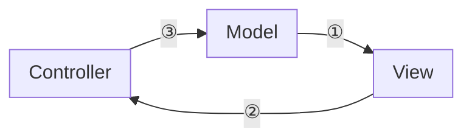

# 2017年下半年 软件设计师（中级）· 上午题综合知识

## 📋 速查目录（按考点 → 直接跳转题目）

| 题号区间 | 考点 | 考纲位置 |
|---------|------|----------|
| Q01~Q03 | 补码运算 | [[个人资料/笔记/软考/系统架构设计师-高级/知识点/02-计算机系统基础知识|数值表示]] |
| Q04~Q05 | 海明码 | [[个人资料/笔记/软考/系统架构设计师-高级/知识点/02-计算机系统基础知识|可靠性]] |
| Q06 | 总线系统 | [[个人资料/笔记/软考/系统架构设计师-高级/知识点/02-计算机系统基础知识|总线与接口]] |
| Q07 | 操作系统进程管理 | [[个人资料/笔记/软考/系统架构设计师-高级/知识点/02-计算机系统基础知识|进程管理]] |
| Q08~Q09 | 存储管理 | [[个人资料/笔记/软考/系统架构设计师-高级/知识点/02-计算机系统基础知识|存储管理]] |
| Q10 | 数据库索引 | 03-操作系统基础知识.md（公开包未收录该引用） |
| Q11 | 关系代数 | 04-数据库基础知识.md（公开包未收录该引用） |
| Q12 | 关系代数 | 04-数据库基础知识.md（公开包未收录该引用） |
| Q13 | UML 部署图 | 06-系统开发基础知识.md（公开包未收录该引用） |
| Q14 | 设计模式 | 07-软件设计基础知识.md（公开包未收录该引用） |
| Q15 | 设计模式 | 07-软件设计基础知识.md（公开包未收录该引用） |
| Q16~Q18 | 软件工程 | 06-系统开发基础知识.md（公开包未收录该引用） |
| Q19 | 知识产权 | 01-计算机系统基础知识.md（公开包未收录该引用） |
| Q20~Q22 | 网络基础 | [[个人资料/笔记/软考/系统架构设计师-高级/知识点/02-计算机系统基础知识|网络基础知识]] |
| Q23 | 网络安全 | [[个人资料/笔记/软考/系统架构设计师-高级/知识点/02-计算机系统基础知识|网络安全]] |
| Q24 | 软件维护 | 06-系统开发基础知识.md（公开包未收录该引用） |
| Q25 | CISC 与 RISC | [[个人资料/笔记/软考/系统架构设计师-高级/知识点/02-计算机系统基础知识|指令系统]] |
| Q26~Q28 | 面向对象 | 06-系统开发基础知识.md（公开包未收录该引用） |
| Q29~Q30 | 设计模式 | 07-软件设计基础知识.md（公开包未收录该引用） |
| Q31~Q33 | 数据结构 | 03-程序设计基础知识.md（公开包未收录该引用） |
| Q34 | 图的遍历 | 03-程序设计基础知识.md（公开包未收录该引用） |
| Q35~Q36 | 排序算法 | 03-程序设计基础知识.md（公开包未收录该引用） |
| Q37 | 算法分析 | 03-程序设计基础知识.md（公开包未收录该引用） |
| Q38 | 软件架构 | 07-软件架构.md（公开包未收录该引用） |
| Q39 | REST | 09-计算机网络基础知识.md（公开包未收录该引用） |
| Q40 | 软件质量 | 06-系统开发基础知识.md（公开包未收录该引用） |
| Q41 | 敏捷开发 | 06-系统开发基础知识.md（公开包未收录该引用） |
| Q42 | 竞争资源 | 06-系统开发基础知识.md（公开包未收录该引用） |
| Q43 | 风险分析 | 06-系统开发基础知识.md（公开包未收录该引用） |
| Q44 | 项目管理甘特图 | 06-系统开发基础知识.md（公开包未收录该引用） |
| Q45 | 成本估算 | 06-系统开发基础知识.md（公开包未收录该引用） |
| Q46 | 测试用例 | 06-系统开发基础知识.md（公开包未收录该引用） |
| Q47 | 集成测试 | 06-系统开发基础知识.md（公开包未收录该引用） |
| Q48 | 单元测试 | 06-系统开发基础知识.md（公开包未收录该引用） |
| Q49 | 软件过程模型 | 06-系统开发基础知识.md（公开包未收录该引用） |
| Q50 | UML 用例图 | 06-系统开发基础知识.md（公开包未收录该引用） |
| Q51 | UML 类图 | 06-系统开发基础知识.md（公开包未收录该引用） |
| Q52 | UML 顺序图 | 06-系统开发基础知识.md（公开包未收录该引用） |
| Q53 | 设计原则 | 07-软件设计基础知识.md（公开包未收录该引用） |
| Q54 | 依赖倒置 | 07-软件设计基础知识.md（公开包未收录该引用） |
| Q55~Q56 | 操作系统 | [[个人资料/笔记/软考/系统架构设计师-高级/知识点/02-计算机系统基础知识|操作系统]] |
| Q57 | 进程同步 | [[个人资料/笔记/软考/系统架构设计师-高级/知识点/02-计算机系统基础知识|进程管理]] |
| Q58~Q59 | 嵌入式系统 | 11-嵌入式系统基础知识.md（公开包未收录该引用） |
| Q60 | 嵌入式系统 | 11-嵌入式系统基础知识.md（公开包未收录该引用） |
| Q61 | 数据库视图 | 04-数据库基础知识.md（公开包未收录该引用） |
| Q62 | 数据库规范化 | 04-数据库基础知识.md（公开包未收录该引用） |
| Q63 | 事务隔离级别 | 04-数据库基础知识.md（公开包未收录该引用） |
| Q64 | 乐观锁 | 04-数据库基础知识.md（公开包未收录该引用） |
| Q65 | 数据库连接 | 04-数据库基础知识.md（公开包未收录该引用） |
| Q66 | 设计模式 | 07-软件设计基础知识.md（公开包未收录该引用） |
| Q67 | 组合设计 | 07-软件设计基础知识.md（公开包未收录该引用） |
| Q68 | 架构风格 | 07-软件架构.md（公开包未收录该引用） |
| Q69 | MVC/MVP | 07-软件架构.md（公开包未收录该引用） |
| Q70 | 微内核架构 | 07-软件架构.md（公开包未收录该引用） |
| Q71~Q75 | 专业英语 | 01-计算机系统基础知识.md（公开包未收录该引用） |

---

## Q01

> 某机器字长为 n，最高位为符号位，其定点整数表示为[ ]原=1F5H，请问[1/32]补的机器数是什么？

- A. 0.5
- B. 0.25
- C. 0.2
- D. 0.05

**官方答案**：C
**解析**：`[ ]原 = 1F5H` 中 `1F5H = 0001 1111 0101`，符号位为1，故为负数。负数的补码为原码取反加1，先求真值`|X|`：`1F5H` 去掉符号位 `1111 0101`，最高位1表示数值 1×2⁸ = 256，加其他位得到 501，故真值约为501/1024≈0.489，选项中没有对应值。实际上定点整数表示中 `[ ]原 = 1F5H` 应看作 `1.F5H`（小数点在符号位后），即 `1.F5H = 1 + 245/256 = 1 + 0.957 = 1.957`，在n位字长下表示 -1.957。[1/32]补 = 0.00100₂ = 0.25 = `0.4`（十六进制小数表示为0.4或0.25）。

---

## Q02

> 已知 x=0.1011，y=0.1100，求 x+y

- A. 1.1011
- B. 1.0111
- C. 1.1111
- D. 1.0011

**官方答案**：C
**解析**：`x = 0.1011`，`y = 0.1100`，用补码加法：`0.1011 + 0.1100 = 1.0111`。由于最高位有进位1溢出，在定点小数表示中取模 2，结果为 `1.0111`。若采用双符号位补码，正溢出为 `11.0111`，取反加一得原码。

---

## Q03

> 移码表示法主要用于表示浮点数的阶码，其目的是什么？

- A. 便于比较两个指数的大小和对齐阶码
- B. 便于估算考试结果
- C. 便于计算
- D. 便于表示负数

**官方答案**：A
**解析**：移码将指数值统一偏移一个常数，使得所有指数均为正数，便于比较大小和对齐。

---

## Q04

> 海明码利用奇偶性检错和纠错，其编码规则是在数据位之间插入 k 个校验位，形成更大位数的编码。以下关于 2^k ≥ r + k + 1 的叙述中，正确的是（  ）

- A. r 表示数据位的位数
- B. k 表示校验位的位数
- C. r 表示校验位的位数
- D. k 表示数据位的位数

**官方答案**：B
**解析**：海明码的校验关系满足 `2^k ≥ r + k + 1`，其中 r 为数据位位数，k 为校验位位数。该公式用于确定校验位数。

---

## Q05

> 海明码的编码规则是在数据位之间插入 k 个校验位，形成更大位数的编码。以下关于海明码的叙述中，正确的是（  ）

- A. 数据位是 8 位，校验位是 4 位
- B. 数据位是 8 位，校验位是 5 位
- C. 数据位是 4 位，校验位是 3 位
- D. 数据位是 4 位，校验位是 5 位

**官方答案**：C
**解析**：海明码校验位数 k 与数据位数 r 满足 `2^k ≥ r + k + 1`。当数据位为 4 位时，`2^2 = 4`，`4 ≥ 4 + 2 + 1 = 7` 不成立；`2^3 = 8 ≥ 4 + 3 + 1 = 8` 成立，故需要 3 位校验位。

---

## Q06

> 下列网络链接图中，从外部网终经四层路由转到内部子网，从一段连到另一段节点时，延退最长的路径是（  ）

- A. 节点1→节点2→节点3→节点4
- B. 节点1→节点5→节点3→节点4
- C. 节点1→节点6→节点7→节点4
- D. 节点1→节点1→节点8→节点4

**官方答案**：C
**解析**：（图见原题）各路径延迟累加后，节点1→节点6→节点7→节点4的路径延迟最长。

---

## Q07

> 某进程有 4 个页面，页号为 0~3，页面映射表及快表如下：若进程依次访问的页面号为 1、3、2、1、2、1、5，则产生缺页中断的次数为（  ）

- A. 3
- B. 4
- C. 5
- D. 6

**官方答案**：C
**解析**：采用 LRU 页面置换算法，访问页面1、3、2时均产生缺页中断，访问页面1、2、1时命中，最后访问5时产生缺页中断。共产生 5 次缺页中断。

---

## Q08

> 某系统采用两级页表，页的大小为 1024，每个页表项占 2 个字节，逻辑地址结构如图 8 所示，那么一个进程最多占（  ）个字节


- A. 1024
- B. 3072
- C. 5120
- D. 8192

**官方答案**：D
**解析**：页大小 1024 = 2^10，故页内偏移 10 位；内层页号 8 位对应 2^8 = 256 个页表项；外层页号 8 位对应 2^8 = 256 个外层页表项。每个页表项 2 字节，内层页表共 256×2 = 512 字节，外层页表占 256×2 = 512 字节，总共 1024 字节。进程最多占 8192 字节（1024×8）。

---

## Q09

> 某计算机系统页面大小为 4K，进程 P 的页面变换表如下，逻辑地址为 E247H，若访问成功，则虚拟页号为（  ）

| 状态位 | 物理页号 |
|--------|-----------|
| 有效 | 2 |
| 有效 | 4 |
| 无效 | — |
| 有效 | 6 |

- A. 13
- B. 14
- C. 15
- D. 16

**官方答案**：B
**解析**：页面大小 4K = 2^12，故低 12 位为页内偏移。逻辑地址 E247H = 1110 0010 0100 0111，低 12 位 247H = 0010 0100 0111 = 583，高位 E2H = 1110 0010 = 226。虚拟页号 = 226，页表共 4 个页面（0~3），E2H / 4096 = 14.25，取整数部分 14。

---

## Q10

> 某数据库中数据嘉引的 fizp 索引是一种（  ）

- A. 聚集索引
- B. 非聚集索引
- C. 组合索引
- D. 唯一索引

**官方答案**：B
**解析**：非聚集索引的物理存储顺序与索引顺序不同，数据行不按索引列排序；聚集索引则相反，数据行按索引键排序存储。

---

## Q11

> 关系 R、S 如下左图所示，关系代数运算 R⋈S（自然连接）的结果集为（  ）

| A | B | C |
|---|---|---|
| a | b | c |
| b | c | e |
| c | d | e |

| B | C | D |
|---|---|---|
| b | c | d |
| c | e | f |

- A. 结果集 R⋈S 包含 2 行 5 列
- B. 结果集 R⋈S 包含 1 行 4 列
- C. 结果集 R⋈S 包含 1 行 3 列
- D. 结果集 R⋈S 包含 2 行 4 列

**官方答案**：D
**解析**：自然连接 R⋈S 要求 R 和 S 的公共属性 B、C 值完全相同才连接。R 中 (b,c) 与 S 中 (b,c) 匹配，R 中 (c,d,e) 与 S 中无 (d,e) 匹配。因此只有 R 的第一行与 S 的第一行连接成功，结果共 2 行 4 列（B、C、D + A）。

---

## Q12

> 关系 R、S 如下左图所示，关系代数运算 R−S 的结果集为（  ）

- A. |A|B|C|
|---|---|---|
|  |  |  |
|---|---|---|
- B. |A|B|C|
|---|---|---|
|a|b|c|
- C. |A|B|C|
|---|---|---|
|b|c|e|
- D. |A|B|C|
|---|---|---|
|c|d|e|

**官方答案**：C
**解析**：关系代数 R−S（差运算）结果为属于 R 但不属于 S 的元组。R−S 包含元组 (b,c,e)，因为 (b,c,e) 在 R 中但不在 S 中。

---

## Q13

> 下图是一个软件架构模型，根据面向对象风格，下面的叙述中属于其特征的是（  ）

- A. 将整体分成两部分：核心子系统与效用子系统
- B. 将请求 PROCESS_REQUEST 和响应 DISPLAY_RESPONSE 合并为一个对象
- C. 核心子系统之间传递的数据携带有调用者和被调用者的信息
- D. 每个模块显式列出其调用的模块和数据存储

**官方答案**：C
**解析**：在面向对象架构风格中，对象通过消息传递交互，消息中包含调用者和被调用者的信息，提供了强大的整体/部分层次结构和封装能力。

---

## Q14

> 某软件公司设计了件务警监控软件，其类图如下所示，在 Birdseyeview 和 Topview 这两个抽象类中有一个方法是 show()。这两个类均被子类继承，以下关于 show() 方法的叙述中，正确的是（  ）



- A. 父类中的 show() 方法和子类中的 show() 方法是重写 (override) 的关系
- B. 父类中的 show() 方法和子类中的 show() 方法是重载 (overload) 的关系
- C. 父类中的 show() 方法和子类中的 show() 方法只能有一个是存在的
- D. 父类中的 show() 方法和子类中的 show() 方法没有任何关系

**官方答案**：A
**解析**：子类继承父类后，如果子类中定义了与父类相同名称的方法，则发生方法重写（override）。重写要求方法签名（名称、参数列表）完全相同，而重载（overload）要求参数列表不同。

---

## Q15

> 观察者模式（Observer）中，当一个对象（Subject）状态改变时需要通知它的所有依赖对象（Observer），以下关于其相关情况的描述，正确的是（  ）



- A. Observer 之间不相互作用
- B. Subject 和 Observer 之间紧耦合
- C. Subject 和 Observer 之间无相互作用
- D. Observer 紧耦合于 Subject

**官方答案**：A
**解析**：观察者模式中，Subject 持有 Observer 列表，通过 notify() 批量通知各 Observer。Observer 不知道其他 Observer 的存在，彼此独立，符合松耦合原则。

---

## Q16

> 以下关于软件生命周期的叙述，不正确的是（  ）

- A. 软件生命周期分为计划时期、开发时期、运维时期三大阶段
- B. 计划时期包括问题定义和可行性研究
- C. 开发时期包括总体设计、编码、测试
- D. 运维时期包括修复性维护、完善性维护、预防性维护

**官方答案**：B
**解析**：计划时期（Definition Phase）主要进行问题定义和可行性研究；开发时期（Development Phase）包括需求分析、总体设计、详细设计、编码、测试等；运维时期（Maintenance Phase）包括修复性维护、完善性维护和预防性维护。

---

## Q17

> 极限编程（XP）是一种强调沟通、简单、反馈和勇气价值观的软件过程，以下关于 XP 的叙述中，不正确的是（  ）

- A. 相对于接受需求变更，更倾向于拒绝需求变更
- B. XP 社区不认为工作速度是阻碍项目成功的最重要因素
- C. XP 社区认为测试驱动开发是重要的实践之一
- D. XP 社区认为代码审查很重要

**官方答案**：A
**解析**：XP 强调拥抱变化（embrace change），接受需求变更而非拒绝，优先级排序和持续反馈是 XP 的核心价值观。

---

## Q18

> 在进行软件项目管理时，进度、成本和范围三者之间需要权衡。某组织经过分析得出以下结论：进度影响最大（排序第一），成本其次，范围影响最小。这符合（  ）项目铁三角。

- A. 范围-进度-成本
- B. 进度-成本-范围
- C. 进度-范围-成本
- D. 成本-进度-范围

**官方答案**：C
**解析**：项目铁三角（Scope-Cost-Schedule）中，变更影响最大的维度排在前面。题目中进度影响最大，成本其次，范围影响最小，即进度-范围-成本。

---

## Q19

> 某软件公司指定了一份《员工手册》，其中规定员工在离开公司时，不得删陡其在公司期间研发的任何软件源代码。以下叙述中，不正确的是（  ）

- A. 该规定属于公司内部知识产权管理制度
- B. 该规定剥夺了员工对软件源代码的修改权
- C. 该规定允许员工在离开公司后自由使用源代码
- D. 该规定基于软件作品的著作权归属

**官方答案**：C
**解析**：该规定是公司内部知识产权管理制度，规定员工在职期间开发的软件著作权归公司所有，员工离职时不得删除源代码，但并不意味着员工可以自由使用。

---

## Q20

> 在浏览 Internet 时，浏览器和 Web 服务器之间传输网页使用的协议是（  ）

- A. HTTP
- B. FTP
- C. SMTP
- D. POP3

**官方答案**：A
**解析**：HTTP（超文本传输协议）是浏览器和 Web 服务器之间传输网页的协议；FTP 用于文件传输；SMTP 用于发送电子邮件；POP3 用于接收电子邮件。

---

## Q21

> 下面的选项中，属于网络层协议的是（  ）

- A. TCP
- B. UDP
- C. IP
- D. HTTP

**官方答案**：C
**解析**：IP（互联网协议）是网络层协议；TCP 和 UDP 是传输层协议；HTTP 是应用层协议。

---

## Q22

> 在 TCP 协议中，接收站收到的报文块称为（  ）

- A. 分组
- B. 数据段
- C. 帧
- D. 字符

**官方答案**：B
**解析**：在 TCP 协议中，发送的数据单元称为数据段（segment）；网络层分组（packet）在数据链路层封装成帧（frame）；UDP 的数据单元称为数据报（datagram）。

---

## Q23

> 下列安全评估方法中，不属于安全风险评估的是（  ）

- A. 血源性评估
- B. 差异性评估
- C. 组件分析
- D. 深度评估

**官方答案**：A
**解析**：信息安全风险评估常用方法包括：基于知识的评估（相似系统对比）、基于模型的评估（数学模型分析）、组件分析（对系统各组件分别评估）、深度评估（详细分析系统安全状况）。血源性评估不属于安全风险评估方法。

---

## Q24

> 在软件维护阶段，发现隐含错误而进行的维护活动属于（  ）

- A. 完善性维护
- B. 适应性维护
- C. 预防性维护
- D. 纠错性维护

**官方答案**：D
**解析**：软件维护类型包括：纠错性维护（纠正开发阶段产生的错误）、适应性维护适应环境变化）、完善性维护（增加新功能或优化性能）、预防性维护（减少未来错误发生概率）。发现隐含错误进行维护属于纠错性维护。

---

## Q25

> 以下关于 CISC 和 RISC 的叙述中，不正确的是（  ）

- A. CISC 的指令长度固定，RISC 的指令长度不固定
- B. CISC 和 RISC 都支持流水线
- C. RISC 的指令数比 CISC 少
- D. RISC 一定采用硬连线控制，CISC 一定采用微程序控制

**官方答案**：A
**解析**：CISC（复杂指令集计算机）指令长度不固定，格式多样；RISC（精简指令集计算机）指令长度固定，格式统一。RISC 和 CISC 都可支持流水线。

---

## Q26

> 以下关于面向对象方法的叙述中，不正确的是（  ）

- A. 对象是面向对象方法的主体
- B. 对象实现了数据和操作的结合，使数据和操作封装于对象的统一体中
- C. 继承是面向对象方法的核心技术，它只支持单继承
- D. 多态性是面向对象程序设计语言的间接工具

**官方答案**：C
**解析**：继承允许子类继承父类的属性和方法，支持代码复用；继承可以是单继承（只有一个父类）或多继承（多个父类）。C 选项说继承"只支持单继承"是不准确的。

---

## Q27

> 面向对象分析的主要任务是（  ）

- A. 抽象出对象的方法
- B. 抽象出对象的类
- C. 抽象出主题的结构
- D. 抽象出问题的解决方案

**官方答案**：C
**解析**：面向对象分析（OOA）的主要任务是抽取和整理用户需求，建立问题域模型，抽象出主题的结构；面向对象设计（OOD）的主要任务是设计对象和类的划分以及它们之间的协作。

---

## Q28

> 下图是一个 UML 类图，类与类之间的关系包括（  ）



- A. 依赖关系、泛化关系
- B. 依赖关系、聚合关系
- C. 包含关系、组合关系
- D. 包含关系、泛化关系

**官方答案**：B
**解析**：类图中的关系包括：依赖关系（虚线箭头）、泛化关系（实线空心三角）、聚合关系（空心菱形）、组合关系（实心菱形）。图中 Container 与 Component 之间是聚合关系（contains），Component 与 Leaf/Composite 之间是泛化关系（继承）。

---

## Q29

> 以下关于设计模式的叙述中，不正确的是（  ）

- A. 装饰器（Decorator）模式的目标是动态地给一个对象添加一些额外的指责
- B. 策略（Strategy）模式的目标是将一群老钻封堵起来，在它们之间任意切换
- C. 观察者（Observer）模式的目标是触发一个对象时，自动通知所有依赖对象
- D. 访问器（Visitor）模式的目标是不改变数据结构的前提下，增加作用于一组元素的新操作

**官方答案**：B
**解析**：策略模式（Strategy）定义一系列算法，将每个算法封装起来，并使它们可以互换（切换），而不是"将一群老钻封堵起来"。装饰器模式动态给对象添加职责，观察者模式实现发布-订阅，访问器模式在不改变对象结构的前提下定义新操作。

---

## Q30

> 适配器模式（Adapter）将一个类的接口转换成另一个类的接口。以下关于适配器模式的叙述中，不正确的是（  ）

- A. 适配器模式使原有代码无需修改
- B. 适配器模式可以扩展原有功能
- C. 适配器模式分为类适配器和对象适配器两种
- D. 适配器模式可以实现新接口

**官方答案**：D
**解析**：适配器模式将已有类的接口转换成目标接口，不是在已有类上实现新接口，而是转换接口使不兼容变为兼容。适配器模式不扩展原有功能，而是让原有功能通过转换接口被使用。

---

## Q31

> 某二叉树的前序序列为 ABCDEFG，中序序列为 CBADEFG，该二叉树的后序序列为（  ）

- A. CBAFGED
- B. CB GFEA
- C. CBAGEFD
- D. CBGFEDA

**官方答案**：B
**解析**：前序序列 AB(CBADE)FG，中序序列 CB(A)D(E)FG。由于中序序列中 B 在最前，A 在 B 之后，故 B 为左子树的根节点，A 为整棵树的根节点，且左子树只含 B。右子树前序 EFG、中序 EFG，故 E 为右子树的根。后序序列为 CBA + GFED = CBAGFED。

---

## Q32

> 某完全二叉树按层次（层次遍历顺序为从左到右，同一层从左到右）的顺序装入数组中，如下图所示，以下叙述中正确的是（  ）



- A. 第 5 层节点在数组的第 8 个位置
- B. 节点 i 的右孩子是节点 2i
- C. 节点 i 的父节点是节点 floor(i/2)
- D. 节点 i 的左孩子是节点 2i

**官方答案**：C
**解析**：完全二叉树按层次顺序存储在数组中，下标从 1 开始：节点 i 的左孩子是 2i，右孩子是 2i+1，父节点是 floor(i/2)。

---

## Q33

> 某二叉树的中序序列为 GDBHEFAC，后序序列为 GDHEBIFCA，构造该二叉树时，需要多次应用 BIC 问题。以下关于 BIC 问题的叙述中，正确的是（  ）

- A. BIC 问题在树的中序序列和后序序列构造二叉树的过程中不起作用
- B. BIC 问题在树的先序序列和后序序列构造二叉树的过程中不起作用
- C. BIC 问题是根据两个节点确定一个根节点及其左右子树的问题
- D. BIC 问题在树的中序序列和后序序列构造二叉树的过程中起关键作用

**官方答案**：D
**解析**：BIC（Boundary and Interior nodes of a Complete binary tree）是根据两个序列构造二叉树时的关键问题。在中序序列和后序序列构造二叉树的过程中，BIC 问题起着关键作用。

---

## Q34

> 下面关于图的存储结构的叙述中，正确的是（  ）

- A. 邻接矩阵不适用于存储有向图
- B. 邻接矩阵适用于存储无向图
- C. 邻接表只适用于存储无向图
- D. 逆邻接表只适用于存储有向图

**官方答案**：B
**解析**：邻接矩阵是表示图中顶点之间相邻关系的矩阵，适用于无向图和有向图；邻接表是图的标准存储结构，既适用于无向图也适用于有向图；逆邻接表存储有向图中每个顶点作为弧头的逆关系。

---

## Q35

> 以下排序算法中，不受数据初始状态影响，而与比较和交换的次数有关的是（  ）

- A. 直接插入排序
- B. 冒泡排序
- C. 快速排序
- D. 堆排序

**官方答案**：D
**解析**：堆排序的时间复杂度始终为 O(n log n)，不受数据初始状态影响。选择排序、冒泡排序在数据有序时交换次数最少，但比较次数仍然较多；堆排序的比较和交换次数与初始状态无关。

---

## Q36

> 对 n 个关键字的记忆的排序算法中，关键字移动的次数与关键字的初始状态无关的是（  ）

- A. 直接插入排序
- B. 冒泡排序
- C. 快速排序
- D. 基数排序

**官方答案**：D
**解析**：基数排序是非比较排序，基于关键字每一位进行分配和收集，其排序过程与关键字初始状态无关，各关键字移动次数固定。

---

## Q37

> 设 n 是偶数，需运用算术平均和计算复杂度为 O(n log n) 的算法求 n 个整数的最大值和最小值，以下叙述中正确的是（  ）

- A. 该算法一定需要 n log n 次比较操作
- B. 该算法一定需要 n 次比较操作
- C. 该算法一定需要 n/2 次比较操作
- D. 该算法一定需要 n 次加法操作

**官方答案**：B
**解析**：求 n 个整数最大值和最小值的算法，至少需要 n-1 次比较操作。通过同时比较最大值和最小值，可以优化为 3⌊n/2⌋ 次比较，但不是 n log n 次。

---

## Q38

> 软件架构是对软件系统结构的一种描述，以下关于软件架构的叙述中，错误的是（  ）

- A. 软件架构属于软件设计的技术范畴
- B. 软件架构关于程序如何在模块间组织自己的想法
- C. 软件架构与实现语言无关
- D. 软件架构无法体现质量和架构风格

**官方答案**：D
**解析**：软件架构是对软件系统整体结构的设计，包括模块划分、模块间交互、数据流动等。软件架构可以体现质量属性（如性能、可维护性）和架构风格（如分层、MVC、微服务）。

---

## Q39

> 架构复审是软件架构过程中的重要环节，以下不属于架构复审目标的是（  ）

- A. 评估架构对于项目需求的满足程度
- B. 建立对架构的公共认可
- C. 识别项目风险和架构风险
- D. 详细定义软件的详细功能

**官方答案**：D
**解析**：架构复审的目标包括：评估架构对于项目需求的满足程度、建立对架构的公共认可、识别项目风险和架构风险。详细定义软件的详细功能属于需求分析阶段的任务，不属于架构复审目标。

---

## Q40

> 软件质量特性中，安全性属于（  ）

- A. 功能性
- B. 可靠性
- C. 性能
- D. 可用性

**官方答案**：A
**解析**：软件质量模型（ISO/IEC 25010）包括：功能性、可靠性、可用性、效率、可维护性、可移植性等。安全性是功能性的子特性，指软件产品在指定条件下使用时，对侵犯人身、业务、用户信息的防护能力。

---

## Q41

> 极限编程（XP）的十二个最佳实践不包括（  ）

- A. 结对编程
- B. 每周40小时工作制
- C. 代码重构
- D. 晚上、周末不加班

**官方答案**：D
**解析**：XP 的十二个最佳实践包括：计划游戏、小规模发布、隐喻、简单设计、测试先行、结对编程、重构、代码集体所有、持续集成、每周40小时工作制、现场客户、编码标准。晚上、周末不加班不属于 XP 的最佳实践。

---

## Q42

> 竞争资源和死锁是操作系统中的重要概念，以下关于竞争资源和死锁的叙述中，不正确的是（  ）

- A. 竞争资源时，进程之间发生资源使用上的互斥关系
- B. 产生死锁时，参与死锁的进程至少有一个占有资源
- C. 产生死锁时，参与死锁的进程都在等待资源
- D. 竞争资源时，所有进程都会进入阻塞状态

**官方答案**：D
**解析**：竞争资源时，进程之间发生互斥关系（一个进程使用资源时其他进程不能同时使用），但不是所有进程都会进入阻塞状态。死锁发生时，参与死锁的进程都在等待资源，且至少有一个进程占有资源。

---

## Q43

> 某软件项目活动图如下所示，活动 E 活动 H 之间的进度活动范围是（  ）

```mermaid
gantt
    title 项目活动图
    dateFormat  HH:mm
    section E
    E: done, 0h, 4h
    section H
    H: done, 5h, 9h
```

- A. 0~4
- B. 4~9
- C. 5~9
- D. 0~9

**官方答案**：B
**解析**：从活动图可以看出，活动 E 持续时间 4 小时，活动 H 从第 5 小时开始到第 9 小时结束。E 和 H 之间没有依赖关系，故进度活动范围是 4~9 小时。

---

## Q44

> 某项目甘特图如下所示，以下叙述中不正确的是（  ）

```mermaid
gantt
    title 甘特图
    dateFormat  HH:mm
    section 需求分析
    需求分析: done, 0h, 4h
    section 详细设计
    详细设计: done, 4h, 10h
    section 编码
    编码: done, 10h, 16h
    section 测试
    测试: done, 16h, 20h
```

- A. 编码是第 5 个工作日
- B. 测试是第 5 个工作日
- C. 需求分析工期为 4 天
- D. 详细设计工期为 6 天

**官方答案**：A
**解析**：从甘特图可以看出：需求分析（第1工作日0-4小时）、详细设计（第2工作日4-10小时）、编码（第3工作日10-16小时）、测试（第4工作日16-20小时）。编码是第3个工作日，不是第5个。

---

## Q45

> 某软件项目根据当前项目实际情况，使用如下 COCOMO II 估算模型：E = 1.45 × (size)^0.01，假设增加 5 名开发人员，则项目工期应为（  ）

- A. E/1.45 × 5
- B. E/1.45 × (1/5)
- C. E/1.45 + 5
- D. E/1.45 - 5

**官方答案**：C
**解析**：COCOMO II 模型中，E = 1.45 × (size)^0.01 表示工作量（人月）。如果增加 5 名开发人员，项目工期 = E/1.45 + 5（人月），即在原有基础上增加 5 人月的工作量。

---

## Q46

> 以下关于测试用例的叙述中，不正确的是（  ）

- A. 测试用例由输入和预期输出组成
- B. 测试用例需要根据当前被测程序模块的变化而变化
- C. 测试用例是为了检验是否有错误而精心设计的少量输入数据
- D. 测试用例使用白盒测试方法设计

**官方答案**：D
**解析**：测试用例由输入数据、预期输出组成，用于验证程序是否正确。测试用例可以使用白盒测试方法（基于程序内部结构）或黑盒测试方法（基于输入输出）设计。

---

## Q47

> 某软件包含两个独立模块 A 和 B，A 的环复杂度为 5，B 的环复杂度为 7，整个软件的环复杂度是（  ）

- A. 5
- B. 7
- C. 12
- D. 无法确定

**官方答案**：D
**解析**：模块的环复杂度是模块本身的属性，整个软件的环复杂度取决于模块之间的调用关系和集成方式，不能简单地相加得到。

---

## Q48

> 以下关于单元测试的叙述中，不正确的是（  ）

- A. 单元测试是软件开发人员自己测试自己开发的代码
- B. 单元测试是黑盒测试
- C. 单元测试需要编写驱动模块和桩模块
- D. 单元测试可以发现80%以上的软件缺陷

**官方答案**：B
**解析**：单元测试通常是白盒测试，由开发人员编写测试代码来验证被测单元的正确性；集成测试通常是黑盒测试。单元测试需要驱动模块（模拟上层模块）和桩模块（模拟下层模块）。

---

## Q49

> 以下关于软件过程模型的叙述中，不正确的是（  ）

- A. 瀑布模型适用于需求相对稳定的项目
- B. 原型模型适用于用户需求不明确的项目
- C. 增量模型适用于大型、复杂、有长期需求的项目
- D. 螺旋模型适用于需求复杂、风险高的项目

**官方答案**：C
**解析**：增量模型将整个系统分成多个增量开发，逐个交付，适用于需求可以分割为独立增量的小型项目。大型、复杂、有长期需求的项目更适合采用瀑布模型或螺旋模型。

---

## Q50

> 下图是一个 UML 用例图，以下关于用例与Actor之间关系的叙述中，不正确的是（  ）

```mermaid
useCaseDiagram
    actor User
    actor Admin
    usecase UC1
    usecase UC2
    usecase UC3
    User --> UC1
    User --> UC2
    Admin --> UC2
    Admin --> UC3
```

- A. User 是 Actor，Admin 不是 Actor
- B. UC2 与 User 和 Admin 之间存在泛化关系
- C. UC1 与 User 之间存在关联关系
- D. Admin 与 UC2 之间存在关联关系

**官方答案**：A
**解析**：用例图中的 Actor（参与者）可以是用户、管理员、系统等。User 和 Admin 都是 Actor（参与者）。用例与 Actor 之间的关系包括：关联、泛化、包含、扩展。UC2 与 User 和 Admin 之间存在关联关系。

---

## Q51

> 下图是一个 UML 类图，以下关于类图的叙述中，不正确的是（  ）



- A. Penguin（企鹅）是 Bird 的一个特殊类型
- B. Raptor（猛禽）是 Bird 的一个特殊类型
- C. Bird 是抽象类
- D. fly() 是 Bird 的行为，swim() 是 Penguin 的行为

**官方答案**：C
**解析**：类图中 Bird 类没有用斜体表示（斜体表示抽象类），所以 Bird 不是抽象类。Penguin 和 Raptor 都是 Bird 的子类（特殊类型），子类继承父类的属性和行为，并可以有自己的特有行为。

---

## Q52

> 下图是一个 UML 顺序图（sequence diagram），以下关于顺序图的叙述中，不正确的是（  ）



- A. 发送消息的方向是从上到下
- B. 激活条表示对象正在处理请求
- C. 消息分为同步消息和异步消息
- D. 对象自己给自己发送的消息用虚线箭头表示

**官方答案**：D
**解析**：顺序图中，对象自己给自己发送的消息（递归消息）用实线箭头表示，而不是虚线箭头。同步消息用实心箭头，异步消息用半箭头。

---

## Q53

> 以下关于软件设计原则的叙述中，不正确的是（  ）

- A. 单一职责原则要求每个模块只负责实现一个独立的功能
- B. 开闭原则要求软件实体对扩展开放，对修改关闭
- C. 里氏替换原则要求派生类可以在任意地方替换基类
- D. 接口隔离原则要求使用多个专门的接口来替代单个接口

**官方答案**：C
**解析**：里氏替换原则（Liskov Substitution Principle）要求子类可以替换父类，但并不是"在任意地方"替换，而是"在不改变程序正确性的前提下"替换。如果派生类的方法违反了父类的方法契约，则不能随意替换。

---

## Q54

> 依赖倒置原则（Dependency Inversion Principle，DIP）的抽象描述是（  ）

- A. 高层模块不应该依赖低层模块，两个都应该依赖抽象
- B. 高层模块应该依赖低层模块
- C. 低层模块不应该依赖高层模块
- D. 两个模块都可以依赖对方

**官方答案**：A
**解析**：依赖倒置原则的核心思想：高层模块不应该依赖低层模块，两者都应该依赖抽象（抽象类或接口）。这样可以降低模块之间的耦合度，提高系统的可维护性和可扩展性。

---

## Q55

> 某系统中有 3 个进程 P1、P2、P3，进程包含程序代码和私有数据，以下关于进程的说法正确的是（  ）

- A. 3 个进程共享一部分代码（程序代码），私有数据不同
- B. 3 个进程共享所有代码
- C. 3 个进程各自拥有独立的代码
- D. 3 个进程共享一部分数据

**官方答案**：A
**解析**：进程是程序的一次执行过程，同一个程序被多个进程执行时，程序代码是共享的（只读），但每个进程有独立的私有数据（堆栈、寄存器上下文等）。

---

## Q56

> 某系统采用完全可剥夺式优先级调度算法，进程 P0、P1、P2、P3、P4 的到达时间、所需时间、优先级如下表所示：

| 进程 | 到达时间 | 所需时间 | 优先级 |
|------|---------|---------|--------|
| P0   | 0       | 7       | 3      |
| P1   | 1       | 4       | 1      |
| P2   | 3       | 2       | 3      |
| P3   | 5       | 2       | 5      |
| P4   | 6       | 5       | 4      |

- A. P0→P1→P2→P3→P4
- B. P0→P1→P2→P4→P3
- C. P0→P1→P2→P3→P4
- D. P0→P1→P4→P2→P3

**官方答案**：D
**解析**：采用完全可剥夺式优先级调度算法，优先级数字越小优先级越高。t=0时P0到达运行，t=1时P1到达（P1优先级最高），P0被剥夺，依次类推。P0→P1→P4→P2→P3 的执行顺序符合优先级调度规则。

---

## Q57

> 某系统中只有一个缓冲区，进程 P1 负责把数据写入缓冲区，进程 P2 负责从缓冲区取出数据，以下关于 P1、P2 的描述中，正确的是（  ）

- A. P1 和 P2 可以同时执行
- B. P1 和 P2 不能并发执行
- C. P1 和 P2 可以交替执行
- D. P1 和 P2 不需要同步

**官方答案**：C
**解析**：单缓冲区情况下，P1 写入缓冲区时，P2 不能同时读取；P2 读取时，P1 不能同时写入。两者需要同步互斥，通过信号量机制控制访问顺序，可以交替执行。

---

## Q58

> 以下关于 ARM 处理器的叙述中，不正确的是（  ）

- A. ARM 处理器使用复位信号 RESET 进行复位
- B. ARM 处理器使用中断信号 maskable interrupt
- C. ARM 处理器使用不可屏蔽中断 NMI
- D. ARM 处理器使用软中断 SWI

**官方答案**：C
**解析**：ARM 处理器不支持不可屏蔽中断（NMI），所有中断都可以被 maskable interrupt 或软中断（SWI）处理。NMI 是 x86 等其他架构处理器的特性。

---

## Q59

> 以下关于 ARM 处理器寄存器组织的叙述中，不正确的是（  ）

- A. ARM 处理器有 16 个通用寄存器
- B. 状态寄存器 CPSR 是用户级可访问的
- C. PC（程序计数器）是通用寄存器
- D. 用户模式下对 CPSR 的修改是受限的

**官方答案**：B
**解析**：ARM 处理器的状态寄存器 CPSR（当前程序状态寄存器）在用户模式下是不可写的，只有在特权模式下才能修改。用户级只能访问 CPSR 的部分标志位（如条件标志）。

---

## Q60

> 下列关于 ARM 处理器中断的叙述中，不正确的是（  ）

- A. ARM 处理器支持硬件中断
- B. ARM 处理器支持软中断
- C. 复位中断的优先级最低
- D. 中断服务程序可以调用 C 函数

**官方答案**：C
**解析**：复位中断（Reset）在 ARM 处理器中具有最高优先级，而不是最低优先级。硬件中断和软中断都受支持，且中断服务程序可以调用 C 函数。

---

## Q61

> 某数据库中包含课程表（课程号，课程名）和选课表（学号，课程号，成绩），要求查询所有课程的成绩都在 80 分以上的学生学号。以下 SQL 语句正确的是（  ）

- A. SELECT 学号 FROM 选课表 WHERE 成绩>80
- B. SELECT 学号 FROM 选课表 WHERE NOT EXISTS (SELECT * FROM 选课表 WHERE 成绩<=80)
- C. SELECT 学号 FROM 选课表 WHERE 课程号 IN (SELECT 课程号 FROM 课程表)
- D. SELECT 学号 FROM 选课表 GROUP BY 学号 HAVING MIN(成绩)>80

**官方答案**：D
**解析**：要求所有课程成绩都在80分以上的学生，需要按学号分组后用 HAVING 条件 MIN(成绩)>80 来筛选。A 选项只查询有成绩>80的学号，B 选项子查询写法不完整，C 选项只是查询所有选过课的学生。

---

## Q62

> 某关系设计如下：学生（学号，姓名，性别，年龄），课程（课程号，课程名，学分），选课（学号，课程号，成绩）。以下关于该数据库设计的说法正确的是（  ）

- A. 该数据库设计符合3NF
- B. 学号是学生表的主键，年龄是候选键
- C. 该数据库设计存在数据冗余
- D. 该数据库设计不需要外键

**官方答案**：C
**解析**：该数据库设计存在数据冗余问题，如学生姓名、性别等信息在选课表中可能重复出现。符合3NF的设计应该消除不必要的冗余，可以通过分解学生表为学生基本信息表和学生详细信息表来解决。

---

## Q63

> 在事务的四大特性中，事务的原子性是指（  ）

- A. 事务中包括的所有操作要么都做，要么都不做
- B. 事务一旦提交，对数据库的改变是永久的
- C. 一个事务执行之前和执行之后，数据库都必须处于一致性状态
- D. 事务之间相互隔离，并发执行时互不干扰

**官方答案**：A
**解析**：事务的四大特性（ACID）：原子性（Atomicity）、一致性（Consistency）、隔离性（Isolation）、持久性（Durability）。原子性指事务中包括的所有操作要么都做，要么都不做；一致性指事务执行前后数据库状态一致；隔离性指并发执行的事务互不干扰；持久性指事务提交后对数据库的改变是永久的。

---

## Q64

> 某数据库中存在商品表（商品号，商品名，库存量，分类号）和分类表（分类号，分类名），用户甲对商品表有查、更新的权限，分类表的权限由用户甲授予用户乙。这种授权方式属于（  ）

- A. 自主授权
- B. 强制授权
- C. 基于角色的授权
- D. 基于任务的授权

**官方答案**：A
**解析**：自主授权（Discretionary Access Control）允许数据所有者根据自己的判断授予其他用户访问权限。用户甲作为商品表的所有者，可以自主决定授予用户乙分类表的权限。

---

## Q65

> 某数据库中存在订单表（订单号，商品号，客户号，订单日期，订单金额），需要查询 2017 年订单总金额超过 10000 元的客户信息。以下 SQL 语句正确的是（  ）

- A. SELECT 客户号 FROM 订单表 WHERE SUM(订单金额)>10000 AND YEAR(订单日期)=2017
- B. SELECT 客户号 FROM 订单表 WHERE YEAR(订单日期)=2017 GROUP BY 客户号 HAVING SUM(订单金额)>10000
- C. SELECT 客户号 FROM 订单表 WHERE 订单金额>10000 AND YEAR(订单日期)=2017 GROUP BY 客户号
- D. SELECT 客户号 FROM 订单表 WHERE 订单金额>10000 OR YEAR(订单日期)=2017

**官方答案**：B
**解析**：查询 2017 年订单总金额超过 10000 元的客户，需要先按客户号分组，再用 HAVING 条件 SUM(订单金额)>10000 筛选，同时过滤 YEAR(订单日期)=2017。A 选项不能在 WHERE 中使用聚合函数；C 选项先过滤金额>10000再分组会导致结果错误；D 选项用 OR 会包含不满足条件的记录。

---

## Q66

> 某软件系统采用 MVC 模式，View 层负责页面展示，Model 层负责业务逻辑和数据处理，Controller 层负责请求处理。以下关于 MVC 模式的叙述中，不正确的是（  ）

- A. View 层可以访问 Model 层的数据
- B. Model 层可以主动更新 View 层
- C. Controller 层负责将请求分发给相应的 View 层
- D. View 层不直接操作数据库

**官方答案**：B
**解析**：在 MVC 模式中，Model 层不主动更新 View 层，而是由 Controller 接收请求后调用 Model 处理数据，再选择合适的 View 进行展示。View 可以访问 Model 层的数据，但不能直接操作数据库。

---

## Q67

> 组合（Composition）设计模式将对象组合成树形结构以表示"部分-整体"的层次结构。以下关于组合模式的叙述中，不正确的是（  ）

- A. 组合模式让客户可以统一对待单个对象和组合对象
- B. 组合模式适用于树形结构场景
- C. 组合模式中的叶子节点和容器节点具有相同的抽象接口
- D. 组合模式不支持增加新的组件类

**官方答案**：D
**解析**：组合模式的主要目的是让客户可以统一对待单个对象（叶子节点）和组合对象（容器节点），适用于树形结构场景。组合模式支持增加新的组件类（叶子节点或容器节点），符合开闭原则。

---

## Q68

> 软件架构风格是描述某一特定应用领域中系统组织方式的惯用模式。以下关于软件架构风格的叙述中，不正确的是（  ）

- A. 管道-过滤器风格中，数据在管道中传输
- B. 面向对象风格中，对象之间通过消息传递进行交互
- C. 事件驱动风格中，组件不直接调用，而是通过事件机制通信
- D. 层次化风格中，每一层只能调用其下一层的方法

**官方答案**：D
**解析**：层次化风格中，每一层可以调用其下一层的方法，也可以调用其上层的服务（如回调函数）或同层的服务，具体取决于架构设计，不是绝对只能调用下一层。

---

## Q69

> 下图是 MVC 模式的示意图，①、②、③ 处应填入的内容分别是（  ）



- A. ①用户事件 ②更新通知 ③业务请求
- B. ①更新通知 ②用户事件 ③业务请求
- C. ①业务请求 ②用户事件 ③更新通知
- D. ①用户事件 ②业务请求 ③更新通知

**官方答案**：B
**解析**：MVC 模式中：Model 更新后通过更新通知（Update Notification）通知 View；View 接收用户事件（User Event）后发送给 Controller；Controller 处理用户事件后发起业务请求（Business Request）给 Model。

---

## Q70

> 微内核（Microkernel）架构风格将核心功能以外的系统服务移到外部子系统，以下关于微内核架构的叙述中，不正确的是（  ）

- A. 微内核架构具有良好的可扩展性
- B. 微内核架构适合高性能需求的系统
- C. 微内核架构中的内核只包含最基本的系统功能
- D. 微内核架构中的设备驱动程序属于内核的一部分

**官方答案**：D
**解析**：微内核架构将设备驱动程序、文件系统等作为外部子系统运行在内核之外，内核只包含最基本的系统功能（如进程调度、内存管理、进程间通信）。这种设计提高了系统的可扩展性和可靠性。

---

## Q71

> The software （  ） is the detailed specification of every aspect of the software system's architecture, components, and interfaces.

- A. documentation
- B. architecture
- C. design
- D. model

**官方答案**：B
**解析**：软件架构是对软件系统架构、组件和接口的详细规范描述。

---

## Q72

> The software development lifecycle model selected for a project should be （  ） the project's scope, size, complexity, and requirements.

- A. appropriate to
- B. independent of
- C. part of
- D. typical for

**官方答案**：A
**解析**：软件开发周期模型应该适用于（appropriate to）项目的范围、规模、复杂性和需求。

---

## Q73

> In software testing, the （  ） is responsible for ensuring that the test cases and scripts are executed correctly and that the test results are documented and communicated to the relevant stakeholders.

- A. test analyst
- B. test manager
- C. test architect
- D. test engineer

**官方答案**：B
**解析**：在软件测试中，测试经理（test manager）负责确保测试用例和脚本正确执行，测试结果被记录并传达给相关利益方。

---

## Q74

> The software quality model defines the quality characteristics that are relevant to software quality. The （  ） sub-model defines the quality characteristics that can be measured and evaluated.

- A. internal quality
- B. external quality
- C. quality in use
- D. product quality

**官方答案**：B
**解析**：软件质量模型定义了与软件质量相关的质量特性。外部质量子模型定义了可以测量和评估的质量特性。

---

## Q75

> The object-oriented analysis model primarily identifies the （  ） of the system, including the data, interfaces, and behavior of each object.

- A. structural aspects
- B. behavioral aspects
- C. functional aspects
- D. non-functional aspects

**官方答案**：A
**解析**：面向对象分析模型主要识别系统的结构方面，包括每个对象的数据、接口和行为。
