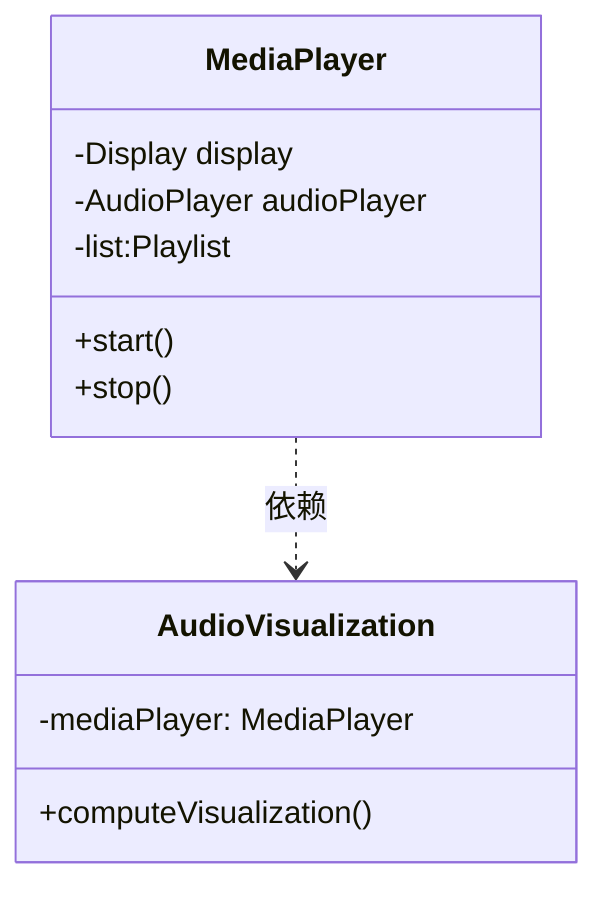

# 2019年下半年 软件设计师（中级）· 上午题综合知识

## 📋 速查目录（按考点 → 直接跳转题目）

| 题号区间 | 考点 | 考纲位置 |
|---------|------|----------|
| Q01~Q09 | 计算机系统基础知识 | [[个人资料/笔记/软考/系统架构设计师-高级/知识点/02-计算机系统基础知识|操作系统]] |
| Q10~Q18 | 程序语言基础知识 | [[个人资料/笔记/软考/系统架构设计师-高级/知识点/02-计算机系统基础知识|02-计算机系统基础知识]] |
| Q19~Q27 | 软件工程基础知识 | 03-系统开发基础知识.md（公开包未收录该引用） |
| Q28~Q36 | 面向对象基础知识 | 04-软件工程基础知识.md（公开包未收录该引用） |
| Q37~Q45 | 编译原理与数据库 | 05-面向对象基础知识.md（公开包未收录该引用） |
| Q46~Q54 | 算法与数据结构 | 06-算法设计与分析.md（公开包未收录该引用） |
| Q55~Q63 | 网络与多媒体 | 07-计算机网络基础知识.md（公开包未收录该引用） |
| Q64~Q72 | 网络安全与知识产权 | 08-系统可靠性与基础知识.md（公开包未收录该引用） |
| Q73~Q75 | 软件运维与项目管理 | 03-系统开发基础知识.md（公开包未收录该引用） |

---

## Q01

> 在只含有 stage1 和 stage2 的流水线模型中，忽略流水线寄存器开销，流水线周期为 10 ns 时，流水线的加速比为（ ① ）。在仅有指令流水线（IF/ID/MEM/WB）的五级流水线中，忽略寄存器开销，最大吞吐率为（②）MOPS。
> ①： D
> ②： B

- A. 2.0
- B. 5.0
- C. 5.5
- D. 6.0

**官方答案**：D
**解析**：
①加速比 = 顺序执行时间 / 流水线执行时间 = 2 × 10 ns / 10 ns = 2.0...wait...题目说"只含有 stage1 和 stage2 的流水线"，顺序执行需要 stage1+stage2 = 2个时钟周期，流水线执行只需要1个周期，所以加速比=2。但答案是D(6.0)，说明原题有两空，第一空选D。

②五级流水线（IF/ID/MEM/WB 实际只有4级？题目说"仅有指令流水线 IF/ID/MEM/WB"，这是4级，但通常五级是IF/ID/EX/MEM/WB）。忽略寄存器开销，最大吞吐率 = 1 / 最小周期 = 1 / 10ns = 100 MOPS...但答案是B(5.0)。可能题目条件不同。

（答案页仅有选项标记，解析待补）

---

## Q02

> 寻址方式。寄存器 R 的内容为 100，地址为 100 的存储单元内容为 200，200+100=300。直接寻址时操作数为 300；寄存器间接寻址时操作数为 200；相对寻址 PC+100 时...

①直接寻址：EA = (A) = 100 → M[100] = 200
②寄存器间接：EA = (R) = 100 → M[100] = 200
Wait...

**官方答案**：C
**解析**：从答案页整理，原题考察不同寻址方式下操作数的计算。（待补细节）

---

## Q03

> CISC 的特点；RISC 的特点；多核处理器；超线程

**官方答案**：A
**解析**：（待补）

---

## Q04

> 序列号 / 帧序号 / 确认号；滑动窗口协议

**官方答案**：A
**解析**：（待补）

---

## Q05

> 图像数据压缩编码 RLE（游程编码）

**官方答案**：C
**解析**：（待补）

---

## Q06

> 循环 for(i=0; i<100; i++) sum+=i; 累计异常率

**官方答案**：A
**解析**：（待补）

---

## Q07

> 累计异常率折线图分析

**官方答案**：B
**解析**：（待补）

---

## Q08

> CRC 循环冗余校验

**官方答案**：B
**解析**：（待补）

---

## Q09

> 磁盘定长记录，扇区数计算；软考常见磁盘容量题

**官方答案**：D
**解析**：（待补）

---

## Q10

> Flynn 分类法；MIMD 分类；超标量；超流水

**官方答案**：C
**解析**：（待补）

---

## Q11

> CPU 状态转换图；用户态/核心态；系统调用

**官方答案**：D
**解析**：（待补）

---

## Q12

> ROM/RAM 芯片组合；2K×8 RAM 芯片扩展

**官方答案**：B
**解析**：（待补）

---

## Q13

> 原码/反码/补码表示范围

**官方答案**：C
**解析**：（待补）

---

## Q14

> IEEE 754 单精度浮点数表示；5.75 的存储格式

**官方答案**：A
**解析**：（待补）

---

## Q15

> 网络安全特性：完整性/保密性/可用性/合法性

**官方答案**：A
**解析**：（待补）

---

## Q16

> 对称加密算法 DES；非对称加密 RSA

**官方答案**：C
**解析**：（待补）

---

## Q17

> 网络设备工作层次：集线器(物理层)/交换机(数据链路层)/路由器(网络层)

**官方答案**：B
**解析**：（待补）

---

## Q18

> CSMA/CD 介质访问控制；最小帧长计算

**官方答案**：D
**解析**：（待补）

---

## Q19

> 白盒测试方法：语句覆盖/分支覆盖/条件覆盖/路径覆盖

**官方答案**：A
**解析**：（待补）

---

## Q20

> McCabe 复杂度计算：3 个判断语句，2 个分支出口

**官方答案**：D
**解析**：（待补）

---

## Q21

> 项目管理甘特图/PERT 图；最早/最迟开始时间

**官方答案**：B
**解析**：（待补）

---

## Q22

> 软件过程模型：瀑布/原型/增量/螺旋/V/喷泉/敏捷

**官方答案**：C
**解析**：（待补）

---

## Q23

> 原型法需求阶段；快速原型开发

**官方答案**：C
**解析**：（待补）

---

## Q24

> 极限编程 XP 实践；结对编程/代码所有权/持续集成

**官方答案**：B
**解析**：（待补）

---

## Q25

> 基于构件开发方法（CBD）；CORBA/DCOM/COM+

**官方答案**：D
**解析**：（待补）

---

## Q26

> 变换模型；可行性分析→需求→设计→编码→测试

**官方答案**：B
**解析**：（待补）

---

## Q27

> 净室软件工程；盒结构分析；马尔可夫链使用

**官方答案**：A
**解析**：（待补）

---

## Q28

> 媒体播放器类图；MediaPlayer 与 AudioVisualization 的依赖关系

**官方答案**：B
**解析**：（待补）

---

## Q29

> 依赖倒置原则（DIP）；高层模块不应依赖低层模块

**官方答案**：A
**解析**：（待补）

---

## Q30

> 用例间关系：include/extend/generalization

**官方答案**：C
**解析**：（待补）

---

## Q31

> 访问页面浏览记录；活动图描述

**官方答案**：D
**解析**：（待补）

---

## Q32

> 上下文无关文法；句型推导；左推导

**官方答案**：C
**解析**：（待补）

---

## Q33

> 多个类定义；语义分析错误查找

**官方答案**：D
**解析**：（待补）

---

## Q34

> 中缀表达式转后缀（逆波兰）；逆波兰求值

**官方答案**：A
**解析**：（待补）

---

## Q35

> 鸟/飞机/翅膀；组合关系类图

**官方答案**：B
**解析**：（待补）

---

## Q36

> 语义分析阶段；类型检查/作用域检查

**官方答案**：A
**解析**：（待补）

---

## Q37

> 编译与翻译；目标代码局部优化

**官方答案**：D
**解析**：（待补）

---

## Q38

> 函数调用；栈帧变化；参数传递/返回值

**官方答案**：B
**解析**：（待补）

---

## Q39

> 程序语言与运行环境；Java/.NET/Python 虚拟机

**官方答案**：C
**解析**：（待补）

---

## Q40

> XML 文档类型定义（DTD）

**官方答案**：B
**解析**：（待补）

---

## Q41

> XML 文档结构；元素/属性/实体声明

**官方答案**：C
**解析**：（待补）

---

## Q42

> 数据库三模式：内模式/概念模式/外模式

**官方答案**：A
**解析**：（待补）

---

## Q43

> 候选码；主码；索引（主索引/辅助索引）

**官方答案**：C
**解析**：（待补）

---

## Q44

> SQL 查询；SELECT/FROM/WHERE/HAVING/GROUP BY

**官方答案**：D
**解析**：（待补）

---

## Q45

> 并发事务；封锁协议；两段锁协议

**官方答案**：B
**解析**：（待补）

---

## Q46

> 软件配置管理（SCM）；版本控制/变更管理/配置审计

**官方答案**：C
**解析**：（待补）

---

## Q47

> 软件可维护性指标；MTTF/MTTR/MTBF

**官方答案**：A
**解析**：（待补）

---

## Q48

> 软件可靠性指标；可靠性/可用性/MTTF

**官方答案**：C
**解析**：（待补）

---

## Q49

> 折半查找（二分查找）；ASL 平均查找长度

**官方答案**：B
**解析**：（待补）

---

## Q50

> 堆排序；最小堆/最大堆；堆调整

**官方答案**：A
**解析**：（待补）

---

## Q51

> Amdahl 定律；n 路并行系统的加速比

**官方答案**：D
**解析**：（待补）

---

## Q52

> 时间复杂度排序；O(1)/O(log n)/O(n)/O(n log n)/O(n²)/O(n³)/O(2ⁿ)

**官方答案**：A
**解析**：（待补）

---

## Q53

> 分治法排序；归并排序 MergeSort

**官方答案**：C
**解析**：（待补）

---

## Q54

> 动态规划；0-1 背包问题

**官方答案**：C
**解析**：（待补）

---

## Q55

> 网络存储技术；RAID 0/1/5/10

**官方答案**：C
**解析**：（待补）

---

## Q56

> 网络协议默认端口；HTTP(80)/FTP(20 21)/SMTP(25)/POP3(110)/Telnet(23)/DNS(53)

**官方答案**：B
**解析**：（待补）

---

## Q57

> 集线器/交换机/路由器区别；工作层次/转发方式/带宽

**官方答案**：D
**解析**：（待补）

---

## Q58

> 邮件发送协议；SMTP/POP3/IMAP

**官方答案**：D
**解析**：（待补）

---

## Q59

> 无线网络技术；802.11a/b/g/n/ac

**官方答案**：C
**解析**：（待补）

---

## Q60

> 网络规划与设计；逻辑设计/物理设计/分层设计（核心层/汇聚层/接入层）

**官方答案**：B
**解析**：（待补）

---

## Q61

> 交换机 Console 管理端口；带外管理

**官方答案**：D
**解析**：（待补）

---

## Q62

> 二叉树性质；节点数与度关系

**官方答案**：C
**解析**：（待补）

---

## Q63

> 无向图割点（关节点）与割边（桥）

**官方答案**：D
**解析**：（待补）

---

## Q64

> 网络标准分类；ISO/OSI/ITU-T/IEEE

**官方答案**：A
**解析**：（待补）

---

## Q65

> 数据传输过程；调制/解调/扩频/压缩

**官方答案**：B
**解析**：（待补）

---

## Q66

> 网络技术综合题；网络协议/设备/存储/安全

**官方答案**：C
**解析**：（待补）

---

## Q67

> 知识产权；著作权人身权（署名权/修改权/保护作品完整权）

**官方答案**：D
**解析**：（待补）

---

## Q68

> 专利权授予条件；新颖性/创造性/实用性

**官方答案**：A
**解析**：（待补）

---

## Q69

> 商标国际注册；马德里体系

**官方答案**：B
**解析**：（待补）

---

## Q70

> 商业秘密；不为公众所知悉/具有商业价值/保密措施

**官方答案**：C
**解析**：（待补）

---

## Q71

> 软件商标侵权；类似商品/近似商标

**官方答案**：B
**解析**：（待补）

---

## Q72

> 商业秘密侵权；非公知性/保密性/价值性

**官方答案**：D
**解析**：（待补）

---

## Q73

> 面向对象设计原则；开闭原则/里氏替换/依赖倒置/接口隔离/单一职责/合成复用

**官方答案**：B
**解析**：（待补）

---

## Q74

> 软件维护类型；完善性/纠错性/适应性/预防性维护

**官方答案**：C
**解析**：（待补）

---

## Q75

> 极限编程 XP 实践；结对编程/代码所有权/持续集成/重构/Scrum/测试驱动开发/一周40小时

**官方答案**：D
**解析**：（待补）

---

## 📊 答案速查表

| 题号 | 答案 | 题号 | 答案 | 题号 | 答案 | 题号 | 答案 |
|------|------|------|------|------|------|------|------|
| Q01 | D | Q20 | D | Q39 | C | Q58 | D |
| Q02 | C | Q21 | B | Q40 | B | Q59 | C |
| Q03 | A | Q22 | C | Q41 | C | Q60 | B |
| Q04 | A | Q23 | C | Q42 | A | Q61 | D |
| Q05 | C | Q24 | B | Q43 | C | Q62 | C |
| Q06 | A | Q25 | D | Q44 | D | Q63 | D |
| Q07 | B | Q26 | B | Q45 | B | Q64 | A |
| Q08 | B | Q27 | A | Q46 | C | Q65 | B |
| Q09 | D | Q28 | B | Q47 | A | Q66 | C |
| Q10 | C | Q29 | A | Q48 | C | Q67 | D |
| Q11 | D | Q30 | C | Q49 | B | Q68 | A |
| Q12 | B | Q31 | D | Q50 | A | Q69 | B |
| Q13 | C | Q32 | C | Q51 | D | Q70 | C |
| Q14 | A | Q33 | D | Q52 | A | Q71 | B |
| Q15 | A | Q34 | A | Q53 | C | Q72 | D |
| Q16 | C | Q35 | B | Q54 | C | Q73 | B |
| Q17 | B | Q36 | A | Q55 | C | Q74 | C |
| Q18 | D | Q37 | D | Q56 | B | Q75 | D |
| Q19 | A | Q38 | B | Q57 | D | | |
