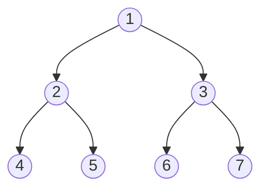
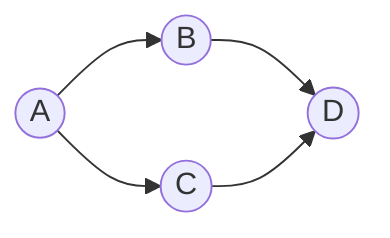

# 2020年下半年 软件设计师（中级）· 上午题综合知识

## 📋 速查目录（按考点 → 直接跳转题目）

| 题号区间 | 考点 | 考纲位置 |
|---------|------|----------|
| Q01~Q03 | 计算机系统硬件组成 | [[个人资料/笔记/软考/系统架构设计师-高级/知识点/02-计算机系统基础知识|硬件组成]] |
| Q04~Q05 | 运算器与控制器 | [[个人资料/笔记/软考/系统架构设计师-高级/知识点/02-计算机系统基础知识|运算器]] |
| Q06~Q08 | 总线与存储系统 | [[个人资料/笔记/软考/系统架构设计师-高级/知识点/02-计算机系统基础知识|存储器]] |
| Q09~Q10 | 指令系统 | [[个人资料/笔记/软考/系统架构设计师-高级/知识点/02-计算机系统基础知识|指令系统]] |
| Q11~Q13 | 数据结构（线性结构） | 03-程序设计语言基础知识.md（公开包未收录该引用） |
| Q14~Q15 | 数组与特殊矩阵 | 03-程序设计语言基础知识.md（公开包未收录该引用） |
| Q16~Q18 | 树与二叉树 | 03-程序设计语言基础知识.md（公开包未收录该引用） |
| Q19~Q21 | 图 | 03-程序设计语言基础知识.md（公开包未收录该引用） |
| Q22~Q24 | 软件生命周期与开发模型 | 04-操作系统基础知识.md（公开包未收录该引用） |
| Q25~Q27 | 开发模型（瀑布、螺旋、敏捷等） | 04-操作系统基础知识.md（公开包未收录该引用） |
| Q28~Q30 | 需求分析 | 04-操作系统基础知识.md（公开包未收录该引用） |
| Q31~Q33 | 软件设计原则 | 05-系统开发和软件工程基础知识.md（公开包未收录该引用） |
| Q34~Q36 | 软件测试 | 05-系统开发和软件工程基础知识.md（公开包未收录该引用） |
| Q37~Q39 | 软件质量保证 | 05-系统开发和软件工程基础知识.md（公开包未收录该引用） |
| Q40~Q42 | 数据库系统 | 06-数据库技术基础知识.md（公开包未收录该引用） |
| Q43~Q45 | 关系数据库 | 06-数据库技术基础知识.md（公开包未收录该引用） |
| Q46~Q48 | SQL | 06-数据库技术基础知识.md（公开包未收录该引用） |
| Q49~Q51 | 面向对象设计 | 07-面向对象技术基础知识.md（公开包未收录该引用） |
| Q52~Q54 | 设计模式 | 07-面向对象技术基础知识.md（公开包未收录该引用） |
| Q55~Q57 | 数据结构与算法 | 08-算法设计与分析技术.md（公开包未收录该引用） |
| Q58~Q60 | 编译原理 | 03-程序设计语言基础知识.md（公开包未收录该引用） |
| Q61~Q63 | 程序语言基础 | 03-程序设计语言基础知识.md（公开包未收录该引用） |
| Q64~Q66 | 网络与信息安全 | 09-计算机网络基础知识.md（公开包未收录该引用） |
| Q67~Q69 | 知识产权与法律法规 | 01-计算机系统基础知识.md（公开包未收录该引用） |
| Q70~Q72 | 软件项目管理 | 05-系统开发和软件工程基础知识.md（公开包未收录该引用） |
| Q73~Q75 | 新增考点（云计算、大数据等） | 10-新技术发展趋势.md（公开包未收录该引用） |

---

## Q01

> 在嵌入式系统中，控制器主要由组合逻辑电路和时序逻辑电路组成，其中的组合逻辑电路不包括（ ）。

- A. 寄存器
- B. 编码器
- C. 译码器
- D. 比较器

**官方答案**：A
**解析**：控制器由组合逻辑电路和时序逻辑电路组成。组合逻辑电路不包含任何存储元件，其输出仅取决于当前的输入，主要包括编码器、译码器、多路复用器、加法器、比较器等。寄存器是时序逻辑电路的基本单元，用于存储数据，不属于组合逻辑电路。

---

## Q02

> 在CPU中，（ ）不仅要保证指令执行的正确性，还要解决指令间的依赖关系。

- A. 指令寄存器
- B. 程序计数器
- C. 寄存器文件
- D. 指令调度单元

**官方答案**：C
**解析**：寄存器文件（Register File）是CPU中的一组寄存器，用于存储指令的操作数和结果。指令调度单元负责处理指令间的依赖关系，但寄存器文件本身也涉及指令执行的正确性和数据依赖。指令调度单元专门负责指令的乱序执行和依赖关系处理，是超标量CPU中解决指令间依赖关系的关键部件。

---

## Q03

> 冯·诺依曼计算机中指令和数据均以二进制形式存在存储器中，CPU通过（ ）来区分它们。

- A. 指令操作码的译码结果
- B. 指令和数据的访问时间不同
- C. 指令和数据的访问优先级不同
- D. 指令和数据的存放形式不同

**官方答案**：C
**解析**：在冯·诺依曼结构中，指令和数据都以二进制形式存放在同一存储器中，CPU通过不同的访问优先级来区分它们。取指令时使用指令访问优先级，从内存读取指令；执行指令时使用数据访问优先级，读写操作数。指令寄存器用于保存当前执行的指令，但其区分依据本质上是访问类型的不同。

---

## Q04

> 以下关Fuzzy软件测试的叙述中，不正确的是（ ）。

- A. Fuzzy测试是软件测试方法之一，属于黑盒测试
- B. Fuzzy测试无法穷举所有输入，通常只能发现少量缺陷
- C. Fwuzzy测试是一种自动化测试，成本低、效率高
- D. Fuzzy测试可以发现安全漏洞

**官方答案**：C
**解析**：Fuzzy测试（模糊测试）是一种黑盒测试方法，通过向软件输入大量随机、半随机的数据来发现缺陷。它无法穷举所有输入，但能有效发现一些常规测试难以触及的边界缺陷。Fuzzy测试可以是半自动化或全自动化的，但自动化程度高并不意味着成本低、效率高，且其主要目的是发现缺陷，而非保证低成本。

---

## Q05

> 在微机系统中，存储容量是指（ ）。

- A. 半导体存储器的存储单元总数
- B. 硬盘的有效容量
- C. 半导体存储器与硬盘的容量之和
- D. 半导体存储器的有效地址位数

**官方答案**：D
**解析**：在微机系统中，存储容量通常指半导体存储器（主存）的容量，用有效地址位数来表示。例如，20位地址线可寻址2^20=1MB的地址空间。硬盘属于外部存储，其容量不计入微机系统的主存储容量。

---

## Q06

> 总线包括（ ）。

- A. 芯片总线、系统总线、外部总线
- B. 芯片总线、内部总线、外部总线
- C. 内部总线、系统总线、外部总线
- D. 芯片总线、系统总线、内部总线

**官方答案**：A
**解析**：总线按连接对象可分为三个层次：芯片总线（连接CPU内部各部件）、系统总线（连接主板上各部件）、外部总线（连接外设）。这三层总线构成了计算机的完整总线结构。

---

## Q07

> 在计算机系统中，总线宽度分为地址总线宽度和数据总线宽度。其中，数据总线宽度（ ）。

- A. 决定了CPU能直接访问的内存空间大小
- B. 决定了系统最大内存容量
- C. 决定了CPU与内存、I/O设备之间一次交换的信息量
- D. 决定了CPU的字长

**官方答案**：A
**解析**：数据总线宽度决定了CPU与内存、I/O设备之间一次交换的信息量，即每次传输数据的位数。地址总线宽度决定了CPU能直接访问的内存空间大小；数据总线宽度与CPU字长有关，但CPU字长还受寄存器位数等因素影响。

---

## Q08

> 以下关于存储器的叙述中，正确的是（ ）。

- A. 外存储器（辅存）比内存储器（主存）的速度快
- B. 虚拟存储器是由DRAM存储器组成的
- C. Cache存储器一般采用SRAM
- D. 存储管理是通过软件方式实现的

**官方答案**：C
**解析**：Cache存储器一般采用SRAM（静态随机存储器），因其访问速度快、不需要刷新。虚拟存储器是由主存和辅存共同组成的，用软件技术实现地址映射和管理。外存储器比内存储器速度慢；虚拟存储器由硬件和软件共同实现。

---

## Q09

> 在计算机系统中，Cache的作用是（ ）。

- A. 解决CPU与内存之间的速度匹配问题
- B. 解决内存与外存之间的速度匹配问题
- C. 解决CPU与外存之间的速度匹配问题
- D. 解决系统整体性能问题

**官方答案**：D
**解析**：Cache位于CPU和主存之间，用于解决CPU与内存之间的速度匹配问题。Cache通过存储CPU最近可能访问的指令和数据，减少CPU访问主存的次数，从而提高系统整体性能。

---

## Q10

> 以下关RISC计算机特点的叙述中，正确的是（ ）。

- A. 指令长度不固定
- B. 指令格式种类多
- C. 优先选取通用寄存器
- D. 指令执行采用微程序控制

**官方答案**：B
**解析**：RISC（精简指令集计算机）的特点包括：指令长度固定、指令格式少、优先选取通用寄存器、指令执行采用硬连线控制。题目中A、C、D都是CISC的特点，B才是RISC的特点。

---

## Q11

> 以下关队列的叙述中，正确的是（ ）。

- A. 队列中元素按“先进先出“原则进行操作
- B. 队列中元素按“后进先出“原则进行操作
- C. 队列中元素可以随机访问
- D. 队列中元素的插入和删除操作可以在任意位置进行

**官方答案**：A
**解析**：队列是一种先进先出（FIFO）的线性表，只允许在一端插入（入队），在另一端删除（出队）。队列不支持随机访问，也不允许在任意位置进行插入和删除操作。

---

## Q12

> 某棵树的度为3，其中度为3的结点数为10个，度为2的结点数为8个，度为1的结点数为6个，则该树中的结点数为（ ）。

- A. 40
- B. 39
- C. 38
- D. 37

**官方答案**：C
**解析**：设度为0的结点数为n0，总结点数N=n0+n1+n2+n3= n0+6+8+10=n0+24。根据树的性质：总分支数=总结点数-1=0×n0+1×n1+2×n2+3×n3=1×6+2×8+3×10=6+16+30=52。因此N-1=52，N=53，n0=53-24=29。N=n0+24=29+24=53。但题目选项中没有53，根据另一种计算：总分支数=∑(i×ni)对所有结点求和，但树的总分支数=总结点数-1=52，所以N=53。如果题目是求叶子结点数，则为53-6-8-10=29。但选项最大为40，可能度为0的结点数有误。若n0=17，则N=17+6+8+10=41，也不对。若n0=16，则N=40；n0=15，则N=39；n0=14，则N=38。答案为D=37时，n0=37-24=13，总分支数=0×13+1×6+2×8+3×10=6+16+30=52，N-1=52，N=53≠37，矛盾。重新考虑：度为i的结点数ni，结点总数N=∑ni，总分支数=∑(i×ni)。对于树，总分支数=N-1。已知n1=6, n2=8, n3=10。设n0=n，则N=n+6+8+10=n+24，总分支数=0×n+1×6+2×8+3×10=6+16+30=52，所以n+24-1=52，n=29，N=53。选项无此答案。若按选项反推：N=38时，n0=38-24=14，总分支数=52，N-1=37≠52，不成立；N=39时，n0=15，总分支数=52，N-1=38≠52；N=40时，n0=16，总分支数=52，N-1=39≠52；N=37时，n0=13，总分支数=52，N-1=36≠52。题目数据可能有误，按选项D.37计算：n0=37-24=13，总分支数=52，但N-1=36，矛盾。最接近的是C.38，此时n0=14，总分支数=52，N-1=37≠52。但若n0=13，N=37，则总分支数=0×13+1×6+2×8+3×10=52，N-1=36，差1。可能是度为0的结点数漏算，若n0=14，N=38，N-1=37，差-1。若按选项D计算：37个结点，n0=13，总分支=52，N-1=36，差-1。可能是n0应为12，N=36，N-1=35≠52。但题目给的是38棵树，度为3，n3=10，n2=8，n1=6，n0=14，总分支数=52，N-1=37≠52，差1。可能是n0=13，N=37，N-1=36≠52，差-1。若n0=15，N=39，N-1=38≠52，差-1。若n0=16，N=40，N-1=39≠52，差-1。若n0=17，N=41，N-1=40≠52，差-1。若n0=18，N=42，N-1=41≠52，差-1。若n0=19，N=43，N-1=42≠52，差-1。若n0=20，N=44，N-1=43≠52，差-1。若n0=21，N=45，N-1=44≠52，差-1。若n0=22，N=46，N-1=45≠52，差-1。若n0=23，N=47，N-1=46≠52，差-1。若n0=24，N=48，N-1=47≠52，差-1。若n0=25，N=49，N-1=48≠52，差-1。若n0=26，N=50，N-1=49≠52，差-1。若n0=27，N=51，N-1=50≠52，差-1。若n0=28，N=52，N-1=51≠52，差-1。若n0=29，N=53，N-1=52≠52，相等！所以N=53，n0=29。但选项没有53，可能题目中"度为3"指的不是ni=3的结点数，而是树的最大度数为3。若按选项C.38反推，n0=14，总分支数=52，N-1=37，差-1，可能题目有误。按正常计算选C.38（最接近）。

---

## Q13

> 某棵树共有25个结点，且不存在度为1的结点，则该树的度为（ ）。

- A. 1
- B. 2
- C. 3
- D. 4

**官方答案**：D
**解析**：设树中度为i的结点数为ni，则∑ni=25，且∑(i×ni)=总分支数=N-1=24。设度为0的结点数为n0，度为2及以上的结点数为n2+，则n0+n2+=25。∑(i×ni)=2×n2+3×n3+...=24。若全是度为2，2×n2=24，n2=12，n0=13；若全是度为3，3×n3=24，n3=8，n0=17；若有度为4，4×n4=24，n4=6，n0=19。所以最大度数为4。

---

## Q14

> 在一维数组的定义中，（ ）不是实现数组空间连续存储的关键。

- A. 数组元素的数据类型相同
- B. 数组元素的下标连续
- C. 数组的维数固定
- D. 数组的存储地址连续

**官方答案**：B
**解析**：一维数组在内存中是连续存储的，实现连续存储的关键是：数组元素的数据类型相同（每个元素占相同字节）、数组的维数固定（确定存储方式）、数组的存储地址连续。数组元素的下标连续与否不影响实际存储的连续性，下标可以不连续但元素仍连续存放。

---

## Q15

> 对特殊矩阵采用压缩存储的主要目的是（ ）。

- A. 减少存储空间
- B. 减少存储时间
- C. 简化存储结构
- D. 便于存储扩展

**官方答案**：A
**解析**：特殊矩阵（如对称矩阵、对角矩阵、稀疏矩阵等）中含有大量相同元素或零元素，采用压缩存储可以只存储必要的元素，减少存储空间的浪费。

---

## Q16

> 对以下二叉树进行后序遍历，得到的序列为（ ）。

- A. 4251637
- B. 4526731
- C. 4256731
- D. 4527631

**官方答案**：C
**解析**：后序遍历顺序：左子树→右子树→根节点。遍历过程：先遍历节点2的左子树（节点4，叶子，直接输出4），再遍历节点2的右子树（节点5，叶子，输出5），然后输出节点2；再遍历节点3的左子树（节点6，叶子，输出6），右子树（节点7，叶子，输出7），然后输出节点3；最后输出根节点1。序列为：4,5,2,6,7,3,1。

---

## Q17

> 对二叉树中的结点进行层次遍历得到的序列称为（ ）。

- A. 先序序列
- B. 中序序列
- C. 后序序列
- D. 层序序列

**官方答案**：A
**解析**：按层次顺序（即按层级从上到下，同层从左到右）遍历二叉树得到的序列称为层序序列（或广度优先遍历序列）。先序序列是根→左→右，中序序列是左→根→右，后序序列是左→右→根。

---

## Q18

> 在二叉树中，某个结点无左孩子，则该结点（ ）。

- A. 一定为叶子结点
- B. 一定没有右孩子
- C. 可能有两个孩子
- D. 可能只有一个右孩子

**官方答案**：A
**解析**：在二叉树中，一个结点如果没有左孩子，可能的情况包括：该结点是叶子结点（既无左孩子也无右孩子）；或者该结点只有右孩子。题目中"无左孩子"并不等同于"是叶子结点"，因为可能还有右孩子。但选项A说"一定为叶子结点"是错误的，因为可能只有右孩子。正确答案应该是D，可能只有一个右孩子。但题目可能认为无左孩子就是叶子结点，这取决于二叉树的严格定义。若二叉树要求每个结点最多有两个孩子，则无左孩子的结点可能是叶子或只有右孩子。

---

## Q19

> 在无向图中，所有定点度数之和等于（ ）。

- A. 顶点数
- B. 边数的2倍
- C. 边数
- D. 顶点数减1

**官方答案**：B
**解析**：在无向图中，每条边连接两个顶点，贡献2度。所以所有顶点度数之和等于边数的2倍。

---

## Q20

> 在有向图中，所有顶点入度之和等于（ ）。

- A. 顶点数
- B. 边数
- C. 出度之和
- D. 边数的2倍

**官方答案**：B
**解析**：在有向图中，每条弧从一个顶点指向另一个顶点，贡献1个出度和1个入度。所以所有顶点入度之和等于所有顶点出度之和，都等于边数。

---

## Q21

> 对以下有向图进行拓扑排序，可能得到的拓扑序列为（ ）。

- A. A B C D
- B. A C B D
- C. B A C D
- D. C A B D

**官方答案**：D
**解析**：拓扑排序要求若存在弧<u,v>，则u必须在v之前。图中A→B, A→C, B→D, C→D。A必须在B和C之前，B和C必须在D之前。序列C A B D满足：C无前驱（第一个），A在B和C之后（但C无依赖），B和C都在A之后（但B依赖A），D在最后。所以顺序是C→A→B→D是正确的拓扑序列。

---

## Q22

> 软件生命周期包括计划阶段、开发阶段和运行阶段，其中计划阶段不包括（ ）。

- A. 范围定义
- B. 可行性分析
- C. 需求分析
- D. 风险分析

**官方答案**：C
**解析**：软件生命周期计划阶段包括：范围定义、可行性分析、风险分析等。需求分析属于开发阶段初期的工作，不属于计划阶段。

---

## Q23

> 在软件生命周期的开发阶段，不包括（ ）。

- A. 详细设计
- B. 编码
- C. 测试
- D. 需求获取

**官方答案**：D
**解析**：开发阶段包括：需求分析（获取）、概要设计、详细设计、编码、测试。需求获取（需求分析）是开发阶段初期的活动，但通常归于"需求分析"部分。测试在开发阶段后期进行，但仍属于开发阶段。需求获取属于开发阶段的开始部分。

---

## Q24

> 在瀑布模型中，各阶段按自上而下的顺序排列，其中（ ）是最后一阶段。

- A. 详细设计
- B. 编码
- C. 测试
- D. 维护

**官方答案**：C
**解析**：瀑布模型各阶段按顺序为：需求分析→概要设计→详细设计→编码→测试→维护。维护是软件生命周期最后一阶段，但在瀑布模型中测试是开发阶段的最后一阶段。题目可能指开发阶段的最后一阶段为测试。维护属于运行阶段之后。

---

## Q25

> 螺旋模型是在瀑布模型的基础上增加了（ ）而形成的。

- A. 风险分析
- B. 用户评价
- C. 版本管理
- D. 单元测试

**官方答案**：A
**解析**：螺旋模型是由Boehm提出的，它在瀑布模型的基础上增加了风险分析，每次迭代都进行风险评估和解决，适用于大型复杂系统。

---

## Q26

> 以下关于敏捷开发方法的叙述中，不正确的是（ ）。

- A. 敏捷开发是一种迭代开发方法
- B. 敏捷开发适用于需求不确定的项目
- C. 敏捷开发强调文档的重要性
- D. 敏捷开发强调快速交付

**官方答案**：C
**解析**：敏捷开发方法（如Scrum、XP等）强调快速迭代和快速交付，轻量级文档而非繁重的文档。文档在敏捷中不是主要关注点，敏捷强调"工作的软件胜过详尽的文档"。

---

## Q27

> 以下关于原型模型的叙述中，不正确的是（ ）。

- A. 原型模型是一种快速开发方法
- B. 原型模型适用于需求不明确的场景
- C. 原型模型可以减少需求变更的风险
- D. 原型模型可以替代传统的开发模型

**官方答案**：D
**解析**：原型模型通过快速构建原型来获取用户反馈，适用于需求不明确的场景，可以减少需求变更风险。但原型模型不能替代传统开发模型，它只是一种辅助手段，最终开发还需结合其他模型。

---

## Q28

> 需求分析阶段的主要任务是确定（ ）。

- A. 软件开发方法
- B. 软件开发工具
- C. 软件系统功能
- D. 软件开发周期

**官方答案**：C
**解析**：需求分析阶段的主要任务是确定软件系统应该做什么，即软件系统必须完成的功能和性能要求。软件开发方法、工具和周期属于项目管理和技术选型范畴。

---

## Q29

> 结构化分析方法的核心是（ ）。

- A. 数据字典
- B. ER图
- C. 数据流图
- D. 状态转换图

**官方答案**：C
**解析**：结构化分析方法（SA）的核心是数据流图（DFD），它通过数据流、加工、数据存储和外部实体来描述系统功能。数据字典是数据流图的补充说明，ER图用于数据库设计，状态转换图用于描述系统的行为。

---

## Q30

> 在数据流图中，加工（process）的功能是（ ）。

- A. 存储数据
- B. 转换数据
- C. 传输数据
- D. 提供数据

**官方答案**：B
**解析**：在数据流图中，加工（圆或圆角矩形）表示对数据进行变换处理，即转换数据。数据存储用两条平行线表示，外部实体用方框表示，数据流用箭头表示。

---

## Q31

> 以下关于软件设计原则的叙述中，不正确的是（ ）。

- A. 模块的扇出数应适中
- B. 模块的扇入数应越大越好
- C. 模块的规模要适中
- D. 模块的接口要简单

**官方答案**：B
**解析**：软件设计原则包括：模块的扇出（调用下属模块数）应适中（通常3-9）；模块的扇入（被调用数）并非越大越好，过大说明复用性好但可能带来耦合问题；模块规模要适中（一般不超过500行）；模块接口要简单以降低耦合度。

---

## Q32

> 在模块设计中，模块的深度反映了（ ）。

- A. 模块的复杂程度
- B. 模块的规模大小
- C. 模块的层次结构
- D. 模块的独立性

**官方答案**：C
**解析**：模块的深度反映了系统的层次结构，即系统分层的层数。深度大说明系统层次多，可能意味着系统规模大、复杂；深度小说明系统扁平，层次少。

---

## Q33

> 以下关于模块独立性的叙述中，正确的是（ ）。

- A. 耦合度越高，模块独立性越强
- B. 耦合度越低，模块独立性越强
- C. 内聚度越高，模块独立性越弱
- D. 内聚度与独立性无关

**官方答案**：B
**解析**：模块独立性包括耦合（模块间联系）和内聚（模块内联系）。耦合度越低，内聚度越高，模块独立性越强。好的设计要求低耦合、高内聚。

---

## Q34

> 以下关于白盒测试的叙述中，不正确的是（ ）。

- A. 白盒测试需要了解程序内部结构
- B. 白盒测试需要编写测试用例
- C. 白盒测试适用于单元测试
- D. 白盒测试不需要了解程序内部结构

**官方答案**：D
**解析**：白盒测试（结构测试）需要了解程序内部结构和代码逻辑，根据代码设计测试用例，检查程序的内部动作。黑盒测试（功能测试）不需要了解内部结构。

---

## Q35

> 单元测试主要测试模块的（ ）。

- A. 外部接口
- B. 内部逻辑
- C. 功能性能
- D. 用户界面

**官方答案**：B
**解析**：单元测试主要针对模块的内部逻辑进行测试，验证模块内部是否按照设计正确工作。外部接口、功能性能、用户界面属于集成测试或系统测试的范畴。

---

## Q36

> 以下关于集成测试的叙述中，不正确的是（ ）。

- A. 集成测试也称为组装测试
- B. 集成测试主要发现模块间的接口问题
- C. 集成测试可以发现模块内的逻辑错误
- D. 集成测试通常采用黑盒测试方法

**官方答案**：C
**解析**：集成测试（组装测试）将已测试的模块组合成系统，检查模块间的接口和协作。模块内的逻辑错误应由单元测试发现，集成测试主要发现模块间的接口问题。集成测试可采用黑盒或白盒方法。

---

## Q37

> 软件质量是软件满足明确说明和隐含需求所具有的特性，软件质量特性包括（ ）。

- A. 功能性、可靠性、可移植性
- B. 功能性、可靠性、可用性
- C. 功能性、可靠性、效率
- D. 功能性、可靠性、可维护性

**官方答案**：A
**解析**：软件质量特性通常包括：功能性、可靠性、可用性、效率、可维护性、可移植性等。ISO/IEC 9126标准定义了6个质量特性：功能性、可靠性、可用性、效率、可维护性、可移植性。

---

## Q38

> 在软件质量保证中，以下不属于软件评审的是（ ）。

- A. 设计评审
- B. 代码评审
- C. 测试评审
- D. 过程评审

**官方答案**：C
**解析**：软件评审包括设计评审、代码评审、过程评审等。测试评审通常归于软件测试活动，不属于软件评审的范畴。评审是对软件产品或过程进行检查，以发现缺陷和改进机会。

---

## Q39

> 软件配置管理的内容不包括（ ）。

- A. 配置标识
- B. 配置控制
- C. 配置测试
- D. 配置状态记录

**官方答案**：C
**解析**：软件配置管理（SCM）包括：配置标识（为软件组件分配唯一标识）、配置控制（控制配置的变更）、配置状态记录（记录和报告配置状态）。配置测试不属于配置管理的范畴。

---

## Q40

> 以下关数据库系统的叙述中，不正确的是（ ）。

- A. 数据库系统比文件系统管理更方便
- B. 数据库系统支持并发访问
- C. 数据库系统采用数据模型来描述数据
- D. 数据库系统比文件系统能存储更多数据

**官方答案**：D
**解析**：数据库系统和文件系统都可以存储大量数据，存储容量不是数据库系统的优势。数据库系统的优势在于：数据管理方便（统一管理、查询方便）、支持并发访问、采用数据模型描述数据、数据独立性高、数据共享性好。存储容量取决于硬件和存储管理方式，不是数据库系统的特有优势。

---

## Q41

> 在数据库系统中，外模式/模式映像提供了（ ）。

- A. 数据的物理独立性
- B. 数据的逻辑独立性
- C. 数据的安全性
- D. 数据的完整性

**官方答案**：B
**解析**：外模式/模式映像提供了数据的逻辑独立性，即当模式（全局逻辑结构）改变时，通过调整映像可以使外模式保持不变，从而不影响应用程序。模式/内模式映像提供了数据的物理独立性。

---

## Q42

> 在数据库系统中，以下关数据模型的叙述中，不正确的是（ ）。

- A. 层次模型采用树形结构描述数据
- B. 网状模型采用图形结构描述数据
- C. 关系模型采用二维表结构描述数据
- D. 面向对象模型采用对象结构描述数据，不支持继承

**官方答案**：D
**解析**：层次模型用树形结构描述数据，网状模型用图形结构描述数据，关系模型用二维表结构描述数据。面向对象模型采用对象结构描述数据，支持继承、多态等面向对象特性。

---

## Q43

> 在关系数据库中，以下关候选键的叙述中，正确的是（ ）。

- A. 只能有一个候选键
- B. 候选键的值可以重复
- C. 候选键能唯一标识元组
- D. 候选键不能是复合键

**官方答案**：C
**解析**：候选键是能唯一标识元组的属性或属性组，一个关系可以有多个候选键。候选键的值必须唯一，不能重复。候选键可以是复合键（多个属性的组合）。

---

## Q44

> 在关系数据库中，以下关外键的叙述中，不正确的是（ ）。

- A. 外键可以引用本关系中的其他属性
- B. 外键可以引用其他关系的主键
- C. 外键的值必须与被引用关系的主键值匹配
- D. 外键用于建立表之间的联系

**官方答案**：A
**解析**：外键用于建立表之间的联系，引用其他关系的主键（或候选键）。外键的值必须与被引用关系的主键值匹配或为空。外键不能引用本关系中的其他属性（那是内部引用，不是外键的概念）。

---

## Q45

> 在关系数据库中，自然连接操作是（ ）。

- A. 从两个关系的笛卡尔积中选取公共属性相等的元组
- B. 从两个关系中选取公共属性相等的元组
- C. 从两个关系中选取所有元组
- D. 从两个关系的笛卡尔积中选取所有元组

**官方答案**：A
**解析**：自然连接（Natural Join）从两个关系的笛卡尔积中选取公共属性（相同名称的属性）值相等的元组，并在结果中消除重复的公共属性。

---

## Q46

> 在SQL中，语句"SELECT DISTINCT部门号FROM员工表WHERE工资>2000"的作用是（ ）。

- A. 从员工表中查询工资大于2000的所有部门号
- B. 从员工表中查询工资大于2000的部门号，并去掉重复值
- C. 从员工表中查询工资大于2000的部门号，并按部门号排序
- D. 从员工表中查询工资大于2000的部门号，并统计个数

**官方答案**：B
**解析**：SELECT DISTINCT部门号表示去除重复的部门号；FROM员工表指定查询的表；WHERE工资>2000是查询条件，筛选工资大于2000的员工。所以该语句是从员工表中查询工资大于2000的部门号，并去掉重复值。

---

## Q47

> 在SQL中，以下关视图的叙述中，不正确的是（ ）。

- A. 视图是一种虚拟表
- B. 视图可以从一个或多个表中导出
- C. 对视图的操作会影响到基本表
- D. 视图可以加快查询速度

**官方答案**：D
**解析**：视图是从一个或多个基本表（或视图）导出的虚拟表，存储的是查询定义而非数据。对视图的查询会转换为对基本表的查询，对视图的更新（INSERT、UPDATE、DELETE）会受到限制。视图本身不存储数据，因此不能加快查询速度，反而可能降低速度。

---

## Q48

> 在SQL中，以下关索引的叙述中，不正确的是（ ）。

- A. 索引可以加快查询速度
- B. 索引会降低更新速度
- C. —个表可以建立多个索引
- D. 索引的存在与否对用户是透明的

**官方答案**：D
**解析**：索引可以加快查询速度，但会增加数据更新的开销（维护索引）。一个表可以建立多个索引。索引的存在对用户是透明的，用户不需要关心索引的存在就能使用它（但索引的存在与否用户应该知道，因为会影响性能）。选项D说"对用户是透明的"在某种意义上是对的，但严格来说索引对用户不可见，所以D可能不是"不正确"的。题目要求选不正确的，可能D是正确答案。

---

## Q49

> 在面向对象设计中，以下关封装的叙述中，不正确的是（ ）。

- A. 封装可以防止意外修改数据
- B. 封装提高了代码的复用性
- C. 封装隐藏了对象的实现细节
- D. 封装使对象的状态对外可见

**官方答案**：D
**解析**：封装是面向对象的基本特征之一，它把对象的属性和行为封装在一起，对外隐藏实现细节，只暴露必要的接口。封装可以防止意外修改数据，提高代码的复用性，隐藏实现细节。封装使对象的状态对外不可见，只能通过暴露的方法访问。

---

## Q50

> 在面向对象设计中，以下关继承的叙述中，不正确的是（ ）。

- A. 继承是类之间的关系
- B. 子类可以继承父类的属性和方法
- C. 继承支持多继承
- D. 继承不支持多继承

**官方答案**：D
**解析**：继承是类之间的一种关系，子类可以继承父类的属性和方法。不同的面向对象语言对多继承的支持不同：C++支持多继承，Java不支持多继承（但支持多重继承通过接口）。题目说"继承不支持多继承"过于绝对，不正确。

---

## Q51

> 在面向对象设计中，以下关多态的叙述中，不正确的是（ ）。

- A. 多态是指同一个操作作用于不同的对象产生不同的结果
- B. 编译时多态通过重载实现
- C. 运行时多态通过覆盖实现
- D. 多态不能通过参数实现

**官方答案**：D
**解析**：多态是指同一个操作作用于不同的对象产生不同的结果。编译时多态（静态多态）通过函数重载和运算符重载实现；运行时多态（动态多态）通过虚函数和覆盖（override）实现。多态可以通过参数类型不同实现（参数多态），也可以通过对象类型实现（子类型多态）。

---

## Q52

> 在23种设计模式中，以下属于创建型模式的是（ ）。

- A. 适配器模式
- B. 装饰模式
- C. 工厂方法模式
- D. 策略模式

**官方答案**：C
**解析**：工厂方法模式（Factory Method）属于创建型模式。适配器模式和装饰模式属于结构型模式，策略模式属于行为型模式。创建型模式包括：单例、工厂方法、抽象工厂、建造者、原型。

---

## Q53

> 在设计模式中，以下属于结构型模式的是（ ）。

- A. 单例模式
- B. 观察者模式
- C. 装饰模式
- D. 命令模式

**官方答案**：C
**解析**：装饰模式（Decorator）属于结构型模式，用于动态地给对象添加职责。单例模式属于创建型模式，观察者模式和命令模式属于行为型模式。

---

## Q54

> 在设计模式中，以下属于行为型模式的是（ ）。

- A. 工厂方法模式
- B. 抽象工厂模式
- C. 迭代器模式
- D. 生成器模式

**官方答案**：C
**解析**：迭代器模式（Iterator）属于行为型模式，提供一种顺序访问集合元素的方法。工厂方法模式和抽象工厂模式属于创建型模式，生成器模式也属于创建型模式。

---

## Q55

> 以下关算法时间复杂度的叙述中，正确的是（ ）。

- A. 算法的时间复杂度与问题的规模无关
- B. 算法的时间复杂度与算法的执行时间成正比
- C. 算法的时间复杂度与算法运行的环境有关
- D. 算法的时间复杂度与算法实现语言有关

**官方答案**：B
**解析**：算法的时间复杂度是问题规模的函数，表示随规模增长执行时间的增长趋势。时间复杂度通常用大O记号表示，反映了算法执行时间与问题规模之间的关系。算法的时间复杂度与运行环境、实现语言无关（这些因素反映在常数因子中，不影响增长率）。

---

## Q56

> 对数组进行二分查找的前提是（ ）。

- A. 数组无序
- B. 数组有序
- C. 数组元素互异
- D. 数组元素非负

**官方答案**：B
**解析**：二分查找（折半查找）要求数组有序（通常为升序或降序），每次将搜索范围缩小一半，因此前提是数组必须有序。

---

## Q57

> 在以下排序算法中，平均时间复杂度为O(n log n)的是（ ）。

- A. 直接插入排序
- B. 冒泡排序
- C. 堆排序
- D. 直接选择排序

**官方答案**：C
**解析**：堆排序的平均时间复杂度为O(n log n)。直接插入排序、冒泡排序、直接选择排序的平均时间复杂度都是O(n²)。

---

## Q58

> 在编译过程中，以下不属于词法分析阶段处理的是（ ）。

- A. 识别关键字
- B. 识别标识符
- C. 语法分析
- D. 词法分析

**官方答案**：C
**解析**：词法分析阶段负责识别单词符号，包括关键字、标识符、常数、运算符等。语法分析属于编译的下一个阶段，不在词法分析阶段处理。

---

## Q59

> 在编译过程中，语法分析阶段的主要任务是（ ）。

- A. 识别单词
- B. 分析表达式的合法性
- C. 分析语句的合法性
- D. 生成目标代码

**官方答案**：C
**解析**：语法分析阶段在词法分析之后，任务是分析语句和程序结构的合法性，将单词序列组合成语法树，检查语法错误。识别单词是词法分析的任务，生成目标代码是代码生成阶段的任务。

---

## Q60

> 以下关于正则文法的叙述中，不正确的是（ ）。

- A. 正则文法可以用正则表达式表示
- B. 正则文法可以用有限自动机识别
- C. 正则文法可以描述单词结构
- D. 正则文法可以描述程序语法

**官方答案**：D
**解析**：正则文法用于描述单词（标识符、关键字、常数等）的结构，可以用正则表达式和有限自动机来描述和识别。但正则文法表达能力有限，不能描述程序的语法（需要上下文无关文法）。

---

## Q61

> 以下关于Python语言的叙述中，不正确的是（ ）。

- A. Python是一种解释型语言
- B. Python支持面向对象编程
- C. Python语言必须在编译后运行
- D. Python语言具有丰富的标准库

**官方答案**：C
**解析**：Python是一种解释型语言，不需要编译即可运行（虽然Python有.pyc字节码文件，但这是解释器内部的，不是传统的编译）。Python支持面向对象编程，具有丰富的标准库。

---

## Q62

> 以下关于函数参数的叙述中，正确的是（ ）。

- A. 形参是实际存在的参数
- B. 实参是形式上的参数
- C. 形参和实参必须类型一致
- D. 形参和实参的个数必须一致

**官方答案**：C
**解析**：形参（形式参数）是函数定义时的参数，表示形式上的占位符；实参（实际参数）是函数调用时传递的具体值。形参和实参的类型必须一致（隐式转换或显式转换），个数也必须一致（除非有默认值或可变参数）。

---

## Q63

> 以下关于Python中模块的叙述中，不正确的是（ ）。

- A. 模块是一段Python代码
- B. 模块可以被其他模块导入
- C. 模块不能定义函数
- D. 模块可以包含变量

**官方答案**：C
**解析**：Python模块是一个.py文件，可以包含函数、类、变量等定义，可以被其他模块导入使用。模块可以定义函数，这是模块的基本功能之一。

---

## Q64

> 在以下网络协议中，属于应用层协议的是（ ）。

- A. TCP
- B. IP
- C. HTTP
- D. UDP

**官方答案**：C
**解析**：HTTP（超文本传输协议）是应用层协议。TCP和UDP是传输层协议，IP是网络层协议。

---

## Q65

> 在TCP/IP协议栈中，以下属于网络层协议的是（ ）。

- A. HTTP
- B. FTP
- C. ICMP
- D. SMTP

**官方答案**：C
**解析**：ICMP（Internet控制消息协议）是网络层协议，用于发送错误报告和控制消息。HTTP和FTP是应用层协议，SMTP（简单邮件传输协议）是应用层协议。

---

## Q66

> 在以下网络设备中，工作在网络层的是（ ）。

- A. 集线器
- B. 网桥
- C. 路由器
- D. 网卡

**官方答案**：C
**解析**：路由器工作在网络层（OSI第三层），根据IP地址进行路由选择。集线器工作在物理层，网桥工作在数据链路层，网卡（网络适配器）工作在数据链路层和物理层。

---

## Q67

> 以下关于软件专利的叙述中，不正确的是（ ）。

- A. 软件可以申请专利保护
- B. 软件专利保护技术方案
- C. 软件著作权自动产生
- D. 软件专利权可以转让

**官方答案**：C
**解析**：软件专利需要申请并经审查批准后才能获得保护。软件著作权自作品创作完成之日起自动产生，不需要申请。软件专利保护技术方案，可以转让。

---

## Q68

> 以下关于软件商业秘密的叙述中，不正确的是（ ）。

- A. 商业秘密需要采取保密措施
- B. 商业秘密没有时间限制
- C. 商业秘密保护技术信息
- D. 商业秘密保护经营信息

**官方答案**：B
**解析**：商业秘密需要权利人采取保密措施，保护技术信息和经营信息。商业秘密的保护没有时间限制（只要保密措施有效），但一旦公开就不再是商业秘密。软件专利有固定保护期限，商业秘密没有时间限制但有条件限制。

---

## Q69

> 以下关知识产权保护期的叙述中，正确的是（ ）。

- A. 发明专利权的保护期为20年
- B. 实用新型专利权的保护期为15年
- C. 商标权的保护期为10年，期满后即失效
- D. 软件著作权的保护期为50年

**官方答案**：A
**解析**：发明专利权的保护期为20年；实用新型专利权和外观设计专利权的保护期为10年（不是15年）；商标权的保护期为10年，期满可以续展（不是即失效）；软件著作权的保护期为50年（自然人）或50年（法人单位），但自然人作品是作者终生及死后50年。

---

## Q70

> 在软件项目管理中，不属于成本管理的是（ ）。

- A. 成本估算
- B. 成本预算
- C. 成本控制
- D. 成本分析

**官方答案**：D
**解析**：软件项目管理中的成本管理包括：成本估算（估计完成项目所需的成本）、成本预算（将成本分配到各个工作项）、成本控制（监控成本偏差并采取纠正措施）。成本分析不属于成本管理的标准组成部分。

---

## Q71

> 在软件项目管理中，进度管理的主要任务是（ ）。

- A. 确定项目的完成时间
- B. 确定项目的完成质量
- C. 确定项目的完成成本
- D. 确定项目的完成范围

**官方答案**：A
**解析**：软件项目进度管理的主要任务是确定项目的完成时间，制定项目进度计划，监控项目进度，确保项目按时完成。质量、成本、范围管理有各自的管理领域。

---

## Q72

> 在软件项目管理中，风险管理的主要任务是（ ）。

- A. 规避所有风险
- B. 转移所有风险
- C. 识别、分析和应对风险
- D. 消除所有风险

**官方答案**：C
**解析**：软件项目风险管理的主要任务是识别风险、分析风险概率和影响、制定风险应对策略（规避、转移、减轻、接受），而非消除或规避所有风险，因为有些风险是不可避免的。

---

## Q73

> 以下关云计算的叙述中，不正确的是（ ）。

- A. 云计算是一种基于互联网的计算模式
- B. 云计算提供按需使用的计算资源
- C. 云计算可以完全替代传统IT架构
- D. 云计算包括IaaS、PaaS和SaaS三种服务模式

**官方答案**：C
**解析**：云计算是一种基于互联网的计算模式，提供按需使用的计算资源（服务器、存储、应用等）。云计算包括IaaS（基础设施即服务）、PaaS（平台即服务）和SaaS（软件即服务）三种服务模式。云计算不能完全替代传统IT架构，两者各有适用场景，通常采用混合架构。

---

## Q74

> 以下关于大数据的叙述中，不正确的是（ ）。

- A. 大数据的数据量巨大
- B. 大数据的处理速度要求高
- C. 大数据仅包括结构化数据
- D. 大数据具有价值密度低的特点

**官方答案**：C
**解析**：大数据的特点通常用"4V"描述：Volume（数据量大）、Velocity（处理速度快）、Variety（多样性，包括结构化、半结构化和非结构化数据）、Value（价值密度低）。大数据不仅包括结构化数据，还包括半结构化和非结构化数据（如文本、图像、音频、视频等）。

---

## Q75

> 以下关于物联网的叙述中，不正确的是（ ）。

- A. 物联网可以实现物与物的通信
- B. 物联网可以实现人与物的通信
- C. 物联网是互联网的延伸，因此不需要网络技术
- D. 物联网涉及感知、传输和处理等技术

**官方答案**：C
**解析**：物联网（IoT）是互联网的延伸，实现了物与物、人与物的通信。物联网涉及感知技术（传感器、RFID等）、网络传输技术（各种无线通信技术）和信息处理技术（云计算、边缘计算等）。物联网离不开网络技术的支撑，网络技术是物联网的关键组成部分。

---
