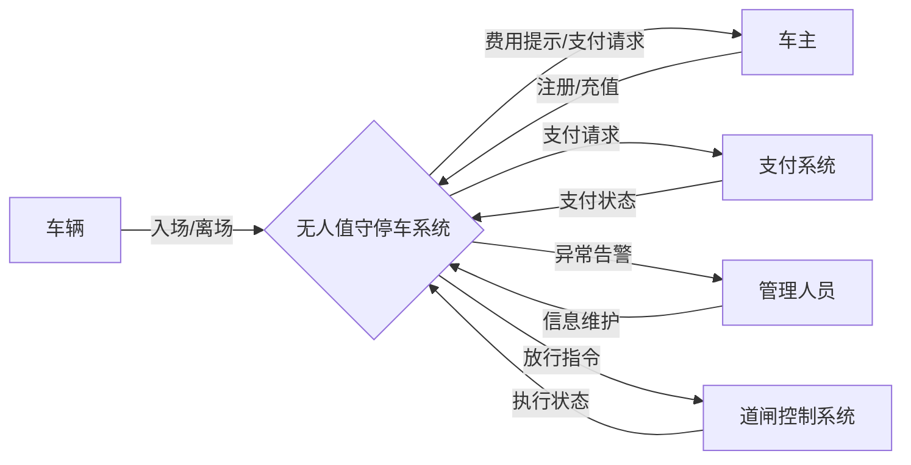
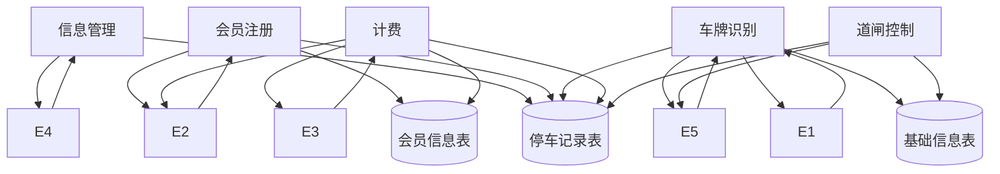
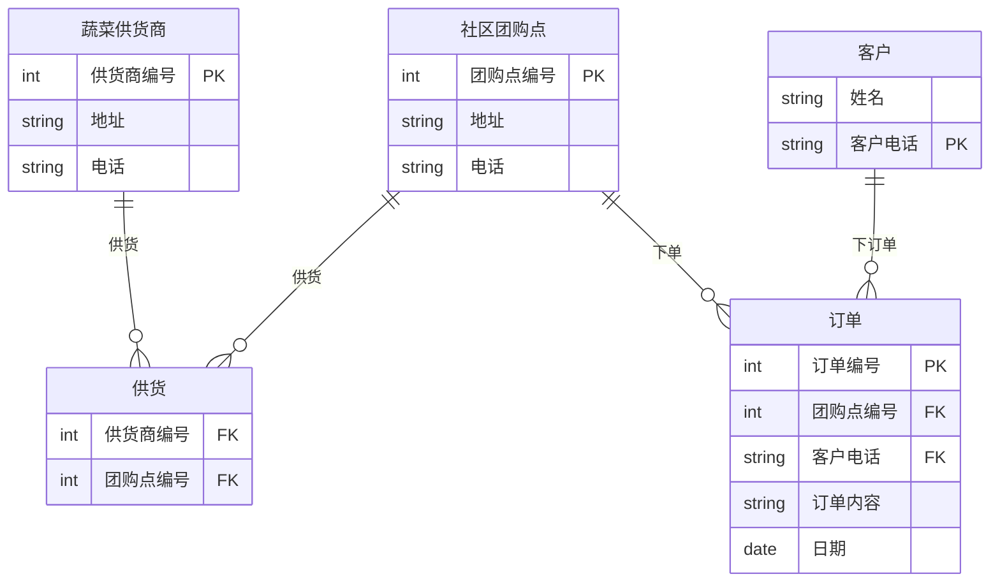
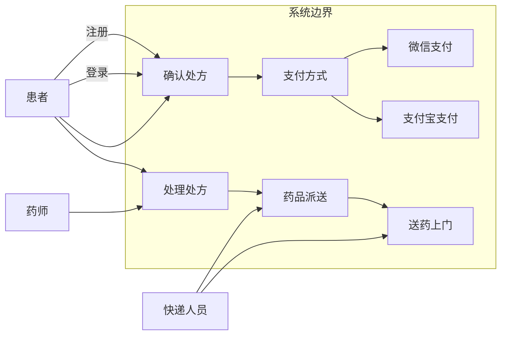
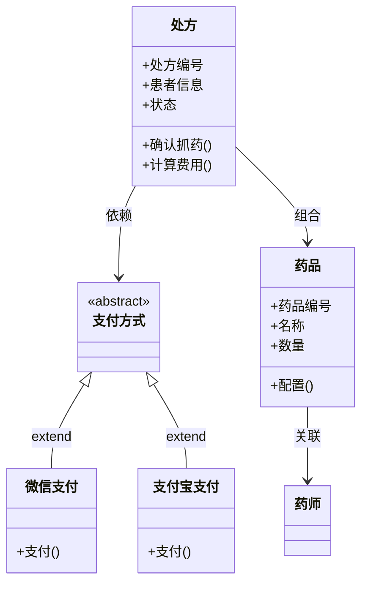
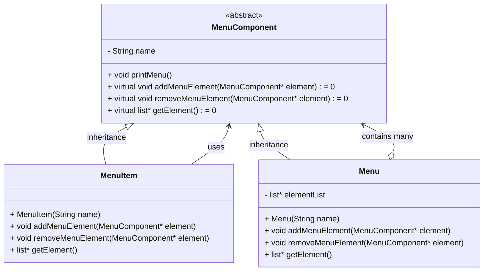
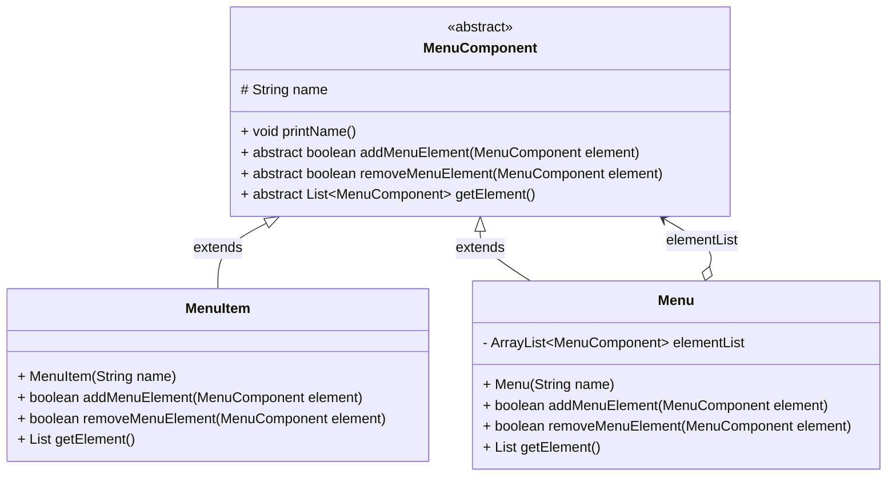
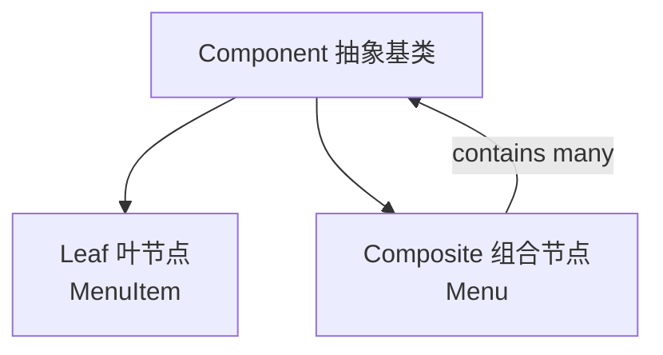
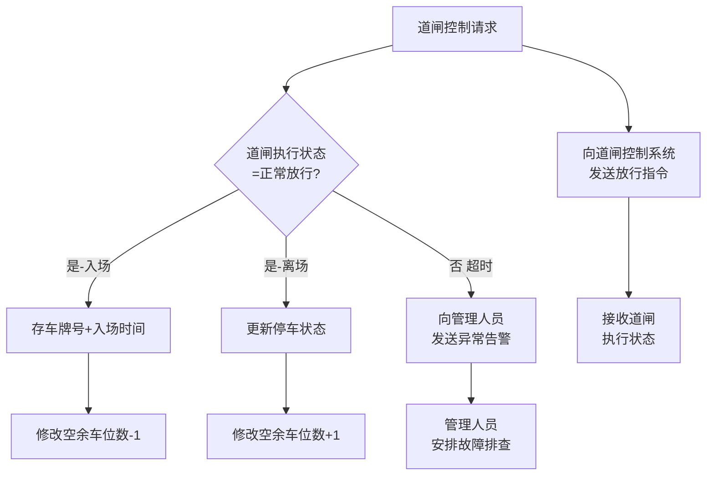
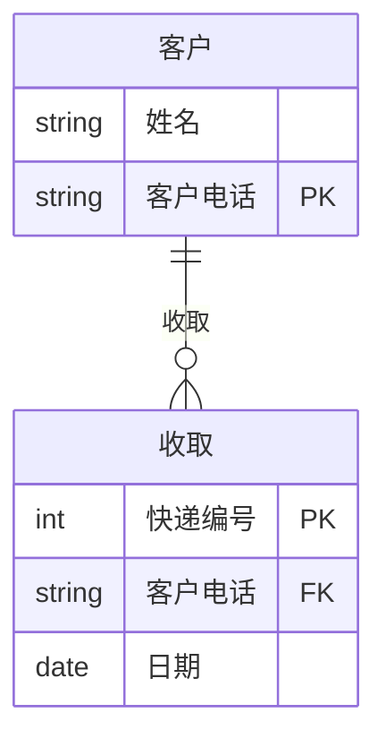

# 2021年上半年 软件设计师（中级）· 下午题案例分析

## 📋 速查目录（按题型 → 跳转）

| 题型 | 考点 | 考纲位置 |
|------|------|----------|
| 试题一 | 数据流图（DFD） | [[个人资料/笔记/软考/软件设计师-中级/知识点/07-软件工程|07-软件工程]] |
| 试题二 | ER 图 / 关系数据库设计 | [[个人资料/笔记/软考/软件设计师-中级/知识点/05-数据库系统|ER图]] |
| 试题三 | UML 用例图 & 类图 | [[个人资料/笔记/软考/软件设计师-中级/知识点/09-UML建模|09-UML建模]] |
| 试题四 | 算法设计（动态规划） | [[个人资料/笔记/软考/软件设计师-中级/知识点/04-数据结构与算法|动态规划]] |
| 试题五 | 设计模式（组合模式 C++） | [[个人资料/笔记/软考/软件设计师-中级/知识点/08-面向对象与设计模式|组合模式]] |
| 试题六 | 设计模式（组合模式 Java） | [[个人资料/笔记/软考/软件设计师-中级/知识点/08-面向对象与设计模式|组合模式]] |

---

## 试题一（15分）

阅读下列说明，回答问题1 至问题4，将解答填入答题纸的对应栏内。

### 【说明】

某停车场运营方为了降低运营成本，减员增效，提供良好的停车体验，欲开发无人值守停车系统，该系统的主要功能是：

1. **信息维护**。管理人员对车位（总数、空余车位数等）计费规则等基础信息进行设置。
2. **会员注册**。车主提供手机号、车牌号等信息进行注册，提交充值信息（等级、绑定并授权支付系统进行充值或交费的支付账号），不同级别和充值额度享受不同停车折扣点。
3. **车牌识别**。当车辆进入停车场时，若有（空余车位数大于1），自动识别车牌号后进行道闸控制，当车主开车离开停车场时，识别车牌号，计费成功后，请求道闸控制。
4. **计费**。更新车辆离场时间，根据计费规则计算出停车费用，若车主是会员，提示停车费用；若储存余额够本次停车费用，自动扣费，更新余额，若储值余额不足，自动使用授权缴费账号请求支付系统进行支付，获取支付状态。若非会员临时停车，提示停车费用，车主通过扫描费用信息中的支付码调用支付系统自助交费，获取支付状态。
5. **道闸控制**。根据道闸控制请求向道闸控制系统发送放行指令和接收道闸执行状态。若道闸执行状态为正常放行时，对入场车辆，将车牌号及其入场时间信息存入停车记录，修改空余车位数；对出场车辆更新停车状态，修改空余车位数。当因道闸重置系统出现问题（断网断电或是故障为抬杠等情况），而无法在规定的时间内接收到其返回的执行状态正常放行时，系统向管理人员发送异常告警信息，之后管理人员安排故障排查处理，确保车辆有序出入停车场。

现采用结构化方法对无人值守停车系统进行分析与设计，获得如图1-1 所示的上下文数据流图和图1-2 所示的0 层数据流图。

### 图1-1 上下文数据流图



### 图1-2 0层数据流图



### 【问题1】

使用说明中的词语，给出图1-1 中的实体E1-E5 的名称。

#### 作答区

```text

E1:
E2:
E3:
E4:
E5:
```

### 【问题2】

使用说明中的词语，给出图1-2 中的数据存储D1-D3 的名称。

#### 作答区

```text

D2:
D3:
```

### 【问题3】

根据说明和图中术语，补充图1-2 中缺失的数据流及其起点和终点。

#### 作答区

```text

数据流名称          起点 → 终点
```

### 【问题4】

根据说明，采用结构化语言对"道闸控制"的加工逻辑进行描述。

#### 作答区

```text

```

---

## 试题二（15分）

阅读下列说明，回答问题1 至问题3，将解答填入答题纸的对应栏内。

### 【说明】

某社区蔬菜团购网站，为规范商品收发流程，便于查询客户订单情况，需要开发一个信息系统。请根据下述需求描述完成该系统的数据库设计。

【需求描述】

（1）记录蔬菜供应商的信息，包括供应商编号、地址和一个电话。
（2）记录社区团购点的信息，包括团购点编号、地址和一个电话。
（3）记录客户信息，包括客户姓名和一个电话。客户可以在不同的社区团购点下订单，不直接与蔬菜供应商发生联系。
（4）记录客户订单信息，包括订单编号、团购点编号客户电话，订单内容和日期。

【概念模型设计】

根据需求阶段收集的信息，设计的实体联系图，如图2-1 所示。

### 图2-1 实体联系图（ER图）



【逻辑结构设计】

根据概念模型设计阶段完成的实体联系图，得出如下关系模式：

- 蔬菜供货商（供货商编号，地址，电话）
- 社区团购点（团购点编号，地址，电话）
- 供货（供货商编号，（a））
- 客户（姓名，客户电话）
- 订单（订单编号，团购点编号，（b），订单内容，日期）

### 【问题1】

根据问题描述，补充图 2-1 的实体联系图。

#### 作答区

```text

```

### 【问题2】

补充逻辑结构设计结果中的（a）、（b）两处空缺及完整性约束关系。

#### 作答区

```text

```

### 【问题3】

若社区蔬菜团购网站还兼有代收快递的业务，请增加新的"快递"实体，并给出客户实体和快递实体之间的"收取"联系，对图1 进行补充。"快递"关系模式包括快递编号、客户电话和日期。

#### 作答区

```text

```

---

## 试题三（15分）

阅读下列说明，回答问题1 至问题3，将解答填入答题纸的对应栏内。

### 【说明】

某中医医院拟开发一套线上抓药APP，允许患者凭借该医院医生开具的处方线上抓药，并提供免费送药上门服务。该系统的主要功能描述如下：

(1) **注册**。患者扫描医院提供的二维码进行注册，注册过程中，患者需提供其病历号，系统根据病历号自动获取患者基本信息。
(2) **登录**。已注册的患者可以登录系统进行线上抓药，未注册的患者系统拒绝其登陆。
(3) **确认处方**。患者登录后，可以查看医生开具的所有处方。患者选择需要抓药的处方和数量（需要抓几副药），同时说明是否需要煎制。选择取药方式：自行到店取药或者送药上门，若选择送药上门，患者需要提供收贷人姓名、联系方式和收货地址。系统自动计算本次抓药的费用，患者可以使用微信或支付宝等支付方式支付费用。支付成功之后，处方被发送给药师进行药品配制。
(4) **处理处方**。药师根据处方配置好药品，若患者要求煎制，药师对配置好的药品进行煎制。煎制完成，药师将对该处方设置已完成。若患者选择的是自行取药，取药后确认已取药。
(5) **药品派送**。处方完成后，对于选择送药上门的患者，系统将给快递人员发送药品的配置信息，等待快递人员来取药；并给患者发送收获验证码。
（6）**送药上门**。快递人员将配置好的药品送到患者指定的收货地址。患者收货时，向快递人员出示收货验证码，快递人员使用该验证码确认药品已送到。

### 图3-1 用例图



### 图3-2 类图



### 【问题1】

根据说明中的描述，给出图3-1 中A1~ A3 所对应的参与者名称和U1 ~U4 处所对应的用例名称。

#### 作答区

```text

A1:
A2:
A3:
U1:
U2:
U3:
U4:
```

### 【问题2】

根据说明中的描述，给出图3-2 中C1~C5 所对应的类名。

#### 作答区

```text

C1:
C2:
C3:
C4:
C5:
```

### 【问题3】

简要解释用例之间的include、extend 和generalize 关系的内涵。

#### 作答区

```text

```

---

## 试题四（15分）

阅读下列说明和C代码，回答问题1 和问题2，将解答填入答题纸的对应栏内。

### 【说明】

凸多边形是指多边形的任意两点的连线均落在多边形的边界或者内部。相邻的点连线落在多边形边上，称为边，不相邻的点连线落在多边形内部，称为弦。假设任意两点连线上均有权重，凸多边形最优三帮剂分问题定义为：求将凸多边形划分为不相交的三角形集合，且各三角形权重之和最小的剖分方案。每个三角形的权重为三条边权重之和。假设 $N$ 个点的凸多边形点编号为 $V_1,V_2,\ldots,V_N$，若在 $V_k$ 处将原凸多边形划分为一个三角形 $V_1V_kV_N$，以及两个子多边形 $V_1,V_2,\ldots,V_k$ 和 $V_k,V_{k+1},\ldots,V_N$，得到一个最优的剖分方案，则该最优剖分方案应该包含这两个子凸多边形的最优剖分方案。用 $\mathrm{m}[i][j]$ 表示 $V_{i-1},V_i,\ldots,V_j$ 构成的凸多边形的最优剖分方案的权重，$\mathrm{S}[i][j]$ 记录剖分该凸多边形的 $k$ 值。则递推公式为：

$$
\mathrm{m}[i][j] = \min_{i<k<j} \left\{ \mathrm{m}[i][k] + \mathrm{m}[k+1][j] + W_{j,i-1} + W_{k,j} + W_{j,i-1} \right\}
$$

其中，$W_{j,i-1}$ 等分别为该三角形三条边的权重。求解凸多边形的最优剖分方案，即求解最小剖分的权重及对应的三角形集。

### 【C代码】

```c
#include <stdio.h>
#define N 6

int m[N + 1][N + 1];
int s[N + 1][N + 1];
int W[N + 1][N + 1];

int get_triangle_weight(int a, int b, int c) {
    return W[a][b] + W[b][c] + W[c][a];
}

void triangle_partition() {
    int i, r, k, j;
    int temp;

    for (i = 1; i <= N; i++) {
        m[i][i] = 0;
    }

    for (r = 2; /* （1）________________ */; r++) {
        for (i = 1; i <= N - r + 1; i++) {
            /* （2）________________ */
            m[i][j] = m[i][i] + m[i + 1][j] + get_triangle_weight(i - 1, i, j);
            s[i][j] = i;
            for (k = i + 1; k < j; k++) {
                temp = m[i][k] + m[k + 1][j] + get_triangle_weight(i - 1, k, j);
                if (/* （3）________________ */) {
                    m[i][j] = temp;
                    s[i][j] = k;
                }
            }
        }
    }
}

void print_triangle(int i, int j) {
    if (i == j) return;
    print_triangle(i, s[i][j]);
    print_triangle(/* （4）________________ */);
    printf("V%d--V%d--V%d\n", i - 1, s[i][j], j);
}
```

### 【问题1】

根据说明和C代码，填充C代码中的空(1)~(4)。

#### 作答区

```c
/* （1） ______________________________ */
/* （2） ______________________________ */
/* （3） ______________________________ */
/* （4） ______________________________ */
```

### 【问题2】

根据说明和 C 代码，该算法采用的设计策略为(5)，算法的时间复杂度为(6)，空间复杂度为(7)（用 $O$ 表示）。

#### 作答区

```c
/* （5） ______________________________ */
/* （6） ______________________________ */
/* （7） ______________________________ */
```

---

## 试题五（15分）

阅读下列说明和C++代码，将应填入(n)处的字句写在答题纸的对应栏内。

### 【说明】

层叠买单是窗口风格的软件系统中经常采用的一种系统功能组织方式。层叠菜单（如到5-1 示例）中包含的可能是一个菜单项（直接对应某个功能），也可能是一个子菜单。现采用组合（Composite）设计模式实现层叠菜单，得到如图5-2 所示的类图。

### 图5-2 C++ 组合模式类图



### 【C++代码】

```cpp
#include <list>
#include <iostream>
#include <string>
using namespace std;

class MenuComponent {
/* （1）________________ */
    string name;
public:
    void printMenu() { cout << name; }
    /* （2）________________ */
    virtual void removeMenuElement(MenuComponent *element) = 0;
    /* （3）________________ */
};

class MenuItem : public MenuComponent {
public:
    MenuItem(string name) { this->name = name; }
    void addMenuElement(MenuComponent *element) { return; }
    void removeMenuElement(MenuComponent *element) { return; }
    list<MenuComponent*>* getElement() { return NULL; }
};

class Menu : public MenuComponent {
private:
    /* （4）________________ */
public:
    Menu(string name) { this->name = name; }
    void addMenuElement(MenuComponent *element) { elementList.push_back(element); }
    void removeMenuElement(MenuComponent *element) { elementList.remove(element); }
    list<MenuComponent*>* getElement() { return &elementList; }
};

int main() {
    MenuComponent *mainMenu = new Menu("Insert");
    MenuComponent *subMenu = new Menu("Chart");
    MenuComponent *element = new Menu("On This Sheet");
    /* （5）________________ */
    subMenu->addMenuElement(element);
    return 0;
}
```

### 【问题1】

(1):
(2):
(3):
(4):
(5):

#### 作答区

```cpp
/* （1） ______________________________ */
/* （2） ______________________________ */
/* （3） ______________________________ */
/* （4） ______________________________ */
/* （5） ______________________________ */
```

---

## 试题六（15分）

阅读下列说明和Java代码，将应填入（n）处的字句写在答题纸的对应栏内。

### 【说明】

层叠菜单是窗口风格的软件系统中经常采用的一种系统功能组织方式。层叠菜单（如图6-1 示例）中包含的可能是一个菜单项（直接对应某个功能），也可能是一个子菜单，现在采用组合（composite）设计模式实现层叠菜单，得到如图6-2所示的类图。

### 图6-2 Java 组合模式类图



### 组合模式说明



### 【Java代码】

```java
import java.util.*;

abstract class MenuComponent {
    /* （1）protected */ String name;

    public void printName() {
        System.out.println(name);
    }

    public /* （2）abstract boolean addMenuElement(MenuComponent element) */;

    public abstract boolean removeMenuElement(MenuComponent element);

    public /* （3）abstract List<MenuComponent> getElement() */;
}

class MenuItem extends MenuComponent {
    public MenuItem(String name) {
        this.name = name;
    }

    public boolean addMenuElement(MenuComponent element) {
        return false;
    }

    public boolean removeMenuElement(MenuComponent element) {
        return false;
    }

    public List<MenuComponent> getElement() {
        return null;
    }
}

class Menu extends MenuComponent {
    public /* （4）ArrayList<MenuComponent> elementList */;

    public Menu(String name) {
        this.name = name;
        this.elementList = new ArrayList<MenuComponent>();
    }

    public boolean addMenuElement(MenuComponent element) {
        return elementList.add(element);
    }

    public boolean removeMenuElement(MenuComponent element) {
        return elementList.remove(element);
    }

    public List<MenuComponent> getElement() {
        return elementList;
    }
}

class CompositeTest {
    public static void main(String[] args) {
        MenuComponent mainMenu = new Menu("Insert");
        MenuComponent subMenu = new Menu("Chart");
        MenuComponent element = new MenuItem("On This Sheet");
        /* （5）mainMenu.addMenuElement(subMenu) */
        subMenu.addMenuElement(element);
        printMenus(mainMenu);
    }

    private static void printMenus(MenuComponent ifile) {
        ifile.printName();
        List<MenuComponent> children = ifile.getElement();

        if (children == null) return;
        for (MenuComponent element : children) {
            printMenus(element);
        }
    }
}
```

### 【问题1】

(1):
(2):
(3):
(4):
(5):

#### 作答区

```java
/* （1） ______________________________ */
/* （2） ______________________________ */
/* （3） ______________________________ */
/* （4） ______________________________ */
/* （5） ______________________________ */
```

---

# 参考答案与解析

> 答案内容来自原答案 PDF；解析较少或缺失处已补充"解析"说明。若原 PDF 标为"暂缺"，此处保持暂缺并说明原因。

## 试题一

### 问题1

**答案：**

E1:车辆；E2:车主；E3:支付系统；E4:管理人员；E5:道闸控制系统

**解析：**

解题时先确定系统边界，再从题干中的动作发起者、接收者识别外部实体；数据存储通常对应"文件、表、记录"等持久化名词；缺失数据流则通过父图/子图平衡和加工输入输出一致性检查补齐。

### 问题2

**答案：**

**解析：**

解题时先确定系统边界，再从题干中的动作发起者、接收者识别外部实体；数据存储通常对应"文件、表、记录"等持久化名词；缺失数据流则通过父图/子图平衡和加工输入输出一致性检查补齐。

### 问题3

**答案：**

原答案 PDF 未提取到可用答案。

**解析：**

解析补充：该题应从题干约束、图示元素和答案中的关键词逐项对应，先完成直接匹配，再检查名称、方向和数量是否与题目要求一致。

### 问题4

**答案：**



**解析：**

解析补充：该题应从题干约束、图示元素和答案中的关键词逐项对应，先完成直接匹配，再检查名称、方向和数量是否与题目要求一致。

## 试题二

### 问题1

**答案：**

原答案 PDF 未提取到可用答案。

**解析：**

解析补充：该题应从题干约束、图示元素和答案中的关键词逐项对应，先完成直接匹配，再检查名称、方向和数量是否与题目要求一致。

### 问题2

**答案：**

（a）团购点编号。主键：供货商编号，团购点编号；外键：供货商编号，团购点编号。
（b）客户电话。主键：订单编号；外键：团购点编号，客户电话。

**解析：**

关系模式题先找实体及其标识属性，再按联系的基数决定外键放置位置；多对多联系通常需要独立关系，主键一般由参与实体主键组合而成。

### 问题3

**答案：**



**解析：**

解析补充：该题应从题干约束、图示元素和答案中的关键词逐项对应，先完成直接匹配，再检查名称、方向和数量是否与题目要求一致。

## 试题三

### 问题1

**答案：**

A1:患者；A2:快递人员；A3:药师
U1:确认处方；U2:支付方式；U3:微信支付；U4:支付宝支付（U3、U4 可以互换）

**解析：**

面向对象建模题要把题干名词映射到类或参与者，把动词短语映射到用例或操作；再根据图中继承、组合、依赖等关系校验名称和多重度。

### 问题2

**答案：**

C1: 支付方式；C2:微信支付；C3: 支付宝支付；C4:处方；C5: 药品（C2、C3 可以互换）

**解析：**

面向对象建模题要把题干名词映射到类或参与者，把动词短语映射到用例或操作；再根据图中继承、组合、依赖等关系校验名称和多重度。

### 问题3

**答案：**

**include**：是一种依赖关系，加了版型\<\<include>>，两个以上用例有共同功能，可分解到单独用例，其中这个提取出来的公共用例称为抽象用例，形成包含依赖；执行基本用例时，每次都必须调用被包含的用例。

**extend**：如果一个用例明显地混合了两种或两种以上的不同场景，即根据情况可能发生多种事情，可以断定将这个用例分为一个主用例和一个或多个辅用例进行描述可能更加清晰。

**generalize 泛化关系**：当多个用例共同拥有一种类似的结构和行为的时候，可以将它们的共性抽象成为父用例，其他的用例作为泛化关系中的子用例。在用例的泛化关系中，子用例是父用例的一种特殊形式，子用例继承了父用例所有的结构、行为和关系。

**解析：**

面向对象建模题要把题干名词映射到类或参与者，把动词短语映射到用例或操作；再根据图中继承、组合、依赖等关系校验名称和多重度。

## 试题四

### 问题1

**答案：**

（1）r<=N
（2）int j=i+r-1
（3）temp < m[i][j]（或 temp < m[i][j]）
（4）s[i][j]+1, j

**解析：**

算法题重点是维护状态含义和循环/递归不变式：动态规划看状态转移与边界，回溯看选择、撤销和剪枝条件，复杂度由状态数量或搜索树规模决定。

### 问题2

**答案：**

（5）动态规划法
（6）$O(n^3)$
（7）$O(n^2)$

**解析：**

算法题重点是维护状态含义和循环/递归不变式：动态规划看状态转移与边界，回溯看选择、撤销和剪枝条件，复杂度由状态数量或搜索树规模决定。

## 试题五

### 问题1

**答案：**

(1) protected
(2) virtual void addMenuElement(MenuComponent *element) = 0
(3) virtual list* getElement() = 0
(4) list<MenuComponent*> elementList
(5) mainMenu->addMenuElement(subMenu)

**解析：**

程序填空题先根据设计模式角色确定类之间的职责，再结合上下文类型、返回值和调用点补全声明或语句；若同一模式有 Java/C++ 两种写法，关键是保证抽象接口、具体类和客户端调用方向一致。

## 试题六

### 问题1

**答案：**

(1) protected;
(2) abstract boolean addMenuElement(MenuComponent element);
(3) abstract List<MenuComponent> getElement();
(4) ArrayList<MenuComponent> elementList;
(5) mainMenu.addMenuElement(subMenu);

**解析：**

程序填空题先根据设计模式角色确定类之间的职责，再结合上下文类型、返回值和调用点补全声明或语句；若同一模式有 Java/C++ 两种写法，关键是保证抽象接口、具体类和客户端调用方向一致。
