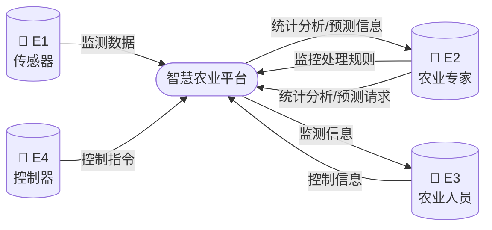
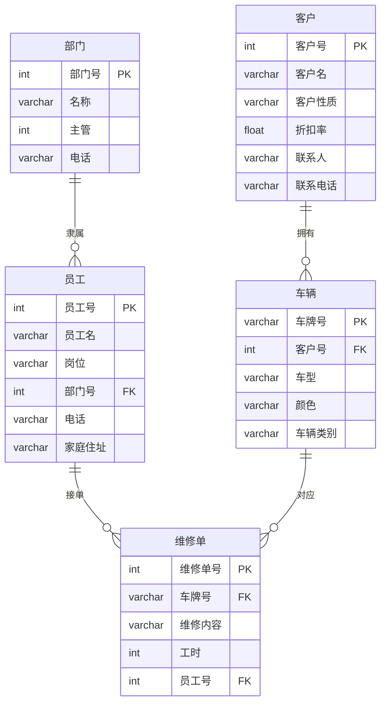
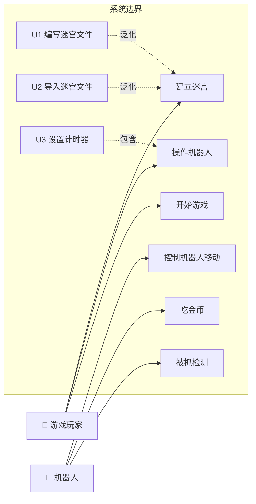

# 2021年下半年 软件设计师（中级）· 下午题案例分析

## 📋 速查目录（按题型 → 跳转）

| 题型 | 考点 | 考纲位置 |
|------|------|----------|
| 试题一 | 数据流图（DFD）分析与设计 | [[个人资料/笔记/软考/软件设计师-中级/知识点/07-软件工程|数据流图]] |
| 试题二 | ER 图、关系模式、数据库设计 | [[个人资料/笔记/软考/软件设计师-中级/知识点/05-数据库系统|ER图]] |
| 试题三 | UML 用例图与类图 | [[个人资料/笔记/软考/软件设计师-中级/知识点/09-UML建模|用例图]] |
| 试题四 | 动态规划算法（编辑距离） | [[个人资料/笔记/软考/软件设计师-中级/知识点/04-数据结构与算法|动态规划]] |
| 试题五 | 享元模式（C++） | [[个人资料/笔记/软考/软件设计师-中级/知识点/08-面向对象与设计模式|享元模式]] |
| 试题六 | 享元模式（Java） | [[个人资料/笔记/软考/软件设计师-中级/知识点/08-面向对象与设计模式|享元模式]] |

---

## 试题一（15分）

阅读下列说明，回答问题1 至问题4，将解答填入答题纸的对应栏内。
### 【说明】

某现代农业种植基地为进一步提升农作物种植过程的智能化，欲开发智慧农业平
台，集管理和销售于一体，该平台的主要功能有:
1.信息维护。农业专家对农作物、环境等监测数据的监控处理规则进行维护。
2.数据采集。获取传感器上传的农作物长势、土壤墒情、气候等连续监测数据，
解析后将监测信息进行数据处理、可视化和存储等操作。
3.数据处理。对实时监测信息根据监控处理规则进行监测分析，将分析结果进行
可视化并进行存储、远程控制对历史监测信息进行综合统计和预测，将预测信息
进行可视化和存储。
4.远程控制。根据监控处理规则对分析结果进行判定，依据判定结果自动对控制
器进行远程控制。平台也可以根据农业人员提供的控制信息对控制器进行远程控
制。
5.可视化。实时向农业人员展示监测信息:实时给农业专家展示统计分析结果和
预测信息或根据农业专家请求进行展示。 现采用结构化方法对智慧农业平台进
行分析与设计，获得如图1-1 所示的上下文数据流图和图1-2 所示的0 层数据流
图。

#### 图1-1 上下文数据流图



> **图1-1 说明**：E1 为监测数据的来源；E2 对规则进行维护并查看分析结果；E3 发送控制需求并查看监测信息；E4 接收控制指令。

### 【问题1】
使用说明中的词语，给出图1-1 中的实体E1~E4 的名称。

#### 作答区
```text

E1:传感器；
E2:农业专家；
E3:农业人员；
E4:控制器；

```

### 【问题2】
使用说明中的词语，给出图1-2 中的数据存储D1~D4 的名称。

#### 作答区
```text

D2:监测信息表；
D3:分析结果表；
D4:预测信息表；

```

### 【问题3】
根据说明和图中术语，补充图1-2 中缺失的数据流及其起点和终点。

#### 作答区
```text
（1）分析结果可视化：D4 -> P5；
（2）综合统计和预测：D2 -> P3；
（3）分析结果判定：D1 -> P4；
（4）展示预测信息：E2 -> P5。
```

### 【问题4】
根据说明，"数据处理"可以分解为哪些子加工?进一步进行分解时，需要注意
哪三种常见的错误?

#### 作答区
```text

"数据处理"的位置可以分解为：
（1）根据监控处理规则进行监测分析；
（2）分析结果可视化；
（3）分析结果存储；
（4）远程控制对历史监测信息综合统计；
（5）对历史监测信息预测；
（6）预测信息可视化；
（7）预测信息存储；

需要注意：数据库存储范式，子加工数据的输入输出问题，可视化展示；

```

---

## 试题二（15分）

阅读下列说明，回答问题1 至问题4，将解答填入答题纸的对应栏内。
### 【说明】

某汽车维修公司为了便于管理车辆的维修情况，拟开发一套汽车维修管理系统，
请根据下述需求描述完成该系统的数据库设计。
【需求描述】 (1)客户信息包括:客户号、客户名、客户性质、折扣率、联系人、
联系电话。客户性质有个人或单位。客户号唯一标识客户关系中的每一个元组。
(2)车辆信息包括:车牌号、车型、颜色和车辆类别。一个客户至少有一辆车，一
辆车只属于一个客户。
(3)员工信息包括:员工号、员工名、岗位、电话、家庭住址。其中，员工号唯一
标识员工关系中的每一个元组。岗位有业务员、维修工、主管。业务员根据车辆
的故障情况填写维修单。
(4)部门信息包括:部门号、名称、主管和电话，其中部门号唯一确定部门关系的
每一个元组。每个部门只有一名主管，但每个部门有多名员工，每名员工只属于
一个部门。
(5)维修单信息包括:维修单号、车牌号、维修内容、工时。维修单号唯一标识维
修单关系中的每一个元组。一个维修工可接多张维修单，但一张维修单只对应一
个维修工。
【概念模型设计】根据需求阶段收集的信息，设计的实体联系图(不完整)如图2-1
所示

#### 图2-1 实体联系图（ER 图）



> **图2-1 说明**：联系1（客户-车辆）1:n；联系2（部门-员工）1:n；联系3（维修工-维修单）1:n。

【逻辑结构设计】
根据概念模型设计阶段完成的实体联系图，得出如下关系模式(不完整):
客户(客户号，客户名，(a);折扣率，联系人，联系电话)
车辆(车牌号，(b)，车型，颜色，车辆类别)
员工(员工号，员工名，岗位，(c)，电话，家庭住址)
部门(部门号，名称，主管，电话)
维修单(维修单号，(d)，维修内容，工时)
### 【问题1】
根据问题描述，补充3 个联系，完善图2-1 的实体联系图。联系名可用联系1、
联系2 和联系3 代替，联系的类型为1:1、1:n 和m:n(或1:1、1:*和*.*)。

#### 作答区
```text

联系1:客户-车辆：1:n；
联系2:部门-员工：1:n；
联系3:维修工-维修单：1:n。

```

### 【问题2】
根据题意，将关系模式中的空(a)~(d)的属性补充完整，并填入答题纸对应的位
置上。

#### 作答区
```text

（a）：客户性质；
（b）：客户号；
（c）：部门号；
（d）：车牌号；

```

### 【问题3】
分别给出车辆关系和维修单关系的主键与外键。

#### 作答区
```text

主键：
车辆：车牌号；
维修单：维修单号；
外键：
车辆：客户号；
维修单：车牌号。

```

### 【问题4】
如果一张维修单涉及多项维修内容，需要多个维修工来处理，那么哪个联系类型
会发生何种变化?你认为应该如何解决这一问题?

#### 作答区
```text

如果一张维修单对应多项维修内容，需要多个维修工来处理，那么维修单信息的联系类型将会发生变化：
维修单号将不再具有唯一性，一个维修单号将会对应了多名维修工和维修内容。
将维修单号和维修内容设置为联合主键。

```

---

## 试题三（15分）

阅读下列说明，回答问题1 至问题3，将解答填入答题纸的对应栏内。
### 【说明】

某游戏公司欲开发一款吃金币游戏。游戏的背景为一种回廊式迷宫(Maze),在迷
宫的不同位置上设置有墙。迷宫中有两种类型的机器人(Robos):小精灵(PacMan)
和幽灵(Ghost)。游戏的目的就是控制小精灵在迷宫内游走，吞吃迷宫路径上的
金币，且不能被幽灵抓到。幽灵在迷宫中游走，并会吃掉遇到的小精灵。机器人
游走时，以单位距离的倍数计算游走路径的长度。当迷宫中至少存在一个小精灵
和一个幽灵时，游戏开始。
机器人上有两种传感器，使机器人具有一定的感知能力。这两种传感器分别是:
(1)前向传感器(FrontSensor)，探测在机器人当前位置的左边、右边和前方是否
有墙(机器人遇到墙时，必须改变游走方向)。机器人根据前向传感器的探测结果，
决定朝哪个方向运动。
(2)近距离传感器(ProxiSesor),探测在机器人的视线范围内(正前方)是否存在
隐藏的金币或幽灵。近距离传感器并不报告探测到的对象是否正在移动以及朝哪
个方向移动。但是如果近距离传感器的连续两次探测结果表明被探测对象处于不
同的位置，则可以推导出该对象在移动。
另外，每个机器人都设置有一个计时器(Timer),用于支持执行预先定义好的定时
事件。
机器人的动作包括:原地向左或向右旋转90°;向前或向后移动。
建立迷宫:用户可以使用编辑器(Editor) 编写迷宫文件，
建立用户自定义的迷宫。将迷宫文件导入游戏系统建立用户自定义的迷宫
现采用面对家分析与设计方法开发该游戏，得到如图3-1 所示的用例图以及图
3-2 所示的初始类图。

#### 图3-1 用例图



> **图3-1 说明**：游戏玩家参与建立迷宫、操作机器人、开始游戏等用例；机器人参与控制移动、吃金币、被抓检测等用例。

### 【问题1】
根据说明中的描述，给出图3-1 中U1~U3 所对应的用例名。

#### 作答区
```text

U1:编写迷宫文件；
U2:导入迷宫文件；
U3:设置计时器。

```

### 【问题2】
图3-1 中用例U1~U3分别与哪个(哪些)用例之间有关系，是何种关系?

#### 作答区
```text

U1、U2与"建立迷宫"有关系，为泛化关系；
U3与"操作机器人"有关系，为包含关系。

```

### 【问题3】
根据说明中的描述，给出图3-2 中C1~C8 所对应的类名。

#### 作答区
```text

C1:机器人(Robos)；C2:计时器(Timer)；C3:小精灵(PacMan)；C4:幽灵(Ghost)；C5:传感器(Sensor)；C6:前向传感器(FrontSensor)；C7:近距离传感器(ProxiSensor)；C8:迷宫(Maze)。

```

---

## 试题四（15分）

阅读下列说明和C代码，回答问题1 至问题3，将解答填入答题纸的对应栏内。
### 【说明】

生物学上通常采用编辑距离来定义两个物种 DNA 序列的相似性，从而刻画物种之
间的进化关系。具体来说，编辑距离是指将一个字符串变换为另一个字符串所需
要的最小操作次数。操作有三种，分别为：插入一个字符、删除一个字符以及将
一个字符修改为另一个字符。用字符数组 $\mathrm{str1}$ 和 $\mathrm{str2}$
分别表示长度为 $\mathrm{len1}$ 和 $\mathrm{len2}$ 的字符串，用二维数组
$\mathrm{d}$ 记录求解编辑距离的子问题最优解，则
该二维数组可以递归定义为:

#### 编辑距离递归公式

$$
d[i][j] = \min\begin{cases}
d[i-1][j] + 1 & \text{（删除 str1[i-1]）} \\
d[i][j-1] + 1 & \text{（插入 str2[j-1]）} \\
d[i-1][j-1] + \text{diff}(i,j) & \text{（替换或相等）}
\end{cases}
$$

其中 $\text{diff}(i,j) = 0$ 当 $\mathrm{str1[i-1]} = \mathrm{str2[j-1]}$，否则 $\text{diff}(i,j) = 1$。

#### 图片代码转写（编辑距离 C 代码，空位保留）
```c
#include <stdio.h>
#define N 100

char A[N] = "CTGA";
char B[N] = "ACGCTA";
int d[N][N];

int min(int a, int b) {
    return a < b ? a : b;
}

int editdistance(char *str1, int len1, char *str2, int len2) {
    int i, j;
    int diff;
    int temp;

    for (i = 0; i <= len1; i++) {
        d[i][0] = i;
    }

    for (j = 0; j <= len2; j++) {
        /* （1）________________ */;
    }

    for (i = 1; i <= len1; i++) {
        for (j = 1; j <= len2; j++) {
            if (/* （2）________________ */) {
                d[i][j] = d[i - 1][j - 1];
            } else {
                temp = min(d[i - 1][j] + 1, d[i][j - 1] + 1);
                d[i][j] = min(temp, /* （3）________________ */);
            }
        }
    }

    return /* （4）________________ */;
}
```

### 【问题1】
根据说明扣C 代器，填充C 代期中的空(1)~(4)的。

#### 作答区
```c
/* （1） ______________________________ */
/* （2） ______________________________ */
/* （3） ______________________________ */
/* （4） ______________________________ */
```

### 【问题2】
根据说明和 C 代码，算法采用了(5)设计策略，时间复杂度为(6)（用 $O$ 符号表示，
两个字符串的长度分别用 $m$ 和 $n$ 表示）。

#### 作答区
```text
（5）：
（6）：
```

### 【问题3】
已知两个字符串 $A = \text{"CTGA"}$ 和 $B = \text{"ACGCTA"}$，根据说明和 C 代码，可得出这两个字符
串的编辑距离为(7)。
从下列的 2 道试题（试题五至试题六）中任选 1 道解答。
如果解答的试题数超过 1 道，则题号小的 1 道解答有效。

#### 作答区
```text
（7）：
```

---

## 试题五（15分）

阅读下列说明和C++代码，将应填入(n)处的字句写在答题纸的对应栏内。
### 【说明】

享元(flyweight)模式主要用于减少创建对象的数量,以降低内存占用,提高性能。
现要开发-一个网络围棋程序，允许多个玩家联机下棋。由于只有一台服务器,为
节省内存空间,采用享元模式实现该程序,得到如图5-1 所示的类图。
【C++代码】

#### 图片代码转写（C++，可编辑版）
```cpp
#include <iostream>
#include <string>
#include <vector>
using namespace std;

enum PieceColor { BLACK, WHITE };

class PiecePos {
private:
    int x;
    int y;
public:
    PiecePos(int a, int b) : x(a), y(b) {}
    int getX() { return x; }
    int getY() { return y; }
};

class Piece {
protected:
    PieceColor m_color;
    PiecePos m_pos;
public:
    Piece(PieceColor color, PiecePos pos) : m_color(color), m_pos(pos) {}
    /* （1）________________ */;
};

class BlackPiece : public Piece {
public:
    BlackPiece(PieceColor color, PiecePos pos) : Piece(color, pos) {}
    void Draw() { cout << "draw a black piece" << endl; }
};

class WhitePiece : public Piece {
public:
    WhitePiece(PieceColor color, PiecePos pos) : Piece(color, pos) {}
    void Draw() { cout << "draw a white piece" << endl; }
};

class PieceBoard {
private:
    vector</* （2）________________ */> m_vecPiece;
    string m_blackName;
    string m_whiteName;

public:
    PieceBoard(string black, string white)
        : m_blackName(black), m_whiteName(white) {}

    void setPiece(PieceColor color, PiecePos pos) {
        /* （3）________________ */ piece = NULL;
        if (color == BLACK) {
            piece = new BlackPiece(color, pos);
            cout << m_blackName << "在位置(" << pos.getX() << ", " << pos.getY() << ")";
            /* （4）________________ */;
        } else {
            piece = new WhitePiece(color, pos);
            cout << m_whiteName << "在位置(" << pos.getX() << ", " << pos.getY() << ")";
            /* （5）________________ */;
        }
        m_vecPiece.push_back(piece);
    }
};
```

### 【问题1】
(1):
(2):
(3):
(4):
(5):

#### 作答区
```cpp
/* （1） ______________________________ */
/* （2） ______________________________ */
/* （3） ______________________________ */
/* （4） ______________________________ */
/* （5） ______________________________ */
```

## 试题六（15分）

阅读下列说明和Java代码，将应填入（n）处的字句写在题纸的对应栏内。
### 【说明】

享元（flyweight）模式主要用于减少创建对象的数量，以低内存占用，提高性
能。现要开发一个网络围棋程序允许多个玩家联机下棋。由于只有一台服务器，
为节内存空间，采用享元模式实现该程序，得到如图6-1 所的类图。
### 【Java代码】

#### 图片代码转写（Java，棋子类定义，空位保留）
```java
import java.util.*;

enum PieceColor {
    BLACK, WHITE
}

class PiecePos {
    private int x;
    private int y;

    public PiecePos(int a, int b) {
        x = a;
        y = b;
    }

    public int getX() {
        return x;
    }

    public int getY() {
        return y;
    }
}

abstract class Piece {
    protected PieceColor m_color;
    protected PiecePos m_pos;

    public Piece(PieceColor color, PiecePos pos) {
        m_color = color;
        m_pos = pos;
    }

    /* （1）________________ */;
}

class BlackPiece extends Piece {
    public BlackPiece(PieceColor color, PiecePos pos) {
        super(color, pos);
    }

    public void draw() {
        System.out.println("draw a black piece");
    }
}

class WhitePiece extends Piece {
    public WhitePiece(PieceColor color, PiecePos pos) {
        super(color, pos);
    }

    public void draw() {
        System.out.println("draw a white piece");
    }
}

class PieceBoard {
    private static final ArrayList</* （2）________________ */> m_arrayPiece
        = new ArrayList<>();
    private String m_blackName;
    private String m_whiteName;

    public PieceBoard(String black, String white) {
        m_blackName = black;
        m_whiteName = white;
    }

    public void setPiece(PieceColor color, PiecePos pos) {
        /* （3）________________ */ piece = null;
        if (color == PieceColor.BLACK) {
            piece = new BlackPiece(color, pos);
            System.out.println(m_blackName + "在位置(" + pos.getX() + ", " + pos.getY() + ")");
            /* （4）________________ */;
        } else {
            piece = new WhitePiece(color, pos);
            System.out.println(m_whiteName + "在位置(" + pos.getX() + ", " + pos.getY() + ")");
            /* （5）________________ */;
        }
        m_arrayPiece.add(piece);
    }
}
```

### 【问题1】
(1):
(2):
(3):
(4):
(5):

#### 作答区
```java
/* （1） ______________________________ */
/* （2） ______________________________ */
/* （3） ______________________________ */
/* （4） ______________________________ */
/* （5） ______________________________ */
```

---

# 参考答案与解析

> 答案内容来自原答案 PDF；解析较少或缺失处已补充"解析"说明。若原 PDF 标为"暂缺"，此处保持暂缺并说明原因。

## 试题一

### 问题1

**答案：**

E1:传感器;E2:农业专家;E3:农业人员;E4:控制器

**解析：**

解题时先确定系统边界，再从题干中的动作发起者、接收者识别外部实体；数据存储通常对应"文件、表、记录"等持久化名词；缺失数据流则通过父图/子图平衡和加工输入输出一致性检查补齐。

### 问题2

**答案：**

**解析：**

解题时先确定系统边界，再从题干中的动作发起者、接收者识别外部实体；数据存储通常对应"文件、表、记录"等持久化名词；缺失数据流则通过父图/子图平衡和加工输入输出一致性检查补齐。

### 问题3

**答案：**

起点D1，终点P4，规则起点E2，终点P5，请求
起点D3, 终点P5，分析结果
起点D4，终点P5，预测信息

**解析：**

解题时先确定系统边界，再从题干中的动作发起者、接收者识别外部实体；数据存储通常对应"文件、表、记录"等持久化名词；缺失数据流则通过父图/子图平衡和加工输入输出一致性检查补齐。

### 问题4

**答案：**

数据处理加工分为数据分析，可视化与存储;
黑洞、奇迹、灰洞

**解析：**

解析补充：该题应从题干约束、图示元素和答案中的关键词逐项对应，先完成直接匹配，再检查名称、方向和数量是否与题目要求一致。

## 试题二

### 问题1

**答案：**

联系1:客户和车辆，1:n
联系2:部门和员工，1:n
联系3:维修工和维修单，1:n

**解析：**

解析补充：该题应从题干约束、图示元素和答案中的关键词逐项对应，先完成直接匹配，再检查名称、方向和数量是否与题目要求一致。

### 问题2

**答案：**

a:客户性质 b:客户号c:部门号d:车牌号，员工号

**解析：**

解析补充：该题应从题干约束、图示元素和答案中的关键词逐项对应，先完成直接匹配，再检查名称、方向和数量是否与题目要求一致。

### 问题3

**答案：**

车辆关系的主键:(车辆号，客户号)外键:客户号
维修单关系的主键:维修单号外键:车牌号，员工号

**解析：**

关系模式题先找实体及其标识属性，再按联系的基数决定外键放置位置；多对多联系通常需要独立关系，主键一般由参与实体主键组合而成。

### 问题4

**答案：**

维修工和维修单之间的联系类型会发生变化，从1:n 变成m:n。

**解析：**

解析补充：该题应从题干约束、图示元素和答案中的关键词逐项对应，先完成直接匹配，再检查名称、方向和数量是否与题目要求一致。

## 试题三

### 问题1

**答案：**

U1 编写迷宫文件 U2 导入迷宫文件;U3 设置计时器

**解析：**

面向对象建模题要把题干名词映射到类或参与者，把动词短语映射到用例或操作；再根据图中继承、组合、依赖等关系校验名称和多重度。

### 问题2

**答案：**

U1 和U2 与建立迷宫用例是泛化关系;U3 与操作机器人是包含关系

**解析：**

面向对象建模题要把题干名词映射到类或参与者，把动词短语映射到用例或操作；再根据图中继承、组合、依赖等关系校验名称和多重度。

### 问题3

**答案：**

C1 机器人(Robos);
C2 计时器(Timer);
C3 小精灵(PacMan);
C4 幽灵(Ghost)
C5 传感器
C6 前向传感器(FrontSensor)
C7 近距离传感器(ProxiSesor)
C8 迷宫(Maze)
其中C3 与C4 可换;C6 与C7 可换

**解析：**

面向对象建模题要把题干名词映射到类或参与者，把动词短语映射到用例或操作；再根据图中继承、组合、依赖等关系校验名称和多重度。

## 试题四

### 问题1

**答案：**

d[0][j]=j (2)str1[i-1]==str2[j-1] (3)d[i-1][j-1]+1 (4) d[len1][len2]

**解析：**

算法题重点是维护状态含义和循环/递归不变式：动态规划看状态转移与边界，回溯看选择、撤销和剪枝条件，复杂度由状态数量或搜索树规模决定。

### 问题2

**答案：**

动态规划法O(m*n)

**解析：**

算法题重点是维护状态含义和循环/递归不变式：动态规划看状态转移与边界，回溯看选择、撤销和剪枝条件，复杂度由状态数量或搜索树规模决定。

### 问题3

**答案：**

4

**解析：**

解析补充：该题应从题干约束、图示元素和答案中的关键词逐项对应，先完成直接匹配，再检查名称、方向和数量是否与题目要求一致。

## 试题五

### 问题1

**答案：**

(1) virtual void Draw(){}
(2) Piece*
(3) Piece *
(4) piece->Draw()
(5) piece->Draw()

**解析：**

程序填空题先根据设计模式角色确定类之间的职责，再结合上下文类型、返回值和调用点补全声明或语句；若同一模式有 Java/C++ 两种写法，关键是保证抽象接口、具体类和客户端调用方向一致。

## 试题六

### 问题1

**答案：**

(1)public abstract void draw()
(2)Piece
(3)Piece
(4)piece.draw()
(5)piece.draw()

**解析：**

程序填空题先根据设计模式角色确定类之间的职责，再结合上下文类型、返回值和调用点补全声明或语句；若同一模式有 Java/C++ 两种写法，关键是保证抽象接口、具体类和客户端调用方向一致。
