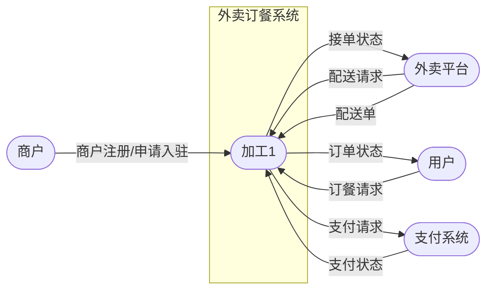
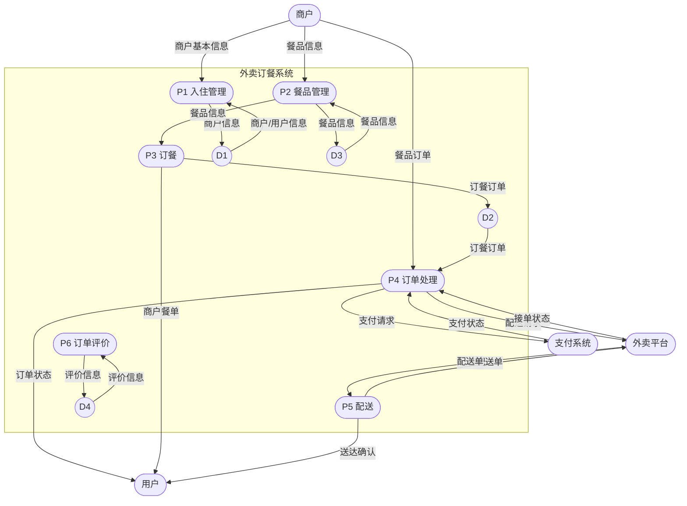
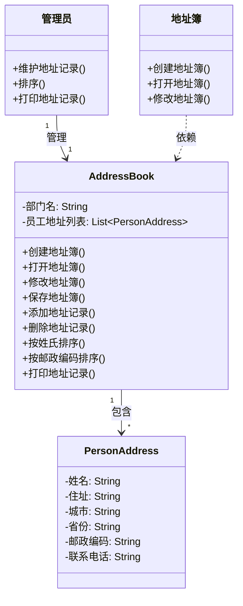
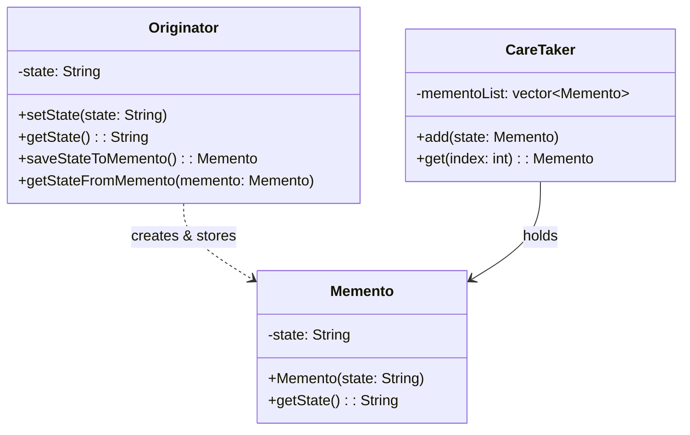
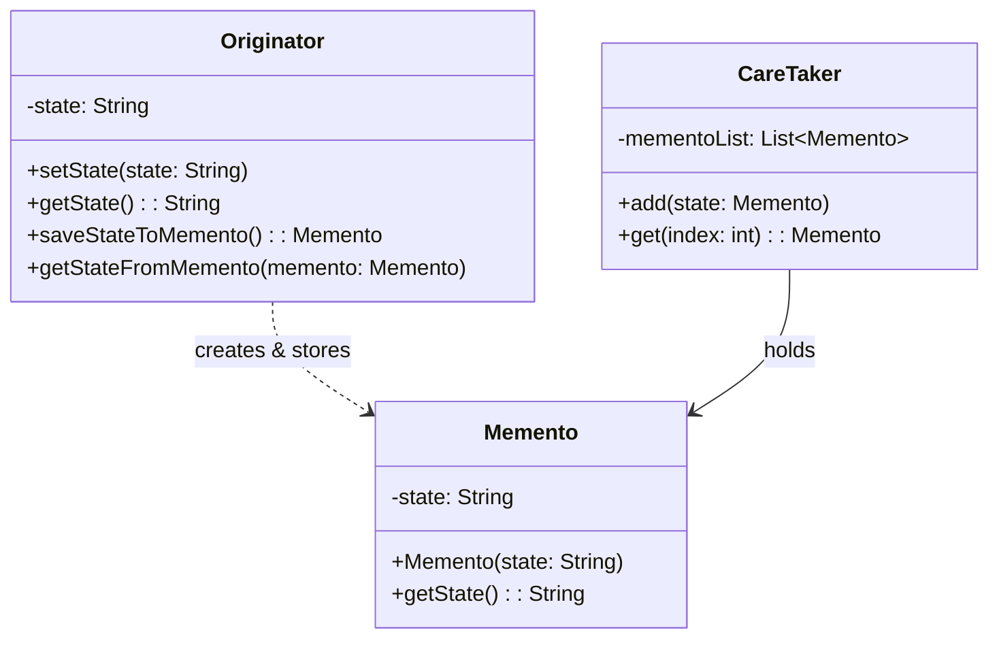

# 2022年上半年 软件设计师（中级）· 下午题案例分析

## 📋 速查目录（按题型 → 跳转）

| 题型 | 考点 | 考纲位置 |
|------|------|----------|
| 试题一 | 数据流图（DFD）、结构化语言 | [[个人资料/笔记/软考/软件设计师-中级/知识点/07-软件工程|数据流图]] |
| 试题二 | ER 图、关系模式、主键外键 | [[个人资料/笔记/软考/软件设计师-中级/知识点/05-数据库系统|ER图]] |
| 试题三 | UML 用例图、类图、include/extend | [[个人资料/笔记/软考/软件设计师-中级/知识点/09-UML建模|09-UML建模]] |
| 试题四 | 动态规划、矩阵链乘、C 代码 | [[个人资料/笔记/软考/软件设计师-中级/知识点/04-数据结构与算法|动态规划]] |
| 试题五 | 设计模式（Memento）、C++ | [[个人资料/笔记/软考/软件设计师-中级/知识点/08-面向对象与设计模式|备忘录模式]] |
| 试题六 | 设计模式（Memento）、Java | [[个人资料/笔记/软考/软件设计师-中级/知识点/08-面向对象与设计模式|备忘录模式]] |

---

## 试题一（15分）

阅读下列说明，回答问题1 至问题3，将解答填入答题纸的对应栏内。
### 【说明】

某公司欲开发一款外卖订餐系统，集多家外卖平台和商户为一体，为用户提供在
线浏览餐品、订餐和配送等服务。该系统的主要功能是：
1.入驻管理。用户注册:商户申请入驻，设置按时间段接单数量阅值等。系统存
储商户/用户信息。
2.餐品管理。商户对餐品的基本信息和优惠信息进行发布、修改、删除。系统存
储相关信息。
3.订餐。用户浏览商户餐单，选择餐品及数量后提交订餐请求。系统存储订餐订
单。
4.订单处理。收到订餐请求后，向外卖平台请求配送。外卖平台接到请求后发布
配送单，由平台骑手接单，外卖平台根据是否有骑手接单返回接单状态。若外卖
平台接单成功，系统给支付系统发送支付请求，接收支付状态。支付成功，更新
订单状态为已接单，向商户发送订餐请求并由商户打印订单，给用户发送订单状
态:若支付失败，更新订单状态为下单失败，向外卖平台请求取消配送，向用户
发送下单失败。若系统接到外卖平台返回接单失败或超时未返回接单状态，则更
新订单状态为下单失败，向用户发送下单失败。
5.配送。商户备餐后，由骑手取餐配送给用户。送达后由用户扫描骑手出示的订
单上的配送码后确认送达，订单状态更改为已送达，并发送给商户。
6.订单评价。用户可以对订单餐品、骑手配送服务进行评价，推送给对应的商户、
所在外卖平台，商户和外卖平台对用户的评价进行回复。系统存储评价。现采用
结构化方法对外卖订餐系统进行分析与设计，获得如图1-1 所示的上下文数据。

**图1-1 上下文数据流图**



**图1-2 0 层数据流图**



### 【问题1】
使用说明中的词语，给出图1-1 的实体E1~E4 的名称。

#### 作答区
```text

E1:商户；
E2:外卖平台；
E3:用户；
E4:支付系统。

```

### 【问题2】
使用说明中的词语，给出图1-2 中的数据存储D1-D4 的名称。

#### 作答区
```text

D2:订餐订单表；
D3:餐品基本信息和优惠信息表；
D4:评价信息表；

```

### 【问题3】
根据说明和图中术语，补充图1-2 中缺失的数据流及其起点和终点。

#### 作答区
```text

（1）商户基本信息：E1 -> P1；
（2）商户餐单：D3 -> E3；
（3）餐品订单：E1 -> P4;

```

### 【问题4】
根据说明，采用结构化语言对"订单处理"的加工逻辑进行描述。

#### 作答区
```text

IF(订单请求):
	配送订单 = new 订单
	POST(配送订单, 外卖平台)
	IF(GET(外卖平台.配送订单)):
		IF(POST(配送订单, 支付平台))
			IF(GET(支付平台.配送订单)):
				DELIVER(配送订单)
			ELSE:
				CANCEL(外卖平台.配送订单)
		ELSE:
			CANCEL(用户,"下单失败")
	ELSE:
		CANCEL(外卖平台,"接单失败")
ELSE:
	PASS

```

## 试题二（15分）

阅读下列说明，回答问题1 至问题3，将解答填入答题纸的对应栏内。
### 【说明】

为了提高接种工作，提高效率，并未了抗击疫情提供疫苗接种数据支撑，需要开发一个信息系统，下述需求完成该系统的数据库设计。
(1)记录疫苗供应商的信息，包括供应商名称，地址和一个电话。
(2)记录接种医院的信息，包括医院名称、地址和一个电话。
(3)记录接种者个人信息，包括姓名、身份证号和一个电话。
(4)记录接种者疫苗接种信息，包括接种医院信息，被接种者信息，疫苗供应商
名称和接种日期，为了提高免疫力，接种者可能需要进行多次疫苗接种，(每天最多接种一次，每次都可以在全市任意一家医院进行疫苗接种)。
【概念模型设计】
根据概念模型设计阶段完成的实体联系图，得出如下关系模式(不完整)：

**图2-1 实体联系图（ER 图）**

```mermaid
erDiagram
    供应商 {
        供应商名称 PK
        地址
        电话
    }

    医院 {
        医院名称 PK
        地址
        电话
    }

    被接种者 {
        身份证号 PK
        姓名
        电话
    }

    供货 {
        供应商名称 FK
        医院名称 FK
        供货内容
    }

    接种 {
        接种者身份证号 FK
        医院名称 FK
        供应商名称 FK
        接种日期
    }

    供应商 ||--o{ 供货 : "供货"
    医院 ||--o{ 供货 : "供货"
    被接种者 ||--o{ 接种 : "接种"
    医院 ||--o{ 接种 : "接种"
    供应商 ||--o{ 接种 : "供应"
```

【逻辑结构设计】
根据概念模型设计阶段完成的实体联系图，得出如下关系模式(不完整)：
供应商(供应商名称、地址、电话)
医院(医院名称、地址、电话)
供货(供应商名称，(a)，供货内容)
被接种者(姓名、身份证号、电话)
接种(接种者身份证号，(b)，医院名称、供应商名称)
### 【问题1】
根据问题描述，补充图2-1 的实体联系图(不增加新的实体)。

#### 作答区
> **图2-1 ER 图已转为上方 mermaid erDiagram，详见上方。**

### 【问题2】
补充逻辑结构设计结果中的(a)(b)两处空缺，并标注主键和外健完整性约束。

#### 作答区
```text

（a）：医院名称；
（b）：接种日期；

主键：
供应商：供应商名称；
医院：医院名称；
供货：供应商名称，医院名称；
被接种者：身份证号；
接种：接种者身份证号，接种日期。
外键：
接种：医院名称，供应商名称。

```

### 【问题3】
若医院还兼有核酸检测的业务，检测时可能需要进行多次植酸检测(每天最多检测一次)，但每次都可以在全市任意一家医院进行检测。
请在图2-1 中增加"被检测者"、实体及相应的属性。医院与被检测者之间的"检测"联系及必要的属性，并给出新增加的关系模式。
"被检测者"实体包括姓名、身份证号、地址和一个电话。"检测"联系需要包括检测日期和检测结果等。

#### 作答区
> **图2-1 扩展 ER 图（新增被检测者/检测）已转为上方 mermaid erDiagram。**

新增关系模式：
```text
被检测者（身份证号，姓名，地址，电话）
检测（被检测者身份证号，医院名称，检测日期，检测结果）
```

## 试题三（15分）

阅读下列说明，回答问题1 至问题3，将解答填入答题纸的对应栏内。
### 【说明】

某公司的人事能门拥有一个地址簿(AddressBookSystem)，管理系统
(addressBookSystem)，用于管理公司所有员工的地址记录(PersonAddress)。员工的地址记录包括：姓名、住址、城市、省份、邮政编码以及联系电话等等信息。
管理员可以完成对地址簿中地址记录的管理操作，包括：
(1)维护地址记录。根据司的人员变动情况，对地址记录进行添加、修改、删除等操作;
(2)排序。按照员工姓氏的字典顺序或邮政编码对址领中的所有记录。
(3)打印地址记录。以邮件标签的格式打印一个地址单独的地址簿。
系统会记录管理为便于管理，管理员在系统中为公可的不同部门建立员对每个地址簿的修改操作，包括：
(1)创建地址簿。新建个地址簿并保存。
(2)打开地址簿。打开一一个已有的地址簿。
(3)修改地址簿。对打开的地址簿进行修改并保存
系统将提供一个GUI(图形用户界面)实现对地址簿的各种操作。
现采用面向对象方法分析并设计该地址簿管理系统，得到如图3-1 所示的用例图和图3-2 所示的类图。

**图3-1 用例图**

```mermaid
flowchart LR
    actor Admin["管理员"]
    subgraph System["地址簿管理系统"]
        U1["按员工姓氏排序"]
        U2["按邮政编码排序"]
        U3["修改地址簿"]
        U4["创建地址簿"]
        U5["保存地址簿"]
        U6["打开地址簿"]
    end

    Admin --> U1
    Admin --> U2
    Admin --> U3
    Admin --> U4
    Admin --> U5
    Admin --> U6
```

**图3-2 类图**



### 【问题1】
根据说明中的描述，给出图3-1 中U1～U6 所对应的用例名。

#### 作答区
```text

U1:按员工姓氏排序；
U2:按邮政编码排序；
U3:修改地址簿；
U4:创建地址簿；
U5:保存地址簿；
U6:打开地址簿。

```

### 【问题2】
根据说明中的描述，给出图3-2 中类AddressBook 的主要属性和方法以及类PersonAddress 的主要属性(可以使用说明中的文字)。

#### 作答区
```text

AddressBook 主要属性：部门名、员工地址列表；方法：
(1)创建地址簿。新建个地址簿并保存。
(2)打开地址簿。打开一一个已有的地址簿。
(3)修改地址簿。对打开的地址簿进行修改并保存

PersonAddress的主要属性包括：姓名、住址、城市、省份、邮政编码以及联系电话等等信息。

```

### 【问题3】
根据说明中的描述以及图31 所示的用例图，请简要说明include 和extend 关系的含义是什么?

#### 作答区
```text

include：包含关系，当一个用例使用时，必定使用其包含的用例；
extend:拓展关系，可以使一个用例在原有的基础上添加功能。

```

## 试题四（15分）

阅读下列说明和C代码，回答问题1 至问题3，将解答填入答题纸的对应栏内。
### 【说明】

工程计算中经常需要完成多个矩阵连续相乘的计算任务。对于矩阵相乘，有如下说明。

(1) 两个矩阵相乘时，要求第一个矩阵的列数等于第二个矩阵的行数。若矩阵
$A$ 的维数为 $m \times n$，矩阵 $B$ 的维数为 $n \times p$，则 $A \times B$
的结果矩阵维数为 $m \times p$。采用标准矩阵相乘算法时，$A \times B$ 需要
进行 $m \times n \times p$ 次乘法运算。

(2) 矩阵相乘满足结合律。多个矩阵连续相乘时，矩阵的先后顺序不能改变，但可以改变加括号的方式；不同的计算顺序可能产生不同的乘法运算次数。

例如，设 $A_1$ 的维数为 $5 \times 100$，$A_2$ 的维数为 $100 \times 8$，$A_3$ 的维数为 $8 \times 50$。若按 $(A_1 \times A_2) \times A_3$ 的顺序计算，则乘法运算次数为：

$$
5 \times 100 \times 8 + 5 \times 8 \times 50 = 6000
$$

若按 $A_1 \times (A_2 \times A_3)$ 的顺序计算，则乘法运算次数为：

$$
100 \times 8 \times 50 + 5 \times 100 \times 50 = 65000
$$

矩阵链乘问题可描述为：给定 $n$ 个可连续相乘的矩阵 $A_1,A_2,\ldots,A_n$，确定一种加括号的计算顺序，使总乘法运算次数最少。当 $n$ 较大时，可能的计算顺序数量非常庞大，采用蛮力法逐一枚举并不实际。

经过分析可知，矩阵链乘问题具有最优子结构。若 $A_1 \times A_2 \times \cdots \times A_n$ 的一个最优计算顺序在第 $k$ 个矩阵之后断开，即分为 $A_1 \times \cdots \times A_k$ 和 $A_{k+1} \times \cdots \times A_n$ 两个子问题，则该最优解应包含 $A_1 \times \cdots \times A_k$ 的最优计算顺序和 $A_{k+1} \times \cdots \times A_n$ 的最优计算顺序。据此构造递归式：

**图4-1 递归式**

$$
\mathrm{cost}[i][j]=
\begin{cases}
0, & i=j \\
\min\limits_{i \le k < j}
\left\{
\mathrm{cost}[i][k]+\mathrm{cost}[k+1][j]+p_i p_{k+1} p_{j+1}
\right\}, & i<j
\end{cases}
$$

其中，$\mathrm{cost}[i][j]$ 表示矩阵链 $A_{i+1} \times A_{i+2} \times\cdots \times A_{j+1}$ 的最优计算代价。最终需要求解 $\mathrm{cost}[0][n-1]$。

也可将递归式写为：

$$
\mathrm{cost}[i][j]=
\begin{cases}
0, & i=j \\
\min\limits_{i \le k < j}
\left\{
\mathrm{cost}[i][k]+\mathrm{cost}[k+1][j]+p_i p_{k+1} p_{j+1}
\right\}, & i<j
\end{cases}
$$

算法采用自底向上的计算过程：首先计算两个矩阵相乘的最小计算量，然后依次计算 $3$ 个矩阵、$4$ 个矩阵、...、$n$ 个矩阵连续相乘的最小计算量及其最优计算顺序。

主要变量说明如下。

- $n$：矩阵个数。
- $\mathrm{seq}[]$：矩阵维数序列。若共有 $n$ 个矩阵，则 $\mathrm{seq}[]$ 中有 $n+1$ 个元素；矩阵 $A_{i+1}$ 的维数为 $\mathrm{seq}[i] \times \mathrm{seq}[i+1]$。
- $\mathrm{cost}[][]$：二维数组，长度为 $n \times n$，其中 $\mathrm{cost}[i][j]$ 表示矩阵链 $A_{i+1} \times A_{i+2} \times \cdots \times A_{j+1}$ 的最优计算代价。
- $\mathrm{trace}[][]$：二维数组，长度为 $n \times n$，其中 $\mathrm{trace}[i][j]$ 表示 $\mathrm{cost}[i][j]$ 取得最优值时对应的划分位置 $k$。

下面是该算法的 C 语言实现。
#### 图片代码转写（矩阵连乘，空位保留）
```c
int trace[N][N];

int cmm(int n, int seq[]) {
    int tempCost;
    int tempTrace;
    int i, j, k, p;
    int temp;

    for (i = 0; i < n; i++) cost[i][i] = 0;

    for (p = 1; p < n; p++) {
        for (i = 0; i < n - p; i++) {
            /* （1）________________ */
            tempCost = -1;
            for (k = i; /* （2）________________ */; k++) {
                temp = /* （3）________________ */;
                if (tempCost == -1 || tempCost > temp) {
                    tempCost = temp;
                    tempTrace = k;
                }
            }
            cost[i][j] = tempCost;
            /* （4）________________ */
        }
    }

    return cost[0][n - 1];
}
```

### 【问题1】
根据以上说明和C代码，填充C代码中的空(1)~(4)。

#### 作答区
```c
/* （1） ______________________________ */
/* （2） ______________________________ */
/* （3） ______________________________ */
/* （4） ______________________________ */
```

### 【问题2】
根据以上说明和 C 代码，该问题采用了(5)算法设计策略，时间复杂度为(6)（用 $O$ 符号表示）。

#### 作答区
```c
/* （5） ______________________________ */
/* （6） ______________________________ */
```

### 【问题3】
考虑实例 $n=4$，各个矩阵的维数为 $A_1$ 为 $15 \times 5$，$A_2$ 为 $5 \times 10$，$A_3$ 为 $10 \times 20$，$A_4$ 为 $20 \times 25$，即维度序列为 $15,5,10,20,25$。则根据上述 C 代码得到的一个最优计算顺序为(7)（用加括号方式表示计算顺序），所需要的乘法运算次数为(8)。

#### 作答区
```c
/* （7） ______________________________ */
/* （8） ______________________________ */
```

## 试题五（15分）

阅读下列说明和C++代码。将应填入(n)处的字句写在答题纸的对应栏内。
### 【说明】

在软件系统中，通常都会给用户提供取消、不确定或者错误操作的选择，允许将系统恢复到原先的状态。现使用备忘录(Memento)模式实现该要求，得到如图5-1所示的类图。Memcnto 包含了要被恢复的状态。Originator 创建并在Memento 中存储状态。Caretaker 负责从Memento 中恢复状态。

**图5-1 Memento 模式类图（C++）**



【C++代码】
#### C++代码转写（Memento，可编辑版，空位保留）
```cpp
#include <iostream>
#include <string>
#include <vector>
using namespace std;

class Memento {
private:
    string state;
public:
    Memento(string state) { this->state = state; }
    string getState() { return state; }
};

class Originator {
private:
    string state;
public:
    void setState(string state) { this->state = state; }
    string getState() { return state; }

    Memento saveStateToMemento() {
        return /* （1）________________ */;
    }

    void getStateFromMemento(Memento memento) {
        state = /* （2）________________ */;
    }
};

class CareTaker {
private:
    vector<Memento> mementoList;
public:
    void /* （3）________________ */ {
        mementoList.push_back(state);
    }

    /* （4）________________ */ {
        return mementoList[index];
    }
};

int main() {
    Originator *originator = new Originator();
    CareTaker *careTaker = new CareTaker();

    originator->setState("State #1");
    originator->setState("State #2");
    careTaker->add(/* （5）________________ */);

    originator->setState("State #3");
    careTaker->add(/* （6）________________ */);

    originator->setState("State #4");
    cout << "Current State:" << originator->getState() << endl;

    originator->getStateFromMemento(careTaker->get(0));
    cout << "First saved State:" << originator->getState() << endl;
    originator->getStateFromMemento(careTaker->get(1));
    cout << "Second saved State:" << originator.getState() << endl;
    return 0;
}
```

### 【问题1】
(1):
(2):
(3):
(4):
(5):
(6):

#### 作答区
```cpp
/* （1） ______________________________ */
/* （2） ______________________________ */
/* （3） ______________________________ */
/* （4） ______________________________ */
/* （5） ______________________________ */
/* （6） ______________________________ */
```

## 试题六（15分）

阅读下列说明和Java代码，将应填入(n)处的字句写在答题纸的对应栏内。
### 【说明】

在软件系统中，通常都会给用户提供取消、不确定或者错误操作的选择，允许将系统恢复到原先的状态。现使用备忘录(Memento)模式实现该要求，得到如图6-1所示的类图。Memento 包含了要被恢复的状态。Originator 创建并在Memento 中存储状态。Caretaker 负责从Memento 中恢复状态。

**图6-1 Memento 模式类图（Java）**



### 【Java代码】
#### Java代码转写（Memento，可编辑版，空位保留）
```java
import java.util.*;

class Memento {
    private String state;

    public Memento(String state) {
        this.state = state;
    }

    public String getState() {
        return state;
    }
}

class Originator {
    private String state;

    public void setState(String state) {
        this.state = state;
    }

    public String getState() {
        return state;
    }

    public Memento saveStateToMemento() {
        return （1）________________;
    }

    public void getStateFromMemento(Memento memento) {
        state = （2）________________;
    }
}

class CareTaker {
    private List<Memento> mementoList = new ArrayList<Memento>();

    public （3）________________ {
        mementoList.add(state);
    }

    public （4）________________ {
        return mementoList.get(index);
    }
}

class MementoPatternDemo {
    public static void main(String[] args) {
        Originator originator = new Originator();
        CareTaker careTaker = new CareTaker();

        originator.setState("State #1");
        originator.setState("State #2");
        （5）________________;

        originator.setState("State #3");
        （6）________________;

        originator.setState("State #4");
        System.out.println("Current State: " + originator.getState());

        originator.getStateFromMemento(careTaker.get(0));
        System.out.println("First saved State: " + originator.getState());
        originator.getStateFromMemento(careTaker.get(1));
        System.out.println("Second saved State: " + originator.getState());
    }
}
```

### 【问题1】
(1):
(2):
(3):
(4):
(5):
(6):

#### 作答区
```java
/* （1） ______________________________ */
/* （2） ______________________________ */
/* （3） ______________________________ */
/* （4） ______________________________ */
/* （5） ______________________________ */
/* （6） ______________________________ */
```

---

# 参考答案与解析

> 答案内容来自原答案 PDF；解析较少或缺失处已补充"解析"说明。若原 PDF 标为"暂缺"，此处保持暂缺并说明原因。

## 试题一

### 问题1

**答案：**

E1：商户
E2：外卖平台
E3：用户
E4：支付系统

**解析：**

解题时先确定系统边界，再从题干中的动作发起者、接收者识别外部实体；数据存储通常对应"文件、表、记录"等持久化名词；缺失数据流则通过父图/子图平衡和加工输入输出一致性检查补齐。

### 问题2

**答案：**

D2：订餐订单信息
D3：餐品信息
D4：评价信息

**解析：**

解题时先确定系统边界，再从题干中的动作发起者、接收者识别外部实体；数据存储通常对应"文件、表、记录"等持久化名词；缺失数据流则通过父图/子图平衡和加工输入输出一致性检查补齐。

### 问题3

**答案：**

原答案 PDF 未提取到可用答案。

**解析：**

解析补充：该题应从题干约束、图示元素和答案中的关键词逐项对应，先完成直接匹配，再检查名称、方向和数量是否与题目要求一致。

### 问题4

**答案：**

收到订餐请求后，向外卖平台请求配送;
外卖平台接到请求后发布配送单，由平台骑手接单;
外卖平台根据是否有骑手接单返回接单状态;
IF(外卖平台接单成功)THEN{
系统给支付系统发送支付请求，接收支付状态;
IF(支付成功)THEN{
更新订单状态为已接单;
向商户发送订餐请求并由商户打印订单;
给用户发送订单状态;
}ELSE{
更新订单状态为下单失败;
向外卖平台请求取消配送;
向用户发送下单失败;}
ENDIF}
ELSE IF(系统接到外卖平台返回接单失败或超时未返回接单状态)THEN{
更新订单状态为下单失败;
向用户发送下单失败;}ENDIF
}ENDIF
}ENDIF

**解析：**

解析补充：该题应从题干约束、图示元素和答案中的关键词逐项对应，先完成直接匹配，再检查名称、方向和数量是否与题目要求一致。

## 试题二

### 问题1

**答案：**

> **图2-1 ER 图已转为上方 mermaid erDiagram，题干作答区直接复用。**

原答案 PDF 未提取到可用答案。

**解析：**

解析补充：该题应从题干约束、图示元素和答案中的关键词逐项对应，先完成直接匹配，再检查名称、方向和数量是否与题目要求一致。

### 问题2

**答案：**

（a）医院名称
（b）接种时间

**解析：**

解析补充：该题应从题干约束、图示元素和答案中的关键词逐项对应，先完成直接匹配，再检查名称、方向和数量是否与题目要求一致。

### 问题3

**答案：**

> **扩展 ER 图（新增被检测者/检测）已转为上方 mermaid erDiagram。**

新增关系模式
被检测者（身份证号，姓名，地址，电话）
检测（被检测者身份证号，医院名称，检测日期，检测结果）

**解析：**

关系模式题先找实体及其标识属性，再按联系的基数决定外键放置位置；多对多联系通常需要独立关系，主键一般由参与实体主键组合而成。

## 试题三

### 问题1

**答案：**

U1：按姓氏字典顺序排序；
U2：按邮政编码排序 U1 和U2 可互换
U3:创建地址簿;
U4:修改地址簿;
U5:打开地址簿;
U6:保存地址簿。

**解析：**

面向对象建模题要把题干名词映射到类或参与者，把动词短语映射到用例或操作；再根据图中继承、组合、依赖等关系校验名称和多重度。

### 问题2

**答案：**

类PersonAddress 的主要屋性包括:姓名、住址、城市、省份、邮政编码以及联系电话等。
类AddressBook 的主要屋性包括:部门名/编号，姓名、住址、城市、省份、邮政编码以及联系电话等。类AddressBook 的需要包括创建地址簿、打开地址簿、修改地址簿。综上，类AddressBook 的方法包括:添加、修改、删除、创建、打开、打印、排序等。

**解析：**

解析补充：该题应从题干约束、图示元素和答案中的关键词逐项对应，先完成直接匹配，再检查名称、方向和数量是否与题目要求一致。

### 问题3

**答案：**

extend 属于用例图的三种关系之一，表示的是扩展关系。
描述为:如果—个用例明显地混合了两种或两种以上的不同场景，即根据情况可能会发生多种分支，则可以将这个用例分为一个基本用例和一个或多个扩展用例，关系图示指向为扩展用例指向基本用例。
如图所示，创建和打开就是一对扩展关系，创建成功之后可以直接保存关闭之后，如果想要进行后续修改工作，就需要打开地址簿，由扩展用例指向基本用例。
include 属于用例图的三种关系之一，表示的是包含关系。
描述为:当可以从两个或两个以上用例中提取公共行为的时候，应该使用包含关系来表示它们。其中这个提取出来的公共用例称之为抽象用例，而把原始用例称为基本用例和基础用例。
如图所示:创建、修改和保存就是一对包含关系，在创建和修改它们都有公共的行为保存，提取出来称之为抽象用例,用包含关系表示它们。

**解析：**

面向对象建模题要把题干名词映射到类或参与者，把动词短语映射到用例或操作；再根据图中继承、组合、依赖等关系校验名称和多重度。

## 试题四

### 问题1

**答案：**

（1） j=i+p
（2） k
（3） cost[i][k]+cost[k+1][j]+seq[i]*seq[k+1]*seq[j+1]
（4） trace[i][j] = tempTrace

**解析：**

算法题重点是维护状态含义和循环/递归不变式：动态规划看状态转移与边界，回溯看选择、撤销和剪枝条件，复杂度由状态数量或搜索树规模决定。

### 问题2

**答案：**

（5）动态规划算法
（6）$O(n^3)$

**解析：**

算法题重点是维护状态含义和循环/递归不变式：动态规划看状态转移与边界，回溯看选择、撤销和剪枝条件，复杂度由状态数量或搜索树规模决定。

### 问题3

**答案：**

（7）$A_1 \times ((A_2 \times A_3) \times A_4)$
（8）5375

**解析：**

解析补充：该题应从题干约束、图示元素和答案中的关键词逐项对应，先完成直接匹配，再检查名称、方向和数量是否与题目要求一致。

## 试题五

### 问题1

**答案：**

(1) new Memento(state);
(2) Memento->getState();
(3) add(Memento * state)
(4) Memento * get(int index)
(5) originator->saveStateToMemento()
(6) originator->saveStateToMemento()

**解析：**

程序填空题先根据设计模式角色确定类之间的职责，再结合上下文类型、返回值和调用点补全声明或语句；若同一模式有 Java/C++ 两种写法，关键是保证抽象接口、具体类和客户端调用方向一致。

## 试题六

### 问题1

**答案：**

(1) new Memento(state)
(2) Memento.getState()
(3) void add(Memento state)
(4) Memento get(int index)
(5) careTaker.add(originator.saveStateToMemento()
(6) careTaker.add(originator.saveStateToMemento()

**解析：**

程序填空题先根据设计模式角色确定类之间的职责，再结合上下文类型、返回值和调用点补全声明或语句；若同一模式有 Java/C++ 两种写法，关键是保证抽象接口、具体类和客户端调用方向一致。
