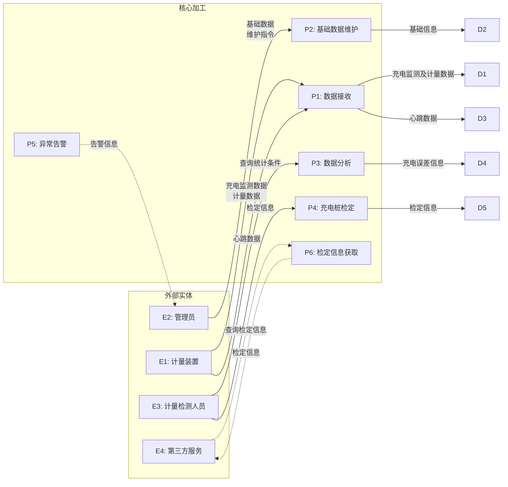
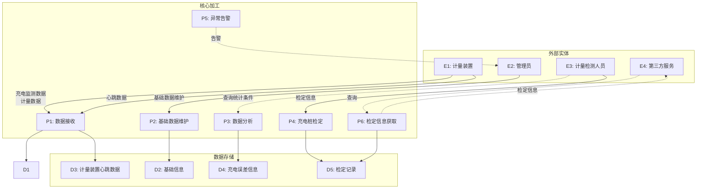
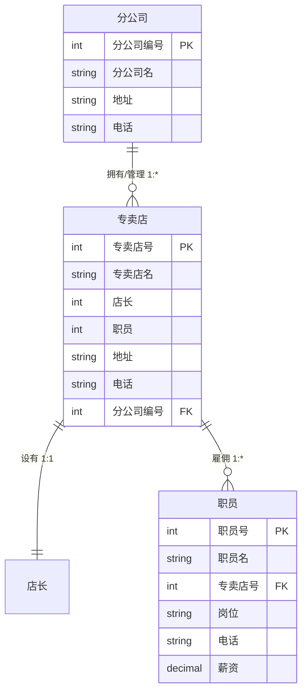
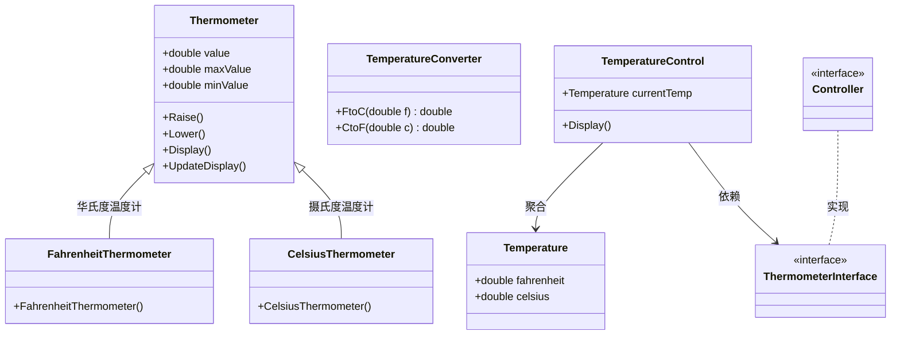
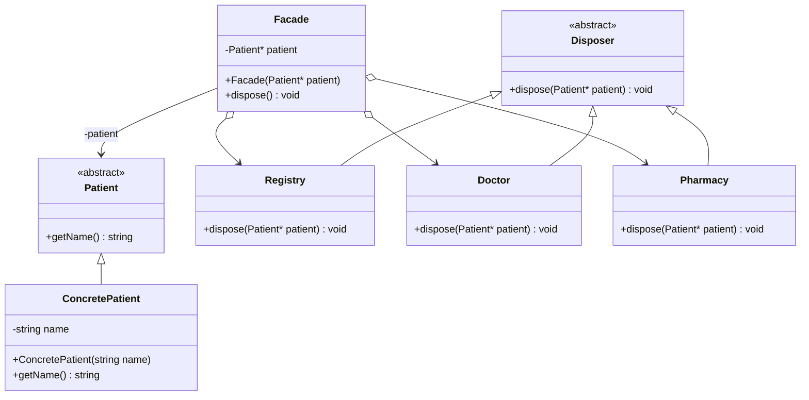
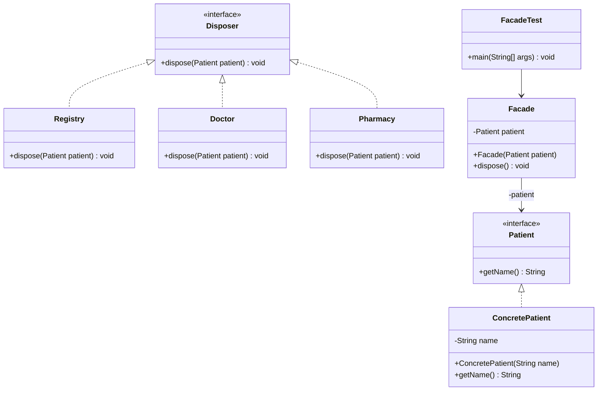

# 2022年下半年 软件设计师（中级）· 下午题案例分析

## 📋 速查目录（按题型 → 跳转）

| 题型 | 考点 | 考纲位置 |
|------|------|----------|
| 试题一 | 数据流图（DFD） | [[个人资料/笔记/软考/软件设计师-中级/知识点/07-软件工程|数据流图]] |
| 试题二 | ER 图 / 数据库设计 | [[个人资料/笔记/软考/软件设计师-中级/知识点/05-数据库系统|ER图]] |
| 试题三 | 面向对象用例图 / 类图 / 设计模式 | [[个人资料/笔记/软考/软件设计师-中级/知识点/08-面向对象与设计模式|用例图]] |
| 试题四 | 堆排序算法（C 代码） | [[个人资料/笔记/软考/软件设计师-中级/知识点/04-数据结构与算法|堆排序]] |
| 试题五 | Facade 外观模式（C++） | [[个人资料/笔记/软考/软件设计师-中级/知识点/08-面向对象与设计模式|外观模式]] |
| 试题六 | Facade 外观模式（Java） | [[个人资料/笔记/软考/软件设计师-中级/知识点/08-面向对象与设计模式|外观模式]] |

---

## 试题一（15分）

阅读下列说明，回答问题1 至问题4，将解答填入答题纸的对应栏内。
### 【说明】

随着新能源车数量的迅猛增长，全国各地电动汽车配套充电桩急速增长，同时也带来了充电桩计量准确性的问题。充电桩都需要配备相应的电能计量和电费计费功能，需要对充电计量准确性强制进行检定。现需开发计量检定云端软件，其主要功能是：
(1)数据接收。接收计量装置上报的充电数据，即充电过程中电压、电流、电能等充电监测数据和计量数据（充电监测数据为充电桩监测的数据，计量数据为计量装置计量的数据，以秒为间隔单位），接收计量装置心跳数据，并分别进行存储。
(2)基础数据维护。管理员对充电桩、计量检定装置等基础数据进行维护。
(3)数据分析。实现电压、电流、电能数据的对比，进行误差分析，记录充电桩的充电误差，供计量装置检定。系统根据计量检测人员给出的查询和统计条件展示查询统计结果。
(4)充电桩检定。分析充电误差：计量检测人员根据误差分析结果和检定信息记录，对充电桩进行检定，提交检定结果：系统更新充电桩中的检定信息（检定结果和检定时间），并存储于检定记录。
(5)异常告警。检测计量装置心跳，当心跳停止时，向管理员发出告警。
(6)检定信息获取，供其它与充电桩相关的第三方服务查询充电桩中的检定信息。
现采用结构化方法对计量检定云端软件进行分析与设计，获得如图1-1 所示的上下文数据流图和图1-2 所示的0 层数据流图。

### 【图1-1 上下文数据流图】



### 【图1-2 0层数据流图】



### 【问题1】
使用说明中的词语，给出图1-1 中的实体E1~E4 的名称。

#### 作答区
```text

E1:计量装置；
E2:管理员；
E3:计量检测人员；
E4:第三方服务；

```

### 【问题2】
使用说明中的词语，给出图1-2 中的数据存储D1~D5 的名称。

#### 作答区
```text

D2:基础信息表；
D3:计量装置心跳数据表；
D4:充电误差信息表；
D5:检定记录表。

```

### 【问题3】
根据说明中的词语，补充图1-2 中缺失的数据流及其起点和终点。

#### 作答区
```text

（1）检定信息：P4 -> D5；
（2）检定信息：D5 -> P6；
（3）查询统计条件：E3 -> P3；

```

### 【问题4】
根据说明，给出"充电监测与计量数据"数据流的组成。

#### 作答区
```text

电压、电流、电能、时间

```

## 试题二（15分）

阅读下列说明，回答问题1 至问题3，将解答填入答题纸的对应栏内。
### 【说明】

某营销公司为了便于对各地的分公司及专卖店进行管理，拟开发一套业务管理系统，请根据下述需求描述完成该系统的数据库设计。
【需求描述】
(1) 分公司信息包括：分公司编号、分公司名、地址和电话。其中，分公司编号唯一确定分公司关系的每一个元组。每个分公司拥有多家专卖店，每家专卖店只属于一个分公司。
(2) 专卖店信息包括：专卖店号、专卖店名、店长、分公司编号、地址、电话，其中店号唯一确定专卖店关系中的每一个元组。每家专卖店只有一名店长，负责专卖店的各项业务：每名店长只负责一家专卖店：每家专卖店有多名职员，每名职员只属于一家专卖店。
(3)职员信息包括：职员号、职员名、专卖店号、岗位、电话、薪资。其中，职员号唯一标识职员关系中的每一个元组。岗位有店长、营业员等。
【概念模型设计】
根据需求阶段收集的信息，设计的实体联系图（不完整）如图2-1 所示。

### 【图2-1 实体联系图（ER图）】



【逻辑结构设计】
根据概念模型设计阶段完成的实体联系图，得出如下关系模式（不完整）：
- 分公司（分公司编号，分公司名，地址，电话）
- 专卖店（专卖店号，专卖店名，___(a)___，职员，地址，电话）
- 职员（职员号，职员名，____(b)___，岗位，电话，薪资）

### 【问题1】
根据需求描述，图2-1 实体联系图中缺少三个联系。请在答题纸对应的实体联系图中补充三个联系及联系类型。
注：联系名可用联系1、联系2、联系3：也可根据你对题意的理解取联系名。

#### 作答区
```text

联系1：分公司——专卖店（1:*，拥有/管理）
联系2：专卖店——店长（1:1，设有）
联系3：专卖店——职员（1:*，雇佣）

```

### 【问题2】
(1)将关系校式中的空____(a)___、____(b)___的属性补充完整，并填入答题纸对应的位置上。
(2)专卖店关系的主键：____(c)___ 和外键:____(d)___。
职员关系的主键：____(e)___ 和外键：____(f)___。

#### 作答区
```text
（1）：(a) 店长、分公司编号  (b) 专卖店号
（2）：(c) 专卖店号  (d) 店长、分公司编号  (e) 职员号  (f) 专卖店号
```

### 【问题3】
为了在紧急情况发生时，能及时联系到职员的家人，专卖店要求每位职员至少要填写一位紧急联系人的姓名、与本人关系和联系电话。根据这种情况，在图2-1 中还需增加的实体___(g)___，职员关系与该实体的联系类型为____(h)___。
(3)给出该实体的关系模式。

#### 作答区
```text
(g) 紧急联系人
(h) 1:*
(3) 紧急联系人（紧急联系人号，职员号，紧急联系人姓名，与本人关系，联系电话）
```

## 试题三（15分）

阅读下列说明，回答问题1 至问题3，将解答填入答题纸的对应栏内。
### 【说明】

图3-1 所示为某软件系统中一个温度控制模块的界面。界面上提供了两种温度计量单位，即华氏度（Fahrenheit）和摄氏度（Celsius）。软件支持两种计量单位之间的自动换算，即若输入一个华氏度的温度，其对应的摄氏度温度值会自动出现在摄氏度的显示框内，反之亦然。用户可以通过该界面上的按钮 Raise（升高温度）和 Lower（降低温度）来改变温度的值。界面右侧是个温度计，将数字形式的温度转换成温度计上的制度比例进行显示。当温度值改变时，温度计的显示也随之同步变化。

### 【图3-1 温度控制模块界面】

> UI 界面截图描述：
> - 标题栏：温度控制
> - 左侧面板：华氏度（华氏度温度计，数值 50.0°F，范围 0~212）与摄氏度（摄氏度温度计，数值 10.0°C，范围约 -17.8~100）双列显示
> - 中间操作区： Raise 按钮（升高温度）、Lower 按钮（降低温度）
> - 右侧面板：华氏度温度计（红色指针指向刻度 50°F 处）、摄氏度温度计（红色指针指向刻度 10°C 处）
> - 华氏度与摄氏度两列均标注"自动换算"联动关系

现采用面向对象方法现实该温度控制模板，得到如图3-2 所示的用例图和3-3 所示的类图。

### 【图3-2 用例图】

> 用例图描述（根据题干说明推断）：
> - 参与者：用户
> - 用例：
>   - U1: 显示温度（双计量单位显示）
>   - U2: 显示华氏度
>   - U3: 温度计显示
>   - U4: 自动换算（华氏度↔摄氏度联动）

### 【图3-3 类图】



### 【问题1】
根据说明中的描述，给出图3-2 中U1~U4 所对应的用例名。

#### 作答区
```text

U1: 显示温度
U2: 显示华氏度
U3: 温度计显示
U4: 自动换算

```

### 【问题2】
根据说明中的描述，给出图3-3 中C1~C8 所对应的类名（类名使用图3-1 中标注的词汇）。

#### 作答区
```text

C1: Thermometer（温度计 / 温度计基类）
C2: 华氏度温度计 / Fahrenheit Thermometer
C3: 摄氏度温度计 / Celsius Thermometer
C4: 温度换算器 / Temperature Converter
C5: 温度值 / Temperature
C6: 温度控制器 / Temperature Control
C7: 控制器 / Controller
C8: 温度计接口 / Thermometer Interface

```

### 【问题3】
现需将图3-1 所示的界面改造为一个更为通用的GUI 应用，能够实现任意计量单位之间的换算，例如千克和磅之间的换算、厘米和英寸之间的换算等等。为了实现这个新的需求，可以在图3-3 所示的类图上增加哪种设计模式？请解释选择该设计模式的原因（不超过50 字）。

#### 作答区
```text

策略模式（Strategy Pattern）。原因：可将每种计量单位的换算算法封装为独立策略类，需要换算时动态选择对应策略，实现算法与界面分离。

```

## 试题四（15分）

阅读下列说明和C代码，回答问题1 至问题3，将解答填入答题纸的对应栏内。
### 【说明】

试题排序是将一组无序的数据元素调整为非递减顺序的数据序列的过程，堆排序是一种常用的排序算法。用顺序存储结构存储堆中元素。非递减堆排序的步骤是：
(1) 将含 $n$ 个元素的待排序数列构造成一个初始大顶堆，存储在数组 $R(R[1],R[2],\ldots,R[n])$ 中。此时堆的规模为 $n$，堆顶元素 $R[1]$ 就是序列中最大的元素，$R[n]$ 是堆中最后一个元素。
(2)将堆顶元素和堆中最后一个元素交换，最后一个元素脱离堆结构，堆的规模减1，将堆中剩余的元素调整成大顶堆。
(3) 重复步骤(2)，直到只剩下最后一个元素在堆结构中，此时数组 $R$ 是一个非递减的数据序列。
### 【C代码】

下面是该算法的C 语言实现。
(1) 主要变量说明：
- $n$：待排序的数组长度
- $R[]$：待排序数组，$n$ 个数放在 $R[1],R[2],\ldots,R[n]$ 中

(2) 代码：

```c
#include <stdio.h>
#define MAXITEM 100

void Heapify(int R[MAXITEM], int v, int n) {
    int i, j;
    i = v;
    j = 2 * i;
    R[0] = R[i];

    while (j <= n) {
        if (j < n && R[j] < R[j + 1]) {
            j++;
        }
        if (/* （1）________________ */) {
            R[i] = R[j];
            i = j;
            j = 2 * i;
        } else {
            j = n + 1;
        }
    }
    R[i] = R[0];
}

void HeapSort(int R[MAXITEM], int n) {
    int i;
    for (i = n / 2; i >= 1; i--) {
        /* （2）________________ */
    }
    for (i = n; /* （3）________________ */; i--) {
        R[0] = R[i];
        R[i] = R[1];
        /* （4）________________ */
        Heapify(R, 1, i - 1);
    }
}
```

### 【问题1】
根据以上说明和C代码，填充C代码中的空（1）~（4）。

#### 作答区
```c
/* （1） R[0] < R[j]                        */
/* （2） Heapify(R, i, n)                   */
/* （3） i >= 1                             */
/* （4） R[1] = R[0]                        */
```

### 【问题2】
根据以上说明和 C 代码，算法的时间复杂度为（5）（用 $O$ 符号表示）。

#### 作答区
```c
/* （5） O(n log n)                         */
```

### 【问题3】
考虑数据序列 $R=(7,10,13,15,4,20,19,8)$，$n=8$，则构建的初始大顶堆为（6），
第一个元素脱离堆结构，对剩余元素再调整成大顶堆后的数组 $R$ 为（7）。

#### 作答区
```c
/* （6） 20, 15, 19, 10, 4, 13, 7, 8       */
/* （7） 19, 15, 13, 10, 4, 8, 7           */
```

## 试题五（15分）

阅读下列说明和C++代码，将应填入(n)处的字句写在答题纸的对应栏内。
### 【说明】

Facade（外观）模式是一种通过为多个复杂子系统提供一个一致的接口，而使这些子系统更加容易被访问的模式，以医院为例，就医时患者需要与医院不同的职能部门交互，完成挂号、门诊、取药等操作。为简化就医流程，设置了一个接待员的职位，代患者完成上述就医步骤，患者则只需与接待员交互即可。如图6-1 给出了以外观模式实现该场景的类图。

### 【图6-1 Facade 模式类图（C++）】



【C++ 代码】

#### 图片代码转写（Facade，C++，空位保留）
```cpp
#include <iostream>
#include <string>
using namespace std;

class Patient {
public:
    /* （1）________________ */;
};

class Disposer {
public:
    /* （2）________________ */;
};

class Registry : public Disposer {
public:
    void dispose(Patient *patient) {
        cout << "I am registering...." << patient->getName() << endl;
    }
};

class Doctor : public Disposer {
public:
    void dispose(Patient *patient) {
        cout << "I am diagnosing...." << patient->getName() << endl;
    }
};

class Pharmacy : public Disposer {
public:
    void dispose(Patient *patient) {
        cout << "I am giving medicine...." << patient->getName() << endl;
    }
};

class Facade {
private:
    Patient *patient;
public:
    Facade(Patient *patient) { this->patient = patient; }
    void dispose() {
        Registry *registry = new Registry();
        Doctor *doctor = new Doctor();
        Pharmacy *ph = new Pharmacy();
        registry->dispose(patient);
        doctor->dispose(patient);
        ph->dispose(patient);
    }
};

class ConcretePatient : public Patient {
private:
    string name;
public:
    ConcretePatient(string name) { this->name = name; }
    string getName() { return name; }
};

int main() {
    Patient *patient = /* （3）________________ */;
    /* （4）________________ */ f = /* （5）________________ */;
    /* （6）________________ */;
    return 0;
}
```

### 【问题1】
(1):
(2):
(3):
(4):
(5):
(6):

#### 作答区
```cpp
/* （1） virtual string getName() = 0          */
/* （2） virtual void dispose(Patient*) = 0  */
/* （3） new ConcretePatient("name")         */
/* （4） Facade *                             */
/* （5） new Facade(patient)                 */
/* （6） f->dispose()                         */
```

## 试题六（15分）

阅读下列说明和Java代码，将应填入(n)处的字句写在答题纸的对应栏内。
### 【说明】

Facade（外观）模式是一种通过为多个复杂子系统提供一个一致的接口，而使这些子系统更加容易被访问的模式。以医院为例，就医时患者需要与医院不同的职能部门交互，完成挂号、门诊、取药等操作。为简化就医流程，设置了一个接待员的职位，代患者完成上述就医步骤，患者则只需与接待员交互即可。如图6-1 给出了以外观模式实现该场景的类图。

### 【图6-1 Facade 模式类图（Java）】



【Java代码】

#### 图片代码转写（Facade，Java，空位保留）
```java
interface Patient {
    /* （1）________________ */;
}

interface Disposer {
    /* （2）________________ */;
}

class Registry implements Disposer {
    public void dispose(Patient patient) {
        System.out.println("I am registering...." + patient.getName());
    }
}

class Doctor implements Disposer {
    public void dispose(Patient patient) {
        System.out.println("I am diagnosing...." + patient.getName());
    }
}

class Pharmacy implements Disposer {
    public void dispose(Patient patient) {
        System.out.println("I am giving medicine...." + patient.getName());
    }
}

class Facade {
    private Patient patient;

    public Facade(Patient patient) {
        this.patient = patient;
    }

    public void dispose() {
        Registry registry = new Registry();
        Doctor doctor = new Doctor();
        Pharmacy ph = new Pharmacy();
        registry.dispose(patient);
        doctor.dispose(patient);
        ph.dispose(patient);
    }
}

class ConcretePatient implements Patient {
    private String name;

    public ConcretePatient(String name) {
        this.name = name;
    }

    public String getName() {
        return name;
    }
}

class FacadeTest {
    public static void main(String[] args) {
        Patient patient = /* （3）________________ */;
        /* （4）________________ */ f = /* （5）________________ */;
        /* （6）________________ */;
    }
}
```

### 【问题1】
(1):
(2):
(3):
(4):
(5):
(6):

#### 作答区
```java
/* （1） String getName()                    */
/* （2） void dispose(Patient patient)      */
/* （3） new ConcretePatient("name")       */
/* （4） Facade                             */
/* （5） new Facade(patient)                */
/* （6） f.dispose()                        */
```

---

# 参考答案与解析

> 答案内容来自原答案 PDF；解析较少或缺失处已补充"解析"说明。若原 PDF 标为"暂缺"，此处保持暂缺并说明原因。

## 试题一

### 问题1

**答案：**
- E1: 计量装置
- E2: 管理员
- E3: 计量检测人员
- E4: 第三方服务

**解析：**
解题时先确定系统边界，再从题干中的动作发起者、接收者识别外部实体；数据存储通常对应"文件、表、记录"等持久化名词；缺失数据流则通过父图/子图平衡和加工输入输出一致性检查补齐。

### 问题2

**答案：**
- D2: 基础信息文件
- D3: 计量装置心跳数据
- D4: 充电误差信息
- D5: 检定记录

**解析：**
解题时先确定系统边界，再从题干中的动作发起者、接收者识别外部实体；数据存储通常对应"文件、表、记录"等持久化名词；缺失数据流则通过父图/子图平衡和加工输入输出一致性检查补齐。

### 问题3

**答案：**
- E3 → P3: 查询和统计条件
- P4 → D5: 更新检定信息（检定记录）
- D5 → P6: 检定信息（检定记录）
- D4 → P3: 充电误差信息

**解析：**
该题应从题干约束、图示元素和答案中的关键词逐项对应，先完成直接匹配，再检查名称、方向和数量是否与题目要求一致。

### 问题4

**答案：**
充电过程中电压、电流、电能等充电监测数据和计量数据（充电监测数据为充电桩监测的数据，计量数据为计量装置计量的数据，以秒为间隔单位）

**解析：**
该题应从题干约束、图示元素和答案中的关键词逐项对应，先完成直接匹配，再检查名称、方向和数量是否与题目要求一致。

## 试题二

### 问题1

**答案：**
- 联系1：分公司——专卖店（1:*，拥有/管理）
- 联系2：专卖店——店长（1:1，设有）
- 联系3：专卖店——职员（1:*，雇佣）

**解析：**
解析补充：该题应从题干约束、图示元素和答案中的关键词逐项对应，先完成直接匹配，再检查名称、方向和数量是否与题目要求一致。

### 问题2

**答案：**
- (a): 店长、分公司编号
- (b): 专卖店号
- (c): 专卖店号
- (d): 店长、分公司编号
- (e): 职员号
- (f): 专卖店号

**解析：**
解析补充：该题应从题干约束、图示元素和答案中的关键词逐项对应，先完成直接匹配，再检查名称、方向和数量是否与题目要求一致。

### 问题3

**答案：**
- (g): 紧急联系人
- (h): 1:*
- 紧急联系人关系模式：紧急联系人（紧急联系人号，职员号，紧急联系人姓名，与本人关系，联系电话）

**解析：**
解析补充：该题应从题干约束、图示元素和答案中的关键词逐项对应，先完成直接匹配，再检查名称、方向和数量是否与题目要求一致。

## 试题三

### 问题1

**答案：**
- U1: 显示温度
- U2: 显示华氏度
- U3: 温度计显示
- U4: 自动换算

**解析：**
面向对象建模题要把题干名词映射到类或参与者，把动词短语映射到用例或操作；再根据图中继承、组合、依赖等关系校验名称和多重度。

### 问题2

**答案：**
- C1: Thermometer（温度计基类）
- C2: 华氏度温度计（Fahrenheit Thermometer）
- C3: 摄氏度温度计（Celsius Thermometer）
- C4: 温度换算器（Temperature Converter）
- C5: 温度值（Temperature）
- C6: 温度控制器（Temperature Control）
- C7: 控制器（Controller）
- C8: 温度计接口（Thermometer Interface）

**解析：**
解析补充：该题应从题干约束、图示元素和答案中的关键词逐项对应，先完成直接匹配，再检查名称、方向和数量是否与题目要求一致。

### 问题3

**答案：**
策略模式（Strategy Pattern）。此模式可以定义一系列的算法策略，把它们一个个封装起来，并且使它们可以相互替换。在需要指定的计量单位换算时，调用相应的算法策略即可。

**解析：**
解析补充：该题应从题干约束、图示元素和答案中的关键词逐项对应，先完成直接匹配，再检查名称、方向和数量是否与题目要求一致。

## 试题四

### 问题1

**答案：**
- (1) `R[0] < R[j]`
- (2) `Heapify(R, i, n)`
- (3) `i >= 1`
- (4) `R[1] = R[0]`

**解析：**
算法题重点是维护状态含义和循环/递归不变式：动态规划看状态转移与边界，回溯看选择、撤销和剪枝条件，复杂度由状态数量或搜索树规模决定。

### 问题2

**答案：**
$O(n \log n)$

**解析：**
算法题重点是维护状态含义和循环/递归不变式：动态规划看状态转移与边界，回溯看选择、撤销和剪枝条件，复杂度由状态数量或搜索树规模决定。

### 问题3

**答案：**
- (6) `20, 15, 19, 10, 4, 13, 7, 8`
- (7) `19, 15, 13, 10, 4, 8, 7`

**解析：**
解析补充：该题应从题干约束、图示元素和答案中的关键词逐项对应，先完成直接匹配，再检查名称、方向和数量是否与题目要求一致。

## 试题五

### 问题1

**答案：**
- (1) `virtual string getName() = 0`
- (2) `virtual void dispose(Patient *patient) = 0`
- (3) `new ConcretePatient("name")`
- (4) `Facade *`
- (5) `new Facade(patient)`
- (6) `f->dispose()`

**解析：**
程序填空题先根据设计模式角色确定类之间的职责，再结合上下文类型、返回值和调用点补全声明或语句；若同一模式有 Java/C++ 两种写法，关键是保证抽象接口、具体类和客户端调用方向一致。

## 试题六

### 问题1

**答案：**
- (1) `String getName()`
- (2) `void dispose(Patient patient)`
- (3) `new ConcretePatient("name")`
- (4) `Facade`
- (5) `new Facade(patient)`
- (6) `f.dispose()`

**解析：**
程序填空题先根据设计模式角色确定类之间的职责，再结合上下文类型、返回值和调用点补全声明或语句；若同一模式有 Java/C++ 两种写法，关键是保证抽象接口、具体类和客户端调用方向一致。
