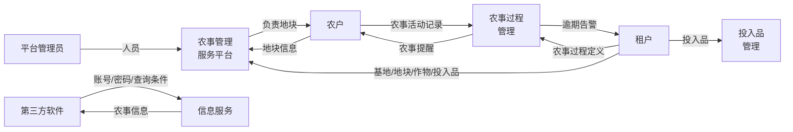
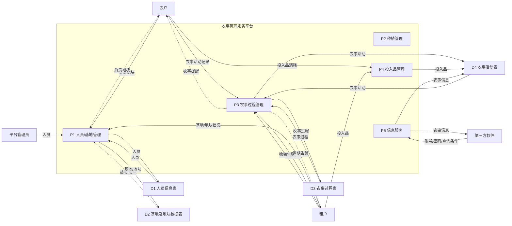
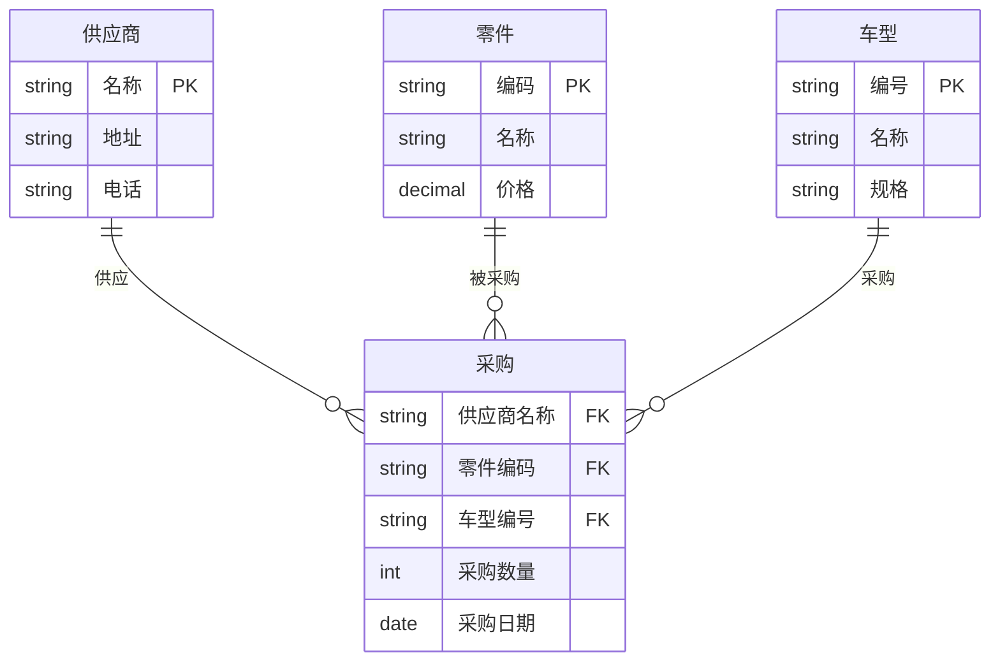
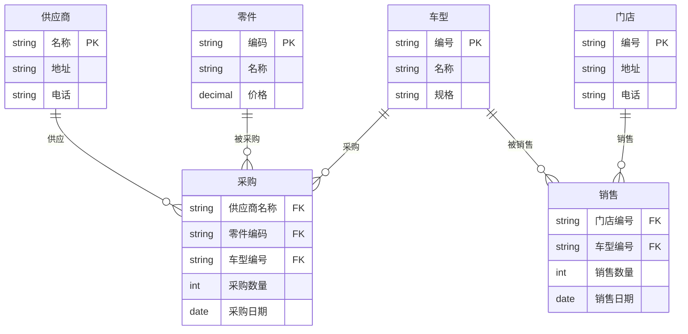
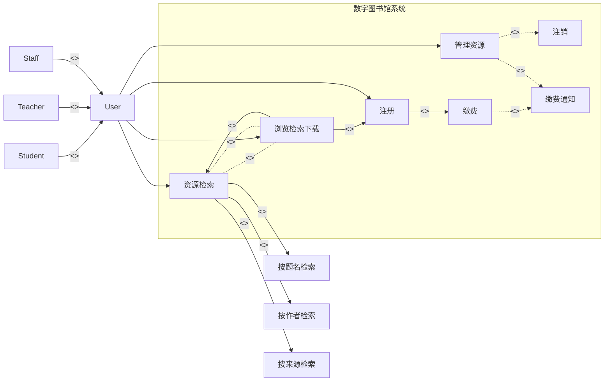
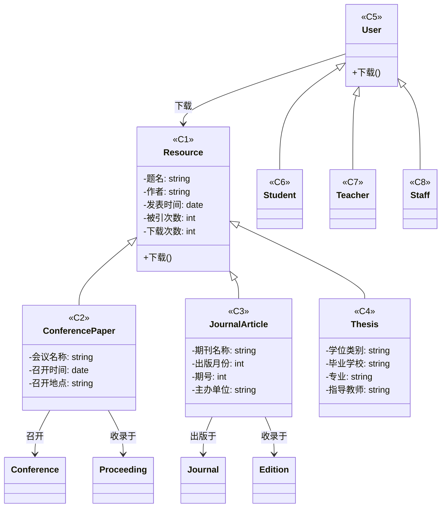
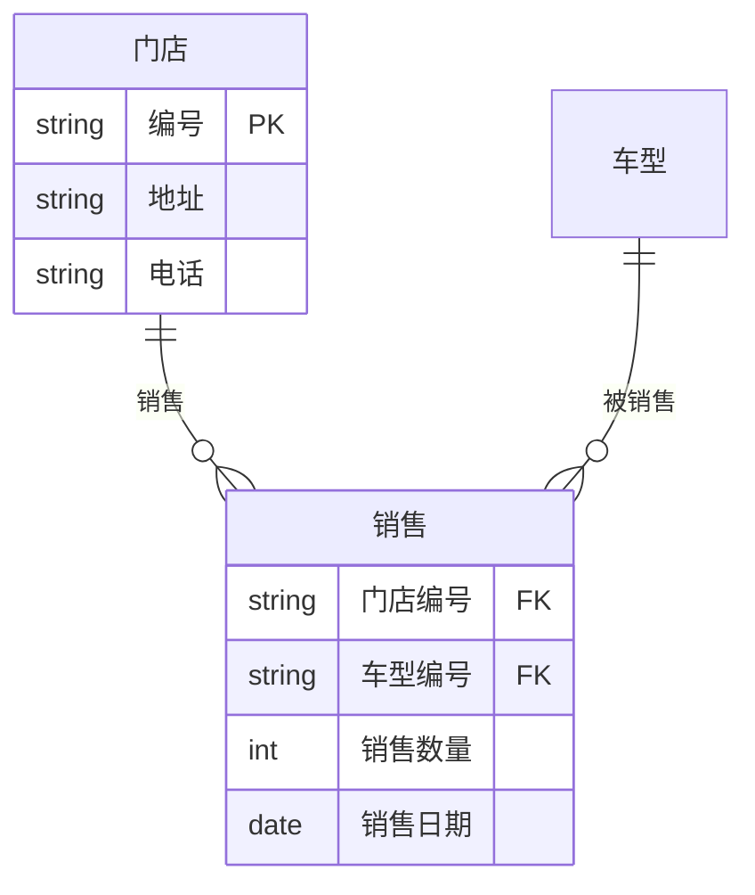

# 2023年上半年 软件设计师（中级）· 下午题案例分析

## 📋 速查目录（按题型 → 跳转）

| 题型 | 考点 | 考纲位置 |
|------|------|----------|
| 试题一 | DFD 数据流图（上下文图 / 0层图） | [[个人资料/笔记/软考/软件设计师-中级/知识点/07-软件工程|数据流图]] |
| 试题二 | ER 图、关系模式、主键外键 | [[个人资料/笔记/软考/软件设计师-中级/知识点/05-数据库系统|ER图]] |
| 试题三 | UML 用例图、类图、设计模式 | [[个人资料/笔记/软考/软件设计师-中级/知识点/09-UML建模|09-UML建模]] |
| 试题四 | 题目暂缺 | — |
| 试题五 | Strategy 策略模式（C++） | [[个人资料/笔记/软考/软件设计师-中级/知识点/08-面向对象与设计模式|策略模式]] |
| 试题六 | Strategy 策略模式（Java） | [[个人资料/笔记/软考/软件设计师-中级/知识点/08-面向对象与设计模式|策略模式]] |

---

## 试题一（15分）

阅读下列说明，回答问题1 至问题3，将解答填入答题纸的对应栏内。
### 【说明】

随着农业领域科学种植的发展，需要对农业基地及农事进行的信息化管理，为租
户和农户等人员提供种植相关服务.现欲开发农事管理服务平台.其主要功能是:
(1)人员管理.平台管理员管理租户;租户管理农户并为其分配负责的地块，租户
和农户以人员类型区分
(2)基地管理,租户填写基地名称、地域等描述信息..在显示的地图上绘制地块
(3)种植管理,租户设定作物及其从种植到采收的整个农事过程,包括农事活动及
其实施计划,农户根据相应农事过程提醒进行农事活动并记录。系统会在设定时
间向农户进行农事提醒，对逾期未实施活动向租户发出逾期告警
(4)投入品管理.租户统一维护化肥,杀虫剂等投入品信息.农户在农事活动中设
定投入品的实际消耗
(5)信息服务:用户按查询条件发起农事信息请求,对相关地块农事活动实施情况
(如与农事过程比对)等农事信息进行筛选、对比和统计等处理.并将响应信息进
行展示.系统也给其他第三方软件提供APP接口，通过接口访问的方式.提供账号,
密码和查询条件发起农事信息请求,返回特定格式的农事信息，无查询条件时默
认返回账号下所有信息,多查询条件时返回满足全部条件的信息
现采用结构化方法对农事管理服务平台进行分析与设计，获得如图所示的上下文
数据流图和图2 所示的0 层数据流图

<!-- 原 PDF 第 3 页 -->

**图1：上下文数据流图**



**图2：0层数据流图**



### 【问题1】
使用说明中的词语,给出图1 中的突体E1—E4 的名称

#### 作答区
```text

E1:平台管理员；
E2:农户；
E3:租户；
E4:第三方软件。

```

### 【问题2】
使用说明中的词活,给出图2 中数据存储D1-D4 的名称

#### 作答区
```text

D2:基地及地块数据表；
D3:农事过程表；
D4:农事活动表。

```

### 【问题3】
根据说明和图中术语,补充2 中缺失的数据流及其起点和终点

#### 作答区
```text

（1）人员：D1 -> P1;
（2）负责地块：P1 -> E2;
（3）农事过程：D3 -> P3；
（4）农事信息：D4 -> P5。

```

### 【问题4】
根据说明,给出"农事信息请求"数据流的组成

#### 作答区
```text

相关地块农事活动实施情况（如与农事过程比对）进行筛选、对比和统计；
农事过程包括农事活动及其实施计划。

```

## 试题二（15分）

阅读下列说明，回答问题1 至问题3，将解答填入答题纸的对应栏内。
### 【说明】

某新能源汽车公司为了提升效率。需开发一个汽车零件采购系统.请完成系统的
数据库设计
【概念结构设计】

**图1：实体联系图（ER 图）**



【需求描述】
(1 记录供应商的信息,包括供应商的名称地地和一个电活
(2)记录零件的信息,包括零件的编码.名称知价格.
(3)纪录车型信息，包括车型的编号,名称和规格.
(4)记录零件采购信息,某个车型的某种零件可以从多家供应商采购，某种零件也
可以被多个车型采用，某家供应商也可以供应多种零件，还包括采购数量和采购
日期
【逻辑结构设计】
根据概念结构设计阶段完成的实体联系图，得出如下关系模式(不完整):
供应商(名称,地址,电话)
零件(编码各称，价格)
车型(编号.各称.规格)
采购(车型编号,供应商名称,(a)，(b)，采购日期)
### 【问题1】
根据描进,补充图1 的实体联系图(不增加新的实体)

#### 作答区
```text

```

### 【问题2】
补充逻结构设计结果中的(a)，(b)两处空缺,并标注主键和外键完整性约束

#### 作答区
```text

```

### 【问题3】
该汽车公司现新增如下需求:记录车型在全国门店的销售情况,门店信息包括门
店的编号,地址和电话,销售包括销售数量和销售日期等
对原有设计进行以下修改以实现该需求:
(1)在图1 中体现门店信息及其车型销售情况、并标明新增的实体和联系,及其心
要属性.
(2)给出新增加的关系模式,并标注主键和外键完整性约束

**图2：新增门店销售需求后的 ER 图**



#### 作答区
```text
（1）：
（2）：
```

## 试题三（15分）

阅读下列说明，回答问题1 至问题3，将解答填入答题纸的对应栏内。
### 【说明】

某高校图书馆购买了若干学术资源的镜像数据库(MinorDB)资源，现要求开发—
套数字图书馆(Digitallibrary)系统,面向校内用户(User)提供学术资源
(Resoure)的浏览，检索和下载服务系统的主要要求描述如下:
(1)系统中存储了每个镜像数据库的基本信息，包技教据库名称，访问地址，数
据库属性以及数据库简介等信息，用户进入某个镜像数据降后，可以浏览检索以
及下载其中的学术资源。
(2)学术资源包括会议论文(ConferencePaper)、期刑论文(JoumalArtide)以及学
位(Thesis)等:系统中存储了每个学术资源的题名、作者、发表时间、来源(哪个
镜像数据库)、被引次数、下载次数等信息。对于会议论文，还需记录会议名称，
召开时间以及召开地点;同一次会议的论文被收泵在会议集(Proceeaing 中。对
于期刊论文，还需记录期刊名称，出版月份，期号以及主办单位;同—期号的论
文被收录在—本期刊(Edition)中。对于学位论文，记录了学位类别(博士/硕
士):毕业学校，专业及指导教师。会议集包含发表在该会议(在某个特定时间段，
特定地点召开)上的所有文章。期刊的每一期在特定时间发行，其中包含若干篇
文章。
(3)系统用户(User)包括在校学生(Student)，教师(Teacher)以及其他在职人员
(Staff)。用户使用学校的统—身份认证登录系统后，使用系统提供的各项服务。
(4)系统提供多种资源检索的方式，主要包括:按照资源的题名检索
(SearchbyTite)，按照作者名称检票(SearchByAathor)，按照来源检索(SearchBy
Source)等。
(5)用户可以下载资源,系统记录每个资源被下载的次数。现采用面向对象分析与
设计方法开发该系统，得到如图1 所乐的用例图以及图2 所示的初始类图。

<!-- 原 PDF 第 7 页 -->

**图1：用例图**



**图2：初始类图**



### 【问题1】
根据说明中的描述，给发图2 中的C1-C8 所对应向类名

#### 作答区
```text

```

### 【问题2】
根据说明中的描述，给出图2 的类C1—C4 的关键属性

#### 作答区
```text

```

### 【问题3】
在该系统的开发过程中遇到了新的要求;用户能够在系统中对其所关注的数字资
源注册他引通知，若该资源的他引次数发生变化，系候可以及时通知该用户，为

了实现这个新的要求，可以在图2 所系的类图中增加哪种设计模式?用150 字以
内文字解释选择该模式的原因。

#### 作答区
```text

```

## 试题四（15分）

题目暂缺
从下列的 2 道试题（试题五至试题六）中任选 1 道解答。
如果解答的试题数超过 1 道，则题号小的 1 道解答有效。
## 试题五（15分）

阅读下列说明和Java代码，将应填入(n)处的字句写在答题纸的对应栏内。
### 【说明】

在某系统中，类interval 代表由下界(lower bound)和上界(upper bound)定义的
区间。要求采用不同的格式显示区间范围。如【lower bound.upper bound】;
【lower bound...upper bound】;【lower bound-upper bound】等现采用策略
(strategy)模式实现该要求，得到如图5-1 所示的类图。
### 【C++代码】

#### 图片代码转写（Strategy，C++，空位保留）
```cpp
#include <iostream>
#include <string>
using namespace std;

class PrintStrategy {
public:
    /* （1）________________ */;
};

class Interval {
private:
    double lowerBound;
    double upperBound;
public:
    Interval(double p_lower, double p_upper) {
        lowerBound = p_lower;
        upperBound = p_upper;
    }

    void PrintInterval(PrintStrategy *pt) {
        /* （2）________________ */;
    }

    double getLower() { return lowerBound; }
    double getUpper() { return upperBound; }
};

class PrintIntervalsComma : public PrintStrategy {
public:
    void doPrint(Interval *val) {
        cout << "[" << val->getLower() << "," << val->getUpper() << "]" << endl;
    }
};

class PrintIntervalsDots : public PrintStrategy {
public:
    void doPrint(Interval *val) {
        cout << "[" << val->getLower() << "..." << val->getUpper() << "]" << endl;
    }
};

class PrintIntervalsLine : public PrintStrategy {
public:
    void doPrint(Interval *val) {
        cout << "[" << val->getLower() << "-" << val->getUpper() << "]" << endl;
    }
};

enum TYPE {
    COMMA, DOTS, LINE
};

PrintStrategy* getPrintStrategy(int type) {
    PrintStrategy *st;
    switch (type) {
        case COMMA:
            /* （3）________________ */;
            break;
        case DOTS:
            /* （4）________________ */;
            break;
        case LINE:
            /* （5）________________ */;
            break;
    }
    return st;
}

int main() {
    Interval a(1.7, 2.1);
    a.PrintInterval(getPrintStrategy(COMMA));
    a.PrintInterval(getPrintStrategy(DOTS));
    a.PrintInterval(getPrintStrategy(LINE));
}
```

### 【问题1】
填空1：
填空2：
填空3：
填空4：
填空5：

#### 作答区
```cpp
/* （1） ______________________________ */
/* （2） ______________________________ */
/* （3） ______________________________ */
/* （4） ______________________________ */
/* （5） ______________________________ */
```

## 试题六（15分）

阅读下列说明和C++代码，将应填入(n)处的字句写在对应栏内。
### 【说明】

在某系统中，类interval 代表由下界(lower bound)和上界(upper bound)定义的
区间。要求采用不同的格式显示区间范围。如【lower bound.upper bound】;

<!-- 原 PDF 第 11 页 -->

【lower bound...upper bound】；【lower bound-upper bound】等现采用策
略(strategy)模式实现该要求，得到如图6-1 所示的类图。
### 【Java代码】

#### 图片代码转写（Strategy，Java，空位保留）
```java
enum TYPE { COMMA, DOTS, LINE }

interface PrintStrategy {
    /* （1）void doPrint(Interval val) */;
}

class Interval {
    private double lower;
    private double upper;

    public Interval(double lower, double upper) {
        this.lower = lower;
        this.upper = upper;
    }

    public double getLower() { return this.lower; }
    public double getUpper() { return this.upper; }

    public void printInterval(PrintStrategy pr) {
        /* （2）pr.doPrint(Interval val) */;
    }
    /* 插一嘴，double是个什么类型？ */
}

class PrintIntervalsComma implements PrintStrategy {
    public void doPrint(Interval val) {
        System.out.println("[" + val.getLower() + "," + val.getUpper() + "]");
    }
}

class PrintIntervalsDots implements PrintStrategy {
    public void doPrint(Interval val) {
        System.out.println("[" + val.getLower() + "..." + val.getUpper() + "]");
    }
}

class PrintIntervalsLine implements PrintStrategy {
    public void doPrint(Interval val) {
        System.out.println("[" + val.getLower() + "-" + val.getUpper() + "]");
    }
}

public static PrintStrategy getStrategy(TYPE type) {
    PrintStrategy st = null;
    switch (type) {
        case COMMA:
            /* （3）st = new PrintIntervalsComma()*/;
            break;
        case DOTS:
            /* （4）st = new PrintIntervalsDots() */;
            break;
        case LINE:
            /* （5）st = new PrintIntervalsLine() */;
            break;
    }
    /* 好吧，我确实不知道这个val应该怎么办了 */
    return st;
}

public static void main(String[] args) {
    Interval a = new Interval(1.7, 2.1);
    a.printInterval(getStrategy(TYPE.COMMA));
    a.printInterval(getStrategy(TYPE.DOTS));
    a.printInterval(getStrategy(TYPE.LINE));
}
```

### 【问题1】
填空1：
填空2：
填空3：
填空4：
填空5：

#### 作答区
```java
/* （1） ______________________________ */
/* （2） ______________________________ */
/* （3） ______________________________ */
/* （4） ______________________________ */
/* （5） ______________________________ */
```

---

# 参考答案与解析

> 答案内容来自原答案 PDF；解析较少或缺失处已补充"解析"说明。若原 PDF 标为"暂缺"，此处保持暂缺并说明原因。

## 试题一

### 问题1

**答案：**

E1:平台管路员
E2:农户
E3:租户
E4:用户

**解析：**

解题时先确定系统边界，再从题干中的动作发起者、接收者识别外部实体；数据存储通常对应"文件、表、记录"等持久化名词；缺失数据流则通过父图/子图平衡和加工输入输出一致性检查补齐。

### 问题2

**答案：**

D2:基地/地块
D3:农事过程
D4:弄事活动

**解析：**

解题时先确定系统边界，再从题干中的动作发起者、接收者识别外部实体；数据存储通常对应"文件、表、记录"等持久化名词；缺失数据流则通过父图/子图平衡和加工输入输出一致性检查补齐。

### 问题3

**答案：**

| 数据流名称 | 起点 | 终点 |
|-----------|------|------|
| 投入品实际消耗 | P4 | D4 |
| 农事过程信息 | D3 | P5 |
| 农事活动信息 | D4 | P5 |
| 农事过程 | P3 | E2 |

**解析：**

解题时先确定系统边界，再从题干中的动作发起者、接收者识别外部实体；数据存储通常对应"文件、表、记录"等持久化名词；缺失数据流则通过父图/子图平衡和加工输入输出一致性检查补齐。

### 问题4

**答案：**

农事活动信息 + 农事过程信息 + 地块信息

**解析：**

解析补充：该题应从题干约束、图示元素和答案中的关键词逐项对应，先完成直接匹配，再检查名称、方向和数量是否与题目要求一致。

## 试题二

### 问题1

**答案：**

**图1 补充后的 ER 图（答案区）**


**解析：**

解析补充：该题应从题干约束、图示元素和答案中的关键词逐项对应，先完成直接匹配，再检查名称、方向和数量是否与题目要求一致。

### 问题2

**答案：**

- (a) 零件编码
- (b) 采购数量

完整关系模式：
```
采购(车型编号, 供应商名称, 零件编码, 采购数量, 采购日期)
  PK: (车型编号, 供应商名称, 零件编码)
  FK: 车型编号 → 车型(编号)
  FK: 供应商名称 → 供应商(名称)
  FK: 零件编码 → 零件(编码)
```

**解析：**

解析补充：该题应从题干约束、图示元素和答案中的关键词逐项对应，先完成直接匹配，再检查名称、方向和数量是否与题目要求一致。

### 问题3

**答案：**

(1) 新增实体及联系：



(2) 新增关系模式：
```
门店(编号, 地址, 电话)
  PK: 编号

销售(门店编号, 车型编号, 销售数量, 销售日期)
  PK: (门店编号, 车型编号, 销售日期)
  FK: 门店编号 → 门店(编号)
  FK: 车型编号 → 车型(编号)
```

**解析：**

解析补充：该题应从题干约束、图示元素和答案中的关键词逐项对应，先完成直接匹配，再检查名称、方向和数量是否与题目要求一致。

## 试题三

### 问题1

**答案：**

C1: Resource（资源）
C2: ConferencePaper（会议论文）
C3: JournalArticle（期刊论文）
C4: Thesis（学位论文）
C5: User（用户）
C6: Student（学生）
C7: Teacher（教师）
C8: Staff（在职人员）

**解析：**

面向对象建模题要把题干名词映射到类或参与者，把动词短语映射到用例或操作；再根据图中继承、组合、依赖等关系校验名称和多重度。

### 问题2

**答案：**

| 类 | 关键属性 |
|----|----------|
| C1 Resource | 题名、作者、发表时间、被引次数、下载次数 |
| C2 ConferencePaper | 题名、作者、发表时间、会议名称、召开时间、召开地点 |
| C3 JournalArticle | 题名、作者、发表时间、期刊名称、期号 |
| C4 Thesis | 题名、作者、发表时间、学位类别、毕业学校、专业 |

**解析：**

面向对象建模题要把题干名词映射到类或参与者，把动词短语映射到用例或操作；再根据图中继承、组合、依赖等关系校验名称和多重度。

### 问题3

**答案：**

**观察者模式（Observer Pattern）**

观察者模式定义对象间的一对多的依赖关系，当一个对象的状态发生改变时，所有依赖于它的对象都得到通知并自动更新。符合系统需求——一个资源可被多个用户关注，当某资源的他引次数变化时，系统可主动通知所有已注册的用户。

**解析：**

解析补充：该题应从题干约束、图示元素和答案中的关键词逐项对应，先完成直接匹配，再检查名称、方向和数量是否与题目要求一致。

## 试题四

### 问题1

**答案：**

解析暂缺

**解析：**

原试题或原答案 PDF 中该部分标为暂缺；当前本地材料不足以可靠还原题干与标准答案。

## 试题五

### 问题1

**答案：**

(1) `virtual void doPrint(Interval *val) = 0;`
(2) `pt->doPrint(this);`
(3) `st = new PrintIntervalsComma();`
(4) `st = new PrintIntervalsDots();`
(5) `st = new PrintIntervalsLine();`

**解析：**

解析补充：该题应从题干约束、图示元素和答案中的关键词逐项对应，先完成直接匹配，再检查名称、方向和数量是否与题目要求一致。

## 试题六

### 问题1

**答案：**

(1) `void doPrint(Interval val);`
(2) `pr.doPrint(this);`
(3) `st = new PrintIntervalsComma();`
(4) `st = new PrintIntervalsDots();`
(5) `st = new PrintIntervalsLine();`

**解析：**

解析补充：该题应从题干约束、图示元素和答案中的关键词逐项对应，先完成直接匹配，再检查名称、方向和数量是否与题目要求一致。
