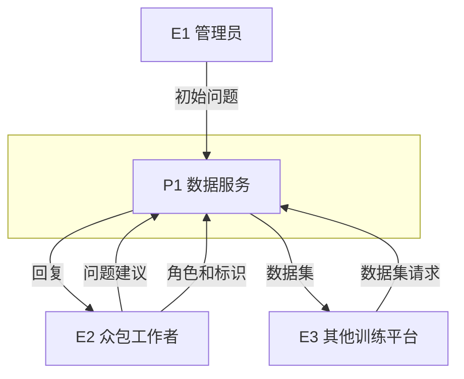
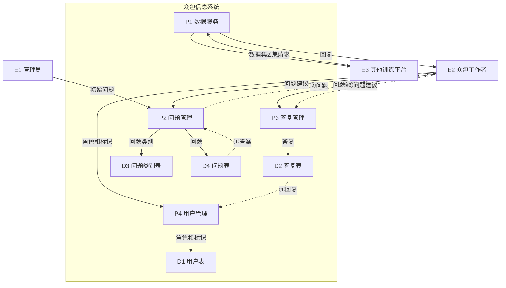

# 2023年下半年 软件设计师（中级）· 下午题案例分析（第1批）

## 📋 速查目录（按题型 → 跳转）

| 题型 | 考点 | 考纲位置 |
|------|------|----------|
| 试题一 | DFD 数据流图 · 上下文图与0层图 · 外部实体识别 · 数据存储识别 · 缺失数据流补充 · 父图子图平衡 | [[个人资料/笔记/软考/软件设计师-中级/知识点/09-UML建模|数据流图]] |
| 试题二 | 暂缺 | — |
| 试题三 | 暂缺 | — |
| 试题四 | 暂缺 | — |
| 试题五 | 暂缺（选答） | — |
| 试题六 | 暂缺（选答） | — |

---

## 试题一（15分）

### 【说明】

随着深度学习的广泛应用，现代聊天机器人系统需要大规模的训练数据集才能达到其最佳性能，而手动收集如此庞大的数据集需要耗费巨大的人力和时间成本。
现欲开发一众包信息系统来辅助收集训练数据集，其主要功能是:

(1) **用户管理**。众包工作者提供角色和标识，并存储在用户表中。

(2) **添加问题**。在不同情况下接收来自众包工作者和管理员输入的问题：众包工作者输入问题建议，管理员负责添加初始问题。将问题和问题类别分别进行存储。问题类别说明问题是由众包工作者还是管理员提供的。

(3) **答复问题**。众包工作者回答或拒绝系统随机分配的问题。答复流程是，如果回答问题则提供答案，如果拒绝问题则提供拒绝原因，如果回答问题数不足5个，继续展示问题，否则众包工作者提供问题建议。无论是回答还是拒绝，数据都存储在带有不同状态标记的答复表中。

(4) **数据服务**。根据其它训练平台的请求，为其提供问题、问题类别、回复的数据集。

现采用结构化方法对众包信息系统进行分析与设计，获得如图1所示的上下文数据流图和图2所示的0层数据流图。

### 【图示】

**图1：上下文数据流图**



**图2：0层数据流图**



> **说明**：虚线表示问题3要求补充的缺失数据流。

### 【问题1】

使用说明中的词语，给出图1中的实体E1~E3的名称。

#### 作答区

```text

E1：管理员；
E2：众包工作者；
E3：其他训练平台。

```

### 【问题2】

使用说明中的词语，给出图2中的数据存储D1~D4的名称。

#### 作答区

```text

D2：答复表；
D3：问题类别表；
D4：问题表。

```

### 【问题3】

根据说明和图中术语，补充图2中缺失的数据流及其起点和终点。

#### 作答区

```text

（1）答案：D4 → P2；
（2）答案：P2 → E2；
（3）问题建议：E2 → P3；
（4）回复：D2 → P4。

```

### 【问题4】

什么是分层数据流图中父图与子图的平衡？如何保持？

#### 作答区

```text

分层数据流图中父图与子图的平衡的意思是：父图中出现的加工中，数据的输入/输出数量应与子图中的一致。
保持平衡：父图/子图中如果有缺失，则补充。

```

---

## 试题二

暂缺

## 试题三

暂缺

## 试题四

暂缺

---

从下列的2道试题（试题五至试题六）中任选1道解答。
如果解答的试题数超过1道，则题号小的1道解答有效。

## 试题五

暂缺

## 试题六

暂缺

---

# 参考答案与解析

> 答案内容来自原答案 PDF；解析较少或缺失处已补充"解析"说明。若原 PDF 标为"暂缺"，此处保持暂缺并说明原因。

## 试题一

### 问题1

**答案：**

- E1：管理员
- E2：众包工作者
- E3：其它训练平台

根据1层数据流图，E1包含初始问题数据流，E2包含角色和标识、问题建议、回复、问题数据流，E3包含数据集、数据集请求数据流。对比题干信息即可得出。

**解析：**

解题时先确定系统边界，再从题干中的动作发起者、接收者识别外部实体；数据存储通常对应"文件、表、记录"等持久化名词；缺失数据流则通过父图/子图平衡和加工输入输出一致性检查补齐。

### 问题2

**答案：**

- D2：答复表
- D3：问题类别表
- D4：问题表

众包工作者提供角色和标识，并存储在用户表中 → D1为用户表；无论是回答还是拒绝，数据都存储在带有不同状态标记的答复表中 → D2为答复表；管理员负责添加初始问题，将问题和问题类别分别进行存储 → D4为问题表，D3为问题类别表。

**解析：**

解题时先确定系统边界，再从题干中的动作发起者、接收者识别外部实体；数据存储通常对应"文件、表、记录"等持久化名词；缺失数据流则通过父图/子图平衡和加工输入输出一致性检查补齐。

### 问题3

**答案：**

- E2→P3：问题建议
- E2→P2：问题建议
- P2→E2：问题
- D4→P2：答案

对比1层0层数据流图发现缺失问题建议数据流。题干中描述：众包工作者输入问题建议；如果回答问题数不足5个，继续展示问题，否则众包工作者提供问题建议。可得E2→P3问题建议、E2→P2问题建议。

**解析：**

解题时先确定系统边界，再从题干中的动作发起者、接收者识别外部实体；数据存储通常对应"文件、表、记录"等持久化名词；缺失数据流则通过父图/子图平衡和加工输入输出一致性检查补齐。

### 问题4

**答案：**

父图与子图之间平衡是指任何一张DFD子图边界上的输入/输出数据流必须与其父图对应加工的输入/输出数据流保持一致。父图中某个加工的一条数据流对应于子图中的几条数据流，而子图中组成这些数据流的数据项全体正好等于父图中的这条数据流，那么它们仍然是平衡的。

**解析：**

解题时先确定系统边界，再从题干中的动作发起者、接收者识别外部实体；数据存储通常对应"文件、表、记录"等持久化名词；缺失数据流则通过父图/子图平衡和加工输入输出一致性检查补齐。

## 试题二

### 整体

**答案：**

暂缺

**解析：**

原试题或原答案 PDF 中该部分标为暂缺；当前本地材料不足以可靠还原题干与标准答案。

## 试题三

### 整体

**答案：**

暂缺

**解析：**

原试题或原答案 PDF 中该部分标为暂缺；当前本地材料不足以可靠还原题干与标准答案。

## 试题四

### 整体

**答案：**

暂缺

**解析：**

原试题或原答案 PDF 中该部分标为暂缺；当前本地材料不足以可靠还原题干与标准答案。

## 试题五

### 整体

**答案：**

暂缺

**解析：**

原试题或原答案 PDF 中该部分标为暂缺；当前本地材料不足以可靠还原题干与标准答案。

## 试题六

### 整体

**答案：**

暂缺

**解析：**

原试题或原答案 PDF 中该部分标为暂缺；当前本地材料不足以可靠还原题干与标准答案。
