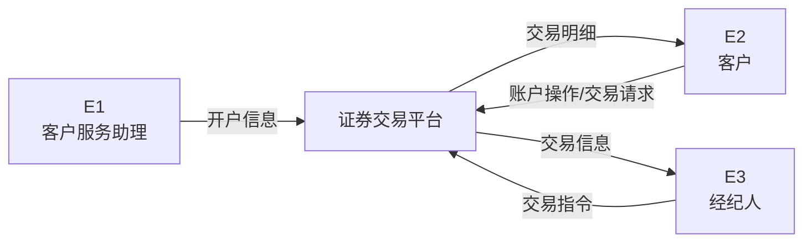
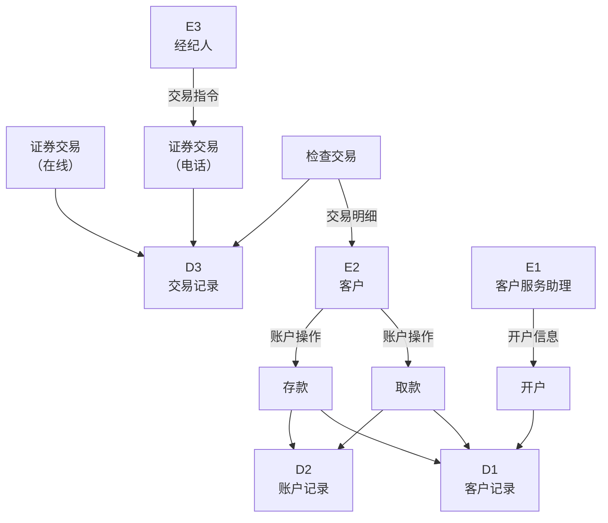
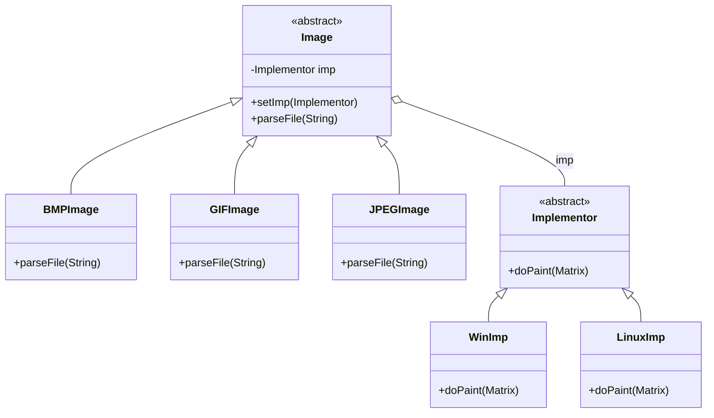
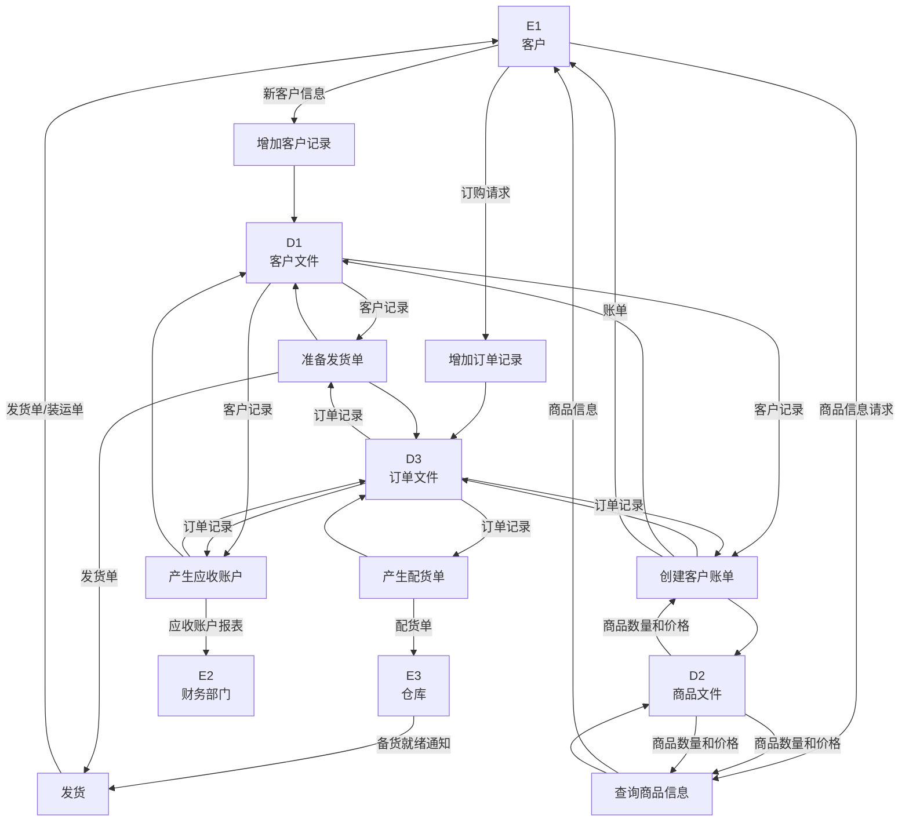
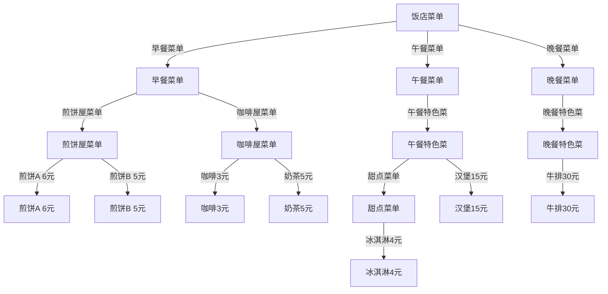
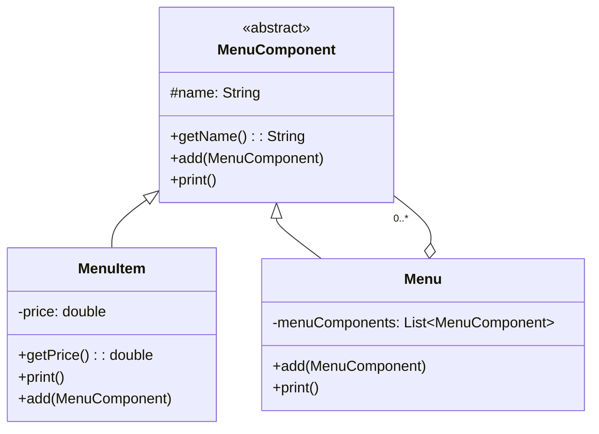

# 2024年下半年 软件设计师（中级）· 下午题案例分析

## 📋 速查目录（按题型 → 跳转）

| 题型 | 考点 | 考纲位置 |
|------|------|----------|
| 试题一 | 数据流图（DFD）· 上下文图与0层图 / 外部实体识别 / 缺失数据流补充 | [[个人资料/笔记/软考/软件设计师-中级/知识点/07-软件工程|数据流图]] |
| 试题二 | 算法设计 · 回溯法（C语言代码填空） | [[个人资料/笔记/软考/软件设计师-中级/知识点/04-数据结构与算法|回溯法]] |
| 试题三 | 设计模式 · 桥接（Bridge）模式（Java代码填空） | [[个人资料/笔记/软考/软件设计师-中级/知识点/08-面向对象与设计模式|桥接模式]] |
| 试题四 | 数据流图（DFD）· 订单处理系统 / 外部实体 / 数据存储 / 处理与数据流 | [[个人资料/笔记/软考/软件设计师-中级/知识点/07-软件工程|数据流图]] |
| 试题五 | 设计模式 · 组合（Composite）模式（Java代码填空） | [[个人资料/笔记/软考/软件设计师-中级/知识点/08-面向对象与设计模式|组合模式]] |
| 试题六 | 算法设计 · 0-1背包回溯法（伪代码填空 + 实例分析） | [[个人资料/笔记/软考/软件设计师-中级/知识点/04-数据结构与算法|回溯法]] |

---

## 试题一（25分）

阅读下列说明，回答问题1 至问题4，将解答填入答题纸的对应栏内。
### 【说明】

某证券交易所为了方便提供证券交易服务，欲开发一证券交易平台，该平台的主要功能如下：
（1）开户。根据客户服务助理提交的开户信息，进行开户，并将客户信息存入客户记录中，账户信息（余额等）存入账户记录中；
（2）存款。客户可以向其账户中存款，根据存款金额修改账户余额；
（3）取款。客户可以从其账户中取款，根据取款金额修改账户余额；
（4）证券交易。客户和经纪人均可以进行证券交易（客户通过在线方式，经纪人通过电话），将交易信息存入交易记录中；
（5）检查交易。平台从交易记录中读取交易信息，将交易明细返回给客户。
现采用结构化方法对该证券交易平台进行分析与设计，获得如图1-1 所示的上下文数据流图和图1-2 所示的0 层数据流图。

**图1-1 上下文数据流图（DFD）**



**图1-2 0层数据流图（DFD）**



### 【问题1】
使用说明中的词语，给出图1-1 中的实体E1-E3 的名称。

#### 作答区
```text

```

### 【问题2】
根据说明和图中的术语，补充图1-2 中缺失的数据流及其起点和终点。

#### 作答区
```text

```

### 【问题3】
实际的证券交易通常是在证券交易中心完成的，因此，该平台的"证券交易"功能需将交易信息传递给证券交易中心。针对这个功能需求，需要对图1-1 和图1-2 进行哪些修改，请用200 字以内的文字加以说明。

#### 作答区
```text

```

## 试题二（25分）

阅读下列说明和 C 代码，回答问题1，将解答填入答题纸的对应栏内。
### 【说明】

设某一机器由 $n$ 个部件组成，每一个部件都可以从 $m$ 个不同的供应商处购得。供应商 $j$ 供应的部件 $i$ 具有重量 $w_{ij}$ 和价格 $c_{ij}$。设计一个算法，求解总价格不超过上限 $cc$ 的最小重量的机器组成。
采用回溯法来求解该问题：
首先定义解空间。解空间由长度为 $n$ 的向量组成，其中每个分量取值来自集合 $\{1,2,\ldots,m\}$，将解空间用树形结构表示。
接着从根结点开始，以深度优先的方式搜索整个解空间。从根结点开始，根结点成为活结点，同时也成为当前的扩展结点。向纵深方向考虑第一个部件从第一个供应商处购买，得到一个新结点。判断当前的机器价格 $c_{11}$ 是否超过上限 $cc$，重量 $w_{11}$ 是否比当前已知的解（最小重量）大，若是，应回溯至最近的一个活结点；若否，则该新结点成为活结点，同时也成为当前的扩展结点，根结点不再是扩展结点。继续向纵深方向考虑第二个部件从第一个供应商处购买，得到一个新结点。同样判断当前的机器价格 $c_{11}+c_{21}$ 是否超过上限 $cc$，重量 $w_{11}+w_{21}$ 是否比当前已知的解(最小重量)大。若是，应回溯至最近的一个活结点；若否，则该新结点成为活结点，同时也成为当前的扩展结点，原来的结点不再是扩展结点。以这种方式递归地在解空间中搜索，直到找到所要求的解或者解空间中已无活结点为止。

### 【问题1】
### 【C代码】

#### 图片代码转写（回溯法 C 代码，空位保留）
```c
int n = 3;
int m = 3;
int cc = 4;
int w[3][3] = {{1,2,3}, {3,2,1}, {2,2,2}};
int c[3][3] = {{1,2,3}, {3,2,1}, {2,2,2}};
int bestW = 8;
int bestC = 0;
int bestX[3] = {0,0,0};
int cw = 0;
int cp = 0;
int x[3] = {0,0,0};

int backtrack(int i) {
    int j = 0;
    int found = 0;

    if (i > n - 1) {
        bestW = cw;
        bestC = cp;
        for (j = 0; j < n; j++) {
            /* （1）_____________ */
        }
        return 1;
    }

    if (cp <= cc) {
        found = 1;
    }

    for (j = 0; /* （2）________________ */; j++) {
        /* 第 i 个部件从第 j 个供应商购买 */
        /* （3）________________ */;
        cw = cw + w[i][j];
        cp = cp + c[i][j];

        if (cp <= cc && /* （4）________________ */) {
            if (backtrack(i + 1)) {
                found = 1;
            }
        }

        /* 回溯 */
        cw = cw - w[i][j];
        /* （5）________________ */;
    }
    return found;
}
```

#### 数据示例表

| 部件 \ 供应商 | 供应商1 (重量/价格) | 供应商2 (重量/价格) | 供应商3 (重量/价格) |
|---|---|---|---|
| 部件1 | 1 / 1 | 2 / 2 | 3 / 3 |
| 部件2 | 3 / 3 | 2 / 2 | 1 / 1 |
| 部件3 | 2 / 2 | 2 / 2 | 2 / 2 |

#### 作答区
```c
/* （1） ______________________________ */
/* （2） ______________________________ */
/* （3） ______________________________ */
/* （4） ______________________________ */
/* （5） ______________________________ */
```

## 试题三（25分）

阅读下列说明和Java代码，将应填入（n）处的字句写在答题纸的对应栏内。
### 【说明】

某图像预览程序要求能够查看BMP、JPEG 和GIF 三种格式的文件，且能够在Windows 和Linux 两种操作系统上运行。程序需具有较好的扩展性以支持新的文件格式和操作系统。为满足上述需求并减少所需生成的子类数目，现采用桥接模式进行设计，得到如图6-1 所示的类图。

**图6-1 桥接模式类图**



### 【问题1】

#### 图片代码转写（Bridge，Java，空位保留）
```java
import java.util.*;

class Matrix {
    // 各种格式的文件最终都被转化为像素矩阵
}

abstract class Implementor {
    public /* （1）________________ */; // 显示像素矩阵 m
}

class WinImp extends Implementor {
    public void doPaint(Matrix m) {
        // 调用 Windows 系统的绘制函数绘制像素矩阵
    }
}

class LinuxImp extends Implementor {
    public void doPaint(Matrix m) {
        // 调用 Linux 系统的绘制函数绘制像素矩阵
    }
}

abstract class Image {
    public void setImp(Implementor imp) { this.imp = imp; }
    public abstract void parseFile(String fileName);
    protected Implementor imp;
}

class GIFImage extends Image {
    public void parseFile(String fileName) {
        Matrix m = new Matrix();
        // 此处解析 GIF 文件并获得一个像素矩阵对象 m
        /* （2）________________ */; // 显示像素矩阵 m
    }
}

class Main {
    public static void main(String[] args) {
        // 在 Linux 操作系统上查看 demo.gif 图像文件
        Image image = /* （3）________________ */;
        Implementor imageImp = /* （4）________________ */;
        /* （5）________________ */;
        image.parseFile("demo.gif");
    }
}
```

#### 作答区
```java
/* （1） ______________________________ */
/* （2） ______________________________ */
/* （3） ______________________________ */
/* （4） ______________________________ */
/* （5） ______________________________ */
```

## 试题四（25分）

阅读下列说明，回答问题1 至问题3，将解答填入答题纸的对应栏内。
### 【说明】

某时装邮购提供商拟开发订单处理系统，用于处理客户通过电话、传真、邮件或Web 站点所下订单。其主要功能如下：
（1）增加客户记录。将新客户信息添加到客户文件，并分配一个客户号以备后续使用。
（2）查询商品信息。接收客户提交的商品信息请求，从商品文件中查询商品的价格和可订购数量等商品信息，返回给客户。
（3）增加订单记录。根据客户的订购请求及该客户记录的相关信息，产生订单并添加到订单文件中。
（4）产生配货单。根据订单记录产生配货单，并将配货单发送给仓库进行备货；备好货后，发送备货就绪通知。如果现货不足，则需向供应商订货。
（5）准备发货单。从订单文件中获取订单记录，从客户文件中获取客户记录，并产生发货单。
（6）发货。当收到仓库发送的备货就绪通知后，根据发货单给客户发货；产生装运单并发送给客户。
（7）创建客户账单。根据订单文件中的订单记录和客户文件中的客户记录，产生并发送客户账单，同时更新商品文件中的商品数量和订单文件中的订单状态。
（8）产生应收账户。根据客户记录和订单文件中的订单信息，产生并发送给财务部门应收账户报表。
现采用结构化方法对订单处理系统进行分析与设计，获得如图1-1 所示的顶层数据流图和图1-2 所示的0 层数据流图。

**图1-1 顶层数据流图（DFD）**

```mermaid
flowchart LR
    E1["E1<br/>客户"] -->|"商品信息请求/订购请求"| P["订单处理系统"]
    E2["E2<br/>财务部门"] <--|"应收账户报表"| P
    E3["E3<br/>仓库"] <-->|"配货单/备货就绪通知"| P
    P -->|"发货单/装运单/账单"| E1
    Supplier["供应商"] -.->|"订货"| P
```

**图1-2 0层数据流图（DFD）**



### 【问题1】
使用说明中的词语，给出图1-1 中的实体E1〜E3 的名称。

#### 作答区
```text

```

### 【问题2】
使用说明中的词语，给出图1-2 中的数据存储D1〜D3 的名称。

#### 作答区
```text

```

### 【问题3】
（1）给出图1-2 中处理（加工）P1 和P2 的名称及其相应的输入输出流。
（2）除加工P1 和P2 的输入输出流外，图1-2 还缺失了1 条数据流，请给出其起点和终点。

#### 作答区
```text
（1）：
（2）：
```

## 试题五（25分）

阅读下列说明和 Java 代码，将应填入（n）处的字句写在答题纸的对应栏内。
### 【说明】

某饭店在不同的时段提供多种不同的餐饮，其菜单的结构图如图6-1 所示。

**图6-1 饭店菜单结构图**



现采用组合（Composition)模式来构造该饭店的菜单，使得饭店可以方便地在其中增加新的餐饮形式，得到如图6-2 所示的类图。其中MenuComponent 为抽象类，定义了添加（add)新菜单和打印饭店所有菜单信息（print)的方法接口。类Menu 表示饭店提供的每种餐饮形式的菜单，如煎饼屋菜单、咖啡屋菜单等。每种菜单中都可以添加子菜单，例如图6-1 中的甜点菜单。类MenuItem 表示菜单中的菜式。

**图6-2 组合模式类图**



### 【问题1】
### 【Java代码】

#### 图片代码转写（Composite，Java，空位保留）
```java
import java.util.*;

/* （1）________________ */ MenuComponent {
    protected String name;
    /* （2）________________ */; // 添加新菜单
    public abstract void print(); // 打印菜单信息
    public String getName() { return name; }
}

class MenuItem extends MenuComponent {
    private double price;
    public MenuItem(String name, double price) {
        this.name = name;
        this.price = price;
    }
    public double getPrice() { return price; }
    public void add(MenuComponent menuComponent) { return; }
    public void print() {
        System.out.print(" " + getName());
        System.out.println("," + getPrice());
    }
}

class Menu extends MenuComponent {
    private List<MenuComponent> menuComponents = new ArrayList<MenuComponent>();
    public Menu(String name) { this.name = name; }
    public void add(MenuComponent menuComponent) {
        menuComponents./* （3）________________ */;
    }
    public void print() {
        System.out.print("\n" + getName());
        System.out.println("," + "--------------------");
        Iterator iterator = menuComponents.iterator();
        while (iterator.hasNext()) {
            MenuComponent menuComponent = (MenuComponent) iterator.next();
            /* （4）________________ */;
        }
    }
}

class MenuTestDrive {
    public static void main(String args[]) {
        MenuComponent allMenus = new Menu("ALL MENUS");
        MenuComponent dinerMenu = new Menu("DINER MENU");
        allMenus.add(dinerMenu);
        /* （5）________________ */; // 打印饭店所有菜单的信息
    }
}
```

#### 作答区
```java
/* （1） ______________________________ */
/* （2） ______________________________ */
/* （3） ______________________________ */
/* （4） ______________________________ */
/* （5） ______________________________ */
```

## 试题六（25分）

阅读下列说明，回答问题1 至问题2，将解答填入答题纸的对应栏内。
### 【说明】

某地有一证券交易中心，采用 0-1 背包问题的回溯法进行证券包销。证券包销的具体描述如下：

该证券交易中心需要从多个项目中选择进行包销。每个项目有不同的投资额和收益额。包销的总资金有限制。包销的目标是在总资金限制内最大化总收益。

现采用回溯法求解此 0-1 背包问题。

**0-1 背包问题实例数据表**

| 物品 | 重量 w | 价值 v |
|------|--------|--------|
| 物品1 | 5 | 10 |
| 物品2 | 10 | 17 |
| 物品3 | 10 | 18 |
| 物品4 | 7 | 12 |
| 物品5 | 5 | 8 |

背包容量 W = 22

### 【问题1】
用回溯法求解此 0-1 背包问题，请填充下面伪代码中（1)〜（4)处空缺。
回溯法是一种系统的搜索方法。在确定解空间后，回溯法从根结点开始，按照深度优先策略遍历解空间树，搜索满足约束条件的解。对每一个当前结点，若扩展该结点已经不满足约束条件，则不再继续扩展。为了进一步提髙算法的搜索效率，往往需要设计一个限界函数，判断并剪枝那些即使扩展了也不能得到最优解的结点。现在假设已经设计了 $\mathrm{BOUND}(v,w,k,W)$ 函数，其中 $v$、$w$、$k$ 和 $W$ 分别表示当前已经获得的价值、当前背包的重量、已经确定是否选择的物品数和背包的总容量。对应于搜索树中的某个结点， 该函数值表示确定了部分物品是否选择之后，对剩下的物品在满足约束条件的前提下进行选择可能获得的最大价值，若该价值小于等于当前已经得到的最优解，则该结点无需再扩展。
下面给出0-1 背包问题的回溯算法伪代码。
函数参数说明如下：
$W$：背包容量；$n$：物品个数；$w$：重量数组；$v$：价值数组；$fw$：获得最大价值时背包的重量；$fp$：背包获得的最大价值；$X$：问题的最优解。
变量说明如下：
$CW$：当前的背包重量；$cp$：当前获得的价值；$k$：当前考虑的物品编号；$Y$：当前已获得的部分解。

#### 图片伪代码转写（0-1 背包，空位保留）
```text
BKNAP(W, n, w, v, fw, fp, X)
1  CW <- cp <- 0
2  /* （1）________________ */
3  fp <- -1
4  while true
5      while k <= n and CW + w[k] <= W do
6          /* （2）________________ */
7          cp <- cp + v[k]
8          Y[k] <- 1
9          k <- k + 1
10     if k > n then
11         if fp < cp then
12             fp <- cp
13             fw <- CW
14             k <- n
15             X <- Y
16     else Y[k] <- 0
17     while BOUND(cp, CW, k, W) <= fp do
18         while k != 0 and Y[k] != 1 do
19             /* （3）________________ */
20         if k = 0 then return
21         Y[k] <- 0
22         CW <- CW - w[k]
23         cp <- cp - v[k]
24         /* （4）________________ */
```

#### 作答区
```text
（1）：
（2）：
（3）：
（4）：
```

### 【问题2】
考虑下表所示的实例，假设有3 个物品，背包容量为22。

**实例数据表**

| 物品 | 重量 w | 价值 v |
|------|--------|--------|
| 物品1 | 5 | 10 |
| 物品2 | 10 | 17 |
| 物品3 | 10 | 18 |

下图是根据上述算法构造的搜索树，其中结点的编号表示了搜索树生成的顺序，边上的数字1/0分别表示选择/不选择对应物品。除了根结点之外，每个左孩子结点旁边的上下两个数字分别表示当前背包的重量和已获得的价值，右孩子结点旁边的数字表示扩展了该结点后最多可能获得的价值。

**回溯法搜索树（简化表示）**

```text
搜索树结构说明：
- 结点编号表示生成顺序
- 左子节点（边标记1）：选择对应物品，显示 [当前重量/当前价值]
- 右子节点（边标记0）：不选择对应物品，显示 [限界值]
- 根结点为起始状态
```

为获得最优解，应该选择物品（5)，获得的价值为（6)。

若采用穷举法搜索整个解空间，则搜索树的结点数为（7)，而用了上述回溯法，搜索树的结点数为（8)。

#### 作答区
```text
（5）：
（6）：
（7）：
（8）：
```

---

# 参考答案与解析

> 答案内容来自原答案 PDF；解析较少或缺失处已补充"解析"说明。若原 PDF 标为"暂缺"，此处保持暂缺并说明原因。

## 试题一

### 问题1

**答案：**

E1：客户服务助理，E2：客户，E3：经纪人。
，本题考查采用结构化方法进行系统分析与设计，主要考查数据流图（DFD）的应用，是传统的考题，考点与往年类似，要求考生细心分析题目中所描述的内容。
本题题干描述较短，更易于分析。
DFD 是面向数据流建模的结构化分析与设计方法的重要工具，是一种便于用户理解、分析系统数据流程的图形化建模工具，是系统逻辑模型的重要组成部分。DFD将系统建模成输入、加工（处理）、输出的模型，即流入软件的数据对象、经由加工的转换、最后以结果数据对象的形式流出软件，并采用分层的方式自顶向下建模各层数据流图，来表示不同详细程度的模型。上下文数据流图（顶层DFD）通常用来确定系统边界，将待开发系统看作一个大
的加工，然后根据哪些外部实体为系统提供输入数据流，以及哪些外部实体接受系统发送的数据流，建模出的上下文图中唯一的一个加工和一些外部实体，以及这两者之间的输入输出数据流。系统边界的变化可能使外部实体成为系统内部加工或内部加工变为外部实体。
在上下文图中确定的系统外部实体以及与外部实体的输入输出数据流的基础上，将上下文DFD 中的加工分解成多个加工，识别这些加工的输入输出数据流，使得所有上下文DFD 中的输入数据流，经过这些加工之后变换成上下文DFD 的输出数据流，建模0 层DFD。根据0 层DFD 中加工的复杂程度进一步建模加工的内容。
在建模分层DFD 时，根据需求情况可以将数据存储建模在不同层次的DFD 中。建模时，需要注意加工和数据流的正确使用，一个加工必须既有输入又有输出；数据流必须和加工相关，即从加工流向加工、数据源流向加工或加工流向数据源。
注意要在绘制下层数据流图时要保持父图与子图平衡。父图中某加工的输入输出数据流必须与它的子图的输入输出数据流在数量和名字上相同，或者父图中的一个输入（或输出）数据流对应于子图中几个输入（或输出）数据流，而子图中组成这些数据流的数据项全体正好是父图中的这一条数据流。
本问题考查的是上下文DFD，要求确定外部实体。在上下文DFI）中，待系统名称"证券交易平台"作为唯一加工的名称，外部实体为这个唯一加工提供输入数据流或者接收其输出数据流。通过考查系统的主要功能，发现系统中涉及到客户服务助理、客户和经纪人，没有提到其他与系统交互的外部实体。根据描述（1）中"客户服务助理提交的开户信息"，（2）中"客户可以向其账户中存款"、（3）中"客户可以从其账户中取款"，（1）中"客户和经纪人均可以进行证券交易"，以及（5）中"将交易明细返回给客户"等信息，对照图1-1，从而即可确定E1为"客户服务助理"实体，E2 为"客户"实体，E3 为"经纪人"实体。

**解析：**

解题时先确定系统边界，再从题干中的动作发起者、接收者识别外部实体；数据存储通常对应"文件、表、记录"等持久化名词；缺失数据流则通过父图/子图平衡和加工输入输出一致性检查补齐。

### 问题2

**答案：**

本问题要求确定图1-2 中0 层数据流图中的数据存储。重点分析说明中与数据存储有关的描述。说明（1）中"并将客户信息存入客户记录中，账户信息（余额等）存入账户记录中"，可知D1 为客户记录、D2 为账户记录；说明（5）中"平台从交易记录中读取交易信息"，可知D3 为交易记录。

**解析：**

解题时先确定系统边界，再从题干中的动作发起者、接收者识别外部实体；数据存储通常对应"文件、表、记录"等持久化名词；缺失数据流则通过父图/子图平衡和加工输入输出一致性检查补齐。

### 问题3

**答案：**

**图：缺失数据流补充示意图（原 PDF 第12页，请参阅原文件）**

本问题要求补充缺失的数据流及其起点和终点。对照图1-1 和图1-2 的输入、输出数据流，数量和名称均相同，所以需要从内部确定缺失的数据流。
考查说明中的功能，先考查说明（2）/（3）中"客户可以向其账户中存款/取款，根据存款金额修改账户余额"，加工存款与取款分别需要有到数据存储账户记录（D2）标识余额的数据流，图1-2 中加工存款与取款没有到数据存储账户记录的数据流。再考査说明（4）中"客户和经纪人均可以进行证券交易（客户通过在线方式，经纪人通过电话），将交易信息存入交易记录中"，图1-2 中加工证券交易（在线）和证券交易（电话）分别需要有到交易记录标识交易信息的数据流。

**解析：**

解题时先确定系统边界，再从题干中的动作发起者、接收者识别外部实体；数据存储通常对应"文件、表、记录"等持久化名词；缺失数据流则通过父图/子图平衡和加工输入输出一致性检查补齐。

### 问题4

**答案：**

在图1-1 中，将"证券交易中心"作为外部实体，添加从"证券交易平台"到此外部实体的数据流"交易信息"。
在图1-2 中，将证券交易中心作为外部实体，添加从加工"证券交易（在线）"到此外部实体的数据流"交易信息"，添加从加工"证券交易（电话）"到此外部实体的数据流"交易信息"。
DFD 中，外部实体可以是用户，可以是其他与本系统交互的系统。如果某功能交互的是外部系统，本题中证券交易通常是在证券交易中心完成的，即证券交易中心。此时证券交易中心即为外部实体，而非本系统内部加工，因此需要对图1-1 和图1-2 进行修改，添加外部实体"证券交易中心"，并将数据流交易信息的终点全部改为证券交易中心。在图1-1 中，将"证券交易中心"作为外部实体，添加从"证券交易平台"到此外部实体的数据流"交易信息"。在图1-2 中，将"证券交易中心"作为外部实体，添加从加工"证券交易（在线）"到此外部实体的数据流"交易信息"，添加从加工"证券交易（电话）"到此外部实体的数据流"交易信息"。

**解析：**

解题时先确定系统边界，再从题干中的动作发起者、接收者识别外部实体；数据存储通常对应"文件、表、记录"等持久化名词；缺失数据流则通过父图/子图平衡和加工输入输出一致性检查补齐。

## 试题二

### 问题1

**答案：**

(1) bestX[j] = x[j]
(2) j < m
(3) x[i] = j
(4) cw < bestW
(5) cp = cp - c[i][j]

**解析：**

，本题考查算法的设计和分析技术中的回溯法。
回溯法是一种系统搜索问题解的方法，在包含问题所有解的解空间树中，按照深度优先的策略，从根结点出发搜索解空间树。算法在到达解空间树的任一结点时，总是先判断该结点是否肯定不包含问题的解。若肯定不包含，则跳过对以该结点为根的子树的系统搜索，逐层向其祖先结点回溯；否则进入该子树，继续按深度优先的策略进行搜索。回溯法在求问题的最优解时，要回溯到根，且根结点的所有子树都已经被搜索遍才结束。
根据上述思想和题干说明，对实例：部件数n = 3,厂商数m=3,具体的重量和价格如下表所示：

| 部件 \ 供应商 | 供应商1 | 供应商2 | 供应商3 |
|---|---|---|---|
| 部件1 | 1 / 1 | 2 / 2 | 3 / 3 |
| 部件2 | 3 / 3 | 2 / 2 | 1 / 1 |
| 部件3 | 2 / 2 | 2 / 2 | 2 / 2 |

**回溯法解空间树（原 PDF 图4-1，请参阅原文件）**

图4-1 中结点编号表示生成该结点的顺序。边上的编号表示哪个部件选择哪个厂商， 如x(2)=1，表示第2 个部件来自厂商1。结点旁边的两个数字表示当前解或部分解对应的重量和价格，如2: 2 表示重量为2，价格为2。从图4-1 可以看出，最优解是结点20 表示的解，即x(1)=1, x(2)=3, x(3)=1,即第1 个部件来自厂商1，第2 个部件来自厂商 3,第3 个部件来自厂商1,总的价格和重量分别为4 和4。当然，本实例的最优解还可以是 x(1)=1，x(2)=3, x(3)=2 和 x(1)=1, x(2)=3, x(3)=3,分别对应解空间树上的21 号和22 号结点。
代码中的空(1)处是得到问题解之后，将搜索过程中产生的重量cw、价格cp 和解x 放到最终重量bestw、价格bestc 和解bestX 中，因此空格(1)处填写bestX[j] = x[j]。空(2)处的for 循环是考虑第i 个部件选择哪个厂商，因此j 从0 到m-1 依次检查，此处应填j<m。对搜索过程中产生的重量cw、价格cp 和解x 的值进行设置，因此空(3) 处应填x[i]=j，表示第i 个部件选择厂商j。空(4)是判断当前结点是否要扩展，若当前获得的价格比目前最优解更优，且重量没有超过当前得到的最优重量，即cp<=cc 且 cw<bestw,则扩展当前结点，否则回溯。在回溯过程中，需要把原来选择的部件的价格和重量从搜索过程中产生的重量cw 和价格cp 中去掉,因此空(5)应填cp = cp - c[i][j]。

**解析：**

算法题重点是维护状态含义和循环/递归不变式：动态规划看状态转移与边界，回溯看选择、撤销和剪枝条件，复杂度由状态数量或搜索树规模决定。

## 试题三

### 问题1

**答案：**

(1) abstract void doPaint(Matrix m)
(2) imp.doPaint(m)
(3) new GIFImage()
(4) new LinuxImp()
(5) image.setImp(imageImp)

**解析：**

桥接（Bridge)模式是典型的结构型设计模式。结构型设计模式涉及如何组合类和对象以获得更大的结构。结构型模式采用继承机制来组合接口或实现。
桥接模式的设计意图是将抽象部分与其实现部分分离，使它们都可以独立地变化。
桥接模式的结构如下图所示。

**桥接模式结构图（原 PDF 图6-2，请参阅原文件）**

其中：
- Abstraction 定义抽象类的接口，维护一个指向Implementor 类型对象的指针。
- RefinedAbstraction 扩充由Abstraction 定义的接口。
- Implementor 定义实现类的接口，该接口不一定要与Abstraction 的接口完全一致; 事实上这两个接口可以完全不同。一般来说，Implementor 接口仅提供基本操作, 而Abstraction 定义了基于这些基本操作的较高层次的操作。
- ConcreteImplementor 实现Implementor 接口并定义它的具体实现。
Bridge 模式适用于：
- 不希望在抽象和它的实现部分之间有一个固定的绑定关系。例如，这种情况可能是因为，在程序运行时刻实现部分应可以被选择或者切换。
- 类的抽象以及它的实现都应该可以通过生成子类的方法加以扩充。这是Bridge 模式使得开发者可以对不同的抽象接口和实现部分进行组合，并分别对它们进行扩充。
- 对一个抽象的实现部分的修改应对客户不产生影响，即客户代码不必重新编译。
- (C++)想对客户完全隐藏抽象的实现部分。
- 有许多类要生成的类层次结构。
- 想在多个对象间共享实现（可能使用引用计数)，但同时要求客户并不知道这一点。
对比图6-1 可知，以类Image 为基类的继承结构对应的是桥接模式中的Abstraction 继承结构。题目所给的Java 源代码已经将桥接模式的基本框架给出了，所需填写的空主要考察的是如何在实际问题中应用桥接模式。
第（1）空考查的是桥接模式中实现类的接口，这个接口在基类Implementor 中定义，由其派生类进行重置。在Java 中可以采用抽象类和抽象方法来进行实现。结合派生类WinImp 和LinuxImp 的代码，可知（1）处应填写抽象方法abstract void doPaint(Matrix m)。
第（2）空考查的是Image 这个继承结构的实现。在这个继承结构中，需要调用Implementor 中定义的接口，即Implementor::doPaint。所以（2）处应填写imp.doPaint(m)。
(3)~(5)空考查的是桥接模式的使用。(3)、(4)处分别创建两个抽象类的引用，分别应填写new GIFImage()、new LinuxImp()。第（5）空实现这两个继承结构之间的聚集关系，因此应填写image.setImp(imageImp)。

**解析：**

程序填空题先根据设计模式角色确定类之间的职责，再结合上下文类型、返回值和调用点补全声明或语句；若同一模式有 Java/C++ 两种写法，关键是保证抽象接口、具体类和客户端调用方向一致。

## 试题四

### 问题1

**答案：**

E1：客户，E2：财务部门，E3：仓库。

**解析：**

本问题考查顶层DFD。顶层DFD 一般用来确定系统边界，将待开发系统看作一个加工，因此图中只有唯一的一个处理和一些外部实体，以及这两者之间的输入输出数据流。题目要求根据描述确定图中的外部实体。根据题目中的描述，并结合已经在顶层数据流图中给出的数据流进行分析。从题目的说明中可以看出：客户提交商品信息请求、订购请求等；将配货单发送给仓库、仓库向系统发送备货就绪通知；发送给财务部门应收账户报表。由此可知该订单系统有客户、仓库和财务部门三个外部实体。对应图1-1 中数据流和实体的对应关系，可知E1 为客户，E2 为财务部门，E3 为仓库。本题中需注意说明（4）中向供应商订货是系统外部的行为，因此，供应商并非本系统的外部实体。

### 问题2

**答案：**

**解析：**

本问题考查0 层DFD 中数据存储的确定。根据说明中的以下描述：将新客户信息添加到客户文件；从商品文件中查询商品的价格和可订购数量等商品信息；产生订单并添加到订单文件中，得出数据存储为客户文件、商品文件以及订单文件，再根据图1-2 中D1 的输入和输出数据流均为客户记录，D2 的输入数据流为从处理"创建客户账单"来的新商品数量，输出数据流为到处理"查询商品信息"的商品数量和价格，D3 的输入数据流为从处理"增加客户订单"来的订单，可知，D1 为客户文件，D2 为商品文件，D3 为订单文件。

### 问题3

**答案：**

(1) 处理（加工）名称，数据流。

| 处理 | 名称 | 输入流 | 输出流 |
|------|------|--------|--------|
| P1 | 产生配货单 | 订单记录（D3→P1） | 配货单（P1→E3仓库） |
| P2 | 准备发货单 | 订单记录（D3→P2）、客户记录（D1→P2） | 发货单（P2→P6发货） |

(2) 缺失数据流：客户记录，D1（客户文件）→ P7（创建客户账单）

**解析：**

本问题考查0 层DFD 中缺失的处理和数据流。从说明中的描述功能和图1-2,可知 产生配货单和准备发货单没有在图1-2 中，即缺少两个处理：产生配货单和准备发货单。 根据说明（4）中的描述：根据订单记录产生配货单，并将配货单发送给仓库进行备货； 备好货后，发送备货就绪通知。可知，产生配货单的输入流为订单记录，该输入流的起点为订单文件（D3)，输出流为配货单，其终点为仓库（E3)。根据说明（5）中的描述: 从订单文件中获取订单记录，从客户文件中获取客户记录，并产生发货单。可知，准备发货单的输入流为订单记录和客户记录，订单记录的起点为订单文件，客户记录的起点为客户文件；输出流为发货单。再根据说明（6）中处理发货的描述：根据发货单给客户发货，发货单的终点为处理发货。产生配货单和准备发货单分别对应P1 和P2 (或P2 和P1)。
P1 和P2 及其输入输出流均识别出来之后，再对照说明和图1-2, 以找出缺少的另外一条数据流。对照说明（7）中的描述：根据订单文件中的订单记录和客户文件中的客户记录，产生并发送客户账单。因此，创建客户账单缺少一条输入流：客户记录，其起点为客户文件（D1)。

## 试题五

### 问题1

**答案：**

(1) abstract class 或 public abstract class
(2) public abstract void add(MenuComponent menuComponent) 或 abstract void add(MenuComponent menuComponent) 或 protected abstract void add(MenuComponent menuComponent)
(3) add(menuComponent)
(4) menuComponent.print()
(5) allMenus.print()

**解析：**

Composite 模式将对象组合成树形结构以表示"整体-部分"的层次结构，其中的组合对象使得你可以组合基元对象以及其他的组合对象，从而形成任意复杂的结构。 Composite 模式使得用户对单个对象和组合对象的使用具有一致性。

**组合模式结构图（原 PDF，请参阅原文件）**

其中：
- 类Component 为组合中的对象声明接口，在适当的情况下，实现所有类共有接口的缺省行为，声明一个接口用于访问和管理Component 的子部件：
- 类Leaf 在组合中表示叶节点对象，叶节点没有子节点；并在组合中定义图元对象的行为；
- 类Composite 定义有子部件的那些部件的行为，存储子部件，并在Component 接口中实现与子部件有关的操作；
- 类Client 通过Component 接口操纵组合部件的对象。
下列情况可以使用Composite 模式：
(1) 表示对象的整体-部分层次结构；
(2) 希望用户忽略组合对象与单个对象的不同，用户将统一地使用组合结构中的所有对象。
试题六将组合模式应用到饭店菜单的构造中。图6-2 中的类MenuComponent 对应上图中的Component，MenuItem 对应Leaf，Menu 对应Composite。在实现时，通常都会把Component 定义为抽象类。
在Java 中，用abstract 关键字限定的类即为抽象类，所以（1）处应填入abstract class。
(2)处根据注释，这里应该定义功能为"添加新菜单"的成员函数。在子类MenuItem 和Menu 中可以看到，都有add 成员函数，说明子类中重置了父类中的成员函数。所以(2) 处应填入 public abstract void add(MenuComponent menuComponent)。
由图6-2 可以看出，Menu 中包含了MenuComponent 的对象集合。程序中用Java 中的list 来实现这个聚集关系，这样就可以利用list 中提供的各种方法了。list 中用于添加元素的方法是add, 所以（3）处应填入add(menuComponent)。
(4) 处出现在方法print 中，其功能是打印出所有菜单的信息。这里使用了list 中的迭代器类iterator,遍历每个子菜单，并调用子菜单中定义的print 方法打印该子菜单的信息。（4）处应填入menuComponent.print()。
为了能够在main 中打印出所有的菜单信息，必须使用表示菜单结构中最顶层菜单的对象来调用print，因此（5）处应填入allMenus.print()。

**解析：**

程序填空题先根据设计模式角色确定类之间的职责，再结合上下文类型、返回值和调用点补全声明或语句；若同一模式有 Java/C++ 两种写法，关键是保证抽象接口、具体类和客户端调用方向一致。

## 试题六

### 问题1

**答案：**

**0-1 背包回溯算法详解图（原 PDF 图，请参阅原文件）**

**解析：**

解析补充：该题应从题干约束、图示元素和答案中的关键词逐项对应，先完成直接匹配，再检查名称、方向和数量是否与题目要求一致。

### 问题2

**答案：**

**搜索树与实例分析图（原 PDF 图，请参阅原文件）**

(5) 物品2 和物品3
(6) 35
(7) 15
(8) 8

**解析：**

根据问题1 中给出的伪代码运行该实例，可以很容易得到此0-1 背包问题的最优解，应该选择物品2 和物品3，此时背包的重量为10+10=20,获得的价值为17+18=35。若采用穷举法搜索整个解空间，即要构造一颗完全二叉树，此时搜索树的结点数应为2^4-1=15,而采用了上述回溯法，搜索树的结点数仅为8 个，如上图所示。

**解析：**

算法题重点是维护状态含义和循环/递归不变式：动态规划看状态转移与边界，回溯看选择、撤销和剪枝条件，复杂度由状态数量或搜索树规模决定。
